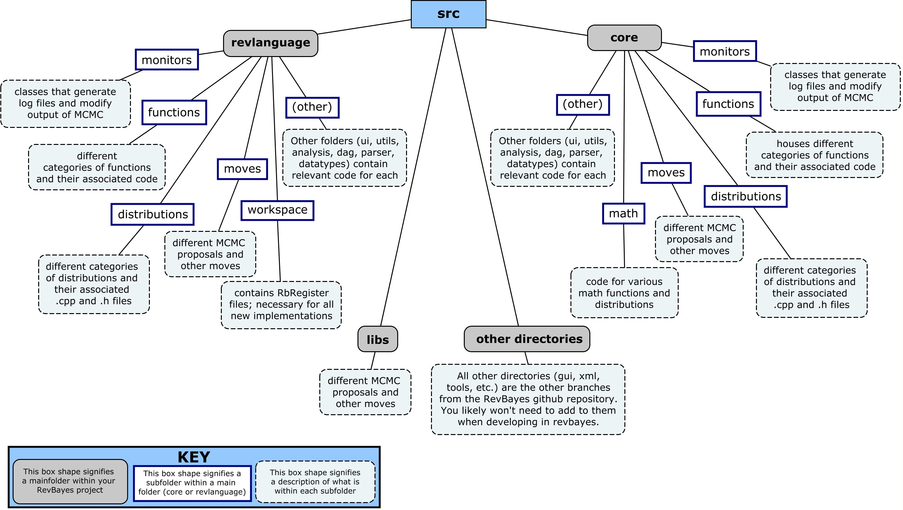

To develop in RevBayes, it is important to be familiar with the overall file structure.

Below is a visual represenation of the directory/file structure of a RevBayes project.
Notice the repetition in naming within the core and revlanguage directories. This may seem confusing at first, so keep the following explanation in mind for clarity:

 * The **core** directory contains all hard-coded functionality for RevBayes.
 
 * The **revlanguage** directory is essentially a wrapper for all code within the core directory. The code within **revlanguage** is written to match the scripting Rev language syntax.

For more specific information on functions and distributions, and for general information on implementing in RevBayes, navigate to the 'Implementing functions, distributions, and moves' section of this Developer's guide. 
 

 
 
