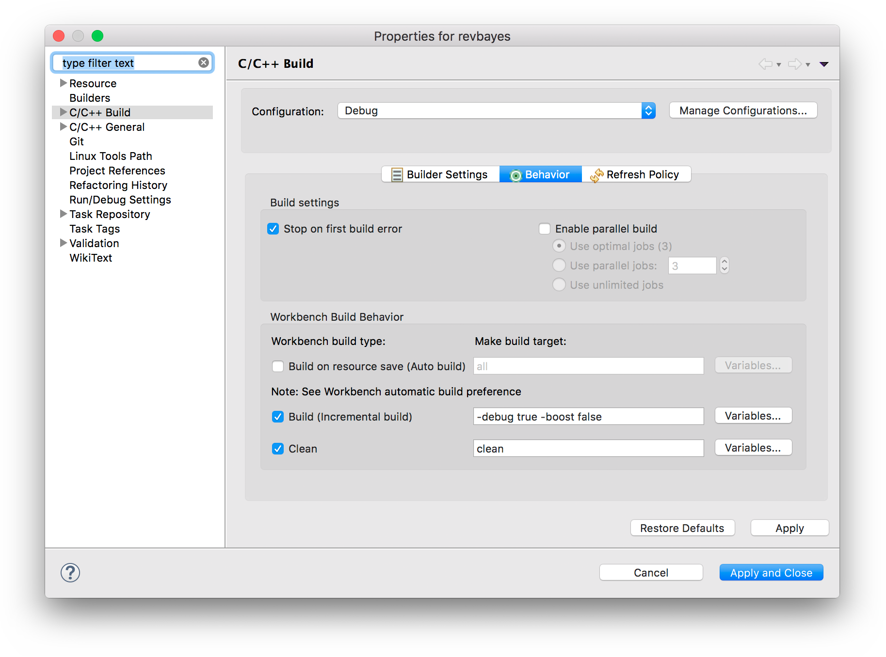
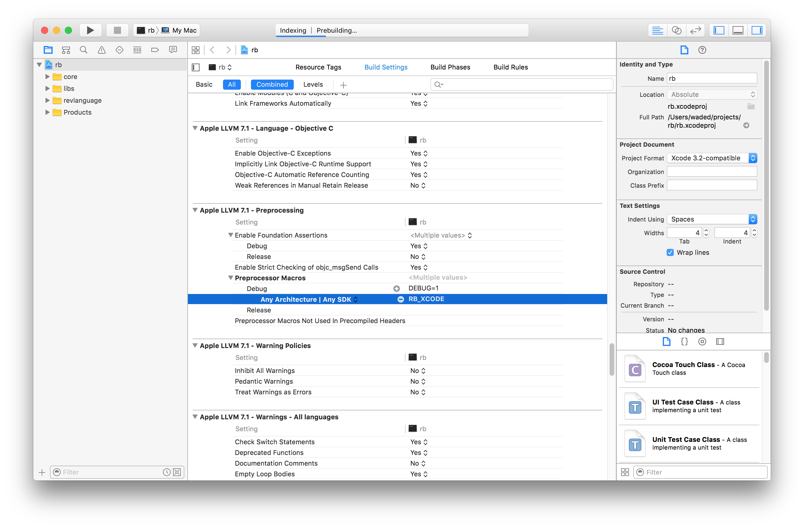

It is easy to use an IDE to develop RevBayes such as XCode, Eclipse Oxygen, or Netbeans. You can also useyour favorite text editor (e.g. vim or emacs). 
This page will provide some helpful tips on how to set up your development enviroment.
See the [Software]({{site.baseurl}}/software/) page for instructions on how to obtain the source code.

<br><br>

----------------------

Setting up Eclipse for RevBayes development
================================
{:.section}

Eclipse is a Java-based, cross-platform IDE with lots of nice features that make it convenient for RevBayes development. First, it's cross-platform, and unlike Xcode, you can use any compiler you like (not just `clang`).

Prerequisites
----------------------
- To compile RevBayes using Eclipse, you must install [CMake](https://cmake.org/install/) and its [command line tools](https://stackoverflow.com/questions/30668601/installing-cmake-command-line-tools-on-a-mac). This is very easy if you have [homebrew](https://brew.sh/) installed (`brew install cmake`)
- You must also have a C++ compiler. If you are using a Mac, you can use `clang` (included with [XCode](https://developer.apple.com/xcode/)), or you can install [`gcc`](https://gcc.gnu.org/) (e.g. via homebrew `brew install gcc`).

Installing Eclipse CDT
----------------------
To start writing C++ in Eclipse, you must obtain the Eclipse CDT (C/C++ Development Tooling) package. You can download a distribution of Eclipse that comes prepackaged with CDT from the [CDT Downloads page](https://cmake.org/download/).

If you already have Eclipse installed you can go to *Help > Install New Software...* and enter the p2 repository URL for your version of eclipse found on the CDT downloads page. Then check the *Main Features* box, click *Next* twice, accept the User Agreement, and restart Eclipse.

> **Important!** When you first open Eclipse, you will be asked to choose a location for your workspace. Make sure to choose a location that is not inside the source directory of your project!

Create an Eclipse project for RevBayes
-----------------------------
Assuming you have cloned the RevBayes github repository into the directory `<revbayes-repo>`, you can create a new C++ Eclipse project as follows:

1. In Eclipse, go to *File > New > Makefile Project with Existing Code*
2. Set the *Name* of the project to `revbayes`
3. Select `<revbayes-repo>/src` as the *Existing Code Location*
4. Select `Cross GCC` in *Toolchain for Indexer Settings* (you can change this later if you want).
5. Click Finish

Configure the RevBayes project
-----------------------------
You will need to configure your Eclipse project so it correctly compiles the revbayes CMake project.

### Configure the PATH environment variable
If you installed the CMake command line tools in the default location `/usr/local/bin`, you must add it to the PATH environment variable of your Eclipse project.

1. In the *Project Explorer* view, highlight your revbayes project directory


2. Go to *Project > Properties*, or right click on the project name and select *Properties*.
3. Expand *C/C++ Build* and click on *Environment*
4. Click on the PATH entry, click *Edit...* and add `/usr/local/bin` to the end of the *Value*


### Configure the C/C++ build settings
The RevBayes CMake project uses a special build script `build.sh` to build the RevBayes executable. You must tell your Eclipse project to use this script as a build command.

1. Click on *C/C++ Build*
2. Uncheck *Use default build command* and in *Build command*, enter `sh build.sh`
3. In *Build directory*, add `../projects/cmake` to the directory path

4. Click on the *Behavior* tab
5. In *Build (incremental build)*, enter `-boost false`

6. Again, click on *C/C++ Build*
7. Click *Manage Configurations*
8. Click on *New...* to create a new configuration, and name it *Debug*

9. Configure the Debug configuration by adding `-debug true` to the *Build (incremental build)* options

Now, if you set the active configuration to *Debug*, RevBayes will be compiled with debugger symbols that can be loaded by `lldb` or `gdb`. You can also set the active build configuration by going to *Project > Build Configurations > Set Active*

10. Click *Apply and Close*

At this point, C/C++ Indexer will get to work indexing the RevBayes code, during which time Eclipse might appear to be unresponsive.

### Configure the project to use spaces instead of tabs

RevBayes code is indented using spaces. However, by default Eclipse uses tabs. Configure your project to automatically insert 4 spaces when you press the Tab key.

1. Open *Eclipse > Preferences*
2. Expand *C/C++ > Code Style*
3. Click on *Formatter*
4. Click the *New...* button to create a new profile, name the profile (e.g. *"spaces"*) then click *OK* to continue
5. Click the *Indentation* tab
6. Under *General Settings* set *Tab Policy* to `Spaces only`
7. Click *OK* and *Apply and Close*

Build the RevBayes project
-----------------------------
The first time you build RevBayes, you will also need to build the included Boost libraries. You only need to do this once. To build the boost libraries, return to step 5 in the [build configuration section](#configure-the-cc-build-settings) and enter `-boost true` instead. Then after you've built the libraries, you can disable the Boost build flag by resetting `-boost false`.

With all the build settings correctly configured, you can build RevBayes by highlighting the project in the *Project Explorer* view, and then going to *Project > Build Project*. You can also right click on the project directory and select *Build Project*.

The *Console* view should display the progress of the compilation process.

You're done! Now you can find the `rb` executable in the `<revbayes-repo>/projects/cmake` directory.

Tips
-----------------------------
- Create a symlink of `rb` in your PATH, so it is automatically updated every time you build RevBayes. e.g.

	`sudo ln -s <revbayes-repo>/projects/cmake/rb /usr/local/bin/rb`
- If your *Project Explorer* or *Console* views disappear and you can't find them, go to *Window > Show View* to display various views.

 * **add info about using a standard text editor instead**
 

<br><br>

----------------------

Setting up Xcode for RevBayes development
================================
{:.section}

 XCode is an IDE for Mac OSX. XCode does not keep track of files, so each time you open your RevBayes project in XCode you must pull revbayes-master from git & remove reference to all of the source. Eclipse Oxygen does a cleaner job of managing the files; you do not need to pull from git each time you work in it. 


Set up the XCode Project
------------------------
  1. Open Xcode and in the *Welcome to Xcode* window, choose **Create a new Xcode project**.
  2. Select **Command Line Tool** and name it ```rb``` and click **Next**. 
  3. Click **New Folder**  to create an empty directory and name it whatever you'd like.
  4. Click **Create**.
  5. Delete all of the files and folders in each of the directories including ```main.cpp``` so that RevBayes is empty. You can do this by selecting the folders and files, right clicking and selecting delete. When asked, choose **Move to Trash**. 
  6. Add the source files by selecting the appropriate directory and going to the **File** pull-down menu and selecting **Add Files to rb**.
  7. Click on **Options** at the button of the window, and under the ***Added Folders*** heading, select the **Create Groups** radio button.
    * Select the 
    	* ```revbayes/src/revlanguage```
    	* ```revbayes/src/core```
    	* ```revbayes/src/libs```
    * directories and click **Add**.
    
    * _Note:_ On some versions of XCode, you may need to click on the "Options" Tab, and choose "Create Groups" for the import to work properly. This is the default behavior on most XCode installs.
  8. Add the boost library to your Xcode project 
    * Select the RevBayes project and go to the **Build Settings**. 
    * Search for or Scroll down to the **Search Paths** heading and find the sub-heading named **Header Search Paths**.
    * Double click the heading, click the **+**, and add the value: **\<path to revbayes repository\>/revbayes/boost_1_60_0**. 
    	* ```<path to revbayes repository>``` = the location of the revbayes repository on your machine.
       

Add the RevBayes Preprocessor Macro to your Xcode project 
---------------------------------------------------------
  1. Select the RevBayes project and go to the **Build Settings**. 
  2. Search for or Scroll down to the **Apple LLVM X.X - Preprocessing** heading and find the sub-heading named **Preprocessor Macros**. 
  3. Double click on right hand column, click on the **+** and enter ```RB_XCODE```. Do not replace the debug flag that is already present.
    
    
Check C++ language options
--------------------------
  1. Select the RevBayes project and go to the **Build Settings**. 
  2. Search or scroll to: **Apple LLVM X.X - C++ - Language **.
  3. Make sure C++ Language Dialect is set to ***Gnu++ 98***.
  4. Make sure C++ Standard Library is set to ***libstdc++(Gnu C++)***
    

At this point, if everything has been setup correctly, you should be able to build the project. You can try by clicking on **Product - Build** or by using **&#8984;+B**.


<br><br>

----------------------

Setting up Vim for RevBayes development
=========================================
{:.section}

[Vim](http://www.vim.org) is a text editor that some people love.
It's not an IDE, but it can provide useful IDE-like behaviors.
If you are reading this, you are probably a vim-lover and already have a set of customizations that you like.
Here are some more to consider.

YouCompleteMe
----------------------

[YouCompleteMe](https://github.com/Valloric/YouCompleteMe) is an extremely useful plugin that provides suggestions as you type for function names, prompts about their arguments, etc.
There are several steps to get it working.

### Install dependencies

This seems to be sufficient on Ubuntu 16.04:
```
sudo apt-get install build-essential cmake python-dev python3-dev clang
```
{:.bash}

### Get the vim code itself

Grab these two plugins:

* [YouCompleteMe](https://github.com/Valloric/YouCompleteMe)
* [YCM-Generator](https://github.com/rdnetto/YCM-Generator)

Put them wherever you put your plugins, e.g., `.vim/bundle/` if you're using [Pathogen](https://github.com/tpope/vim-pathogen).

For YCM, you also need to get its submodules:
```
cd YouCompleteMe/
git submodule update --init --recursive
```
{:.bash}
(If you manage your plugins as git subtrees, note that you probably can't for YouCompleteMe because it contains submodules itself.)

### Compile the YCM plugin

YCM has a compiled component as well as vim code.  This may take a few minutes to run.
```
cd YouCompleteMe/
./install.py --clang-completer
```
{:.bash}

### Provide the compilation flags to YCM

The above was to install YCM in general.
To use it specifically with RevBayes (or any other project), you need to give it information about the codebase.
YCM-Generator is one way to do this.

```
cd revbayes/  # or wherever you keep revbayes
cd projects/cmake/build/
~/.vim/bundle/YCM-Generator/config_gen.py . # adjust the vim path if necessary
```
{:.bash}

That should take a few seconds to run.
Then move the result to the top-level directory:
```
mv .ycm_extra_conf.py ../../../
```
{:.bash}

### Try it out

That should be it.
If YCM is working, when you open a revbayes `.cpp` or `.h` file, vim will ask `Found revbayes/.ycm_extra_conf.py. Load?`

If you find that you don't want YCM operating on all your other filetypes, you can put something like this in your `.vimrc`.
```
let g:ycm_filetype_whitelist = { 'cpp': 1, 'c': 1, 'python': 1 }
```
{:.vim}

### Debugging with GDB

If you use vim, we recommend debugging in GDB. You'll need to compile RevBayes with the `-debug true` flag:
```
./build.sh -debug true
```
{:.bash}

The you can debug RevBayes with GDB:
```
gdb rb
```
{:.bash}

See [here](https://www.cs.cmu.edu/~gilpin/tutorial/) for more on using GDB.

<!-- Setting up Netbeans for RevBayes Development
=================================================

Conventions: File paths are relative to the repository root. 

Preparations
------------
Make sure you have Java (JRE) on your system: if the command 
```
which java
```
{:.bash}

responds with a file path, like /usr/bin/java, then you're fine, otherwise browse to the [java download page](http://java.com/en/download/) and download the JRE. 

  
Now, browse to [netbeans download page](https://netbeans.org/downloads/) and download the C++ or "All" bundled Netbeans distribution. Navigate to the downloaded file in a terminal and run "chmod +x &lt;netbeans-script&gt;" then ./&lt;netbeans-script&gt; to install. Note, the "All" bundle will probably require JDK (Java Development Kit) to be installed on your computer, [download jdk](http://www.oracle.com/technetwork/java/javase/downloads/index.html). 

  
By default Netbeans has quite limited memory available and you probably want to increase it to make things run faster: 

  1. Open the configuration file, &lt;your home folder&gt;/netbeans-&lt;version&gt;/etc/netbeans.conf in a text editor. On a MacIntosh, the path is likely to be /Applications/NetBeans/NetBeans\ &lt;version&gt;.app/Contents/Resources/NetBeans/etc/netbeans.conf. 
  2. Prepend the settings to the default_options so that line will look like this: "netbeans_default_options="-J-Xmx2g -J-XX:+UseConcMarkSweepGC &lt;other settings&gt;". 

  


The Netbeans project described here will use the Makefile generated by the CMake script /projects/cmake/regenerate.sh. Before setting up our project it is conventient to have all the files needed in place so let's start with running these commands in a terminal: 

```
cd  <path-to-revbayes>/revbayes/projects/cmake 
./regenerate 
cmake . -DCMAKE_BUILD_TYPE=debugfull 
make -j 4 (4 = the number of processors on your computer) 
```
{:.bash}

Netbeans setup
---------------
  1. In Netbeans, Press CTRL+shift+n to start the new project wizard. Select category C++ and project C++ project with existing sources and move to next step. 

  2. In this step, select the git root directory as source folder, and tick the "custom" mode. 

  3. Select the Makefile to use 

  4. Configure build settings. Alternatively you can set "build command" = "${MAKE} -j 4" and "build result" pointing to the "rb" executable. 

  5. Code assistance can be slow if choosing all files, so narrow it down by ticking "Custom" and append "/src" to the path suggested by Netbeans. 

  6.  That's it, finish the wizard and compile your code by pressing the F11 key. 

  
Here are some handy keyboard shortcuts to start with: 

  * Ctrl+click, navigate to definition 
  * Alt+&#8592;, go back where you where before Ctrl+click 
  * Ctrl+r, refactor code 
  * Alt+shift+f, format code 
  * Ctrl+shift+c, comment/comment out code 

On [Netbeans wiki](http://wiki.netbeans.org/Keyboard_Shortcuts) you can download the full map for keyboard shortcuts. Happy coding! 

 -->
