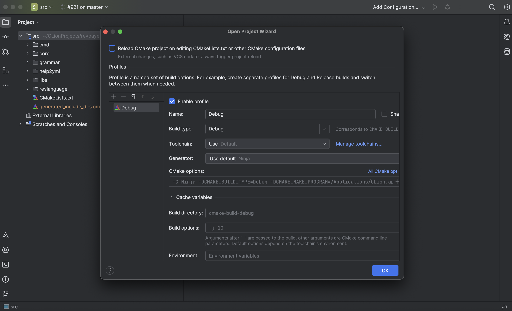

Clion is a paid IDE from JetBrains. Your insititution may provide free access you can access <a href="https://www.jetbrains.com/shop/eform/students?_gl=1*1nostx5*_gcl_au*MzIwMjM3NTI1LjE3NjgzMTkxNDQ.*FPAU*MzIwMjM3NTI1LjE3NjgzMTkxNDQ.*_ga*MTIxMDc1MTAyOC4xNzY4MzE5MTUy*_ga_9J976DJZ68*czE3NjgzMzM3MTQkbzIkZzEkdDE3NjgzMzM4NzYkajE4JGwwJGgw&_cl=MTsxOzE7UTVMaFhCb0lBT0tMTWlDaXpWelRIUjFuaWZXdWhrYkxLMUVuUFpmUFp3Z1RjRnpET2tEUGpBSjF0czB1QzU4czs=">here</a>. 

Prerequisites
----------------------

You will first need to <a href="https://revbayes.github.io/compile-windows">install</a> RevBayes from <a href="https://revbayes.github.io/download">source</a>. Next you should install and build RevBayes (i.e. `./build.sh`). For this tutorial I used CMake which I recommend for CLion but steps are likely similar for meson. Next, open  Clion and open a a project selecting the `revbayes/src` folder from wherever you have stored it on your computer. 

CLion will likely not be able to build yet as it struggles to understand what you are using to build RevBayes that we will fix next. In the meantime close CLion and open your preffered terminal application, changing the directory to where you installed RevBayes. 

Getting RevBayes working 
------------------------

Once here you will need to build using CMake once again in the revbayes directory this time using the following commands:

`cmake -S src -B build-cmake -G Ninja -DCMAKE_BUILD_TYPE=Release`

`cmake --build build-cmake -j`

The first command is doing a few different things but the most important is the `-S src` portion. This will tell CLion that `revbayes/src` is the actualy project root for the C++ project. CLion was expection the `CMakeLists.txt` to be in the `revbayes` directory even though its in the `revbayes/src`. The secone command is more of a organizational step that is creating a CMake build in the revbayes directory so it is explicitly seperate from a meson build.

Before we can fully utilize CLion, we need to remove a hidden file that was created when we opened our `src` project. First change your directory into the `src` directory and type the command `ls -a`. You should see the files contained in the directory including a directory called `.idea`. Many IDEs create 'hidden' files that stores configuration information about the project. The next command can be dangerous so please be careful in its use. 
In your `src` directory type the command `rm -rf .idea` to remove this config information as we will want a 'clean slate' when we open the project. Now you are ready to launch CLion again! Launch the program and open the project using the `revbayes/src` directory. You should see the following pop-up just click ok! 

Finally we can build IN CLion! Click the build button shown here. You can also launch in debug mode but if everything has gone smoothly your now ready to start developing!

 
