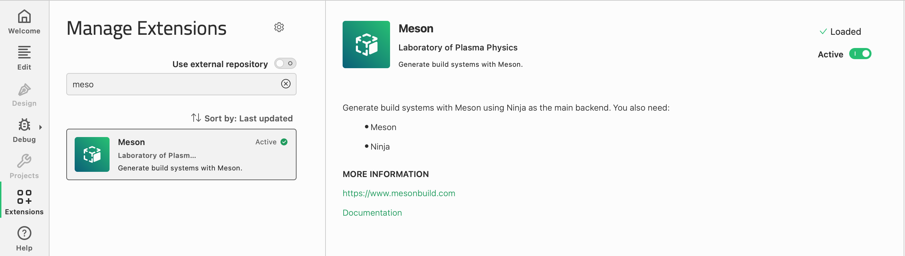
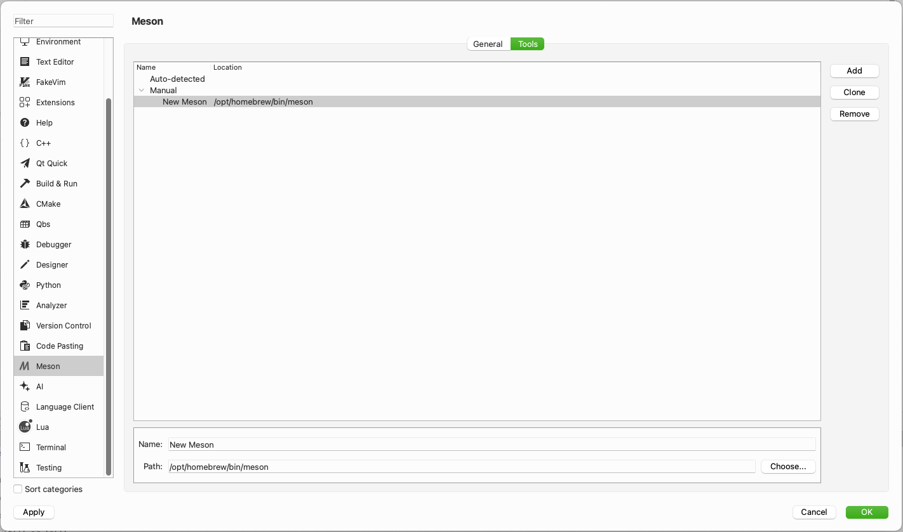
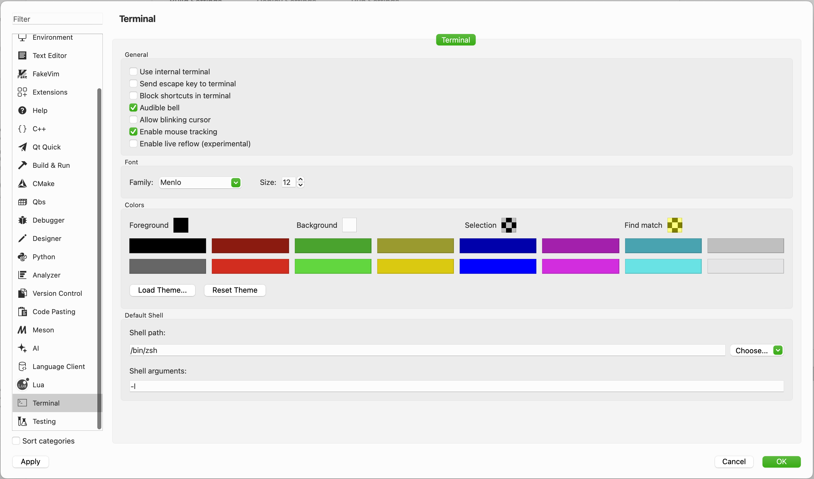
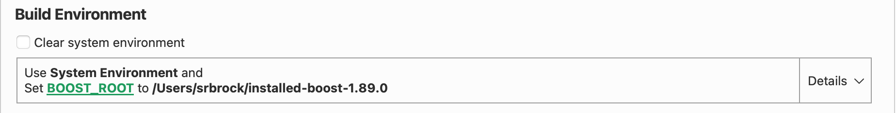
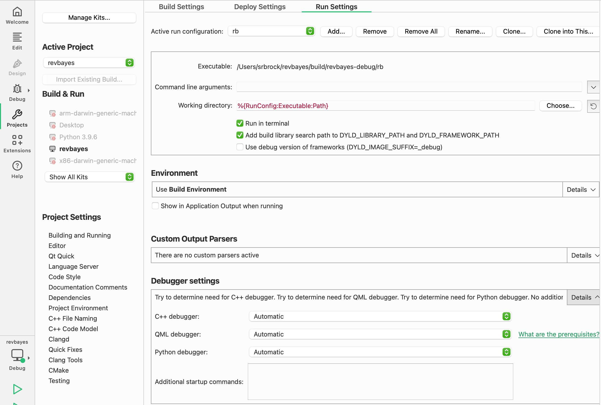
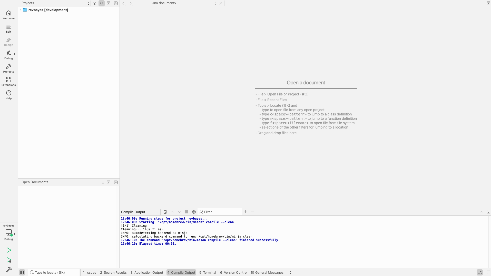

Qt Creator is a free IDE from Qt Group. 

Prerequisites
----------------------

You will first need to <a href="https://revbayes.github.io/compile-windows">install</a> RevBayes from <a href="https://revbayes.github.io/download">source</a>. Next you should install and build RevBayes (i.e. `./build.sh`). For this tutorial I used Meson which I recommend for Qt Creator. To install Qt Creator using homebrew, type the following into your local terminal: `brew install --cask qt-creator`.

Once installed, open Qt Creator (found in Applications) and navigate to the Extensions menu. Once there, you will need to activate the Meson extension.

Now, make your way back to the Welcome menu. Once there, click Open Project and navigate to where your revbayes repository was stored. Select `meson.build` and Open. 

Next, navigate to the Projects menu and click Manage Kits...

Navigate to the Meson menu. Once there, you should see the path to your installed meson. If it is not there, manually add it as pictured below.

Then, make our way to the Terminal menu and deselect Use internal terminal.

QT Creator will likely not be able to build yet as it struggles to understand where to find your boost. In this event, you will need to manually add the `BOOST_ROOT` path to the Build Environment, as pictured below.

 

Now, navigate to the Projects menu. Once there, select Run Settings. Click Run in terminal.

 
You are finally ready to build RevBayes! Navigate to the Edit menu. Once there, click the green triangle with the bug to run.

