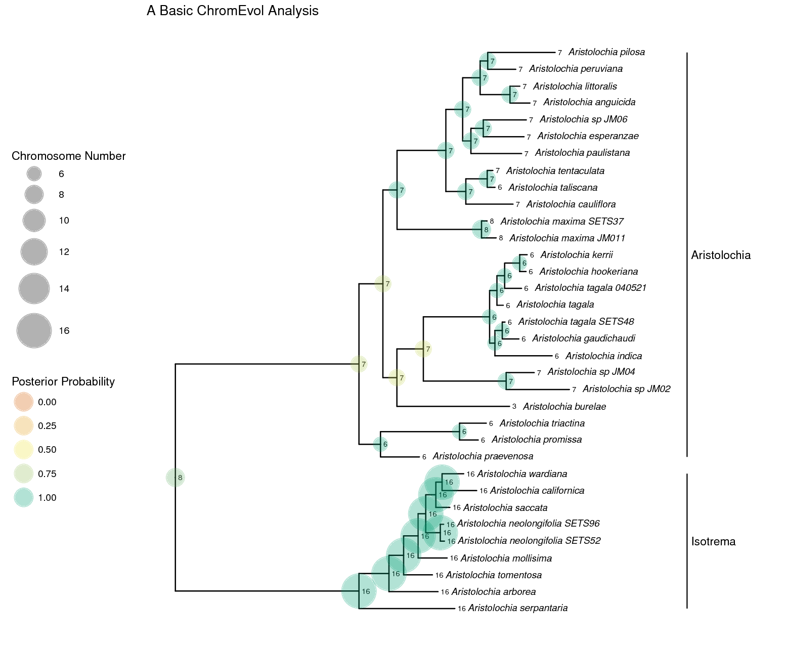
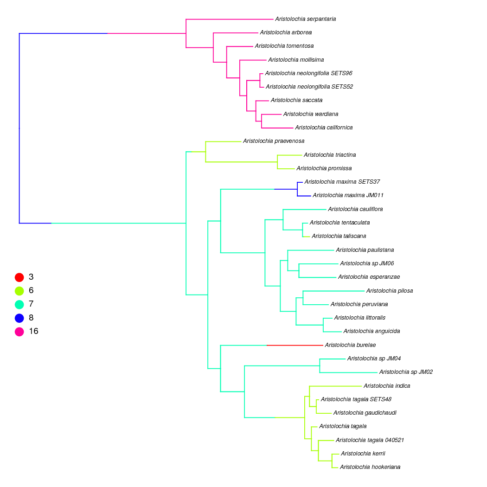
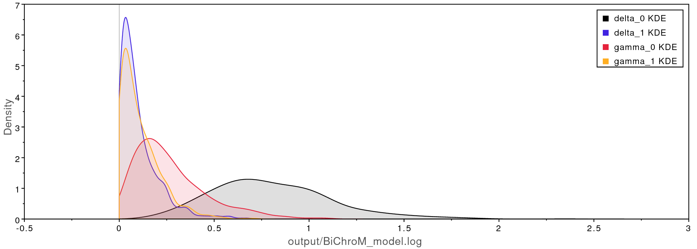
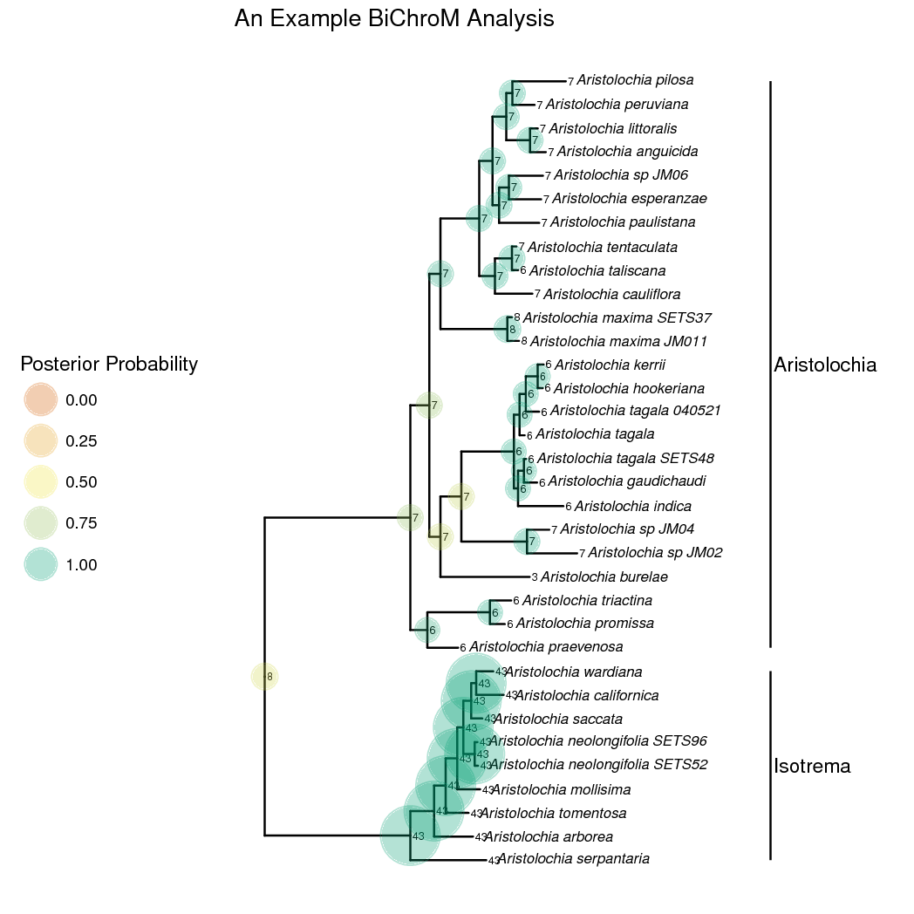
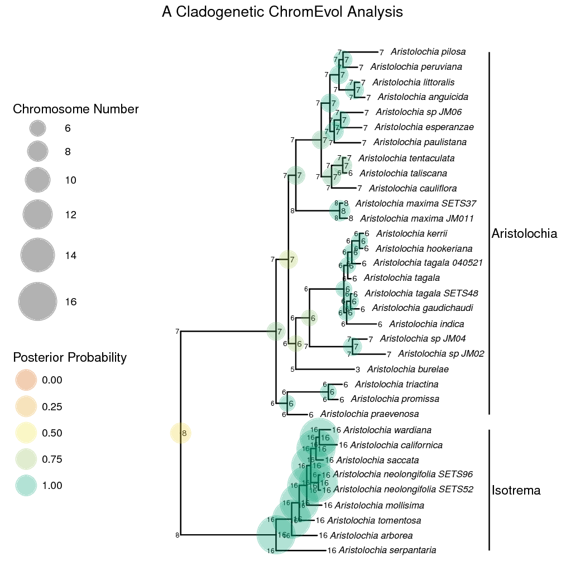

Introduction {#introduction .unnumbered}
============

A central organizing component of the higher-order architecture of the
genome is chromosome number, and changes in chromosome number have long
been understood to play a fundamental role in evolution. This tutorial
will introduce phylogenetic models of chromosome number evolution, and
demonstrate how to use RevBayes to estimate the rates of chromosome
number change and ancestral chromosome numbers. We will also show how to
use the `Rev`Gadgets R package to make plots of ancestral chromosome
number estimates and stochastic character maps of chromosome evolution.

We will begin by providing an overview of the basic ChromEvol model
 and an example RevBayes analysis. This is
followed by a discussion of a number of model extensions that enable
joint inference of phylogeny and chromosome numbers, tests for
correlated rates of phenotype and chromosome evolution [the BiChroM
model} ], and incorporating cladogenetic changes in
chromosome number. Next, we will introduce the ChromoSSE model
 which jointly estimates diversification rates
and chromosome number evolution. We also briefly discuss testing
hypotheses of chromosome evolution by comparing different models using
reversible-jump MCMC and Bayes factors.

If you use RevBayes for chromosome evolution analyses, please cite the
original papers that describe the chromosome evolution models as well as
 which describes in detail the RevBayes
implementation of these models.

Contents {#contents .unnumbered}
--------

The Chromosome Number Evolution tutorial contains several sections:

-   Section [sec:chromo_basic_intro]: Overview of chromosome number
    evolution models

-   Section [sec:chromo_basic_analysis]: A simple ChromEvol analysis

-   Section [sec:chromo_extensions]: Basic extensions of the model

    -   [subsect:root_freq]: Improved root frequences

    -   [subsect:stoch_mapping]: Stochastic character mapping of
        chromosome evolution

    -   [subsect:joint_estimation]: Joint estimation of phylogeny and
        chromosome evolution

    -   [subsect:bichrom]: Associating chromosome evolution with
        phenotype: BiChroM

    -   [subsect:clado_simple]: Incorporating cladogenetic and
        anagenetic chromosome changes

-   Section [sec:chromosse_intro]: Overview of the ChromoSSE model

-   Section [sec:chromosse_analysis]: A simple ChromoSSE analysis

Example scripts and data {#example-scripts-and-data .unnumbered}
------------------------

The data and the full scripts used for all the examples can be found on
the RevBayes website:

-   [`scripts.zip`](http://rawgit.com/revbayes/revbayes_tutorial/master/RB_Chromosome_Evolution_Tutorial/scripts.zip)

-   [`data.zip`](http://rawgit.com/revbayes/revbayes_tutorial/master/RB_Chromosome_Evolution_Tutorial/data.zip)

Recommended tutorials {#recommended-tutorials .unnumbered}
---------------------

This tutorial assumes the reader is familiar with the content covered in
the following RevBayes tutorials:

-   **Rev Basics**

-   **Molecular Models of Character Evolution**

-   **Discrete Morphology Models of Character Evolution**

-   **Running and Diagnosing an MCMC Analysis**

Overview of Chromosome Number Evolution Models {#sec:chromo_basic_intro}
==============================================

Chromosome changes represent major evolutionary mechanisms that have
long been a focal point of study. Changes in chromosome number such as
the gain or loss of a single chromosome (dysploidy), or the doubling of
the entire genome (polyploidy), can have phenotypic consequences, affect
the rates of recombination, and increase reproductive isolation among
lineages and thus drive diversification .
Recently, evolutionary biologists have increasingly studied the
macroevolutionary consequences of chromosome changes within a molecular
phylogenetic framework, mostly utilizing the likelihood-based ChromEvol
models of chromosome number evolution introduced by
@mayrose2010probabilistic. The ChromEvol models have permitted
phylogenetic studies of ancient whole genome duplication events, rapid
"catastrophic" chromosome speciation, major reevaluations of the
evolution of angiosperms, and new insights into the fate of polyploid
lineages [e.g.
]. The basic
ChromEvol model has been extended to examine the association of
phenotype with chromosome evolution [BiChroM} , and to
incorporate cladogenetic changes and diversification rates [ChromoSSE;
.

Here we describe the ChromEvol model as implemented in RevBayes, which
except for one detail noted below is the same mathematical model
introduced in . In further sections, we will
show how to set up extensions such as BiChroM and ChromoSSE which build
on the useful but basic ChromEvol model of chromosome number evolution.

The ChromEvol Model
-------------------

In ChromEvol the evolution of chromosome number is represented as a
continuous-time Markov process, similar to models of molecular evolution
and discrete morphological evolution. The continuous-time Markov process
is described by an instantaneous rate matrix $Q$ where the value of each
element represents the instantaneous rate of change within a lineage
from a genome of $i$ chromosomes to a genome of $j$ chromosomes. For all
elements of $Q$ in which either $i = 0$ or $j = 0$ we define
$Q_{ij} = 0$. For the off-diagonal elements $i \neq j$ with positive
values of $i$ and $j$, $Q$ is determined by: 

$$\label{eq:anagenetic1}
Q_{ij} = 
    \begin{cases}
        \gamma_a                          & j = i + 1,    \\
        \delta_a                          & j = i - 1,    \\
        \rho_a                                & j = 2i,       \\
        \eta_a                                 & j = 1.5i,     \\
        0                                   & \mbox{otherwise},   
    \end{cases}$$ 

where $\gamma_a$, $\delta_a$, $\rho_a$, and $\eta_a$
are the rates of chromosome gains, losses, polyploidizations, and
demi-polyploidizations. We use the subscript $a$ for all these rates to
differentiate the rates between anagenetic ($a$) and cladogenetic ($c$)
events (see the ChromoSSE model in a later section).

If we are interested in modeling scenarios in which the probability of
fusion or fission events are positively or negatively correlated with
the number of chromosomes we can define $Q$ as: 

$$\label{eq:anagenetic2}
Q_{ij} = 
    \begin{cases}
        \gamma_a e^{\gamma_m (i - 1)}  & j = i + 1,    \\
        \delta_a e^{\delta_m (i - 1)}     & j = i - 1,    \\
        \rho_a                                & j = 2i,       \\
        \eta_a                                 & j = 1.5i,     \\
        0                                   & \mbox{otherwise},   
    \end{cases}$$ 

where $\gamma_m$ and $\delta_m$ are rate modifiers of
chromosome gain and loss, respectively, that allow the rates of
chromosome gain and loss to depend on the current number of chromosomes.
If the rate modifier $\gamma_m = 0$, then
$\gamma_a e^{0 (i - 1)} = \gamma_a$. If the rate modifier
$\gamma_m > 0$, then $\gamma_a e^{\gamma_m (i - 1)} \geq \gamma_a$
(*i.e.*, rates increase with more chromosomes),
and if $\gamma_m < 0$ then $\gamma_a e^{\gamma_m (i - 1)} \leq \gamma_a$
(*i.e.*, rates decrease with more chromosomes).
Note that this parameterization differs slightly from the original
ChromEvol model; here we assume the rates of chromosome change can vary
exponentially as a function of the current chromosome number, whereas
ChromEvol as originally described by @mayrose2010probabilistic assumes a
linear function. The theoretical reasons for this difference are
described in @freyman2016cladogenetic, however in practice on most
empirical datasets the difference appears insignificant.

Demi-polyploidization is the union of a reduced and an unreduced gametes
that produces a cytotype with 1.5 times the number of chromosomes. The
number of chromosomes in a genome must of course be an integer, so for
odd values of $i$, $Q_{ij}$ is set to $\eta/2$ for the two integer
values of $j$ resulting when $j = 1.5i$ is rounded up and down.

As in all continuous-time Markov models, the diagonal elements $i = j$
of $Q$ are defined as: 
$$Q_{ii} = - \sum_{i \neq j}^{C_m} Q_{ij}.$$ 
The
probability of anagenetically evolving from chromosome number $i$ to $j$
along a branch of length $t$ is then calculated by exponentiation of the
instantaneous rate matrix: 
$$\label{eq:anagenetic_probs}
    P_{ij}(t) = e^{-Qt}.$$ 
Given a phylogeny and chromosome counts of
the extant lineages, this model can be used in either a maximum
likelihood or Bayesian inference framework to estimate the rates of
chromosome change and the ancestral chromosome numbers.

Hypothesis Testing and Model Uncertainty
----------------------------------------

The ChromEvol model described above is actually a class of models; for
example we could exclude demi-polyploidization by fixing it's rate to 0.
A common use for different models of chromosome evolution is to test
hypotheses. For example, are polyploidization events occuring primarily
at speciation events and possibly driving diversification, or do
polyploidization events occur within lineages and unassociated with
lineage splitting? To answer this, one could use RevBayes to set up
two different models, one allowing cladogenetic polyploidization (see
Section [subsect:clado_simple]) and a second using a model with only
anagenetic polyploidization (like the ChromEvol model described above).
One could then calculate a Bayes factor to compare which model better
explained the observed data. See the RevBayes tutorial **Compute
Marginal Likelihoods to Select Between Models** for more information on
how to calculate Bayes factors in RevBayes.

Another option in RevBayes is to use Bayesian model averaging. Out of
the class of all chromosome evolution models described here, it is
possible that no single model will adequately describe the chromosome
evolution of a given clade. To explore the entire space of all possible
models of chromosome number evolution one could specify a reversible
jump Markov chain Monte Carlo  that samples across
models of different dimensionality, drawing samples from chromosome
evolution models in proportion to their posterior probability and
enabling Bayes factors for each model to be calculated. This approach
incorporates model uncertainty by permitting model-averaged inferences
that do not condition on a single model; we draw estimates of ancestral
chromosome numbers and rates of chromosome evolution from all possible
models weighted by their posterior probability. For general reviews of
this approach to model averaging see ,
, , and for its use in
phylogenetics see @posada2004model. Averaging over all models has been
shown to provide a better average predictive ability than conditioning
on a single model . Conditioning on a single model
ignores model uncertainty, which can lead to an underestimation in the
uncertainty of inferences made from that model .
In our case, this can lead to overconfidence in estimates of ancestral
chromosome numbers and chromosome evolution parameter value estimates.
For details on how to implement Bayesian model averaging in RevBayes
with chromsome evolution see @freyman2016cladogenetic.

Next Steps
----------

The basic ChromEvol model as described above can be extended in a number
of useful ways that will be covered in further sections. In the next
section, however, we'll set up and run a simple RevBayes analysis
using the ChromEvol model before moving on to the more complex models.

[fig:chromevol_simple]

 
> Maximum a posteriori
ancestral chromosome number estimates for *Aristolochia* inferred using
RevBayes and plotted using the `Rev`Gadgets R package. Section
[sec:chromo_basic_analysis] describes how to perform this analysis.

Example: A Simple ChromEvol Analysis {#sec:chromo_basic_analysis}
====================================

In this example, we will use molecular sequence data and chromosome
counts from @ohi2006molecular of the plant genus *Aristolochia*
(commonly called Dutchman's pipe plants). We will use a simple ChromEvol
model to infer rates of chromosome evolution and ancestral chromosome
numbers.

Tutorial Format {#subsect:Exercise-Format}
---------------

This tutorial follows a specific format for issuing instructions and
information.

The boxed instructions guide you to complete tasks that are not part of
the RevBayes syntax, but rather direct you to create directories or
files or similar.

Information describing the commands and instructions will be written in
paragraph-form before or after they are issued.

All command-line text, including all `Rev` syntax, are given in
`monotype font`. Furthermore, blocks of `Rev` code that are needed to
build the model, specify the analysis, or execute the run are given in
separate shaded boxes. For example, we will instruct you to create a
constant node called `example` that is equal to `1.0` using the `<-`
operator like this:

    example <- 1.0

It is important to be aware that some PDF viewers may render some
characters given as differently. Thus, if you copy and paste text from
this PDF, you may introduce some incorrect characters. Because of this,
we recommend that you type the instructions in this tutorial or copy
them from the scripts provided.

Data and Files {#subsect:Exercise-DataFiles}
--------------

On your own computer, create a directory called (or any name you like).

In this directory download and unzip the archive containing the data
files:
[`data.zip`](http://rawgit.com/revbayes/revbayes_tutorial/master/RB_Chromosome_Evolution_Tutorial/data.zip).

This will create a folder called `data` that contains the files
necessary to complete this exercise.

Creating the `Rev` File {#subsect:Exercise-CreatingFiles}
-----------------------

Create a new directory (in `RB_Chromosome_Evolution_Tutorial`) called
. (If you do not have this folder, please refer to the directions in
section [subsect:Exercise-DataFiles].)

When you execute RevBayes in this exercise, you should do so within
the main directory you created (`RB_Chromosome_Evolution_Tutorial`),
thus, if you are using a Unix-based operating system, we recommend that
you add the RevBayes binary to your path.

For complex models and analyses, it is best to create `Rev` script files
that will contain all of the model parameters, moves, and functions. In
this first section, you will create a file called from scratch and save
it in the `scripts` directory.

The full scripts for these examples are also provided in the RevBayes
tutorial repository[^1]. Please refer to these files to verify or
troubleshoot your own scripts.

Open your text editor and create the master `Rev` file called in the
`scripts` directory.

Enter the `Rev` code provided in this section into this file.

The file you will begin in this section will be the one you load into
RevBayes when you've completed all of the components of the analysis.
The file will contain the `Rev` code to load the data files, set up the
model, run the MCMC analysis, and summarize the results.

Reading in Data {#subsub:Exercise-LoadData}
---------------

First, we'll read in the phylogeny. In this example the phylogeny is
assumed known. In further examples we'll jointly estimate chromosome
evolution and the phylogeny.

    phylogeny <- readBranchLengthTrees("data/aristolochia.tree")[1]

We need to limit the maximum number of chromosomes allowed in our model,
so here we use the largest observed chromosome count plus 10. This is an
arbitrary limit on the size of the state space that could be increased
if necessary.

    max_chromo = 26 

Now we get the observed chromosome counts from a tab-delimited file.

    chromo_data = readCharacterDataDelimited("data/aristolochia_chromosome_counts.tsv", stateLabels=(max_chromo + 1), type="NaturalNumbers", delimiter="\t", headers=FALSE)

The Chromosome Evolution Model
------------------------------

We'll use exponential priors with prior mean 0.1 to model the rates of
polyploidy and dysploidy events along the branches of the phylogeny.
`gamma` is the rate of chromosome gains, `delta` is the rate of
chromosome losses, and `rho` is the rate of polyploidization.

    gamma ~ dnExponential(10.0)
    delta ~ dnExponential(10.0)
    rho ~ dnExponential(10.0)

Add MCMC moves for each of the rates.

    mvi = 1
    moves[mvi++] = mvScale(gamma, lambda=1, weight=1)
    moves[mvi++] = mvScale(delta, lambda=1, weight=1)
    moves[mvi++] = mvScale(rho, lambda=1, weight=1)

Now we create the rate matrix for the chromosome evolution model. Here
we will use a simple ChromEvol model that includes only the rate of
chromosome gain, loss, and polyploidization.

    Q := fnChromosomes(max_chromo, gamma, delta, rho)

Parameters for demi-polyploidization and rate modifiers could also be
added at this step for more complex models. For example, we could have
included the rate of demi-polyploidization `eta` and rate modifiers like
this:

    Q := fnChromosomes(max_chromo, gamma, delta, rho, eta, gamma_l, delta_l)

Here we assume an equal prior probability for the frequency of
chromosome numbers at the root of the tree. This does not mean that the
frequencies are actually equal, we just give it an equal prior
probability. Alternatively, we could have treated the root frequencies
as a free variable and estimated them from the observed data. This
approach will be illustrated in further examples.

    root_frequencies := simplex(rep(1, max_chromo + 1))

Finally, we create the stochastic node for the chromosome evolution
continuous-time Markov chain (CTMC). We also clamp the observed
chromosome count data to the CTMC.

    chromo_ctmc ~ dnPhyloCTMC(Q=Q, tree=phylogeny, rootFreq=root_frequencies, type="NaturalNumbers")
    chromo_ctmc.clamp(chromo_data)

All of the components of the model are now specified, so now we wrap it
into a single model object.

    mymodel = model(phylogeny)

Set Up the MCMC {#subsect:Exercise-CompleteMCMC}
---------------

The next important step for our master `Rev` file is to specify the MCMC
monitors. For this, we create a vector called `monitors` that will each
output MCMC samples. First, a screen monitor that will output every 10
iterations:

    monitors[1] = mnScreen(printgen=10)

Next, an ancestral state monitor which will sample ancestral states and
write them to a log file. We could additionally use the
`mnStochasticCharacterMap` monitor to sample stochastic character maps
of chromosome evolution (see the next section for an example).

    monitors[2] = mnJointConditionalAncestralState(filename="output/ChromEvol_simple_anc_states.log", printgen=10, tree=phylogeny, ctmc=chromo_ctmc, type="NaturalNumbers")

And another monitor for logging all the model parameters. This will
generate a file that can be opened in `Tracer`for checking
MCMC convergence and parameter estimates.

    monitors[3] = mnModel(filename="output/ChromEvol_simple_model.log", printgen=10)

Now we set up the MCMC and include code to execute the analysis. In this
example we set the chain length to `200`, however for a real analysis
you would want to run many more iterations and check for convergence.

    mymcmc = mcmc(mymodel, monitors, moves)
    mymcmc.run(200)

Summarize Ancestral States
--------------------------

Now we need to add `Rev` code that will summarize the sampled ancestral
chromosome numbers. First, read in the ancestral state trace generated
by the ancestral state monitor during the MCMC analysis:

    anc_state_trace = readAncestralStateTrace("output/ChromEvol_simple_anc_states.log")

Finally, summarize the values from the traces over the phylogeny. Here
we do a marginal reconstruction of the ancestral states, discarding the
first 25% of samples as burnin. This will produce the file
`ChromEvol_simple_final.tree` that contains the phylogeny along with
estimated ancestral states. We can use that file with the `Rev`Gadgets R
package to generate a plot of the ancestral states.

    ancestralStateTree(phylogeny, anc_state_trace, "output/ChromEvol_simple_final.tree", burnin=0.25, reconstruction="marginal")

Note that we could also have calculated joint or conditional ancestral
states instead of (or in addition to) the marginal ancestral states. If
we had sampled stochastic character maps, we would summarize them with
the `characterMapTree` function.

And now quit RevBayes:

    q()

You made it! Be sure to save the file.

Execute the RevBayes Analysis {#subsect:Exercise-RunMCMC}
-------------------------------

With all the parameters specified and all analysis components in place,
you are now ready to run your analysis. The `Rev` scripts you just
created will all be used by RevBayes and loaded in the appropriate
order.

Begin by running the RevBayes executable. In Unix systems, type the
following in your terminal (if the RevBayes binary is in your path):

Provided that you started RevBayes from the correct directory
(`RB_Chromsome_Evolution_Tutorial`) the analysis should now run.
Alternatively, from within RevBayes you could use the `source()`
function to feed RevBayes your master script file:

    source("scripts/ChromEvol_simple.Rev")

This will execute the analysis and you should see output similar to this
(though not the exact same values):

When the analysis is complete, RevBayes will quit and you will have a
new directory called `output` that will contain all of the files you
specified with the monitors (Sect. [subsect:Exercise-CompleteMCMC]).

Plotting the Results
--------------------

Now we will plot the results of the MCMC analysis using the `Rev`Gadgets
R package. Start R and set your working directory to the
`RB_Chromsome_Evolution_Tutorial` directory. Now run the command to
generate Figure [fig:chromevol_simple] below. There are many options
to customize the look of the plot, for options take a look inside the R
script.

Next Steps
----------

There are many extensions to the basic ChromEvol analysis demonstrated
here. In the next section we will look at how to set up more complex
chromosome number evolution analyses.

Basic Extensions of the Chromosome Evolution Model {#sec:chromo_extensions}
==================================================

In this section, we will extend the ChromEvol model in a number of ways.
First, we will examine another approach for treating chromosome number
root frequencies. This is followed by a brief example applying
stochastic character mapping to chromosome evolution models. Then will
look at jointly estimating the phylogeny and chromsome evolution, show
how to set up a BiChroM analysis, and demonstrate one way to add
cladogenetic changes to a chromosome evolution analysis.

Like before, scripts for these examples are also provided in the
RevBayes tutorial repository[^2]. Please refer to these files to
verify or troubleshoot your own scripts.

Improved Root Frequencies {#subsect:root_freq}
-------------------------

In the last example we assumed the frequency of chromosome numbers at
the root of the tree were equal. This is equivalent to assigning an
extremely informative prior that all root states are equally likely. An
alternative approach is to treat the root frequencies as free parameters
of the model and estimate them from the observed data. In a series of
unpublished simulations performed by the authors this resulted in
increased accuracy of ancestral root chromosome numbers estimates.

To use this approach, the `root_frequencies` parameter must be redefined
as a stochastic node in our graphical model instead of a deterministic
node. Remove the following line from your `Rev` script:

    root_frequencies := simplex(rep(1, max_chromo + 1))

We will instead use an uninformative flat Dirichlet prior for the root
frequencies. First, we create a vector to hold the concentration
parameters for the Dirichlet distribution. Here we set all concentration
parameters to 1, which results in all sets of probabilities being
equally likely. We then pass the vector of concentration parameters into
the Dirichlet distribution and create the stochastic node representing
root frequencies.

    root_frequencies_prior <- rep(1, max_chromo + 1)
    root_frequencies ~ dnDirichlet(root_frequencies_prior)

Next, we must specify MCMC moves for the root frequencies. When the
maximum number of chromosomes is high these parameters can have
difficulty converging. Therefore, we use two different MCMC moves. The
first is Beta Simplex move, which selects one element of the
`root_frequencies` vector and proposes a new value for it drawn from a
Beta distribution. The second is Element Swap Simplex move, which
selects two elements of the `root_frequencies` vector and simply swaps
their values.

    moves[mvi++] = mvBetaSimplex(root_frequencies, alpha=0.5, weight=10)
    moves[mvi++] = mvElementSwapSimplex(root_frequencies, weight=10)

You can experiment with different weights for each MCMC move.

Make the modifications to the root frequencies in the script
**ChromoSSE_simple.Rev** and run the analysis again? What are the
estimates of the root frequency (you can see this by looking at the
output in `Tracer`)? Do the estimated ancestral states
change?

Stochastic Character Mapping of Chromosome Evolution {#subsect:stoch_mapping}
----------------------------------------------------

In RevBayes both ancestral states and stochastic character maps can be
sampled from continuous-time Markov chain (CTMC) and state-dependent
speciation and extinction (SSE) models of character evolution.
Stochastic character maps show the timing and number of transitions
along the branches of the phylogeny, so they can be particularly useful
for chromosome evolution estimates where the timing of, for example,
whole genome duplication events might be of interest. This example is
performed on a non-ultrametric tree, but the same analysis could be
performed on time-calibrated trees.

[fig:simmap]

 
> An example of stochastic character
mapping applied to chromosome number evolution using RevBayes. Shown
is the marginal maximum a posteriori chromosome evolution history of
*Aristolochia* using the simple ChromEvol analysis from Section
[sec:chromo_basic_analysis].

We have already shown how to sample ancestral states above, and here we
show the few extra lines of `Rev` code needed to sample stochastic
character maps. Stochastic character maps are drawn during the MCMC, so
we need to include the `mnStochasticCharacterMap` monitor.

    monitors[4] = mnStochasticCharacterMap(ctmc=chromo_ctmc, filename="output/ChromEvol_maps.log", printgen=10)

This monitor will create the `output/ChromEvol_maps.log` file. Just like
the other log files, each row in this file represents a different sample
from the MCMC. Each column in the file, though, is the character history
for a different node in the phylogeny. The last column of the file is
the full stochastic character map of the entire tree in **SIMMAP**
 format. These can be plotted using the
**phytools** R package .

After the MCMC simulation, we can calculate the maximum a posteriori
*marginal*, *joint*, or *conditional* character history. This process is
similar to the ancestral state summaries. First we read in the
stochastic character map trace.

    anc_state_trace = readAncestralStateTrace("output/ChromEvol_maps.log")

Then we use the `characterMapTree` function. This generates two SIMMAP
formatted files: 1) the maximum a posteriori character history, and 2)
the posterior probabilities of the entire character history.

    characterMapTree(phylogeny, anc_state_trace, character_file="output/character.tree", posterior_file="output/posterior.tree", burnin=5, reconstruction="marginal")

Figure [fig:simmap] is an example stochastic character map of our
*Aristolochia* analysis plotted using **phytools**.

Copy the script `ChromoSSE_simple.Rev` and add stochastic character
mapping monitor. Then, run the analysis and use the script
`plot_simmap.R` to visualize the character mappings.

Joint Estimation of Phylogeny and Chromosome Evolution {#subsect:joint_estimation}
------------------------------------------------------

In RevBayes the chromosome evolution models can be used jointly with a
model of molecular evolution enabling joint inference of the phylogeny
and chromosome number evolution. This enables the chromosome number
analysis to take into account phylogenetic uncertainty and allows the
chromosome numbers to help inform the phylogeny.

Setting up a model that jointly infers chromosome evolution and
phylogeny requires mostly combining elements covered in the **Molecular
Models of Character Evolution** tutorial with what has already been
covered in Section [sec:chromo_basic_analysis] of this tutorial. We
will not repeat how to set up the chromosome model component, but we'll
step through what must be added to the example in Section
[sec:chromo_basic_analysis] above. Furthermore, we have provided a
full working example script `scripts/ChromEvol_joint.Rev`.

### Reading in Molecular Data and Setting Clade Constraints

The first major difference from the basic ChromEvol example shown above
is that we must additionally read in molecular sequence data:

    dna_seq = readDiscreteCharacterData("data/aristolochia_matK.fasta")

We will need some useful information about this data as well:

    n_species = dna_seq.ntaxa()
    n_sites = dna_seq.nchar()
    taxa = dna_seq.names()
    n_branches = 2 * n_species - 2

Since we want to jointly infer ancestral states, we need to set an a
priori rooting constraint on our phylogeny. So here we set an ingroup
and outgroup.

    outgroup = ["Aristolochia_serpantaria", "Aristolochia_arborea", 
                "Aristolochia_wardiana", "Aristolochia_californica", 
                "Aristolochia_saccata", "Aristolochia_mollisima",
                "Aristolochia_tomentosa", "Aristolochia_neolongifolia_SETS52", 
                "Aristolochia_neolongifolia_SETS96"]

Here we loop through each taxon and if it is not present in the outgroup
defined above we add it to the ingroup.

    i = 1
    for (j in 1:taxa.size()) {
        found = false
        for (k in 1:outgroup.size()) {
            if (outgroup[k] == taxa[j].getSpeciesName()) {
                found = true
                break
            }
        }
        if (found == false) {
            ingroup[i] = taxa[j].getSpeciesName()
            i += 1
        }
    }

And now we make the vector of clade objects to constrain our tree
topology.

    clade_ingroup = clade(ingroup)
    clade_outgroup = clade(outgroup)
    clade_constraints = [clade_ingroup, clade_outgroup]

### Tree Model

We will specify a uniform prior on the tree topology, and add a MCMC
move on the topology.

    topology ~ dnUniformTopology(taxa=taxa, constraints=clade_constraints, rooted=TRUE)
    moves[mvi++] = mvNNI(topology, weight=10.0)

Next, we create a stochastic node for each branch length. Each branch
length prior will have an exponential distribution with rate 1.0. We'll
also add a simple scaling move for each branch length.

    for (i in 1:n_branches) {
        br_lens[i] ~ dnExponential(10.0)
        moves[mvi++] = mvScale(br_lens[i], lambda=2, weight=1)
    }

Finally, build the tree by combining the topology with the branch
lengths.

    phylogeny := treeAssembly(topology, br_lens)

### Molecular Substitution Model

We'll specify the GTR substitution model applied uniformly to all sites.
Use a flat Dirichlet prior for the exchange rates.

    er_prior <- v(1,1,1,1,1,1)
    er ~ dnDirichlet(er_prior)
    moves[mvi++] = mvSimplexElementScale(er, alpha=10, weight=3)

And also a flat Dirichlet prior for the stationary base frequencies.

    pi_prior <- v(1,1,1,1)
    pi ~ dnDirichlet(pi_prior)
    moves[mvi++] = mvSimplexElementScale(pi, alpha=10, weight=2)

Now create a deterministic variable for the nucleotide substitution rate
matrix.

    Q_mol := fnGTR(er, pi)

Create a stochastic node for the sequence evolution continuous-time
Markov chain (CTMC) and clamp the sequence data. Note we should have two
CTMC objects in this model: one for the model of molecular evolution and
one for the model of chromosome evolution.

    dna_ctmc ~ dnPhyloCTMC(tree=phylogeny, Q=Q_mol, branchRates=1.0, type="DNA")
    dna_ctmc.clamp(dna_seq)

### MCMC and Summarizing Results

We set up the MCMC just as before, except here we need to add a file
monitor to store the sampled trees.

    monitors[2] = mnFile(filename="output/ChromEvol_joint.trees", printgen=10, phylogeny)

Summarizing the results of the MCMC analysis are a little different.
First we will calculate the maximum a posteriori (MAP) tree.

    treetrace = readAncestralStateTreeTrace("output/ChromEvol_joint.trees", treetype="non-clock")
    map_tree = mapTree(treetrace, "output/ChromEvol_joint_map.tree")

Now we'll summarize the ancestral chromosome numbers over the MAP tree.
Read in the ancestral state trace:

    anc_state_trace = readAncestralStateTrace("output/ChromEvol_joint_states.log")

Finally, calculate the marginal ancestral states from the traces over
the MAP tree. Note that this time we have to pass both the tree trace
and the ancestral state trace to the `ancestralStateTree` function.
Since we sampled a joint distribution of ancestral state histories and
trees, we sampled some ancestral states for nodes that do not exist in
the MAP tree. Therefore the ancestral state probabilities being
calculated for the MAP tree are conditional to the probability of the
node existing.

    ancestralStateTree(map_tree, anc_state_trace, treetrace, "output/ChromEvol_joint_final.tree" burnin=0.25, reconstruction="marginal")

Like before, we can plot the results using the `Rev`Gadgets R package
using the script `plot_ChromEvol_joint.R`.

Associating Chromosome Evolution with Phenotype: BiChroM {#subsect:bichrom}
--------------------------------------------------------

We may be interested in testing whether the rates of chromosome number
evolution are associated with a certain phenotype. Here we set up a
binary phenotypic character and estimate separate rates of chromosome
evolution for each state of the phenotype. We'll use a model that
describes the joint evolution of both the phenotypic character and
chromosome evolution. This model (BiChroM) was introduced in
@zenil2017testing. In RevBayes, the BiChroM model can easily be
extended to multistate phenotypes and/or hidden states, plus
cladogenetic changes could be incorporated into the model.

In this example we will again use chromosome count data from
@ohi2006molecular for the plant genus *Aristolochia*. For the phenotype
we will examine gynostemium morphology. *Aristolochia* flowers have an
extensively modified perianth that traps and eventually releases
pollinators to ensure cross pollination (this is why the flowers
resemble pipes and are commonly called Dutchman's pipes). The
gynostemium is a reproductive organ found only in Aristolchiaceae and
Orchids that consists of fused stamens and pistil that pollinators must
interact with during pollination. The subgenus Isotrema has highly
reduced three-lobed gynostemium. Other members of *Aristolochia* have
gynostemium subdivided into 5 to 24 lobes. We'll test for an association
of this phenotype with changes in the rates of chromosome evolution.

-   phenotype state 0 = 3 lobed gynostemium

-   phenotype state 1 = 5 to 24 lobed gynostemium

Much of this exercise is a repeat of what was already covered in Section
[sec:chromo_basic_analysis], so we will only touch on the model
components that are different. We have provided a full working example
script `scripts/BiChroM.Rev`. In this example the phylogeny is assumed
known, however one could combine this with the exercise above to jointly
infer the phylogeny.

[fig:bichrom_rates]

 
> Results of the example BiChroM
analysis performed in RevBayes. This plot shows the output from `.log`
files when loaded into `Tracer`. The rates of chromosome
gains (`gamma`) and losses (`delta`) are higher for *Aristolochia*
lineages with complex gynostemium subdivided into 5 to 24 lobes (state
0) compared to lineages with simple 3 lobed gynostemium (state 1).

[fig:bichrom]

 
> Maximum a posteriori estimates of
ancestral chromosome number and gynostemium morphology for
*Aristolochia* inferred using the BiChroM model as implemented in
RevBayes. States 1-26 represent the haploid number $n$ of chromosome
for lineages with gynostemium subdivided in 5 to 24 lobes. States 27-52
represent the haploid number $n + 27$ of chromosomes for lineages with
simple 3 lobed gynostemium. The ancestral state for the common ancestor
of all *Aristolochia* had a haploid number $n = 8$ and more complex 5 to
24 lobed gynostemium. An evolutionary reduction to 3 lobes is inferred
in the lineage leading to the extant Isotrema clade.

### Setting up the BiChroM model

The first step will be to read in the observed data. This is done as
before, with the exception that the data is set up a bit differently.
The data matrix must now represent both the observed chromosome counts
*and* the observed phenotype. So in this file states 1-26 represent the
haploid number $n$ of chromosome for lineages with gynostemium
subdivided in 5 to 24 lobes, and states 27-52 represent the haploid
number $n + 27$ for lineages with simple 3 lobed gynostemium. Note the
`stateLabels` argument must now be set to 2 times the maximum number of
chromosomes.

    chromo_data = readCharacterDataDelimited("data/aristolochia_bichrom_counts.tsv", stateLabels=2*(max_chromo + 1), type="NaturalNumbers", delimiter="\t", headers=FALSE)

Like before, we'll use exponential priors to model the rates of
polyploidy and dysploidy events along the branches of the phylogeny.
However, here we set up two rate parameters for each type of chromosome
change – one for phenotype state 0 and one for phenotype state 1.

    gamma_0 ~ dnExponential(10.0)
    gamma_1 ~ dnExponential(10.0)
    delta_0 ~ dnExponential(10.0)
    delta_1 ~ dnExponential(10.0)
    rho_0 ~ dnExponential(10.0)
    rho_1 ~ dnExponential(10.0)

Add MCMC moves for each of the rates.

    mvi = 1
    moves[mvi++] = mvScale(gamma_0, lambda=1, weight=1)
    moves[mvi++] = mvScale(delta_0, lambda=1, weight=1)
    moves[mvi++] = mvScale(rho_0, lambda=1, weight=1)
    moves[mvi++] = mvScale(gamma_1, lambda=1, weight=1)
    moves[mvi++] = mvScale(delta_1, lambda=1, weight=1)
    moves[mvi++] = mvScale(rho_1, lambda=1, weight=1)

Now we create the rate matrix for the chromosome evolution model. We
will set up two rate matrices, one for each phenotype state.

    Q_0 := fnChromosomes(max_chromo, gamma_0, delta_0, rho_0)
    Q_1 := fnChromosomes(max_chromo, gamma_1, delta_1, rho_1)

Again, we could have include the rate of demi-polyploidization `eta` and
rate modifiers like this:

    Q_0 := fnChromosomes(max_chromo, gamma_0, delta_0, rho_0, eta_0, gamma_l_0, delta_l_0) 
    Q_1 := fnChromosomes(max_chromo, gamma_1, delta_1, rho_1, eta_1, gamma_l_1, delta_l_1) 

Now we create the rates of transitioning between phenotype states. Any
model could be used (all rates equal models, Dollo models, etc.) but
here we estimate a different rate for each transition between states 0
and 1.

    q_01 ~ dnExponential(10.0)
    q_10 ~ dnExponential(10.0)
    moves[mvi++] = mvScale(q_01, lambda=1, weight=1)
    moves[mvi++] = mvScale(q_10, lambda=1, weight=1)

And finally we create the transition rate matrix `Q_b` for the joint
model of phenotypic and chromosome evolution. First we will initialize
the matrix with all zeros:

    s = Q_0[1].size()
    for (i in 1:(2 * s)) {
        for (j in 1:(2 * s)) {
            Q[i][j] := 0.0
        }
    }

And now we populate the matrix with the transition rates.

    for (i in 1:(2 * s)) {
        for (j in 1:(2 * s)) {
            if (i <= s) {
                if (j <= s) {
                    if (i != j) {
                        # chromosome changes within phenotype state 0
                        Q[i][j] := abs(Q_0[i][j])
                    }
                } else {
                    if (i == (j - s)) {
                        # transition from phenotype state 0 to 1
                        Q[i][j] := q_01
                    }
                }
            } else {
                if (j <= s) {
                    if (i == (j + s)) {
                        # transition from phenotype state 1 to 0
                        Q[i][j] := q_10
                    }
                } else {
                    if (i != j) {
                        # chromosome changes within phenotype state 1
                        k = i - s
                        l = j - s
                        Q[i][j] := abs(Q_1[k][l])
                    }
                }
            }
        }
    }
    Q_b := fnFreeK(Q, rescaled=false)

The rest of the analysis is essentially the same as in Section
[sec:chromo_basic_analysis]. Just make sure to pass the `Q_b` matrix
into the CTMC object.

### BiChroM Analysis Results

In Figure [fig:bichrom_rates] the rates of chromosome gains and
losses for each of the phenotype states are plotted. *Aristolochia*
lineages with complex gynostemium subdivided into many lobes have higher
rates of dysploid changes than lineages with simple 3-lobed gynostemium.
In Figure [fig:bichrom] the marginal maximum a posteriori estimates of
ancestral chromosome number and gynostemium morphology are plotted. From
this we can see that an evolutionary reduction occured on the lineage
leading to the Isotreme clade. The common ancestor for all
*Aristolochia* is inferred to have complex many lobed gynostemium which
was reduced to a more simple 3-lobed form in Isotrema.

Incorporating Cladogenetic and Anagenetic Chromosome Changes {#subsect:clado_simple}
------------------------------------------------------------

Changes in chromosome number can increase reproductive isolation and may
drive the diversification of some lineages .
To test for the association of chromosome changes with speciation we
must extend our models to incorporate cladogenetic changes [for details
see ]. Cladogenetic changes are changes that
occur only at lineage splitting events. All models of chromosome
evolution that we have examined so far model only anagenetic changes,
*i.e.*, changes that occur within a lineage.

We introduce here a simple model of cladogenetic change that handles
cladogenetic events similarly to the widely used
Dispersal-Extinction-Cladogenesis [DEC ] models of
biogeographic range evolution. A major limitation of such models is that
they only model cladogenetic changes at the observed speciation events
on the phylogeny. Many other unobserved speciation events likely
occurred, but are not present in the reconstructed phylogeny due to
incomplete taxon sampling and lineages going extinct. This can bias the
relative rates of anagenetic and cladogenetic change. In Section
[sec:chromosse_intro] we will introduce the ChromoSSE model, which
removes this bias by explicitly modeling unobserved speciation events
but at the cost of additional model complexity.

Much of this exercise is a repeat of what was already covered in Section
[sec:chromo_basic_analysis], so we will only touch on the model
components that must be changed to incorporate cladogenetic changes. We
have provided a full working example script
`scripts/ChromEvol_clado.Rev`

### A Simple Cladogenetic Model

[fig:chromevol_clado]

 
> Maximum a posteriori
ancestral chromosome numbers for *Aristolochia* estimated using a simple
cladogenetic and anagenetic chromosome evolution model. The start states
of each lineage (the state after cladogenesis) are plotted on the
'shoulders' of each lineage, and show where cladogenetic events
occurred. This example analysis did not fully converge and shows a very
high number of cladogenetic events.

The anagenetic transition rate matrix should be set up just as before.
The cladogenetic changes, though, are modeled as a vector of
probabilities that sum up to 1 (a simplex). Each element of the vector
is the probability of a certain type of cladogenetic event occurring. To
set this up, we'll first draw a 'weight' for each type of cladogenetic
event from an exponential distribution. To keep the example simple we
are excluding cladogenetic demi-polyploidization. We then pass each
'weight' into a simplex to create the vector of probabilities.

    clado_no_change_pr ~ dnExponential(10.0)
    clado_fission_pr ~ dnExponential(10.0)
    clado_fusion_pr ~ dnExponential(10.0)
    clado_polyploid_pr ~ dnExponential(10.0)
    clado_demipoly_pr <- 0.0
    clado_type := simplex([clado_no_change_pr, clado_fission_pr, clado_fusion_pr, clado_polyploid_pr, clado_demipoly_pr])

The function `fnChromosomesCladoProbs` produces a matrix of cladogenetic
probabilities. This is a very large and sparse 3 dimensional matrix that
contains the transition probabilities of every possible state of the
parent lineage transitioning to every possible combination of states of
the two daughter lineages.

    clado_prob := fnChromosomesCladoProbs(clado_type, max_chromo)

We can't forget to add moves for each cladogenetic event:

    moves[mvi++] = mvScale(clado_no_change_pr, lambda=1.0, weight=2)
    moves[mvi++] = mvScale(clado_fission_pr, lambda=1.0, weight=2)
    moves[mvi++] = mvScale(clado_fusion_pr, lambda=1.0, weight=2)
    moves[mvi++] = mvScale(clado_polyploid_pr, lambda=1.0, weight=2)

Now we can create the cladogenetic CTMC model. We must pass in both the
`Q` matrix that represents the anagenetic changes, and the `clado_probs`
matrix that represents the cladogenetic changes.

    chromo_ctmc ~ dnPhyloCTMCClado(Q=Q, tree=phylogeny, cladoProbs=clado_prob, rootFrequencies=root_frequencies, type="NaturalNumbers", nSites=1)

Most of the rest of the analysis is the same. For the ancestral state
monitor we want to be sure to specify `withStartState=true` so that we
sample the states both at start and end of each branch. This enables us
to reconstruct cladogenetic events.

    monitors[2] = mnJointConditionalAncestralState(filename="output/ChromEvol_clado_anc_states.log", printgen=10, tree=phylogeny, ctmc=chromo_ctmc, withStartStates=true, type="NaturalNumbers")

When summarizing the ancestral state results we also want to specify
`include_start_states=true` so that we summarize the cladogenetic
changes.

    ancestralStateTree(phylogeny, anc_state_trace, "output/ChromEvol_clado_final.tree", include_start_states=true, burnin=0.25, reconstruction="marginal")

And that's it! Figure [fig:chromevol_clado] shows the ancestral state
estimates plotted on the tree. The start states of each lineage (the
state after cladogenesis) are plotted on the 'shoulders' of each
lineage. You may want to try stochastic character mapping for a
different and possibly better visualization of cladogenetic and
anagenetic changes.

The ChromoSSE Model {#sec:chromosse_intro}
===================

A major challenge for all phylogenetic models of cladogenetic character
change is accounting for unobserved speciation events due to lineages
going extinct and not leaving any extant descendants
, or due to incomplete sampling of lineages in the
present. Teasing apart the phylogenetic signal for cladogenetic and
anagenetic processes given unobserved speciation events is a major
difficulty, and using a naive approach that does not account for
unobserved speciation (like the ones discussed earlier in Section
[subsect:clado_simple]) can bias the relative rates of cladogenetic
and anagenetic change. The Cladogenetic State change Speciation and
Extinction (ClaSSE) model , on the other hand,
reduces this bias by explicitly incorporating unobserved speciation
events. This is achieved by jointly modeling both character evolution
and the phylogenetic birth-death process. Not only does the ClaSSE
framework enable the modeling of unobserved speciation, but it also
provides an easily extensible framework for testing state-dependent
speciation and extinction rates.

[fig:chromosse_ode]

 
> An illustration of chromosome
evolution events that could occur during each small time interval
$\Delta t$ along the branches of a phylogeny as modeled in ChromoSSE
. The set of differential equations
(subfigures a and b, respectively) sum over each possible chromosome
evolution event and are numerically integrated backwards through time
over the phylogeny to calculate the likelihood. The transition rate
matrix for anagenetic changes $Q$ is explained in Section
[sec:chromo_basic_intro]. a) $D_{Ni}(t)$ is the probability that the
lineage at time $t$ evolves into the observed clade $N$. To calculate
the change in this probability over $\Delta t$ we sum over three
possibilities: no event occurred, an anagenetic change in chromosome
number occurred, or a speciation event with a possible cladogenetic
chromosome change occurred followed by an extinction event on one of the
two daughter lineages. b) $E_i(t)$ is the probability that the lineage
goes extinct or is not sampled at the present. To calculate the change
in this probability over $\Delta t$ we sum over four possibilities: no
event occurred followed eventually by extinction, extinction occurred,
an anagenetic change occurred followed by extinction, or a speciation
event with a possible cladogenetic change occurred followed by
extinction of both daughter lineages.

The ChromoSSE model  is a special case of the
ClaSSE model that models chromosome changes. Compared to the previously
discussed CTMC models of chromosome evolution, SSE models require
additional complexity since they must also model the speciation and
extinction process. Simple extensions to the ChromoSSE model will enable
explicit tests of different extinction rates for polyploid and diploid
lineages, and testing different rates of chromosome speciation
associated with phenotypes or habitat.

The ChromoSSE Likelihood Calculation
------------------------------------

All the previous models of chromosome number evolution discussed in the
tutorial used the standard pruning algorithm  to
calculate the likelihood of chromosome evolution over the phylogeny. For
the ChromoSSE model we must use a different approach; here the
likelihood is calculated using a set of ordinary differential equations
similar to the Binary State Speciation and Extinction (BiSSE) model
. The BiSSE model was extended to incorporate
cladogenetic changes by @goldberg2012tempo. Following
@goldberg2012tempo, we define $D_{Ni}(t)$ as the probability that a
lineage with chromosome number $i$ at time $t$ evolves into the observed
clade $N$. We let $E_i(t)$ be the probability that a lineage with
chromosome number $i$ at time $t$ goes extinct before the present, or is
not sampled at the present. These two differential equations are shown
and explained in Figure [fig:chromosse_ode]. However, unlike the full
ClaSSE model the extinction rate $\mu$ does not depend on the chromosome
number $i$ of the lineage. This can easily be modified in RevBayes to
allow for different speciation and/or extinction rates depending on
ploidy or other character states.

Next Steps
----------

In the next section we'll set up and run a RevBayes analysis using the
ChromoSSE model of cladogenetic and anagenetic chromosome evolution.

Example: A Simple ChromoSSE Analysis {#sec:chromosse_analysis}
====================================

In this example, we will again use molecular sequence data and
chromosome counts from @ohi2006molecular of the plant genus
*Aristolochia*. We will use a ChromoSSE model to infer rates of
chromosome evolution and ancestral chromosome numbers. For more complex
examples utilizing ChromoSSE with Bayesian model averaging and
reversible-jump MCMC, see the scripts and explanations at
<https://github.com/wf8/chromosse>.

Like in previous examples, we will here only highlight the major
differences between a ChromoSSE analysis and the ChromEvol analysis set
up in Section [sec:chromo_basic_analysis]. The full script to run
this ChromoSSE example is provided in the file
`scripts/ChromoSSE_simple.Rev`.

The Chromosome Evolution Model
------------------------------

### A Joint Model of the Tree and Chromosome Numbers

A major difference between the previously discussed models of chromosome
number evolution and ChromoSSE is that ChromoSSE jointly describes the
evolution of chromosome numbers and the tree. Since ChromoSSE assumes
the tree is generated via a birth-death process you should use an
ultrametric tree or time-calibrated tree. The tree may contain lineages
that went extinct before the present, but the branch lengths should be
in units of time, as opposed to units of substitutions per site. So here
we will swap out the tree used in previous examples for a tree that was
time-calibrated. The estimated rates of chromosome evolution will have
the same unit of time as the branch lengths of our tree. In this example
the node ages are relative, but you could use a fossil-calibrated tree
with absolute ages if you wanted rates of chromosome change in units of
millions of years.

    phylogeny <- readTrees("data/aristolochia-bd.tree")[1]

### Anagenetic Changes

The anagenetic part of the chromosome number evolution model involves
populating the `Q` transition rate matrix with the rates of anagenetic
chromosome number changes. This is set up exactly the same as in the
ChromEvol analyses before.

### Cladogenetic Changes

At each lineage splitting event a number of different types of
cladogenetic events could occur, including no change in chromosome
numbers, a dysploid gain or loss in a single daughter lineage, or a
change in ploidy in a single daughter lineage. So we must set up a
separate speciation rate for each type of cladogenetic event.

For each speciation rate, we will use an exponential prior with the mean
value set to $r$, where $r$ is an approximation of the net
diversification rate. We calculate this approximation using
$E(N_t) = N_0 e^{rt}$, which describes the expected number of species
$N_t$ at time $t$ under a constant rate birth-death process where $N_0$
is the number of species at $t=0$ . The equation can be
rearranged to arrive at $r = ( \ln(N_t) - \ln(N_0) ) / t$.

    taxa <- phylogeny.taxa()
    speciation_mean <- ln( taxa.size() ) / phylogeny.rootAge()
    speciation_pr <- 1 / speciation_mean

Each cladogenetic event type is assigned its own speciation rate. We set
the rate of demi-polyploidization to 0.0 for simplicity.

    clado_no_change ~ dnExponential(speciation_pr)
    clado_fission ~ dnExponential(speciation_pr)
    clado_fusion ~ dnExponential(speciation_pr)
    clado_polyploid ~ dnExponential(speciation_pr)
    clado_demipoly <- 0.0

Like usual, we must add MCMC moves for the speciation rates.

    moves[mvi++] = mvScale(clado_no_change, lambda=5.0, weight=1)
    moves[mvi++] = mvScale(clado_fission, lambda=5.0, weight=1)
    moves[mvi++] = mvScale(clado_fusion, lambda=5.0, weight=1)
    moves[mvi++] = mvScale(clado_polyploid, lambda=5.0, weight=1)

We next create a vector to hold the speciation rates, and also create a
deterministic node `total_speciation` which will be a convenient way to
monitor the total speciation rate of the birth-death process.

    speciation_rates := [clado_no_change, clado_fission, clado_fusion, clado_polyploid, clado_demipoly]
    total_speciation := sum(speciation_rates)

Finally, we map the speciation rates to the chromosome cladogenetic
events. The function `fnChromosomesCladoEventsBD` produces a matrix of
speciation rates. This is a very large and sparse 3 dimensional matrix
that contains the speciation rates for all possible cladogenetic events.
It contains the speciation rate for every possible state of the parent
lineage transitioning to every possible combination of states of the two
daughter lineages.

    clado_matrix := fnChromosomesCladoEventsBD(speciation_rates, max_chromo)

### Extinction Rate

Next, we create a stochastic variable to represent the
relative-extinction rate. Here, we define relative-extinction as
extinction divided by speciation, so we use a uniform prior on the
interval $\{0,1\}$.

    rel_extinction ~ dnUniform(0, 1.0)
    rel_extinction(0.4)
    moves[mvi++] = mvScale(rel_extinction, lambda=5.0, weight=3.0)

We then make a vector of extinction rates for each state. In the basic
ChromoSSE model we assume all chromosome numbers have the same
extinction rate.

    for (i in 1:(max_chromo + 1)) {
        extinction[i] := rel_extinction * total_speciation
    }

### The State-Dependent Speciation and Extinction Model

We are now nearly ready to create the stochastic node that represents
the state-dependent speciation and extinction process. First, though, we
must set the probability of sampling species at the present. We
artificially use 1.0 here, but you should experiment with more realistic
settings as this will affect the overall speciation and extinction rates
estimated.

    rho_bd <- 1.0

Now we construct a variable that describes the evolution of both the
tree and chromosome numbers drawn from a cladogenetic state-dependent
birth-death process. The `dnCDCladoBDP` distribution is named for a
character-dependent cladogenetic birth-death process, which is another
name for a cladogenetic state-dependent speciation and extinction
process.

    chromo_bdp ~ dnCDCladoBDP( rootAge            = phylogeny.rootAge(),
                        cladoEventMap             = clado_matrix,
                        extinctionRates           = extinction,
                        Q                         = Q,
                        delta                     = 1.0,
                        pi                        = root_frequencies,
                        rho                       = rho_bd,
                        condition                 = "time",
                        taxa                      = taxa )

Since ChromoSSE is a joint model of both the tree and the chromosome
numbers, we must of course clamp both the observed tree and the
chromosome count data.

    chromo_bdp.clamp(phylogeny)
    chromo_bdp.clampCharData(chromo_data)

Finishing the ChromoSSE Analysis
--------------------------------

The rest of the analysis is nearly identical to the other examples we
have worked through, except for one detail when setting up the ancestral
state monitor. Now we must specify that we are using a state-dependent
speciation and extinction process (as mentioned above this is also
called a character-dependent birth-death process, or `cdbdp`) instead of
a continuous-time Markov process (`ctmc`) like we use before.

    monitors[2] = mnJointConditionalAncestralState(filename="output/ChromoSSE_anc_states.log", printgen=10, tree=phylogeny, cdbdp=chromo_bdp, withStartStates=true, type="NaturalNumbers")

And that's it! The results can be plotted using the same R script
demonstrated before to plot the cladogenetic ChromEvol analysis.

Version dated:

[^1]: <http://rawgit.com/revbayes/revbayes_tutorial/master/RB_Chromosome_Evolution_Tutorial/scripts.zip>

[^2]: <http://rawgit.com/revbayes/revbayes_tutorial/master/RB_Chromosome_Evolution_Tutorial/scripts.zip>
