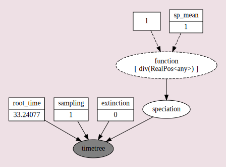
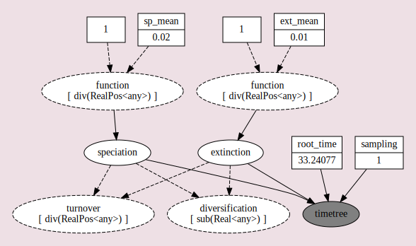
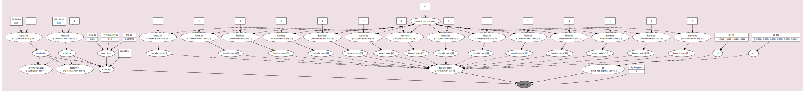
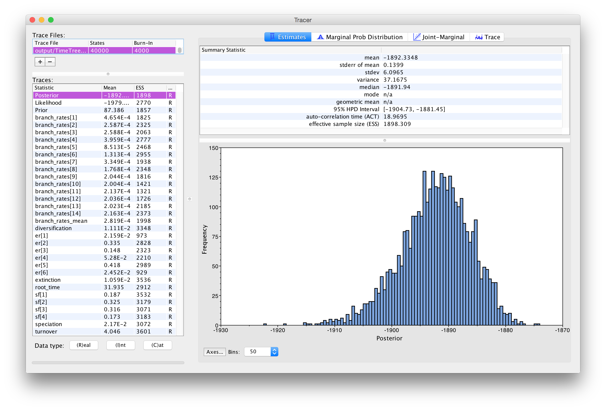
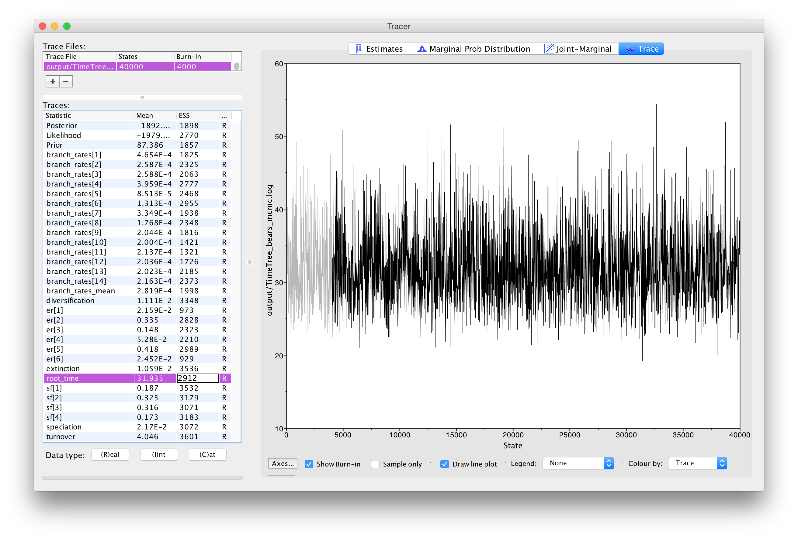
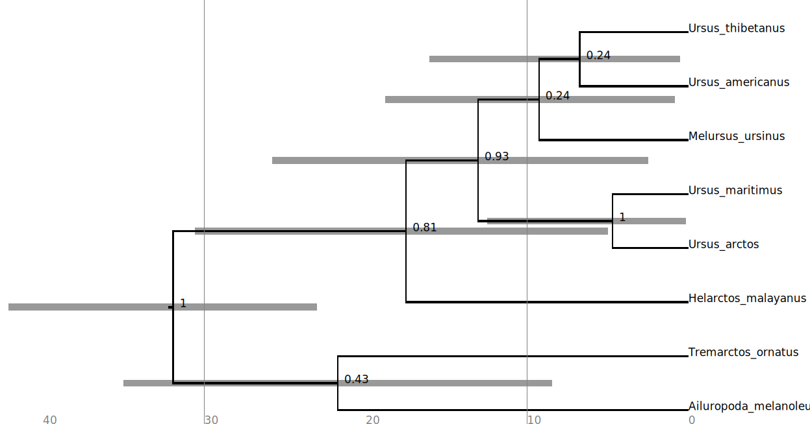

<!-- This tutorial was used for Tracy Heath's Macroevolution 2018 Course -->



This tutorial describes how to perform a simple analysis that compares three different birth-death models using Bayes factors. 
The selected model will be used as a tree prior to estimate a new dated phylogeny of all living bears. 

For details about the format of this tutorial, please see the <a href="../format">Tutorial Format Guide</a>.



### Software

This tutorial requires that you <a href="../../software">download and install</a> the current version of RevBayes. 
Additionally, you will need to download and install the program [Tracer](http://tree.bio.ed.ac.uk/software/tracer/) .

### The Data

The various exercises in this tutorial take you through the steps
required to perform phylogenetic analyses of the example dataset.
For this, you will need to download the data files.  

To keep things organized, it is recommended that you create a new directory for this tutorial, and then place all of the data files in a subdirectory.

> Create a new directory on your computer called `RB_div_clock_tutorial`.
> 
> Within the `RB_div_clock_tutorial` directory, create a subdirectory called `data`. 
> Then, dowload the [`bears_dosReis.tre`](https://revbayes.github.io/revbayes-site/tutorials/clocks/data/bears_dosReis.tre) and [`bears_irbp.nex`](https://revbayes.github.io/revbayes-site/tutorials/clocks/data/bears_irbp.nex) and place them in the `data` folder.
{:.instruction}

<!-- need to fix the data file links -->

Now you can execute RevBayes. 

> Navigate to the `RB_div_clock_tutorial` directory and execute the `rb` binary. 
> One option for doing this is to move the `rb` executable to the `RB_div_clock_tutorial`
> directory.
> 
> Alternatively, if you are on a Unix system, and have added RevBayes to your path, 
> you simply have to type `rb` in your Terminal to run the program. 
{:.instruction}

Once you execute RevBayes, you will be in the console. The rest of this tutorial will proceed 
using the interactive console.



In this first section, we will evaluate two different diversification models: (1) the Yule process and (2) the birth-death process.
To compare the relative fit of the two models, we can use [_Bayes factors_](https://en.wikipedia.org/wiki/Bayes_factor) .
In Bayesian inference, the Bayes factor is used as a method for model comparison,
allowing us to evaluate the relative support for different models given a single dataset.

Given two models, $M_0$ and $M_1$, the Bayes-factor comparison assessing
the relative fit of each model to the data, $BF(M_0,M_1)$, is:

$$BF(M_0,M_1) = \frac{\mbox{posterior odds}}{\mbox{prior odds}}.$$ 

The
posterior odds is the posterior probability of $M_0$ given the data,
$\mathbf X$, divided by the posterior odds of $M_1$ given the data:

$$\mbox{posterior odds} = \frac{\mathbb{P}(M_0 \mid \mathbf X)}{\mathbb{P}(M_1 \mid \mathbf X)},$$

and the prior odds is the prior probability of $M_0$ divided by the
prior probability of $M_1$:
$$\mbox{prior odds} = \frac{\mathbb{P}(M_0)}{\mathbb{P}(M_1)}.$$ Thus,
the Bayes factor measures the degree to which the data alter our belief
regarding the support for $M_0$ relative to $M_1$ :

$$
\begin{equation}
BF(M_0,M_1) = \frac{\mathbb{P}(M_0 \mid \mathbf X, \theta_0)}{\mathbb{P}(M_1 \mid \mathbf X, \theta_1)} \div \frac{\mathbb{P}(M_0)}{\mathbb{P}(M_1)} \tag{1}\label{eq:one}
\end{equation}
$$

Note that interpreting Bayes factors involves some subjectivity. That
is, it is up to *you* to decide the degree of your belief in $M_0$
relative to $M_1$. Despite the absence of an absolutely objective
model-selection threshold, we can refer to the scale, outlined by
,  that provides a "[rule-of-thumb](https://en.wikipedia.org/wiki/Bayes_factor#Interpretation)" for interpreting these
measures.

Unfortunately, it is generally not possible to directly calculate the
posterior odds to prior odds ratios. However, we can further define the
posterior odds ratio as: 

$$\begin{aligned}
\frac{\mathbb{P}(M_0 \mid \mathbf X)}{\mathbb{P}(M_1 \mid \mathbf X)} = \frac{\mathbb{P}(M_0)}{\mathbb{P}(M_1)} \frac{\mathbb{P}(\mathbf X \mid M_0)}{\mathbb{P}(\mathbf X \mid M_1)},
\end{aligned}$$

where $\mathbb{P}(\mathbf X \mid M_i)$ is the *marginal likelihood* of
the data (this may be familiar to you as the denominator of Bayes
Theorem, which is variously referred to as the *model evidence* or
*integrated likelihood*). Formally, the marginal likelihood is the
probability of the observed data ($\mathbf X$) under a given model
($M_i$) that is averaged over all possible values of the parameters of
the model ($\theta_i$) with respect to the prior density on $\theta_i$

$$\begin{aligned}
\mathbb{P}(\mathbf X \mid M_i) = \int \mathbb{P}(\mathbf X \mid \theta_i) \mathbb{P}(\theta_i)dt.
\end{aligned}$$

This makes it clear that more complex (parameter-rich) models are
penalized by virtue of the associated prior: each additional parameter
entails integration of the likelihood over the corresponding prior
density. If you refer back to equation \eqref{eq:one}, you can see that, with
very little algebra, the ratio of marginal likelihoods is equal to the
Bayes factor: 

$$\begin{aligned}
BF(M_0,M_1) = \frac{\mathbb{P}(\mathbf X \mid M_0)}{\mathbb{P}(\mathbf X \mid M_1)} = \frac{\mathbb{P}(M_0 \mid \mathbf X, \theta_0)}{\mathbb{P}(M_1 \mid \mathbf X, \theta_1)} \div \frac{\mathbb{P}(M_0)}{\mathbb{P}(M_1)}. 
\end{aligned}$$

Therefore, we can perform a Bayes factor comparison of two models by
calculating the marginal likelihood for each one. Alas, exact solutions
for calculating marginal likelihoods are not known for phylogenetic
models, thus we must resort to numerical
integration methods to estimate or approximate these values. 

In this
exercise, we will estimate the marginal likelihood for each partition
scheme using both the stepping-stone  estimator.
These algorithms are
similar to the familiar MCMC algorithms, which are intended to sample
from (and estimate) the joint posterior probability of the model
parameters. Stepping-stone algorithms are like a series of MCMC
simulations that iteratively sample from a specified number of
distributions that are discrete steps between the posterior and the
prior probability distributions. The basic idea is to estimate the
probability of the data for all points between the posterior and the
prior—effectively summing the probability of the data over the prior
probability of the parameters to estimate the marginal likelihood.
Technically, the steps correspond to a series of power posteriors,
where the likelihood is iteratively raised to a series of numbers
between 1 and 0. When the likelihood is raised to
the power of 1 (typically the first stepping stone), samples are drawn
from the (untransformed) posterior. By contrast, when the likelihood is
raised to the power of 0 (typically the last stepping stone), samples
are drawn from the prior. To perform a stepping-stone simulation, we
need to specify (1) the number of stepping stones (power posteriors)
that we will use to traverse the path between the posterior and the
prior (*e.g.,* we specify 50 or 100 stones),
(2) the spacing of the stones between the posterior and prior
(*e.g.,* we may specify that the stones are
distributed according to a beta distribution), (3) the number of samples
(and their thinning) to be drawn from each stepping stone, and (4) the
direction we will take (*i.e.,* from the
posterior to the prior or vice versa).

<!-- TODO: ^Move this to a reference to the BF tutorial -->

This analysis will assume that the phylogeny of the 8 extant bear species and their speciation times estimated in the study by  are observed data. 
Of course, it is not possible to observe a diversification process spanning over 30 My, but it is not unreasonable to use a well-supported phylogeny to compare models before analysis of a new dataset.



 described a stochastic process as a generating model for living taxa. 
This model makes the very simple assumption that over the course of diversification, 
there is a constant rate of speciation and the rate of extinction is 0.0. 

#### Read in the tree and get some helper variables

To start our evaluation of the Yule model, we must first read in the published phylogeny and
the branch lengths (in units of millions of years). 
For this, we will create the variable `T` to represent the published tree and use the function `readTrees()` to get the tree from the file in the `data` folder.

    T <- readTrees("data/bears_dosReis.tre")[1]

Because the `readTrees()` function can read a file with a single tree or many trees, it always returns a vector of trees. Thus, we use the index notation `[1]` to indicate that we 
only want the first tree. 

<!-- Now we will create a helper variable that simply stores the list of taxon names. 
This list will 

    taxa <- T.taxa()
 -->

Next we need a helper variable to keep track of the index in our list of moves:

    mvi = 1

#### The speciation rate

Now we can start constructing our model.
For the Yule process, we do not need very many parameters. The most important one 
is the _speciation rate_. We will assume that the mean speciation rate is 1.0 and our prior on 
this parameter is an [exponential distribution](https://en.wikipedia.org/wiki/Exponential_distribution). 

    sp_mean <- 1.0
    speciation ~ dnExp(1.0 / sp_mean)

The parameter `speciation` is a stochastic node. When it is created, RevBayes 
initializes it with a value drawn from the prior. If we wish to estimate its value, 
we must now apply a _move_ that will propose changes to `speciation` over the course of our
analysis.

For `speciation` we will use the scale move, which is called `mvScale()` in RevBayes. 
This move proposes changes to a continuous valued parameter using a multiplier. 
The degree of change from that multiplier is determined by the value of the tuning parameter 
`lambda` in the move arguments. If we set the option `tune=true`, then the tuning parameter will be optimized for our analysis during the initial burn-in phase of our MCMC. 

The move functions also require us to decide how often changes are proposed to this parameter.
This is done by setting the `weight` of the move. 

    moves[mvi++] = mvScale(speciation, lambda=1.0, tune=true, weight=3.0)

All of our moves are contained in a single vector we are calling `moves`. 
In the `Rev` code above, we put our first move in the first position of the vector. 
The `++` notation indicates that we are incrementing the index variable `mvi` by `1`. 
By using `mvi++` we are using post-incrementation. This means that the variable is increased 
_after_ it is used. 

#### The probability of sampling an extant species

The other important parameter of the Yule model is the probability of sampling a species 
in the present. In this exercise, we have every living species of bear represented in 
our dataset. Thus, it is reasonable to say that the sampling probability is approximately `1`.
We will create a _constant_ node called `sampling`.

    sampling <- 1.0

#### Conditioning on the root age

In this analysis, we will condition the process on the root age. This, we can obtain from 
the tree we imported earlier. The tree object has a method called `.rootAge()` which returns
the depth of the tree. We will create a _constant_ node for this value called `root_time`.

    root_time <- T.rootAge()

#### Putting it all together in the birth-death process distribution

We now have all of the components of our model. As you can see, we have only applied a move 
to the parameter `speciation`. The next step is to create the stochastic node representing 
the phylogeny and branching times. We assume that this time-tree is generated from a Yule 
process, which is the same as a birth-death process with extinction set to `0.0`. 

In RevBayes, the constant-rate birth-death process is invoked using the syntax `dnBDP()`. 
This distribution has the following arguments:

* `lambda`: the speciation rate
* `mu`: the extinction rate
* `rho`: the probability of sampling an extant taxon
* `rootAge`: the age of the most-recent-common ancestor of all taxa in the tree
* `samplingStrategy`: if sampling of taxa has been `uniform` (*i.e.*, random) or `diversified`
(*i.e.*, one species selected per taxonomic group)
* `condition`: if the process is conditioned on (1) there being `nTaxa` at the time of 
sampling, (2) the `survival` of the clade, or (3) the process proceeding for a given amount of `time`.
* `taxa`: the list of species names that are in the tree (this is extracted from the input tree
using `T.taxa()`)

Now that we have instantiated all of these values, we can create a stochastic node for the 
time tree (let's call it `timetree`). 

    timetree ~ dnBDP(lambda=speciation, mu=0.0, rho=sampling, rootAge=root_time, samplingStrategy="uniform", condition="nTaxa", taxa=T.taxa())

Like other stochastic nodes, RevBayes initializes the value of `timetree` by drawing a state from the prior. 
Since we are treating the tree from  as an "observation", we now 
have to fix the value of `timetree` to be the same as the published phylogeny. 
To do this, we use the member method `.clamp()` that is specific to stochastic nodes.
This is how we tell RevBayes that we have observed the value of a stochastic node and it
should be treated as data and fixed.

    timetree.clamp(T)

#### The workspace model object

Now that our model is complete, we can create a model object in our workspace using the 
`model()` function. 
This allows us to put a "wrapper" around all of the components of our model so that we can 
use it in analysis functions.
Because our model is a directed-acyclic graph, we only need to give the `model()` function 
one node and it will traverse the graph and find all of the linked parameters.

    mymodel = model(speciation)

One useful member method of the model object is the `graph()` method. This allows us to 
visualize our graphical model. Unfortunately, this is only a reasonable thing to do 
for relatively small models. This function write graph to a file in the 
<a href="https://en.wikipedia.org/wiki/DOT_(graph_description_language)">dot</a> 
graph description language. This file can be opened using the program [Graphviz](https://www.graphviz.org/), or you can try pasting the contents of the file in a [web version](http://www.webgraphviz.com/) that can 
display the graph.

We will call the graph `yule_graph.dot`. You can see the image generated by Graphviz in .

    mymodel.graph("yule_graph.dot")




The probabilistic graphical model of the Yule diversification model for the bear phylogeny.
This image was generated by running the `.graph()` method fo the model object and opening the
resulting file in the program [Graphviz](https://www.graphviz.org/).



#### Setting up the monitors

For analysis methods in RevBayes, we typically want to save states to a file. 
To do this we create a list of monitors that specify how our samples are saved.

To estimate the marginal likelihood using the stepping-stone approach, we will save the
states sampled for each step. All of the files written will be placed in a new directory
called `output` that RevBayes will create in the directory where we are running it (if it 
isn't there already.)
We also make a screen monitor so that we can see the progress of our analysis.

    monitors[1] = mnModel(filename="output/bears_yule.log",printgen=10, separator = TAB)
    monitors[2] = mnScreen(printgen=1000, speciation)

#### The analysis: Computing the marginal likelihood of the model

Above in the [introduction section](#secdiv) of this part of the tutorial, we explained
Bayes factors and the need to compute the marginal likelihoods. 
This approach uses the RevBayes function `powerPosterior()` to perform the series of MCMC simulations to estimate the marginal likelihood. 
The function takes the model, list of moves, and list of monitors. 
We must also specify an output file where the power posteriors are saved for each step and the number of steps taken. 
Here we will set the number of steps to `100`, using `cats=100`, this will result in 101 
power posteriors (or "stones").

    pow_p = powerPosterior(mymodel, moves, monitors, "output/yule_powp.out", cats=100, sampleFreq=10)

We can start the power-posterior analysis by first burning in the chain
and and discarding the first 10000 states. This will help ensure that
analysis starts from a region of high posterior probability, rather than
from some random point.

    pow_p.burnin(generations=10000,tuningInterval=200)

Now we can execute the run.

    pow_p.run(generations=10000)

Once the power posteriors have been saved to file, create a stepping
stone sampler. This function can read any file of power posteriors and
compute the marginal likelihood using stepping-stone sampling.

    ss = steppingStoneSampler(file="output/yule_powp.out", powerColumnName="power", likelihoodColumnName="likelihood")

The workspace variable `ss` now holds the estimated marginal likelihood. We can view the value
and print it to our screen.

    ss.marginal()

**Write down the value displayed. This is the marginal likelihood of the Yule model ($M_0$).**



The Yule model is a simple version of a more general stochastic branching process called the _birth-death process_ .
Under the birth-death process, extinction is assumed to be greater than 0. 

We will specify this model and also change the prior assumed for the speciation rate. 
Once we have completed our run of the stepping stone estimator, we can then compare the marginal likelihoods calculated for each.

Before we begin a new model, we should first clear our workspace. This ensures that we 
won't have any variables left over from the previous section.

    clear()

#### Read in the tree and get some helper variables

We will initialize the analysis just like we did above.

    T <- readTrees("data/bears_dosReis.tre")[1]
    mvi = 1

#### The speciation rate

For this model, let's assume that the speciation rate has a smaller mean value.

    sp_mean <- 0.2
    speciation ~ dnExp(1.0 / sp_mean)
    moves[mvi++] = mvScale(speciation, lambda=1.0, tune=true, weight=3.0)

#### The extinction rate

Now we have to create a new stochastic node for the extinction rate. This we will assume 
has a mean of `0.01`. And like the `speciation` this variable is drawn from an exponential
distribution.

    ext_mean <- 0.01
    extinction ~ dnExp(1.0 / ext_mean)
    moves[mvi++] = mvScale(extinction, lambda=1.0, tune=true, weight=3.0)

#### Diversification and turnover

Sometimes, we may be interested parameters that are functions of parameters in our model. 
We can create these as deterministic nodes and monitor these alongside our stochastic nodes.

    diversification := speciation - extinction
    turnover := extinction / speciation

#### The probability of sampling an extant species

As with the Yule model, we will assume that the sampling probability is effectively 1.0.

    sampling <- 1.0

#### Conditioning on the root age

Create the root-age constant node.

    root_time <- T.rootAge()

#### Putting it all together in the birth-death process distribution

For this model, we will set `mu=extinction`.

    timetree ~ dnBDP(lambda=speciation, mu=extinction, rho=sampling, rootAge=root_time, samplingStrategy="uniform", condition="nTaxa", taxa=T.taxa())
    timetree.clamp(T)

#### The workspace model object

Create the model object and write the Graphviz file. You can view the new model in .

    mymodel = model(speciation)
    mymodel.graph("bd_graph.dot")




The probabilistic graphical model of the birth-death diversification model for the bear phylogeny.
This image was generated by running the `.graph()` method fo the model object and opening the
resulting file in the program [Graphviz](https://www.graphviz.org/).



#### Setting up the monitors

We will create file and screen monitors like we did for the Yule model. It is important to
remember to give the file monitor a different name than you did for the Yule analysis.

    monitors[1] = mnModel(filename="output/bears_BDP.log",printgen=10, separator = TAB)
    monitors[2] = mnScreen(printgen=1000, speciation, extinction)

#### The analysis: Computing the marginal likelihood of the model

Now it is time to setup and run our power posteriors:

    pow_p = powerPosterior(mymodel, moves, monitors, "output/BDP_powp.out", cats=100, sampleFreq=10)
    pow_p.burnin(generations=10000,tuningInterval=200)
    pow_p.run(generations=10000)

Use stepping-stone sampling to calculate marginal likelihood and print the value to the screen.

    ss = steppingStoneSampler(file="output/BDP_powp.out", powerColumnName="power", likelihoodColumnName="likelihood")
    ss.marginal()

**Write down the value displayed. This is the marginal likelihood of the birth-death model ($M_1$).**



Now that we have estimates of the marginal likelihood for each of our
the candidate substitution models, we can evaluate their relative fit to
the datasets using Bayes factors. Phylogenetic programs log-transform
the likelihood values to avoid
[underflow](http://en.wikipedia.org/wiki/Arithmetic_underflow):
multiplying likelihoods (numbers $< 1$) generates numbers that are too
small to be held in computer memory. Accordingly, we need to use a
different form of equation [bfFormula] to calculate the ln-Bayes
factor (we will denote this value $\mathcal{K}$): 

$$\begin{aligned}
\mathcal{K}=\ln[BF(M_0,M_1)] = \ln[\mathbb{P}(\mathbf X \mid M_0)]-\ln[\mathbb{P}(\mathbf X \mid M_1)],
\end{aligned}$$

where $\ln[\mathbb{P}(\mathbf X \mid M_0)]$ is the *marginal lnL*
estimate for model $M_0$. The value resulting from equation
[LNbfFormula] can be converted to a raw Bayes factor by simply taking
the exponent of $\cal{K}$ 

$$\begin{aligned}
BF(M_0,M_1) = e^{\cal{K}}.
\end{aligned}$$ 

Alternatively, you can
directly interpret the strength of evidence in favor of $M_0$ in log
space by comparing the values of $\cal{K}$ to the appropriate scale. In this case, we evaluate $\cal{K}$
in favor of model $M_0$ against model $M_1$ so that:

> if $\mathcal{K} > 1$, model $M_0$ is preferred
>
> if $\mathcal{K} < -1$, model $M_1$ is preferred.
{:.instruction}

Thus, values of $\mathcal{K}$ around 0 indicate that there is no
preference for either model.

_Which is the model preferred after your analysis?_



Now that we have selected a prior tree model. We can use this model to estimate a 
dated phylogeny using molecular data (presumably the data are different from those used to generate the tree used in the previous sections).

### Setting Up the Workspace and Importing the Data

As above, we first need to clear the workspace to avoid any issues with re-doing the model.

    clear()

This time, we will not read in a tree (we are going to infer one!), but we will need to 
import our sequence data. For this analysis, we will use a single locus, the interphotoreceptor
retinoid-binding protein (irbp) sequenced for each of the living bear species. 
You should have saved the data file `bears_irbp.nex` to the `data` folder. 
We will use the `readDiscreteCharacterData()` function and assign the sequence alignment to a variable called `data`.

    data <- readDiscreteCharacterData(file="data/bears_irbp.nex")

Create the index to augment the `moves` vector.

    mvi = 1



Assuming our previous analysis indicated that the birth-death process is the preferred model, 
we can use the same model specification as in the  section.

    # Speciation rate
    sp_mean <- 0.02
    speciation ~ dnExp(1.0 / sp_mean)
    moves[mvi++] = mvScale(speciation, lambda=1.0, tune=true, weight=3.0)
    # Extinction rate
    ext_mean <- 0.01
    extinction ~ dnExp(1.0 / ext_mean)
    moves[mvi++] = mvScale(extinction, lambda=1.0, tune=true, weight=3.0)
    # Deterministic nodes
    diversification := speciation - extinction
    turnover := extinction / speciation
    # Sampling
    sampling <- 1.0

One main difference is that now we would like to infer the node ages, 
instead of using the values estimated by an earlier study. 
The first thing we need to do is create a stochastic node for the root of the tree. 
The prior distribution on the root age will come from our previous knowledge about that node.

The oldest crown fossil bear is *Kretzoiarctos beatrix*, a member of the giant panda clade 
 that is approximately 11.2 to 11.8 My old. Thus, we can use 
this age as a minimum bound on the age of the root 
of the tree. We will start by making a variable called `tKretzoiarctos` and assigning it the value of `11.2`.

    tKretzoiarctos <- 11.2

Let's use a [log-normal distribution](https://en.wikipedia.org/wiki/Log-normal_distribution) as a prior on the root time. For this, we can specify 
parameters for the mean of the distribution and the standard deviation.
In the paper by , they estimated the age of the MRCA of all bears to be 33.24. 
We will use an "off-set" lognormal distribution, so then we have to set the mean ($M$) to be $M = 33.24 - 11.2$, where 11.2 is the age of the oldest crown fossil. 

    mean_ra <- 33.24 - tKretzoiarctos

We will use a standard deviation of `0.25`.

    stdv_ra <- 0.25

The lognormal distribution has two parameters: $\mu$ is the location parameter and $\sigma$ is the standard deviation. Importantly, $\mu$ is _not_ the same as the mean for the lognormal.
We can compute $\mu$ easily by:

$$\mu = log(M) - \frac{\sigma^2}{2}.$$

If we plug in `mean_ra` and `stdv_ra` into the equation above, we get:

    mu_ra <- ln(mean_ra) - ((stdv_ra*stdv_ra) * 0.5)

Now we can define a stochastic node for the root age (called `root_time`).

    root_time ~ dnLnorm(mu_ra, stdv_ra, offset=tKretzoiarctos)

Just like in the  section above, we specify a stochastic node for the `timetree` using the `dnBDP()`.

    timetree ~ dnBDP(lambda=speciation, mu=extinction, rho=sampling, rootAge=root_time, samplingStrategy="uniform", condition="nTaxa", taxa=data.taxa())

This time we will not treat a published tree as an observation.
Instead, we will consider the `timetree` a stochastic node that we are interested in estimating. 
Thus, we will have to apply MCMC moves to the tree parameter so that we can sample the posterior distribution of trees.

First, we can apply all the moves that propose changes to the node ages:

    moves[mvi++] = mvNodeTimeSlideUniform(timetree, weight=30.0)
    moves[mvi++] = mvTreeScale(tree=timetree, rootAge=root_time, delta=1.0, tune=true, weight=3.0)
    moves[mvi++] = mvSlide(root_time, delta=2.0, tune=true, weight=10.0)
    moves[mvi++] = mvScale(root_time, lambda=2.0, tune=true, weight=10.0)

Then, we can add moves that alter the tree topology:

    moves[mvi++] = mvNNI(timetree, weight=8.0)
    moves[mvi++] = mvNarrow(timetree, weight=8.0)
    moves[mvi++] = mvFNPR(timetree, weight=8.0)



Next we must specify a model describing how substitution rates vary among branches. Under
these models we will create a stochastic node for every branch. We will assume an **uncorrelated** model where the substitution rate for each branch is drawn independently from an exponential distribution. 

Remember that the exponential distribution has a single rate parameter $\delta$ and the mean 
of an exponential is $\delta^{-1}$. If we do not know the mean branch rate, we can 
apply a _hyperprior_ to $\delta$ and account for our uncertainty in that parameter. 
We will use another exponential distribution with a mean of $10^{-1}$. The node representing
this parameter will be called `branch_rates_mean`. Since it will be a stochastic node, 
we will also propose changes to it during our MCMC.

    branch_rates_mean ~ dnExponential(10.0)
    moves[mvi++] = mvScale(branch_rates_mean, lambda=1.0, tune=true, weight=2.0)

Now that we have a hyperprior defining the mean of the prior on the branch rates, we can 
instantiate the stochastic nodes for each of the branches. To do this, we can use a `for` loop.
This will perform a set of instructions for every branch in the tree. First, we need to know
how many branches there are. This value is a function of the number of taxa. We can get the 
number of taxa from sequence `data` variable. And for any rooted tree, the number of branches  
(we will call this `n_branches`) is simply:

    n_branches <- 2 * data.ntaxa() - 2

Now we can loop over every branch and, for each one, we will create a stochastic node and add a
scale move to our `moves` list.

    for(i in 1:n_branches){
        branch_rates[i] ~ dnExp(1/branch_rates_mean)
        moves[mvi++] = mvScale(branch_rates[i], lambda=1.0, tune=true, weight=2.0)
    }

The variable `branch_rates` is now a vector of stochastic nodes. We can add an additional
move that will operate on the whole vector by scaling it up or down. Adding multiple moves
to parameters can help with mixing.

    moves[mvi++] = mvVectorScale(branch_rates, lambda=1.0, tune=true, weight=4.0)



Now let's define our substitution model. We will use a GTR model that assumes that each
type of substitution has a different rate of exchangeability and that the stationary frequencies
are unequal.

The stationary frequencies for each of the four nucleotides (A, C, G, T) must sum to $1.0$. 
This means we can use a variable type called a _simplex_ as our stochastic node. A simplex
is a vector that sums to $1.0$. A distribution that returns a simplex is a 
[Dirichlet distribution](https://en.wikipedia.org/wiki/Dirichlet_distribution). 
We also need to add a move that will proposed changes to the `sf` simplex.

    sf_hp <- v(1,1,1,1)
    sf ~ dnDirichlet(sf_hp)
    moves[mvi++] = mvSimplexElementScale(sf, alpha=10.0, tune=true, weight=3.0)

The exchangeability rates are parameterized in a similar way as the stationary frequencies, 
except here there are 6 elements instead of 4.

    er_hp <- v(1,1,1,1,1,1)
    er ~ dnDirichlet(er_hp)
    moves[mvi++] = mvSimplexElementScale(er, alpha=10.0, tune=true, weight=3.0)

With the parameters of our substitution models defined, we can create a _deterministic_ node 
for the instantaneous rate matrix, *i.e.*, the `Q` matrix. In RevBayes, there are functions
defined for all of the named rate matrices. Here, we will use the `fnGTR()` function, which
takes the exchangeability rates and stationary frequencies and calculates the elements in the
matrix.

    Q := fnGTR(er,sf)

For more details on the substitution models, please see the 
<a href="../ctmc#the-general-time-reversible-gtr-substitution-model">Substitution Model Tutorial</a>. 



Now we can link all of the elements in our graphical model. We will define a stochastic node
representing the sequence alignment. The distribution that generated our sequence data is 
a _phylogenetic continuous time Markov chain_. In RevBayes, this distribution is called 
`dnPhyloCTMC()`. For this model, the `dnPhyloCTMC()` expects the following arguments:

* `tree`: a tree with branch lengths
* `Q`: the instantaneous rate matrix
* `branchRates`: the rate of substitution for each branch in the tree
* `nSites`: the number of characters in our data matrix
* `type`: the type of data, *i.e.*, `DNA`, `RNA`, `binary`, etc.

We will call the stochastic node for our sequence data `phySeq`.

    phySeq ~ dnPhyloCTMC(tree=timetree, Q=Q, branchRates=branch_rates, nSites=data.nchar(), type="DNA")

This node represents _observed data_. Thus, we will not perform any moves on this stochastic
node. Instead, we will "clamp" the node to the observed value. The `.clamp()` method will fix
`phySeq` to the observed `data` matrix we imported in the section [above](#setting-up-the-workspace-and-importing-the-data).

    phySeq.clamp(data)

All of the parameters are now defined and linked via the phylogenetic CTMC. We can create a
model object to use the model in our workspace. It is also possible to visualize this model
using `mymodel.graph("timetree_gm.dot")` (). However, this model
involves many more parameters than in the previous sections, so this tool becomes less useful.

    mymodel = model(speciation)




The probabilistic graphical model of all parameters in the phylogenetic analysis.
This image was generated by running the `.graph()` method fo the model object and opening the
resulting file in the program [Graphviz](https://www.graphviz.org/).





Now that we have our full model, we can set up and run our MCMC. First, we will define a list 
monitors for our parameters. Since we are now dealing with a tree object, we have to 
be sure to save the sampled trees to file. The `mnModel()` function will log all of the 
numerical parameters, but not the tree. We can use the `mnFile()` monitor to write our 
MCMC samples of the tree. 

    monitors.append(mnModel(filename="output/TimetTree_bears_mcmc.log",
    printgen=10))
    monitors.append(mnFile(filename="output/TimeTree_bears_mcmc.trees",
    printgen=10, timetree))
    monitors.append(mnScreen(printgen=10, root_time, tmrca_Ursidae))

Create the MCMC object:

    mymcmc = mcmc(mymodel, monitors, moves)

Run the burn-in:

    mymcmc.burnin(generations=5000,tuningInterval=100)

This will give you the following output. 

~~~
   Running burn-in phase of Monte Carlo sampler for 5000 iterations.
   This simulation runs 1 independent replicate.
   The simulator uses 27 different moves in a random move schedule with 123 moves per iteration

Progress:
0---------------25---------------50---------------75--------------100
****************************************
~~~
{:.Rev-output}

Once the burn-in phase is completed, run the MCMC

    mymcmc.run(generations=40000)

~~~
   Running MCMC simulation
   This simulation runs 1 independent replicate.
   The simulator uses 27 different moves in a random move schedule with 123 moves per iteration

Iter        |      Posterior   |     Likelihood   |          Prior   |      root_time   |    elapsed   |        ETA   |
-----------------------------------------------------------------------------------------------------------------------
0           |       -1890.92   |       -1980.98   |        90.0529   |       27.01989   |   00:00:00   |   --:--:--   |
100         |       -1895.17   |       -1979.32   |        84.1559   |       31.20937   |   00:00:00   |   --:--:--   |
200         |       -1894.08   |       -1977.15   |        83.0738   |       30.89059   |   00:00:00   |   00:00:00   |
300         |       -1893.08   |       -1980.07   |        86.9973   |       29.60776   |   00:00:01   |   00:02:12   |
...
~~~
{:.Rev-output}



#### Inspect the MCMC

Now that our MCMC has completed, we need to evaluate the output. The first thing we can do is 
to visually inspect the sampled numerical parameters in our `TimeTree_bears_mcmc.log` file. To 
do this, we can use the handy program [Tracer](http://tree.bio.ed.ac.uk/software/tracer/) . 

> Open the program Tracer and load the `TimeTree_bears_mcmc.log` from the `output` folder
{:.instruction}




The histogram of the **_Posterior_** statistic in [Tracer](http://tree.bio.ed.ac.uk/software/tracer/).



Looking at the list of parameters in , you can see that all have high 
**_ESS_** values. This column is the _effective sample size_ of your MCMC for that parameter
and indicates the level of correlation among samples. In Tracer, if this value is colored
red for any parameter, it means that there may have been issues with mixing.

> Browse through the various views and parameters in Tracer like . Does it appear
> as though your MCMC had good or bad mixing?
{:.instruction}




The trace plot of the `root_time` parameter in Tracer.



It is important to perform multiple independent MCMC runs so that you can determine if your 
chains converged on the same stationary distribution. Additionally, you should also run
you chain under the prior to diagnose any issues with your model or MCMC and identify parameters
for which your data are not informative. However, given limited time for this tutorial, we will
only conduct one run.

#### Summarize the Tree

Assuming we did our due diligence to ensure that our MCMC sampled joint posterior distribution
effectively, we can now summarize the sampled trees. If we return to RevBayes, we can read in 
the sampled trees in `output/TimeTree_bears_mcmc.trees`. The `readTreeTrace()` function returns
a tree-trace object that we will call `tt`. 

    tt = readTreeTrace("output/TimeTree_bears_mcmc.trees", "clock")

We will find the maximum _a posteriori_ tree in our MCMC sample. This is the tree with the 
highest posterior probability. To do this we can use the `mapTree()` function on the tree-trace
object. 

    mapTree(tt, "output/TimeTree_bears_mcmc_MAP.tre")

To view this tree, we can use the online tree-viewer [IcyTree](https://icytree.org/) developed by [Tim Vaughan](https://github.com/tgvaughan). 

> Open your web browser and go to [https://icytree.org](https://icytree.org).
> 
> You can load the `TimeTree_bears_mcmc_MAP.tre` file by going to 
> the **_File -> Load from file..._** in the menu, or by simpling dragging and dropping your
> file into the browser window. 
>
> Look through the options in IcyTree and try to replicate the tree in .
{:.instruction}




The maximum _a posteriori_ tree plotted in [IcyTree](https://icytree.org/). The node bars indicate
the 95% credible interval of the node age and the internal node labels denote the bipartition
posterior probability.



