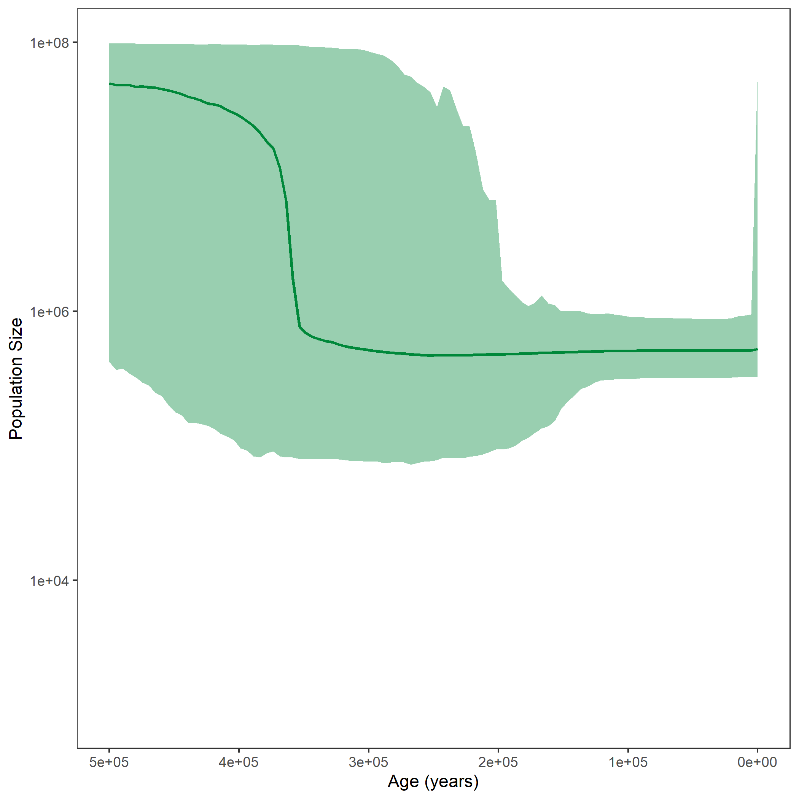


This page provides you with scripts for a coalescent analysis with a compound poisson prior on the left side.
It is in addition to the [Gaussian Markov Random Field Prior tutorial]({{base.url}}/tutorials/coalescent/GMRF).


After running your analysis, you can plot the results using the `R` package `RevGadgets`.




Example output from plotting the CPP analysis. The bold line represents the median of the posterior distribution of the population size and the shaded are shows the $95\%$ credible intervals.


