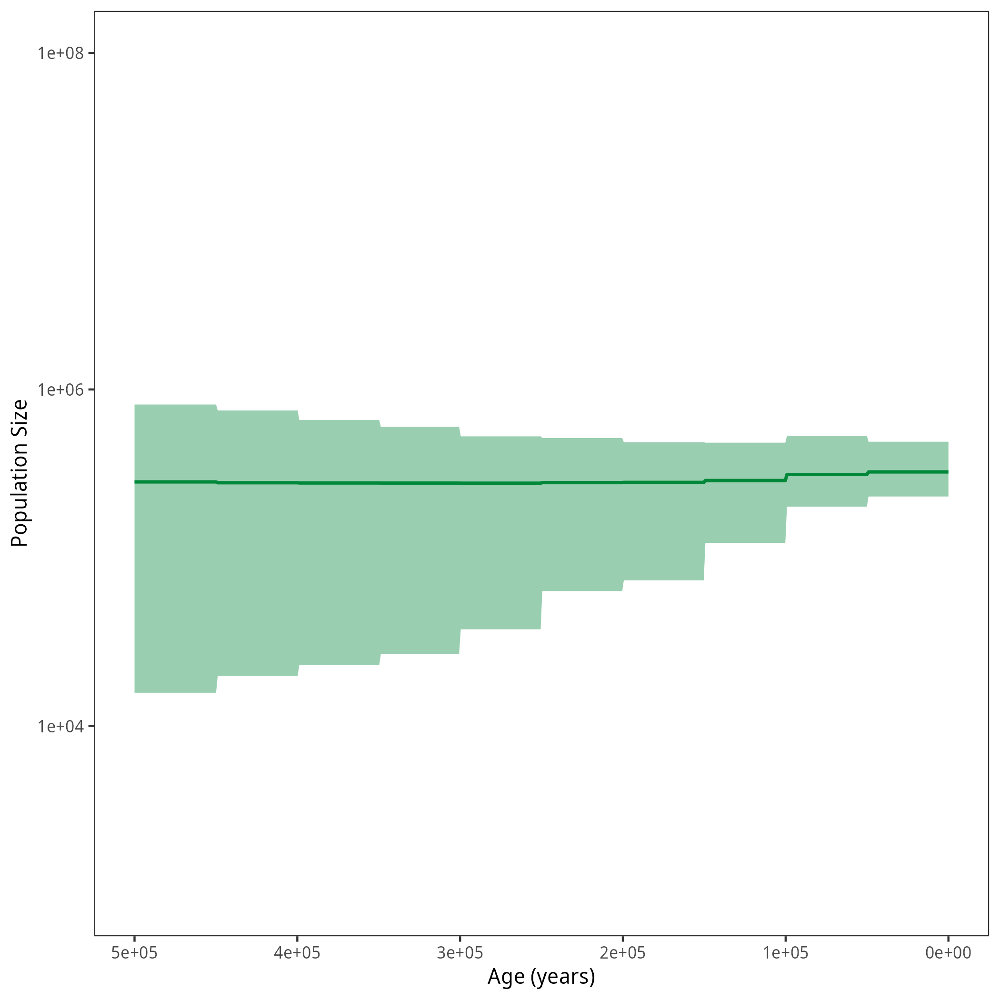


This tutorial describes how to run the Coalescent Skyline Analysis from trees with a Gaussian Markov Random Field (GMRF) prior in `RevBayes`.
Here, the trees and population sizes will not be estimated simultaneously, but it is assumed that a single tree or a sample of trees is used as input instead of a sequence alignment.



> ## For your info
> The entire process of the GMRF based estimation from trees can be executed by using the **mcmc_isochronous_GMRF_treebased.Rev** script in the **scripts** folder.
> The alternative script **mcmc_isochronous_GMRF_maptreebased.Rev** provides an example on how to compute a maximum a posteriori (MAP) tree in `RevBayes` an run the analysis based on that single tree.
> You can type the following commands into `RevBayes`:
~~~
> source("scripts/mcmc_isochronous_GMRF_treebased.Rev")
> source("scripts/mcmc_isochronous_GMRF_maptreebased.Rev")
~~~
We will walk you through the first of the scripts in the following section.
{:.info}

We will mainly highlight the parts of the script that change compared to the other exercises.
You can have another look at the other exercises, they are listed under prerequisites on the left.


Read in the output from the [constant coalescent exercise]({{base.url}}/tutorials/coalescent/Constant).
If you haven't done the exercise, please download the file **horses_iso_Constant.trees** into an "output" folder in your tutorial directory.

~~~
# Read in the tree sample
treetrace = readTreeTrace("output/horses_iso_Constant.trees", treetype = "clock", burnin = 0.1)
trees = treetrace.getTrees()

# Get the taxa
taxa <- trees[1].taxa()

# Get the number of taxa. We need these later on.
n_taxa <- taxa.size()
~~~


In contrast to the [GMRF exercise]({{base.url}}/tutorials/coalescent/GMRF), we do not set the maximal age, but take the maximal root age of all trees included in the sample.

~~~
MAX_AGE <- 0
for (T in trees) {
    MAX_AGE <- max( [MAX_AGE,T.rootAge()] )
}
~~~

The remaining part of the model is the same as in the [GMRF exercise]({{base.url}}/tutorials/coalescent/GMRF).



Now, we will instantiate the stochastic node for the tree.
Similar to the skyline exercise, we use the `dnCoalescentSkyline` distribution for the tree.
In the GMRF case, however, the method is not based on events, but has specified intervals.
Also, with having a sample of trees, we use this distribution as prior and need to clamp the tree sample.
<!--- **(why dnEmpiricalSample?)** --->
~~~
tree_prior = dnCoalescentSkyline(theta=population_size, times=changePoints, method="specified", taxa=taxa)
psi ~ dnEmpiricalSample( tree_prior)
psi.clamp(trees)
~~~

The interval times are the defined change-points.
If you would like to read them out later, you can set them here.

~~~
interval_times := changePoints
~~~

Again, we constrain the root age as before and add the same moves for the tree.


As mentioned above, you can also have a single tree as input.
In this case, you can read it in with `readTrees`.
Here, we first generate the maximum a posteriori (MAP) tree from the tree sample.
~~~
trees = readTreeTrace("output/horses_iso_Constant.trees", treetype = "clock", burnin = 0.1)
maptree = mapTree(trace=trees)
taxa <- maptree.taxa()
~~~
The remaining part of the script is similar to having a tree sample.
The node for the tree is just a little simpler:
~~~
psi ~ dnCoalescentSkyline(theta=population_size, times=changePoints, method="specified", taxa=taxa)
psi.clamp(maptree)
~~~




In the end, we need to wrap our model as before.

Finally, we add the monitors and then run the MCMC.
Remember to change the file names to avoid overwriting your previous results.

~~~
monitors.append( mnModel(filename="output/horses_iso_GMRF_treebased.log",printgen=THINNING) )
monitors.append( mnFile(filename="output/horses_iso_GMRF_treebased_NEs.log",population_size,printgen=THINNING) )
monitors.append( mnFile(filename="output/horses_iso_GMRF_treebased_times.log",interval_times,printgen=THINNING) )
monitors.append( mnScreen(population_size, printgen=100) )

mymcmc = mcmc(mymodel, monitors, moves)
mymcmc.burnin(NUM_MCMC_ITERATIONS*0.1,100)
mymcmc.run(NUM_MCMC_ITERATIONS, tuning = 100)
~~~



After running your analysis, you can plot the results using the `R` package `RevGadgets`.

~~~
library(RevGadgets)

burnin = 0.1
probs = c(0.025, 0.975)
summary = "median"

num_grid_points = 500
max_age_iso = 5e5
min_age = 0
spacing = "equal"

population_size_log = "output/horses_iso_GMRF_treebased_NEs.log"
interval_change_points_log = "output/horses_iso_GMRF_treebased_times.log"
df <- processPopSizes(population_size_log, interval_change_points_log, burnin = burnin, probs = probs, summary = summary, num_grid_points = num_grid_points, max_age = max_age_iso, min_age = min_age, spacing = spacing)
p <- plotPopSizes(df) + ggplot2::coord_cartesian(ylim = c(1e3, 1e8))
ggplot2::ggsave("figures/horses_iso_GMRF_treebased.png", p)
~~~




Example output from plotting the GMRF analysis run in this exercise. The bold line represents the median of the posterior distribution of the population size and the shaded are shows the $95\%$ credible intervals.




When you are done, have a look at the next exercise.

* [A piecewise model]({{base.url}}/tutorials/coalescent/piecewise)
