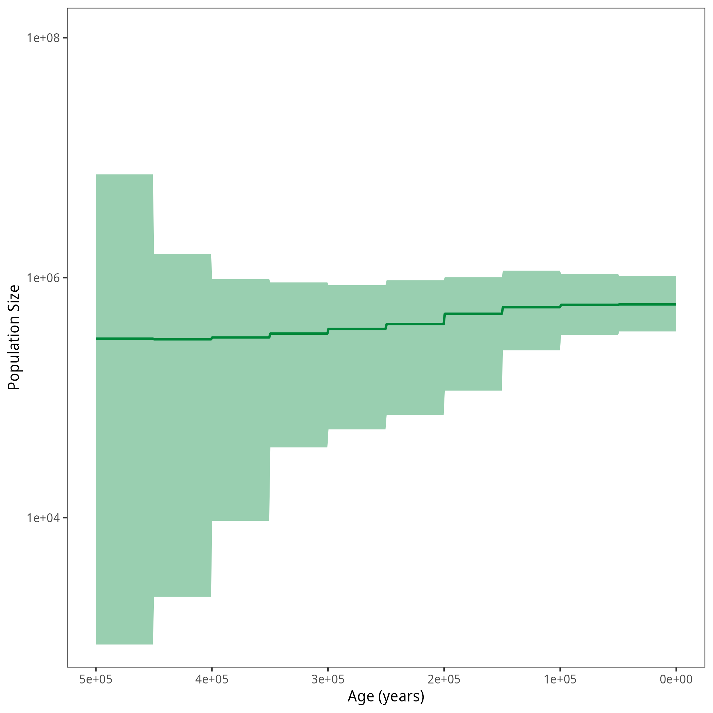


This page provides you with the script for a Horseshoe Markov Random Field (HSMRF) skyline analysis on the left side.
It is in addition to the [Gaussian Markov Random Field Prior tutorial]({{base.url}}/tutorials/coalescent/GMRF).


After running your analysis, you can plot the results using the `R` package `RevGadgets`.




Example output from plotting the HSMRF analysis. The bold line represents the median of the posterior distribution of the population size and the shaded are shows the $95\%$ credible intervals.


