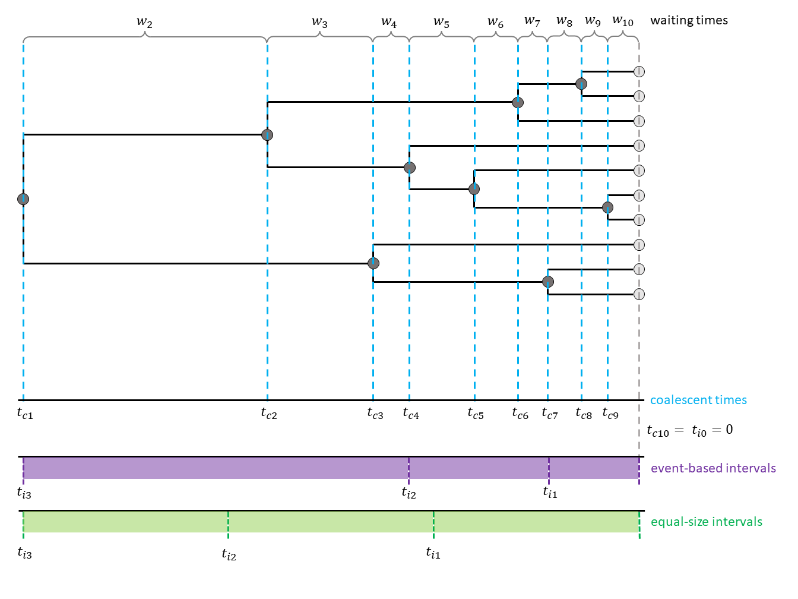


This exercise describes how to run a simple coalescent analysis in `RevBayes`.
The simplest coalescent model is one with a constant population size through time.
This population size is estimated solely based on the waiting times between coalescent events.


The coalescent process is constructing a tree backwards in time.
Starting from the samples, lineages are merged (*i.e.* coalesced), always two at a time.
Under the coalescent process, the waiting time between two coalescent events is exponentially distributed and depends on the number of 'active' lineages and the effective population size $N_e$.
Active lineages are the ones that can coalesce, the number is reduced by one with every coalescent event.
The coalescent process was first introduced by Kingman in 1982 for a constant population size .
<!---Griffiths and Tavaré then extended the model to be applicable to varying population sizes .--->

In the constant coalescent process, a single population size is assumed for the whole tree.
The relationship betweeen coalescent waiting times and effective population size is defined through the coalescent rate: $c = \frac{k (k-1)}{2N_e}$ with $k$ being the number of currently active lineages and $N_e$ being the effective population size.




Schematic figure of a coalescent tree and the different times associated with it. $w_k$ are the waiting times with $k$ active lineages, $t_{ck}$ are the coalescent events at the beginning of such a coalescent interval. $t_{ij}$ mark the points of interval change in the case of intervals independent from coalescent intervals. Here, an example with equally spaced intervals is shown.



<!--- 

...

 --->



> ## For your info
> The entire process of the estimation can be executed by using the **mcmc_homochronous_constant.Rev** script that you can download on the left side of the page.
> Save it in your **scripts** directory.
> You can type the following command into `RevBayes`:
~~~
> source("scripts/mcmc_homochronous_constant.Rev")
~~~
We will walk you through every single step in the following section.
{:.info}


<!--- Start by reading in the taxa names and age information (**bears_taxa.tsv**) and the sequences (**.nex**). --->
Start by reading in the aligned sequences.
~~~
sequences <- readDiscreteCharacterData("data/horses_homochronous_sequences_nooutgroup.fasta")
~~~

You will also need the names of the taxa and their number.

~~~
taxa <- sequences.taxa()
n_taxa <- taxa.size()
~~~


For the constant coalescent model, only one population size is estimated.
For this population size, a prior needs to be set.
Without knowing much about the population size of our horse sample, we set a uniform prior.

~~~
pop_size ~ dnUniform(0,1E8)
~~~

You may realize that in the full script, we initialize the population size to have a first value of $100$.
Later in the tutorial, we will constrain the root age of the tree to be inside the interval $\[250000, 500000\]$.
In order for our first proposed tree to comply with this constraint, an initial value of $100$ proved to avoid problems. **(phrasing!)**
~~~
pop_size.setValue(100)
~~~

We also add a move for the population size. **(add why!)**
~~~
moves.append( mvScale(pop_size, lambda=0.1, tune=true, weight=2.0) )
~~~

Now, we will instantiate the stochastic node for the tree.
~~~
psi ~ dnCoalescent(theta=pop_size, taxa=taxa)
~~~

We calibrate the tree based on the root age.
We chose a Normal distribution with a mean of $375000$ and a standard deviation of $60000$. **(add why!)**
As mentioned above, the root age will be constrained to the interval $\[250000, 500000\]$.
~~~
root_age := psi.rootAge()
obs_root_age ~ dnNormal(mean = root_age, sd = 60000, min = 250000, max = 500000)
obs_root_age.clamp(375000)
~~~

We should also add moves for the tree.
Here, the weight of the different moves is based on the number of taxa. **(add why!)**
~~~
moves.append( mvNarrow(psi, weight=n_taxa) )
moves.append( mvNNI(psi, weight=n_taxa) )
moves.append( mvFNPR(psi, weight=n_taxa/4.0) )
moves.append( mvSubtreeScale(psi, weight=n_taxa/5.0) )
moves.append( mvNodeTimeSlideUniform(psi, weight=n_taxa) )
moves.append( mvRootTimeScaleBactrian(psi, weight=n_taxa/5.0) )
moves.append( mvTreeScale(psi, weight=n_taxa/5.0) )
~~~


Finally, sequence data should be added to the analysis. Here, we assume a GTR+$\Gamma$+I substitution model, but you can of course use others. Have a look at the  tutorial to see how you can define different substitution models.
<!--- The `dnPhyloCTMC` function can take several arguments, here it is enough to specify the tree, the Q matrix and the type of data. --->

For the GTR model, we need to add exchangeability rates (`er`) and stationary frequences (`pi`).
Of course, we also add moves for these.
~~~
er_prior <- v(1,1,1,1,1,1)
pi_prior <- v(1,1,1,1)
er ~ dnDirichlet(er_prior)
pi ~ dnDirichlet(pi_prior)

moves.append( mvBetaSimplex(er, weight=3) )
moves.append( mvDirichletSimplex(er, weight=1) )
moves.append( mvBetaSimplex(pi, weight=2) )
moves.append( mvDirichletSimplex(pi, weight=1) )
~~~
This is everything needed for the Q matrix of the GTR model.
~~~
Q := fnGTR(er,pi)
~~~
For the $\Gamma$ extension to the GTR model, we need to draw the site rates (`sr`) from a discretized Gamma function with two parameters.
Here, we use `alpha` for both parameters.
We also need to add a move for `alpha`.
~~~
alpha ~ dnUniform( 0.0, 1E6 )
alpha.setValue( 1.0 )
sr := fnDiscretizeGamma( alpha, alpha, 4 )
moves.append( mvScale(alpha, weight=2.0) )
~~~
We draw the proportion of invariant sites (`p_inv`) from a Beta distribution and add a move.
~~~
p_inv ~ dnBeta(1,1)
moves.append( mvSlide(p_inv) )
~~~
The last step is to set the clock rate.
We draw it from an exponential distribution with mean $4.68e-8$ which we also use ad initial value.
This value is taken from the original analsis published in .
~~~
rate <- 1/(4.68e-8)
clock ~ dnExponential(lambda = rate)
clock.setValue(4.68e-8)

up_down_move = mvUpDownScale(weight=5.0)
up_down_move.addVariable(clock,up=TRUE)
up_down_move.addVariable(psi,up=FALSE)
moves.append( up_down_move)
~~~
The final `dnPhyloCTMC` function combines all of the previous defined parameters.
We also need to clamp the sequence data.
~~~
seq ~ dnPhyloCTMC(tree=psi, Q=Q, siteRates=sr, pInv=p_inv, type="DNA", branchRates=clock)
seq.clamp(sequences)
~~~



In the end, we need to wrap our model.

~~~
mymodel = model(psi)
~~~

Finally, we can add some monitors and then run the MCMC.

~~~
monitors.append( mnModel(filename="output/horses_constant.log",printgen=THINNING) )
monitors.append( mnFile(filename="output/horses_constant.trees",psi,printgen=THINNING) )
monitors.append( mnFile(filename="output/horses_constant_NE.log",pop_size,printgen=THINNING) )
monitors.append( mnScreen(pop_size, root_age, printgen=100) )

mymcmc = mcmc(mymodel, monitors, moves)
mymcmc.burnin(NUM_MCMC_ITERATIONS*0.1,100)
mymcmc.run(NUM_MCMC_ITERATIONS, tuning = 100)
~~~


To check whether your analysis has converged, you can use the `R` package `convenience`.
In the tutorial , you can find information and instructions on how to run the convergence assessment.



After running your analysis, you can plot the results using the `R` package `RevGadgets`.
See the [RevGadgets Github repository](https://github.com/revbayes/RevGadgets) for information on how to install the package.
After installing the package, open `R` or `RStudio` and set the tutorial directory as your working directory.
You can plot the `RevBayes` output as follows:

~~~
library(RevGadgets)

pop_size_log = "../output/horses_constant_NE.log"
pop_size <- readTrace(paths = pop_size_log,
                      burnin = burnin)[[1]]
pop_size = dplyr::rename(pop_size, "pop_size[0]" = "pop_size")
pop_size$`pop_size[1]` = pop_size$`pop_size[0]`

rates <- list(
  "population size" = pop_size,
  "coalescent time" = data.frame("interval_times[0]" = rep(0,900), "interval_times[1]" = rep(375000,900))
)
plotdata <- RevGadgets:::.makePlotData(rates = rates, probs = probs, summary = summary)
p <- plotPopulationSize(plotdata) + ggplot2::scale_y_continuous(trans = "log10", limits=c(1e4,1e8)) + ggplot2::ylab("Population Size") + ggplot2::xlab("years ago")# + ggplot2::xlim(1e6,0)
~~~

Your output should look roughly like the following figure.




Example output from plotting the constant coalescent analysis run in this exercise.




When you are done, have a look at the next exercise.

* [The skyline model](coalescent/skyline)

