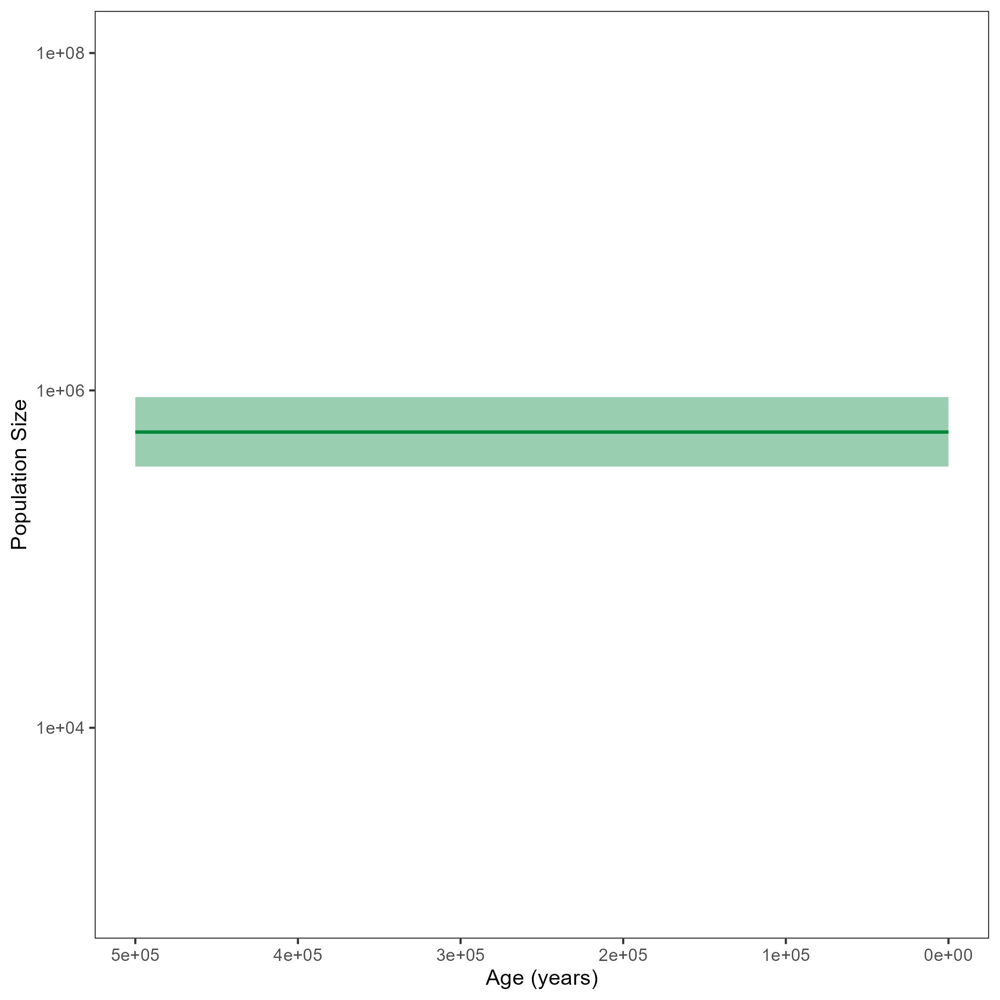


This exercise describes how to run a simple coalescent analysis in `RevBayes`.
The simplest coalescent model is one with a constant population size through time.
This population size is estimated solely based on the waiting times between coalescent events.


The coalescent process constructs a tree backwards in time.
Starting from the samples, lineages are merged (*i.e.,* coalesced), always two at a time.
Under the coalescent process, the waiting time between two coalescent events is exponentially distributed and depends on the number of 'active' lineages and the effective population size $N_e$.
Active lineages are the ones that can coalesce, the number is reduced by one with every coalescent event.
The coalescent process was first introduced by Kingman in 1982 for a constant population size .
<!---Griffiths and Tavaré then extended the model to be applicable to varying population sizes .--->

In the constant coalescent process, a single population size is assumed for the whole tree.
The relationship betweeen coalescent waiting times and effective population size is defined through the coalescent rate: $c = \frac{k (k-1)}{2N_e}$ with $k$ being the number of currently active lineages and $N_e$ being the effective population size.

In , a general scheme is shown.
Waiting times are in between coalescent events.


  

Schematic figure of a coalescent tree and the different times associated with it. $w_k$ are the waiting times with $k$ active lineages, $t_{c,k}$ are the coalescent events at the beginning of such a coalescent interval. Here, an example of a constant population size trajectory is shown. The bold line represents the median of the posterior distribution of the population size and the shaded are shows the $95\%$ credible intervals.



<!--- 

...

 --->



> ## For your info
> The entire process of the estimation can be executed by using the **mcmc_isochronous_constant.Rev** script that you can download on the left side of the page.
> Save it in your **scripts** directory.
> You can type the following command into `RevBayes`:
~~~
> source("scripts/mcmc_isochronous_constant.Rev")
~~~
We will walk you through every single step in the following section.
{:.info}

For every MCMC analysis, convergence assessment is an important step.
In the tutorial , you can find information and instructions on how to run the convergence assessment with the `R` package `convenience`.
It is generally recommended to have at least two replicates per MCMC analysis to be able to compare convergence between runs.
Thus, we first set the number of replicates:
~~~
NUM_REPLICATES      = 2
~~~

In the beginning, we also define a few variables for running the MCMC.
These are the number of iterations, and the so-called "thinning" which we use to say that we want to sample every $10^{th}$ iteration.
~~~
NUM_MCMC_ITERATIONS = 10000
THINNING            = 10
~~~

We also need to create vectors for the monitors and moves of the MCMC.
Moves are functions that propose new parameter values in your MCMC, based on the current value.
These newly proposed parameters can either be accepted or rejected.
Depending on this acceptance / rejection, the posterior distribution of your parameters will be formed.
See for example  for more information on the acceptance / rejection procedure.
Monitors are later used to track the progress of your analysis, but are also needed to write output files.
~~~
moves     = VectorMoves()
monitors  = VectorMonitors()
~~~


Start by reading in the aligned sequences of the isochronous horse data.
~~~
sequences <- readDiscreteCharacterData("data/horses_isochronous_sequences.fasta")
~~~

You will also need the names of the taxa and their number.

~~~
taxa <- sequences.taxa()
n_taxa <- taxa.size()
~~~


For the constant coalescent model, only one population size is estimated.
For this population size, a prior needs to be set.
Without knowing much about the population size of our horse sample, we set a uniform prior.

~~~
pop_size ~ dnUniform(0,1E8)
~~~

You may realize that in the full script, we initialize the population size to have a first value of $100$.
Later in the tutorial, we will constrain the root age of the tree to be inside the interval $\[250 000, 500 000\]$.
In order for our first proposed tree to comply with this constraint, an initial value of $100$ proved to lead to reasonable initial proposals.
~~~
pop_size.setValue(100)
~~~

We also add a move for the population size.
Here, we chose a scaling move which means that the current values is multiplied by a scaling factor to propose a new value.
See for example  for information on moves.
~~~
moves.append( mvScale(pop_size, lambda=0.1, tune=true, weight=2.0) )
~~~

Now, we will instantiate the stochastic node for the tree.
The `dnCoalescent` distribution should be used for a constant coalescent process.
It takes a value for the population size (`theta`) and the taxa as input.
~~~
psi ~ dnCoalescent(theta=pop_size, taxa=taxa)
~~~

We calibrate the tree based on the root age.
We chose a Normal distribution with a mean of $375 000$ and a standard deviation of $60 000$.
As mentioned above, the root age will be constrained to the interval $\[250 000, 500 000\]$.
As we have access to the original analysis from , we could see that this should be the rough range of the root.

~~~
root_age := psi.rootAge()
obs_root_age ~ dnNormal(mean = root_age, sd = 60000, min = 250000, max = 500000)
obs_root_age.clamp(375000)
~~~

We should also add moves for the tree.
These include moves on a single branch, subtrees or the whole tree.
Here, the weight of the different moves is based on the number of taxa.
If a move changes a single branch (*e.g.* `mvNNI`), it will be applied more often and thus have a higher weight than a move which changes the whole tree (*e.g.* `mvTreeScale`).

~~~
moves.append( mvNarrow(psi, weight=n_taxa) )
moves.append( mvNNI(psi, weight=n_taxa) )
moves.append( mvFNPR(psi, weight=n_taxa/4.0) )
moves.append( mvSubtreeScale(psi, weight=n_taxa/5.0) )
moves.append( mvNodeTimeSlideUniform(psi, weight=n_taxa) )
moves.append( mvRootTimeScaleBactrian(psi, weight=n_taxa/5.0) )
moves.append( mvTreeScale(psi, weight=n_taxa/5.0) )
~~~


Finally, sequence data should be added to the analysis. Here, we assume a GTR+$\Gamma$+I substitution model, but you can of course use others. Have a look at the  tutorial to see how you can define different substitution models.
<!--- The `dnPhyloCTMC` function can take several arguments, here it is enough to specify the tree, the Q matrix and the type of data. --->

For the GTR model, we need to add exchangeability rates (`er`) and stationary frequences (`pi`).
Of course, we also add moves for these.
~~~
er_prior <- v(1,1,1,1,1,1)
pi_prior <- v(1,1,1,1)
er ~ dnDirichlet(er_prior)
pi ~ dnDirichlet(pi_prior)

moves.append( mvBetaSimplex(er, weight=3) )
moves.append( mvDirichletSimplex(er, weight=1) )
moves.append( mvBetaSimplex(pi, weight=2) )
moves.append( mvDirichletSimplex(pi, weight=1) )
~~~
This is everything needed for the Q matrix of the GTR model.
~~~
Q := fnGTR(er,pi)
~~~
For the $\Gamma$ extension to the GTR model, we need to draw the site rates (`sr`) from a discretized Gamma function with two parameters.
Here, we use `alpha` for both parameters.
We also add a scaling move for `alpha`.
~~~
alpha ~ dnUniform( 0.0, 1E6 )
alpha.setValue( 1.0 )
sr := fnDiscretizeGamma( alpha, alpha, 4 )
moves.append( mvScale(alpha, weight=2.0) )
~~~
We draw the proportion of invariant sites (`p_inv`) from a Beta distribution and add a sliding window move.
~~~
p_inv ~ dnBeta(1,1)
moves.append( mvSlide(p_inv) )
~~~
The last step is to set the clock rate.
We draw it from a log uniform distribution here.
Again, we know from the original analysis  that the true value should be around $4.68\*10^{-8}$ and thus set the lower bound of the distribution to $1\*10^{-12}$ and the upper bound to $1\*10^{-4}$.
We also initialize the value to be equal to the original analysis.
Then, we  add a scaling move for the clock rate.
<!--- We draw it from an exponential distribution with mean $4.68e-8$ which we also use as initial value.
This value is taken from the original analsis published in . --->
~~~
clock ~ dnLoguniform(1e-12,1e-4)
clock.setValue(4.68e-8)
moves.append( mvScale(clock, weight=2.0) )
~~~
Additionally, we add a scaling move which makes sure to regulate clock rate and the root age.
This needs to be done as root age and clock rate are intertwined and can not be clearly seperated.
Here, whenever the clock rate will be increased, the root age will be decreased.
Note that you could also calibrate the clock rate instead of the root age of the tree as we do it here.
~~~
up_down_move = mvUpDownScale(weight=5.0)
up_down_move.addVariable(clock,up=TRUE)
up_down_move.addVariable(psi,up=FALSE)
moves.append( up_down_move)
~~~
The final `dnPhyloCTMC` function combines all of the previous defined parameters.
We also need to clamp the sequence data.
~~~
seq ~ dnPhyloCTMC(tree=psi, Q=Q, siteRates=sr, pInv=p_inv, type="DNA", branchRates=clock)
seq.clamp(sequences)
~~~



In the end, we need to wrap our model.

~~~
mymodel = model(psi)
~~~

Now, we add some monitors.
The `mnModel` monitor keeps track of all model parameters and thus is written into our main `.log` file.
With `mnFile`, you can keep track of the trees or parameters that you would like to keep in an extra file.
`mnScreen` is responsible for having output printed directly to your screen.
This output will not per se be saved in a file.

~~~
monitors.append( mnModel(filename="output/horses_iso_constant.log",printgen=THINNING) )
monitors.append( mnFile(filename="output/horses_iso_constant.trees",psi,printgen=THINNING) )
monitors.append( mnFile(filename="output/horses_iso_constant_NE.log",pop_size,printgen=THINNING) )
monitors.append( mnScreen(pop_size, root_age, printgen=100) )
~~~

The final step is to run the mcmc.
Make sure to set `combine="mixed"` for the output of the two replicates to be combined in the end.
~~~
mymcmc = mcmc(mymodel, monitors, moves, nruns=NUM_REPLICATES, combine="mixed")
mymcmc.burnin(NUM_MCMC_ITERATIONS*0.1,100)
mymcmc.run(NUM_MCMC_ITERATIONS, tuning = 100)
~~~


To check whether your analysis has converged, you can use the `R` package `convenience`.
Have a look at the  tutorial.

**Add convergence results here**



After running your analysis, you can plot the results using the `R` package `RevGadgets`.
See the [RevGadgets Github repository](https://github.com/revbayes/RevGadgets) for information on how to install the package.
After installing the package, open `R` or `RStudio` and set the tutorial directory as your working directory.
You can plot the `RevBayes` output as follows:

~~~
library(RevGadgets)

burnin = 0.1
probs = c(0.025, 0.975)
summary = "median"

population_size_log = "output/horses_iso_constant_NE.log"
df <- processPopSizes(population_size_log, method = "constant", burnin = burnin, probs = probs, summary = summary)
p <- plotPopSizes(df, method = "constant") + ggplot2::coord_cartesian(ylim = c(1e3, 1e8), xlim = c(1e5, 0))
ggplot2::ggsave("horses_constant.png", p)
~~~

Your output should look roughly like the following figure.




Example output from plotting the constant coalescent analysis run in this exercise. The bold line represents the median of the posterior distribution of the population size and the shaded are shows the $95\%$ credible intervals.




When you are done, have a look at the next exercise.

* [The skyline model]({{base.url}}/tutorials/coalescent/skyline)
