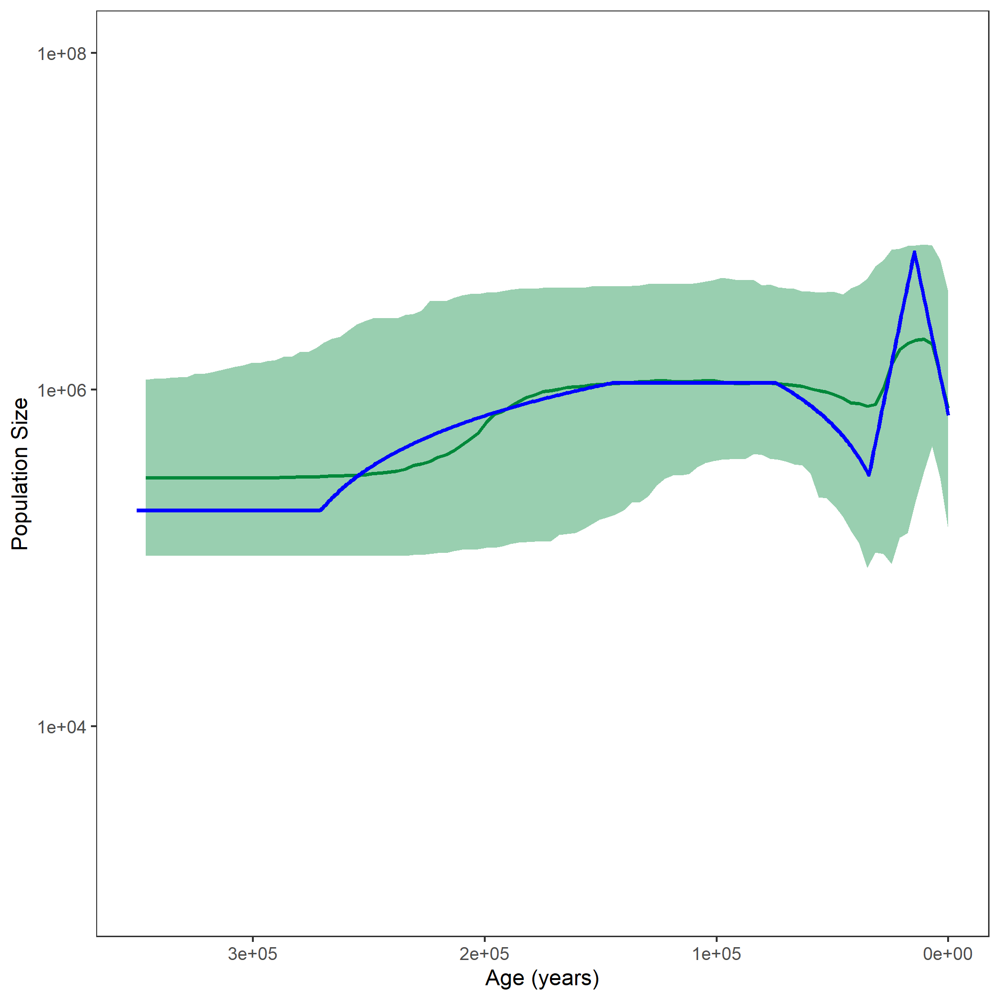


This exercise describes how to run a piecewise Skyline Analysis in `RevBayes`.
In this case, we will define an individual demographic function with different basic "pieces".
The pieces can be either constant, linear or exponential.
For all of these pieces, the different values of $N_e$ and the change points in between can be estimated.

<!--- From looking at the output of the skyline analysis, we could assume three pieces:
* a recent, constant demographic history
* an exponential population size trajectory in the middle
* and another constant piece as most ancient. --->


The three implemented base demographic models in RevBayes are a constant, a linear and an exponential model.

For the constant model, the population size through time is easily defined:

$$N_e(t) = N_e(t_{i,j})$$,

with $t_{i,j}$ being the time at the beginning of the $j^{th}$ interval.

For the linear model, the slope depends on the starting and ending values of the population size at the interval change points.
We define $\alpha$ as the slope.

$$\alpha = \frac{N_e(t_{i,(j+1)}) - N_e(t_{i,j})}{t_{i,(j+1)} - t_{i,j}}$$.

Then, the effective population size through time is calculated as follows:

$$N_e(t) = N_e(t_{i,j}) + (t-t_{i,j}) * \alpha$$.

Finally, for the exponential model, $\alpha$ is defined as follows:

$$\alpha = \frac{log(\frac{N_e(t_{i,(j+1)})}{N_e(t_{i,j})})}{t_{i,j} - t_{i,(j+1)}},$$

and the effective population size is:

$$N_e(t) = N_e(t_{i,j}) exp((t_{i,j} - t)\alpha).$$





> ## For your info
> The entire process of the skyline estimation can be executed by using the **mcmc_piecewise.Rev** script in the **scripts** folder.
> You can type the following command into `RevBayes`:
~~~
> source("scripts/mcmc_piecewiese.Rev")
~~~
We will walk you through every single step in the following section.
{:.info}

We will mainly highlight the parts of the script that change compared to the [constant coalescent model]({{base.url}}/tutorials/coalescent/constant).


Read in the data as described in the first exercise.


For the piecewise model, you need to define which kinds of pieces should be included.

For each piece, one or two population sizes will be estimated.
Choose a prior and add a move for each population size.
In the case of a constant coalescent process, one population size is needed.
For the two other processes, one population size for the start of the piece and one for the end of the piece are needed.
Here, we would like to test six different pieces.
Two should be constant, two linear and two exponential.
Thus, we need five population sizes.

~~~
for (i in 1:5){
    pop_size[i] ~ dnUniform(0,1E8)
    pop_size[i].setValue(100)
    moves.append( mvScale(pop_size[i], lambda=0.1, tune=true, weight=2.0) )
}
~~~

We also set prior distributions on the times of the change points between pieces.

~~~
change_points[1] ~ dnUniform(1E4,2E4)
change_points[2] ~ dnUniform(3E4,4E4)
change_points[3] ~ dnUniform(6E4,9E4)
change_points[4] ~ dnUniform(1.2E5,1.7E5)
change_points[5] ~ dnUniform(2.2E5,3.2E5)
for (i in 1:5){
    moves.append( mvSlide(change_points[i], delta=0.1, tune=true, weight=2.0) )
}
~~~

Now, we need to define the different pieces.
Depending on the type of piece, different parameters need to be added:

~~~
dem_exp_1 = dfExponential(N0 = pop_size[1], N1=pop_size[2], t0=0, t1=change_points[1])
dem_exp_2 = dfExponential(N0 = pop_size[2], N1=pop_size[3], t0=change_points[1], t1=change_points[2])
dem_lin_1 = dfLinear(N0 = pop_size[3], N1=pop_size[4], t0=change_points[2], t1=change_points[3])
dem_const_1 = dfConstant(pop_size[4])
dem_lin_2 = dfLinear(N0 = pop_size[4], N1=pop_size[5], t0=change_points[4], t1=change_points[5])
dem_const_2 = dfConstant(pop_size[5])
~~~



Now, we will instantiate the stochastic node for the tree with `dnCoalescentDemography`.
In this case, we set the vector of demographic models and the change points as input.

~~~
psi ~ dnCoalescentDemography([dem_exp_1,dem_exp_2,dem_lin_1,dem_const_1,dem_lin_2,dem_const_2], changePoints=change_points, taxa=taxa)
~~~

For this analysis, we constrain the root age as before and add the same moves for the tree.


This part is also taken from the constant coalescent exercise.



In the end, we need to wrap our model as before.

Finally, we add the monitors and then run the MCMC.

~~~
monitors.append( mnModel(filename="output/horses_piecewise.log",printgen=THINNING) )
monitors.append( mnFile(filename="output/horses_piecewise.trees",psi,printgen=THINNING) )
monitors.append( mnFile(filename="output/horses_piecewise_NEs.log",pop_size,printgen=THINNING) )
monitors.append( mnFile(filename="output/horses_piecewise_times.log",change_points,printgen=THINNING) )
monitors.append( mnScreen(pop_size, root_age, printgen=100) )
~~~



After running your analysis, you can plot the results using the `R` package `RevGadgets` and by additionally defining the demographic models from this exercise.


~~~
interval_change_points_log_skyline = "../output/horses_skyline_times.log"
df_skyline <- processPopSizes(population_size_log = population_size_log_skyline, interval_change_points_log = interval_change_points_log_skyline, method = "events", burnin = burnin, probs = probs, summary = summary)
p_skyline <- plotPopSizes(df_skyline) + ggplot2::coord_cartesian(ylim = c(1e3, 1e8))

population_size_log = "../output/horses_piecewise_NEs.log"
interval_change_points_log = "../output/horses_piecewise_times.log"
pop_sizes <- readTrace(population_size_log, burnin = burnin)[[1]]
interval_times <- readTrace(interval_change_points_log, burnin = burnin)[[1]]

pop_size_medians = apply(pop_sizes[,grep("size", names(pop_sizes))], 2, median)
pop_size_quantiles = apply(pop_sizes[,grep("size", names(pop_sizes))], 2, quantile, probs = probs)
time_medians =apply(interval_times[,grep("change_points", names(interval_times))], 2, median)

# exp, exp, lin, const, lin, const
exponential_recent <- function(t){
  N0 <- pop_size_medians[1]
  N1 <- pop_size_medians[2]
  t0 <- 0
  t1 <- time_medians[1]
  alpha = log( N1/N0 ) / (t0 - t1)
  return (N0 * exp( (t0-t) * alpha))
}

exponential_ancient <- function(t){
  N0 <- pop_size_medians[2]
  N1 <- pop_size_medians[3]
  t0 <- time_medians[1]
  t1 <- time_medians[2]
  alpha = log( N1/N0 ) / (t0 - t1)
  return (N0 * exp( (t0-t) * alpha))
}

linear_recent <- function(t){
  N0 <- pop_size_medians[3]
  N1 <- pop_size_medians[4]
  t0 <- time_medians[2]
  t1 <- time_medians[3]
  alpha = ( N1-N0 ) / (t1 - t0)
  return (N0 + (t-t0) * alpha)
}

# constant with pop_size[4] from time[3] to time[4]

linear_ancient <- function(t){
  N0 <- pop_size_medians[4]
  N1 <- pop_size_medians[5]
  t0 <- time_medians[4]
  t1 <- time_medians[5]
  alpha = ( N1-N0 ) / (t1 - t0)
  return (N0 + (t-t0) * alpha)
}

# constant with pop_size[5] from time[5] to Inf

all_combined <- function(t){
  if (t < time_medians[1]){
    
    return(exponential_recent(t))
    
  } else if (t < time_medians[2]){
    
    return(exponential_ancient(t))
    
  } else if (t < time_medians[3]){
    
    return(linear_recent(t))
    
  } else if (t < time_medians[4]){
    
    return(pop_size_medians[4])
    
  } else if (t < time_medians[5]){
    
    return(linear_ancient(t))
    
  } else {
    
    return(pop_size_medians[5])
    
  }
}

grid = seq(0, 3.5e5, length.out = 500)
pop_size_curve <- sapply(grid, all_combined)

df <-tibble::tibble(.rows = length(grid))
df$value <- pop_size_curve
df$time <- grid

p <- p_skyline + ggplot2::geom_line(data = df, aes(x = time, y = value), size = 0.9, color = "blue")
ggplot2::ggsave("horses_piecewise_6diff.png", p)
~~~





This is how the resulting skyline plot with addition of the piecewise model should roughly look like.




When you are done with all exercises, have a look at the [summary]({{base.url}}/tutorials/coalescent/summary).

