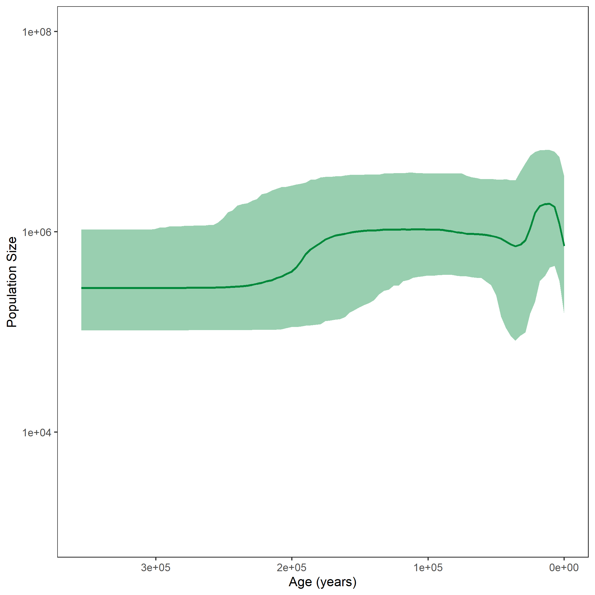


Skyline Plots are models for how population size changes through time.
The classical skyline plot  provided the first implementation of this idea.
For each interval between two coalescent events, an effective population size was calculated.
This led to a plot looking very similar to a skyline, thus giving the method its name (see  for a hypothetical example).
The generalized skyline plot  aimed at reducing the noise from analyzing every single interval by grouping several coalescent events into one interval.
This created a smoother curve.
First, these models were used for maximum likelihood (ML) estimation of population sizes through time.
By now, several extensions allowing for Bayesian estimation have been published (see for example ).
In `RevBayes`, a Skyline plot method is implemented with constant or linear population size intervals.
<!--- In other software, you can also find the possibility to have linear skyline intervals. --->
<!--- Even though this is not implemented explicitly as skyline in `RevBayes`, you can also piece together linear intervals (have a look at the [piecewise model exercise]({{base.url}}/tutorials/coalescent/piecewise), if you are interested in this). --->
<!--- The length of these intervals is not based on the timing of the coalescent events, but can be individually chosen. --->
The length of the skyline intervals can either be defined by a specific number of intervals ending at coalescent events, or alternatively be chosen individually without depending on the coalescent events.
<!--- In this tutorial, each interval will have the same length. --->
In this exercise, each interval will group five coalescent events.
Have a look at , for a hypothetical example with three events per interval.


  

Hypothetical example of a classical skyline plot. $w_k$ are the waiting times with $k$ active lineages, $t_{c,k}$ are the coalescent events at the beginning of such a coalescent interval. Here, a population size for each interval between coalescent events is calculated. The bold line represents the maximum likelihood estimate of the population size.




  

Hypothetical example of a Bayesian skyline plot with the interval length dependent on the number of coalescent events (event-based).  $w_k$ are the waiting times with $k$ active lineages, $t_{c,k}$ are the coalescent events at the beginning of such a coalescent interval. $t_{i,j}$ mark the points of interval change.  Here, the change points are event-based, *i.e.*, dependent on coalescent events. The bold line represents the median of the posterior distribution of the population size and the shaded are shows the $95\%$ credible intervals.





We assume that the phylogeny of the samples is known.
There are $n$ samples, with $k$ active lineages at the current point in time $t$.
Time starts at $t = 0$.
The waiting times between coalescent events $w_k$ are exponentially distributed with rate $c = \frac{k (k-1)}{2N_e(t)}$ with $N_e$ being the population size.
<!--- In the case of a skyline plot, the population size curve is split into $m$ intervals which each have a starting point $t_i$. --->

The likelihood for a given piecewise-constant population size trajectory is computed as the product of the probability density functions of the coalescent waiting times, which are calculated as follows:

$$p(w_k | t_{c,k}) = \frac{k (k -1)}{2N_e(t_{c,k} + w_k)} exp \left[ \int_{t_{c,k}}^{t_{c,k}+w_k} \frac{k (k -1)}{2N_e(t)} dt \right]$$

Each $t_{c,k}$ is the beginning of the respective kth coalescent interval.
The waiting times $w_k$ refer to the waiting time starting when there are $k$ active lineages.

<!--- In our case, $N_e(t)$ is a piecewise constant demographic function with $m$ intervals which each have a starting point $t_i$ and the length $l$.
**Do I need to go into the intervals here?** --->





> ## For your info
> The entire process of the skyline estimation can be executed by using the **mcmc_isochronous_skyline.Rev** script that you can download on the left side of the page.
> Save it in your **scripts** directory.
> You can type the following command into `RevBayes`:
~~~
> source("scripts/mcmc_isochronous_skyline.Rev")
~~~
We will walk you through the script in the following section.
{:.info}

We will mainly highlight the parts of the script that change compared to the [constant coalescent model]({{base.url}}/tutorials/coalescent/constant).


Read in the data as described in the first exercise.


For the skyline model, you need to decide on the number of intervals.
In order to get five coalescent events per interval, we divide the number of coalescent events by five.
With $n$ taxa, we expect $(n-1)$ coalescent events, until there is only one lineage left.

~~~
NUM_INTERVALS = ceil((n_taxa - 1) / 5)
~~~

For each interval, a population size will be estimated. Choose a prior and add a move for each population size.

~~~
for (i in 1:NUM_INTERVALS) {
    pop_size[i] ~ dnUniform(0,1E6)
    pop_size[i].setValue(100000)
    moves.append( mvScale(pop_size[i], lambda=0.1, tune=true, weight=2.0) )
}
~~~



Now, we will instantiate the stochastic node for the tree.
The Skyline version of the Coalescent distribution function `dnCoalescentSkyline` takes the vector of population sizes the taxa as input. <!--- **(need to check whether it can take more)** --->
By chosing `methods="events"`, the interval lengths will be chosen based on the number of events.

~~~
psi ~ dnCoalescentSkyline(theta=pop_size, method="events", taxa=taxa)
~~~

For later plotting and analyzing the population size curve, we need to retrieve the resulting interval times.

~~~
interval_times := psi.getIntervalAges()
~~~

For this analysis, we constrain the root age as before and add the same moves for the tree.


This part is also taken from the [constant coalescent exercise]({{base.url}}/tutorials/coalescent/constant).



Finally, we need to wrap our model as before.
We add the monitors and then run the MCMC.
Here, another monitor is added for the interval times.

~~~
monitors.append( mnModel(filename="output/horses_iso_skyline.log",printgen=THINNING) )
monitors.append( mnFile(filename="output/horses_iso_skyline.trees",psi,printgen=THINNING) )
monitors.append( mnFile(filename="output/horses_iso_skyline_NEs.log",pop_size,printgen=THINNING) )
monitors.append( mnFile(filename="output/horses_iso_skyline_times.log",interval_times,printgen=THINNING) )
monitors.append( mnScreen(pop_size, root_age, printgen=100) )
~~~



After running your analysis, you can plot the results again using the `R` package `RevGadgets`.

~~~
library(RevGadgets)

burnin = 0.1
probs = c(0.025, 0.975)
summary = "median"

num_grid_points = 500
max_age_iso = 5e5

population_size_log = "output/horses_iso_skyline_NEs.log"
interval_change_points_log = "output/horses_iso_skyline_times.log"
df <- processPopSizes(population_size_log, interval_change_points_log, burnin = burnin, probs = probs, summary = summary, num_grid_points = num_grid_points, max_age = max_age_iso)
p <- plotPopSizes(df) + ggplot2::coord_cartesian(ylim = c(1e3, 1e8))
ggplot2::ggsave("horses_iso_skyline.png", p)
~~~




Example output from plotting the coalescent skyline analysis run in this exercise. The bold line represents the median of the posterior distribution of the population size and the shaded are shows the $95\%$ credible intervals.




When you are done, have a look at the next exercise.

* [The Gaussian Markov Random Field (GMRF) model]({{base.url}}/tutorials/coalescent/GMRF)


There are many different ways of defining priors for the population sizes.
Here, we chose to draw the population sizes from a Uniform distribution and to treat the intervals as independent and identically distributed (iid).
In other software, the default priors can be defined differently.

For example, for the Bayesian Skyline Plot , all but the first population size are drawn from an exponential distribution.
The mean of this distribution is set to be the previous population size.
This means that the population sizes in neighbouring intervals are correlated.
For the first population size, a log uniform distribution was chosen.

In a skyride analysis , the population size is directly estimated on a log scale.
The intervals also are correlated, but a Gaussian Markov Random Field (GMRF) prior is used with the degree of smoothing being regulated by a precision parameter.

For the Extended Bayesian Skyline Plot , the number of changing points is estimated by stochastic search variable selection.
The intervals are considered to be iid.
Also, the default demographic function usually is piecewise linear and not piecewise constant as in this tutorial.
The estimation of the number of intervals can also be done slightly differently, as we show in the [Compound Poisson Process Prior]({{base.url}}/tutorials/coalescent/GMRF#secCPP) section of the [GMRF tutorial]({{base.url}}/tutorials/coalescent/GMRF) which is next.

You can try and change the priors now accordingly.
If you would like to have an example of what a `RevBayes` script with these different priors can look like, have a look at
* the [example script for a BSP analysis](scripts/mcmc_isochronous_BSP.Rev),
* the [example script for a skyride analysis](scripts/mcmc_isoochronous_skyride.Rev), or
* the [example script for an EBSP analysis](scripts/mcmc_isochronous_EBSP.Rev).

Note that all three examples have the interval change points on coalescent events (what we call "event-based", as in the skyline model presented here).
In the next tutorial ([The GMRF model]({{base.url}}/tutorials/coalescent/GMRF)), we use intervals with changing points independent from coalescent events.
