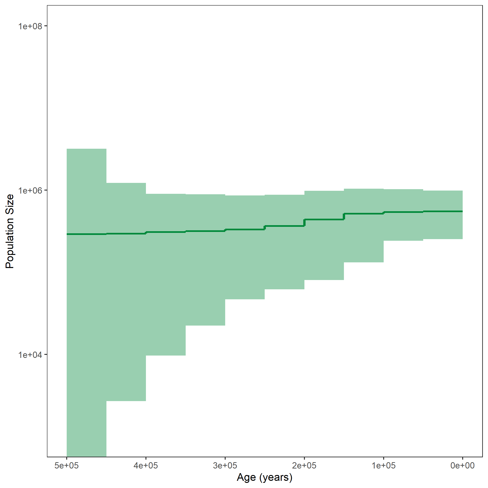
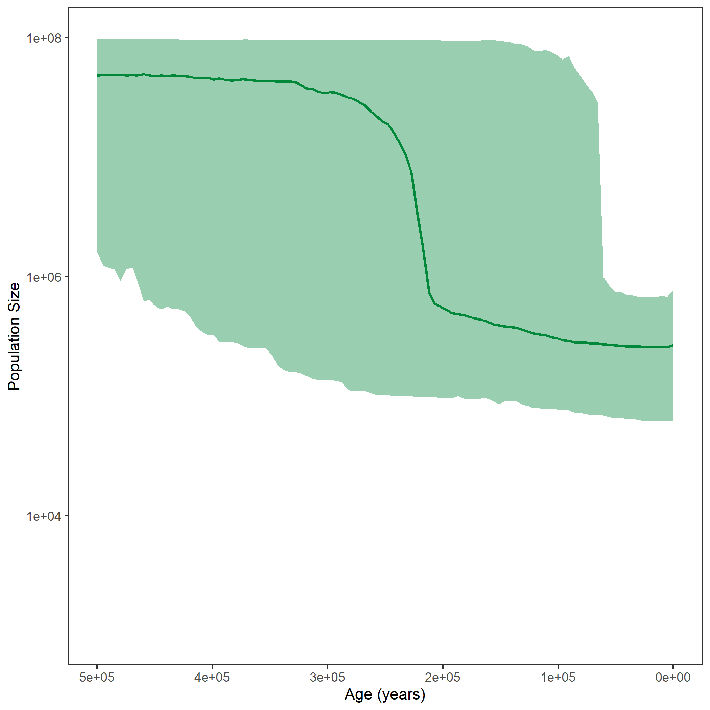


After running all the exercises for coalescent analyses, we want to compare all population size plots.




  
  
  

  
  
  


Example output from plotting the output from all coalescent analyses.


