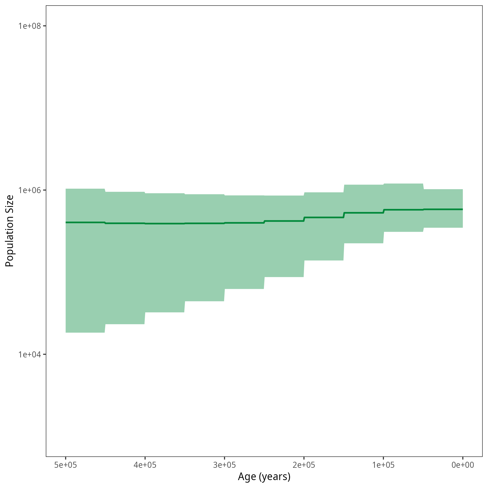
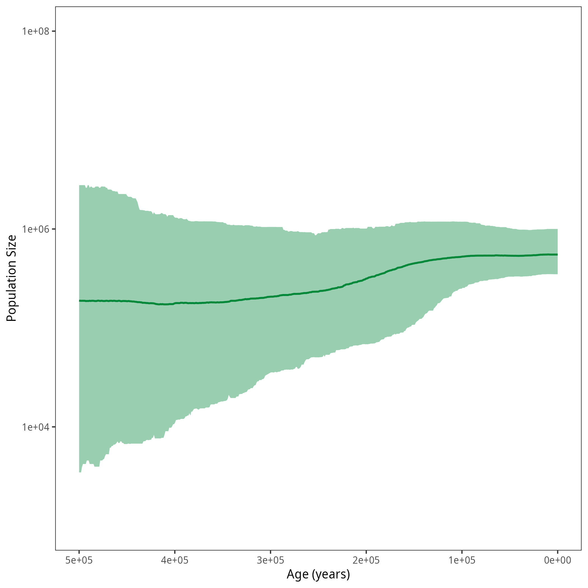


After running all the exercises for coalescent analyses, we want to compare all population size plots.




  
  
  

  
  
  


Example output from plotting the output from a choice of coalescent analyses with isochronous data.
The resulting population size trajectories are from (left to right) the constant analysis, the skyline analysis, the GMRF analysis, the HSMRF analysis, the Skyfish analysis and the piecewise analysis with six pieces. The bold line represents the median of the posterior distribution of the population size and the shaded are shows the $95\%$ credible intervals. For the piecewise analysis, the reference skyline result is shown in green and the result of the piecewise analysis is shown in blue.


