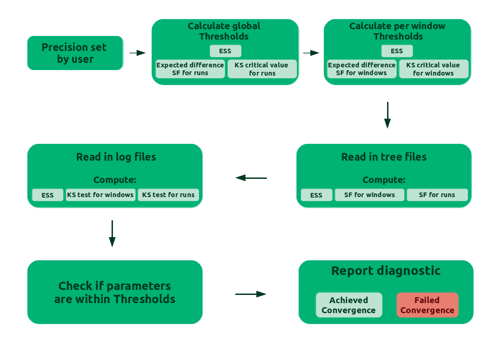
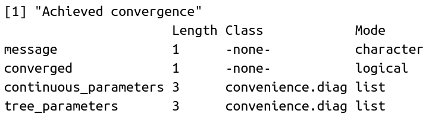
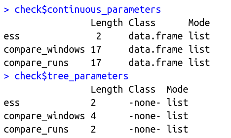



This tutorial covers convergence assessment of a Bayesian phylogenetic analysis using the R package Convenience.

Convergence of an MCMC analysis is crucial to assure that the chain has sampled from the stationary distribution and that we have sufficiently many samples to approximate the posterior distribution. That is, the MCMC has explored the parameter space long enough to reach the true posterior distribution of the parameters and the values we are sampling belong to that distribution. Theory says that a chain that runs through an infinite time, will reach convergence. For our practical problem, we need to make a decision of when we have sampled enough to take a good estimate of the desired parameters. Here we will show how to test if we have enough samples or not.

An ideal solution would be to analytically calculate the number of steps needed to reach convergence. This, however, has turned out to be unfeasible because the number of samples depends on the specific model, the specific moves applied within the MCMC simulation, and the given dataset.

Since we lack a theoretical convergence assessment, what is broadly done in the MCMC field is analyze the output from the MCMC for lack of convergence.
To do so, we have to keep in mind two aspects of an analysis that has reached convergence: **precision** and **reproducibility**. Precision means that if we run the chain longer, we do not change the estimates (e.g., the posterior mean estimate). While reproducibility means that if we run another independent chain, we get the same estimates.
Precision can be evaluated by checking that we have sufficiently many samples because more samples lead to less variance in the estimates (e.g., the standard error of the mean). Reproducibility, on the other hand, can be evaluated by comparing independent chains run under the same model. Therefore, it's recommended to run at least two or better four replicates when performing MCMC analyses.

Another best practice is to remove the initial samples from the chain. Those initial iterations are called *burn-in*. By that we try to get rid of the samples that are not taken from the stationary distribution.

One last concept we need to keep in mind is the *Effective Sample Size* (ESS), the number of independent samples generated by our MCMC sampler. The ESS takes into account the correlation between samples within a chain. Low ESS values represent high autocorrelation in the chain. If the autocorrelation is higher, then the uncertainty in our estimates is also higher.



Now that we learned about convergence, let's take a look into the criteria in the Convenience package:

The output of a phylogenetic analysis most commonly consists of two types of parameters:

1. Continuous parameters: the evolutionary model parameters, the tree length, clock rates, etc.;
2. Discrete parameters: the phylogenetic tree.

To assess convergence for these parameters, the Convenience package evaluates:

1. The Effective Sample Size (ESS);
2. Comparison between windows of the same run;
3. Comparison between different runs.

The comparison between windows of the same run works by dividing the full length of the run into 5 windows (subsets) and comparing the third and fifth window. In the following figure we can see a trace plot for the tree length from the example provided in this tutorial. The trace plot shows the sampled values over the iterations of the MCMC. The highlighted areas of the figure show the third and fifth window of the run.




Trace plot of the tree length for our example analysis. The shaded areas show the third and fifth windows of the run.





For the continuous parameters, the comparison is made with the two-sample Kolmogorov-Smirnov (KS) test, a non-parametric statistical test for equality of probability distributions. Two samples will be equal when the KS value is below a given threshold. The KS value (D) is calculated:

$$ {D}_{m,n} = \max_{x} |{F_{1,m}(x) - G_{2,n}(x)}| $$

_F(x)_ and _G(x)_ are the empirical distribution functions for the samples with size _m_ and _n_, respectively.
The two samples will be drawn from different distributions, at level $\alpha$, when:

$$ {D}_{m,n} > c(\alpha) \sqrt{\frac{m + n}{m\times n}} $$

with

$$ c(\alpha) = \sqrt{-\ln({\frac{\alpha}{2})\times \frac{1}{2}}} $$

The phylogenetic tree is evaluated regarding the bipartitions or splits. Therefore, the comparisons are made using the frequency of a given split between intervals of the same run or between different runs.




Two example trees with tips A, B, C, D and the splits seen at each tree.





The current state of convergence assessment in Bayesian phylogenetics relies mainly on visual tools (e.g., Tracer) and ESS thresholds that have no clear theory to support them . The motivation for the Convenience package is to provide an easy-to-use framework with clear thresholds for each convergence criterion.

We derive a minimum value for the ESS based on a normal distribution and the standard error of the mean (SEM).
How much error in our estimate of the posterior mean should we find acceptable? Clearly, the mean estimate for a distribution with a large variance does not need to be as precise as the mean estimate for a distribution with a small variance. However, relative to the variance/spread of the distribution, what percentage is acceptable? We suggest to use a SEM smaller of 1% of the 95% probability interval of the distribution, which is equivalent to say that the allowed error of the mean is four times the standard deviation of the distribution. (Note that you can derive a different ESS value for any other threshold that you like.) From this SEM, we can derive the ESS with:

$$ SEM = \frac{\sigma}{\sqrt{ESS}} $$

$$ \frac{\sigma}{\sqrt{ESS}} < 1\% \times 4 \times \sigma $$

$$ ESS > \frac{1}{0.04^2} $$

$$ ESS > 625 $$

An ESS of 625 is therefore the default value for the convenience package.

For the KS test, the threshold is the critical value for $\alpha$ = 0.01.
We are currently still evaluating the choice of $\alpha$ on the power and false-discovery rate to detect failure of convergence.



To date, the most often test to assess convergence of split frequencies is the *average standard deviation of split frequencies* (ASDSF) . The frequency of each split is computed for two separate MCMC runs and the difference between the two split frequency estimates is used. The ASDSF is problematic for two reasons: (1) for large trees with many splits that have posterior probabilities close to 0.0 or 1.0 will overwhelm the ASDSF and hence even a single split that is present in all samples in run 1 (thus a posterior probability of 1.0) and is never present in any sample in run 2 (thus a posterior probability of 0.0) might not be detected, and (2) the expected difference in split frequency depends on the true split frequency (see Figure ).




The expected difference in split frequencies for ESS of 100, 200 and 625. The x-axis is the true value of the split frequency. The y-axis is the expected difference in split frequencies. The effect of increasing the ESS is the decrease of differences in frequency of sampled splits.



Instead of the ASDSF we use the ESS of each split.
We transform each split into a chain of absence and presence values; if the split was present in the i-th tree then we score the i-th value of the chain as a 1 and 0 otherwise. This sequence of absence and presence observations (0s and 1s) allows us to apply standard methods to compute ESS values and thus we can use the same ESS threshold of 625 as for our continuous parameters.

With the ESS threshold for the splits, we can estimate the expected difference in the splits and use this value as a threshold for the split differencies. The expected difference ($ {E}[\Delta^{sf}_{p}] $) between two samples is calculated as the ['mean absolute difference'](https://en.wikipedia.org/wiki/Mean_absolute_difference), with N as the ESS:

$$ {E}[\Delta^{sf}_{p}] = \sum\limits_{i=0}^N \sum\limits_{j=0}^N \left(|\frac{i}{N} - \frac{j}{N}| \times P_{binom}(i|N,p) \times P_{binom}(j|N,p) \right) $$



 provides an overview of the convergence assessment described before and implemented in the package Convenience. 




Overview of the workflow in the convergence assessment.







To install Convenience, we need first to install the package devtools.
In R, type the commands:

  > `install.packages("devtools")`  
  > `library(devtools)`  
  > `install_github("lfabreti/convenience")`  
  > `library(convenience)`  



Here is a list of the functions the package uses to assess convergence:

- `checkConvergence`: takes the output from a phylogenetic analysis and works through the convergence assessment pipeline. This function can take either a directory with all the output files from a single analysis or a list of files. The function has 3 arguments:

1. `path`: for when a path to a directory is provided
2. `list_files`: for when a list of files is provided
3. `control`: calls the `makeControl` function

- `essContParam`: calculates the ESS for the continuous parameters

- `essSplitFreq`: calculates the ESS for the splits from the trees

- `ksTestContParam`: calculates the KS test for the continuous parameters, for both the comparison between windows or runs

- `loadFiles`: gets the MCMC output from a directory path or a list of files. This function uses the package RWTY  and returns a list of type rwty.chain

- `loadMulti`: this function was modified from RWTY to include the option to pass a list of files to the function `loadFiles`

- `makeControl`: a function to set the burnin size, the precision of the standard error of the mean and the continuous parameters to exclude from the assessment. Default values are burnin = 10%, precision = 1%, namesToExclude = "br_lens, bl, Iteration, Likelihood, Posterior, Prior"

- `printConvergenceDiag`: a S3 method to print the class `convenience.diag`

- `printListFails`: a S3 method to print the class `list.fails`

- `readTrace`: this function was modified from ['RevGadgets'](https://github.com/revbayes/RevGadgets) to include the option to read only files with the continuous parameters, when the user has no tree files to assess convergence

- `splitFreq`: calculates the difference in splits for the trees, for both the comparison between windows or runs



First, download the files listed as example output files on the top left of this page. Save them in a folder called output.
These files are the output from a phylogenetic analysis performed with a dataset from bears. The nucleotide substitution model was GTR+$\Gamma$+I and the MCMC was set to run 2 independent runs.
The package also works if your analysis has only one run of the MCMC. But the part to compare runs will not be evaluated. Therefore, it is not possible to say that your MCMC result is reproducible. We strongly advise on running more than 1 run.

Let's run the `checkConvergence` function with our example output in a directory (this step may take a few minutes):

  > `check_bears <- checkConvergence("data/")`  

We can also list the names of the files:

  > `check_bears <- checkConvergence( list_files = c("bears_cytb_GTR_run_1.log", "bears_cytb_GTR_run_1.trees", "bears_cytb_GTR_run_2.log", "bears_cytb_GTR_run_2.trees") )`  

To better understand what `checkConvergence` is doing, take a look at . The first step consists of the user setting up the precision in the standard error of the mean for our estimates. The thresholds for ESS, KS test and difference in split frequencies will be calculated based on the precision. Then the function reads in the MCMC output, from the files provided by the user, and computes the quantities used in the criteria for convergence. Afterwards, the function checks if the computed quantities are within the calculated thresholds. Finally, the function reports wheter the MCMC has converged or not, the computed quantities and, in case of non convergence, the parameters that failed to achieve the desired thresholds.




Summary of the process in the `checkConvergence` function. SF is the abbreviation for split frequencies.



Now, let's see what is the output:




The output stored in check_bears



We can see that `check_bears` has 4 elements: `message`, `converged`, `continuous_parameters` and `tree_parameters`.

1. `message`: a string with a message if the analysis has converged or not;
2. `converged`: a boolean that has TRUE if the analysis converged and FALSE if it did not converge;
3. `continuous_parameters`: a list with ESS, KS-scores between windows of the same run and KS-scores between runs;
4. `tree_parameters`: a list with ESS, split frequencies between windows of the same run and split frequencies between runs.

In case the analysis has failed to converge, another element will be on the output list: `failed` with the parameters that failed the criteria for convergence.

We can check `continuous_parameters`and `tree_parameters` with the commands:

  > `check_bears$continuous_parameters`  
  > `check_bears$tree_parameters`  




The lists of what is stored in the `check_bears$continuous_parameters` and `check_bears$tree_parameters`



Both lists have 3 elements: ESS, comparison of windows and comparison of runs. Let's see each component:

1. Continuous parameters
  > `check_bears$continuous_parameters$ess`  
  > `check_bears$continuous_parameters$compare_windows`  
  > `check_bears$continuous_parameters$compare_runs`  
2. Tree parameters
  > `check_bears$tree_parameters$ess`  
  > `check_bears$tree_parameters$compare_windows`  
  > `check_bears$tree_parameters$compare_runs`  

Each of these elements can be accessed to check all the values calculated in the package.

Now that we learned how to use the package and how to interpret the results, let's practice with some exercises.



Check for convergence in the output generated in the [Nucleotide Substitution Models]({{ base.url }}/tutorials/ctmc/) tutorial.

Which analysis have converged?



You can see that the output is different when we have a failure in convergence. We have 2 extra elements `failed` and `failed_names`.
The element `failed` has a summary text of what failed in our analysis.
The element `failed_names` has the specifics about the parameters that failed, like the name of the parameter or the split and if it failed in checking for the ESS, the comparison between windows or between runs.

 shows the results from the convergence assessment on the analysis from Exercise 1 with the GTR+$\Gamma$+I nucleotide substitution model.




The output of a convergence assessment that has failed. On the left, we see the output with 6 elements. On the right, it's the summary of the parameters that failed.





- Rerun the MCMC with the GTR+$\Gamma$+I model from [Nucleotide Substitution Models]({{ base.url }}/tutorials/ctmc/), but increase the number of iterations to 50000.

- Check the new results for convergence.



- Check convergence for the output from the [Estimating a Time-Calibrated Phylogeny of Fossil and Extant Taxa using Morphological Data]({{ base.url }}/tutorials/fbd_simple/) tutorial.

In this case we should check only the continuous parameters (log files). Because the trees sampled throughout the MCMC have different number of tips due to the fossil record.



When we face a convergence failure, there are a few options of what to do in our MCMC to overcome this problem. The suggestions here come from experience, rather than theoretical proofs.
We can divide our MCMC that lack convergence by the number of parameters that failed: 

- Several parameters failing

- One or few parameters failing

For the first case, we should run the MCMC longer to get more samples. In the second case, we should increase the weights on the moves or even add more moves for the specific parameters that failed.

