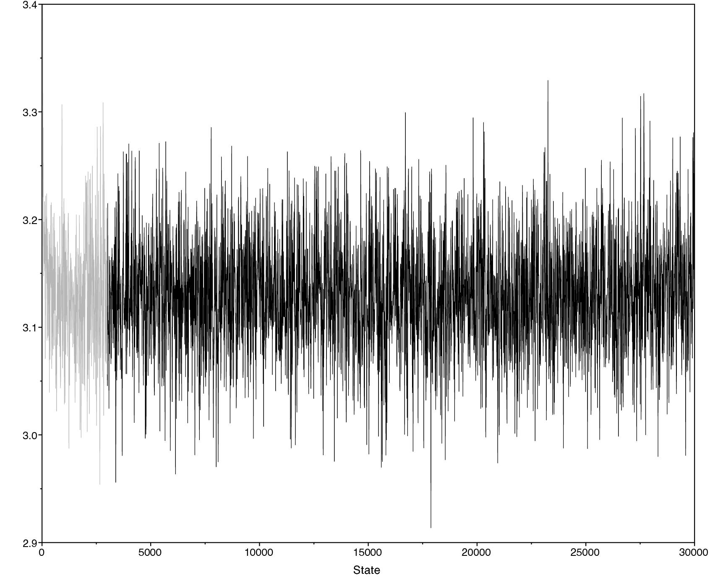
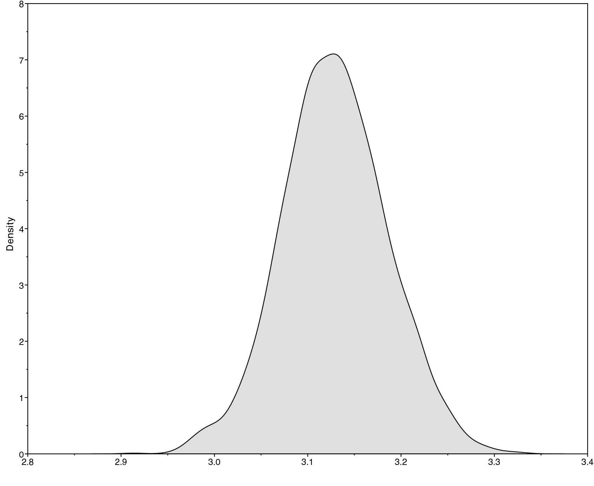
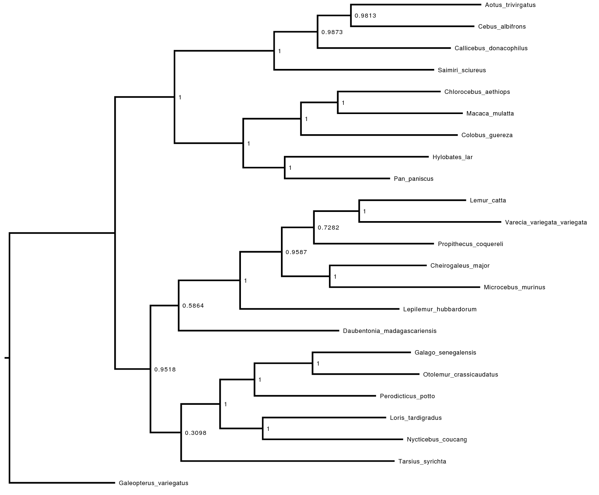
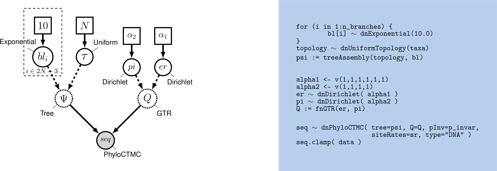
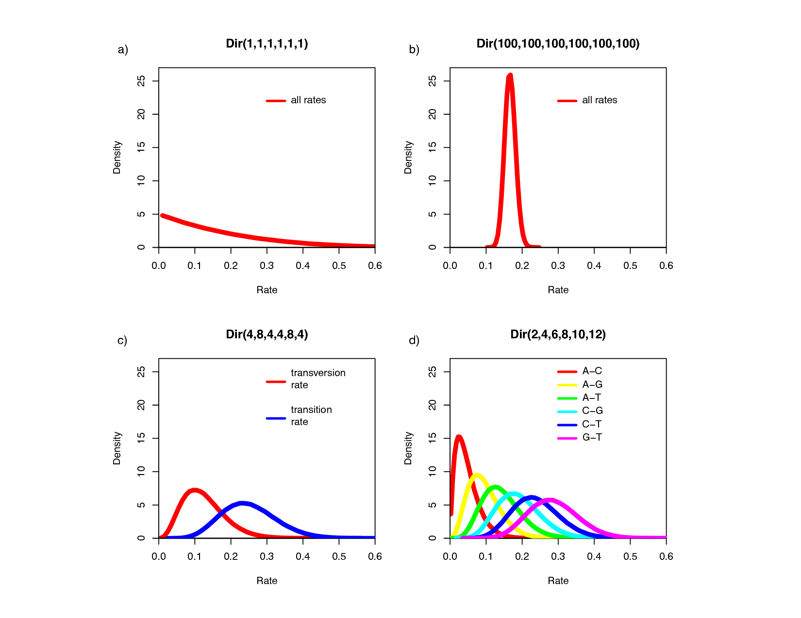
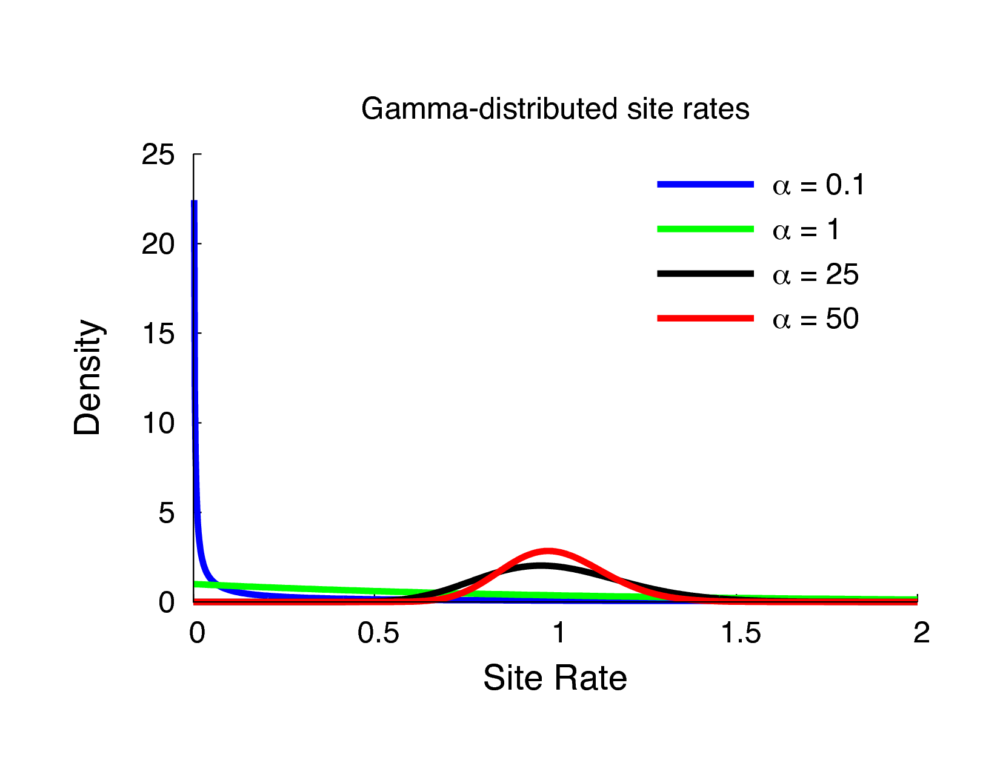
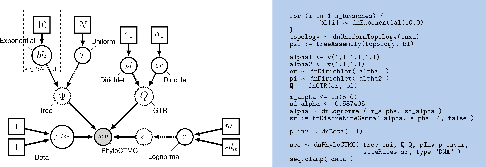



This tutorial covers the first protocol from , 
which demonstrates how to set up and perform analyses
using common nucleotide substitution models. The substitution models
used in molecular evolution are continuous time Markov models, which are
fully characterized by their instantaneous-rate matrix:

$$Q = \begin{pmatrix}
-\mu_A & \mu_{AC} & \mu_{AG} & \mu_{AT} \\
\mu_{CA} & -\mu_C  & \mu_{CG} & \mu_{CT} \\
\mu_{GA} & \mu_{GC} & -\mu_C  & \mu_{GT} \\
\mu_{TA} & \mu_{TC} & \mu_{TG} & -\mu_T 
\end{pmatrix} \mbox{  ,}$$

where $\mu_{ij}$ represents the instantaneous rate of substitution from
state $i$ to state $j$. The diagonal elements $\mu_i$ are the rates of
*not* changing out of state $i$, equal to the sum of the elements in the
corresponding row. Given the instantaneous-rate matrix, $Q$, we can
compute the corresponding transition probabilities for a branch of
length $t$, $P(t)$, by exponentiating the rate matrix:

$$P(t) = \begin{pmatrix}          
p_{AA}(t) & p_{AC}(t) & p_{AG}(t) & p_{AT}(t) \\
p_{CA}(t) & p_{CC}(t) & p_{CG}(t) & p_{CT}(t) \\
p_{GA}(t) & p_{GC}(t) & p_{GG}(t) & p_{GT}(t) \\
p_{TA}(t) & p_{TC}(t) & p_{TG}(t) & p_{TT}(t)
\end{pmatrix} = e^{Qt} = \sum_{j=0}^\infty\frac{(Qt)^j}{j!} \mbox{  .}$$

Each of the named substitution models (e.g., HKY or GTR) has a uniquely defined
instantaneous-rate matrix, $Q$.

In this tutorial you will perform phylogeny inference under common
models of DNA sequence evolution: JC, F81, HKY85, GTR, GTR+Gamma and
GTR+Gamma+I. For all of these substitution models, you will perform a 
Markov chain Monte Carlo (MCMC) analysis to estimate phylogeny and other model parameters. The
estimated trees will be unrooted trees with independent branch-length
parameters. We will provide comments on how to modify the tutorial if
you wish to estimate rooted, clock-like trees. All the assumptions will
be covered in more detail later in this tutorial.



Specific functions for substitution models available in RevBayes.


 |   **Model**      |        **Reference**        |  **Function**   |      **Parameters**     |
 |:----------------:|:---------------------------:|:---------------:|:-----------------------:|
 |   Jukes-Cantor   |         |      fnJC       |           -             |
 | K80 (a.k.a. K2P) |        |      fnK80      |        $\kappa$         |
 |  Felsenstein-81  |   |      fnF81      |         $\pi$           |
 |        T92       |        |      fnT92      | $\pi_{GC}$, $\kappa$    |
 |        HKY       |      |      fnHKY      |     $\pi$, $\kappa$     |
 |        GTR       |        |      fnGTR      |     $\pi$, $\epsilon$   |








The first section of this exercise involves: 
1. setting up a Jukes-Cantor (JC) substitution model for an alignment of the cytochrome b subunit; 
2. approximating the posterior probability of the tree topology and node ages (and all other parameters) using MCMC, and; 
3. summarizing the MCMC output by computing the maximum *a posteriori* tree.



 
 
Graphical model representation of a simple phylogenetic model. The graphical model shows the dependencies among parameters . Here, the rate matrix $Q$ is a constant variable because it is fixed and does not depend on any parameter. The only free parameters of this model, the Jukes-Cantor model, are the tree $\Psi$ including the branch lengths.



We first consider the simplest substitution model described by 
. The instantaneous-rate matrix for the JC substitution
model is defined as

$$Q_{JC69} = \begin{pmatrix} 
{*} & \frac{1}{3} & \frac{1}{3} & \frac{1}{3} \\ 
\frac{1}{3} & {*} & \frac{1}{3} & \frac{1}{3} \\ 
\frac{1}{3} & \frac{1}{3} & {*} & \frac{1}{3} \\ 
\frac{1}{3} & \frac{1}{3} & \frac{1}{3} & {*}  
\end{pmatrix} \mbox{  ,}$$

which has the advantage that the transition probability matrix can be
computed analytically

$$P_{JC69} = \begin{pmatrix} {\frac{1}{4} + \frac{3}{4}e^{-rt}} & {\frac{1}{4} - \frac{1}{4}e^{-rt}} & {\frac{1}{4} - \frac{1}{4}e^{-rt}} & {\frac{1}{4} - \frac{1}{4}e^{-rt}} \\\\ {\frac{1}{4} - \frac{1}{4}e^{-rt}} & {\frac{1}{4} + \frac{3}{4}e^{-rt}} & {\frac{1}{4} - \frac{1}{4}e^{-rt}} & {\frac{1}{4} - \frac{1}{4}e^{-rt}} \\\\ {\frac{1}{4} - \frac{1}{4}e^{-rt}} & {\frac{1}{4} - \frac{1}{4}e^{-rt}} & {\frac{1}{4} + \frac{3}{4}e^{-rt}} & {\frac{1}{4} - \frac{1}{4}e^{-rt}} \\\\ {\frac{1}{4} - \frac{1}{4}e^{-rt}} & {\frac{1}{4} - \frac{1}{4}e^{-rt}} & {\frac{1}{4} - \frac{1}{4}e^{-rt}} & {\frac{1}{4} + \frac{3}{4}e^{-rt}}  
\end{pmatrix} \mbox{  ,}$$

where $t$ is the branch length in units of time, and $r$ is the rate (clock) for the process. In the later exercises you will be asked to specify more complex substitution models. **Don’t worry, you won’t have to calculate all of the transition probabilities, because RevBayes will take care of all the computations for you.** Here we only provide some of the equations for the models in case you might be interested in the details. You will be able to complete the exercises without understanding the underlying math.

The files for this example analysis are provided for you ([`mcmc_JC.Rev`](scripts/mcmc_JC.Rev)).
If you download this file and place it in a directory called `scripts` inside your main tutorial directory,
you can
easily execute this analysis using the `source()` function in the RevBayes console:

```
source("scripts/mcmc_JC.Rev")
```

If everything loaded properly, then you should see the program initiate
the Markov chain Monte Carlo analysis that estimates the posterior
distribution. If you continue to let this run, then you will see it
output the states of the Markov chain once the MCMC analysis begins.

Ultimately, this is how you will execute most analyses in RevBayes, with the full specification of the model and analyses contained in the sourced files. You could easily run this entire analysis on your own data by substituting your data file name for that in the model-specification file. However, it is important to understand the components of the model to be able to take full advantage of the flexibility and richness of RevBayes. Furthermore, without inspecting the Rev scripts sourced in `mcmc_JC.Rev`, you may end up inadvertently performing inappropriate analyses on your dataset, which would be a waste of your time and CPU cycles. The next steps will walk you through the full specification of the model and MCMC analyses.



>First create a directory for this tutorial and name it `RB_CTMC_Tutorial`, or any name
>you like.
>
>Navigate to this new directory and create a new folder called `data` inside of it.
>
>Download the data file called [`primates_and_galeopterus_cytb.nex`](data/primates_and_galeopterus_cytb.nex) 
>and save it to the `data` directory.
>
>Now start RevBayes from your working directory (`RB_CTMC_Tutorial`). 
{:.instruction}


For this tutorial and much of the work you will do in RevBayes, you will need to access files.
It is important that you are aware of your current working directory if you use relative file paths
in your Rev scripts or in the RevBayes console.

To check your current working directory, use the function `getwd()`.

```
getwd()
```
```
/Users/tombayes/Work
```
{:.Rev-output}

If you want to change the directory, enter the path to your directory in the arguments of the function `setwd()`.

```
setwd("Tutorials/RB_CTMC_Tutorial")
```
{:.Rev-output}

Now check your directory again to make sure you are where you want to be:
```
getwd()
```
```
/Users/tombayes/Work/Tutorials/RB_CTMC_Tutorial
```
{:.Rev-output}


First load in the sequences using the `readDiscreteCharacterData()`
function.

```
data <- readDiscreteCharacterData("data/primates_and_galeopterus_cytb.nex")
```

Executing these lines initializes the data matrix as the respective
Rev variables. To report the current value of any variable, simply
type the variable name and press enter. For the `data` matrix, this
provides information about the alignment:


```
data
```
```
   DNA character matrix with 23 taxa and 1141 characters
   =====================================================
   Origination:                      primates_and_galeopterus_cytb.nex
   Number of taxa:                   23
   Number of included taxa:          23
   Number of characters:             1141
   Number of included characters:    1141
   Datatype:                         DNA
```
{:.Rev-output}

Next we will specify some useful variables based on our dataset. The variable `data` has *member functions* 
that we can use to retrieve information about the dataset. These include, for example, 
the number of species and the taxa. We will need that taxon information for setting up different parts of our model.

```
num_taxa <- data.ntaxa()
num_branches <- 2 * num_taxa - 3
taxa <- data.taxa()
```

Additionally, we set up a (vector) variable that holds all the moves for our analysis. 
Recall that moves are algorithms used to propose new parameter values during the MCMC simulation. 
Similarly, we set up a variable for the monitors. 
Monitors print the values of model parameters to the screen and/or log files during the MCMC analysis.

```
moves    = VectorMoves()
monitors = VectorMonitors()
```

You may have noticed that we used the `=` operator to create the move index. 
This simply means that the variable is not part of the model. 
You will later see that we use this operator more often, e.g., when we create moves and monitors.

With the data loaded, we can now proceed to specify our specifying the model.



Estimating an unrooted tree under the JC model requires specification of two main components:
(1) the  and (2) the .



A given substitution model is defined by its corresponding
instantaneous-rate matrix, $Q$. The Jukes-Cantor substitution model does
not have any free parameters (as the substitution rates are all assumed
to be equal, and there is a separate parameter that scales their overall
magnitude), so we can define it as a constant variable. The function
`fnJC(n)` will create an instantaneous-rate matrix for a character with
$n$ states. Since we use DNA data here, we create a 4x4
instantaneous-rate matrix:

```
Q <- fnJC(4) 
```

You can see the rates of the $Q$ matrix by typing

```
Q
```
```
   [ [ -1.0000, 0.3333, 0.3333, 0.3333 ] ,
     0.3333, -1.0000, 0.3333, 0.3333 ] ,
     0.3333, 0.3333, -1.0000, 0.3333 ] ,
     0.3333, 0.3333, 0.3333, -1.0000 ] ]
```
{:.Rev-output}

As you can see, all substitution rates are equal.



The tree topology and branch lengths are stochastic nodes in our phylogenetic model. 
In , the tree topology is denoted $\Psi$ and the 
length of the branch leading to node $i$ is $bl_i$.

We will assume that all possible labeled, unrooted tree topologies have equal probability. 
This is the `dnUniformTopology()` distribution in RevBayes. 
Note that in RevBayes it is advisable to specify the outgroup for your study system 
if you use an unrooted tree prior, whereas other software, *e.g.*,  
MrBayes uses the first taxon in the data matrix file as the outgroup. 
Providing RevBayes with an outgroup clade will enable the monitor writing the trees
to file to orient the topologies with the outgroup clade at the base, 
thus making the trees easier to visualize.
Specify the `topology` stochastic node by passing in the list of `taxa` 
to the `dnUniformTopology()` distribution:

```
out_group = clade("Galeopterus_variegatus")
topology ~ dnUniformTopology(taxa, outgroup=out_group)
```

Some types of stochastic nodes can be updated by a number of alternative moves. 
Different moves may explore parameter space in different ways, 
and it is possible to use multiple different moves for a given parameter to improve mixing 
(the efficiency of the MCMC simulation). 
In the case of our unrooted tree topology, for example, we can use both a nearest-neighbor interchange move (`mvNNI`) and a subtree-prune and regrafting move (`mvSPR`). These moves do not have tuning parameters associated with them, thus you only need to pass in the `topology` node and proposal `weight`.

```
moves.append( mvNNI(topology, weight=num_taxa) )
moves.append( mvSPR(topology, weight=num_taxa/10.0) )
```

The weight specifies how often the move will be applied either on average per iteration or relative to all other moves. Have a look at the MCMC Diagnosis tutorial for more details about moves and MCMC strategies (found in ).

Next we have to create a stochastic node representing the length of each of the $2N - 3$ branches in our tree (where $N=$ `n_species`). We can do this using a `for` loop — this is a plate in our graphical model. In this loop, we can create each of the branch-length nodes and assign each move. Copy this entire block of Rev code into the console:

```
for (i in 1:num_branches) {
   br_lens[i] ~ dnExponential(10.0)
   moves.append( mvScale(br_lens[i]) )
}
```

It is convenient for monitoring purposes to add the tree length as deterministic variable. The tree length is simply the sum of all branch lengths. Accordingly, the tree length can be computed using the `sum()` function, which calculates the sum of any vector of values.

```
TL := sum(br_lens)
```

Finally, we can create a *phylogram* (a phylogeny in which the branch lengths are proportional to the expected number of substitutions/site) by combining the tree topology and branch lengths. We do this using the `treeAssembly()` function, which applies the value of the $i^{th}$ member of the `br_lens` vector to the branch leading to the $i^{th}$ node in `topology`. Thus, the `psi` variable is a deterministic node:

```
psi := treeAssembly(topology, br_lens)
```


For large phylogenetic trees, i.e., with more than 200 taxa, it might be easier to specify a combined topology and branch length prior distribution.
We can achieve this by simple using the distribution `dnUniformTopologyBranchLength()`.
```
br_len_lambda <- 10.0
psi ~ dnUniformTopologyBranchLength(taxa, branchLengthDistribution=dnExponential(br_len_lambda))
moves.append( mvNNI(psi, weight=num_taxa) )
moves.append( mvSPR(psi, weight=num_taxa/10.0) )
moves.append( mvBranchLengthScale(psi, weight=num_branches) )
```
You might think that this approach is in fact simpler than the `for` loop that we explained above.
We still think that it is pedagogical to specify the prior on each branch length separately in this tutorial to emphasize all components of the model.



Some studies, *e.g.* , 
have criticized the exponential prior distribution for branch lengths 
because it induces a gamma-distributed tree-length and the mean of this gamma distribution
grows with the number of taxa. As an alternative, we can instead use a specific gamma prior distribution 
(or any other distribution defined on a positive real variable) for the tree length, 
and then use a Dirichlet prior distribution to break the tree length into 
the corresponding branch lengths .

First, specify a prior distribution on the tree length with your desired mean.
For example, we use a gamma distribution as our prior on the tree length.
```
TL ~ dnGamma(2,4)
moves.append( mvScale(TL) )
```

Now we create a random variable for the relative branch lengths.
```
rel_branch_lengths ~ dnDirichlet( rep(1.0,num_branches) )
moves.append( mvBetaSimplex(rel_branch_lengths, weight=num_branches) )
moves.append( mvDirichletSimplex(rel_branch_lengths, weight=num_branches/10.0) )
```
Finally, transform the relative branch lengths into actual branch lengths
```
br_lens := rel_branch_lengths * TL
```



Alternatively, you may want to specify a prior on time-trees. 
Here we will briefly indicate how to specify such an prior which will lead to inference of time trees.

The tree (the topology and node ages) is a stochastic node in our phylogenetic model. 
For simplicity, we will assume a uniform prior on both topologies and node ages. 
The distribution in RevBayes is `dnUniformTimeTree()`.

Fore more information on tree priors, such as birth-death processes, please read the .

First, we need to specify the age of the tree:

```
root_age <- 10.0
```

Here we simply assumed that the tree is 10.0 time units old. We could also specify a prior on the root age if we have fossil calibrations (see ). Next, we specify the `tree` stochastic variable by passing in the taxon information `taxa` to the `dnUniformTimeTree()` distribution:

```
psi ~ dnUniformTimeTree(rootAge=root_age, taxa=taxa)
```

Some types of stochastic nodes can be updated by a number of alternative moves. 
Different moves may explore parameter space in different ways,and it is possible to use 
multiple different moves for a given parameter to improve mixing 
(the efficiency of the MCMC simulation). In the case of our rooted tree, 
for example, we can use both a nearest-neighbor interchange move without and with changing 
the node ages (`mvNarrow` and `mvNNI`) and a fixed-node-height subtree-prune and regrafting 
move (`mvFNPR`) and its Metropolized-Gibbs variant (`mvGPR`) . 
We also need moves that change the ages of the internal nodes, for example, `mvSubtreeScale` 
and `mvNodeTimeSlideUniform`. These moves do not have tuning parameters associated with 
them, thus you only need to pass in the `psi` node and proposal `weight`.

```
moves.append( mvNarrow(psi, weight=num_taxa) )
moves.append( mvNNI(psi, weight=num_taxa/5.0) )
moves.append( mvFNPR(psi, weight=num_taxa/5.0) )
moves.append( mvGPR(psi, weight=num_taxa/30.0) )
moves.append( mvSubtreeScale(psi, weight=num_taxa/3.0) )
moves.append( mvNodeTimeSlideUniform(psi, weight=num_taxa) )
```


The weight specifies how often the move will be applied either on average per iteration or relative to all other moves. Have a look at the  for more details about moves and MCMC strategies.



Additionally, in the case of time-calibrated trees, we need to add a molecular clock rate parameter. For example, we know from empirical estimates that the molecular clock rate is about 0.01 (=1%) per million years per site. Nevertheless, we can estimate it here because we fixed the root age. We use a uniform prior on the log-transform clock rate. This specifies our lack of prior knowledge on the magnitude of the clock rate.

```
log_clock_rate ~ dnUniform(-6,1)
moves.append( mvSlide(log_clock_rate, weight=2.0) )
clock_rate := 10^log_clock_rate
```

Instead, you could also fix the clock rate and estimate the root age. 
For more information on molecular clocks please read the  tutorial.




We have fully specified all of the parameters of our phylogenetic
model—the tree topology with branch lengths, and the substitution model
that describes how the sequence data evolved over the tree with branch
lengths. Collectively, these parameters comprise a distribution called
the *phylogenetic continuous-time Markov chain*, and we use the
`dnPhyloCTMC` constructor function to create this node. This
distribution requires several input arguments: 
1. the `tree` with branch lengths; 
2. the instantaneous-rate matrix `Q`; 
3. the `type` of character data.

Build the random variable for the character data (sequence alignment).
```
seq ~ dnPhyloCTMC(tree=psi, Q=Q, type="DNA")
```

Once the `PhyloCTMC` model has been created, we can attach our sequence 
data to the tip nodes in the tree.
```
seq.clamp(data)
```

Note that although we assume that our sequence data are random
variables—they are realizations of our phylogenetic model—for the
purposes of inference, we assume that the sequence data are “clamped” to their observed values.
When this function is called, RevBayes sets each of the stochastic
nodes representing the tips of the tree to the corresponding nucleotide
sequence in the alignment. This essentially tells the program that we
have observed data for the sequences at the tips.

Finally, we wrap the entire model in a single object to provide convenient access to the
DAG. To do this, we only need to give the `model()` function a single
node. With this node, the `model()` function can find all of the other
nodes by following the arrows in the graphical model:

```
mymodel = model(Q)
```

Now we have specified a simple phylogenetic analysis—each parameter of
the model will be estimated from every site in our alignment. If we
inspect the contents of `mymodel` we can review all of the nodes in the
DAG:

```
mymodel
```

<!-- 


In this section, we will describe how to set up the MCMC sampler and
summarize the resulting posterior distribution of trees.
 -->



For our MCMC analysis, we need to set up a vector of *monitors* to
record the states of our Markov chain. The monitor functions are all
called `mn\*`, where `\*` is the wild-card representing the monitor type.
First, we will initialize the model monitor using the `mnModel`
function. This creates a new monitor variable that will output the
states for all model parameters when passed into a MCMC function.

```
monitors.append( mnModel(filename="output/primates_cytb_JC.log", printgen=10) )
```

The `mnFile` monitor will record the states for only the parameters
passed in as arguments. We use this monitor to specify the output for
our sampled trees and branch lengths.

```
monitors.append( mnFile(filename="output/primates_cytb_JC.trees", printgen=10, psi) )
```

Finally, create a screen monitor that will report the states of
specified variables to the screen with `mnScreen`:

```
monitors.append( mnScreen(printgen=100, TL) )
```

This monitor mostly helps us to see the progress of the MCMC run.



With a fully specified model, a set of monitors, and a set of moves, we
can now set up the MCMC algorithm that will sample parameter values in
proportion to their posterior probability. The `mcmc()` function will
create our MCMC object:

```
mymcmc = mcmc(mymodel, monitors, moves)
```

```
mymcmc = mcmc(mymodel, monitors, moves, nruns=2, combine="mixed")
```

Notice that we also specified `nruns=2` which means that RevBayes will automatically run 2 independent MCMC runs. 
You will find that the output is created in two files with extension `_run_1` and `_run_2` for each replicate and additionally the samples from both runs are combined into one file for more convenient post-processing.


Now, run the MCMC:
```
mymcmc.run(generations=10000)
```

When the analysis is complete, you will have the monitored files in your output directory.



MCMC analyses can take a long time to converge, and it is usually difficult to predict how many generations will be needed to obtain results. In addition, many analyses are run on computer clusters with time limits, and so may be stopped by the cluster partway through. For all of these reasons, it is useful to save the state of the chain regularly through the analysis.
```
mymcmc.run(generations=100000000, checkpointInterval=100, checkpointFile="output/primates_cytb_JC.state")
```
The `checkpointInterval` and `checkpointFile` inputs specify respectively how often, and to which file, the chain should be saved. Three different files will be used for storing the state, with no extension and with extensions `_mcmc` and `_moves`.
When multiple independent runs are specified, they will automatically be saved in separate files (with extensions `_run_1`, `_run_2`, etc.).

Restarting the chain from a previous run is done by adding this line:
```
mymcmc.initializeFromCheckpoint("output/primates_cytb_JC.state")
```
before calling the function `mcmc.run()`. The file name should match what was given as `checkpointFile` when running the previous analysis. **NB:** Note that this line will create an error if the state file does not exist yet, and so should be commented out in the first run.

The full MCMC block thus becomes:
```
mymcmc = mcmc(mymodel, monitors, moves, nruns=2, combine="mixed")
mymcmc.initializeFromCheckpoint("output/primates_cytb_JC.state") #comment this out for the first run

mymcmc.run(generations=100000000, checkpointInterval=100, checkpointFile="output/primates_cytb_JC.state")
```





Methods for visualizing the marginal densities of parameter values are not currently available in RevBayes itself. 
Thus, it is important to use programs like [Tracer](http://tree.bio.ed.ac.uk/software/tracer/)  to evaluate mixing and non-convergence.

Look at the file called `output/primates_cytb_JC.log` in Tracer. 
There you see the posterior distribution of the continuous parameters, *e.g.*, the tree length variable `TL`.



  

**Left:** Trace of tree-length samples for one MCMC run. The caterpillar-like look is a good sign.You will also see that the effective sample size is comparably large, i.e., much larger than 200. **Right:** Posterior distribution of the tree length of the primate phylogeny under a Jukes-Cantor substitution model.



It is always important to carefully assess the MCMC samples for the various parameters in your analysis.
You can read more about MCMC tuning and
evaluating and improving mixing in the tutorials .



We are interested in the phylogenetic relationship of the Tarsiers.
Therefore, we need to summarize the trees sampled from the posterior
distribution. RevBayes can summarize the sampled trees by reading in
the tree-trace file:

```
treetrace = readTreeTrace("output/primates_cytb_JC.trees", treetype="non-clock")
```


The `mapTree()` function will summarize the tree samples and write the
maximum *a posteriori* tree to file:

```
map_tree = mapTree(treetrace,"output/primates_cytb_JC_MAP.tree")
```


 

Maximum a posteriori estimate of the primate phylogeny under a Jukes-Cantor substitution model. The numbers at the nodes show the posterior probabilities for the clades. We have rooted the tree at the outgroup *Galeopterus_variegatus*




Look at the file called `output/primates_cytb_JC_MAP.tree` in
`FigTree`. We show it in .

Fill in the following table as you go through the tutorial.



Posterior probabilities under different analyses


 |    **Model**   |   **Lemuroidea**   |   **Lorisoidea**   |   **Platyrrhini**   |   **Catarrhini**    |
  ---------------:|:------------------:|:------------------:|:-------------------:|:-------------------:|
 |  Jukes-Cantor  |                    |                    |                     |                     |
 |     HKY85      |                    |                    |                     |                     |
 |     F81        |                    |                    |                     |                     |
 |     GTR        |                    |                    |                     |                     |
 |    GTR+Gamma   |                    |                    |                     |                     |
 |   GTR+Gamma+I  |                    |                    |                     |                     |




Note, you can query the posterior probability of a clade being
monophyletic using the following command:

```
Lemuroidea <- clade("Cheirogaleus_major", 
                    "Daubentonia_madagascariensis", 
                    "Lemur_catta", 
                    "Lepilemur_hubbardorum",
                    "Microcebus_murinus",
                    "Propithecus_coquereli",
                    "Varecia_variegata_variegata")
                    
treetrace.cladeProbability( Lemuroidea )
```



Primate and species relationships.


 |            **Species**          |     **Family**     |     **Parvorder**   |   **Suborder**  |
  -------------------------------- |:------------------:|:-------------------:|:---------------:|
 |        Aotus trivirgatus        |       Aotidae      |  Platyrrhini (NWM)  |   Haplorrhini   |
 |      Callicebus donacophilus    |    Pitheciidae     |  Platyrrhini (NWM)  |   Haplorrhini   |
 |         Cebus albifrons         |       Cebidae      |  Platyrrhini (NWM)  |   Haplorrhini   |
 |        Cheirogaleus major       |   Cheirogaleidae   |       Lemuroidea    |   Strepsirrhini |
 |       Chlorocebus aethiops      |  Cercopithecoidea  |       Catarrhini    |   Haplorrhini   |
 |         Colobus guereza         |  Cercopithecoidea  |       Catarrhini    |   Haplorrhini   |
 |   Daubentonia madagascariensis  |   Daubentoniidae   |       Lemuroidea    |   Strepsirrhini |
 |        Galago senegalensis      |      Galagidae     |        Lorisidae    |   Strepsirrhini |
 |           Hylobates lar         |      Hylobatidea   |       Catarrhini    |   Haplorrhini   |
 |            Lemur catta          |       Lemuridae    |       Lemuroidea    |   Strepsirrhini |
 |       Lepilemur hubbardorum     |    Lepilemuridae   |       Lemuroidea    |   Strepsirrhini |
 |        Loris tardigradus        |     Lorisidae      |        Lorisidae    |   Strepsirrhini |
 |           Macaca mulatta        |  Cercopithecoidea  |       Catarrhini    |   Haplorrhini   |
 |         Microcebus murinus      |    Cheirogaleidae  |       Lemuroidea    |   Strepsirrhini |
 |         Nycticebus coucang      |      Lorisidae     |        Lorisidae    |   Strepsirrhini |
 |      Otolemur crassicaudatus    |      Galagidae     |        Lorisidae    |   Strepsirrhini |
 |           Pan paniscus          |     Hominoidea     |       Catarrhini    |   Haplorrhini   |
 |         Perodicticus potto      |      Lorisidae     |        Lorisidae    |   Strepsirrhini |
 |       Propithecus coquereli     |      Indriidae     |       Lemuroidea    |   Strepsirrhini |
 |         Saimiri sciureus        |       Cebidae      |  Platyrrhini (NWM)  |   Haplorrhini   |
 |         Tarsius syrichta        |       Tarsiidae    |     Tarsiiformes    |   Haplorrhini   |
 |    Varecia variegata variegata  |       Lemuridae    |       Lemuroidea    |   Strepsirrhini |


    


The K80 model (AKA the K2P model) allows the rates of transition and transversion substitutions to be unequal . 
The parameter $\kappa$ describes the relative rate of transition to transversion substitutions (if $\kappa > 1$, transitions occur at a higher rate than transversions). The instantaneous-rate matrix for the K80 model is defined as:

$$Q_{K80} = \begin{pmatrix}
                  - 			    & \frac{1}{4} & \frac{\kappa}{4} & \frac{1}{4} \\
                  \frac{1}{4} & - 			    & \frac{1}{4} & \frac{\kappa}{4} \\
                  \frac{\kappa}{4} & \frac{1}{4} & - 			    & \frac{1}{4} \\
                  \frac{1}{4} & \frac{\kappa}{4}	& \frac{1}{4} & -
\end{pmatrix} \mbox{  .}
$$

Now, add the parameter $\kappa$ to the substitution model, and create a K80 rate matrix:
```
kappa ~ dnExp(1)
moves.append( mvScale(kappa, weight=1.0) )

Q := fnK80(kappa)
```






The Jukes-Cantor model assumes that all substitution rates are equal,
which also implies that the stationary frequencies of the four
nucleotide bases are equal. These assumptions are not very biologically
reasonable, so we might wish to consider a more realistic substitution
model that relaxes some of these assumptions. For example, we might
allow stationary frequencies, $\pi$, to be unequal, and allow rates of
transition and transversion substitutions to differ, $\kappa$. This
corresponds to the substitution model proposed by ,
which is specified with the following instantaneous-rate matrix:

$$Q_{HKY} = \begin{pmatrix} 
{\cdot} 			& {\pi_C} 	& {\kappa\pi_G} 			& {\pi_T} \\ 
{\pi_A} 		& {\cdot} 			& {\pi_C} 			& {\kappa\pi_T} \\ 
{\kappa\pi_A} 			& {\pi_C} 			& {\cdot} 			& {\pi_T} \\ 
{\pi_A} 			& {\kappa\pi_C} 			& {\pi_G} 	& {\cdot}  
\end{pmatrix} \mbox{  ,}$$

where the diagonal ${\cdot}$ entries are equal to the negative sum of the
elements in the corresponding row.

Use the file `mcmc_JC.Rev` as a starting point for the HKY analysis.

Note that we are adding two new variables to our model. We can define a
variable `pi` for the stationary frequencies that are drawn from a flat
Dirichlet distribution by

```
pi_prior <- v(1,1,1,1) 
pi ~ dnDirichlet(pi_prior)
```

Since `pi` is a stochastic variable, we need to specify a move to
propose updates to it. A good move on variables drawn from a Dirichlet
distribution is the `mvBetaSimplex`. This move randomly takes an element
from the simplex, proposes a new value for it drawn from a Beta
distribution, and then rescales all values of the simplex to sum to 1
again.

```
moves.append( mvBetaSimplex(pi, weight=2) )
moves.append( mvDirichletSimplex(pi, weight=1) )
```

The second new variable is $\kappa$, which specifies the ratio of
transition-transversion rates. The $\kappa$ parameter must be a
positive-real number and a natural choice as the prior distribution is
the lognormal distribution:

```
kappa ~ dnLognormal(0.0, 1.0)
```

Again, we need to specify a move for this new stochastic variable. A
simple scaling move should do the job.

```
moves.append( mvScale(kappa) )
```

Finally, we need to create the HKY instantaneous-rate matrix using the
`fnHKY` function:

```
Q := fnHKY(kappa,pi)
```

This should be all for the HKY model. Don’t forget to change the output file names, otherwise your old analyses files will be overwritten.



-   With  as your guide, draw the probabilistic
    graphical model of the HKY model.

-   Download the file called [`mcmc_JC.Rev`](scripts/mcmc_JC.Rev) and rename it
    `mcmc_HKY.Rev`. Save this file in a directory called `scripts` located in the same
    directory as your `data` folder.

-   Modify `mcmc_HKY.Rev` by including the
    necessary parameters to specify the HKY substitution model. *Be sure to change the output file names given to the monitors.*

-   Run a MCMC analysis to estimate the posterior distribution under
    the HKY substitution model.

-   Are the resulting estimates of the base frequencies equal? If not,
    how much do they differ? Are the estimated base frequencies similar
    to the empirical base frequencies? The empirical base frequencies
    are the frequencies of the characters in the alignment, which can be
    computed with RevBayes by `data.getEmpiricalBaseFrequencies()`.

-   Is the inferred rate of transition substitutions higher than the
    rate of transversion substitutions? If so, by how much?

-   Like the HKY model, the Felsenstein 1981 (F81) substitution model
    has unequal stationary frequencies, but it assumes equal
    transition-transversion rates . 
    Can you set up the F81 model and run an analysis?

-   Complete the  by reporting the posterior
    probabilities of phylogenetic relationships.




The HKY substitution model can accommodate unequal base frequencies and
different rates of transition and transversion substitutions. Despite
these extensions, the HKY model may still be too simplistic for many
real datasets. Here, we extend the HKY model to specify the general time
reversible (GTR) substitution model , which allows all six
exchangeability rates to differ ().

The instantaneous-rate matrix for the GTR substitution model is:

$$ Q_{GTR} = \begin{pmatrix}
{\cdot}	   & {r_{AC}\pi_C} & {r_{AG}\pi_G} & {r_{AT}\pi_T} \\
{r_{AC}\pi_A} & {\cdot}       & {r_{CG}\pi_G} & {r_{CT}\pi_T} \\
{r_{AG}\pi_A} & {r_{CG}\pi_C} & {\cdot}       & {r_{GT}\pi_T} \\
{r_{AT}\pi_A} & {r_{CT}\pi_C} & {r_{GT}\pi_G} & {\cdot}       \\
\end{pmatrix} \mbox{  ,} $$

where the six exchangeability parameters, $r_{ij}$, specify the relative
rates of change between states $i$ and $j$.



 
Graphical model representation of the general-time reversible (GTR) phylogenetic model.



The GTR model requires that we define and specify a prior on the six
exchangeability rates, which we will describe using a flat Dirichlet
distribution. As we did previously for the Dirichlet prior on base
frequencies, we first define a constant node specifying the vector of
concentration-parameter values using the `v()` function:

```
er_prior <- v(1,1,1,1,1,1) 
```

This node defines the concentration-parameter values of the Dirichlet
prior distribution on the exchangeability rates. Now, we can create a
stochastic node for the exchangeability rates using the `dnDirichlet()`
function, which takes the vector of concentration-parameter values as an
argument and the `~` operator. Together, these create a stochastic node
named `er` ($\theta$ in ):

```
er ~ dnDirichlet(er_prior)
```

The Dirichlet distribution assigns probability densities to a group of parameters: *e.g.*,  those that measure proportions and must sum to 1. Here, we have specified a six-parameter Dirichlet prior, where each value describes one of the six relative rates of the GTR model: (1) $A\leftrightarrows C$; (2) $A\leftrightarrows G$; (3) $A\leftrightarrows T$; (4) $C\leftrightarrows G$; (5) $C\leftrightarrows T$; (6) $G\leftrightarrows T$. The input parameters of a Dirichlet distribution are called shape (or concentration) parameters. The expectation and variance for each variable are related to the sum of the shape parameters. The prior we specified above is a ‘flat’ or symmetric Dirichlet distribution; all of the shape parameters are equal (1,1,1,1,1,1). This describes a model that allows for equal rates of change between nucleotides, such that the expected rate for each is equal to $\frac{1}{6}$ (a). 

We might also parameterize the Dirichlet distribution such that all of the shape parameters were equal to 100, which would also specify a prior with an expectation of equal exchangeability rates (b). However, by increasing the values of the shape parameters, `er_prior <- v(100,100,100,100,100,100)`, the Dirichlet distribution will more strongly favor equal exchangeability rates; (*i.e.*, a relatively informative prior). 

Alternatively, we might consider an asymmetric Dirichlet parameterization that could reflect a strong prior belief that transition and transversion substitutions occur at different rates. For example, we might specify the prior density `er_prior <- v(4,8,4,4,8,4)`. Under this model, the expected rate for transversions would be $\frac{4}{32}$ and that for transitions would be $\frac{8}{32}$, and there would be greater prior probability on sets of GTR rates that matched this configuration (c). 

Yet another asymmetric prior could specify that each of the six GTR rates had a different value conforming to a Dirichlet(2,4,6,8,10,12). This would lead to a different prior probability density for each rate parameter (d). Without strong prior knowledge about the pattern of relative rates, however, we can better reflect our uncertainty by using a vague prior on the GTR rates. Notably, all patterns of relative rates have the same probability density under `er_prior <- v(1,1,1,1,1,1)`.




Four different examples of Dirichlet priors on exchangeability rates.



For each stochastic node in our model, we must also specify a proposal mechanism if we wish to estimate that parameter. The Dirichlet prior on our parameter `er` creates a [*simplex*](http://en.wikipedia.org/wiki/Simplex) of values that sum to 1.

```
moves.append( mvBetaSimplex(er, weight=3) )
moves.append( mvDirichletSimplex(er, weight=1) )
```

We can use the same type of distribution as a prior on the 4 stationary
frequencies ($\pi_A, \pi_C, \pi_G, \pi_T$) since these parameters also
represent proportions. Specify a flat Dirichlet prior density on the
base frequencies:

```
pi_prior <- v(1,1,1,1) 
pi ~ dnDirichlet(pi_prior)
```

The node `pi` represents the $\pi$ node in . Now add the simplex scale move on the stationary frequencies to the moves vector:

```
moves.append( mvBetaSimplex(pi, weight=2) )
moves.append( mvDirichletSimplex(pi, weight=1) )
```

We can finish setting up this part of the model by creating a deterministic node for the GTR instantaneous-rate matrix `Q`. The `fnGTR()` function takes a set of exchangeability rates and a set of base frequencies to compute the instantaneous-rate matrix used when calculating the likelihood of our model.

```
Q := fnGTR(er,pi)
```



-   Use one of your previous analysis files—either the `mcmc_JC.Rev` or
    `mcmc_HKY.Rev`—to specify a GTR analysis in a new file called
    `mcmc_GTR.Rev`. Adapt the old analysis to be performed under the
    GTR substitution model.

-   Run an MCMC analysis to estimate the posterior distribution.

-   Complete the table of the phylogenetic relationship of primates.



Members of the GTR family of substitution models assume that rates are homogeneous across sites, an assumption that is often violated by real data. We can accommodate variation in substitution rate among sites (ASRV) by adopting the discrete-gamma model . This model assumes that the substitution rate at each site is a random variable that is described by a discretized gamma distribution, which has two parameters: the shape parameter, $\alpha$, and the rate parameter, $\beta$. In order that we can interpret the branch lengths as the expected number of substitutions per site, this model assumes that the mean site rate is equal to 1. The mean of the gamma is equal to $\alpha/\beta$, so a mean-one gamma is specified by setting the two parameters to be equal, $\alpha=\beta$. This means that we can fully describe the gamma distribution with the single shape parameter, $\alpha$. The degree of among-site substitution rate variation is inversely proportional to the value of the $\alpha$-shape parameter. As the value of the $\alpha$-shape increases, the gamma distribution increasingly resembles a normal distribution with decreasing variance, which therefore corresponds to decreasing levels of ASRV (). By contrast, when the value of the $\alpha$-shape parameter is $< 1$, the gamma distribution assumes a concave distribution that concentrates most of the prior density on low rates, but retains some prior mass on sites with very high rates, which therefore corresponds to high levels of ASRV (). Note that, when $\alpha = 1$, the gamma distribution collapses to an exponential distribution with a rate parameter equal to $\beta$.




The probability density of mean-one gamma-distributed rates for different values of the $\alpha$-shape parameter.



We typically lack prior knowledge regarding the degree of ASRV for a given alignment. 
Accordingly, rather than specifying a precise value of $\alpha$, we can instead estimate the value of the $\alpha$-shape parameter from the data. This requires that we specify a diffuse (relatively ['uninformative'](http://andrewgelman.com/2013/11/21/hidden-dangers-noninformative-priors/)) prior on the $\alpha$-shape parameter. For this analysis, we will use a uniform distribution between 0 and 10.

This approach for accommodating ASRV is another example of a hierarchical model (). 
That is, variation in substitution rates across sites is addressed by applying a site-specific rate multiplier to each of the $j$ sites, $r_j$. 
These rate-multipliers are drawn from a discrete, mean-one gamma distribution; the shape of this prior distribution (and the corresponding degree of ASRV) is governed by the $\alpha$-shape parameter. The $\alpha$-shape parameter, in turn, is treated as a lognormal distributed random variable. Finally, the shape of the lognormal prior is governed by the mean and standard deviation parameters, which are set to fixed values.


 

Graphical model representation of the General Time Reversible (GTR) + Gamma phylogenetic model with invariable sites.





Then create a stochastic node called `alpha` with a uniform prior distribution between 0.0 and $10$
(this represents the stochastic node for the $\alpha$-shape parameter in
):

```
alpha ~ dnUniform( 0.0, 10 )
```

Then create a stochastic node called `alpha` with a uniform prior distribution between 0.0 and $10^8$
(this represents the stochastic node for the $\alpha$-shape parameter in
):

```
alpha ~ dnUniform( 0.0, 1E8 )
alpha.setValue(1.0)
```
Note that we initialized the value of `alpha` to $1.0$. This is strictly speaking not necessary but helps tremendously the MCMC to converge.
As a general rule, it is possible to initialize starting values for the MCMC using the *setValue( xx )* function, which is available for every stochastic variable,
but it might also make your replicated MCMC runs to be more likely to get stuck in the same local area of parameters.


The way the ASRV model is implemented involves discretizing the mean-one gamma distribution into a set number of rate categories, $k$. Thus, we can analytically marginalize over the uncertainty in the rate at each site. The likelihood of each site is averaged over the $k$ rate categories, where the rate multiplier is the mean (or median) of each of the discrete $k$ categories. To specify this, we need a deterministic node that is a vector that will hold the set of $k$ rates drawn from the gamma distribution with $k$ rate categories. The `fnDiscretizeGamma()` function returns this deterministic node and takes three arguments: the shape and rate of the gamma distribution and the number of categories. Since we want to discretize a mean-one gamma distribution, we can pass in `alpha` for both the shape and rate.

Initialize the `sr` deterministic node vector using the `fnDiscretizeGamma()` function with `4` bins:

```
sr := fnDiscretizeGamma( alpha, alpha, 4 )
```

Note that here, by convention, we set $k = 4$. The random variable that controls the rate variation is the stochastic node `alpha`. We will apply a simple scale move to this parameter.

```
moves.append( mvScale(alpha, weight=2.0) )
```

Remember that you need to call the `PhyloCTMC` constructor to include the new site-rate parameter:

```
seq ~ dnPhyloCTMC(tree=psi, Q=Q, siteRates=sr, type="DNA")
```




-   Modify the previous GTR analysis to specify the GTR+Gamma model. 
    Run an MCMC simulation to estimate the posterior distribution.

-   Is there an impact on the estimated phylogeny compared with the
    previous analyses? Look at the MAP tree and the posterior
    probabilities of the clades.

-   Complete the table of the phylogenetic relationship of primates.



All of the substitution models described so far assume that the sequence data are potentially variable. That is, we assume that the sequence data are random variables; specifically, we assume that they are realizations of the specified `PhyloCTMC` distribution. However, some sites may not be free to vary—when the substitution rate of a site is zero, it is said to be *invariable*. Invariable sites are often confused with *invariant* sites—when each species exhibits the same state, it is said to be invariant. The concepts are related but distinct. If a site is truly invariable, it will necessarily give rise to an invariant site pattern, as such sites will always have a zero substitution rate. However, an invariant site pattern may be achieved via multiple substitutions that happen to end in the same state for every species.

Here we describe an extension to our phylogenetic model to accommodate invariable sites. Under the invariable-sites model , each site is invariable with probability `p_inv`, and variable with probability $1-$`p_inv`.

First, let’s have a look at the data and see how many invariant sites we have:

```
data.getNumInvariantSites()
```

There seem to be a substantial number of invariant sites.

Now let’s specify the invariable-sites model in RevBayes. We need to specify the prior probability that a site is invariable. A Beta distribution is a common choice for parameters representing probabilities.

```
p_inv ~ dnBeta(1,1)
```

The `Beta(1,1)` distribution is a flat prior distribution that specifies equal probability for all values between 0 and 1.

Then, as usual, we add a move to change this stochastic variable; we’ll use a simple sliding window move.

```
moves.append( mvSlide(p_inv) )
```

Finally, you need to call the `PhyloCTMC` constructor to include the
new `p_inv` parameter:

```
seq ~ dnPhyloCTMC(tree=psi, Q=Q, siteRates=sr, pInv=p_inv, type="DNA")
```



-   Extend the GTR model to account for invariable sites and run
    an analysis.

-   What is the estimated probability of invariable sites and how does
    it relate to the ratio of invariant sites to the total number of
    sites?

-   Extend the GTR+$\Gamma$ model to account for invariable sites and
    run an analysis.

-   What is the estimated probability of invariable sites now?

-   Complete the table of the phylogenetic relationship of primates.
