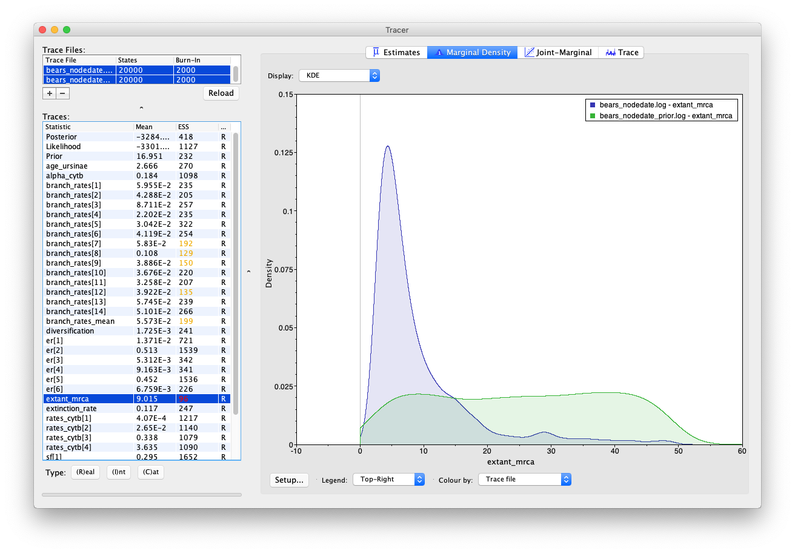
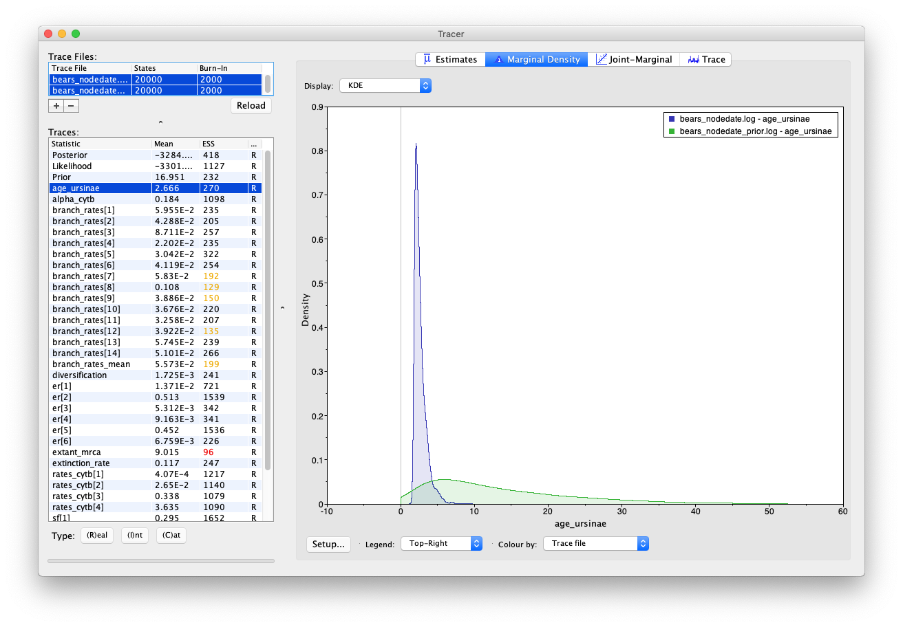
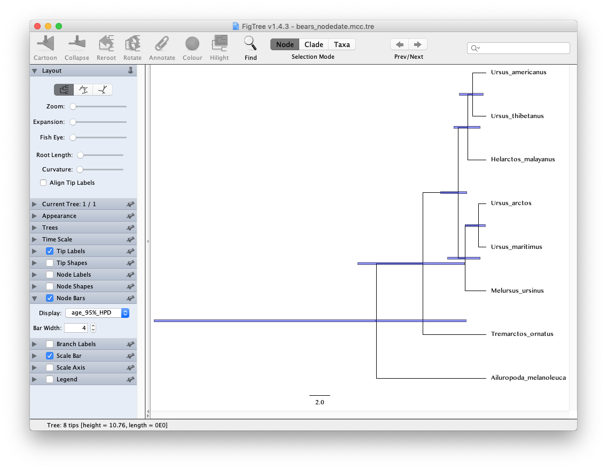

Exercise 3
===========
{:.section}

In [exercises 1]({{ base.url }}/tutorials/dating/global) and [2]({{ base.url }}/tutorials/dating/relaxed) we inferred the phylogeny of extant bears and relative speciation times assuming a molecular clock model. However, it would be much more useful to have estimates of speciation times in the context of geological time. 

In this exercise we will use information from the fossil record to calibrate the molecular substitution rate to absolute time using node dating. This approach involves assigning probability densities that incorporate temporal information from the fossil record to particular nodes in the tree.

### The data

The molecular data used in this exercise is the same as the previous exercise (**bears_cytb.nex**). We will also use the same substitution and clock models (the GTR + $\Gamma$ model and the uncorrelated exponential clock model).

We will also use the same tree model (the constant rate birth-death process), however, we will add calibration information from the fossil record to generate timetrees on a non-arbitrary timescale.
The file **bears_taxa.tsv** contains information about the age ranges for 20 bear species, including 12 extinct species. We're not going to use all of the information from this file in this exercise, because the node dating approach to calibration limits the amount of data we can take advantage of, but we'll use some of this information to constrain the age of two nodes. In this file `max` is the age of the first appearance (i.e. the oldest) of each species and `min` is the age of the last appearance (i.e. the youngest) (t = 0.0 represents the present). 

Again, there are just three steps you need to complete before running the analysis in this exercise. First, we need to create a script for the tree model and add our calibration information.
Second, we need to switch out the tree model in our master script and update the name of the output files, so we don't overwrite the output generated in the previous exercise.

### The tree model

We are going to add our calibrations to the script that incorporates the tree model.

>Create a copy of **tree_BD.Rev**, call it **tree_BD_nodedate.Rev** and open it in your text editor. 
{:.instruction}

Node calibrations are used to specify the age of monophyletic groups that are defined *a priori*.
Since the age of the node will not be known precisely, we can use evidence from the fossil record to define minimum (or maximum) bounds, and use a probability density (distribution) to reflect prior uncertainty in the age of that node.
We're going to add two node calibrations: one on the root and one on the internal node for the clade Ursinae, which we defined in exercise 1. 

#### Root calibration

The oldest first appearance of a *crown group* bear in our dataset is *Ursus americanus* at 1.84 Ma. This means that the last common ancestor of all living bears can not be younger that this. Fossil calibrations exert a large influence on Bayesian posterior estimates of speciation times and should not be selected arbitrarily. In practice it is very challenging to select distributions and parameters objectively. In this instance, we will take advantage of a previous estimate ($\sim$49 Ma) for the age of caniforms, which is the clade containing bears and other "dog-like" mammals, from . We will assume that the age of crown bears can not be older than this.

First, specify the prior on the root. The following commands will replace `extant_mrca <- 1.0` in your tree model script, before the the `tree_dist` variable is specified.
```
extant_mrca_min <- 1.84
extant_mrca_max <- 49.0
	
extant_mrca ~ dnUniform(extant_mrca_min, extant_mrca_max)
	
moves.append( mvScale(extant_mrca, lambda=1, tune=true, weight=5.0) )
```
Here, we have specified the minimum and maximum constraints described above and stochastic node for the age of the root `extant_mrca`. Finally, we define a move to sample the age of this parameter.

#### Internal node calibration

The second calibration will apply to the clade Ursinae that we defined previously. In addition to being the oldest crown group bear, the first appearance of *Ursus americanus* is also the first appearance of the group Ursinae. We'll use a diffuse exponential prior offset by the age of this fossil to constrain the age of this node.

In RevBayes, calibrated internal nodes are treated differently than  other Bayesian programs for estimating species divergence times (e.g. BEAST).
This is because the graphical model structure used in RevBayes does not allow a stochastic node to be assigned more than one prior distribution. 
By contrast, the common approach to applying calibration densities as used in other dating software leads to incoherence in the calibration prior.
Basically, common calibration approaches assume that the age of a calibrated node is modelled by the tree-wide diversification process (e.g. birth-death model) *and* a parametric density parameterized by the occurrence time of a fossil (or other external prior information).
This can induce a calibration prior density that is not consistent with the birth-death process or the parametric prior distribution. 
For much more information about this see .
Approaches that condition the birth-death process on the calibrated nodes are more statistically coherent .

In RevBayes, calibration densities are applied in a different way, treating fossil observation times like data. 
The age of the calibration node (i.e. the internal node specified as the MRCA of the fossil and a set of living species) is a deterministic node -- e.g. denoted $o_1$ for fossil $\mathcal{F}_1$ -- and acts as an offset on the stochastic node representing the age of the fossil specimen.
The fossil age, $\mathcal{F}_i$, is specified as a stochastic node and clamped to its *observed* age in the fossil record. 
The node $\mathcal{F}_i$ is modelled using a distribution that describes the waiting time from the speciation event to the appearance of the observed fossil. 
Thus, if the MCMC samples any state for which the age of $\mathcal{F}_i$ has a probability of 0, then that state will always be rejected, effectively calibrating the birth-death process without applying multiple prior densities to any calibrated node.

From your script, you'll recall that we previously defined the Ursinae clade and used it to generate a constrained tree topology. We also created a deterministic node `age_ursinae` to keep track of the age of this node.

To calibrate the age of this node we will specify a diffuse exponential density with an expected value (mean) = 1.0, offset by the age of fossil.
```
obs_age_ursinae ~ age_ursinae - dnExponential(1.0)
obs_age_ursinae.clamp(1.84)
```

### The master Rev script

>Copy the master script from the previous exercise and call it **MCMC_dating_ex3.Rev**. 
{:.instruction}

First, change the file used to specify the tree model from **tree_BD.Rev** to **tree_BD_nodedate.Rev**.
```
source("scripts/tree_BD_nodedate.Rev")
```
Second, update the name of the output files.
```
monitors.append( mnModel(filename="output/bears_nodedate.log", printgen=10) )
monitors.append( mnFile(filename="output/bears_nodedate.trees", printgen=10, timetree) )
```
Don't forget to update the commands used to generate the summary tree.
```
trace = readTreeTrace("output/bears_nodedate.trees")
mccTree(trace, file="output/bears_nodedate.mcc.tre" )
```
That's all you need to do!

>Run your MCMC analysis!
{:.instruction}

Note that the root age is no longer a constant number (= 1) and scale of the diversification parameter may have changed.

### Running the analysis without the sequence data

It is always useful to examine the output of your MCMC analysis when using fossil age data but ignoring sequence data (i.e. without calculating the likelihood that comes from the substitution model).
Setting this up in RevBayes is very easy.
Let's do this while the above analysis is still running.

>Copy the master script you just created and call it **MCMC_dating_ex3_only_fossil_data.Rev**.
{:.instruction}

We just need to mark the clamped node `phySeq` that represents DNA sequence information as being ignored.
```
mymodel = model(sf)
mymodel.ignoreData(phySeq)     # obs_age_ursinae is retained
```
Note that we retained the clamped node `obs_age_ursinae` that represents fossil age information.
Again, we need to rename the output files.
```
monitors.append( mnModel(filename="output/bears_nodedate_only_fossil_data.log", printgen=10) )
```	
We're not going to bother summarizing the trees, so if you want you can simply remove/comment out the second monitor (`mnFile`) and the tree summary functions (`readTreeTrace` and `mccTree`).

This analysis will show you the estimates of node ages obtained under the tree model in combination with the constraint applied at the root of the tree. Note that although this step is often called "running the model under the prior", the distinction between the prior and posterior varies between programs and becomes less clear once we incorporate fossil data into the tree.

>When the above analysis is done, run the MCMC analysis under the prior!
{:.instruction}

### Examining the output

Let's examine the output in Tracer.

>Open the program Tracer and load the log files **bears_nodedate.log** and **bears_nodedate_only_fossil_data.log**.
{:.instruction}

Select both log files and compare the age estimates obtained for the root (`extant_mrca`) and the MRCA of Ursinae (`age_ursinae`). To reproduce the Tracer images shown below, click on the node of interest and select Colour by: Trace file and Legend: Top-Right. 


 
 
The Marginal Density panel in Tracer showing the marginal estimates for the age of the root.




 
 
The Marginal Density panel in Tracer showing the marginal estimates for the age of Ursinae.



You'll notice that including sequence data and the internal node calibration in our analysis reduces the uncertainty in our prior estimates.
However, there is still a large degree of uncertainty in our posterior node ages -- the 95% HPD interval for root age spans nearly 46 Myr, which is basically the width of the uniform prior that we used to constrain the age of this node in the first place! 

#### The tree output

Take a look at the posterior MCC tree in FigTree. In the case of this analysis, the scale bar is actually meaningful and represents time in units of Myr.
Try to produce the image shown below including the 95% HPDs.


 
 
The FigTree window. To open your tree you can use File > Open. Select Node Labels to view the absolute node ages and Node Bars to display the 95% HPDs.



If you wanted to visualise the impact of the internal node calibrations, without the influence of the sequence data, you could run the MCMC analysis under the posterior and use an empty sequence alignment (this would be equivalent to running the analysis under the prior in BEAST and MCMCTree).

### Caveat

Note that there are many more fossil species in the file **bears_taxa.tsv** with associated age information that we didn't use in this exercise.
This is because, in the context of node dating, the calibration information is redundant with information already utilised (e.g. all other Urisinae species are younger than the fossil we used to constrain the age of this clade) or because we don't have good prior knowledge about the phylogenetic position of the species.

### Next

>Click below to begin the next exercise!
{:.instruction}

* [Estimating speciation times using the fossilized birth-death process]({{ base.url }}/tutorials/fbd/fbd_specimen)

<!--
For further options and information about the models used in this exercise see Tracy Heath & Sebastian Höhna's tutorial [Divergence Time Calibration](https://github.com/revbayes/revbayes_tutorial/blob/master/tutorial_TeX/RB_DivergenceTime_Calibration_Tutorial/).
-->

