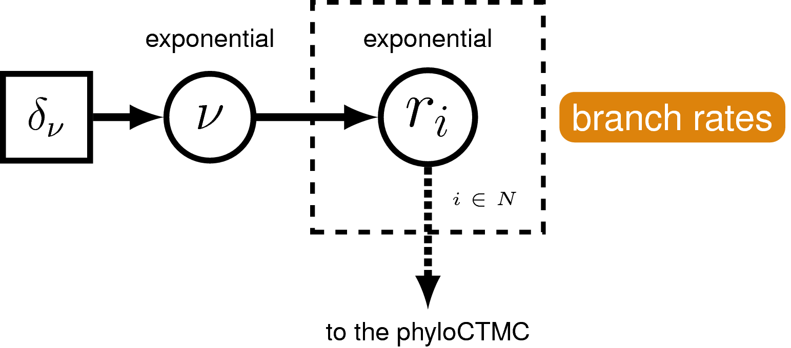
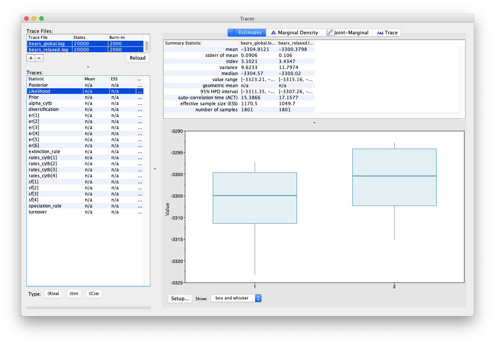
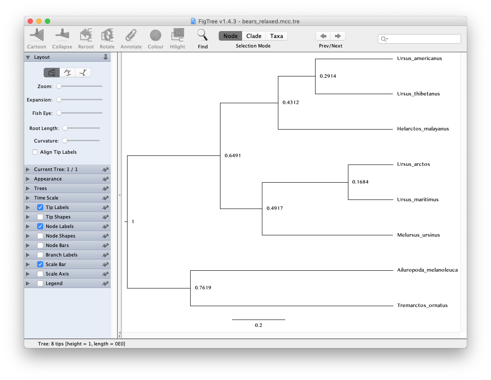

Exercise 2
===========
{:.section}

In [exercise 1]({{ base.url }}/tutorials/dating/global) we inferred the phylogeny of living bears and estimated relative node ages assuming a global molecular clock model.
In this exercise we will relax the assumption of constant rates across the tree and use a relaxed molecular clock model that allows each branch in the tree to have an independent rate.


 
 
A graphical model of the uncorrelated exponential relaxed clock model. In this model, the clock rate on each branch is independent and identically distributed according to an exponential density with mean drawn from an exponential hyperprior distribution.



### The data

The data used in this exercise is the same as in the previous exercise (**bears_cytb.nex**). We will also use the same tree model (the birth-death process model) and the same substitution model (the GTR + $\Gamma$ model).

There are just three steps you need to complete before running the analysis in this exercise. First, we need to create a script for the relaxed clock model.
Second, we need to switch out the global clock model for the relaxed clock model in our master script and we need to update the name of the output files, so we don't overwrite the output generated in the previous exercise.


### The clock model

Remember the clock (or branch-rate) model describes how rates of substitution vary (or not) across the tree. 

>Create a script called **clock_relaxed_exponential.Rev** and open it in your text editor. 
{:.instruction}

We are going to use the uncorrelated exponential relaxed clock model. In this model rates for each branch will be drawn independently from an exponential distribution. 

It's a bit more tricky to set up this clock model. First, we'll define the mean branch rate as an exponential random variable (`branch_rates_mean`). Then, specify a scale proposal move on this parameter.
```
branch_rates_mean ~ dnExponential(10.0)
moves.append( mvScale(branch_rates_mean, lambda=0.5, tune=true, weight=3.0) )
```
Before creating a rate parameter for each branch, we need to define the number of branches in the tree. For rooted trees with $n$ taxa, the number of branches is $2n−2$.
```
n_branches <- 2 * n_taxa - 2
```
Then, use a for loop to define a rate for each branch. The branch rates are independent and identically exponentially distributed with mean equal to the mean branch rate parameter we specified above. For each rate parameter we will also create scale proposal moves.
```
for(i in 1:n_branches){
    branch_rates[i] ~ dnExp(1/branch_rates_mean)
    moves.append( mvScale(branch_rates[i], lambda=0.5, tune=true, weight=1.0) )
}
```	
Note that now we have a vector of rates `branch_rates`, where each entry corresponds to a different branch in the tree, instead of a single rate that applies to all branches.	
Lastly, we will use two more specific moves to help improve MCMC convergence.
First, we will use a vector scale move to propose changes to all branch rates simultaneously. 
This way we can sample the total branch rate independently of each individual rate, which can improve mixing.
Second, we will use a move (`mvRateAgeBetaShift`) that changes the node ages and branch rates jointly,
so that the effective branch length (the product of branch time and branch rate) remains the same.
Thus, the move is proposing values with same the likelihood but a different prior probability.
```
moves.append( mvVectorScale(branch_rates, lambda=0.5, tune=true, weight=4.0) )
moves.append( mvRateAgeBetaShift(tree=timetree, rates=branch_rates, tune=true, weight=n_taxa) )
```


### The master Rev script

>Copy the master script from the previous exercise and call it **MCMC_dating_ex2.Rev**. 
{:.instruction}

First, change the file used to specify the clock model from **clock_global.Rev** to **clock_relaxed_exponential.Rev**.
```
source("scripts/clock_relaxed_exponential.Rev")
```
Second, update the name of all the output files.
```
monitors.append( mnModel(filename="output/bears_relaxed_exponential.log", printgen=10) )
monitors.append( mnFile(filename="output/bears_relaxed_exponential.trees", printgen=10, timetree) )
```
Don't forget to update the commands used to generate the summary tree.
```
trace = readTreeTrace("output/bears_relaxed_exponential.trees")
mccTree(trace, file="output/bears_relaxed_exponential.mcc.tre" )
```
That's all you need to do!

>Run your MCMC analysis!
{:.instruction}


### Examining the output

Let's compare the output from the two different clock models in Tracer.

>Open the program Tracer and load the log files **bears_global.log** and **bears_relaxed_exponential.log**.
{:.instruction}

You may notice that convergence isn't as good for this analysis, 
which is probably caused by having a larger number of parameters.

Have a look at the estimate for the mean branch-rate parameter (`branch_rates_mean`) in comparison 
to the estimate recovered in the previous analysis assuming a global molecular clock (`branch_mean`). 
You'll notice that median estimates for these parameters differ quite a bit.

In Tracer you can also highlight multiple parameters simultaneously, by using the shift key. 
Have a look at the rates obtained across different branches. 
You can see that there appears to be signal in the data for variation in rates along different branches.


 
 
The estimates panel in Tracer showing the rates estimated for different branches.



You can also compare the same parameters estimated using different models by selecting multiple trace files.


 
 
The estimates panel in Tracer showing the likelihood estimates obtained using two different clock models.



Note that the likelihood obtained using the relaxed clock model is higher than for the global clock model, 
which hints that it might be a better fit to our data. 
However, this analysis has quite a lot of additional parameters (i.e. one addition rate parameter for each branch). 
To work out whether this model really is more appropriate for our data, 
we would need to use a more robust model testing approach. 
For more on this topic see Tracy Heath's tutorial [Relaxed Clocks & Time Trees]({{ base.url }}/tutorials/clocks/). 

Scroll through the other parameter estimates and see if you can spot any differences.


#### The tree output

Let's also have a quick look at the trees. 


 
 
The FigTree window. To open your tree you can use File > Open. Select Node Labels to view the relative node ages.



If you open the trees generated using the global versus relaxed clock models in FigTree, you can compare them to see whether these models made an important difference to the inferred topology and/or relative node ages. Another useful thing to look at are the posterior probabilities obtained for different nodes. Go to the options under Node Labels and select Display > posterior.


#### Exercise

We have seen above how to specify the UCE (uncorrelated exponential) clock model.
For this exercise, we want you the change the UCE clock model into a UCLN clock model (uncorrelated relaxed clock).
That means, we will need to replace the prior on the `branch_rates` so that they are drawn from a lognormal distribution.

>Copy the script called **clock_relaxed_exponential.Rev**, name it **clock_relaxed_lognormal.Rev** and open it in your text editor. 
{:.instruction}

Since the lognormal distribution is parameterized by the log of the mean, we transform first the mean into the log mean.
```
ln_branch_rates_mean := ln( branch_rates_mean )
```
Now we can replace the `for`-loop and specify that we use a lognormal distribution
```
for(i in 1:n_branches){
    branch_rates[i] ~ dnLognormal(ln_branch_rates_mean,sd=0.587405)
    moves.append( mvScale(branch_rates[i], lambda=0.5, tune=true, weight=1.0) )
}
```	
Next, we are ready to set up the master script to run the analysis.

>Copy the master script from the previous exercise and call it **MCMC_dating_ex2b.Rev**. 
{:.instruction}

Change the file used to specify the clock model from **clock_relaxed_exponential.Rev** to **clock_relaxed_lognormal.Rev**.
```
source("scripts/clock_relaxed_lognormal.Rev")
```
Don't forget to update the filenames of the output (*e.g.,* from `bears_relaxed_exponential` to `bears_relaxed_lognormal`).

>Run your MCMC analysis!
{:.instruction}


### Next

>Click below to begin the next exercise!
{:.instruction}

* [Estimating speciation times using node dating]({{ base.url }}/tutorials/dating/nodedate)

For further options and information about clock models see Tracy Heath's tutorial [Relaxed Clocks & Time Trees]({{ base.url }}/tutorials/clocks/).


