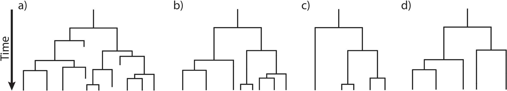
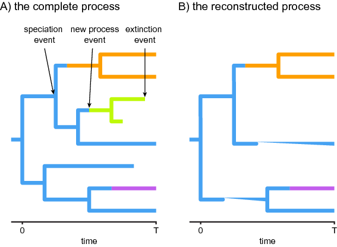
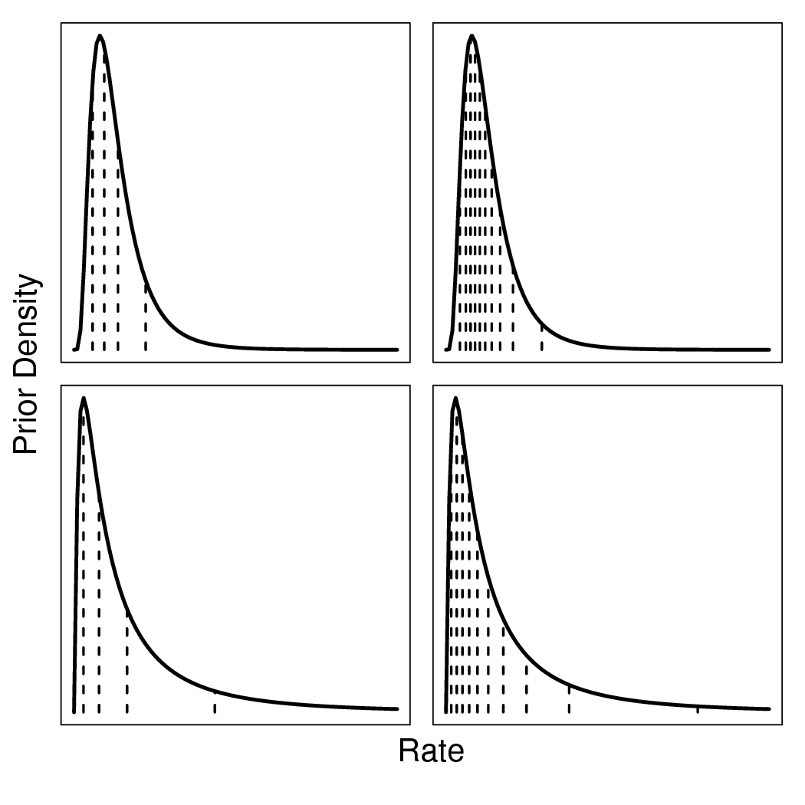

---
title: Branch-Specific Diversification Rate Estimation
subtitle: How to estimate branch-specific shifts in diversification rates 
authors:  Sebastian Höhna and Michael R. May
level: 4
order: 0
index: true
prerequisites:
- intro
- intro_rev
- mcmc_archery
- mcmc_binomial
- diversification_rate_simple
title-old: RB_DiversificationRate_BranchSpecific_Tutorial
redirect: false
---

<<<<<<< HEAD
=======

Overview: Diversification Rate Estimation {#sec:diversification_rate_overview}
=========================================
{:.section}

Models of speciation and extinction are fundamental to any phylogenetic
analysis of macroevolutionary processes
(*e.g.*, divergence time estimation,
diversification rate estimation, continuous and discrete trait
evolution, and historical biogeography). First, a prior model describing
the distribution of speciation events over time is critical to
estimating phylogenies with branch lengths proportional to time. Second,
stochastic branching models allow for inference of speciation and
extinction rates. These inferences allow us to investigate key questions
in evolutionary biology.

Diversification-rate parameters may be included as nuisance parameters
of other phylogenetic models—*i.e.*, where
these diversification-rate parameters are not of direct interest. For
example, many methods for estimating species divergence times—such as
`BEAST` ,
`MrBayes` , and RevBayes
—implement `relaxed-clock models' that include a
constant-rate birth-death branching process as a prior model on the
distribution of tree topologies and node ages. Although the parameters
of these `tree priors' are not typically of direct interest, they are
nevertheless estimated as part of the joint posterior probability
distribution of the relaxed-clock model, and so can be estimated simply
by querying the corresponding marginal posterior probability densities.
In fact, this may provide more robust estimates of the
diversification-rate parameters, as they accommodate uncertainty in the
other phylogenetic-model parameters (including the tree topology,
divergence-time estimates, and the other relaxed-clock model
parameters). More recent work,
*e.g.*, , uses macroevolutionary
models (the fossilized birth-death process) to calibrate phylogenies and
thus to infer dated trees.

In these tutorials we focus on the different types of macroevolutionary
models to study diversification processes and thus the
diversification-rate parameters themselves. Nevertheless, these
macroevolutionary models should be used for other evolutionary
questions, when an appropriate prior distribution on the tree and
divergence times is needed.

Types of Hypotheses for Estimating Diversification Rates
--------------------------------------------------------

Many evolutionary phenomena entail differential rates of diversification
(speciation – extinction); *e.g.*, adaptive
radiation, diversity-dependent diversification, key innovations, and
mass extinction. The specific study questions regarding lineage
diversification may be classified within three fundamental categories of
inference problems. Admittedly, this classification scheme is somewhat
arbitrary, but it is nevertheless useful, as it allows users to navigate
the ever-increasing number of available phylogenetic methods. Below, we
describe each of the fundamental questions regarding diversification
rates.

#### (1) Diversification-rate through time estimation

*What is the (constant) rate of diversification in my study group?* The
most basic models estimate parameters of the stochastic-branching
process (*i.e.*, rates of speciation and
extinction, or composite parameters such as net-diversification and
relative-extinction rates) under the assumption that rates have remained
constant across lineages and through time;
*i.e.*, under a constant-rate birth-death
stochastic-branching process model . Extensions to the
(basic) constant-rate models include diversification-rate variation
through time  . First, we might ask whether
there is evidence of an episodic, tree-wide increase in diversification
rates (associated with a sudden increase in speciation rate and/or
decrease in extinction rate), as might occur during an episode of
adaptive radiation. A second question asks whether there is evidence of
a continuous/gradual decrease in diversification rates through time
(associated with decreasing speciation rates and/or increasing
extinction rates), as might occur because of diversity-dependent
diversification (*i.e.*, where competitive
ecological interactions among the species of a growing tree decrease the
opportunities for speciation and/or increase the probability of
extinction, *e.g.*, ). Third, we
can ask whether changes in diversification rates are correlated with
environmental factors, such as environmental CO~2~ or temperature
. A final question in this category asks whether our
study tree was impacted by a mass-extinction event (where a large
fraction of the standing species diversity is suddenly lost,
*e.g.*, ). The common theme of these
studies is that the diversification process is tree-wide, that is, all
lineages of the study group have the exact same rates at a given time.

#### (2) Diversification-rate variation across branches estimation

*Is there evidence that diversification rates have varied significantly
across the branches of my study group?* Models have been developed to
detect departures from rate constancy across lineages; these tests are
analogous to methods that test for departures from a molecular
clock—*i.e.*, to assess whether substitution
rates vary significantly across lineages  .
These models are important for assessing whether a given tree violates
the assumptions of rate homogeneity among lineages. Furthermore, these
models are important to answer questions such as: *What are the
branch-specific diversification rates?*; and *Have there been
significant diversification-rate shifts along branches in my study
group, and if so, how many shifts, what magnitude of rate-shifts and
along which branches?*

#### (3) Character-dependent diversification-rate estimation

*Are diversification rates correlated with some variable in my study
group?* Character-dependent diversification-rate models aim to identify
overall correlations between diversification rates and organismal
features (binary and multi-state discrete morphological traits,
continuous morphological traits, geographic range, etc.). For example,
one can hypothesize that a binary character, say if an organism is
herbivorous/carnivorous or self-compatible/self-incompatible, impact the
diversification rates. Then, if the organism is in state 0
(*e.g.*, is herbivorous) it has a lower (or
higher) diversification rate than if the organism is in state 1
(*e.g.*, carnivorous) .

Diversification Rate Models {#sec:models}
===========================
{:.section}

We begin this section with a general introduction to the stochastic
birth-death branching process that underlies inference of
diversification rates in RevBayes. This primer will provide some
details on the relevant theory of stochastic-branching process models.
We appreciate that some readers may want to skip this somewhat technical
primer; however, we believe that a better understanding of the relevant
theory provides a foundation for performing better inferences. We then
discuss a variety of specific birth-death models, but emphasize that
these examples represent only a tiny fraction of the possible
diversification-rate models that can be specified in RevBayes.

The birth-death branching process
---------------------------------
{:.subsection}

Our approach is based on the *reconstructed evolutionary process*
described by ; a birth-death process in which only sampled,
extant lineages are observed. Let $N(t)$ denote the number of species at
time $t$. Assume the process starts at time $t_1$ (the `crown' age of
the most recent common ancestor of the study group, $t_\text{MRCA}$)
when there are two species. Thus, the process is initiated with two
species, $N(t_1) = 2$. We condition the process on sampling at least one
descendant from each of these initial two lineages; otherwise $t_1$
would not correspond to the $t_\text{MRCA}$ of our study group. Each
lineage evolves independently of all other lineages, giving rise to
exactly one new lineage with rate $b(t)$ and losing one existing lineage
with rate $d(t)$ ( and
). Note that although each lineage evolves
independently, all lineages share both a common (tree-wide) speciation
rate $b(t)$ and a common extinction rate $d(t)$
 . Additionally, at certain times,
$t_{\mathbb{M}}$, a mass-extinction event occurs and each species
existing at that time has the same probability, $\rho$, of survival.
Finally, all extinct lineages are pruned and only the reconstructed tree
remains ().


 

A realization of the birth-death process with mass extinction.
Lineages that have no extant or sampled descendant are shown in gray and
surviving lineages are shown in a thicker black line.



 

**Examples of
trees produced under a birth-death process.** The process is
initiated at the first speciation event (the `crown-age' of the MRCA)
when there are two initial lineages. At each speciation event the
ancestral lineage is replaced by two descendant lineages. At an
extinction event one lineage simply terminates. (A) A complete tree
including extinct lineages. (B) The reconstructed tree of tree from A
with extinct lineages pruned away. (C) A *uniform* subsample of the tree
from B, where each species was sampled with equal probability, $\rho$.
(D) A *diversified* subsample of the tree from B, where the species were
selected so as to maximize diversity. 


To condition the probability of observing the branching times on the
survival of both lineages that descend from the root, we divide by
$P(N(T) > 0 | N(0) = 1)^2$. Then, the probability density of the
branching times, $\mathbb{T}$, becomes $$\begin{aligned}
P(\mathbb{T}) = \fra\frac{}{b}ace{P(N(T) = 1 \mid N(0) = 1)^2}^{\text{both initial lineages have one descendant}}}{ \underbrace{P(N(T) > 0 \mid N(0) = 1)^2}_{\text{both initial lineages survive}} } \times \prod_{i=2}^{n-1\frac{ }{b}ace{i \times b(t_i)}^{\text{speciation rate}} \time\frac{ }{b}ace{P(N(T) = 1 \mid N(t_i) = 1)}^\text{lineage has one descendant},\end{aligned}$$
and the probability density of the reconstructed tree (topology and
branching times) is then $$\begin{aligned}
P(\Psi) = \; & \frac{2^{n-1}}{n!(n-1)!} \times \left( \frac{P(N(T) = 1 \mid N(0) = 1)}{P(N(T) > 0 \mid N(0) = 1)} \right)^2 \nonumber\\
		  \; & \times \prod_{i=2}^{n-1} i \times b(t_i) \times P(N(T) = 1 \mid N(t_i) = 1)
	\label{eq:tree_probability}\end{aligned}$$

We can expand Equation ([eq:tree_probability]) by substituting
$P(N(T) > 0 \mid N(t) =1)^2 \exp(r(t,T))$ for
$P(N(T) = 1 \mid N(t) = 1)$, where $r(u,v) = \int^v_u d(t)-b(t)dt$; the
above equation becomes $$\begin{aligned}
P(\Psi) = \; & \frac{2^{n-1}}{n!(n-1)!} \times \left( \frac{P(N(T) > 0 \mid N(0) =1 )^2 \exp(r(0,T))}{P(N(T) > 0 \mid N(0) = 1)} \right)^2 \nonumber\\
		  \; & \times \prod_{i=2}^{n-1} i \times b(t_i) \times P(N(T) > 0 \mid N(t_i) = 1)^2 \exp(r(t_i,T)) \nonumber\\
		= \; & \frac{2^{n-1}}{n!} \times \Big(P(N(T) > 0 \mid N(0) =1 ) \exp(r(0,T))\Big)^2 \nonumber\\
		  \; & \times \prod_{i=2}^{n-1} b(t_i) \times P(N(T) > 0 \mid N(t_i) = 1)^2 \exp(r(t_i,T)).
		\label{eq:tree_probability_substitution}\end{aligned}$$ For a detailed
description of this substitution, see . Additional
information regarding the underlying birth-death process can be found in
 [Equation 3.4.6] and  for constant rates and
   for arbitrary rate functions.

To compute the equation above we need to know the rate function,
$r(t,s) = \int_t^s d(x)-b(x) dx$, and the probability of survival,
$P(N(T)\!>\!0|N(t)\!=\!1)$.  and later  derived
the probability that a process survives ($N(T) > 0$) and the probability
of obtaining exactly $n$ species at time $T$ ($N(T) = n$) when the
process started at time $t$ with one species. Kendall's results were
summarized in Equation (3) and Equation (24) in 
$$\begin{aligned}
P(N(T)\!>\!0|N(t)\!=\!1) & = & \left(1+\int\limits_t^{T} \bigg(\mu(s) \exp(r(t,s))\bigg) ds\right)^{-1} \label{eq:survival} \\ \nonumber \\
P(N(T)\!=\!n|N(t)\!=\!1) & = & (1-P(N(T)\!>\!0|N(t)\!=\!1)\exp(r(t,T)))^{n-1} \nonumber\\
& & \times P(N(T)\!>\!0|N(t)\!=\!1)^2 \exp(r(t,T)) \label{eq:N} $$ An
overview for different diversification models is given in
.

***Sidebar: Phylogenetic trees as observations***

The branching processes used here describe probability distributions on
phylogenetic trees. This probability distribution can be used to infer
diversification rates given an “observed” phylogenetic tree. In reality
we never observe a phylogenetic tree itself. Instead, phylogenetic trees
themselves are estimated from actual observations, such as DNA
sequences. These phylogenetic tree estimates, especially the divergence
times, can have considerable uncertainty associated with them. Thus, the
correct approach for estimating diversification rates is to include the
uncertainty in the phylogeny by, for example, jointly estimating the
phylogeny and diversification rates. For the simplicity of the following
tutorials, we take a shortcut and assume that we know the phylogeny
without error. For publication quality analysis you should always
estimate the diversification rates jointly with the phylogeny and
divergence times.

>>>>>>> 6736d93b01ff8107bd82b4cb79a8cc9f527e505c
Estimating Branch-Specific Speciation & Extinction Rates
========================================================
{:.section}

Outline
-------

This tutorial describes how to specify a branch-specific
branching-process models in RevBayes; a birth-death process where
diversification rates vary among branches, similar to .
The probabilistic graphical model is given for each component of this
tutorial. The goal is to obtain estimate of branch-specific
diversification rates using Markov chain Monte Carlo (MCMC).

<<<<<<< HEAD
=======
Requirements
------------

We assume that you have read and hopefully completed the following
tutorials:

-   RB_Getting_Started

-   RB_Basics_Tutorial

-   RB_BayesFactor_Tutorial

-   RB_BasicDiversificationRate_Tutorial

Note that the RB_Basics_Tutorial introduces the basic syntax of `Rev`
but does not cover any phylogenetic models. You may skip the
RB_Basics_Tutorial if you have some familiarity with `R`.
The [RB_BayesFactor_Tutorial](https://github.com/revbayes/revbayes_tutorial/raw/master/tutorial_TeX/RB_BayesFactor_Tutorial/RB_BayesFactor_Tutorial.pdf) introduces Bayesian model selection by
means of Bayes factors, which can be skipped by readers familiar with
Bayesian model selection. We tried to keep this tutorial very basic and
introduce all the language concepts and theory on the way. You may only
need the RB_Basics_Tutorial for a more in-depth discussion of concepts
in `Rev`.

Data and files
==============

We provide the data file(s) which we will use in this tutorial. You may
want to use your own data instead. In the `data` folder, you will find
the following files

-   `primates_tree.nex`: Dated primates phylogeny including 233 out of
    367 species from .

Open the tree `data/primates_tree.nex` in FigTree.

Branch-Specific Birth-Death Model
=================================
{:.subsection}


 

Cartoon of a
branch-specific birth-death process. On the left we see the full
process. On the right we only see the branches of the reconstructed
tree, thus missing one rate-shift event. 


The basic idea behind the model is that speciation and extinction rates
are allowed to vary across branches of the tree (see 
). Unfortunately, it is not possible to model rates drawn
from a continuous distribution directly, as done for example in
`BAMM`, because in that case one needs to integrate over
any number of possible rate shifts, any time of these shifts and most
importantly over all possible new rates. This is unfeasible to do and
failure to do so has been shown to make parameter estimates unreliable
.


 
 
Cartoon of the
likelihood computation using numerical integration. 


Here we adopt an approach using (few) discrete rate categories instead.
This allows us to numerically integrate over all possible rate
categories using a system of differential equation originally described
by  (see also  and ). The
numerical procedure beaks time into very small time intervals and sums
over all possible events occurring in that interval (see ).

You don't need to worry about any of the technical details. It is
important for you to realize that this model assumes that new rates at a
rate-shift event are drawn from a given (discrete) set of rates.

In RevBayes we have two implementations
(*i.e.*, distributions) for modeling a
branch-specific birth-death process. The first distribution is the
`dnBirthDeathMultiRate` (or its alias `dnMRBDP`) and the second is the
`dnHeterogeneousBirthDeath` (or its alias `dnHBDP`). We have designed
this tutorial so that each section can be read independently although we
recommend that you work through both of them. You will find that some
parts are redundant, which is intentional to emphasize the similarities
between the analysis but also to make the sections independent.

Testing for Branch-Specific-Diversification Rates
=================================================
{:.subsection}

In this first exercise we are interested in knowing if there is
diversification-rate variation among branches for our study tree. That
is, we want to see if we can reject a constant rate birth-death process.
Therefore, we don't focus on branch-specific parameter estimates but
instead on the marginal likelihood estimation for model testing.

We assume that you have completed the
RB_BasicDiversificationRate_Tutorial to estimate the marginal
likelihood under a constant-rate birth-death process. If you haven't
done so, then you should go back and do this now!

Read the tree
-------------

Begin by reading in the observed tree.

    observed_phylogeny <- readTrees("data/primates_tree.nex")[1]

From this tree, we can get some helpful variables:

    taxa <- observed_phylogeny.taxa()
    root <- observed_phylogeny.rootAge()
    tree_length <- observed_phylogeny.treeLength()

Additionally, we can initialize an iterator variable for our vector of
moves and monitors:

    mvi = 0
    mni = 0

Finally, we create a helper variable that specifies the number of
discrete rate categories, another helper variable for the expected
number of rate-shift events, the total number of species, and the
variation in rates.

    NUM_RATE_CATEGORIES = 4
    EXPECTED_NUM_EVENTS = 2
    NUM_TOTAL_SPECIES = 367
    H = 0.587405

Using these variables we can easily change our script, for example, to
use more or fewer categories and test the impact. For example, setting
`NUM_RATE_CATEGORIES = 1` gives the constant rate birth-death process.

Specifying the model
--------------------

### Priors on rates

>  
> Discretization of
a lognormal distribution. The two left figures have 4 rate categories
and the two right plots have 10 rate categories. The top plots have the
95% probability interval spanning one order of magnitude (`sd`
$=0.587405$) and the bottom plots have the 95% probability interval
spanning two orders of magnitude (`sd` $=2*0.587405$) 
{:.figure}

>  
> Discretization of
a lognormal distribution. The two left figures have 4 rate categories
and the two right plots have 10 rate categories. The top plots have the
95% probability interval spanning one order of magnitude (`sd`
$=0.587405$) and the bottom plots have the 95% probability interval
spanning two orders of magnitude (`sd` $=2*0.587405$) 
{:.figure}

Instead of using a continuous probability distribution we will use a
discrete approximation of the distribution, as done for modeling rate
variation across sites  and for modeling relaxed molecular
clocks . That means, we assume that the speciation rates
are drawn from one of the $N$ quantiles of the lognormal distribution.
For this we will use the function `fnDiscretizeDistribution` which takes
in a distribution as its first argument and the number of quantiles as
the second argument. The return value is a vector of quantiles. We use
it as a deterministic variable and every time the parameters of the base
distribution (*i.e.*, the lognormal
distribution in our case) change the quantiles will update automatically
as well. Thus we only need to specify parameters for our base
distribution, the lognormal distribution. We choose a stochastic
variable for the mean parameter of the lognormal distribution drawn from
yet another lognormal prior distribution. We fix the prior mean on this
mean speciation rate on our expected diversification rate, which is
$\ln( \ln(\frac{\#Taxa}{2})/age )$. Remember that the median of a
lognormal distribution is equal to the exponential of the mean
parameter. This is why we used a log-transform of the actual mean. This
prior density is analogous to the prior on the speciation-rate parameter
in the constant-rate birth-death process.

    speciation_prior_mean <- ln( ln(NUM_TOTAL_SPECIES/2.0) / root )
    speciation_mean ~ dnLognormal(mean=speciation_prior_mean, sd=H)
    moves[++mvi] = mvScale(speciation_mean,lambda=1,tune=true,weight=5)

Additionally, we choose a fixed standard deviation of $2*H$
($0.587405*2$) for the speciation rates because it represents two orders
of magnitude variance in the rate categories.

    speciation_sd <- 2*H
    speciation_categories := fnDiscretizeDistribution( dnLognormal(ln(speciation_mean), speciation_sd), NUM_RATE_CATEGORIES )

We also need discretized extinction-rate categories. We are completely
free to choose how we construct these rate categories. For example, we
could choose a similar discretization of a lognormal distribution using
its quantiles to provide different extinction-rate categories. For
simplicity, this is how we specify the current model. Alternatively, we
could assume that each rate category has the same extinction rate.

    extinction_prior_mean <- ln( ln(NUM_TOTAL_SPECIES/2.0) / root )
    extinction_mean ~ dnLognormal(mean=extinction_prior_mean,sd=2*H)
    moves[++mvi] = mvScale(extinction_mean,lambda=1.0,tune=true,weight=3.0)

As with the speciation rate, we discretize the lognormal distribution
into a finite number of rate categories.

    extinction_categories := fnDiscretizeDistribution( dnLognormal(ln(extinction_mean), H), NUM_RATE_CATEGORIES )

Now, we must create a vector that contains each combination of
speciation- and extinction-rates. This allows the rate of speciation to
change without changing the rate of extinction and vice versa. The
resulting vector should be $N^2$ elements long. We call these the
`paired' rate categories.

    k = 1
    for(i in 1:NUM_RATE_CATEGORIES) {
        for(j in 1:NUM_RATE_CATEGORIES) {
            speciation[k]   := speciation_categories[i]
            extinction[k++] := extinction_categories[j]
        }
    }

Next, we need a rate parameter for the rate-shifts events. We do not
have much prior information about this rate but we can provide some
realistic ranges. For example, we can specify a mean rate so that the
resulting number of expected rate-shift events is 2 (as specified in our
global variable `EXPECTED_NUM_EVENTS`). Furthermore, we can say that
the 95% prior ranges exactly one order of magnitude. We achieve all this
by specifying a lognormal prior distribution with mean `ln(
EXPECTED_NUM_EVENTS/tree_length )` and standard deviation of `H`.
Remember that this is only possible if the tree is known and not
estimated simultaneously because only if the tree is do we also know the
tree length. As usual for rate parameter, we apply a scaling move to the
`event_rate` variable.

    event_rate ~ dnLognormal( ln( EXPECTED_NUM_EVENTS/tree_length ), H)
    moves[++mvi] = mvScale(event_rate,lambda=1,tune=true,weight=5)

Additionally, we need a rate-matrix parameter providing the relative
rates between paired rate categories. In this case we simply use equal
rates between each rate category; and thus use the Jukes-Cantor rate
matrix. You could, for example, also use an ordered rate matrix where
the process needs to go through rate 2 before going to rate 3 when
starting in rate 1.

    rate_matrix <- fnJC( NUM_RATE_CATEGORIES * NUM_RATE_CATEGORIES )

Furthermore, we need prior probabilities for the process being in either
paired rate category at the root. Given our lack of prior knowledge we
create a flat prior distribution giving each rate category equal weight.
We do this by create a constant variable using the simplex function.

    rate_category_prior <- simplex( rep(1, NUM_RATE_CATEGORIES * NUM_RATE_CATEGORIES) )

### Incomplete Taxon Sampling

We know that we have sampled 233 out of 367 living primate species. To
account for this we can set the sampling parameter as a constant node
with a value of 233 / 367.

    rho <- observed_phylogeny.ntips() / NUM_TOTAL_SPECIES

### Root age

The birth-death process requires a parameter for the root age. In this
exercise we use a fix tree and thus we know the age of the tree. Hence,
we can get the value for the root from the  tree. This
is done using our global variable `root` defined above and nothing else
has to be done here.

### The time tree

Now we have all of the parameters we need to specify the full episodic
birth-death model. We initialize the stochastic node representing the
time tree.

    timetree ~ dnMRBDP(lambda=speciation, mu=extinction, Q=rate_matrix, rootAge=root, rho=rho, pi=rate_category_prior, delta=event_rate, taxa=taxa)

And then we attach data to it.

    timetree.clamp(observed_phylogeny)

Finally, we create a workspace object of our whole model using the
`model()` function.

    mymodel = model(speciation)

The `model()` function traversed all of the connections and found all of
the nodes we specified.

Running a marginal likelihood estimation
----------------------------------------
{:.subsection}

### Specifying Monitors

For the marginal likelihood analysis we don't necessarily need monitors
because we are not going to look into the samples. However, as good
practice we still define our two standard monitors: the model monitor
and a screen monitor

    monitors[++mni] = mnModel(filename="output/primates_MRBD.log",printgen=10, separator = TAB)
    monitors[++mni] = mnScreen(printgen=10, diversification_mean, turnover)

### Initializing and Running the MCMC Simulation

If you don't feel comfortable with Bayesian model selection
anymore, then have a look at the
[RB_BayesFactor_Tutorial](https://github.com/revbayes/revbayes_tutorial/raw/master/tutorial_TeX/RB_BayesFactor_Tutorial/RB_BayesFactor_Tutorial.pdf)
again.

First, we create the variable containing the power posterior. This
requires us to provide a model and vector of moves, as well as an output
file name. The `cats` argument sets the number of power steps.

    pow_p = powerPosterior(mymodel, moves, "output/MRBD_powp.out", cats=100)

We can start the power posterior by first burning in the chain and and
discarding the first 5000 states.

    pow_p.burnin(generations=5000,tuningInterval=200)

Now execute the run with the `.run()` function:

    pow_p.run(generations=2000)

Once the power posteriors have been saved to file, create a
stepping-stone sampler. This function can read any file of power
posteriors and compute the marginal likelihood using stepping-stone
sampling.

    ss = steppingStoneSampler(file="output/MRBD_powp.out", powerColumnName="power", likelihoodColumnName="likelihood")

Compute the marginal likelihood under stepping-stone sampling using the
member function `marginal()` of the `ss` variable and record the value
in Table [tab:ss].

    ss.marginal()

Path sampling is an alternative to stepping-stone sampling and also
takes the same power posteriors as input.

    ps = pathSampler(file="output/MRBD_powp.out", powerColumnName="power", likelihoodColumnName="likelihood")

Compute the marginal likelihood under stepping-stone sampling using the
member function `marginal()` of the `ps` variable and record the value
in Table [tab:ss].

    ps.marginal()

The `Rev` file for performing this analysis:
[`ml_MRBD.Rev`](https://github.com/revbayes/revbayes_tutorial/raw/master/RB_DiversificationRateBranchSpecific_Tutorial/RevBayes_scripts/ml_MRBD.Rev).

Exercise 1
----------
{:.subsection}

-   Enter the marginal likelihood estimate from the previous exercise on
    the constant-rate birth-death process in the table below.

-   Compute the marginal likelihood under the 2-rate model,
    *i.e.*, set the NUM_Rate_CATEGORIES
    variable to 2.

-   Repeat the estimation of the marginal likelihoods with other number
    of rate categories to fill out the table.

-   What is the most supported model? Can we reject the constant-rate
    birth-death process?

l c c c c & & & &\
Marginal likelihood constant-rate ($N=1$) &

& &

&\
Marginal likelihood two rate ($N=2$) &

& &

&\
Marginal likelihood four rate ($N=4$) &

& &

&\
Marginal likelihood six rate ($N=6$) &

& &

&\
Marginal likelihood eight rate ($N=8$) &

& &

&\
Marginal likelihood ten rate ($N=10$) &

& &

&\
Supported model? &

& &

&\
\

[tab:ss]

Estimating Branch-Specific Diversification Rates
================================================

In this second analysis we are interested in estimating the
branch-specific diversification rates. We are going to use a very
similar model to the one described in the previous section. However, now
we are going to use the `dnHBDP` distribution instead which will require
some slightly different parameterization and moves. The main difference,
as mentioned above, is that the `dnHBDP` uses a data-augementation
scheme to sample the locations and parameters of rate-shift events
across branches of the tree.

Read the tree
-------------

Begin by reading in the observed tree.

    observed_phylogeny <- readTrees("data/primates_tree.nex")[1]

From this tree, we can get some helpful variables:

    taxa <- observed_phylogeny.taxa()
    root <- observed_phylogeny.rootAge()
    tree_length <- observed_phylogeny.treeLength()

Additionally, we can initialize an iterator variable for our vector of
moves:

    mvi = 0
    mni = 0

Finally, we create a helper variable that specifies the number of
discrete rate categories, another helper variable for the expected
number of rate-shift events, the total number of species, and the
variation in rates.

    NUM_RATE_CATEGORIES = 4
    EXPECTED_NUM_EVENTS = 2
    NUM_TOTAL_SPECIES = 367
    H = 0.587405

Using these variables we can easily change our script, for example, to
use more or fewer categories and test the impact.

Specifying the model
--------------------

### Priors on rates

Similar the previous section, we will set up the rate categories using
the exact same model and `Rev` syntax. Thus, we first create our
hyper-prior on the mean speciation rate, which is drawn from a lognormal
distribution.

    speciation_prior_mean <- ln( ln(NUM_TOTAL_SPECIES/2.0) / root_age )
    speciation_mean ~ dnLognormal(mean=speciation_prior_mean, sd=H)
    moves[++mvi] = mvScale(speciation_mean,lambda=1,tune=true,weight=5)

Additionally, we choose a fixed standard deviation of $H * 2$ for the
speciation rates because it represents two orders of magnitude variance
in the rate categories.

    speciation_sd <- H*2
    speciation_categories := fnDiscretizeDistribution( dnLognormal(ln(speciation_mean), speciation_sd), NUM_RATE_CATEGORIES )

We define the prior on the extinction rate in the same way as we did for
the speciation rate, with the only difference that we allow for two
orders of magnitude of uncertainty.

    extinction_prior_mean <- ln( ln(NUM_TOTAL_SPECIES/2.0) / root_age )
    extinction_mean ~ dnLognormal(mean=extinction_prior_mean,sd=H*2)
    moves[++mvi] = mvScale(extinction_mean,lambda=1.0,tune=true,weight=3.0)

As with the speciation rate, we discretize the lognormal distribution
into a finite number of rate categories.

    extinction_categories := fnDiscretizeDistribution( dnLognormal(ln(extinction_mean), H), NUM_RATE_CATEGORIES )

Now, we must create a vector that contains each combination of
speciation- and extinction-rates. This allows the rate of speciation to
change without changing the rate of extinction and vice versa. The
resulting vector should be $N^2$ elements long. We call these the
`paired' rate categories.

    k = 1
    for(i in 1:NUM_RATE_CATEGORIES) {
        for(j in 1:NUM_RATE_CATEGORIES) {
            speciation[k]   := speciation_categories[i]
            extinction[k++] := extinction_categories[j]
        }
    }

Next, we need a rate parameter for the rate-shifts events. We do not
have much prior information about this rate but we can provide some
realistic ranges. For example, we can specify a mean rate so that the
resulting number of expected rate-shift events is 2 (as specified in our
global variable `EXPECTED_NUM_EVENTS`). Furthermore, we can say that
the 95% prior ranges exactly one order of magnitude. We achieve all this
by specifying a lognormal prior distribution with mean `ln(
EXPECTED_NUM_EVENTS/tree_length )` and standard deviation of `H`.
Remember that this is only possible if the tree is known and not
estimated simultaneously because only if the tree is do we also know the
tree length. As usual for rate parameter, we apply a scaling move to the
`event_rate` variable.

    event_rate ~ dnLognormal( ln( EXPECTED_NUM_EVENTS/tree_length ), H)
    moves[++mvi] = mvScale(event_rate,lambda=1,tune=true,weight=5)

Additionally, we need a parameter for the category of the process at
root. We use a uniform prior distribution on the indices 1 to $N^2$
since we do not have any prior information in which rate category the
process is at the root. The move for this random variable is a random
integer walk because the random variable is defined only on the indices
(*i.e.*, with real number).

    root_category ~ dnUniformNatural(1,NUM_RATE_CATEGORIES * NUM_RATE_CATEGORIES)
    moves[++mvi] = mvRandomIntegerWalk(root_category,weight=1)

### Incomplete Taxon Sampling

We know that we have sampled 233 out of 367 living primate species. To
account for this we can set the sampling parameter as a constant node
with a value of 233 / 367.

    rho <- observed_phylogeny.ntips() / NUM_TOTAL_SPECIES

### Root age

The birth-death process requires a parameter for the root age. In this
exercise we use a fix tree and thus we know the age of the tree. Hence,
we can get the value for the root from the  tree. This
is done using our global variable `root` defined above and nothing else
has to be done here.

### The time tree

Now we have all of the parameters we need to specify the full
branch-specific birth-death model. We initialize the stochastic node
representing the time tree.

    timetree ~ dnHBDP(lambda=speciation, mu=extinction, rootAge=root, rho=rho, rootState=root_category, delta=event_rate, taxa=taxa )

And then we attach data to it.

    timetree.clamp(observed_phylogeny)

This specific implementation of the branch-specific birth-death process
augments the tree with rate-shift events. In order to sample the number,
the location, and the types of the rate-shift events, we have to apply
special moves to the tree. These moves will not change the tree but only
the augmented rate-shift events. We use a `mvBirthDeathEvent` to add and
remove events, a `mvEventTimeBeta` move to change the time and location
of the events, and a `mvDiscreteEventCategoryRandomWalk` to change the
the paired-rate category to which a rate-shift event belongs.

    moves[++mvi] = mvBirthDeathEvent(timetree,weight=2)
    moves[++mvi] = mvEventTimeBeta(timetree,weight=2)
    moves[++mvi] = mvDiscreteEventCategoryRandomWalk(timetree,weight=2)

In this analysis, we are interested in the branch-specific
diversification rates. So far we do not have any variables that directly
give us the number of rate-shift events per branch or the rates per
branch. Fortunately, we can construct deterministic variables and query
these properties from the tree. These function are made available by the
branch-specific birth-death process distribution.

    num_events := timetree.numberEvents()
    avg_lambda := timetree.averageSpeciationRate()
    avg_mu     := timetree.averageExtinctionRate()
    avg_net    := avg_lambda - avg_mu
    avg_rel    := avg_mu / avg_lambda

    total_num_events := sum( num_events )

Finally, we create a workspace object of our whole model using the
`model()` function.

    mymodel = model(speciation)

The `model()` function traversed all of the connections and found all of
the nodes we specified.

Running an MCMC analysis
------------------------

### Specifying Monitors

For our MCMC analysis, we need to set up a vector of *monitors* to
record the states of our Markov chain. First, we will initialize the
model monitor using the `mnModel` function. This creates a new monitor
variable that will output the states for all model parameters when
passed into a MCMC function.

    monitors[++mni] = mnModel(filename="output/primates_BSBD.log",printgen=10, separator = TAB)

Additionally, we create an extended-Newick monitor. The extended-Newick
monitor writes the tree to a file and adds parameter values to the
branches and/or nodes of the tree. We can thus print the tree with the
average speciation and extinction rates, as well as the net
diversification (speciation - extinction) and relative extinction
(extinction / speciation) rates, for each branch into a file. We will
need this file later to estimate and visualize the posterior
distribution of the rates at the branches.

    monitors[++mni] = mnExtNewick(filename="output/primates_BSBD.trees", isNodeParameter=FALSE, printgen=10, separator = TAB, tree=timetree, avg_lambda, avg_mu, avg_net, avg_rel)

Finally, create a screen monitor that will report the states of
specified variables to the screen with `mnScreen`:

    monitors[++mni] = mnScreen(printgen=10, event_rate, mean_speciation, root_category, total_num_events)

### Initializing and Running the MCMC Simulation

With a fully specified model, a set of monitors, and a set of moves, we
can now set up the MCMC algorithm that will sample parameter values in
proportion to their posterior probability. The `mcmc()` function will
create our MCMC object:

    mymcmc = mcmc(mymodel, monitors, moves)

First, we will run a pre-burnin to tune the moves and to obtain starting
values from the posterior distribution.

    mymcmc.burnin(generations=1000,tuningInterval=200)

Now, run the MCMC:

    mymcmc.run(generations=5000)

When the analysis is complete, you will have the monitored files in your
output directory. You can then visualize the branch-specific rates by
attaching them to the tree. This is actually done automatically in our
`mapTree` function.

    treetrace = readTreeTrace("output/primates_BSBD.trees", treetype="clock")
    map_tree = mapTree(treetrace,"output/primates_BSBD_MAP.tree")

Now you can open the tree in `FigTree`.

The `Rev` file for performing this analysis:
[`mcmc_BSBD.Rev`](https://github.com/revbayes/revbayes_tutorial/raw/master/RB_DiversificationRateBranchSpecific_Tutorial/RevBayes_scripts/mcmc_BSBD.Rev).

Exercise
--------
{:.subsection}

-   Run an MCMC simulation to estimate the posterior distribution of the
    speciation rate and extinction rate.

-   Visualize the branch-specific rates in `FigTree`.

-   Do you see evidence for rate decreases or increases? What is the
    general trend?

-   Run the analysis using a different number of categories,
    *e.g.*, 2 or 6. How do the rates change?

-   Modify the model by specifying a prior on the log-diversification
    and log-turnover rate and then estimate the diversification rates
    through time. Do you see any differences in the estimates?

>>>>>>> 6736d93b01ff8107bd82b4cb79a8cc9f527e505c
