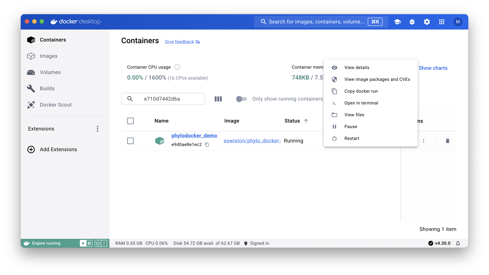



Docker is a way to share pre-built, pre-configured, and platform-independent sets of programs and files. The PhyloDocker image described below comes pre-configured with RevBayes, the TensorPhylo library, and other useful software.

As a user, you download and a build a Docker image. Once built, you can create a Docker container from that image. Each Docker image lives on your computer and uses its resources for work. In this way, you can think of Docker as a program that runs a miniature "virtual" computer through your actual computer. A container built from PhyloDocker can be used to run RevBayes, just like you would through the terminal, but without needing to install and configure RevBayes yourself.

On the development side, a **Dockerfile** (a list of commands for building and configuring programs/files) is used to build an **image**, which can then be shared with others. On the user side, the image can be downloaded and run to create a **container**. Inside the container, you have access to all of the programs contained in the image, as well as any files you **mount** to the container when you run the image. It works a bit like a virtual machine, except it runs on top of the host operating system. A Docker image containing RevBayes, TensorPhylo, Python, R, Julia, and several other programs can be found on [Docker Hub](https://hub.docker.com/r/sswiston/phylo_docker).

This tutorial explains how to install Docker on your computer, how to obtain a RevBayes Docker image, and how to use the image to run scripts on your computer or a computing cluster. This will require a basic familiarity with command line (navigating directories and entering basic commands), but does not require much programming.



This tutorial includes a test script called `test.Rev` so that you can assess whether the RevBayes Docker container is functioning properly after being installed. The test script can be found in the `Data files and scripts` box in the left sidebar of the tutorial page. Somewhere on your computer, you should create a directory (folder) for this tutorial, download the test script, and put the test script inside the directory. You can put this directory anywhere you want on your computer, but you will need to know the filepath to the directory in order to access it from the Docker container.

Create and run a new Docker container, and start with an interactive shell session:

```
~ $ ### from terminal on my Mac laptop (host)
~ $ # create and run new Docker container
~ $ docker run --name phylodocker_demo \
               --volume /Users/mlandis/projects/docker_test:/docker_test \
               -it sswiston/phylo_docker:slim_amd64 \
               /bin/sh
```

You should now be at the shell prompt within the Docker container! Try running the test script that is bundled with PhyloDocker.

```
~ # ### from terminal inside Docker container
~ # cd docker_test/
/docker_test # ls
test.Rev
/docker_test # rb test.Rev

RevBayes version (1.2.2)
Build from remotes/origin/stochmap_tp_dirty_merge (rapture-2396-g55c817) on Mon May 20 16:11:27 UTC 2024

Visit the website www.RevBayes.com for more information about RevBayes.

RevBayes is free software released under the GPL license, version 3. Type 'license()' for details.

To quit RevBayes type 'quit()' or 'q()'.


> source("test.Rev")
   Processing file "test.Rev"
Congrats! RevBayes is working!

/docker_test # ### new file in container will be visible to laptop
/docker_test # touch new_file.txt
/docker_test # ls
new_file.txt  test.Rev
/docker_test # exit
```

You have closed the Docker session and returned to your computer (the host machine). Make sure the file is there. After that, find your old Docker container, resume the session, tell the world hello, then exit when done:

```
~ $ ### from terminal on laptop (host)
~ $ # show new files are present
~ $ ls /Users/mlandis/projects/docker_test
new_file.txt  test.Rev

~ $ # show active Docker containers
~ docker ps -a
CONTAINER ID   IMAGE                              COMMAND     CREATED          STATUS                     PORTS     NAMES
fb19b94184ac   sswiston/phylo_docker:slim_amd64   "/bin/sh"   5 minutes ago    Exited (0) 4 minutes ago             phylodocker_demo

~ $ # resume active Docker container using start
~ $ docker start -ai phylodocker_demo

  --> Enters the Docker container <--

~ # ### back in the Docker container
~ # echo Hello, world!
Hello, world!
~ # exit
```

Delete your Docker container when it's done. Note, files saved to the mounted directory `/docker_test` also exist on your host computer's filesystem, so they will not be deleted:

```
~ $ ### back on my laptop again (host)
~ $ # remove old Docker container once done with it
~ $ docker rm phylodocker_demo
phylodocker_demo
~ $ # files continue to exist
~ $ ls /Users/mlandis/projects/docker_test
new_file.txt  test.Rev
```


Docker supports a large number of commands to manage images and containers (see [Docker CLI Documentation](https://docs.docker.com/reference/cli/docker/)). These six commands will cover the needs for most RevBayes users:

|---------|--------------------------------------------------------------------|
| command | description                                                        |
|---------|--------------------------------------------------------------------|
|`docker ps -a`                                   | lists all containers and their statuses |
|`docker run --name <my_container>  [ ... ]`      | creates a container from the image and sets container to active; see above |
|`docker start -ai <container_name>`              | sets a container to active |
|`docker exec -it <container_name> /bin/sh`       | executes command (shell, in this case) on an active container |
|`docker stop <container_name>`                   | sets a container to inactive |
|`docker rm <container_name>`                     | deletes an inactive container (be sure all saved work has been transferred to the mounted directory!) |
|---------|--------------------------------------------------------------------|





On [Docker Hub](https://hub.docker.com/), there are many Docker images available that contain a wide variety of programs. To use these images (including the RevBayes image), you will need to create an account. Docker Hub is free to join.



In order to use Docker on your computer, you will have to download and install [Docker Desktop](https://www.docker.com/products/docker-desktop/). The desktop app allows your computer to run Docker images, and also provides a GUI for interacting with images and containers. Whenever you want to use a Docker image, you will need to start the Docker daemon first, and opening Docker Desktop is the simplest way to do this (although there are a few [other ways](https://docs.docker.com/config/daemon/start/) to start the Docker daemon). Docker has versions for Mac, Windows, and Linux. The RevBayes Docker image should work on any of these platforms.




Example view of containers in Docker Desktop.



This is a reference to 



A Docker image containing RevBayes, TensorPhylo, Python, R, and other dependencies can be found at [hub.docker.com/r/sswiston/phylo_docker](https://hub.docker.com/r/sswiston/phylo_docker). The easiest way to obtain this image is with a `docker pull` command.

First, open Docker Desktop. This starts the Docker daemon so that you can run `docker` commands. If you do not open Docker Desktop first, you will receive an error when you try to run a `docker` command. Then, in the desktop app, sign into your Docker Hub account.

Next, you will need to pull a `phylo_docker` image with a tag that matches your computer's hardware architecture. The two tagged versions currently supported are `phylo_docker:slim_amd64` and `phylo_docker:slim_arm64`. Consult the table below if you are unsure which tagged image to use.


| OS               | CPU | Manufacture date | Tagged image |
|------------------|-----|------------------|--------------|
| Windows or Linux | Intel or AMD | -- | `phylo_docker:slim_amd64` |
| Mac OS X | Intel | 2019 or earlier |  `phylo_docker:slim_amd64` |
| Mac OS X | Silicon M1, M2, etc. | after 2019 | `phylo_docker:slim_arm64` |


Next, open your command line and enter the appropriate pull command:

```
# For Intel/AMD computers
docker pull sswiston/phylo_docker:slim_amd64

# For Apple Silicon (M1, M2, etc.) computers
docker pull sswiston/phylo_docker:slim_arm64
```

Docker will automatically store the image on your computer in a directory reserved for Docker images. You will not have to manually locate this image; Docker will be able to find it.



Your Windows operating system uses Docker to run a PhyloDocker container. The container itself runs a virtual computing environment using the Linux operating system, Alpine.

- If you are not familiar with Linux, find a short list of important commands here: [link](https://mally.stanford.edu/~sr/computing/basic-unix.html).
- Docker expects Unix-style directory names, even if you are running Windows.  Converting from Windows to Unix-style directories is easy. The Windows-style directory path `C:\\Users\charles_darwin\my_project` becomes the Unix-style directory path `/c/Users/mlandis/charles_darwin/my_project`. Use Unix-style directory paths when mounting directories from your computer (the host) on a new container (see below).






You can also run the RevBayes Docker image directly from command line. This will still require opening Docker Desktop to start the Docker daemon.

1. Open Docker Desktop. You cannot run a Docker container from the command line unless the daemon is running. If you are not already signed in to your Docker Hub account, sign in now (there will be an option in the upper right corner of screen).

2. Open command prompt.

3. Run the command for opening the RevBayes Docker image:

    ```
    # For Intel/AMD computers
    docker run --name [my_container] --volume [local_directory]:[container_directory] -it sswiston/phylo_docker:slim_amd64 /bin/sh
   
    # For Apple Silicon (M1, M2, etc.) computers
    docker run --name [my_container] --volume [local_directory]:[container_directory] -it sswiston/phylo_docker:slim_arm64 /bin/sh
    ```

    Some parts of this command are directly analogous to the optional settings from the RevBayes GUI. 

    - `--name` adds a name to your container. This is not strictly necessary, but it's very helpful if you plan to have multiple containers opened at a time. Otherwise, Docker will give the container a randomized name.

    - `--volume [local_directory]:` is how you tell Docker where to find your scripts on the host machine (your computer). To run the test script for this tutorial, you will have to tell Docker what directory to look in. You will need to use the absolute filepath to the directory. For example, if I put the test script in a directory called `docker_tutorial` on my desktop, I would put the filepath `/Users/Sarah/Desktop/docker_tutorial`. You can mount multiple directories from your host machine by adding multiple `--volume` arguments.

    - `[container_directory]` is how you will access your files while inside the Docker container. Mounting a directory in this way essentially creates a "connection" between the directory on the outside of the container (on your host machine) and inside the container. While inside the container, you will be able to see all of the contents of a mounted directory, including other sub-directories. For example, if you run RevBayes and want it to read a file from your host machine, you will use this filepath while inside the container. If you want to save files to your host machine from inside the Docker container, you will also use this filepath. There isn't a specific place inside the Docker container where you have to mount the directory, and it doesn't have to have the same name as the directory on your host machine. For example, you could call it `/tutorial`, which would put a directory called `tutorial` in the container's home directory with your test script in it.

    - `-it` is for opening an interactive container. Docker containers can also be used to automatically run scripts and terminate when they are completed, but you will need an interactive container for this tutorial.

    - `sswiston/phylo_docker:slim_amd64` or `sswiston/phylo_docker:slim_arm64` (hardware-dependent, see above) is the name of the Docker image you want to use.

    - `/bin/sh` tells the Docker container to open a new terminal (shell) session when it starts.

    Congrats, you are inside the Docker container! You should be able to access all of the programs and files in the container, and also the directory you mounted from your host machine.

4. Navigate to the location of your test script with `cd [filepath]`, using the filepath that you mounted your directory to in Step 3.

5. Now you can use RevBayes to run the test script with the command `rb test.Rev`. This should open RevBayes and run the script, which will give a message indicating that it has been run correctly:

```
   Processing file "test.Rev"
   Congrats! RevBayes is working!
```
{:.Rev-output}




> ## Docker Desktop behaves differently across versions 
> Some versions of Docker Desktop provide full support to run and interact with containers through the GUI. Unfortunately, its functionality changes across versions. To interact with a container through Docker Desktop v4.30.0 (current version as of writing this tutorial) you must first launch an interactive container using the commands above. Afterwards, you can interact with the running container through Docker Desktop. Previous versions of Docker Desktop allowed interactive sessions to be created from scratch, so this functionality will probably be restored in the future.
{:.info}

You can use the Docker Desktop GUI to run the RevBayes Docker image (but see caveats in info box above). Once you have run the image, you will be able to use RevBayes inside the Docker container, and run scripts. Here are the steps you will need to get RevBayes running:

1. Open Docker Desktop. If you are not already signed in to your Docker Hub account, sign in now (there will be an option in the upper right corner of screen).

2. There will be a tab on the lefthand side called `images`. In this tab, you will see all of the images you have downloaded.

3. Hovering over an image should give a `run` option. Click this option.

4. This should bring you to a screen with a dropdown menu called `optional settings`. You will want to click on this menu and change a few settings.

5. *Add a name to your container.* This is not strictly necessary, but it's very helpful if you plan to have multiple containers opened at a time. Otherwise, Docker will give the container a randomized name.

6. *Enter a host path.* This is how you tell Docker where to find your scripts on the host machine (your computer). To run the test script for this tutorial, you will have to tell Docker what directory to look in. You will need to use the absolute filepath to the directory. You can manually enter the filepath to this directory, or you can navigate to it using the `...` button. For example, if I put the test script in a directory called `docker_tutorial` on my desktop, I would put the filepath `/Users/Sarah/Desktop/docker_tutorial`. You can mount multiple directories from your host machine using the `+` button.

7. *Enter a container path.* This is how you will access your files while inside the Docker container. Mounting a directory in this way essentially creates a "connection" between the directory on the outside of the container (on your host machine) and inside the container. While inside the container, you will be able to see all of the contents of a mounted directory, including other sub-directories. For example, if you run RevBayes and want it to read a file from your host machine, you will use this filepath while inside the container. If you want to save files to your host machine from inside the Docker container, you will also use this filepath. There isn't a specific place inside the Docker container where you have to mount the directory, and it doesn't have to have the same name as the directory on your host machine. For example, you could call it `/tutorial`, which would put a directory called `tutorial` in the container's home directory with your test script in it.

8. Click the `run` option.

9. Another tab on the lefthand side of the screen should be called `containers`. Clicking this option should bring you to a screen showing all of the containers you currently have running.

10. There are two ways to access the container as it is running. The first way is to click on the running container inside the Containers panel, and then click on the `Exec` tab from the list of tabs at the top of the container menu. The second way is to find the running container inside the Containers panel, and then click on the icon with three vertical dots to the right of the container name. This will open a menu of options. Click on the "Open in terminal" menu item. Clicking this option will take you to the `Exec` tab, as in the first option. Within the `Exec` tab, there is a blue link that says *"Open in external terminal"*, which allows you to use your own terminal program to control the Docker session. Congrats, you are inside the Docker container! You should be able to access all of the programs and files in the container, and also the directory you mounted from your host machine.

11. Navigate to the location of your test script with `cd [filepath]`, using the filepath that you mounted your directory to in Step 7.

12. Now you can use RevBayes to run the test script with the command `rb test.Rev`. This should open RevBayes and run the script, which will give a message indicating that it has been run correctly:

```
   Processing file "test.Rev"
   Congrats! RevBayes is working!
```
{:.Rev-output}



Some high-performance computing clusters allow (or require) users to implement Docker images. For the most part, using a Docker image on a computing cluster is like using the image via command line on your own machine. You can mount directories, start a container, and use the programs inside to run scripts. However, there can be some additional considerations, depending on how the particular cluster is organized.



Washington University in Saint Louis Research Infrastructure Services (WUSTL RIS) has a scientific compute platform that requires Docker to run jobs. Each job opens a separate Docker container. Interactive jobs allow users to access an interactive container where they can enter commands, start programs, and run scripts. Non-interactive jobs open a non-interactive container that automatically runs certain scripts, and then both the container and job terminate. In this example, we will show a non-interactive job.

WUSTL RIS uses `bsub` commands to submit jobs. These commands can be written in one line, but they often have many arguments, so it can be helpful to put together a Bash script that constructs the `bsub` command. Here is an example:

```
LSF_DOCKER_VOLUMES="[Storage Directory]:/project"
PROJECTDIR="/project/"
NAME="MY_JOB"
OUTDIR="/project/joblogs/"

bsub \
-G [Compute Group] \
-q general \
-n 5 -M 20GB -R "rusage [mem=20GB] span[hosts=1]" \
-cwd $PROJECTDIR \
-J $NAME \
-o $OUTDIR$NAME.stdout.txt \
-a 'docker(sswiston/phylo_docker:slim_amd64)' /bin/bash /project/rev_shell.sh
```

Let's pick apart the elements of this script. There is a section at the top for defining variables, and then a `bsub` command using those variables.

- `LSF_DOCKER_VOLUMES` is how you mount a directory to the Docker container for the job. This variable will not be part of the `bsub` command itself, but when a new job is starting, it will look for this information. It has two parts.

    - `[Storage Directory]:` is how you tell Docker where to find your scripts in the cluster's storage.

    - `/project` is where the directory will be mounted inside the Docker container (in this example). There isn't a specific place inside the Docker container where you have to mount the directory, and it doesn't have to have the same name as the directory in the cluster's storage. Mounting a directory in this way essentially creates a "connection" between the directory on the outside of the container (in the cluster's storage) and inside the container. While inside the container, your scripts will be able to see all of the contents of a mounted directory, including other sub-directories.

- `PROJECDIR`, `OUTDIR`, and `NAME` are variables that are used in the `bsub` command to specify the project directory, output directory, and job name.

After defining important variables, there is a multi-line `bsub` command that actually submits the job. It has several arguments:

- `-G` is the compute group (usually belonging to the lab PI) that the job belongs to.

- `-q` is the queue that the job will join. The `general` queue is non-interactive.

- `-n`, `-M`, and `-R` specify the amount of memory that the job will use.

- `-cwd` sets the working directory inside the Docker container. In this example, note that we use the project directory that we mounted. This is useful because, when the job runs, it will look in this directory for scripts.

- `-J` gives the job a name. This is not strictly necessary, but it is helpful for keeping track of running jobs.

- `-o` creates an output file for the job. Your scripts may save certain products to other files, but this file will record the standard output, including possible job failures.

- `-a` is the most important part of the `bsub` command. There are 3 parts.

   - `'docker(sswiston/phylo_docker:slim_amd64)'` is the Docker image being used. The image will be pulled from Docker Hub.

   - `/bin/bash` is the initial command that will run once the container is open.

   - `/project/rev_shell.sh` is the script that will run with the `/bin/bash` command.

You may wonder why we don't immediately call RevBayes and run a `.Rev` script. This is possible to do. However, the WUSTL RIS cluster overwrites the `PATH` variable inside the Docker container, which means that RevBayes can't be found with a simple `rb` command. Instead, you would have to specify the full filepath to the RevBayes binary inside the container, which is `/revbayes/projects/installer/rb`. You may also want to add extra information to the `rb` command (like defining variables for your analyses). It can be easier to use a shell script to call RevBayes while inside the container. Here is an example:

```
PATH=$PATH:/revbayes/projects/installer:/revbayes/projects/installer/rb

rb_command="variable_1="test";source(\"/project/rev_script.Rev\");"
echo $rb_command | rb
```

In this short script, RevBayes is added to the `PATH` variable inside the container. Then a RevBayes command is constructed. It has two parts: setting `variable_1` to have a value of `test`, and sourcing the script `rev_script.Rev`. The final line pipes this command into RevBayes, which sets `variable_1` equal to `test` and runs `rev_script.Rev`.

This example highlights two main differences between using the RevBayes Docker image on your local machine and using it on the WUSTL RIS computing cluster. First, the analyses must be submitted as jobs (common amongst computing clusters). Second, the job submission process overwrites the `PATH` variable inside the Docker container, so you will have to know where to find the programs you want to use. Other computing clusters may have similar challenges. Before running lengthy jobs or batches of jobs, it is recommended that you try out a test job or two and make sure they work as expected. Generally, the Docker image will function the same on any platform, and all of the programs should run correctly with appropriate input scripts.
