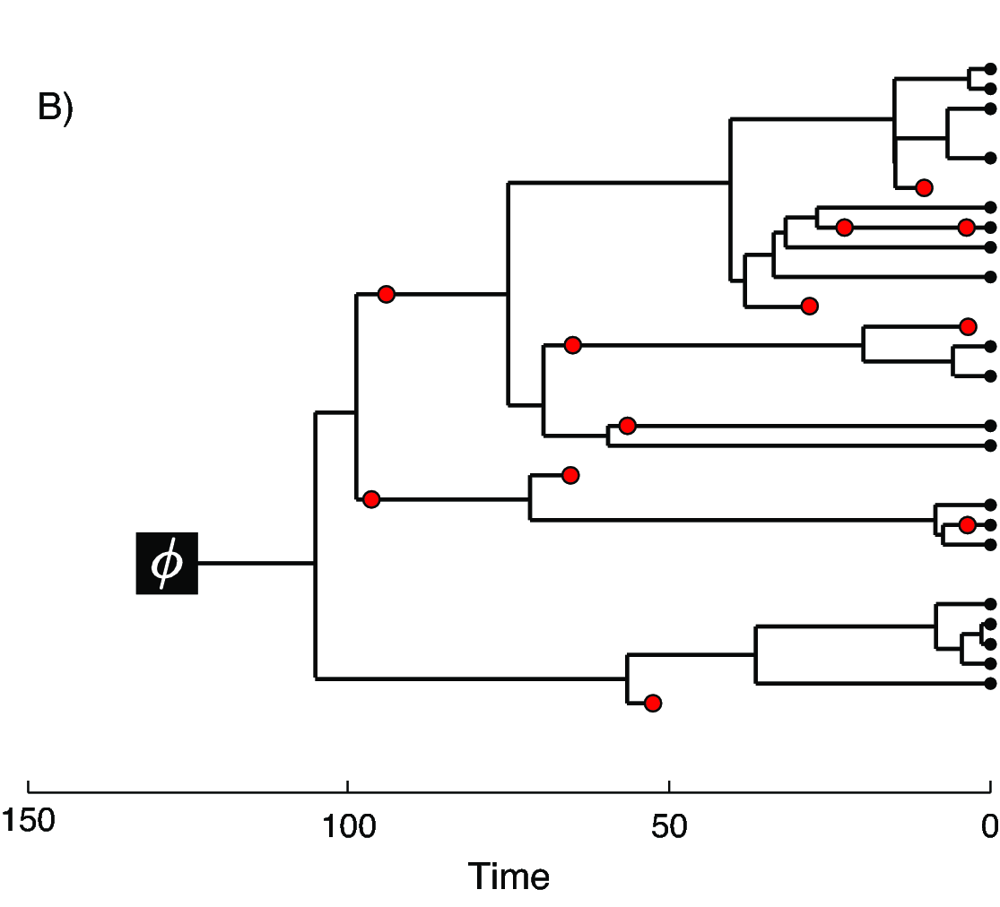
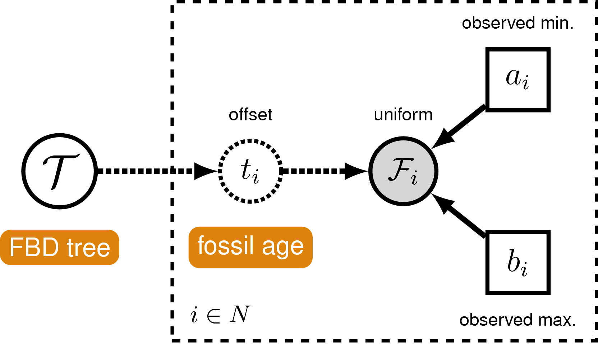
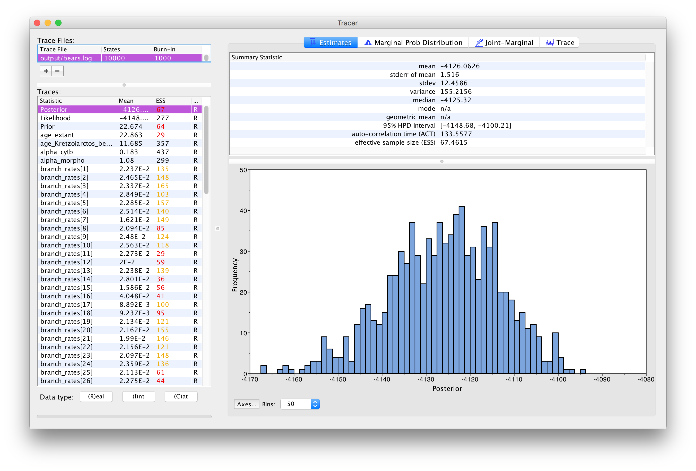
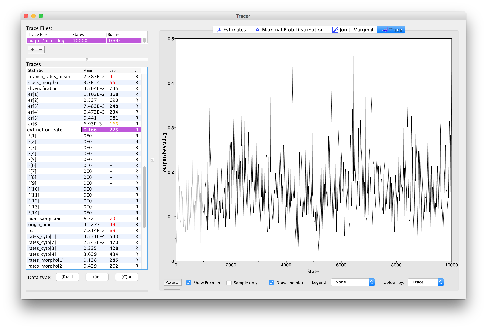
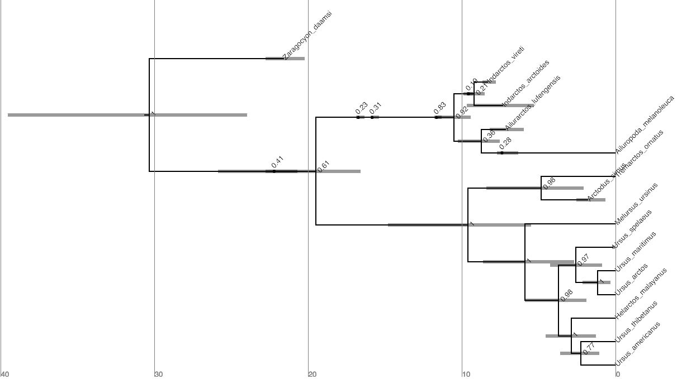
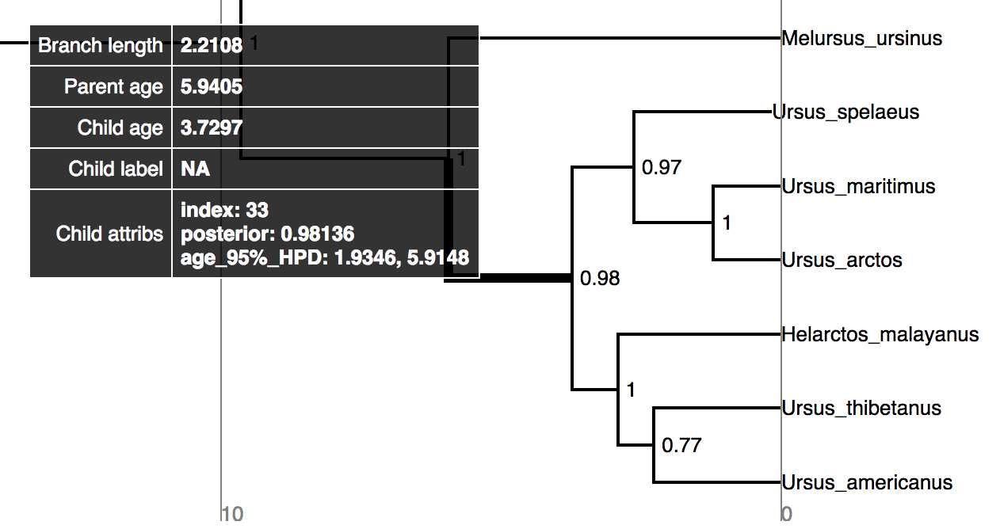



This tutorial demonstrates how to specify the models used in a Bayesian
"combined-evidence" phylogenetic analysis of extant and fossil species,
combining morphological and molecular data as well as fossil occurrence 
data from the fossil record [*e.g.,* 
]. 
We begin with a concise
 to the models used in this analysis, 
followed by a detailed example analysis in
 demonstrating how to apply these models in
RevBayes  and use Markov chain Monte Carlo (MCMC) to
estimate the posterior distribution of dated phylogenies for data
collected from living and fossil bears (family Ursidae). 



The "combined-evidence" analysis described in this tutorial uses a
probabilistic graphical model  integrating three separate
likelihood components or data partitions (): one
for molecular data (), one for
morphological data (), and one for
fossil stratigraphic range data ().
In addition, all likelihood components are conditioned on a tree
topology with divergence times which is modeled according to a separate
prior component ().


 
 
Modular components of the graphical model used in the "combined-evidence" 
analysis described in this tutorial.



In  we provide an example of the type of tree
estimated from a total-evidence analysis. This example shows the
complete tree (A) and the sampled or
reconstructed tree (B). Importantly, we are
interested in estimating the topology, divergence times and fossil
sample times of the *reconstructed tree* (B).
We will describe the distinction between these two trees in .


 
 
 
One possible
realization of the fossilized birth-death (described in section
) process starting at origin time $\phi$, showing
fossil sampling events (red circles), and 15 sampled extant taxa (black
circles). (A) The complete tree shows all lineages both sampled (solid
lines) and unsampled (dotted lines). (B) The reconstructed tree (also
called the sampled tree) shows only the sampled lineages





The joint prior distribution on tree topologies and divergence times of
living and extinct species used in this tutorial is described by the
*fossilized birth-death* (FBD) process . This
model simply treats the fossil observations as part of the process
governing the tree topology and branch times (the node in
). The fossilized birth-death process provides a
model for the distribution of speciation times, tree topology, and
lineage samples before the present
(*e.g.*, non-contemporaneous samples like
fossils or viruses). This type of tree is shown in . 
Importantly, this model can be used *with or
without* character data for the historical samples. Thus, it provides a
reasonable prior distribution for analyses combining morphological or
DNA data for both extant and fossil
taxa—*i.e.* the so-called "total-evidence"
approaches described by  and extended by  and
. When matrices of discrete morphological characters
for both living and fossil species are unavailable, the fossilized
birth-death model imposes a time structure on the tree by
[*marginalizing*](https://en.wikipedia.org/wiki/Marginal_distribution)
over all possible attachment points for the fossils on the extant tree
, therefore, some prior knowledge of phylogenetic
relationships is important.

The FBD model () describes the probability of the
tree and fossils conditional on the birth-death parameters:
$f[\mathcal{T} \mid \lambda, \mu, \rho, \psi, \phi]$, where
$\mathcal{T}$ denotes the tree topology, divergence times fossil
occurrence times and the times at which the fossils attach to the tree.
The birth-death parameters $\lambda$ and $\mu$ denote the speciation and
extinction rates, respectively. The "fossilization rate" or "fossil
recovery rate" is denoted $\psi$ and describes the rate at which fossils
are sampled along lineages of the complete tree. The sampling
probability parameter $\rho$ represents the *probability* that an extant
species is sampled, and $\phi$ represents the time at which the process
originated.


 
 
A graphical model of the fossilized
birth-death model describing the generation of the time tree (in
) used in this tutorial. The parameters of the
fossilized birth-death process are labeled in orange. The speciation,
extinction and fossilization rates are stochastic nodes (circles) drawn
from exponential distributions, while the origin time is uniformly
distributed. The sampling probability is constant node (square) and
equal to one. The represents the phylogenetic continuous-time Markov
chain that links the tree model to the other model components and the
observed sequence data.For more information on probabilistic graphical
models and their notation, please see .



In the example FBD tree shown in , the
diversification process originates at time $\phi$, giving rise to $n=20$
species in the present, with both sampled fossils (red circles) and
extant species (black circles). All of the lineages represented in A (both solid and dotted lines) show the
*complete tree*. This is the tree of all extant *and* extinct lineages
generated by the process. The complete tree is distinct from the
*reconstructed tree* (B) which is the tree
representing only the lineages sampled as extant taxa or fossils. Fossil
observations (red circles in ) are recovered
over the lifetime of the process along the lineages of the complete
tree. If a lineage does not have any descendants sampled in the present,
it is lost and cannot be observed, these are the dotted lines in 
A. The probability must be conditioned on the origin
time of the process $\phi$. The origin ($\phi$) of a birth-death process
is the starting time of the *stem* lineage, thus this conditions on a
single lineage giving rise to the tree.

An important characteristic of the FBD model is that it accounts for the
probability of sampled ancestor-descendant pairs . Given
that fossils are sampled from lineages in the diversification process,
the probability of sampling fossils that are ancestors to taxa sampled
at a later date is correlated with the turnover rate ($r=\mu/\lambda$)
and the fossil recovery rate ($\psi$). This feature is important,
particularly for datasets with many sampled fossils. In the example
(), several of the fossils have sampled
descendants. These fossils have solid black lines leading to the
present.



In order to account for uncertainty in the ages of our fossil species,
we can incorporate intervals on the ages of our represented fossil
species. These intervals can be stratigraphic ranges or measurement
standard error. We do this by assuming each fossil can occur with
uniform probability anywhere within its observed interval. This is
somewhat different from the typical approach to node calibration. Here,
instead of treating the calibration density as an additional prior
distribution on the tree, we treat it as the *likelihood* of our fossil
data given the tree parameter. Specifically, we assume the likelihood of
a particular fossil observation $\mathcal{F}_i$ is equal to one if the
fossil’s inferred age on the tree $t_i$ falls within its observed time
interval $(a_i,b_i)$, and zero otherwise:

$$f[\mathcal{F}_i \mid a_i, b_i, t_i] = \begin{cases}
1 & \text{if } a_i < t_i < b_i\\
0 & \text{otherwise}
\end{cases}$$

In other words, we assume the likelihood is equal to one
if the inferred age is consistent with the data observed. We can
represent this likelihood in RevBayes using a distribution that is
proportional to the likelihood,
*i.e.* non-zero when the likelihood is equal
to one (). This model component represents
the observed in the modular graphical model shown in .


 
 
A graphical model of the
fossil age likelihood model used in this tutorial. The likelihood of
fossil observation $\mathcal{F}_i$ is uniform and non-zero when the
inferred fossil age $t_i$ falls within the observed time interval
$(a_i,b_i)$.



It is worth noting that this is not necessarily the appropriate way to
model fossil data that are actually observed as stratigraphic ranges. In
paleontology, a stratigraphic range represents the interval of time
between the first and last appearances of a fossilized species. Thus,
this range typically represents multiple fossil specimens observed at
different times along a single lineage. An extension of the fossilized
birth-death process that is a distribution on stratigraphic ranges has
been described by . 
This model is fully implemented in RevBayes as the "fossilized birth-death *range* process". 
For a detailed description of analysis under this model, please see the tutorial on .







In this exercise, we will combine different types of data from 22
species of extant and extinct bears to estimate a posterior distribution
of calibrated time trees for this group. We have molecular sequence data
for ten species, which represent all of the eight living bears and two
extinct species sequenced from sub-fossil specimens (*Arctodus simus,
Ursus spelaeus*). The sequence alignment provided is a 1,000 bp fragment
of the cytochrome-b mitochondrial gene . The morphological
character matrix unites 18 taxa (both fossil and extant) with 62 binary
(states 0 or 1) characters . For the fossil species,
occurrence times are obtained from the literature or fossil databases
like the [Paleobiology Database](https://paleobiodb.org/) or from your own
paleontological expertise. The 14 fossil species used in this analysis
are listed in  along with the age range for the
species and relevant citation. Finally, there are two fossil species
(*Parictis montanus, Ursus abstrusus*) for which we do not have
morphological character data (or molecular data) and we must use prior
information about their phylogenetic relationships to incorporate these
taxa in our analysis. This information will be applied using clade
constraints.



Age ranges of fossil bears.


 |     **Fossil Species**     |    **Age**     |        **Reference**       |
  --------------------------- |:--------------:|:--------------------------:|
 |    *Parictis montanus*     |    33.9–37.2   |      |
 |    *Zaragocyon daamsi*     |      20–22.8   |     |
 |    *Ballusia elmensis*     |    13.7–16     |     |
 |    *Ursavus primaevus*     |   13.65–15.97  |      |
 |    *Ursavus brevihinus*    |   15.97–16.9   |     |
 |    *Indarctos vireti*      |    7.75–8.7    |      |
 |    *Indarctos arctoides*   |     8.7–9.7    |      |
 |  *Indarctos punjabiensis*  |     4.9–9.7    |  |
 | *Ailurarctos lufengensis*  |     5.8–8.2    |          |
 |      *Agriarctos spp.*     |     4.9–7.75   |       |
 |  *Kretzoiarctos beatrix*   |    11.2–11.8   |       |
 |       *Arctodus simus*     |   0.012–2.588  |   |
 |      *Ursus abstrusus*     |     1.8–5.3    |      |
 |      *Ursus spelaeus*      |   0.027–0.25   |   |
 




>On your own computer or your remote machine, create a directory called `RB_CombinedEvidence_Tutorial`
>(or any name you like).
>
>Then, navigate to the folder you created and make a new one called `data`.
>
>Download the files listed below into the `data` folder. 
>Click on the hyperlinked file names below (these files are also listed in the "Data files and scripts" box at the top of this page).
{:.instruction}

In the `data` folder, add the following files:

-   [`bears_taxa.tsv`](data/bears_taxa.tsv): a tab-separated table listing every bear species
    (both fossil and extant) and their occurrence age ranges. For extant
    taxa, the minimum age is 0.0
    (*i.e.* the present).

-   [`bears_cytb.nex`](data/bears_cytb.nex): an alignment in NEXUS format of 1,000 bp of
    cytochrome b sequences for 10 bear species. This alignment includes
    8 living bears and 2 extinct sub-fossil bears.

-   [`bears_morphology.nex`](data/bears_morphology.nex): a matrix of 62 discrete, binary (coded `0`
    or `1`) morphological characters for 18 species of fossil and
    extant bears.



>Create a new directory called `scripts`. 
{:.instruction}

When you execute RevBayes in this exercise, you will do so within the
main directory you created (*i.e.*, `RB_CombinedEvidence_Tutorial`). 
Thus, if you are using a Unix-based operating system, we recommend that
you add the RevBayes binary to your path.









For complex models and analyses, it is best to create Rev script files
that will contain all of the model parameters, moves, and functions. In
this exercise, you will work primarily in your text editor and
create a set of modular files that will be easily managed and
interchanged. You will write the following files from scratch and save
them in the `scripts` directory:

-   `{{ mcmc_script }}`: the master Rev file that loads the data, the
    separate model file and specifies the monitors and MCMC sampler.

-   `{{ fbdp_script }}`: specifies the model parameters and moves
    required for the fossilized birth-death prior on the tree topology,
    divergence times fossil occurrence times and
    diversification dynamics.

-   `{{ uexp_script }}`: specifies the components of the
    uncorrelated exponential model of lineage-specific substitution
    rate variation.

-   `{{ gtrg_script }}`: specifies the parameters and moves for the
    general time-reversible model of sequence evolution with
    gamma-distributed rates across sites (GTR+$\Gamma$).

-   `{{ morph_script }}`: specifies the model describing discrete
    morphological character change (binary characters) under a strict
    morphological clock.

All of the files that you will create are also provided in the
RevBayes tutorial at the top of the page to download. 
Please refer to these files to
verify or troubleshoot your own scripts.



In this section you will begin the master file that you will load into
RevBayes when you’ve completed all of the components of the analysis.

> Open your text editor and create the master Rev
> file called `{{ mcmc_script }}` in the `scripts` directory.
>
> Enter the Rev code provided in this section in the new model file.
{:.instruction}

The file you will begin in this section will be the one you load into
RevBayes when you’ve completed all of the components of the analysis.
In this section you will begin the file and write the Rev commands for
loading in the taxon list and managing the data matrices. Then, starting
in section , you will move on to writing
module files for each of the model components. Once the model files are
complete, you will return to editing `mcmc_CEFBDP_Specimens.Rev` and complete the
Rev script with the instructions given in section, 
you will move on to writing the .



Begin the Rev script by loading in the list of taxon names from the
`bears_taxa.tsv` file using the `readTaxonData` function.

{{ mcmc_script | snippet:"block#","1" }}

This function reads a tab-delimited file and creates a variable called
`taxa` that is a list of all of the taxon names relevant to this
analysis. This list includes all of the fossil and extant bear species
names in the first columns and a single age value in the second column.
The ages provided are either 0.0 for extant species or the average of
the age range for fossil species (see ).



RevBayes uses the function `readDiscreteCharacterData` to load a
data matrix to the workspace from a formatted file. This function can be
used for both molecular sequences and discrete morphological characters.

Load the cytochrome-b sequences from file and assign the data matrix to
a variable called `cytb`.

{{ mcmc_script | snippet:"block#","2" }}

Next, import the morphological character matrix and assign it to the
variable `morpho`.

{{ mcmc_script | snippet:"block#","3" }}



In the descriptions of the files in section
, we mentioned that the two data matrices
have different numbers of taxa. Thus, we must add any taxa that are not
found in the molecular (`cytb`) partition
(*i.e.* are only found in the fossil data) to
that data matrix as missing data (with `?` in place of all characters),
and do the same with the morphological data partition (`morpho`). In
order for all the taxa to appear on the same tree, they all need to be
part of the same dataset, as opposed to present in separate datasets.
This ensures that there is a unified taxon set that contains all of our
tips.

{{ mcmc_script | snippet:"block#","4" }}



Before we begin writing the Rev scripts for each of the model
components, we need to instantiate a couple "helper variables" that will
be used by downstream parts of our model specification files. These
variables will be used in more than one of the module files so it’s best
to initialize them in the master file.

Create a new constant node called `n_taxa` that is equal to the number
of species in our analysis (22).

{{ mcmc_script | snippet:"block#","5" }}

Next, create a workspace variable called `moves`. This variable is a vector that will contain all of the MCMC moves used
to propose new states for every stochastic node in the model graph. Each
time a new stochastic node is created in the model, we can append the move to this vector.

{{ mcmc_script | snippet:"block#","6" }}

One important distinction here is that `moves` is part of the RevBayes
workspace and not the hierarchical model. Thus, we use the workspace
assignment operator `=` instead of the constant node assignment `<-`.

>Save your current working version of `mcmc_CEFBDP_Specimens.Rev` in the `scripts`
directory.
{:.instruction}

We will now move on to the next Rev file and will complete
`mcmc_CEFBDP_Specimens.Rev` in section .



> Open your text editor and create the fossilized birth-death model file
> called `{{ fbdp_script }}` in the `scripts` directory.
>
>Enter the Rev code provided in this section in the new model file.
{:.instruction}

This file will define the models described in sections
 and  above. If
necessary, please review the graphical models depicted for the
fossilized birth-death process () and the likelihood
of the tip sampling process ().



Two key parameters of the FBD process are the speciation rate (the rate
at which lineages are added to the tree, denoted by $\lambda$ in
) and the extinction rate (the rate at which
lineages are removed from the tree, $\mu$ in ).
We’ll place exponential priors on both of these values. Each parameter
is assumed to be drawn independently from a different exponential
distribution with rates $\delta_{\lambda}$ and $\delta_{\mu}$
respectively (see ). Here, we will assume that
$\delta_{\lambda} = \delta_{\mu} = 10$. Note that an exponential
distribution with $\delta = 10$ has an expected value (mean) of $1/10$.

Create the exponentially distributed stochastic nodes for the
`speciation_rate` and `extinction_rate` using the `~` operator.

{{ fbdp_script | snippet:"block#","1" }}

For every stochastic node we declare, we must also specify proposal
algorithms (called *moves*) to sample the value of the parameter in
proportion to its posterior probability. If a move is not specified for
a stochastic node, then it will not be estimated, but fixed to its
initial value.

The rate parameters for extinction and speciation are both positive,
real numbers (*i.e.* non-negative floating
point variables). For both of these nodes, we will use a scaling move
(`mvScale`), which proposes multiplicative changes to a parameter.
Many moves also require us to set a *tuning value*, called `lambda` for
`mvScale`, which determine the size of the proposed change. Here, we
will use three scale moves for each parameter with different values of
lambda. By using multiple moves for a single parameter, we will improve
the mixing of the Markov chain.

{{ fbdp_script | snippet:"block#","2-3" }}

You will also notice that each move has a specified `weight`. This
option allows you to indicate how many times you would like a given move
to be performed at each MCMC cycle. The way that we will run our MCMC
for this tutorial will be to execute a *schedule* of moves at each step
in our chain instead of just one move per step, as is done in
MrBayes  or BEAST
. Here, if we were to run our MCMC with
our current vector of 6 moves, then our move schedule would perform 6
moves at each cycle. Within a cycle, an individual move is chosen from
the move list in proportion to its weight. Therefore, with all six moves
assigned `weight=1`, each has an equal probability of being executed and
will be performed on average one time per MCMC cycle. For more
information on moves and how they are performed in RevBayes, please
refer to the 

and 
tutorials.

In addition to the speciation ($\lambda$) and extinction ($\mu$) rates,
we may also be interested in inferring diversification ($\lambda - \mu$)
and turnover ($\mu/\lambda$). Since these parameters can be expressed as
a deterministic transformation of the speciation and extinction rates,
we can monitor (that is, track the values of these parameters, and print
them to a file) their values by creating two deterministic nodes using
the `:=` operator.

{{ fbdp_script | snippet:"block#","4" }}



All extant bears are represented in this dataset. Therefore, we will fix
the probability of sampling an extant lineage ($\rho$ in
) to 1. The parameter `rho` will be specified as a
constant node using the `<-` operator.

{{ fbdp_script | snippet:"block#","5" }}

Because $\rho$ is a constant node, we do not have to assign a move to
this parameter.



Since our data set includes serially sampled lineages, we must also
account for the rate of sampling back in time. This is the fossil
sampling (or recovery) rate ($\psi$ in ), which we
will instantiate as a stochastic node (named `psi`). As with the
speciation and extinction rates
(see ), we will use an
exponential prior on this parameter and use scale moves to sample values
from the posterior distribution.

{{ fbdp_script | snippet:"block#","6-7" }}



We will condition the FBD process on the origin time ($\phi$ in
) of bears, and we will specify a uniform
distribution on the origin age. For this parameter, we will use a
sliding window move (`mvSlide`). A sliding window samples a parameter
uniformly within an interval (defined by the half-width `delta`).
Sliding window moves can be tricky for small values, as the window may
overlap zero. However, for parameters such as the origin age, there is
little risk of this being an issue.

{{ fbdp_script | snippet:"block#","8-9" }}

Note that we specified a higher move `weight` for each of the proposals
operating on `origin_time` than we did for the three previous
stochastic nodes. This means that our move schedule will propose five
times as many updates to `origin_time` than it will to
`speciation_rate`, `extinction_rate`, or `psi`.



All the parameters of the FBD process have now been specified. The next
step is to use these parameters to define the FBD tree prior
distribution, which we will call `fbd_dist`.

{{ fbdp_script | snippet:"block#","10" }}



Note that we created the distribution as a workspace variable using the
workspace assignment operator `=`. This is because we still need to
include a topology constraint in our final specification of the tree
prior. Specifically, we do not have any morphological or molecular data
for the fossil species *Ursus abstrusus*. Therefore, in order to use the
age of this fossil as an observation, we need to specify to which clade
it belongs. In this case, *Ursus abstrusus* belongs to the subfamily
Ursinae, so we define a clade for the total group Ursinae including
*Ursus abstrusus*.

{{ fbdp_script | snippet:"block#","11" }}

Then we can specify the final constrained tree prior distribution by
creating a vector of constraints, and providing it along with the
workspace FBD distribution to the constrained topology distribution.
Here we use the stochastic assignment operator `~` to create a
stochastic node for our constrained FBD-tree variable (called
`fbd_tree`).

{{ fbdp_script | snippet:"block#","12" }}

It is important to recognize that we do not know if *Ursus abstrusus* is
a *crown* or *stem* Ursinae. Because of this, we defined this clade
constraint so that it constrained the *total group* Ursinae and this
uncertainty is taken into account. As a result, our MCMC will
marginalize over both stem and crown positions of *U. abstrusus* and
sample the phylogeny in proportion to its posterior probability,
conditional on our model and data.

Additionally, we do not have morphological data for the fossil species
*Parictis montanus*. However, we will not create a clade constraint for
this taxon because it is a very old, stem-fossil bear. Thus, the MCMC
may propose to place this taxon anywhere in the tree (except within the
clade constraint we made above). This allows us to account for the
maximum amount of uncertainty in the placement of *P. montanus*.



Next, in order to sample from the posterior distribution of trees, we
need to specify moves that propose changes to the topology (`mvFNPR`)
and node times (`mvNodeTimeSlideUniform`). Included with these moves is
a proposal that will collapse or expand a fossil branch
(`mvCollapseExpandFossilBranch`). This will change a fossil that is a
sampled ancestor (see  and
) so that it is on its own branch and vice
versa. In addition, when conditioning on the origin time, we also need
to explicitly sample the root age (`mvRootTimeSlideUniform`).

{{ fbdp_script | snippet:"block#","13-14" }}



Next, we need to account for uncertainty in the age estimates of our
fossils using the observed minimum and maximum stratigraphic ages.
To do this, we get all the fossils from the tree and use a `for` loop to iterate over them.
For each fossil observation, we create a
uniform random variable representing the likelihood. Remember, we can
represent the fossil likelihood using any uniform distribution that is
non-zero when the likelihood is equal to one
(see ).

For example, if $t_i$ is the inferred fossil age and $(a_i,b_i)$ is the
observed stratigraphic interval, we know the likelihood is equal to one
when $a_i < t_i < b_i$, or equivalently $t_i - b_i < 0 < t_i - a_i$. So
let’s represent the likelihood using a uniform random variable uniformly
distributed in $(t_i - b_i, t_i - a_i)$ and clamped at zero.

{{ fbdp_script | snippet:"block#","15-17" }}

Finally, we add a move that samples the ages of the fossil nodes on the
tree.

{{ fbdp_script | snippet:"block#","18" }}



There are additional parameters that may be of particular interest to us
that are not directly inferred as part of this graphical model. As with
the diversification and turnover nodes specified in
, we can create
deterministic nodes to sample the posterior distributions of these
parameters. Create a deterministic node called `num_samp_anc` that
will compute the number of sampled ancestors in our `fbd_tree`.

{{ fbdp_script | snippet:"block#","19" }}

We are also interested in the age of the most-recent-common ancestor
(MRCA) of all living bears. To monitor the age of this node in our MCMC
sample, we must use the `clade` function to identify the node.
Importantly, since we did not include this clade in our constraints that
defined `fbd_tree`, this clade will not be constrained to be
monophyletic. Once this clade is defined we can instantiate a
deterministic node called `age_extant` with the `tmrca` function that
will record the age of the MRCA of all living bears.

{{ fbdp_script | snippet:"block#","20" }}

In the same way we monitored the MRCA of the extant bears, we can also
monitor the age of a fossil taxon that we may be interested in
recording. We will monitor the marginal distribution of the age of
*Kretzoiarctos beatrix*, which is between 11.2–11.8 My.

{{ fbdp_script | snippet:"block#","21" }}

Finally, we will monitor the tree after removing taxa for which we did
not have any molecular or morphological data. The phylogenetic placement
of these taxa is based only on their occurrence times and any clade
constraints we applied (see ).
Because no data are available to resolve their relationships to other
lineages, we will treat their placement as [*nuisance
parameters*](https://en.wikipedia.org/wiki/Nuisance_parameter) and
remove them from the output.

We will remove two fossil taxa, *Parictis montanus* and *Ursus
abstrusus*, from every tree in the trace file before summarizing the
samples. Use the `fnPruneTree` function to create a deterministic tree
variable `pruned_tree` from which these taxa have been pruned. We will
monitor this tree instead of `fbd_tree`.

{{ fbdp_script | snippet:"block#","22" }}

>You have completed the FBD model file. Save `model_FBDP.Rev` in the `scripts` directory.
{:.instruction}

We will now move on to the next model file.









> Return to the master Rev file you created in section
>  called `{{ mcmc_script }}` in the `scripts` directory.
>
>Enter the Rev code provided in this section in this file.
{:.instruction}



RevBayes uses the `source` function to load commands from Rev
files into the workspace. Use this function to load in the model scripts
we have written in the text editor and saved in the `scripts` directory.

{{ mcmc_script | snippet:"block#","7-10" }}



We can now create our workspace model variable with our fully specified
model DAG. We will do this with the `model` function and provide a
single node in the graph (`sf`).

{{ mcmc_script | snippet:"block#","11" }}

The object `mymodel` is a wrapper around the entire model graph and
allows us to pass the model to various functions that are specific to
our MCMC analysis.



The next important step for our master Rev file is to specify the
monitors and output file names. For this, we create a vector called
`monitors` that will each sample and record or output our MCMC.

{{ mcmc_script | snippet:"block#","12" }}
	
The first monitor we will create will monitor every named random
variable in our model graph. This will include every stochastic and
deterministic node using the `mnModel` monitor. The only parameter that
is not included in the `mnModel` is the tree topology. Therefore, the
parameters in the file written by this monitor are all numerical
parameters written to a tab-separated text file that can be opened by
accessory programs for evaluating such parameters. We will also name the
output file for this monitor and indicate that we wish to sample our
MCMC every 10 cycles.

{{ mcmc_script | snippet:"block#","13" }}

The `mnFile` monitor writes any parameter we specify to file. Thus, if
we only cared about the speciation rate and nothing else (this is not a
typical or recommended attitude for an analysis this complex) we
wouldn’t use the `mnModel` monitor above and just use the `mnFile`
monitor to write a smaller and simpler output file. Since the tree
topology is not included in the `mnModel` monitor (because it is not
numerical), we will use `mnFile` to write the tree to file by specifying
our `pruned_tree` variable in the arguments. Remember, we are
monitoring the tree with nuisance taxa pruned out (see
).

{{ mcmc_script | snippet:"block#","14" }}

The last monitor we will add to our analysis will print information to
the screen. Like with `mnFile` we must tell `mnScreen` which parameters
we’d like to see updated on the screen. We will choose the age of the
MCRCA of living bears (`age_extant`), the number of sampled ancestors
(`num_samp_anc`), and the origin time (`origin_time`).

{{ mcmc_script | snippet:"block#","15" }}



Once we have set up our model, moves, and monitors, we can now create
the workspace variable that defines our MCMC run. We do this using the
`mcmc` function that simply takes the three main analysis components
as arguments.

{{ mcmc_script | snippet:"block#","16" }}

The MCMC object that we named `mymcmc` has a member method called
`run`. This will execute our analysis and we will set the chain
length to `10000` cycles using the `generations` option.

{{ mcmc_script | snippet:"block#","17" }}

Once our Markov chain has terminated, we will want RevBayes to close.
Tell the program to quit using the `q()` function.

{{ mcmc_script | snippet:"block#","18" }}

>You made it! Save all of your files.
{:.instruction}



With all the parameters specified and all analysis components in place,
you are now ready to run your analysis. The Rev scripts you just
created will all be used by RevBayes and loaded in the appropriate
order.

Begin by running the RevBayes executable. In Unix systems, type the
following in your terminal (if the RevBayes binary is in your path):

Provided that you started RevBayes from the correct directory, you can then use the
`source` function to feed RevBayes your master script file
(`mcmc_CEFBDP_Specimens.Rev`).

    source("scripts/mcmc_CEFBDP_Specimens.Rev")

This will execute the analysis and you should see the various parameters you included when you created `mnScreen` printed to the screen every 10 generations. 

When the analysis is complete, RevBayes will quit and you will have a
new directory called `output` that will contain all of the files you
specified with the monitors (see ).



In this section, we will evaluate the *mixing* and *convergence* of our
MCMC simulation using the program Tracer. We can also
summarize the marginal distributions for particular parameters we’re
interested in. [Tracer](http://tree.bio.ed.ac.uk/software/tracer/)
 is a tool for visualizing parameters sampled by MCMC.
This program is limited to numerical parameters, however, and cannot be
used to summarize or analyze MCMC samples of the tree topology (this
will be discussed further in ).

Open Tracer and import the `bears.log` file in the
***File > Import New Trace Files***. Or click the button on the
left-hand side of the screen to add your log file (see ).


 
 
The Tracer
window. To add data, click on the "+" sign, highlighted in red above



Immediately upon loading your file (see ),
you will see the list of **Trace Files** on the left-hand
side (you can load multiple files). The bottom left section, called
**Traces**, provides a list of every parameter in the log
file, along with the mean and the effective sample size (ESS) for the
posterior sample of that parameter. The ESS statistic provides a measure
of the number of independent draws in our sample for a given parameter.
This quantity will typically be much smaller than the number of
generations of the chain. In Tracer, poor to fair values
for the ESS will be colored red and yellow. You will likely see a lot of
red and yellow numbers because the MCMC runs in this exercise are too
short to effectively sample the posterior distributions of most
parameters. 
For most MCMC analyses, it is recommended to run the 
chain for much longer so that you get an adequate sample from the target distribution. 


 
  
The **Estimates** window in Tracer showing the
histogram of the **Posterior**



The inspection window for your selected parameter is the
**Estimates** window, which shows a histogram and summary
statistics of the values sampled by the Markov chain. 
 shows the marginal distribution of the
**Posterior** statistic for the `bears.log` file for an analysis run for 10,000 generations.

> Look through the various parameters and statistics in the list of
> **Traces**.
>
>&#8680; Are there any parameters that have really low ESS? Why do you think that might be?
{:.instruction}

Next, we can click over to the **Trace** window. This
window shows us the samples for a given parameter at each iteration of
the MCMC. The left side of the chain has a shaded portion that has been
excluded as "burn-in". Samples taken near the beginning of chain are
often discarded or "burned" because the MCMC may not immediately begin
sampling from the target posterior distribution, particularly if the
starting condition of the chain is far from the region of highest
posterior density.  shows the
trace for the extinction rate.




The ***Trace*** window in Tracer. This window
shows a line plot of every sampled value for the extinction rate that
was saved to file. The lighter shaded portion is the set of samples
discarded as "burn-in" and are not used to compute the summary
statistics found in the ***Estimates*** window.



The ***Trace*** window allows us to evaluate how well our
chain is sampling the target distribution. For a fairly short analysis,
the output in  shows reasonable
*mixing*—there is no consistent pattern or trend in the samples, nor are
there long intervals where the statistic does not change. The presence
of a trend or large leaps in a parameter value might indicate that your
MCMC is not mixing well. You can read more about MCMC tuning and
improving mixing in the tutorials 
and [Diagnosing MCMC Performance](https://github.com/revbayes/revbayes_tutorial/raw/master/tutorial_TeX/RB_MCMC_Tutorial/RB_MCMC_Tutorial.pdf). <!-- Update link when that tutorial is updated! -->

>Look through the traces for your parameters.
>
>&#8680; Are there any parameters in your log files that show trends or large leaps? 
>
>&#8680; What steps might you take to solve these issues?
{:.instruction}

In Tracer you can view the marginal probability
distributions of your parameters in the 
**Marginal Prob Distribution** window. Using this tool, you can compare the
distributions of several different parameters (by selecting them both).

>Go to the `diversification` parameter in the 
>**Marginal Prob Distribution** window.
>
>&#8680; What is the mean value estimated
>for the net diversification rate ($d$)? 
>
>&#8680; What does the marginal
>distribution tell you about the net diversification? (Hint:
>$d = \lambda - \mu$)
{:.instruction}

While specifying the model, remember that we created several
deterministic nodes that represent parameters that we would like to
estimate, including the net diversification rate. Tracer
allows us to view the summaries of these parameters since they appear in
our log files.

>Go to the `age_extant` parameter in the **Estimates**
>window.
>
>&#8680; What is the mean and 95% highest posterior density of the age of the MRCA for all living bears?
{:.instruction}

Since you have evaluated several of the parameters by viewing the trace
files and the ESS values, you may be aware that the MCMC analysis you
conducted for this tutorial did not sufficiently sample the joint
posterior distribution of phylogenetic parameters. More explicitly,
*your run has not converged*. It is not advisable to base your
conclusions on such a run and it will be critical to perform multiple,
independent runs for many more MCMC cycles. For further discussion of
recommended MCMC practices in RevBayes, please see the 

and 
tutorials.



In addition to evaluating the performance and sampling of an MCMC run
using numerical parameters, it is also important to inspect the sampled
topology and tree parameters. This is a difficult endeavor, however. One
tool for evaluating convergence and mixing of the tree samples is
[RWTY](https://github.com/danlwarren/RWTY) . In this
tutorial, we will only summarize the sampled trees, but we encourage you
to consider approaches for assessing the performance of the MCMC with
respect to the tree topology.

Ultimately, we are interested in summarizing the sampled trees and
branch times given that our MCMC has sampled all of the important
parameters in proportion to their posterior probabilities. RevBayes
includes some functions for summarizing the tree topology and other tree
parameters.

We will complete this part of the tutorial using RevBayes
interactively. 

>Begin by running the RevBayes executable. You should do
>this from within the tutorial directory.
{:.instruction}

Read in the MCMC sample of trees from file.

{{ "summarize_CEFBD.Rev" | snippet:"block#","1" }}

By default, a burn-in of 25% is used when creating the tree trace (250
trees in our case). You can specify a different burn-in fraction, say
50%, by typing the command `trace.setBurnin(500)`.

Now we will use the `mccTree` function to return a maximum clade
credibility (MCC) tree. The MCC tree is the tree with the maximum
product of the posterior clade probabilities. When considering trees
with sampled ancestors, we refer to the maximum sampled ancestor clade
credibility (MSACC) tree .

{{ "summarize_CEFBD.Rev" | snippet:"block#","2" }}

When there are sampled ancestors present in the tree, visualizing the
tree can be fairly difficult in traditional tree viewers. We will make
use of a browser-based tree viewer called
[IcyTree](https://icytree.org), created by [Tim
Vaughan](https://github.com/tgvaughan). IcyTree has many
unique options for visualizing phylogenetic trees and can produce
publication-quality vector image files
(*i.e.* SVG). Additionally, it correctly
represents sampled ancestors on the tree as nodes, each with only one
descendant ().


 

Maximum sampled ancestor clade
credibility (MSACC) tree of bear species used in this tutorial. Numbers
above fossil nodes indicate the posterior probability of being a sampled
ancestor



Navigate to <https://icytree.org> and open the file
`output/bears.mcc.tre` in IcyTree.

> Try to replicate the tree in  (Hint: ***Style > Mark Singletons***) 
>
>&#8680; Why might a node with a sampled ancestor be
>referred to as a singleton?
>
>&#8680; How can you see the names of the fossils that are putative sampled ancestors?
>
> Try mousing over different
> branches (see ). What are the fields
> telling you?  
>
> &#8680; What is the
> posterior probability that *Zaragocyon daamsi* is a sampled ancestor?
{:.instruction}


 

Highlighting a branch in IcyTree.



Another newly available web-based tree viewer is
[Phylogeny.IO](http://phylogeny.io/) . Try this site for
a different way to view the tree.
