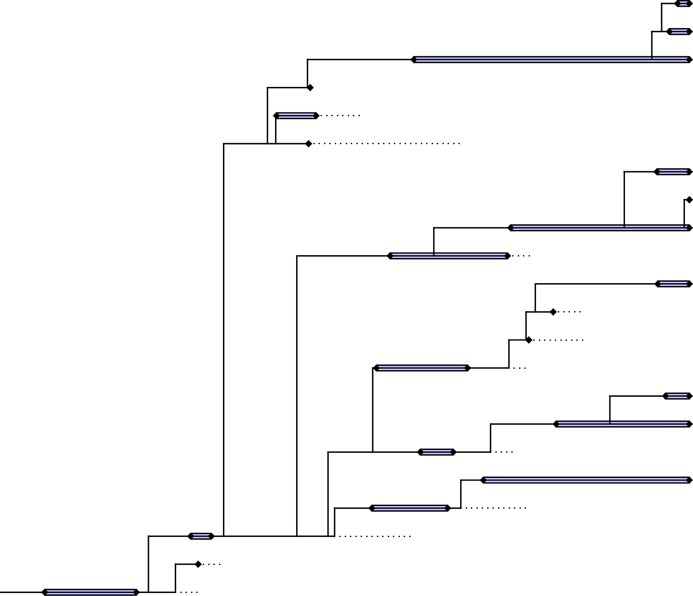



 
One possible realization of the fossilized birth-death range model.
Sampled lineages are represented by solid black lines.
Stratigraphic ranges are shown in purple. Black diamonds represent first and last appearances.
Singletons (*i.e.,* ranges known from a single fossil specimen) are represented by a single diamond.
Unsampled lineages are represented by dashed lines.



To do {#sect:todo}
========

- prior
- section on running 0; detail the output; notice the prior is the same for all the rates and intervals
- 1, 2, 3
- plot the output
- 
- Can you change the headers in the fossil count file?

- update reference to Stadler 2018 if cited elsewhere
- add Tracer reference
- check the you/we useage
- include a reference to the skyline plot

Future additions 

- stratigraphic age uncertainty priors for $o_i$ in model 1?
- a disscussion about the definition of $k_i$
- is the matrix really the only way to specify k for model 1? because k might represent different things
- some comparisons to alternative methods; e.g. model 3 versus boundary crosser method etc.
- informing the prior on diversification/sampling parameters
- linking 
