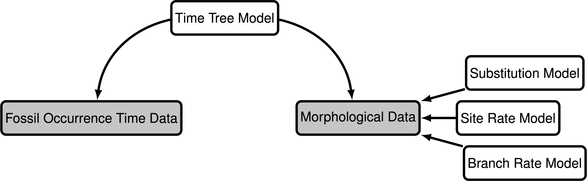
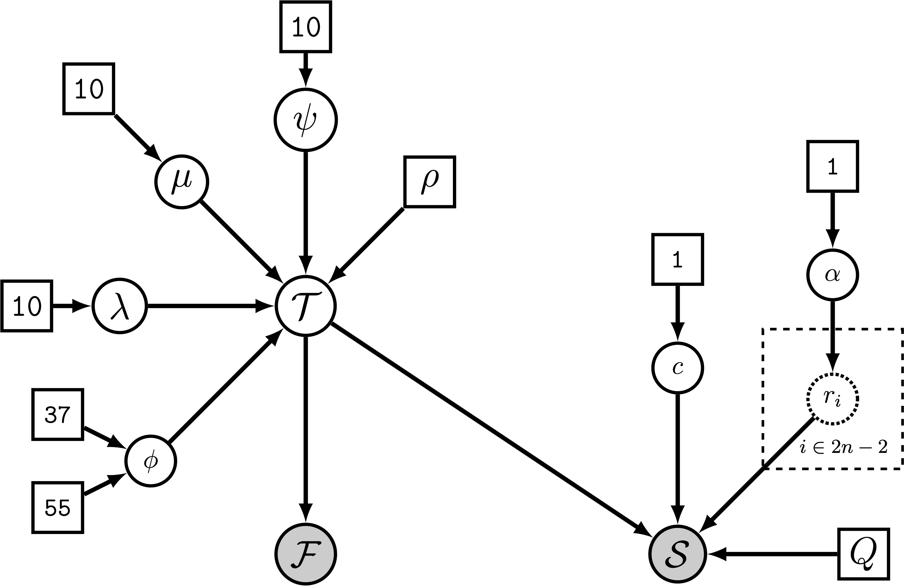
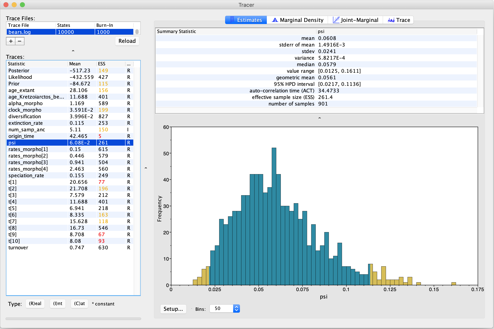
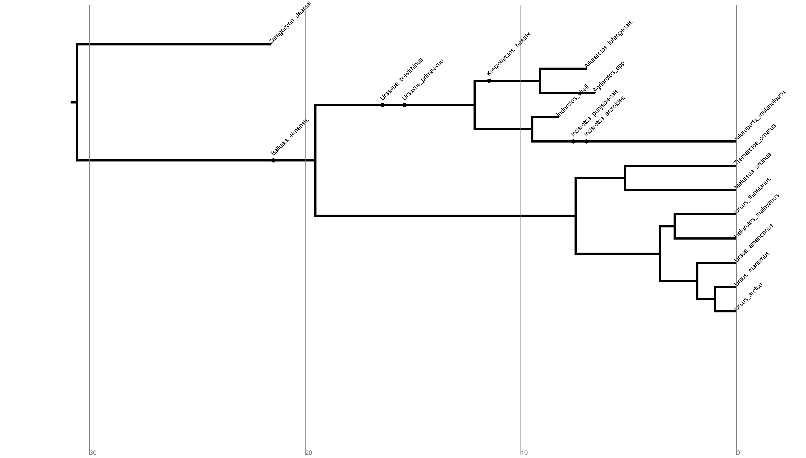

This tutorial comes with a recorded video walkthrough. The video corresponding to each section of the exercise is linked next to the section title. The full playlist is available here: [{: height="36" width="36"}](https://www.youtube.com/playlist?list=PLztACvN0g42t5ji1PRUdOPbhWoBwKe6Ve)



This tutorial provides a guide to using RevBayes to perform a simple phylogenetic analysis of extant and fossil bear species (family Ursidae), using morphological data as well as the occurrence times of lineages from the fossil record.
A version of this tutorial is published as: [Barido-Sottani et al. (2020) "Estimating a time-calibrated phylogeny of fossil and extant taxa using RevBayes".](https://hal.inria.fr/PGE/hal-02536394) In Scornavacca, C., Delsuc, F., and Galtier, N., editors, _Phylogenetics in the Genomic Era_, chapter No. 5.2, pp. 5.2:2–5.2:22. No commercial publisher | Authors open access book.




To get an overview of the model, it is useful to think of the model as a generating process for our data. Suppose we would like to simulate our fossil and morphological data; we would consider two components ():

- **Time tree model**: This is the diversification process that describes how a phylogeny is generated, as well as when fossils are sampled along each lineage on the phylogeny.  This component generates the phylogeny, divergence times, and the fossil occurrence data. The tree topology and node ages are parameters of the model that generates our morphological characters.
- **Discrete morphological character change model**: This model describes how discrete morphological character states change over time on the phylogeny. The generation of observed morphological character states is governed by other model components including the substitution process and variation among characters in our matrix and among branches on the tree.

These two components, or modules, form the backbone of the inference model and reflect our 
prior beliefs on how the tree, fossil data, and morphological trait data are generated. We will 
provide a brief overview of the specific models used within each component while pointing to other tutorials that implement alternative models.




Modular components of the graphical model used in the
analysis described in this tutorial. The gray boxes indicate the observed data: fossil ages and discrete morphological characters. The white boxes represent the models that generated the data.





The fossilized birth death (FBD) process provides a joint distribution on the divergence times of living 
and extinct species, the tree topology, and the sampling of fossils . 
The FBD model can be broken into two sub-processes, the birth-death process and the fossilization process.



The birth-death process is a branching process that provides a distribution for the tree topology and divergence times on the tree. 
We will consider a constant-rate birth-death process . Specifically, we will assume every lineage has the same constant rate of speciation $\lambda$ and rate of extinction $\mu$ at any moment in time . 
Speciation and extinction events occur with rate parameters $\lambda$ and $\mu$ respectively, 
whereby the waiting time between events is exponentially distributed with parameter ($\lambda+\mu$). 
Then, given an event occurred, the probability of the event being a speciation is ($\lambda$ / ($\lambda+\mu$)) while the probability of the event being an extinction is ($\mu$ / ($\lambda+\mu$)).


The birth-death process depends on two other parameters as well, the origin time and the sampling probability. 
The origin time, denoted $\phi$, represents the starting time of the stem lineage, which is the age of the entire process. 
The sampling probability, denoted $\rho$, gives the probability that an extant species is sampled.

The assumption that, at any given time, each lineage has the same speciation rate and extinction rate may not be realistic or valid in some systems. 
Several models are currently implemented in RevBayes that relax the assumption of constant rates, including:

1. [episodic diversification rates]()  
2. [environment-dependent diversification rates]() 
3. [branch-specific diversification rates]()  
4. [diversification rates tied to a species trait]() 



Given a phylogeny, in this case a phylogeny generated by a birth-death process, 
the fossilization process provides a distribution for sampling fossilized occurrences of lineages in the tree . 
Much like speciation and extinction, fossil sampling is modeled according to a Poisson process with rate parameter $\psi$. 
This means that each lineage has the same constant rate of producing a fossil. 
As a result, along a given lineage, the time between fossilization events is exponentially distributed with rate $\psi$.

One key assumption of the FBD model is that each fossil represents a distinct fossil specimen. 
However, if certain taxa persist through time and 
fossilize particularly well, then the same taxon may be sampled at different stratigraphic ages. 
These fossil data are commonly represented by only 
the first and last appearances of a fossil morphospecies. 
In this case one might want to consider the fossilized birth-death range process  to model the stratigraphic ranges of fossil occurrences.




Often, there is uncertainty around the age of each 
fossil, which is typically represented as an interval of the 
minimum and maximum possible ages. 
Moreover, a recent study demonstrated using simulated data  that ignoring uncertainty in fossil occurrence dates can lead to biased estimates of divergence times .
RevBayes 
allows fossil occurrence time uncertainty to be 
modeled by directly treating it as part of the 
likelihood of the fossil data given the time tree. 
We model this by assuming the likelihood of a 
particular fossil occurrence $\mathcal{F}_i$ is zero 
if the inferred age $t_i$ occurs outside the time 
interval $(a_i,b_i)$ and some non-zero likelihood 
when the fossil is placed within the interval. 
Specifically, we will assume the fossil could occur 
anywhere within the observed interval with uniform 
probability, this means that the likelihood is equal 
to one if the inferred fossil age is consistent with 
the observed fossil interval:

$$f[\mathcal{F}_i \mid a_i, b_i, t_i] = \begin{cases}
1 & \text{if } a_i < t_i < b_i\\
0 & \text{otherwise}
\end{cases}$$

The incorporation of uncertainty around the fossil occurrence data is shown graphically as a part of our model in .  




A graphical model of the
fossil age likelihood model used in this tutorial. The likelihood of
fossil observation $\mathcal{F}_i$ is uniform and non-zero when the
inferred fossil age $t_i$ falls within the observed time interval
$(a_i,b_i)$.






Given a phylogeny, the discrete morphological character change model will describe how traits 
change along each lineage, resulting in the observed character states of fossils and living species. 
In our case, the phylogeny and fossil occurrences are generated from the FBD process and we will 
be modeling the evolution of discrete morphological characters with two states. 
There are three main components to consider with modeling discrete morphological traits (as shown in ): the 
substitution model, the branch rate model, and the site rate model.




The substitution model describes how discrete morphological characters evolve over time. 
We will be using the Mk model , a generalization of the Jukes-Cantor  model described for nucleotide substitutions. 
The Mk model assumes that all transitions from one state to another occur at the same rate, for all $k$ states. Since the characters used in this 
tutorial all have two states, we will specifically be using a model where $k=2$. 
Thus, a transition from state 0 to state 1 is equally as likely as a transition from state 1 to state 0. 
For this tutorial, we focus on binary (2-state) characters for simplicity, but it is important to note that RevBayes can also accommodate 
[multistate characters]() as well.

The evolution of discrete morphological characters is thought to occur at a very slow rate.
Moreover, once some characters transition to a certain state, they rarely transition back, which means that the assumption of symmetric rates is likely violated my many empirical datasets . 
We can accommodate [asymmetric transition rates]() for each state using alternative models in RevBayes. Additionally, if some characters change symmetrically while others change asymmetrically, it is possible to [partition]() the character matrix to account for model heterogeneity in the matrix.



The branch-rate model describes how rates of morphological state transitions vary among 
branches in the tree. 
Each lineage in the phylogeny is assigned a value that acts as a scalar for the rate of character evolution. 
In our case we assume each branch has the same rate of evolution, this is a strict morphological clock , which is analogous to a strict molecular clock.
It is also possible to account for variation in rates among branches. 
These "relaxed-clock" models are commonly applied to molecular datasets and are currently implemented in RevBayes (see the [Clocks and Time Trees]() tutorial).



The rate of character evolution can often vary from site to site, i.e. from one column in the matrix to another. 
Under the site-rate model, a scalar is applied to each character to account for variation in relative rates. 
In our case we will assume that each character belongs to one of four rate categories from the discretized gamma distribution , 
which is parameterized by shape parameter $\alpha$ and number of rate categories $n$. 
Normally a gamma distribution requires shape $\alpha$ and rate $\beta$ parameters, 
however, we set our site rates to have a mean of 
one, which results in the constraint $\alpha=\beta$, thus eliminating the second parameter. 
The parameter $n$ breaks the gamma distribution into $n$ equiprobable bins where the rate value of 
each bin is equal to its mean or median.



We have outlined the specific components forming the processes that govern the generation of the time 
tree and morphological character data; and together these modules make up the complete 
phylogenetic model. 
 shows the complete probabilistic graphical model 
that includes all of the parameters we will use in 
this tutorial (see  for more on graphical models for statistical phylogenetics).




The complete graphical model used in the
analysis described in this tutorial. This explicit representation of the model expands on the modular version depicted in . The model components are defined in the box on the right. To simplify the model, we do not represent the components accounting for fossil age uncertainty illustrated in .



The parameters represented as stochastic nodes (solid white circles) in  are unknown random variables that are estimated in our analysis.
For each of these parameters, we assume a prior distribution that describes our uncertainty in that 
parameter's value. For example, we apply an exponential distribution with a rate of 10 as a prior 
on the mutation rate: $\mu\sim$ Exponential(10).
The parameters represented as constant nodes (white boxes) are fixed to "known" or asserted values in the analysis.




The model choices and analysis in this tutorial focus on a simple example.
Importantly, the modular design of RevBayes 
allows for many model choices to be swapped with more complex or biologically relevant processes for a given system.
Analyses of a wide range of data types are also implemented in RevBayes (e.g. [nucleotide sequences](), [historical biogeographic ranges]()).
Moreover, it is possible to fully integrate models describing the generation of data from different sources like in the [“combined-evidence" approach]()  in a single, hierarchical Bayesian model.
Some researchers may wish to 
perform analyses with [node calibrations]()
Ultimately, for any statistical analysis of empirical data, it is important to consider the processes governing the generation of those data and how they can be represented in a hierarchical model.



In this exercise, we will create a script in Rev, the interpreted programming language used by 
RevBayes, that defines the model outlined above and specifies the details of the MCMC simulation. 
This script can be executed in RevBayes to complete the full analysis.
We conclude the exercise by evaluating the performance of the MCMC and summarizing the results.



>On your own computer or your remote machine, create a directory called `RB_FBD_Tutorial`
>(or any name you like).
>
>Then, navigate to the folder you created and make a new one called `data`.
>
>In the `data` folder, add the following files (click on the hyperlinked file names to download):
>-   [`bears_taxa.tsv`](data/bears_taxa.tsv): a tab-separated table listing the 18 bear species in our analysis (both fossil and extant) and their occurrence age ranges (minimum and maximum ages). For extant taxa, the minimum age is 0.0 (*i.e.* the present).
>-   [`bears_morphology.nex`](data/bears_morphology.nex): a matrix of 62 discrete, binary (coded `0` or `1`) morphological characters for our 18 species of fossil and extant bears.
{:.instruction}

Now you can create a separate file for the Rev script.

> In the `RB_FBD_Tutorial` directory created above, create a blank file called `FBD_tutorial.Rev` and open it in a text editor.
>
> It is also possible to execute this entire tutorial in the RevBayes console.
{:.instruction}

The file `FBD_tutorial.Rev` will contain all of the instructions required to load the data, assemble the 
different model components used in the analysis, and configure and run the Markov chain Monte Carlo (MCMC) analysis.
Once you finish writing this file, you can compare your script with the example provide with this tutorial (see links above).





We will begin our Rev script by loading in the two data files that were downloaded and saved to the `data` directory.
In RevBayes, we use functions to read the contents of files and assign them to variables in our workspace.
First, we will create a variable called `taxa` that will contain the data from `bears_taxa.tsv`.

{{ mcmc_script | snippet:"block#","1" }}

The file `bears_taxa.tsv` contains a table with all of the fossil and extant bear species names in the first column, their minimum age in the second column and their maximum age in the third column.
We use the function `readTaxonData` to load this table into the workspace.


Next, we will import the morphological character matrix from `bears_morphology.nex` and assign it to the variable `morpho`.
In this exercise, we are using a NEXUS-formatted data file, but it is worth noting that several other file-types are acceptable depending on the kind of data (e.g., FASTA for molecular data).

{{ mcmc_script | snippet:"block#","2" }}

Here, we use the function `readDiscreteCharacterData` to load a data matrix to the workspace from a formatted file. This function can be used for discrete morphological data as well as molecular sequence data (e.g., nucleotides, amino acids).



Before we begin specifying the hierarchical model, it is useful to instantiate some "helper variables" that will be used in our model and MCMC specification throughout our script.

First, we will create a new constant node called `n_taxa` that is equal to the number of species in our analysis (18).

{{ mcmc_script | snippet:"line","22" }}

Next, we will create a workspace variable called `moves`, which is a vector that will contain all of the MCMC moves used to propose new states for every stochastic node in the model graph. Each 
time a new stochastic node is created in the model, we can append the corresponding moves to this vector.


{{ mcmc_script | snippet:"line","23" }}

One important distinction here is that `moves` is part of the RevBayes workspace and not the hierarchical model. Thus, we use the workspace assignment operator `=` instead of the constant node assignment `<-`.





Two key parameters of the FBD process are the speciation rate (the rate at which lineages are added to the tree, denoted by $\lambda$ in ) and the extinction rate (the rate at which lineages are removed from the tree, $\mu$ in ).
We will place exponential priors on both of these values, meaning we assume each parameter is 
drawn independently from a different exponential distribution, where each distribution has a rate parameter equal to `10`.
Note that an exponential distribution with a rate of `10` has an expected value (mean) of `1/10`.

Create the exponentially distributed stochastic nodes for the `speciation_rate` and `extinction_rate` using the `~` stochastic assignment operator.

{{ mcmc_script | snippet:"block#","4" }}

The `~` operator in Rev instantiates a stochastic node in the model (i.e., a solid circle in ). 
Every stochastic node must be defined by a distribution. In this case, we use the Exponential.
In the Rev language, every distribution has the prefix `dn` to make it easier to locate the various distributions in the Rev language documentation ([https://revbayes.com/documentation](https://revbayes.github.io/documentation/)).
When a stochastic node is created in the model, the distribution function assigns it an initial value by drawing a random value from the prior distribution and assigns the node to the named variable.

For every stochastic node we declare, we must also specify proposal algorithms (called *moves*) to sample the value of the parameter in proportion to its posterior probability.
If a move is not specified for a stochastic node, then it will not be estimated, but fixed to its initial value.

The extinction rate and speciation rate are both positive, real numbers (i.e., non-negative floating point variables).
For both of these nodes, we will use a scaling move (`mvScale`), which proposes multiplicative changes to a parameter.

{{ mcmc_script | snippet:"block#","5-6" }}

You will also notice that each move has a specified `weight`.
This option indicates the frequency a given move will be performed in each MCMC cycle.
In RevBayes, the MCMC is executed by default with a *schedule* of moves at each step of the chain, instead of just one move per step, as is done in MrBayes  or BEAST .
Here, if we were to run our MCMC with our current vector of 2 moves each with a weight of `1`, then our move schedule would perform 2 moves in each cycle. Within a cycle, an individual move is chosen from the move list in proportion to its weight. Therefore, with both moves assigned `weight=1`, each has an equal probability of being executed and will be performed on average one time per MCMC cycle.
For more information on moves and how they are performed in RevBayes, please refer to the  and  tutorials.

In addition to the speciation ($\lambda$) and extinction ($\mu$) rates, we may also be interested in inferring the net diversification rate ($\lambda - \mu$) and the turnover ($\mu/\lambda$).
Since these parameters can each be expressed as a deterministic transformation of the speciation and extinction rates, we can monitor their values (i.e., track their values and print them to a file) by creating two deterministic nodes using the `:=` deterministic assignment operator.

{{ mcmc_script | snippet:"block#","7" }}

Deterministic nodes are represented by circles with dotted borders in a probabilistic graphical model. To maintain the simplicity of the model in , the diversification rate and turnover are not shown.




Every extant bear species is represented in this dataset. 
Therefore, we will fix the probability of sampling an extant lineage ($\rho$ in ) to 1. The parameter `rho` will be specified as a constant node (new values for `rho` will not be sampled in the MCMC) using the `<-` constant assignment operator.


{{  mcmc_script | snippet:"block#","8" }}

Because $\rho$ is a constant node, we do not have to assign a move to this parameter because we assume the value is known and fixed.



Since our data set includes serially sampled lineages, we must also account for the rate of sampling through time. This is the fossil sampling (or recovery) rate ($\psi$ in ), which we will instantiate as a stochastic node named `psi`.
As with the speciation and extinction rates (see ), we will use an exponential prior on this parameter and apply a scale move to sample values from the posterior distribution.

{{  mcmc_script | snippet:"block#","9-10" }}



The FBD process is conditioned on the origin time ($\phi$ in ), which requires specification of a node representing the age of the clade.
We will set a uniform distribution on the origin age, with the lower bound set at the age of the oldest bear fossil (37 My) and the higher bound of 55 My set to the age of the most recent common ancestor of crown Carnivora estimated by recent studies .
For the move, we will use a sliding window move (`mvSlide`), which samples a parameter uniformly within an interval (defined by the half-width `delta`, which is set to `1` by default). Sliding window moves can be problematic for small values, as the window may overlap zero. However, our prior on the origin age excludes values $\leq 37.0$, so this is not an issue.

{{  mcmc_script | snippet:"block#","11-12" }}




Now that we have specified all of the parameters of the FBD process ($\lambda$, $\mu$, $\phi$, $\psi$), we will use these parameters to instantiate the stochastic node representing the time-calibrated tree that we will call `fbd_tree`.
The `fbd_tree` ($\mathcal{T}$ in ) is generated by a fossilized birth-death distribution and is conditionally dependent on $\lambda$, $\mu$, $\phi$, and $\psi$.
The FBD distribution function `fnFBDP` takes the FBD parameters as arguments as well as the `taxa` variable which specifies the number of terminal taxa as well as the taxon labels.

{{  mcmc_script | snippet:"block#","13" }}

Next, in order to sample from the posterior distribution of trees, we need to specify moves that propose changes to the topology (e.g. `mvFNPR`) and node times (e.g. `mvNodeTimeSlideUniform`). We also include a proposal that will collapse or expand a fossil branch (`mvCollapseExpandFossilBranch`), thus sampling trees where a given fossil is either a sampled ancestor or a sampled tip.
In addition, when conditioning on the origin time, we also need to explicitly sample the root age (`mvRootTimeSlideUniform`).

{{  mcmc_script | snippet:"block#","14-15" }}

Note that we specified a higher move `weight` for each of the proposals operating on `fbd_tree` than we did for the previous stochastic nodes.
This means that our move schedule will propose fifteen times as many new topologies via the `mvFNPR` move as it will new values of `speciation_rate` using `mvScale`, for example.
By increasing the number of times new values are proposed for a parameter, we are increasing the sampling intensity for that parameter.
Typically, we do this for parameters that we are particularly interested in or for parameters that tend to induce long mixing times.
A node like $\mathcal{T}$ in our graphical model () represents a complex set of variables: the tree topology and all divergence times.
Moreover, the likelihoods of our fossil occurrence data and the morphological character data are both conditionally dependent on the time tree.
Such complex variables require more extensive sampling than other nodes.



We need to account for uncertainty in the age estimates of our fossils using the observed 
minimum and maximum stratigraphic ages that are provided in the file `bears_taxa.tsv`.
We can represent the fossil likelihood using any uniform distribution that is non-zero when the likelihood is equal to one (see ).
For example, if $t_i$ is the inferred fossil age and $(a_i,b_i)$ is the stratigraphic age uncertainty interval, we know the likelihood is equal to one when $a_i < t_i < b_i$, or equivalently $t_i - b_i < 0 < t_i - a_i$.
So we can represent this likelihood using a uniform random variable,  uniformly distributed in $(t_i - b_i, t_i - a_i)$ and clamped at zero.

To do this, we will get all the fossils from the tree and use a `for` loop to iterate over them. For each fossil observation, we will create a uniform random variable 
representing the likelihood, based on the minimum and maximum ages specified in the file `bears_taxa.tsv`.

{{  mcmc_script | snippet:"block#","16-18" }}

Finally, we will add a move that samples the ages of all the fossils on the tree.

{{  mcmc_script | snippet:"block#","19" }}



There are additional parameters that may be of particular interest to us that are not directly sampled as part of the graphical model defined thus far.
As with the diversification and turnover nodes specified in , we can create deterministic nodes to sample the posterior distributions of these parameters.
Here we will create a deterministic node called `num_samp_anc` that will compute the number of sampled ancestors in our `fbd_tree`.

{{  mcmc_script | snippet:"block#","20" }}

We are also interested in the age of the most-recent-common ancestor (MRCA) of all living bears.
To monitor this age in our MCMC sample, we must use the `clade` function to identify the node corresponding to the MRCA.
Once this clade is defined we can instantiate a deterministic node called `age_extant` that will record the age of the MRCA of all living bears, using the `tmrca()` function.

{{  mcmc_script | snippet:"block#","21" }}

In the same way we monitored the MRCA of the extant bears, we can also monitor the age of a 
fossil taxon that we may be interested in recording. 
We will monitor the marginal distribution of the age of *Kretzoiarctos beatrix*, which is sampled between 11.2–11.8 My.

{{  mcmc_script | snippet:"block#","22" }}




The next part of the graphical model we will define specifies the model of morphological character evolution.
This component includes the substitution model, the model of rate variation among characters, and the model of
rate variation among branches ().

As stated in the  section, we will
use the Mk model to model our data.
Because the Mk model is a generalization of
the Jukes-Cantor model , we will initialize our instantaneous rate matrix from a Jukes-Cantor
matrix.
The constant node `Q_morpho` corresponds to the two-state rate matrix $Q$ in .

{{ mcmc_script | snippet:"block#","23" }}


We will assume that rates vary among characters in our data matrix according to a discretized gamma distribution (described in the section on ).
For this model, we create a vector of rates named `rates_morpho` which is the product
of a function `fnDiscretizeGamma()` that
divides up a gamma distribution into a set of equal-probability bins ($\mathbf{R}$ in Figure ). 
Here, our only stochastic node is `alpha_morpho` ($\alpha$ in , which is the shape
parameter of the discretized gamma distribution.


{{ mcmc_script | snippet:"block#","24-25" }}

The phylogenetic model also assumes that each branch has a rate of
morphological character change.
For simplicity, we will assume a strict
morphological clock — meaning that every branch has the same rate rate represented by the stochastic node `clock_morpho` ($c$ in ), which is drawn from
an exponential distribution (see the  section).

{{ mcmc_script | snippet:"block#","26-27" }}



If you refer to , you will see that we have defined almost all of the components of the
complete model except for the observed node representing
our morphological character data ($\mathcal{M}$).
The character matrix is a clamped stochastic node that
is generated by a phylogenetic continuous-time Markov chain (CTMC) distribution.
This node is conditionally dependent on the time tree ($\mathcal{T}$: `fbd_tree`), clock rate ($c$: `clock_morpho`), site rates ($\mathbf{R}$: `rates_morpho`), and the two-state Mk rate matrix ($Q$: `Q_morpho`).
With all of these nodes instantiated in the graphical model,
we can now connect the components by defining the
node representing our observed morphological data.

There are some unique
aspects to specifying a phylogenetic CTMC for morphological
data.
You will notice that we have an option called `coding`.
This option
allows us to condition on biases in the way the morphological data were
collected (i.e., ascertainment bias).
By setting `coding=variable` we can correct for coding only variable characters (discussed in ).

{{ mcmc_script | snippet:"block#","28" }}

Now that we have defined our complete model, we can create a workspace variable that packages the entire model graph.
This makes it easy to pass the whole model to functions that
will set up our MCMC analysis.
This variable is created using the `model()` function, which
takes only a single node in the graph.
We will use the `fbd_tree` node, but you can try this with an alternative node (e.g., `clock_morpho`, `rho`, etc.).
As long as you have established all of the connections among the model parameters, the `model()` function will find every
other node by traversing the edges of the graph ().

{{ mcmc_script | snippet:"block#","29" }}




We have defined the full probabilistic graphical model
shown in  and we are now ready to
specify the details of our MCMC analysis.
The first step in setting up the analysis is to
create _monitors_ that will record the values of
each parameter in our model for every sampled cycle of
the MCMC.
The sampled values are saved to file (or printed to screen) and can be summarized when our MCMC simulation is complete.

Let's create three different monitor objects for this analysis.
To manage the monitors in RevBayes, we create another
workspace variable called `monitors` that is a vector containing the three monitor variables.

{{ mcmc_script | snippet:"block#","30" }}

We will append our first monitor to the `monitors` vector.
This will create a file called `bears.log` in a directory called `output` (if this directory does not already exist, RevBayes will create it).
The function `mnModel()` initializes a monitor that saves all of the numerical parameters in the model to a tab-delineated file.
This file is useful for summarizing marginal posteriors in statistical plotting tools like Tracer  or R . 
We will exclude the `F` vector from logging, as it is purely used as an auxiliary variable for estimating fossil ages, and is clamped to 0.
Additionally, we also specify how frequently we sample our Markov chain by setting the `printgen` option.
We will sample every `10` cycles of our MCMC.
Importantly, we also specify how frequently we sample our Markov chain by setting the `printgen` option.
We will sample every `10` cycles of our MCMC.

{{ mcmc_script | snippet:"block#","31" }}

You may think that sampling every 10 generations may be too frequent to avoid correlation between samples in our MCMC.
However, recall that a single "generation" in RevBayes performs a schedule of moves that is determined by the number of moves in the `moves` vector and the weights assigned to those moves (see the  section).
Thus, a single generation in this analysis will involve 26 moves, so if we record every 10 generations, there will be
260 moves between each sample.

We want to create a separate file containing samples of
the tree and branch lengths since these will not be
saved by the monitor defined above.
To save the tree parameter, we can use the
`mnFile()` function that saves specific parameters
to a file.
We indicate the parameters by including them in the function's options.

{{ mcmc_script | snippet:"block#","32" }}

The final monitor will print updates of our MCMC to the screen.
The screen monitor function, `mnScreen()` allows us to add
parameters in our model that will be displayed along with
a few default values (including the current iteration, posterior, likelihood, and prior).
We will monitor the age of the MRCA of the living bears, the number of sampled ancestors, and the origin time.

{{ mcmc_script | snippet:"block#","33" }}




Our Rev script specifies the three major parts of our
MCMC analysis: a model (`mymodel`), a list of MCMC proposals (`moves`), and a way to save the values sampled by our Markov chain (`monitors`).
With these three components, we can set up our analysis using the `mcmc()` function.
This function creates a workspace variable that we can use
to execute the MCMC simulation.

{{ mcmc_script | snippet:"block#","34" }}

Using our variable `mymcmc`, we can execute the `run()`
member method to start our MCMC sampler.

{{ mcmc_script | snippet:"block#","35" }}

Finally, since we are going to save this analysis in a script file and run it in RevBayes, it is useful to include a statement that will quit the program when the run is complete.

{{ mcmc_script | snippet:"block#","36" }}

> Your script is now complete! 
>
> Save the `FBD_tutorial.Rev` file in the `RB_FBD_Tutorial` directory.
{:.instruction}




With your script complete and data files in the proper locations, you can execute the `FBD_tutorial.Rev` script 
in RevBayes.

> Run the RevByes executable.  
>
> On Unix systems, if the RevBayes is in your path, you simply need to navigate to the `RB_FBD_Tutorial` directory and type `rb`.
>
> If the RevBayes executable is not in your path, you can execute it and then change your working directory using the `setwd()` function which takes the absolute path to your directory as an argument.
> 
> ```
> setwd("<path to>/RB_FBD_Tutorial")
> ```
{:.instruction}


Once RevBayes is in the correct directory (`RB_FBD_Tutorial`), you can then use the `source()` function to feed RevBayes your master script file (`FBD_tutorial.Rev`).

```
source("FBD_tutorial.Rev")
```

```
   Processing file "FBD_tutorial.Rev"
   Successfully read one character matrix from file 'data/bears_morphology.nex'

   Running MCMC simulation
   This simulation runs 1 independent replicate.
   The simulator uses 11 different moves in a random move schedule with 26 moves per iteration
   ...
```
{:.Rev-output}

This will execute the analysis and you should see the various parameters---specified when you initialized the screen monitor---printed to the screen every 10 generations.
When the analysis is complete, RevBayes will quit and you will have a new directory called output that 
will contain all of the files you specified with the monitors.



Two files are created by the monitors in the  section. 
These files, located in the `output` directory
contain the record of values sampled for the various parameters of the model over the course of 
the MCMC. 
In the following sections, we will assess the performance of our MCMC sampler and summarize the marginal posterior distributions of numerical parameters (in the file `bears.log`) and the time-calibrated phylogeny (in the file `bears.trees`). 




The first step when analyzing the output of an MCMC run is to check whether the chain has 
converged on the stationary distribution and sampled effectively (i.e., achieved "good mixing"). 
This can be done by loading the 
parameter log, in our case the file `bears.log`, in a program such as [Tracer](http://beast.community/tracer) , shown in .




Analysis in Tracer of the parameter estimates obtained on the bears dataset.



On the left side is a panel summarizing all the 
parameters appearing in the log, with their mean estimate and ESS value (effective sample size). The ESS of a parameter determines whether the 
chain has adequately sampled the associated variable: values above 200 are considered "good", whereas 
values below 200, highlighted by Tracer in yellow or red, indicate poor mixing.
Explicitly, the ESS measures the degree of independence between samples and parameters with signatures of autocorrelation between samples are indicative of an inadequate sampler.

Here we can see that the chain has mixed well for some parameters, but not others. 
In particular, we see low ESS values for the origin time (`origin_time`) and the ages of some fossil 
tips (`t[1]`, `t[9]`, and `t[10]`).
This may indicate that the MCMC sampler has
not converged on the stationary distribution for these parameters, which are associated with the FBD tree. 
What this assessment reveals is that we did not perform enough proposals for these parameters.
Thus, it will be important to run the MCMC for more 
generations (specified in the  section) and/or
increase the weights of moves applied to these
stochastic nodes (e.g., the `mvSlide` applied to `origin_time` in the  section). 
For more details on diagnosing convergence
of MCMC samples under the FBD model, please see the tutorial on [combined-evidence analysis in RevBayes]().  




Once we are certain that our MCMC has effectively
sampled the joint posterior distribution of our model parameters, we can
summarize the tree topology, branch times, and fossil ages that 
were saved to `output/bears.trees` using some built-in RevBayes functions.

> Run the RevByes executable, making sure that the working directory is `RB_FBD_Tutorial`.
{:.instruction}

The file `bears.trees` contains the trees and associated parameters that 
were sampled every 10 generations by our monitor. 
In RevBayes, we often refer to a set of samples from our MCMC
as a "trace". 

Begin by loading the tree trace into RevBayes from the `bears.trees` file.

```
trace = readTreeTrace("output/bears.trees")
```

```
   Processing file "<path to>/RB_FBD_Tutorial/output/bears.trees"

Progress:
0---------------25---------------50---------------75--------------100
********************************************************************

```
{:.Rev-output}

By default, a burn-in of 25% is used when reading in the tree trace (250 trees in our case). 
Note that this is different from Tracer, which uses a burn-in fraction of 10% by default. You can specify a different burn-in fraction, say 50%, by typing the command `trace.setBurnin(500)`.

Now we will use the `mccTree()` function to return a maximum clade credibility (MCC) tree. 
The MCC tree is the tree with the maximum product of the posterior clade probabilities. When considering trees with sampled ancestors, we refer to the maximum sampled ancestor clade credibility (MSACC) tree .

```
mccTree(trace, file="output/bears.mcc.tre" )
```

When there are sampled ancestors present, visualizing the tree can be fairly difficult in traditional tree viewers. 
When there are sampled ancestors present, visualizing the tree can be fairly difficult in traditional tree viewers. 
We will make use of a browser-based tree visualization tool called IcyTree , which can be accessed at [https://icytree.org](https://icytree.org). 
IcyTree has many unique options for visualizing phylogenetic trees and can produce publication-quality vector image files (i.e. SVG). Additionally, it correctly represents sampled ancestors on the tree as nodes, each with only one descendant ().

> Navigate to <https://icytree.org> and open the file `output/bears.mcc.tre` in IcyTree.
>
> Try to replicate the tree in  (Hint: ***Style > Mark Singletons***) 
>
>&#8680; Why might a node with a sampled ancestor be
>referred to as a singleton?
>
>&#8680; How can you see the names of the fossils that are putative sampled ancestors?
>
> &#8680; What is the
> posterior probability that *Zaragocyon daamsi* is a sampled ancestor?
{:.instruction}




Maximum sampled ancestor clade credibility (MSACC) tree of bear species used in this tutorial. 






In this tutorial, we have introduced core information about how morphological and age information are modeled for use with the FBD model in RevBayes. 
We have also discussed important aspects of executing and summarizing MCMC analysis.
This exercise uses a simplified data set and 
set of models for analysis of fossil and extant data.
Most researchers working on living taxa have 
access to molecular (including genomic) data and
may be interested in applying these methods
to much larger datasets and more complex problems.
Note that the goal of this tutorial is to provide a concise introduction 
to the framework for analysis of 
paleontological and neontological data in RevBayes. 
For more information on how to apply RevBayes
datasets combining morphological and molecular
characters, please refer to the 
following tutorials:

1. 
2. 
