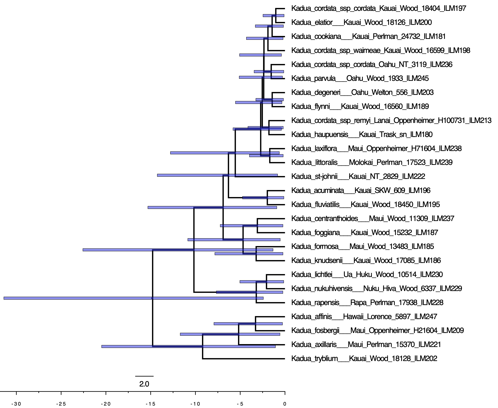
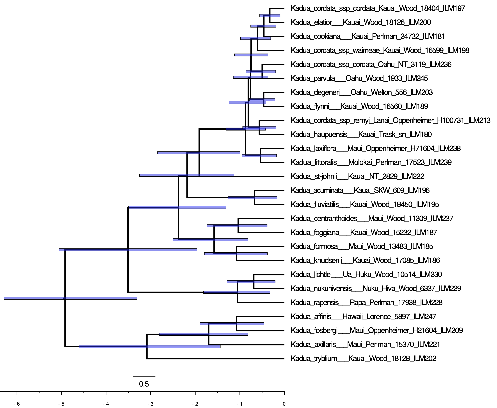





This tutorial explores how to perform a biogeographic dating analysis using the TimeFIG model. In its simplest form, this procedure jointly estimates phylogenetic divergence times, molecular substitution rates, biogeographic rates, and ancestral species ranges. The tutorial provides a conceptual background on challenges related to dating molecular phylogenies, alternative techniques for dating, and a framework to assess the sensitivity of divergence time estimates to methodological assumptions. 



Genetic data are critical to estimate phylogenetic relationships among living species. In general, genetic content is more similar among closely related species, and less similar among more highly divergent species. As mutations accumulate within a genome that is inherited across generations over time, the distances in genetic similarity will increase as phylogenetic lineages increasingly diverge over time.

Molecular phylogenetic models use these estimates of genetic distance to infer phylogenetic divergence, in terms of topology (relationships among lineages) and branch lengths (distances along lineages). Phylogenetic models often measure genetic distances in units of *expected substitutions per site*. These distances are, in fact, the product of time (e.g. millions of years) and the substitution rate (substitutions per site per time). This substitution rate is often called the *molecular clock* . An accurate estimate of such a clock rate would enable *molecular dating*, because a research would only need to convert molecular distances into clock "ticks" to estimate the ages of species in units of geological time.

Ideally, a molecular phylogenetic model would be able to decompose branch length estimates into separate estimates of substitution rates and evolutionary time. In real biological settings, we never know the precise time or rate underlying a molecular distance, and they must both be estimated. The problem is there are an infinite number of products of rate, $r$, and time, $t$, that equal a given distance, $d$. For example, the products of $r=10, t=1$ and $r=2, t=5$ both yield $d=10$. Scenarios of a fast evolution over a short time and slow evolution over a long time produce the same amount of evolutionary change, and are not statistically identifiable from one another.  

In practice, biologists use extrinsic evidence to "calibrate" the molecular clock to a geological timescale. Fossil evidence can be used to constrain the minimum age of a phylogenetic divergence event (e.g. a child species cannot be older than its parent species), which effectively constrains time and, indirectly, rate estimates. Two main approaches have been used to deploy fossil-based calibrations. Prior-based calibrations assign a node age distribution to internal nodes on a phylogeny, selected and specified using expert knowledge. Process-based calibrations explicitly incorporate fossil morphology and ages as data during phylogenetic inference to assign ages to clades. Read these excellent papers to read more about fossil-based dating. 

Paleogeography provides a complementary source of information to estimate divergence times through *biogeographic dating*. Biogeographic dating is often used for studying clades that possess no useful fossils (e.g. clades of island plants, like *Kadua*). The logic for biogeographic dating is as follows: imagine a clade of ten species that are endemic to a volcanic island that is less than one million years old. If it is assumed a single lineage colonized the island after it emerged, then the maximum age of the clade must be younger than the island, allowing the biologist to calibrate the molecular clock.

Biogeographic dating has typically relied on prior-based constraints, requiring that the biologist makes strong assumptions about many unknowable factors: the timing and effect of paleogeographic events the dispersal abilities of species, relationships among species, and more. In addition, using a biogeographic hypothesis to date a clade (e.g. "we assume the islands were colonized after they originate") means that dated phylogeny cannot be safely used to test downstream biogeography hypotheses ("when were the islands first colonized by the clade?"). Doing so would be circular.

Biogeographic dating with a process-based approach uses paleogeographically-informed biogeographic rates to extract information about divergence times through a dataset (Landis 2020). Previous approaches for process-based biogeographic dating relied on simpler models that did not consider how speciation and extinction rates vary among regions over time . TimeFIG models this important relationship between paleogeographically-varying features, species ranges, biogeographic rates, and divergence times.



This tutorial builds up to a process-based biogeographic dating analysis using the TimeFIG model. It begins with a simple molecular phylogenetic analysis that has *no* capability for time calibration. Then, we'll repeat the analysis using a prior-based biogeographic node age calibration. Lastly, we'll perform a process-based TimeFIG analyses to estimate divergence times.

As with previous tutorials in this series, we will analyze a dataset for Hawaiian *Kadua* plant species. All input datasets are the same as before, with the addition of 10 new homologous genetic markers obtained from the Angiosperms353 protocol.

Because these analyses build on each other, the tutorial focuses on what changes between the scripts. This tutorial is also bundled with RevBayes scripts that complete analyses equivalent to those written below. However, the scripts are often designed to be more modular and general, making them ideal to customize for analyses of new datasets, other than Hawaiian *Kadua*.




First, we'll run a simple molecular phylogenetic analysis *without* any information to time-calibrate the tree. The tutorial reviews several important concepts for phylogenetic tree estimation, such as the relaxed molecular clock. It also demonstrates that extrinsic (non-molecular) evidence is needed to time-calibrate divergence times using standard phylogenetic approaches.

For this example, we'll compose a model where the phylogeny was generated by a constant-rate birth-death process and genes evolve under a relaxed molecular clock. We'll refer to this as the `BDP_uncalibrated` analysis.

Now to get started! First, we create variables to locate input datasets.

```
analysis      = "BDP_uncalibrated"
dat_fp        = "./data/kadua/"
phy_fn        = dat_fp + "kadua.tre"
calib_fn      = dat_fp + "kadua_calib.csv"
out_fn        = "./output/" + analysis
```

We'll also create variables to locate additional RevBayes scripts, which can be loaded using `source()` rather than typing all the code by hand.

```
mol_code_fn   = "./scripts/timefig_dating/mol_timeFIG.Rev"
phylo_code_fn = "./scripts/timefig_dating/phylo_BDP.Rev"
clade_fn      = "./scripts/timefig_dating/clade.Rev" 
```

These variables will later configure the MCMC analysis. The empty vectors for moves and monitors will be populated later.
```
num_gen = 10000
print_gen = 10
moves = VectorMoves()
monitors = VectorMonitors()
```


Next, we read in a phylogenetic tree. To simplify this analysis, we assume the tree topology is known (fixed) while the divergence times are unknown (estimated). We will use the first (only!) tree stored in `phy_fn` to define the topology.

```
phy          <- readTrees(phy_fn)[1]
taxa         = phy.taxa()
num_taxa     = taxa.size()
num_branches = 2 * num_taxa - 2
```

After that, we read in 10 molecular sequence alignments, each one corresponding to a different Angiosperms353 locus.

```
mol_idx = [ 5339, 5398, 5513, 5664, 6038, 6072, 6238, 6265, 6439, 6500 ]
num_loci = mol_idx.size()
for (i in 1:num_loci) {
    mol_fn[i] = dat_fp + "genes/kadua_" + mol_idx[i] + "_supercontig.nex"
    dat_mol[i] = readDiscreteCharacterData(mol_fn[i])
    num_sites[i] = dat_mol[i].nchar()
}
```

We did not have perfect coverage for all taxa across all loci, so we will add missing sequence data for each taxon present in the tree but absent for a locus.

```
for (i in 1:num_taxa) {
    taxa_names[i] = taxa[i].getName()
}
for (i in 1:num_loci) {
    dat_mol[i].excludeTaxa( dat_mol[i].taxa() )
    dat_mol[i].includeTaxa( taxa_names )
    dat_mol[i].addMissingTaxa( taxa_names )
}
```

Next, we will manually configure the birth-death model by entering commands. In the future, you can instead load the birth-death phylogenetic model setup definition using `source( phylo_code_fn )`.

We first assign priors to the net diversification rate (birth - death) and turnover proportion (ratio of death to birth events). Throughout the tutorial, we will pair new model parameters with moves that eventually instruct MCMC how to update parameter values during model fitting.

Net diversification rate controls how rapidly species accumulation, whereas turnover proportion controls the speed of extinction relative to speciation. This parameterization often behaves better for model fitting, and many biologists prefer to think in these terms. 

```
diversification ~ dnExp(5)
turnover ~ dnBeta(2,2)
birth := diversification / abs(1.0 - turnover)
death := birth * turnover

moves.append( mvScale(diversification, weight=3) )
moves.append( mvScale(turnover, weight=3) )
```

Based on ongoing taxonomic work led by the National Tropical Botanical Garden, there are 32 *Kadua* taxa in our clade of interest, but only 27 are represented in our analysis. We use the $\rho$ parameter to inform our birth-death process that some fraction are missing (unsampled) and not e.g. extinct. 

```
rho <- taxa.size() / 32
```

Next, we assign a prior on the root age of the clade. For now, we assume we know nothing about the age of Hawaiian *Kadua*, except that the clade is probably younger than the Eocene-Oligocene boundary at 34 Ma.
Set up root age prior. Note, we will modify this in the next section.

```
root_age ~ dnUniform(0.0, 34)
root_age.setValue( phy.rootAge() )

moves.append( mvScale(root_age, weight=15) )
```

We now have what we need to construct a constant-rate birth process. In addition to the taxon set and various model parameters, the process conditions on a stopping condition (e.g. a time duration, producing some number of taxa, etc.) and a sampling strategy (how are sampled taxa selected). We use time as the stopping criterion and assume included taxa were sampled uniformly at random. 

```
timetree ~ dnBDP(lambda=birth,
                 mu=death,
                 rho=rho,
                 rootAge=root_age,
                 samplingStrategy="uniform",
                 condition="time",
                 taxa=taxa)

moves.append( mvNodeTimeSlideUniform(timetree, weight=2*num_taxa) )
```

We now initialize the `timetree` variable with the phylogeny we read from file, stored in `phy`. This is primarily to set the topology, but it can also be used to initialize the model with reasonable starting values for divergence times. If you don't initialize the tree, you will want to create moves to infer the tree topology.

```
timetree.setValue(phy)
```


The analyses in this tutorial can be modified to also estimate tree topology. To do so, add these moves:
``` 
moves.append( mvNNI(timetree, weight=2*num_taxa) )
moves.append( mvFNPR(timetree, weight=1*num_taxa) )
```



We want the crown node ages of important clades in Hawaiian *Kadua* to appear in our MCMC trace file. Calling `source( clade_fn )` will construct six clades based on predefined *Kadua* taxon sets. We then create deterministic nodes to track the crown node ages of these clades using the `tmrca()` function, which will be monitored.

```
source(clade_fn)
age_ingroup := tmrca(timetree, clade_ingroup)
age_affinis := tmrca(timetree, clade_affinis)
age_centrantoides := tmrca(timetree, clade_centrantoides)
age_flynni := tmrca(timetree, clade_flynni)
age_littoralis := tmrca(timetree, clade_littoralis)
age_littoralis_flynni := tmrca(timetree, clade_littoralis_flynni)
```

Now we have a variable representing our phylogeny. Next, we'll model how molecular variation accumulates over time. For this, we will construct a partitioned substitution model with a relaxed molecular clock. This means rates of molecular evolution can vary among branches, among loci, and among sites. The following code can be executed by calling `source( mol_code_fn )`, but you should specify the model by hand to better understand its composition.

First, we create the relaxed clock model. The following code creates a vector of clock rates that are lognormally distributed. Later, the rates in this vector will be used to define branch-varying clock rates. To do so, we first define a base clock rate, `mu_mol_base`

```
mu_mol_base ~ dnExp(10)
moves.append( mvScale(mu_mol_base, weight=5) )
```

Then, we draw branch rates whose mean equals that base clock rate and 95% of possible branchwise rate variation spans one order of magnitude (determined by the magic number `0.587405`).

```
mu_mol_sd <- 0.587405
for (i in 1:num_branches) {
    ln_mean := ln(mu_mol_base) - 0.5 * mu_mol_sd * mu_mol_sd
    mu_mol_branch[i] ~ dnLnorm(ln_mean, mu_mol_sd)
    moves.append( mvScale(mu_mol_branch[i], weight=1) )
}
```

In a partitioned analysis, each locus has its own evolutionary rates. We will assign each locus its own rate scaling factor, rate matrix, and site-rate variation parameters. 

To model among-locus rate variation, we fix the relative rate factor for the first locus to 1, while remaining loci have relative rate factors that follow a mean-1 Gamma distribution.

```
for (i in 1:num_loci) {
    mu_mol_locus_rel[i] <- 1.0
    if (i > 1) {
        mu_mol_locus_rel[i] ~ dnGamma(2,2)
        moves.append(mvScale(mu_mol_locus_rel[i], weight=3))
    }
    mu_mol[i] := mu_mol_locus_rel[i] * mu_mol_branch
}
```

Next, we specify the HKY rate matrix, `Q_mol` to define transition rates among nucleotides. The HKY rate matrix uses the `kappa` parameter to control relative rates of transitions (e.g. purine to purine, pyrimadine to pyrimadine) and transversions (purine to pyrimadine, pyrimadine to purine). The `pi_mol` parameter controls the stationary frequencies across nucleotides for the model. The prior mean on `kappa` is 1 and the prior mean on `pi_mol` is a flat Dirichlet distribution. Read more about the HKY matrix here .

```
for (i in 1:num_loci) {
    kappa[i] ~ dnGamma(2,2)
    moves.append(mvScale(kappa[i], weight=3))
    
    pi_mol[i] ~ dnDirichlet( [1,1,1,1] )
    moves.append(mvSimplex(pi_mol[i], alpha=3, offset=0.5, weight=3))
    
    Q_mol[i] := fnHKY(kappa=kappa[i], baseFrequencies=pi_mol[i])
}
```

Molecular rates variation among sites follow a Gamma distribution, approximated with four discrete rate classes. When `alpha` is large, all classes have relative rate factors of 1. When `alpha` is small, most rate classes are near 0 and one rate class is far greater than 1. Read more about the +Gamma among site rate variation model here .

```
for (i in 1:num_loci) {
    alpha[i] ~ dnExp(0.1)
    moves.append(mvScale(alpha[i], weight=3))
    
    site_rates[i] := fnDiscretizeGamma(shape=alpha[i],
                                       rate=alpha[i],
                                       numCats=4)
}
```

Now we have all the model components we need to define a partitioned molecular substitution model. This is called the phylogenetic continuous-time Markov chain (or phyloCTMC) in RevBayes. The `dnPhyloCTMC` models patterns of nucleotide variation under the evolutionary model for a given phylogenetic tree. 

We create one `dnPhyloCTMC` model for each locus. Each locus evolves along the branches of `timetree`, the phylogeny whose divergence times we wish to estimate.

```
for (i in 1:num_loci) {
    x_mol[i] ~ dnPhyloCTMC(
        Q=Q_mol[i],
        tree=timetree,
        branchRates=mu_mol[i],
        siteRates=site_rates[i],
        rootFrequencies=pi_mol[i],
        nSites=num_sites[i],
        type="DNA" )
}
```

We clamp the observed sequence alignment for each locus to the corresponding partitioned model component.

```
for (i in 1:num_loci) {
    x_mol[i].clamp(dat_mol[i])
}
```

We also apply special joint moves for updating the tree and molecular rates simultaneously. These moves are designed to take advantage of the fact that rate and time are not separately identifiable. That is, the likelihood remains unchanged if you multiply rates by 2 and divide times by 2. In short, these moves improve the performance of MCMC mixing.

```
# scales time (up) opposite of rate (down)
up_down_scale_tree = mvUpDownScale(lambda=1.0, weight=20)
up_down_scale_tree.addVariable(timetree,       up=true)
up_down_scale_tree.addVariable(root_age,       up=true)
up_down_scale_tree.addVariable(mu_mol_branch,  up=false)
up_down_scale_tree.addVariable(mu_mol_base,    up=false)
moves.append(up_down_scale_tree)

# scales base (up) and branch (up) rates
up_down_mol_rate = mvUpDownScale(lambda=1.0, weight=20)
up_down_mol_rate.addVariable(mu_mol_branch,  up=true)
up_down_mol_rate.addVariable(mu_mol_base,    up=true)
moves.append(up_down_mol_rate)

# rebalances rate and age parameters for a node
rate_age_proposal = mvRateAgeProposal(timetree, weight=20, alpha=5)
rate_age_proposal.addRates(mu_mol_branch)
moves.append(rate_age_proposal)
```

Next, we construct monitors to capture information from our MCMC as it searches parameter space.

```
# screen monitor, so you don't get bored
monitors.append( mnScreen(root_age, printgen=print_gen) )

# file monitor for all simple model variables
monitors.append( mnModel(printgen=print_gen, file=out_fn+".model.txt") )

# file monitor for tree
monitors.append( mnFile(timetree, printgen=print_gen, file=out_fn + ".tre") )
```

Now that our model, moves, and monitors are properly configured, we can run MCMC.

```
# create model object
mymodel = model(timetree)

# create MCMC object
mymcmc = mcmc(mymodel, moves, monitors)

# run MCMC
mymcmc.run(num_gen)
```

Generate a maximum clade consensus tree after the job is complete.

```
# note, readTreeTrace automatically appends ".tre" to filename
out_fn = "./output/BDP_uncalibrated"
tt = readTreeTrace (file=out_fn+".tre", treetype="clock", burnin=0.2)
mcc_tree = mccTree(trace=tt, file=out_fn+".mcc.tre")
```

Let's view the MCC tree for the uncalibrated analysis in FigTree (Fig. ).




Maximum clade credibility tree for *Kadua* without time-calibration.



Notice that node ages vary wildly in the uncalibrated analysis, up to the maximum age of 34.0 Ma.



We'll now repeat the previous exercise, but this time we will use calibration densities to constrain the ages of two nodes during inference.

For this example, we suggest that you make a new copy of `./scripts/timefig_dating/kadua_divtime_unconstrained.Rev` that is named `./scripts/timefig_dating/kadua_divtime_nodeprior.Rev`. Then, rather than typing all the commands, modify the content of the script as described below. After all modifications are in place, you can run the analysis by typing:
```
source("./scripts/timefig_dating/kadua_divtime_nodeprior.Rev")
```

If the script runs successfully, you should see MCMC diagnostics being printed to the screen. If the script fails to run, carefully read the error messages provided by RevBayes to correct the issue. RevBayes error messages generally report the location and the type of error.

Once you have your new copy of the script, begin editing it. First, we'll time-calibrate the root node that represents the most recent common ancestor of our clade. A previous fossil-based Bayesian analysis estimated the age of this node as 7.0 [3.0, 13.0] Ma (posterior mean and HPD95 credible interval). Although we could hard code this information into our script, we instead extract the information from the file `./data/kadua/kadua_calib.csv`

```
calib_fn = "./data/kadua/kadua_calib.csv" 
dat_calib = readDataDelimitedFile(file=calib_fn, header=true,
                                  separator=",", rownames=false)
```

Previously, the `root_age` variable followed the distribution `dnUniform(0,34)`. We replace that flat (uninformative) prior for `root_age` with a secondary node age calibration, shaped by the information above. We choose to apply a truncated normal distribution with mean, min, and max ages matching the posterior mean, lower, and upper bounds of the 95% credible interval above. The standard deviation of the prior is similarly design so the width of the interval $\pm 2\sigma$ matches the width of the credible interval, then further doubled to be conservative (less informative).

The new `root_age` prior density is easily replaced

```
# comment out the uniform prior on root age!
# root_age ~ dnUniform(0.0, 32.0)
    
# Calibration density #1: MRCA of sampled Kadua
# secondary calibration corresponding
# to MRCA of Hawaiian and non-Hawaiian Kadua
mean_age <- dat_calib[1][2]
min_age <- dat_calib[1][3]
max_age <- dat_calib[1][4]
sd_age <- abs(max_age - min_age) / 4  # convert from 4 sd -> 1 sd
root_age ~ dnNormal(mean=mean_age,
                    sd=2*sd_age,
                    min=min_age,
                    max=max_age)

root_age.setValue( phy.rootAge() )
moves.append( mvScale(root_age, weight=15) )
```


The second calibration restricts the maximum age of the Hawiian *Kadua* crown age. The code stored in `./scripts/timefig_dating/kadua_clade.Rev` names relevant clades, including `clade_ingroup`.

```
source(clade_code_fn)
age_ingroup := tmrca(timetree, clade_ingroup)
age_affinis := tmrca(timetree, clade_affinis)
age_centrantoides := tmrca(timetree, clade_centrantoides)
age_flynni := tmrca(timetree, clade_flynni)
age_littoralis := tmrca(timetree, clade_littoralis)
age_littoralis_flynni := tmrca(timetree, clade_littoralis_flynni)
```

To construct node age calibration densities in RevBayes, you define an interval with constraints that depend on the difference between the calibration time (i.e. the maximum age for the formation of Kadua) and the age of the node begin time-calibrated (i.e. Hawaiian *Kadua*). In our case, the lower bound is the minimum allowable age for the node, 0.0 Ma (the present), and the upper bound is the maximum age of the High Islands, 6.3 Ma. Enter the following commands, then we will work through the logic.

```
# Calibration density #2: MRCA of Hawaiian Kadua
# MRCA of extant and sampled Hawaiian Kadua is assumed to be less than the
# maximum (very conservative) age of the oldest High Island (Kauai, <6.3 Ma)
age_bg_min <- 0.0
age_bg_max <- 6.3
clade_calib ~ dnUniform(age_bg_min-age_ingroup, age_bg_max-age_ingroup)
clade_calib.clamp(0.0)
```
You then fix the value of the calibration to `0.0`. This fixed point of `0.0` will always be greater than the lower bound of `0.0 - age_ingroup`. The fixed point `0.0` will be less than the upper bound of `6.3 - age_ingroup` only when `age_ingroup < 6.3`. When `age_ingroup > 6.3`, then the fixed point `0.0 > 6.3 - age_ingroup` and the prior density will assign probability zero to the node age constraint being satisfied. Phylogenetic trees that violate the node age constraint will always be discarded and never appear in the posterior sample.

Let's view the MCC tree for the prior-based time-calibration analysis in FigTree (Fig. ).




Maximum clade credibility tree for *Kadua* without node-based priors for time-calibration.



Notice that the clade is now much younger. The upper bound of the HPD95 for the age of Hawaiian *Kadua* is always less than 6.3 Ma, as by design. 




Now we do the full TimeFIG analysis for biogeographic dating. Because we already ran a TimeFIG analysis on a fixed tree in the previous tutorial, this tutorial will instead demonstrate how to convert the fixed-tree TimeFIG analysis to treat the tree as a random variable. Broadly speaking, we'll apply what we learned about molecular phylogenetics in the first part of this tutorial in combination with what we learned from the previous fixed-tree TimeFIG analysis. Let's get started!


First, we load the
```
loadPlugin("TensorPhylo", "/Users/mlandis/.local/lib/tensorphylo")
```

We will use the same files as before

```
analysis      = "kadua_divtime_timeFIG"
dat_fp        = "./data/kadua/"
phy_fn        = dat_fp + "kadua.tre"
out_fn        = "./output/" + analysis
```

Now we also load species range data and paleogeographical data for the TimeFIG analysis.

```
bg_fn         = dat_fp + "kadua_range_n7.nex"
geo_fp        = "./data/hawaii/"
feature_fn    = geo_fp + "feature_summary.csv"
times_fn      = geo_fp + "age_summary.csv"
```

We already know how to set up a TimeFIG analysis from the previous tutorial. Read that tutorial for details if you skipped ahead. We will simply import the TimeFIG model design from an existing Rev script.

```
geo_code_fn   = "./scripts/timefig_dating/geo_timeFIG.Rev"
phylo_code_fn = "./scripts/timefig_dating/phylo_timeFIG.Rev"
mol_code_fn   = "./scripts/timefig_dating/mol_multilocus_CTMC.Rev"
clade_code_fn = "./scripts/timefig_dating/kadua_clade.Rev"
```

Next, we create various MCMC analysis settings, to be used later.

```
num_proc = 6
num_gen = 10000
print_gen = 1 #0
moves = VectorMoves()
monitors = VectorMonitors()
```

Load the input datasets for the analysis. First, we load a tree variable for its taxon set and topology of species relationships.

```
phy          <- readTrees(phy_fn)[1]
taxa         = phy.taxa()
num_taxa     = taxa.size()
num_branches = 2 * num_taxa - 2
```

Next, we load in our biogeographic character matrix of species presence (1) and absences (0) across regions. Recall that we convert these presence-absence vectors into an integer-based representation. We also use this matrix to determine the `num_regions` and `num_ranges`, which will be $2^N - 1$ when `max_range_size == num_regions` and smaller otherwise.

```
# biogeography input
dat_01         = readDiscreteCharacterData(bg_fn)
num_regions    = dat_01.nchar()
max_range_size = 4
num_ranges     = 0
for (k in 1:max_range_size) {
    num_ranges += choose(num_regions, k)
}
dat_nn         = formatDiscreteCharacterData(dat_01, format="GeoSSE", numStates=num_ranges)
desc           = dat_nn.getStateDescriptions()

#write("index,range\n", filename=label_fn)
#for (i in 1:desc.size()) {
#    write((i-1) + "," + desc[i] + "\n", filename=label_fn, append=true)
#}
```

We load in the molecular dataset and align the taxon labels with the tree, adding ambiguous states for missing taxa in each locus.

```
# molecular input
mol_idx = [ 5339, 5398, 5513, 5664, 6038, 6072, 6238, 6265, 6439, 6500 ]
num_loci = mol_idx.size()
for (i in 1:num_loci) {
    mol_fn[i] = dat_fp + "genes/kadua_" + mol_idx[i] + "_supercontig.nex"
    dat_mol[i] = readDiscreteCharacterData(mol_fn[i])
    num_sites[i] = dat_mol[i].nchar()
}

# taxon matching
for (i in 1:num_taxa) {
    taxa_names[i] = taxa[i].getName()
}
for (i in 1:num_loci) {
    dat_mol[i].excludeTaxa( dat_mol[i].taxa() )
    dat_mol[i].includeTaxa( taxa_names )
    dat_mol[i].addMissingTaxa( taxa_names )
}

```

Now we load the model that defines relationships between regional features and biogeographic rate factors.

```
source(geo_code_fn)
```

Then we load the script that specifies the TimeFIG model. 

```
source(phylo_code_fn)
```

Note, this script is identical to the script used in the previous TimeFIG tutorial that assumed a fixed phylogeny, with two exceptions. First, rather than assuming the `root_age` variable is fixed as a constant node, we assign it a uniform prior from 0 to 34 Ma, as we did in the uncalibrated analysis. The script also constructs MCMC moves to update all node ages, including the root node.

```
# NOTE: you do not need to enter these lines code to the console

# estimate root node age
root_age ~ dnUniform(0, 34)
moves.append( mvScale(root_age, weight=15) )

# estimate internal node ages
moves.append( mvNNI(timetree, weight=2*num_taxa) )
moves.append( mvFNPR(timetree, weight=1*num_taxa) )

```

Next, we load the molecular model, identical to that used earlier in this tutorial.

```
source("./scripts/timefig_dating/mol_multilocus_CTMC.Rev")
```

Previously, we initialized the `timetree` variable with the value of `phy` to set the tree topology. We also clamped the sequence data for each molecular locus to each CTMC in the multilocus analysis.

```
timetree.setValue(phy)
for (i in 1:num_loci) {
    x_mol[i].clamp(dat_mol[i])
}
```

Unlike before, we also need to clamp our biogeographic range data to the `timetree` variable.

```
timetree.clampCharData(dat_nn)
```

Now our TimeFIG model is configured and associated with our molecular, biogeographic, and paleogeographic data. Next, we construct joint moves to help MCMC explore tree and rate space. 

```
# scales time (up) opposite of rate (down)
up_down_scale_tree = mvUpDownScale(lambda=1.0, weight=20)
up_down_scale_tree.addVariable(timetree,       up=true)
up_down_scale_tree.addVariable(root_age,       up=true)
up_down_scale_tree.addVariable(mu_mol_branch,  up=false)
up_down_scale_tree.addVariable(mu_mol_base,    up=false)
moves.append(up_down_scale_tree)

# scales base (up) and branch (up) rates
up_down_mol_rate = mvUpDownScale(lambda=1.0, weight=20)
up_down_mol_rate.addVariable(mu_mol_branch,  up=true)
up_down_mol_rate.addVariable(mu_mol_base,    up=true)
moves.append(up_down_mol_rate)

# rebalances rate and age parameters for a node
rate_age_proposal = mvRateAgeProposal(timetree, weight=20, alpha=5)
rate_age_proposal.addRates(mu_mol_branch)
moves.append(rate_age_proposal)
```

We also create the same original set of monitors.

```
# screen monitor, so you don't get bored
monitors.append( mnScreen(root_age, printgen=print_gen) )

# file monitor for all simple model variables
monitors.append( mnModel(printgen=print_gen, file=out_fn+".model.txt") )

# file monitor for tree
monitors.append( mnFile(timetree, printgen=print_gen, file=out_fn + ".tre") )
```

We also create monitors to track the biogeographic rates per region per time interval.
```
```

You can also create a ancestral state monitor to sample ancestral ranges that are reflect with the phylogenetic, biogeographic, and paleogeographic dynamics of the system. Note, that the ancestral states generated during a given MCMC iteration are consistent with the value of the (random) phylogeny and model parameters at that same iteration.

```
monitors.append( mnJointConditionalAncestralState(
    tree=timetree, glhbdsp=timetree, printgen=print_gen,
    filename=out_fn+".states.txt",
    withTips=true, withStartStates=true, type="NaturalNumbers") )
```

Similarly, you can construct a monitor to generate stochastic mappings that represent the timing and sequence of historical biogeographic events for a given MCMC iteration. That said, stochastic mapping under SSE models can be computationally intensive, so recommend leaving the option disabled or to generate stochastic mappings infrequently.

```
# monitors.append( mnStochasticCharacterMap(
    glhbdsp=timetree, printgen=print_gen*10,
    filename=out_fn+".stoch.txt",
    use_simmap_default=false) )
```

With our model, moves, and monitors all in place, we can build and run our MCMC analysis.

```
# create model object
mymodel = model(timetree)

# create MCMC object
mymcmc = mcmc(mymodel, moves, monitors)

# run MCMC
mymcmc.run(num_gen)
```


Now, let's inspect the MCC tree for the TimeFIG-based time-calibration analysis in FigTree (Fig. ).




Maximum clade credibility tree for *Kadua* using a process-based TimeFIG model for time-calibration.



Notice how the clade is younger than the uncalibrated and prior-based node age calibration analyses.

Reviewing the marginal posterior densities of the ingroup crown age help reveal why the prior-based BDP calibration and process-based TimeFIG calibration differ.




Comparison of marginal posterior ingroup ages for Hawaiian *Kadua*.



Notice that the posterior ingroup age for the prior-based calibration is never older than 6.3 Ma, the maximum age constraint we applied (green density in  Fig. ). This constraint means the crown age of Hawaiian *Kadua* must be younger than the oldest High Islands (Kauai and Niihua).

While the posterior-based TimeFIG calibration produces a young mean age for the Hawaiian ingroup's crown node, it also allows for the ingroup to be older than the oldest High Islands (red density in  Fig. ). This upper tail in the ingroup age density captures scenarios in which Hawaiian *Kadua* colonized the now-High Islands from the now-Low Islands more than once.

Other analyses, such generating figures for ancestral ranges or regional biogeographic rates through time, are done in the same manner as with previous tutorials. The difference here is that rather than assuming fixed phylogenetic divergence times, the phylogeny can be estimated as part of the analysis. The ability to jointly estimate phylogeny and biogeography is especially crucial in scenarios where paleogeography is expected to shape when and where species diversified, as in the case of Hawaiian *Kadua*.