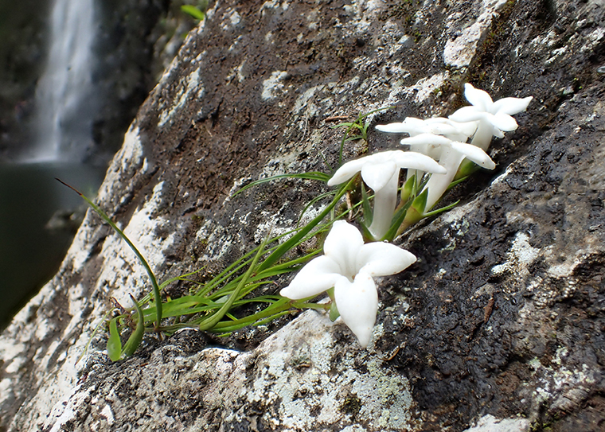



Models of phylogenetic biogeography are used to estimate how historical processes have shaped the distribution of species in space over time. This page provides an overview for using the FIG model to study phylogenetic biogeography in RevBayes. Briefly, the FIG model builds upon the geographic state-dependent speciation-extinction (GeoSSE) model , a member of the larger SSE model family . The FIG model extends the GeoSSE model by allowing regional features to shape biogeographic rates . The purpose of FIG is to allow biologists to test new hypotheses that involve the timing and location of phylogenetic, biogeographic, and paleogeographic events.



The FIG tutorial series targets biologists who are familiar with phylogenetic models and are interested in the following topics in phylogenetic biogeography: phylogenetic and biogeographic model design, ancestral range estimation, testing associations between regional features with biogeographic rates, estimating regional biogeographic rates through time, and biogeographic dating of speciation times.

Tutorials in this series are:
- [Molecular phylogenetics](../timefig_dating/#molecular-phylogenetics)
- [GeoSSE model](../geosse/)
- [MultiFIG model](../multifig/)
- [TimeFIG model](../timefig_simple/)
- [Biogeographic dating with node age priors](../timefig_dating/#biogeographic-dating-with-node-calibration)
- [Biogeographic dating with TimeFIG](../timefig_dating/#biogeographic-dating-with-timefig)



The FIG tutorials are designed to be run with [RevBayes](https://github.com/revbayes/revbayes) using the TensorPhylo plugin. Developed by Mike May and Xavier Meyer, TensorPhylo is a high-performance library for rapidly computing state-dependent diversification model likelihoods.

> ## Important version info!
> **Note:** Tutorials in this series currently require specific versions of [RevBayes](https://github.com/revbayes/revbayes/commit/55c8174ea696fbd580daad8383d58f7ffd444d43) and [TensorPhylo](https://bitbucket.org/mrmay/tensorphylo/commits/daa0aed2c4acd394e2cb098b1c3706633d5b8301) to run properly (see linked branches and commits).
>
> We recommend that you complete the tutorials using a [PhyloDocker](https://hub.docker.com/r/sswiston/phylo_docker) container, which is pre-configured with the above versions of RevBayes and TensorPhylo. Instructions to install and use PhyloDocker are here: [link](https://revbayes.github.io/tutorials/docker).
{:.info}



Island archipelagos are ideal microcosms for studying biogeographic patterns of dispersal, speciation, and extinction. Among islands, the Hawaiian archipelago holds particular value for biogeographers in part because of its unique paleogeography. Each island in the Hawaiian "chain" is produced through volcanic eruption from a hotspot in the mid pacific and then moves northwest along a tectonic assembly line during which subsidence and erosion cause gradual decay. Thus, the Hawaiian chain acts as a geological time-capsule, with hundreds of progressively older, more eroded islands stretching northwest towards the arctic. The vast majority of Hawaiian biodiversity is concentrated within four larger, younger high island systems of varying age, Kauai (~6.1 Ma), Oahu (~4.1 Ma), Maui Nui(~2.5 Ma), and Hawaii(~1.2 Ma).

The age and origin of the many independent radiation of plants, animals, and fungi that have occurred in Hawaii has been a perennial topic of evolutionary studies. One hypothesis that has been difficult to test concerns the age of onset of endemic hawaiian evolutionary radiations. The extreme isolation of the Hawaiian islands makes colonization from distant sources highly improbably, but various biogeographers have hypothesized that the now eroded northwest islands could have provided a landing pad for such lineages that is much older, making dispersal more likely, followed by dispersal to and subsequent radiation in the modern high islands.

Hawaiian *Kadua* (Rubiaceae) is a clade of 29 flowering plant taxa. They inhabit all the major High Island complexes, from Kauai to Hawaii, across a variety of habitat types, including forests, bogs, coastal regions, near waterfalls, and on basaltic remnants of lava flows. Previous work has shown Hawaiian *Kadua* forms a clade, possibly as the sister lineage to another clade of *Kadua* found in Polynesian islands in the South Pacific (Rapa Iti, Ua Huku, and Nuku Hiva).




*Kadua cookiana* basking by a waterfall. Photo by Ken Wood (NTBG).



Based in initial phylogenetic studies of *Kadua*, it is likely the Hawaiian Archipelago was colonized once by a progenitor lineage with multiple dispersal events between Hawaiian islands. However, there are no known fossils that could be used to date the age of Hawaiian *Kadua* lineages, making it difficult to estimate when, where, and how the clade dispersed, speciated, and went extinct as different Hawaiian islands formed, rose, eroded, and subsided.  

These tutorials will analyze an unpublished *Kadua* dataset that contains 26 Hawaiian taxa and 3 non-Hawaiian taxa. The geographic dataset includes 8 quantitative and 8 categorical paleogeographical features for 7 regions across 7 timeslices. The biogeographic dataset presence-absence data that records species ranges against the taxon set. In addition, we include a 2-region dataset to illustrate how GeoSSE models behave before moving to the 7-region dataset. Lastly, the molecular dataset includes 10 loci from a larger Angiosperms353 analysis.



This tutorial series was written for the 2024 Phylogenetic Biogeography Workshop in St. Louis. The workshop was made possible through an NSF-funded project entitled *Modeling the Origin and Evolution of Hawaiian Plants*. The botanical and biogeographical context of these tutorials was enriched through ongoing interactions with our project collaborators, Warren Wagner, Nina Rønsted, Bruce Baldwin, and Ken Wood. We also thank Mike May for his indispensable help adapting TensorPhylo for use with TimeFIG analyses for biogeographic dating. 
