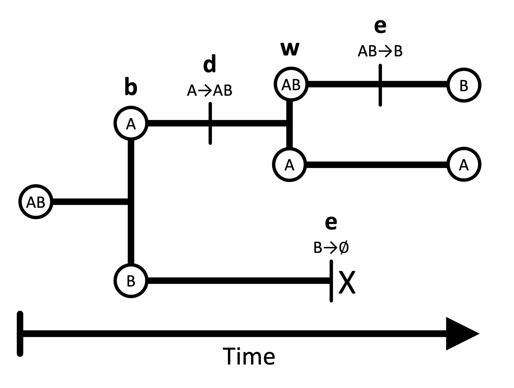
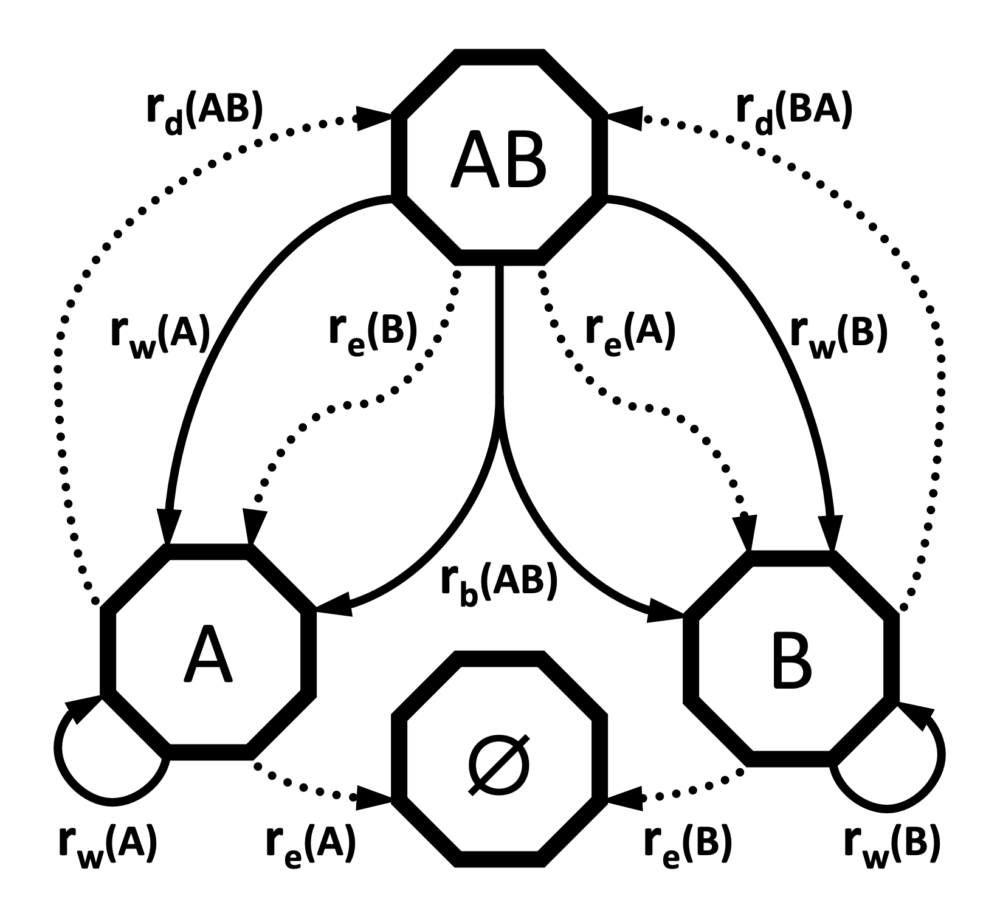



The geographic state-dependent speciation-extinction (or GeoSSE) model is phylogenetic model of biogeographic change . GeoSSE allows species to diversify through four main event classes: dispersal, extinction, within-region speciation, and between-region speciation. GeoSSE models are frequently used to test biogeographic hypotheses that concern relationships between these event rates and different regions. For example, is speciation faster on an island than on a mainland for a clade of ferns? Or, is dispersal faster into or out of the Andes for a clade of lizards?



In the GeoSSE model, lineage "states" represent possible geographic ranges, comprised of one or more discrete regions. For example, in a two-region scenario, there are three possible ranges: A, B, and AB. Lineages split and transition among these states according to four core processes: within-region speciation, local extinction (extirpation), between-region speciation, and dispersal (). Within- and between-region speciation are cladogenetic processes that create new phylogenetic lineages, which may inherit ranges that differ from the ancestral species. Extinction and dispersal are anagenetic processes, occurring along the branches of an evolutionary tree. Within-region speciation and extinction happen inside a single region, whereas between-region speciation and dispersal involve two or more regions ().





An example tree showing GeoSSE event types: within-region speciation (w), extinction (e), between-region speciation (b), and dispersal (d).



Here is a summary of the four event types:

- **Extinction** causes a species to lose one region from its range. Only when a species loses the final region from its range, does the entire species go entirely extinct as a lineage. A widespread lineage can only go extinct by losing each of its regions individually until one remains, then losing that last region. For example, a species with range AB might go extinct in region A, leaving it with range B. If it experiences no dispersal events (below) and suffers extinction in its last region B, the species is completely extinct.
- **Dispersal** causes a species to expand its range into a new region. The rate of range expansion is the sum of pairwise dispersal rates from each starting region into the new region. For example, a species with range A that disperses into region B afterwards has range AB.
- **Within-region speciation**: One daughter lineage inherits the entire ancestral range (which may be one or more regions), while the other daughter inherits a single region from the ancestral range. For example, the ancestral species has range AB and its two daughter species have ranges AB and A.
- **Between-region speciation**: The range of a widespread ancestral species in two or more regions is subdivided and inherited by two new daughter lineages. Between-region speciation rates are always symmetric (separation between A and B is the same as separation between B and A). For example, the widespread ancestor with range AB splits and give rise to daughters with ranges A and B.

The standard GeoSSE model does not allow for other kinds of evolutionary events. For example, an ancestor with a widespread range (of two or more regions) cannot produce daughters that both possess the entire ancestral range (a widespread sympatry scenario). In addition, GeoSSE only allows for a single event to occur within an instant of time.



|--------------------|-------------------------------|--------------------------------|
|                    | **Within region**             | **Between region**             |
|--------------------|-------------------------------|--------------------------------|
| **Anagenetic**     | Extinction (e)                | Dispersal (d)                  |
| **Cladogenetic**   | Within-region speciation (w)  | Between-region speciation (b)  |
|--------------------|-------------------------------|--------------------------------|


The four GeoSSE event classes.




The GeoSSE model allows each region or region pair to possess its own rate for each process. For example, the within-region speciation rate for region A may not necessary equal the within-region speciation rate for region B. Similarly, the dispersal rate from A to B does not necessarily equal the dispersal rate from B to A. When constructing the GeoSSE model, each rate will be represented with its own parameter. We will represent these rates with the following vectors and matrices: $r_w$ for the vector of within-region speciation rates, $r_e$ for  the vector of extinction rates, $r_b$ for the matrix of between-region speciation rates, and $r_d$ for the matrix of dispersal rates.




Transition diagram for the GeoSSE model with two regions, based on Figure 1 from . Anagenetic processes are represented with dashed arrows, while cladogenetic processes are represented with solid arrows.



As the name suggests, GeoSSE is a member of a broader class of methods that include state-dependent diversification -- that is, the discrete character state of a lineage may impact its rates of speciation, extinction, and state transition. These models are known as [SSE](https://revbayes.github.io/tutorials/sse/bisse-intro.html) models. Other examples of SSE models include [BiSSE](https://revbayes.github.io/tutorials/sse/bisse.html) (binary state speciation and extinction model) and [ClaSSE](https://revbayes.github.io/tutorials/sse/classe.html) (cladogenetic state change speciation and extinction model). For more information about how these methods jointly model character evolution and the birth-death process, see the associated tutorials. The GeoSSE model is a special case of the ClaSSE model that is structured and parameterized for biogeographical scenarios.

This tutorial gives a step-by-step explanation of how to perform a GeoSSE analysis in RevBayes. We will model the evolution and biogeography of the Hawaiian *Kadua* using two regions: old islands, and young islands. For more information on *Kadua* and the Hawaiian islands, you can visit the [intro tutorial](https://revbayes.github.io/tutorials/fig_intro/fig_intro.html) for the *Kadua* series.

NOTE: Although this tutorial is written for a two-region biogeographic analysis, it is designed to be applicable to analyses involving more regions. In general, we anticipate it should perform well for as many as eight regions (255 distinct ranges) or more with additional optimizations. However, for the purposes of this tutorial, we group the Hawaiian islands into two categories so that we can easily enumerate all of the model rates.


> ## Important version info!
> **Note:** This tutorial currently requires specific versions of [RevBayes](https://github.com/revbayes/revbayes/commit/55c8174ea696fbd580daad8383d58f7ffd444d43) and [TensorPhylo](https://bitbucket.org/mrmay/tensorphylo/commits/daa0aed2c4acd394e2cb098b1c3706633d5b8301) to run properly (see linked branches and commits).
> 
> We recommend that you complete the tutorial using a [PhyloDocker](https://hub.docker.com/r/sswiston/phylo_docker) container, which is pre-configured with the above versions of RevBayes and TensorPhylo. Instructions to install and use PhyloDocker are here: [link](https://revbayes.github.io/tutorials/docker).
{:.info}

Running a GeoSSE analysis in RevBayes requires two important data files: a file representing the time-calibrated phylogeny and a biogeographic data matrix describing the ranges for each species. In this tutorial, `kadua.tre` is a time-calibrated phylogeny of *Kadua*. `kadua_range_n2.nex` assigns ranges to each species for a two-region system: an "old islands" region and a "young islands" region. For each species (row) and region (column), the file reports if the species is present (1) or absent (0) in that region.

If you prefer to run a single script instead of entering each command manually, the RevBayes script called `geosse.Rev` contains all of the commands that are used in the tutorial. The data and script can be found in the `Data files and scripts` box in the left sidebar of the tutorial page. Somewhere on your computer, you should create a directory (folder) for this tutorial. This is the main directory for the tutorial, and you will run all of your commands from here. Inside the tutorial directory, you should create a `scripts` directory. This is the directory where you put the `geosse.Rev` script. Then, you should create a `data` directory inside the tutorial directory, and download the two datafiles to this directory.





After starting up RevBayes from within your main tutorial directory, you can load the TensorPhylo plugin. You will need to know where you downloaded the plugin. For example, if you cloned the TensorPhylo directory into your home directory at `~/tensorphylo`, you would use the following command to load the plugin:

```
loadPlugin("TensorPhylo", "~/tensorphylo/build/installer/lib")
```

Note that if you're using the PhyloDocker image, then the Tensorphylo plugin is installed in `/.plugins`, where RevBayes is able to find it without including a filepath:

```
loadPlugin("TensorPhylo")
```

We also want to tell RevBayes where to find our data (and where to save our output later). If you have set up your tutorial directory in a different way than suggested, you will need to modify the filepaths.

```
# FILESYSTEM
fp          = "./"
dat_fp      = fp + "data/"
out_fp      = fp + "output/"
bg_fn       = dat_fp + "kadua_range_n2.nex"
phy_fn      = dat_fp + "kadua.tre"
lbl_fn      = dat_fp + "kadua_range_label_n2.nex"
```



Next, we will read in the data. Let's start with the phylogenetic tree.

```
phy <- readTrees(phy_fn)[1]
```

In order to set up our analysis, we will want to know some information about this tree: the root age, the taxa and their names, and the number of taxa.

```
tree_height <- phy.rootAge()
taxa = phy.taxa()
num_taxa = taxa.size()
```

We also want to read in the range data.

```
bg_01 = readDiscreteCharacterData(bg_fn)
```

We want to get some information about this range data: how many regions there are, how many ranges can be constructed from these regions, and how many region pairs there are.

```
num_regions = bg_01.nchar()
num_ranges = abs(2^num_regions - 1)
num_pairs = num_regions^2 - num_regions
```

Finally, we want to format the range data to be used in a GeoSSE analysis. This will take the binary range data and output integer states. Note that the integers used to represent ranges are first sorted by range size, then sorted by range patterns given each size-class, following general format of the table in the [Introduction to Phylogenetic Models of Discrete Biogeography](https://revbayes.github.io/tutorials/biogeo/biogeo_intro.html) tutorial.

```
bg_dat = formatDiscreteCharacterData(bg_01, format="GeoSSE", numStates=num_ranges)
```

The range assignments for this exercise with two regions are:



|---------|----------|---------|
| Range   | Vector   | State   |
|---------|----------|---------|
| A       | 10       | 1       |
| B       | 01       | 2       |
| AB      | 11       | 3       |
|---------|----------|---------|


Species ranges as region-sets, presence-absence vectors, and numerical states for two-region system.



If you are interested in learning how to set up the GeoSSE rates manually without using the `formatDiscreteCharacterData` function, or if you want to further customize the model (ie. GeoHiSSE), the [ClaSSE](https://revbayes.github.io/tutorials/sse/classe.html) tutorial gives an example of hand-coded rates. 




In the GeoSSE model, there are four processes: within-region speciation, extinction, between-region speciation, and dispersal. For each process, each distinct event is assigned its own rate that depends on the involved regions or region pairs. This will result in two rate vectors `r_w` and `r_e` with lengths equal to the number of regions, and two square rate matrices `r_b` and `r_d` with a number of entries equal to the number of region pairs. We will construct the event rates by multiplying the region- or pair-specific relative rate parameters in `m_x` for each event class $x \in { w, e, b, d}$ against the appropriate base rate parameter `rho_x` to produce the absolute rates `r_x`. All `rho_x` parameters will be drawn from the exponential distribution `dnExp(1)`. We will use Dirichlet distributions to generate relative rates.

We will set up within-region speciation rates first.

```
rho_w ~ dnExp(1)
m_w_simplex ~ dnDirichlet(rep(1,num_regions))
m_w := m_w_simplex * num_regions
r_w := rho_w * m_w
```

To obtain our vector of relative rates, `m_w`, we first create the simplex `m_w_simplex`, which is a vector containing `num_regions` random values that will be estimated, where each value is between 0 and 1 and all values sum to 1. The Dirichlet(1) distribution assigns equal probability to any combination of values in the simplex, making it a "flat prior". Setting the alpha value to be large sets higher prior probability on relative rates being similar to one another. We design the model in this way so that users can better control how relative rates of within-region speciation are distributed among regions. We then multiply `m_w_simplex` by `num_regions` to produce the mean relative rate value of 1 for any region represented in the resulting relative rate vector, `m_w`. Lastly, we multiply these relative rates by the absolute scaling factor, `rho_w`, to obtain our vector of absolute rates, `r_w`.

Extinction rates are set up similarly. The same general logic applies as before. However, these rates are applied only to extinction and not to within-region speciation.

```
rho_e ~ dnExp(1)
m_e_simplex ~ dnDirichlet(rep(1,num_regions))
m_e := m_e_simplex * num_regions
r_e := rho_e * m_e
```

From these extinction rates (which are actually single-region extinction rates), we will set up lineage-level extinction rates for each possible range in the state space. In the GeoSSE model, lineage-level extincion events occur when a species goes globally extinct (i.e. it loses the last region from its range). Therefore, we will assign all multi-region ranges an extinction rate of 0, and we will assign all single-region ranges an extinction rate equal to the local extirpation rate. Note, ranges are numbered such that indices `1`, `2`, through `num_regions` correspond to ranges that respectively contain only region 1, region 2, up through the last region in the system.

```
for (i in 1:num_ranges) {
    mu[i] <- 0.0
    if (i <= num_regions) {
        mu[i] := r_e[i]
    }
}
```

For between-region speciation, we want to assign rates to each region pair. However, we want these rates to be symmetric, so we only want `num_pairs/2` unique values. The same value will be assigned to `m_b[i][j]` as `m_b[j][i]`. We can do this by creating an initial simplex from a Dirichlet distribution, and assigning successive values from this simplex as we traverse the `m_b` matrix.

```
rho_b ~ dnExp(1)
m_b_simplex ~ dnDirichlet(rep(1,num_pairs/2))
m_b_idx = 1
for (i in 1:num_regions) {
    m_b[i][i] <- 0.0
    for (j in 1:num_regions) {
        if (i < j) {
            m_b[i][j] := abs(m_b_simplex[m_b_idx] * num_pairs)
            m_b[j][i] := abs(m_b_simplex[m_b_idx] * num_pairs)
            m_b_idx += 1
        }
        r_b[i][j] := rho_b * m_b[i][j]
    }
}
```

For a two-region system with just one pair of regions, `m_b_simplex` will contain only a single relative-rate factor with the value of 1. That means the value of `r_b` for between-region speciation is driven entirely by `rho_b`. However, when the code is used for analyses with `num_regions > 2`, the simplex `m_b_simplex` will contain different values. By allowing these values to vary, we allow widespread ranges to split into daughter ranges at different rates depending on the resulting split. These rates are computed using a range-split score , which we will not cover in this tutorial (RevBayes will complete this calculation automatically).

Finally, for dispersal rates, we want to assign rates to each region pair. These rates are allowed to be asymmetric, so we need `num_pairs` unique values.

```
rho_d ~ dnExp(1)
m_d_simplex ~ dnDirichlet(rep(1,num_pairs))
m_d_idx = 1
for (i in 1:num_regions) {
    m_d[i][i] <- 0.0
    for (j in 1:num_regions) {
        if (i != j) {
            m_d[i][j] := abs(m_d_simplex[m_d_idx++] * num_pairs)
        }
        r_d[i][j] := rho_d * m_d[i][j]
    }
}
```

From these rates, we can use RevBayes functions to construct the rate matrices used by the analysis. The first is an anagenetic rate matrix, which gives rates of anagenetic processes. We are not restricting the number of regions that a species can live in at any given time, so we set the `maxRangeSize` equal to the number of regions. Settings `maxRangeSize` may be used to reduce the number of range patterns in the model, particularly when `num_regions` is large.

```
Q_bg := fnBiogeographyRateMatrix(
    dispersalRates=r_d,
    extirpationRates=r_e,
    maxRangeSize=num_regions
)
```

We also construct a cladogenetic event matrix, describing the absolute rates of different cladogenetic events. We are not restricting the sizes of 'split' subranges following between-region speciation, so we set the `max_subrange_split_size` equal to the number of regions. From this matrix, we can obtain the total speciation rates per state, as well as a cladogenetic probability matrix.

```
clado_map := fnBiogeographyCladoEventsBD(
    speciation_rates=[rho_w,rho_b],
    within_region_features=m_w,
    between_region_features=m_b,
    max_range_size=num_regions,
    max_subrange_split_size=num_regions
)
lambda := clado_map.getSpeciationRateSumPerState()
omega := clado_map.getCladogeneticProbabilityMatrix()
```

Lastly, we need to assign a probability distribution to range of the most recent common ancestor of all species, prior to the first speciation event. In this analysis, we will assume all ranges were equally likely for that ancestor.

```
pi_base <- rep(1,num_ranges)
pi <- simplex(pi_base)
```

With all of the rates constructed, we can create a stochastic variable drawn from this GeoSSE model with state-dependent birth, death, and speciation processes. This establishes how the various processes interact to generate a tree with a topology, divergence times, and terminal taxon states (ranges). Then we can clamp the variable with the fixed tree and present-day range states, allowing us to infer model parameters based on our observed data.

We will use the `dnGLHBDSP` distribution that interfaces with the Tenorsphylo plugin to model a Generalized Lineage Heterogeneous Birth Death Sampling Process, which is a generalized model (as the name suggests) that can express simpler models, such as GeoSSE models.

Although most of the model variable arguments provided to construct the `timetree` variable have been described above, we pass a few additional arguments to define how we compute the model likelihood. First, we instruct the model to condition on the process evolving for `tree_height` units of time by setting `condition="time"`. Alternatively, `condition` can be used to condition on the process e.g. producing a given number of taxa or surviving until the present (producing >2 taxa). Second, we permit Tensorphylo to use four processors with `nProc=4` to speed up computation.

```
timetree ~ dnGLHBDSP(
    rootAge     = tree_height,
    lambda      = lambda,
    mu          = mu,
    eta         = Q_bg,
    omega       = omega,
    pi          = pi,
    rho         = 1.0,
    condition   = "time",
    taxa        = taxa,
    nStates     = num_ranges,
    nProc       = 4
)
timetree.clamp(phy)
timetree.clampCharData(bg_dat)
```



For this analysis, we will perform a short MCMC of 1000 generations, with 100 generations of hyperparameter-tuning burnin. An analysis of this length may not achieve convergence, so these settings should only be used for testing purposes. You can alter this MCMC by changing the number of iterations, the length of the burnin period, or the move schedule. We will also set up the MCMC to record every 10 iterations.

```
n_gen = 1000
n_burn = 100
printgen = 10
```

We want MCMC to update all of the base rate `rho` parameters, as well as the relative rate Dirichlet simplexes. We will use a scaling move for the base rates, since they should always have positive values. These moves will each be performed once per iteration. Simplexes have a unique kind of move in RevBayes. Instead of performing one simplex move per generation, we will make the number of moves per iteration equal to the number of elements in the simplex.

```
mvi = 1
mv[mvi++] = mvScale(rho_w, weight=1)
mv[mvi++] = mvScale(rho_e, weight=1)
mv[mvi++] = mvScale(rho_b, weight=1)
mv[mvi++] = mvScale(rho_d, weight=1)
mv[mvi++] = mvSimplex(m_e_simplex, weight=m_e.size())
mv[mvi++] = mvSimplex(m_w_simplex, weight=m_w.size())
mv[mvi++] = mvSimplex(m_b_simplex, weight=m_b_simplex.size())
mv[mvi++] = mvSimplex(m_d_simplex, weight=m_d_simplex.size())
```

We also want MCMC to keep track of certain things while it runs. We want it to print some output to the screen so we can see how it is running (`mnScreen`). We also want it to save model parameters to a file (`mnModel`). Finally, if we want to use the output for ancestral state reconstruction, we want to save states and stochastic character mappings (`mnJointConditionalAncestralStates` and `mnStochasticCharacterMap`). All of the output files will be saved in the `output` directory so that it can be accessed later.

```
mni = 1
mn[mni++] = mnScreen(printgen=printgen)
mn[mni++] = mnModel(printgen=printgen, filename=out_fp+"model.log")
mn[mni++] = mnJointConditionalAncestralState(glhbdsp=timetree, tree=timetree, printgen=printgen, filename=out_fp+"states.log", withTips=true, withStartStates=true, type="NaturalNumbers")
mn[mni++] = mnStochasticCharacterMap(glhbdsp=timetree, printgen=printgen, filename=out_fp+"stoch.log")
```

Let's also store information for how the integer-valued ranges (0, 1, 2) relate to the regional presence-absence representation of ranges (A=10, B=01, AB=11).

```
write("index,range\n", file=lbl_fn)
state_labels = Q_bg.getStateDescriptions()
for (i in 1:state_labels.size()) {
    write( (i-1), ",", state_labels[i], "\n", file=lbl_fn, append=true, separator="")
}
```


Then we can start up the MCMC. It doesn't matter which model parameter you use to initialize the model, so we will use `m_w`. RevBayes will find all the other parameters that are directly or indirectly connected to `m_w` and include them in the model as well. Then we create an MCMC object with the moves, monitors, and model, add burnin, and run the MCMC.

```
mdl = model(m_w)
ch = mcmc(mv, mn, mdl)
ch.burnin(n_burn, tuningInterval=50)
ch.run(n_gen)
```

After the MCMC analysis has concluded, we can summarize the ancestral states we obtained, creating an ancestral state tree. This tree will be written to the file `ase.tre`. It may take a little while.

```
f_burn = 0.2
x_stoch = readAncestralStateTrace(file=out_fp+"stoch.log")
x_states = readAncestralStateTrace(file=out_fp+"states.log")
summarizeCharacterMaps(x_stoch,timetree,file=out_fp+"events.tsv",burnin=f_burn)
state_tree = ancestralStateTree(tree=timetree,
                   ancestral_state_trace_vector=x_states,
                   include_start_states=true,
                   file=out_fp+"ase.tre",
                   summary_statistic="MAP",
                   reconstruction="marginal",
                   burnin=f_burn,
                   nStates=3,
                   site=1)
writeNexus(state_tree,filename=out_fp+"ase.tre")
```



One interesting thing we can do with the output of the GeoSSE analysis is plot ancestral states. This can be done using [RevGadgets](https://github.com/revbayes/RevGadgets), an R packages that processes RevBayes output. You can use R to generate a tree with ancestral states by executing the following code in R. You can also examine the output files, like `model.txt`, to assess the relative rates of different processes occurring in different regions.

NOTE: Your output may look slightly different than the output shown below. If you want to exactly replicate the results of the tutorial, you must set a seed at the beginning of the `geosse.Rev` script by adding the RevBayes command `seed(1)`.

```
library(RevGadgets)
library(ggplot2)
tree_file = "./output/ase.tre"
output_file = "./output/states.png"
states <- processAncStates(tree_file, state_labels=c("0"="Old", "1"="Young", "2"="Both"))
plotAncStatesMAP(t=states,
                 node_size=2,
                 node_size_as=NULL) +
                 ggplot2::theme(legend.position="bottom",
                                legend.title=element_blank())
ggsave(output_file, width = 9, height = 9)
```




Ancestral state reconstruction of *Kadua*.






As noted above, the script is written generally, so it can be applied to biogeographic systems with more than two regions. Consider re-running the script, but instead using the seven-region dataset from the [FIG](https://revbayes.github.io/tutorials/multifig.html) tutorial: [link to `kadua_range_n7.nex`](http://revbayes.github.io/tutorials/multifig/data/kadua/kadua_range_n7.nex).

How many species ranges are there in a three-region versus a seven-region system? How many parameters are there in a three-region versus a seven-region system? Which processes require the most new parameters as the number of regions increases? What problems do you expect to encounter running this GeoSSE script for an analysis with more regions?




