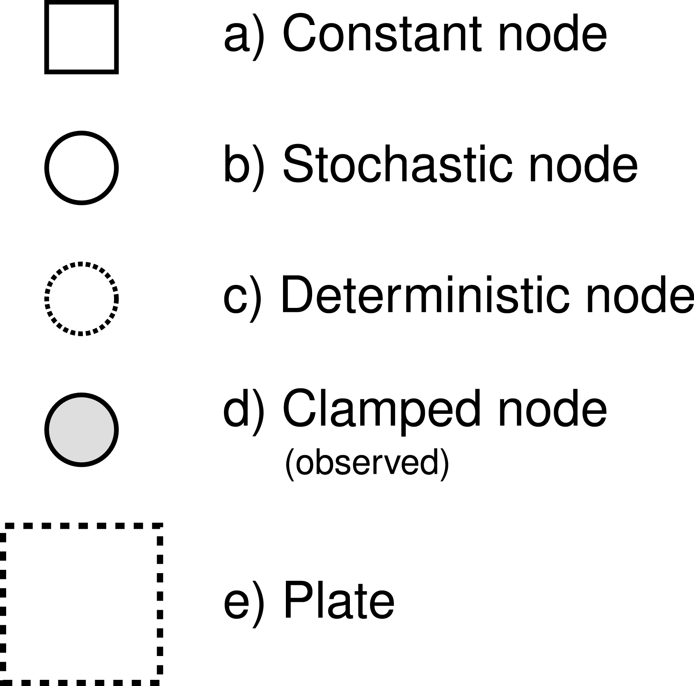
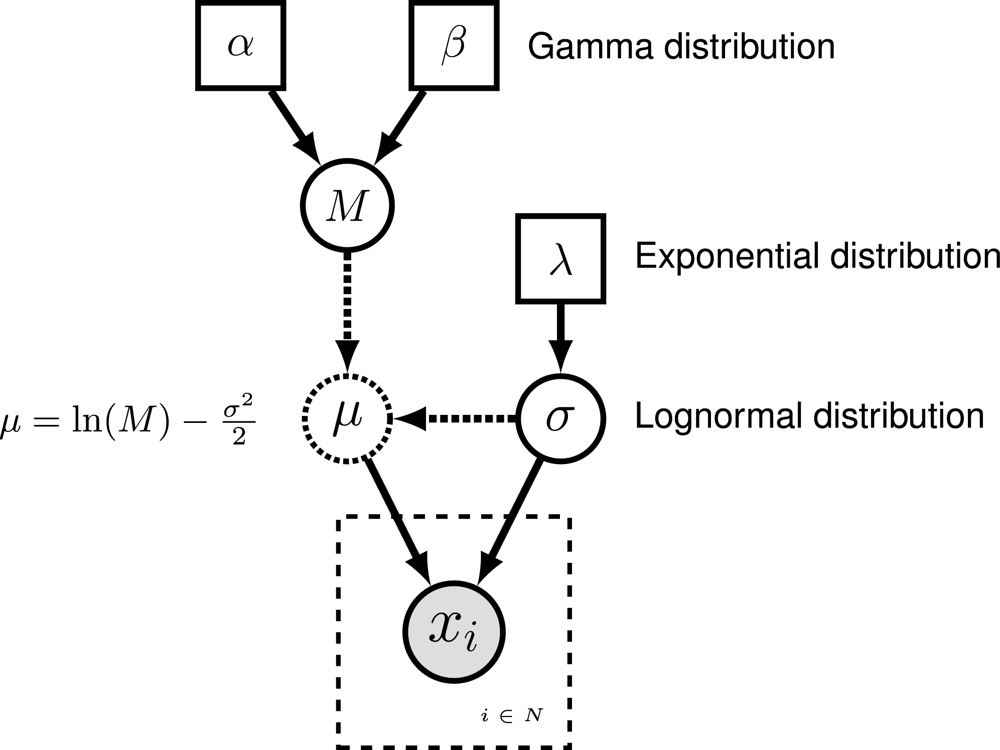

Overview
========
{:.section}

RevBayes has as its central idea that any statistical model, for
example a phylogenetic model, is composed of smaller parts that can be
decomposed and put back together in a modular fashion .
This comes from considering (phylogenetic) models as *probabilistic
graphical models*, which lends flexibility and enhances the capabilities
of the program. Users interact with RevBayes via an interactive shell.
Users communicate commands using a language specifically designed for
RevBayes, called `Rev`; an R-like language (complete with control
statements, user-defined functions, and loops) that enables the user to
build up (phylogenetic) models from simple parts (random variables,
variable/parameter transformations, models, and constants of different
sorts).

Here we assume that you have successfully installed RevBayes. If this
isn't the case, then please consult our website on how to install
RevBayes.


Getting Started
===============
{:.section}

For the examples outlined in each tutorial, we will use RevBayes
interactively by typing commands in the command-line console. For the
exercises you can either use RevBayes interactively or run an entire
script. Execute the RevBayes binary. If this program is in your path,
then you can simply type in your Unix terminal:

```
rb
```
{:.bash}

When you execute the program, you will see a brief program information,
including the current version number. Remember that more information can
be obtained from [revbayes.github.io](https://revbayes.github.io/). When you execute
the program with an additional filename,
*e.g.,*

```
rb my_analysis.Rev
```
{:.bash}

then RevBayes will run all commands specified in your file.

You may want to run RevBayes in parallel using multiple processes.
This can be done by starting RevBayes with

```
mpirun -np 4 rb-mpi
```
{:.bash}

which starts 4 processes of RevBayes. You may want to change the
number of processes depending on your available hardware.

The format of the exercises uses to delineate code examples that you
should type into RevBayes. For example, after opening the RevBayes
program, you can load your data file:
```
data <- readDiscreteCharacterData("data/primates_cytb.nex")
```
Examples can be copied and pasted directly as the RevBayes "&gt;" will not be copied. This is especially useful for larger command blocks, particularly loops, which will often
be displayed in boxes
```
for( i in 1:12 ){
   x[i] ~ dnExponential(1.0)
}
```
The various RevBayes commands and syntax within the text are specified
using `typewriter text`.

Most tutorials also includes hyperlinks: bibliographic citations such as 
 which link to the full citation in the references, external URLs such as [lognormal
distribution](http://en.wikipedia.org/wiki/Log-normal_distribution), and
internal references to figures and equations such as .

The various exercises in this tutorial take you through the steps
required to perform phylogenetic analyses of the example datasets. In
addition, we have provided the `Rev` scripts and output files for some
exercises so you can verify your results. (Note that since the MCMC runs
you perform will start from different random seeds, the output files
resulting from your analyses *will not* be identical to the ones we
provide you.)


Probabilistic Graphical Models
==============================
{:.section}

RevBayes uses *probabilistic graphical models* for model
specification, visualization, and implementation .
Graphical models are frequently used in machine learning and statistics
to conceptually represent the conditional dependence structure of
complex statistical models with many parameters
{% cite Gilks1994} {% cite Lunn2000} {% cite Jordan2004} {% cite Koller2009} . The
graphical model framework allows for flexible model specification and
implementation and reduces redundant code. This framework provides a set
of symbols for depicting a [*directed acyclic
graph*](http://en.wikipedia.org/wiki/Directed_acyclic_graph) (DAG).
 described the use of probabilistic graphical models for
phylogenetics. The different nodes and components of a phylogenetic
graphical model are shown in  [Fig. 1 from
].


  

*The symbols for a
visual representation of a graphical model. a) Solid squares represent
constant nodes, which specify fixed-valued variables. b) Stochastic
nodes are represented by solid circles. These variables correspond to
random variables and may depend on other variables. c) Deterministic
nodes (dotted circles) indicate variables that are determined by a
specific function applied to another variable. They can be thought of as
variable transformations. d) Observed states are placed in clamped
stochastic nodes, represented by gray-shaded circles. e) Replication
over a set of variables is indicated by enclosing the replicated nodes
in a plate (dashed rectangle). [Partially reproduced from Fig. 1 in
.]*



To represent the DAG, nodes are connected with arrows indicating
dependency. A simple, albeit abstract, graphical model is shown in
. In this model, we observe a set of states for
parameter $x$. We assume that the values of $x$ are samples from a
lognormal distribution with a location parameter (log mean) $\mu$ and a
standard deviation $\sigma$. It is more straightforward to model our
uncertainty in the expectation of a lognormal distribution, rather than
$\mu$, thus we place a gamma distribution on the mean $M$. This gamma
hyperprior has two parameters that we specify with fixed values
(constant nodes): the shape $\alpha$ and rate $\beta$. The variable $M$
is a stochastic node with this prior density. The standard deviation,
$\sigma$, is also a stochastic node with an exponential prior density
with rate parameter $\lambda$. For any value of $M$ and any value of
$\sigma$ we can compute the deterministic variable $\mu$ using the
formula $\mu = \ln(M) - \frac{\sigma^2}{2}$. This formula is known from
using simple algebra on the equation for the mean of any [lognormal
distribution](http://en.wikipedia.org/wiki/Log-normal_distribution).
With this model structure, we can then calculate the probability of the
data conditional on the model and parameter values (the likelihood):
$\mathbb{P}(\boldsymbol{x} \mid \mu, \sigma)$. Next we can get the
posterior probability using Bayes' theorem:
$$\mathbb{P}(M,\sigma \mid \boldsymbol{x}, \alpha, \beta, \lambda) = \frac{\mathbb{P}(\boldsymbol{x} \mid \mu, \sigma) \mathbb{P}(M \mid \alpha,\beta) \mathbb{P}(\sigma \mid \lambda)}{\mathbb{P}(\boldsymbol{x})}.$$



  

*Graphical model
representation of a simple lognormal model. A total of $N$ observations
of variable $x$ are observed and occupy a clamped node. This parameter
is log-normally distributed with parameters $\mu$ and $\sigma$ (log mean
and standard deviation, respectively). The parameter $\mu$ is a
deterministic node that is calculated from the stochastic nodes $M$ (the
mean of the distribution) and $\sigma$. Dotted arrows indicate
deterministic functions and are used to connect deterministic nodes to
their parent variables. A gamma distribution is applied as a hyperprior
on $M$ with constant nodes for the shape $\alpha$ and rate $\beta$.The
stochastic variable $\sigma$ is exponentially distributed with fixed
value for the rate $\lambda$.*




`Rev`: The RevBayes Language
==============================
{:.section}

In RevBayes models and analyses are specified using an interpreted
language called `Rev`. `Rev` bears similarities to the compiled language
in WinBUGS and the interpreted `R`language. Setting up and
executing a statistical analysis in RevBayes requires the user to
specify all of the parameters of their model and the type of analysis
(*e.g.,*an MCMC run). By using an interpreted
language, RevBayes enables the practitioner to build complex,
hierarchical models and to check the current states of variables while
building the model. This will be very useful in the beginning. Later on
you, when you run very complex analyses, you may want to write
`Rev`-scripts.

Differently to `R`and BUGS, `Rev` is a strongly but
implicitly typed language. It is implicitly typed, and thus similar to
Python, because you do not need to provide the type of a variable (which
you need to in languages such as C++ and Java). We do implicit typing to
help users who do not know about the actual types of the variables.
However, strongly typed means that every variable has a type and
arguments of functions need to match the required types. The strong type
requirements ensures that you build meaningful model graphs. For
example, the variance parameter of a normal distribution needs to be a
positive number, and thus you can only use variables that are positive
real numbers. RevBayes does automatic type conversion.

Specifying Models
-----------------
{:.subsection}

  


`Rev` assignment operators, clamp function, and plate/loop syntax.


 |     **Operator**     |         **Variable**         |
  --------------------- |:----------------------------:|
 |         `<-`         |      constant variable       |  
 |          `~`         |     stochastic variable      |  
 |         `:=`         |    deterministic variable    |  
 |  `node.clamp(data)`  |       _observed/fixed_ stochastic variable       |  
 |          `=`         | inference (*i.e.,*non-model) variable  |  
 | `for(i in 1:N){...}` |             plate            |  



The variables/parameters of a statistical model are created using
different operators in `Rev` (). In Figure
[revgmexample], the `Rev` syntax for creating the model in Figure
[simpleGM] is provided. Because `Rev` is an interpreted language, it
is important to consider the order in which you specify your variables
(*cf.*BUGS where the order is not important).
Thus, typically the first variables that are instantiated are *constant
variables*. Constant variables require you to assign a fixed value using
the `<-` operator. Stochastic variables are initialized using the `~`
operator followed by the constructor function for a distribution. In
`Rev`, the naming convention for distributions is `dn*`, where `*` is
a wildcard representing the name of the distribution. Each distribution
function requires hyperparameters passed in as arguments. This is
effectively linking nodes using arrows in the graphical model. The
following code snippet creates a stochastic variable called `M` which is
assigned a gamma-distributed hyperprior, with shape `alpha` and rate
`beta`:
```
alpha <- 2.0
beta <- 4.0
M ~ dnGamma(alpha, beta)
```
The flexibility gained from the graphical model framework and the
interpreted language allows you to easily change a model by swapping
components. For example, if you decide that a bimodal lognormal
distribution is a better representation of your uncertainty in `M`, then
you can simply change the distribution associated with `M` (after
initializing the bimodal lognormal hyperparameters):
```
mean_1 <- 0.5
mean_2 <- 2.0
sd_1 <- 1.0
sd_2 <- 1.0
weight <- 0.5
M ~ dnBimodalLognormal(mean_1, mean_2, sd_1, sd_2, weight)
```
`Rev` does allow you to specify constant-variable values in the
distribution constructor function; therefore this also works:
```
M ~ dnBimodalLognormal(0.5, 2.0, 1.0, 1.0, 0.5)
```
Both ways to specify priors are equivalent. The only difference is that
one code may be more readable than the other.


  

Specifying a model with
`Rev`. The graphical model of the observed parameter $x$ is shown on the
left. In this example, $x$ is log-normally distributed with a location
parameter of $\mu$ and a standard deviation of $\sigma$, thus
$x \sim \mbox{Lognormal}(\mu, \sigma)$. The expected value of $x$ (or
mean) is equal to $M$: $\mathbb{E}(x) = M$. In this model, $M$ and
$\sigma$ are random variables and each are assigned hyperpriors. We
assume that the mean is drawn from a gamma distribution with shape
parameter $\alpha$ and rate parameter $\beta$:
$M \sim \mbox{Gamma}(\alpha, \beta)$. The standard deviation of the
lognormal distribution is assigned an exponential hyperprior with rate
$\lambda$: $\sigma \sim \mbox{Exponential}(\lambda)$. Since we are
conditioning our model on the *expectation*, we must compute the
location parameter ($\mu$) to calculate the probability of our model.
Thus, $\mu$ is a deterministic node that is the result of a
function executed on $M$ and $\sigma$:
$$\mu = \ln(M) - \frac{\sigma^2}{2}$$. Since we observe values of $x$, we
*clamp* this node. 


Deterministic variables are parameter transformations and initialized
using the `:=` operator followed by the function or formula for
calculating the value. Previously we created a variable for the
expectation of the lognormal distribution. Now, if you have an
exponentially distributed stochastic variable $\sigma$, you can create a
deterministic variable for the mean $\mu$:
```
lambda <- 1.0
sigma ~ dnExponential(lambda)
mu := ln(M) - (sigma^2)/2.0
```
Replication over lists of variables as a plate object is specified using
`for` loops. A for-loop is an iterator statement that performs a
function a given number of times. In `Rev` you can use this syntax to
create a vector of 7 stochastic variables, each drawn from a lognormal
distribution:
```
for( i in 1:7 ) {
   x[i] ~ dnLognormal(mu, sigma)
}
```
The `for` loop executes the statement `x[i] ~ dnLognormal(mu, sigma)` for different values of $i$ repeatedly, where $i$ takes the
values 1 to 7. Thus, we created a vector $x$ of seven variables, each
being independent and identically distributed (i.i.d.).

A clamped node/variable has observed data attached to it. Thus, you must
first read in or input the data, then clamp it to a stochastic variable.
In  the observations are assigned and clamped to
the stochastic variables. If we observed 7 values for $x$ we would
create 7 clamped variables:
```
observations <- [0.20, 0.21, 0.03, 0.40, 0.65, 0.87, 0.22]
N <- observations.size()
for( i in 1:N ){
   x[i].clamp(observations[i])
}
```
You may notice that the value of $x$ has now changed and is equal to the
observations.


Getting help in RevBayes
==========================
{:.section}

RevBayes provides an elaborate help system. Most of the help is found
online on our [website](https://revbayes.github.io/). Within RevBayes you can display the help for
a function, distribution or any other type using the `?` symbol followed
by the command you want help for:
```
?dnNorm
?mcmc
?mcmc.run
```
Additionally, RevBayes will print the correct usage of a function if
you only type in its name and hit return:
```
mcmc
```
~~~
       MCMC function (Model model, Monitor[] monitors, Move[] moves, String moveschedule = "sequential" | "random" | "single", Natural nruns)
~~~
{:.Rev-output}


RevBayes Users' Forum
---------------------
{:.subsection}

An email list has been created for users of RevBayes to discuss
RevBayes-related topics, including: RevBayes installation and use,
scripting and programming, phylogenetics, population genetics, models of
evolution, graphical models, etc. The forum is hosted by Google Groups: [revbayes-users](http://bit.ly/107aW2R)

