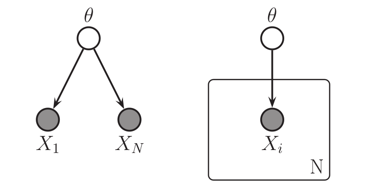
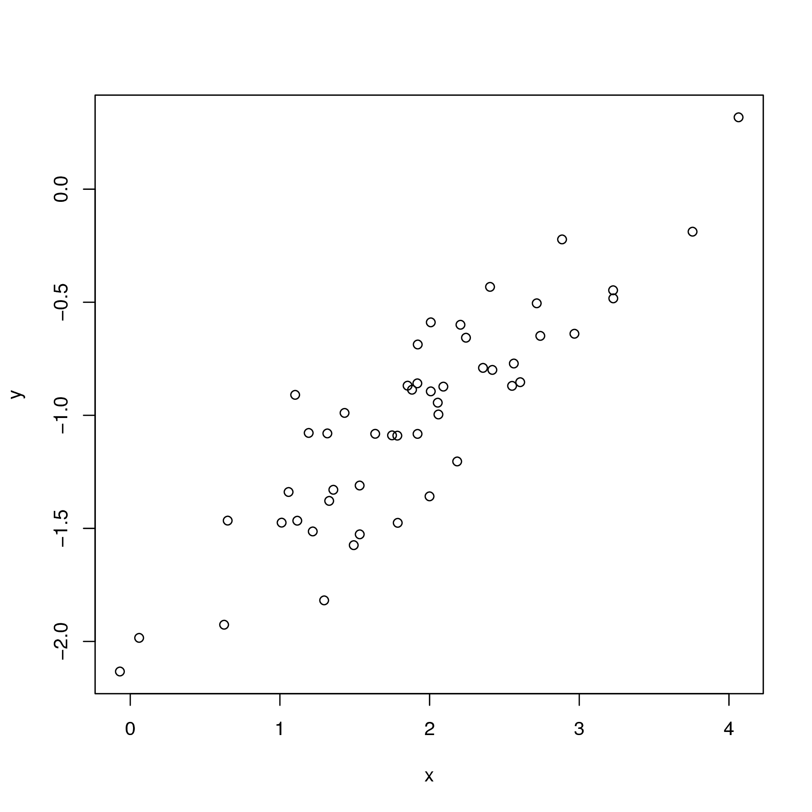
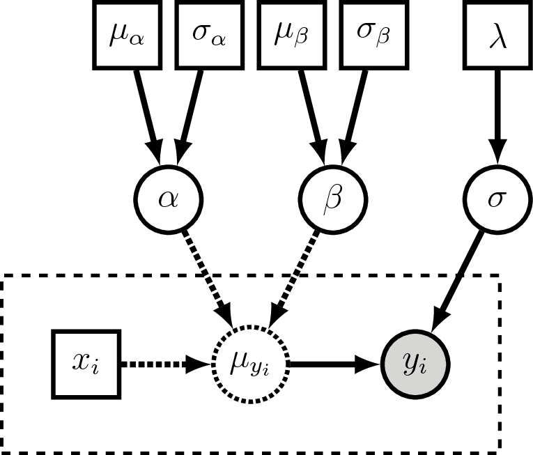
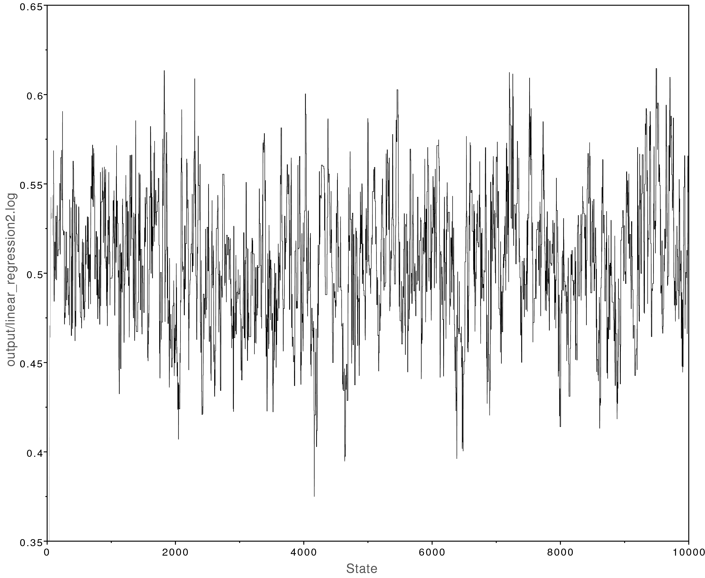

Overview
========
{:.section}

[RevBayes](http://revbayes.com) uses a *graphical model* framework in
which all probabilistic models, including phylogenetic models,
are comprised of modular components that can be assembled in a myriad of ways.
[RevBayes](http://revbayes.com) provides a highly flexible language called `Rev`
that users employ to specify their own custom graphical models.

This tutorial is intended to be a gentle introduction on how to use `Rev` to specify graphical models.
Additionally we'll cover how to use `Rev` to specify the Markov chain Monte Carlo (MCMC) 
algorithms used to perform inference with the model.
We will focus on a simple linear regression example,
and use [RevBayes](http://revbayes.com) to estimate the posterior distributions of our parameters.


Why Graphical Models?
=====================
{:.section}

[RevBayes](http://revbayes.com) is a fundamental reconception of phylogenetic software.
Most phylogenetic software have default settings that allow a user to run an analysis
without truly understanding the assumptions of the model.
[RevBayes](http://revbayes.com), on the other hand, has no defaults and is a complete
blank slate when started. [RevBayes](http://revbayes.com) requires users to 
fully specify the model they want to use for their analysis.
This means the learning curve is steep, however there are a number of benefits:

1. Transparency: All the modeling assumptions are explicitly specified in [RevBayes](http://revbayes.com). The `Rev` script that runs an analysis makes these assumptions clear and can be easily shared. The assumptions can easily be modified in the `Rev` script and then the analysis can be rerun to see how changes affect the results. There is no reliance on "defaults" that may change with different versions of the software.

2. Flexibility: Users are not limited by a small set of models the programmers hard coded, instead users can specify their own custom models uniquely tailored to their hypotheses and datasets. 

3. Modularity: Each model component can be combined with others in an endless number of new ways like a LEGO kit. Testing many complex evolutionary hypotheses require tying different models together. For example, suppose you wish to test how the effect of biographic range on trait evolution changes through time. In [RevBayes](http://revbayes.com) you could simultaneously infer a time-calibrated phylogeny and estimate biogeography-dependent trait evolution using molecular data, biogeographic range data, and morphological data from both fossils and extant lineages.


What is a Graphical Model?
==========================
{:.section}


  

*Left: a graphical model in which 
the observed data points $X_i$ are conditionally independent given $\theta$.
Right: the same graphical model using plate notation to represent the $N$ repeated $X_i$.
These graphical models represent the joint probability distribution
$$p(\theta,X_1,\dots,X_N)$$.
See  for a description of the visual symbols.
Image from *



A *graphical model* is a way to represent a joint multivariate probability distribution as a graph.
Here we mean *graph* in the mathematical sense of a set of nodes (vertices) and edges.
In a graphical model, the nodes represent variables and the edges represent conditional dependencies among the variables. 
There are three important types
of variables:

1. Constant nodes: represents a fixed value that will not change. 
2. Stochastic nodes: represents a random variable with a value drawn from a probability distribution.
3. Deterministic nodes: represents a deterministic transformation of the values of other nodes.

In the graphical modeling framework observed data is simply a variable with an observed value.
To specify that a node has an observed value associated with it we say that the
node is *clamped*, or fixed, to the observed value.
 illustrates the graphical model that represents the joint probability distribution

$$
\begin{aligned}
p(\theta,\mathcal{D}) = p(\theta) \Big[ \displaystyle\prod^N_{i=1} p(X_i|\theta) \Big],
\end{aligned}
$$

where $$\mathcal{D}$$ is the vector of observed data points $$X_1,\dots,X_N$$.

Nearly any probabilistic model can be represented as a graphical model: neural networks, classification models, time series models, and of course phylogenetic models!
In some literature the terms Bayesian networks, belief networks, or causal networks are sometimes used to refer to graphical models.


Visual Representation
---------------------
{:.subsection}

The statistics literature has developed a rich visual representation for graphical models.
Visually representing graphical models can be useful for communication and pedagogy.
We explain the notation used in the visual representation of these models only briefly 
(see ),
and enourage readers to see  for more details.
As we will discuss below, representing graphical models in computer code 
(using the `Rev` language)
will likely be the most useful aspect of graphical models to most readers.


  

*The symbols for a visual representation of a graphical
model. a) Solid squares represent constant nodes, which specify fixed-
valued variables. b) Stochastic nodes are represented by solid circles.
These variables correspond to random variables and may depend on
other variables. c) Deterministic nodes (dotted circles) indicate variables
that are determined by a specific function applied to another variable.
They can be thought of as variable transformations. d) Observed states
are placed in clamped stochastic nodes, represented by gray-shaded
circles. e) Replication over a set of variables is indicated by enclosing
the replicated nodes in a plate (dashed rectangle). f) Tree plates represent 
the different classes of nodes in a phylogeny. 
The tree topology orders the nodes in the tree plate and
may be a constant node (as in this example) or a stochastic node (if the
topology node is a solid circle).
Image and text modified from *




Phylogenetic Graphical Models
-----------------------------
{:.subsection}

In phylogenetics, observations about different species are not considered independent data points
due to their shared evolutionary history.
So in a phylogenetic probabilistic model the topology of the tree determines the conditional dependencies among variables. This can be represented as a graphical model as in  (left).   

Phylogenetic models are often highly complex with hundreds of variables. Not only do we model
the conditional dependencies due to shared evolutionary history (the tree topology), 
but we also commonly model character evolution (nucleotide substitution models, etc.),
branching processes that determine the times between speciation events (birth-death processes),
and many other aspects of the evolutionary process.
With graphical models we can think of each part of these models as discrete components that can
be combined in a myriad of ways to assemble different phylogenetic models ( right).


  

*Left: In a phylogenetic probabilistic model the topology of the tree determines the conditional dependencies among variables.
Right: A complex phylogenetic model that includes a clock model, a GTR+$\Gamma$ nucleotide substitution model, and a uniform tree topology model. Here the repeated nodes within the tree are represented by a tree plate.
Images from *




Probabilistic Programming
=========================
{:.section}

To describe complex probabilistic models and perform computational tasks with them,
we need a way to formally specify the models in a computer. 
Probabilistic programming languages were designed exactly for this purpose.
A probabilistic programming language is a tool for probabilistic inference that:

1. formally specifies graphical models, and
2. specifies the inference algorithms used with the model.

Probabilistic programming languages are being actively developed within
the statistics and machine learning communities.
Some of the most common are <a href="http://mc-stan.org/">Stan</a>, <a href="http://mcmc-jags.sourceforge.net/">JAGS</a>, <a href="http://edwardlib.org/">Edward</a>, and <a href="https://docs.pymc.io/">PyMC3</a>.
While these are all excellent tools, they are all unsuitable for phylogenetic models 
since the tree topology itself must be treated as a random variable to be inferred.


The `Rev` Probabilistic Programming Language
--------------------------------------------
{:.subsection}

[RevBayes](http://revbayes.com) provides its own probabilistic programming language called `Rev`.
While `Rev` focuses on phylogenetic models, nearly any type of probabilistic
model can be programmed in `Rev` making it a highly flexible probabilistic computing environment.
Most `Rev` scripts consist of two different parts:

1. Model specification. This part of the script defines the constant, stochastic, and determinstic nodes that make up the model.
2. Inference algorithm specification. This part of the script specifies what sort of inference algorithm we want to use with the model. Typically this is a Markov chain Monte Carlo algorithm, and we need to specify what sort of proposals (or moves) will operate on each variable.

In more complex `Rev` scripts, these two different elements (model specification and infernence algorithm specification) will be woven together.
In the example for this tutorial we will keep the two parts separate.


Linear Regression Example
=========================
{:.section}

To demonstrate how to use the `Rev` language to specify a graphical model,
we will start with a simple non-phylogenetic model.
This tutorial will show both how to specify linear regression
as a graphical model, and how to perform Bayesian inference over
the model using MCMC.


Tutorial Format
---------------
{:.subsection}

All command-line text, including all `Rev` syntax, are given in `monotype font`. Furthermore, blocks of `Rev` code that are needed to build the model, specify the analysis, or execute the run are given in separate shaded boxes. For example, we will instruct you to create a new variable called `n` that is equal to `10` using the `<-` operator like this:
```
n <- 10
```


Setup Your Files
----------------
{:.subsection}

Make yourself familiar with the example script called [`linear_regression.Rev`](scripts/linear_regression.Rev) which shows the code for the following sections. Then, start a new and empty script in your text editor and follow each step provided as below. Name the script file `my_linear_regression.Rev` or anything you’d like.

You'll also want to download the [`x.csv`](data/x.csv) and [`y.csv`](data/y.csv) data files and place them in a `data` directory.


Linear Regression as a Graphical Model
--------------------------------------
{:.subsection}




*The observed data used in the linear regression example.*




Suppose we observed the data shown in .
We might hypothesize that $x$ and $y$ are related through the linear
regression model

$$
\begin{aligned}
y = \beta x + \alpha + \epsilon.
\end{aligned}
$$

In this model $\beta$ and $\alpha$ are the regression variables (slope and y-intercept, respectively) 
and $\epsilon$ is an error or noise term.
We can formulate this as the graphical model

$$
\begin{aligned}
\mu_y := \beta x + \alpha
\end{aligned}
$$

$$
\begin{aligned}
y \sim \text{Normal}(\mu_y, \sigma_{\epsilon}).
\end{aligned}
$$

Here $\mu_y$ is a *deterministic* variable, it is determined by whatever the values
of $\beta$ and $\alpha$ are. We use the $:=$ assignment operator to designate
that $\mu_y$ is deterministic. The error or noise term $\epsilon$ is represented
as a normal distribution where the mean equals $\mu_y$ and the 
standard deviation is $\sigma_{\epsilon}$.
$y$ is a stochastic variable, it has a value that is drawn from a probability distribution.
This is designated by using the $\sim$ assignment operator.
Since we have observed values for $y$, we will *clamp* $y$ to those observed values.


Bayesian Linear Regression
--------------------------
{:.subsection}

In our linear regression model $\beta$, $\alpha$, and $\sigma_{\epsilon}$ 
are the free variables we wish to estimate.
To perform Bayesian inference, we need some priors! 

$$
\begin{aligned}
\beta \sim \text{Normal}(\mu=0, \sigma^2=1)
\end{aligned}
$$

$$
\begin{aligned}
\alpha \sim \text{Normal}(\mu=0, \sigma^2=1)
\end{aligned}
$$

$$
\begin{aligned}
\sigma_{\epsilon} \sim \text{Exponential}(\lambda=1)
\end{aligned}
$$

Again, these are stochastic variables, so we use the $\sim$ assignment operator.
For now we will accept these as decent uninformative priors.
Later in the tutorial we will discuss how the choice of a prior 
can affect the outcome of the analysis.


> **Exercise:** <br><br>
> Using the sticks-and-arrows visual symbols explained in , draw 
> the linear regression graphical model. See the answer in the expandable box below.
{:.instruction}






*Visual representation of the linear regression graphical model.
The plate (dashed rectangle) around $x_i$, $\mu_{yi}$ and $y_i$ represent
the repeated variables for all the observed points.
$y_i$ is a clamped (observed) stochastic node, so it is shaded.
$\mu_{yi}$ is a deterministic node, so it is dashed.
Here we treat $x_i$ as a constant node, so it is square.
$\alpha$, $\beta$, and $\sigma$ are the stochastic variables we wish
to estimate, and each of them are assigned priors distributions which
have constant parameter values (the squares on the top row of the figure).*






Specifying the Model in `Rev`
-----------------------------
{:.subsection}


Remember that graphical models are made up of three types of nodes: stochastic, constant, and deterministic nodes.
In `Rev` we specify the type of node by using a specific assignment operator:
- Stochastic node: `n ~ dnNormal(0, 1)`
- Constant node: `n <- 5` 
- Deterministic node: `n := m + 5`

We will use each of these assignment operators to set up the linear regression model.

First, we read in the observed data as constant nodes:
```
x_obs <- readDataDelimitedFile(file="data/x.csv", header=FALSE, delimiter=",")[1]
y_obs <- readDataDelimitedFile(file="data/y.csv", header=FALSE, delimiter=",")[1]
```
Take a look at `x_obs`:
```
x_obs
```
This is the vector of x-coordinates for the points plotted in .

Now we will specify the prior distributions for the stochastic nodes.
These are the variables that we will estimate:
```
beta ~ dnNormal(0, 1)
alpha ~ dnNormal(0, 1)
sigma ~ dnExponential(1)
```

Now, for each observed value in `x_obs`
we will create a deterministic node for `mu_y` and a stochastic node for `y`:
```
for (i in 1:x_obs.size()) {
    mu_y[i] := (beta * x_obs[i]) + alpha
    y[i] ~ dnNormal(mu_y[i], sigma)
}
```
Take a look at `y`:
```
y
```
This produces a vector of simulated values of `y`!
We have specified a model that describes the process that generates `y`
conditioned on the observed values of `x`.
We have not clamped, or fixed, the observed values `y_obs` to the stochastic nodes `y`.
In `Rev` all models can be used to both simulate new values and, when clamped to observed values,
perform parameter inference.

In this case we are not interested in simulating new values of `y`, but instead
we want to estimate our linear regression parameters. So let's modify the above code
to clamp the observed values to `y`:
```
for (i in 1:x_obs.size()) {
    mu_y[i] := (beta * x_obs[i]) + alpha
    y[i] ~ dnNormal(mu_y[i], sigma)
    y[i].clamp(y_obs[i])
}
```
Note that we have now clamped each observed value `y_obs` to each stochastic node `y`.

We have now fully specified the model, so we can begin specifying the inference
algorithm.


Setting up MCMC in `Rev`
-----------------------
{:.subsection}

Here we will use the Metropolis-Hastings MCMC algorithm  
to perform parameter estimation.
We focus here on providing a simple overview of how to set up and tweak MCMC in RevBayes,
for a more in depth introduction to MCMC please see the  tutorial.

The first step in setting up our MCMC algorithm is wrapping the entire model
into a single variable:
```
mymodel = model(beta)
```
Since our model is a graph in which all the model nodes are connected,
we can use any model variable and RevBayes will traverse the graph to copy
the entire model into the variable `mymodel`.

Note that we used the `=` assignment operator. This means that the variable
`mymodel` is *not* part of the graphical model -- it is not a stochastic, constant, or deterministic
node. We call this a `Rev` workspace variable. Workspace variables
are utility variables that we use for any programming task that 
is not specifically defining the model.
Note, that unlike in `R`, in `Rev` the `=` and `<-` assignment operators have very different functions!

To sample different values of each variable, we must assign
an MCMC move to each variable. Each MCMC move will propose new values
of each parameter. We have three variables,
so we will have three moves which we will save in a
vector called `moves`:
```
moves[1] = mvSlide(beta, delta=0.001, weight=1)
moves[2] = mvSlide(alpha, delta=0.001, weight=1)
moves[3] = mvSlide(sigma, delta=0.001, weight=1)
```
Here we used simple slide moves for each variable. 
The slide move proposes new values for the variable by "sliding" its value within a small window
determined by the `delta` argument.
RevBayes provides many other types of moves that you will see in other tutorials.
We set the `weight` of each move to 1, which means that each
move will be performed on average once per MCMC iteration.

Next, we need to set up some monitors that will sample values during the MCMC.
We will use two monitors which we save into a vector called `monitors`.
The first monitor `mnScreen` prints out values to the screen,
and the second monitor `mnModel` prints a log file.
```
monitors[1] = mnScreen()
monitors[2] = mnModel("output/linear_regression.log")
```
RevBayes provides many other monitors that can be useful for different types of analyses,
but these are sufficient for this example.

We can now pass the model, moves, and monitors into the `mcmc` function
to finalize our analysis.
Then we use the `run` member method to run the MCMC for 10000 iterations.
```
mymcmc = mcmc(mymodel, moves, monitors)
mymcmc.run(10000)
quit()
```
Note that we included the `quit()` command so that RevBayes will automatically quit
after the MCMC has finished running.


Improving MCMC Mixing
=====================
{:.section}

> **Exercise:** <br><br>
> Now open the file `output/linear_regression.log` in Tracer.
{:.instruction}
You will notice that the MCMC analysis did not converge well:



*The MCMC trace for the `beta` parameter. This analysis never converged.*



We can fix this by modifying the MCMC moves we use.
Let's use a larger sliding window (the `delta` argument in `mvSlide`).
We will also increase the `weight` of each move to 5.
This means that each move will be now be performed on average 5 times
per MCMC iteration.
```
moves[1] = mvSlide(beta, delta=1, weight=5)
moves[2] = mvSlide(alpha, delta=1, weight=5)
moves[3] = mvSlide(sigma, delta=1, weight=5)
```
> **Exercise:** <br><br>
> Rerun the MCMC analysis with these new moves and view the log file in Tracer.
{:.instruction}
This analysis looks much better:



*Left: The MCMC trace for the `beta` parameter. This analysis has adequately converged;
all parameter values have ESS values over 200.
Right: Posterior parameter estimates from the converged MCMC analysis.
The y-intercept ($\alpha$) was estimated to be about -2 and the slope 
($\beta$) was estimated to be about 0.5. 
This closely matches what is observed in .
Moreover, -2 and 0.5 were the true values used to simulate the data.*




Prior Sensitivity
=================
{:.section}




*Normal distributions with different values of the standard deviation.*



Prior distributions are a way to mathematically formalize our
prior knowledge.
We used normal distributions as priors for $\alpha$ and $\beta$.
How did we pick these distributions? 
 illustrates the normal distribution with different
values for the standard deviation.
Using a smaller standard deviation (0.1) places most of the density
close to 0. 
This sort of prior is appropriate only if we have prior information
that the parameter's true value is close to 0, so we can call this
an *informative* prior.
Using a large standard deviation (10.0) is a highly *uninformative* prior.
The density is diffuse and nearly uniform, allowing for a wide range of values.
This is appropriate if we have very little idea what the true value of
the parameter is.

In [RevBayes](http://revbayes.com) it is easy to modify the priors used in an analysis and rerun the analysis.
> **Exercise:** <br><br>
> Try rerunning the linear regression exercise using highly informative priors (standard deviation set to 0.1) on `beta` and `alpha` as shown below.
{:.instruction}
```
beta ~ dnNormal(0, 0.1)
alpha ~ dnNormal(0, 0.1)
```
 shows the posterior estimates when using these priors.
Compare those results with those shown in .
Using informative priors that are incorrect can badly bias the results.




*Biased posterior parameter estimates when using overly informative priors.
The true values were $\alpha = -2$, $\beta = 0.5$, and $\sigma = 0.25$.*



> **Exercise:** <br><br>
> Try running the analysis again with highly uninformative priors (10.0).
{:.instruction}

```
beta ~ dnNormal(0, 10.0)
alpha ~ dnNormal(0, 10.0)
```
These results are highly similar to our original estimates
shown in . Our original priors (that had a standard deviation of 1.0)
did not introduce any bias.
Typically the trade off is between informative priors that may introduce bias
and uninformative priors that may increase the variance (uncertainty) of our
estimates.


Generative vs Discriminative Models
===================================
{:.section}

Probabilistic models can be understood as either *discriminative* or *generative* models.
The distinction between the two can be useful in phylogenetics
where different analyses often make use of these different types of models.
[RevBayes](http://revbayes.com) enables us to specify both types of models.

### Discriminative Models

Discriminative (or conditional) models
involve a response variable conditioned on a predictor variable.
The model represents the conditional distribution $p(y|x)$
and so makes fewer assumptions about the data: 
it is not necessary to specify $p(x)$.
The linear regression example we coded in `Rev` was a discriminative model
because it conditioned on the observed values of $x$. In other words
the model could simulate values of $y$ conditioned on the observed values of $x$,
but it could not simulate values of $x$.

In phylogenetics we often use discriminative models when we condition over a fixed tree (or set of trees):
- estimating divergence times over a fixed topology
- estimating ancestral states on a fixed tree
- estimating shifts in diversification rates over a fixed tree

We can set up all these discriminative models in [RevBayes](http://revbayes.com).

### Generative Models

Generative models
model the entire process used to generate the data.
So these models represent the joint distribution $p(x, y)$,
and therefore they must make more assumptions about the data: 
we need to define $p(x)$.
This allows for a richer representation of the relations between variables.
Additionally these models are more powerful; 
they allow us to compute $p(y|x)$ or $p(x|y)$
and to simulate both $x$ and $y$.

In phylogenetics we use fully generative models when we:
- jointly estimate divergence times and the tree topology
- jointly estimate ancestral states and the tree
- jointly estimate shifting diversification rates and the tree

[RevBayes](http://revbayes.com) is unique because it allows us to specify both highly complex fully generative models
as well as their more simple discriminative forms.

### A Generative Linear Regression Model

A fully generative linear regression model enables us to learn something about $x$, for example the mean
and standard deviation, which we don't get from the discriminative form.
With the generative model:
- we can simulate values of both $x$ and $y$,
- both $x$ and $y$ will need to be clamped to the observed data,
- and we will need to specify a prior distribution for $x$. 

> **Exercise:** <br><br>
> Reformulate our linear regression example so that it is a fully generative model:
> 1. Draw the sticks-and-arrows diagram for a generative model and compare it to the discriminative form. See the expandable box for one solution.
> 2. Code up the model in `Rev` and run MCMC. A solution is provided in [`linear_regression_generative.Rev`](scripts/linear_regression_generative.Rev) if you get stuck.
{:.instruction}






*Visual representation of the generative linear regression graphical model.
Compare this to .
The major difference is we now treat $x_i$ as a clamped (observed)
stochastic node.
Additionally, we now estimate $\mu_x$ and $\sigma_x$ as stochastic variables.*






### Conclusion

[RevBayes](http://revbayes.com) gives evolutionary biologists the tools to formalize their 
hypotheses as custom graphical models that represent the specific process
that generated their data.
This enables many evolutionary hypotheses
to now be tested in a rigorous and quantitative approach.
Hopefully this tutorial will help readers develop their own custom models
and not use defaults ever again!
