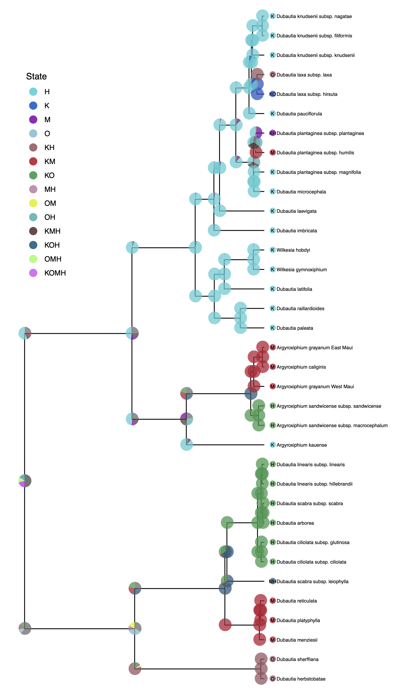

Overview
==============
{:.section}





Through user-friendly data pipelines, `RevGadgets` guides users through importing RevBayes output into `R`, processing the output, and producing figures or other summaries of the results. 
`RevGadgets` provide paired processing and plotting functions built around commonly implemented analyses, such as tree building and divergence-time estimation, diversification-rate estimation, ancestral-state reconstruction and biogeographic range reconstruction, and posterior predictive simulations.
Using the general framework of `ggplot2`, the tidyverse, and associated packages , plotting functions return plot objects with default aesthetics that users may customize. Below, we walk you through installation and several case studies to illustrate primary functionalities.

Installation
============
{:.section} 

`RevGadgets` is available to download from GitHub using `devtools`: 

```R
install.packages("devtools")
devtools::install_github("cmt2/RevGadgets")
```



`RevGadgets` depends on the `R` package `magick`, which in turn depends on external software `ImageMagick`. If `RevGadgets` installation fails, you may need to install `ImageMagick`. On a mac or Linux machine, this can be done using homebrew on terminal or your Linux shell:

```
brew install imagemagick
```
Alternatively, visit the [ImageMagick website](https://imagemagick.org/script/download.php) for more download options.



Getting Started
===============
{:.section} 
To run this tutorial, download the associated files from the `Data files and scripts` menu. All scripts should be in a subdirectory called `scripts` and all data files in a subdirectory called `data`. 
Open `R` and make sure your working directory is set to the directory with the downloaded files. 
For more information on how to customize these plots, see the associated documentation for each function (e.g., `?readTrace`)).
Submit feature requests or bug reports with Issues on [GitHub](https://github.com/cmt2/RevGadgets). 


Visualizing Parameter Estimates 
==============
{:.section} 

`RevGadgets` provides several tools that facilitate the visualization of posterior distributions of parameters. 
The output of most `RevBayes` analyses is a tab-delimited file where rows correspond to samples of an MCMC analysis and columns correspond to parameters in the model. 
Most information of interest to researchers must be extracted from these output files.  
Visualizing MCMC output is also critical for evaluating and troubleshooting analyses, especially for diagnosing MCMC pathologies. 

The following code demonstrates how to process and visualize the MCMC trace file of a general time-reversible (GTR) substitution model analysis , in which we have estimated the substitution rate and stationary frequency parameters for a single gene in a sample of 23 primates . This analysis is covered in detail the  tutorial.

&#8680; The code in this section is contained in the script: `scripts/parameter_estimates.R`

First, load the `RevGadgets` package: 
```R
library("RevGadgets")
```

Then, read in and process the trace file. Burnin (the samples taken before the Markov chain reached stationarity) may be removed at this stage or after examining the trace file further.
```R
# specify the input file
file <- "data/primates_cytb_GTR.log"

# read the trace and discard burnin
trace_quant <- readTrace(path = file, burnin = 0.1)

# or read the trace _then_ discard burnin
trace_quant <- readTrace(path = file)
trace_quant <- removeBurnin(trace = trace_quant, burnin = 0.1)
```

The output of `readTrace()` may be passed to `R` packages specializing in MCMC diagnoses such as `coda` . (Note that `RevGadgets` does not require `coda`, so you will have to install it separately.)
For example:
```R
# assess convergence with coda 
trace_quant_MCMC <- coda::as.mcmc(trace_quant[[1]])
coda::effectiveSize(trace_quant_MCMC)
coda::traceplot(trace_quant_MCMC)
```

Alternatively, use the `R` package `convenience` (described here: ) to assess convergence before processing the data with `RevGadgets`. 

`RevGadgets` provides its own core functions for summarizing and visualizing traces of specific parameters. 
`SummarizeTrace()` calculates the mean and 95% credible interval for quantitative variables and the 95% credible set for qualitative variables.
To examine the stationary frequency (pi) parameter values in our trace file, summarize their distributions:

```R
summarizeTrace(trace = trace_quant, vars =  c("pi[1]","pi[2]","pi[3]","pi[4]"))
```
```R
$`pi[1]`
$`pi[1]`$trace_1
        mean        median        MAP  
        0.3280593   0.3282250     0.3265728      
        quantile_2.5  quantile_97.5 
        
        0.3080363     0.3481651
        
...

$`pi[4]`
$`pi[4]`$trace_1
        mean        median        MAP  
        0.2152190   0.2145595     0.2144797
        
        quantile_2.5  quantile_97.5
        0.2020019     0.2278689

```

Then plot these distributions:
```R
plotTrace(trace = trace_quant, vars = c("pi[1]","pi[2]","pi[3]","pi[4]"))
```




The posterior densities of the nucleotide stationary frequencies under a GTR substitution model. Colored areas under the curve correspond to the 95% credible interval. 



These functions may also process and plot posterior estimates of qualitative (discrete) variables, such as the the binary character indicating if certain transition rates among character states exist (i.e. if the corresponding transitions are possible), from a reversible jump MCMC (rjMCMC) ancestral-state reconstruction analysis. See the  tutorial for information on performing this RevBayes analysis. 

First, read and summarize the data: 
```R
file <- "data/freeK_RJ.log"
trace_qual <- readTrace(path = file)
summarizeTrace(trace_qual, vars = c("prob_rate_12", "prob_rate_13", "prob_rate_21",
                                    "prob_rate_23", "prob_rate_31", "prob_rate_32"))
```
```R
$prob_rate_12
$prob_rate_12$trace_1
credible_set
        1         0 
0.6440396 0.3559604 

...

$prob_rate_32
$prob_rate_32$trace_1
        0 
0.9724475
```
Then plot the distributions as histograms:
```R
plotTrace(trace = trace_qual, 
          vars = c("prob_rate_12", "prob_rate_13",
                   "prob_rate_31", "prob_rate_32"))
```




The posterior distributions whether particular rates are included in the model of character evolution. Colored bars are included in the 95% credible set. 



Visualizing Phylogenies
=======================
{:.section} 

Phylogenies are central to all analyses in `RevBayes`, and accurate and information-rich visualizations of evolutionary trees are thus critical.
`RevGadgets` contains methods to visualize phylogenies and their associated posterior probabilities, divergence time estimates, geological time scales, and branch rates.
Additionally, text annotation may be added to specify associated data, such as posterior probabilities of nodes or node ages. 
Users may modify aesthetics such as colors, sizes, branch thickness, and tip label formatting through specific function arguments or by adding layers to the resulting ggplot object.

&#8680; To reproduce this section, see: `scripts/visualize_trees.R`

Basic tree plots
----------------
{:.subsection} 

RevGadgets reads and processes single trees, such as those produced by the  tutorial, and tree traces with `readTrees()`:

```R
file <- "data/primates_cytb_GTR_MAP.tre"
tree <- readTrees(paths = file)
```
`rerootPhylo()` roots the tree and `plotTree()` produces a basic tree plot, which may be modified by changing the formatting of tip labels, adjusting tree line width, and adding posterior probabilities of nodes as internal node labels. This plot object is modifiable in the same way as `ggplot`. Here, we add a scale bar: 
```R
tree_rooted <- rerootPhylo(tree = tree, outgroup = "Galeopterus_variegatus")

plot <- plotTree(tree = tree_rooted,
	             node_labels = "posterior", 
                 node_labels_offset = 0.005,
				 node_labels_size = 3, 
                 line_width = 0.5,
				 tip_labels_italics = TRUE)

plot + ggtree::geom_treescale(x = -0.35, y = -1)
```




The maximum _a posterior_ phylogeny of primates inferred under a GTR substitution model. 



Fossilized birth-death trees
----------------------------
{:.subsection} 

RevGadgets elaborates on the `plotTree` to plot fossilized birth death analyses, such as those described in the  tutorial. This plot includes a geological timescale, labeled sampled ancestors along branches and their species names as annotated text in the top left corner, and node and tip age bars colored by their corresponding posterior probabilities.

```R
file <- "data/bears.mcc.tre"
tree <- readTrees(paths = file)
plot <- plotFBDTree(tree = tree, 
                    timeline = TRUE, 
                    geo_units = "epochs",
                    tip_labels_italics = TRUE,
                    tip_labels_remove_underscore = TRUE,
                    tip_labels_size = 3, 
                    tip_age_bars = TRUE,
                    node_age_bars = TRUE, 
                    age_bars_colored_by = "posterior",
                    label_sampled_ancs = TRUE) + 
            theme(legend.position=c(.05, .6))
```




The sampled-ancestor maximum-clade credibility phylogeny of extant and extinct bears inferred under the fossilized birth-death model.
Bars correspond to the 95% credible interval of node (or tip) ages, and are colored by the posterior probability of the clade (for internal nodes), the posterior probability that the tip is _not_ a sampled ancestor (for tip nodes) or the posterior probability that the node is a sampled ancestor (for sampled ancestor nodes). 




Branch rates 
-------------
{:.subsection} 

The `plotTree()` function can color the branches of the tree, which is useful for indicating branch rates, or other continuous parameters. For example, `plotTree()` here colors the branches by branch-specific optima (thetas) from a relaxed Ornstein_Uhlenbeck model of body size evolution in whales. The  tutorial covers this type of analysis. 

```R
file <- "data/relaxed_OU_MAP.tre"
tree <- readTrees(paths = file)
plotTree(tree = tree, 
         tip_labels_italics = FALSE,
         color_branch_by = "branch_thetas", 
         line_width = 1.7) + 
    theme(legend.position=c(.1, .9))
```




Branch-specific optima, $\theta$, under a relaxed Ornstein-Uhlenbeck model. Branches are colored according to the posterior-mean estimate of $\theta$ for the branch.



To produce the imput file for this plot `relaxed_OU_MAP.tre`, you will need to run a slightly modified script from the tutorial. See `mcmc_relaxed_OU.Rev` for this modification. 

Ancestral-State Reconstruction
==============================
{:.section} 

Ancestral state reconstruction methods allow users to model how heritable characters, such as phenotypes or geographical distributions, have evolved across a phylogeny, producing probability distributions of states for each node of the phylogeny.
This aspect of `RevGadgets` functionality allows users to plot the maximum \emph{a posteriori} (MAP) estimate of ancestral states via `plotAncStatesMAP()` or a pie chart showing the most probable states via `plotAncStatesPie()`.
Ancestral-state plotting functions in `RevGadgets` allow users to demarcate character states and their posterior probabilities by modifying the colors, shapes, and sizes of node and shoulder symbols. 
Text annotations may be added to specify states, state posterior probabilities, and the posterior probabilities of nodes. 

&#8680; To reproduce this section, see: `scripts/anc_states.R`

To plot the output of an ancestral state estimation of placenta type across models, `RevGadgets` first summarizes the `RevBayes` output file and then creates the plot object. The analysis that produced this output file is described in the  tutorial.

```R
file <- "data/ase_freeK.tree"
freeK <- processAncStates(file, 
                          state_labels = c("1" = "Epitheliochorial", 
                                           "2" = "Endotheliochorial", 
                                           "3" = "Hemochorial"))
plot <- plotAncStatesMAP(t = freeK, 
                         tree_layout = "circular") + 
            theme(legend.position = c(0.57,0.41))
```




Ancestral-state estimates of mammalian placental under an asymmetric model of character evolution. Symbol colors correspond to the state with the highest posterior probability at that node; the size of the symbol is proportional to the posterior probability of that state.



<!-- Here, the color of node circles indicates the estimated ancestral states and the size of the circles corresponds to the posterior probability of that state.  -->

For standard evolutionary models of anagenetic (within-lineage) change such as demonstrated above, states are plotted at the nodes. 
However, cladogenetic models allow for two ways that character states can change on the phylogeny: shifts can occur along branches of the tree (anagenetic change) or happen precisely at the moment of speciation (cladogenetic change) . 
To remedy this problem `RevGadgets` plots the results of inferences using cladogenetic models on "shoulders" as well as the nodes.

For example, many biogeographic models, including the popular Dispersal-Extirpation-Cladogenesis model described in , include cladogenetic change. 
`plotAncStatesPie()` is a special case of `plotAncStatesMAP()` where the symbols at nodes are pie charts of the most probable states for that node plus an "other" category of any remaining probability.
We demonstrate this functionality with a visualization of the ancestral ranges of Hawaiian silverswords estimated using a DEC biogeographic analysis and include shoulder states to indicate cladogenetic as well as anagenetic changes. 
Because of the large number of states in this analysis (15 possible ranges and one "other" category), more pre-plotting processing is necessary.
We pass the appropriate ancestral area names to`processAncStates()` and specify custom colors in a named vector.
To plot the ancestral states, we provide the processed data, specify that the data are "cladogenetic", add text labels to the tips specifying the character state, and modify sizes and horizontal positions for aesthetics.
We also modify the order at which states appear in the legend and the legend position.

```R
file <- "data/simple.ase.tre"
labs <- c("1" = "K", "2" = "O", 
          "3" = "M",  "4" = "H", 
          "5" = "KO", "6" = "KM", 
          "7" = "OM", "8" = "KH", 
          "9" = "OH", "10" = "MH", 
          "11" = "KOM", "12" = "KOH", 
          "13" = "KMH", "14" = "OMH", 
          "15" = "KOMH")
dec_example <- processAncStatesDiscrete(file, state_labels = labs)
ncol <- length(dec_example@state_labels)
colors <- colorRampPalette(colFun(12))(ncol)
names(colors) <- dec_example@state_labels
ordered_labels <- names(colors)[c(6,1,4,3,
                                  9,5,2,7,
                                  10,13,12,
                                  14,11,8,15)]
plotAncStatesPie(t = dec_example,
                 cladogenetic = TRUE, 
                 tip_labels_states = TRUE,
                 pie_colors = colors, 
                 tip_labels_offset = .2, 
                 tip_pie_nudge_x = -.15, 
                 node_pie_size = 1.2, 
                 tip_pie_size = 0.12, 
                 tip_labels_states_offset = .05) +
        theme(legend.position = c(0.1, 0.75)) +
        scale_color_manual(values = c(colors, "grey"), 
                           breaks = ordered_labels)
```




Ancestral-state estimates of biogeographic area of the Hawaiian silverswords. Pies represent the posterior probability of each state at the node; pies at the branching event correspond to the state of the ancestor immediately before the branching event, and pies on the "shoulders" of the two descendant branches are the states of the two descendants immediately after the branching event.



While these examples demonstrate cladogenetic change for `plotAncStatesPie()` only, `plotAncStatesMAP()` can also plot cladogenetic change, and `plotAncStatesPie()` can also plot the results of anagenetic models. 
These functions provide plotting tools for any discrete ancestral-state estimation including the results of chromosome count reconstructions (as in ) and discrete state-dependent speciation and extinction (SSE) models (as in , among others). 

Diversification Analysis
========================
{:.section} 

Diversification rate estimation is a major goal of many comparative analysis. `RevBayes` allows flexible implementation of many diversification rate estimation models. Methods may estimate speciation and extinction rates through time, across branches of the phylogeny, and in conjunction with the evolution of a trait. 
These methods produce estimates of rates that `RevGadgets` can plot on branches of the phylogeny or as posterior distributions. 
When the method also includes simulataneous estimation of the ancestral state of a discrete trait, `RevGadets` may plot those ancestral states using the same ancestral state code described above. 
`RevGadgets` also includes special functionality for visualizing time-varying (episodic) diversification rate estimation.
The examples below demonstrate the potential for visualizing diversifcation rate estimations using `RevGadgets` for a few standard analyses. 
&#8680; To reproduce this section, see: `scripts/divrates.R`

State-Dependendent Diversification Analysis
-------------------------------------------
{:.subsection} 

State-dependent diversification analyses model the evolution of a trait and estimate state-dependent diversification rates. These models thus estimate posterior distributions of state-specific rates and can reconstruct ancestral states on the phylogeny. The analysis plotted here is described in the  tutorial. 

`RevGadgets` first reads in and processes the rate file and then plots the state-specific posterior rate distributions. 
```R
bisse_file <- "data/primates_BiSSE_activity_period.log"
pdata <- processSSE(bisse_file)
plotMuSSE(pdata)
```



Posterior distributions of the rates for a BiSSE analysis. 



While the above example includes two states (a BiSSE analysis), the same workflow is appropriate for models of multi-state traits (MuSSE). For plotting the rates from an analysis with hidden states (HiSSE), check out `plotHiSSE()`.

The ancestral state estimates may be plotted similarly to in the ancestral states section above. 
```R
bisse_anc_states_file <- "data/anc_states_primates_BiSSE_activity_period_results.tree"
panc <- processAncStates(path = bisse_anc_states_file)
plotAncStatesMAP(panc, tree_layout = "circular") +
  scale_color_manual(values=colFun(2), breaks = c("A", "B"), name = "State") +
  scale_size_continuous(name = "State posterior")

```



Ancestral states estimated with a BiSSE analysis. 



Lineage-Specific Diversification Analysis
------------------------------------------
{:.subsection} 


To examine diversification rate variation across the branches of the tree (described in ), `RevBayes` estimates branch-specific speciation and extinction rates. 
Those rates can be plotted by reading in the tree and rate log files, associated the rates with the phylogeny (using `processBranchData()`), and plotting the rate of interest by coloring the branches of the phylogeny. 

```R
ranch_specific_file <- "data/primates_BDS_rates.log"
branch_specific_tree_file <- "data/primates_tree.nex"

rates <- readTrace(branch_specific_file)
tree <- readTrees(branch_specific_tree_file)

combined <- processBranchData(tree = tree, 
	                          dat = rates,
	                          net_div = TRUE)

plotTree(combined, color_branch_by = "net_div", 
	     tip_labels_size = 2, tree_layout = "circular")

```



Net diversifification plotted as the color of branches of a circular phylogeny. 



Episodic Diversification Analysis
---------------------------------
{:.subsection} 

Instead of varying rates across branches of the phylogeny, the episodic birth death process varies rates through time (see the  tutorial). `RevGadgets` visualizes these rates through time with skyline plots.

```R
speciation_time_file <- "data/primates_EBD_speciation_times.log", 
speciation_rate_file <- "data/primates_EBD_speciation_rates.log", 
extinction_time_file <- "data/primates_EBD_extinction_times.log",  
extinction_rate_file <- "data/primates_EBD_extinction_rates.log",

rates <- processDivRates(speciation_time_log = speciation_time_file,
                         speciation_rate_log = speciation_rate_file, 
                         extinction_time_log = extinction_time_file, 
                         extinction_rate_log = extinction_rate_file, 
                         burnin = 0.25)

plotDivRates(rates = rates) + 
        xlab("Millions of years ago") +
        ylab("Rate per million years")
```




Diversification-rates over time estimated from the primate phylogeny. Lines correspond to the posterior mean estimate over time, and shaded regions correspond to the 95% credible interval.



Posterior-Predictive Analysis 
==============
{:.section} 

Posterior predictive simulation is a powerful tool for assessing the adequacy of the model and assessing the reliability of phylogenetic inference. 
&#8680; To reproduce this section, see: `scripts/post_pred.R`

The analysis that produced this output file is describe in the  tutorial.

```R
sim <- "data/simulated_data_pps_example.csv"
emp <- "data/empirical_data_pps_example.csv"

t <- processPostPredStats(path_sim = sim, 
                          path_emp = emp)

plots <- plotPostPredStats(data = t)
```

To plot a subset of the parameters in a single figure, use the `gridExtra` package.

```R
library(ggplot2)
library(gridExtra)

grid.arrange(plots[[1]] + theme(axis.title.y = element_blank()),
             plots[[3]] + theme(axis.title.y = element_blank()),
             plots[[5]] + theme(axis.title.y = element_blank()),
             plots[[7]] + theme(axis.title.y = element_blank()),
             left = "Density")
```




Posterior-predictive distribution of statistics (curves) and observed statistics (dashed vertical lines), and posterior-predictive p-values (upper right corner). Blue and red regions correspond to the 10% and 5% rejection regions, respectively.


