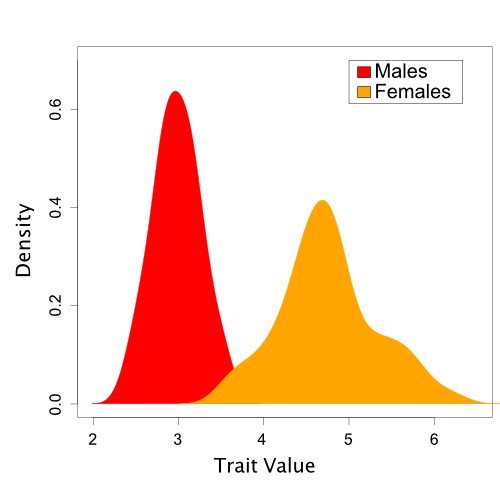
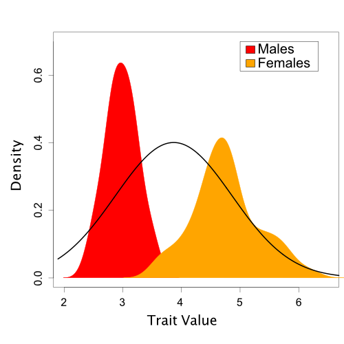
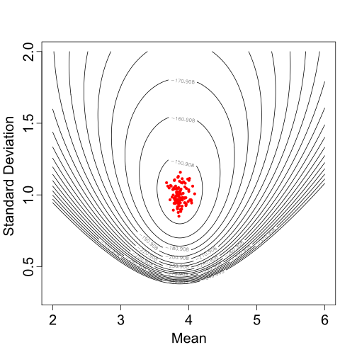
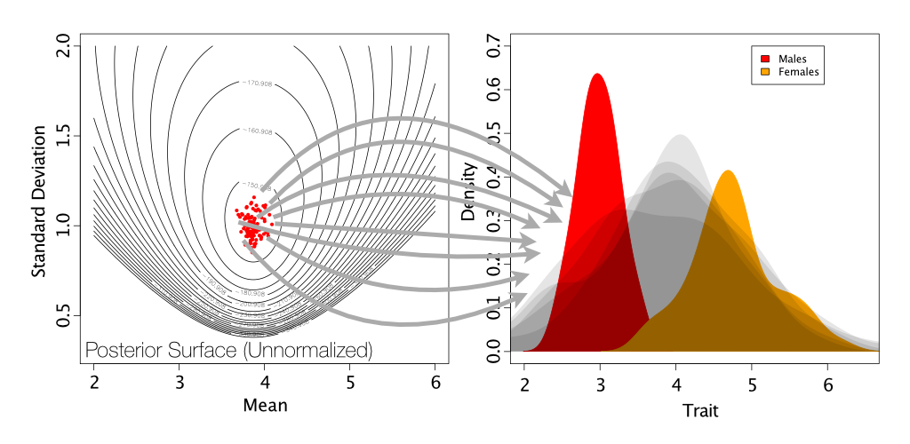
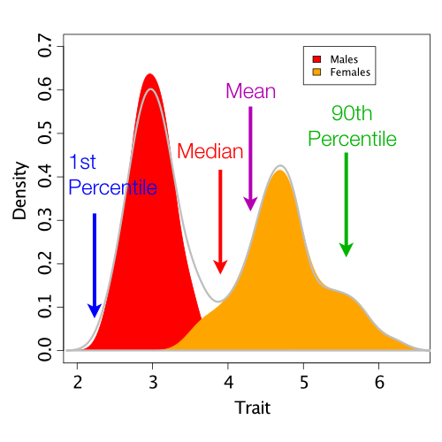
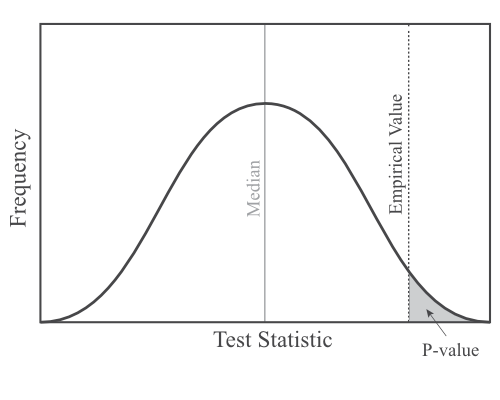
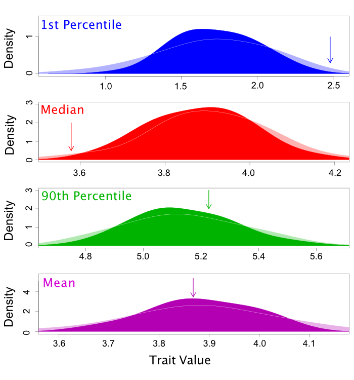



This tutorial introduces the basic principles of posterior predictive simulation. The goal
of posterior prediction is to assess the fit between a model and data. To perform posterior
prediction, we simulate datasets using parameter values drawn from a posterior distribution.
We then quantify some characteristic of both the simulated
and empirical datasets using a test statistic (or a suite of test statistics), and we ask if
the value of the test statistic calculated for the empirical data is a reasonable draw from
the set of values calculated for the simulated data. If the empirical test statistic value is
very different from the simulated ones, our model is not doing a good job of replicating some
aspect of the process that generated our data.

At the end of this tutorial, you should understand the basic steps involved in posterior predictive
model assessment.



A good statistical model captures important features of observed data using relatively simple
mathematical principles. However, a model that fails to capture some important feature of the data can
mislead us. Therefore, it is important to not only compare
the relative performance of models (i.e., model selection), but also to test the absolute fit of the
best model . In other words, could the best model
plausibly have produced our data? If not, we should be cautious in interpreting any conclusions.

Posterior prediction is a technique to assess the absolute fit of a model in a Bayesian framework.
Posterior prediction relies on comparing the observed data to data simulated from the model. If the
simulated data are similar to the observed, the model could reasonably have produced our observations.
However, if the simulated data consistently differ from the observed, the model is not capturing some
feature of the data-generating process.



To illustrate posterior prediction, we will use an example dataset of traits sampled from a population. In this
population, there is sexual dimorphism for our trait, but for the purposes of our tutorial we will say that we
do not yet realize this. Note that this example is discussed further in this paper .




A set of trait values sampled from a population with sexual dimorphism.





To start analyzing our data, we fit a single Normal distribution to our trait values. This is a reasonable starting
point, because we know that many continuous traits are polygenic and normally distributed. Here is the result:




A single Normal distribution fit to the population trait values.



In this case, it is visually obvious that there are some important differences between the model we've assumed and
the trait data. However, we'd like a quantitative method to assess this fit. In the case of more complicated models
and data, visual comparisons are often not possible.

For the sake of brevity, we will not discuss here how to fit a model using MCMC, but if you are interested the trait 
values can be found in **data.txt**, the MCMC analysis can be found in **orig_MCMC_SingleNormal.rev**, and the results of
this analysis (i.e., posterior samples of the mean and standard deviation) can be found in **singleNormal_posterior.log**.




MCMC samples from the posterior distribution of the mean and standard deviation for a single Normal distribution.






Now that we've fit our single Normal model, we need to simulate posterior predictive datasets. Remember
that these are datasets of the same size as our observed data, but simulated using means and standard
deviations drawn from our posterior distribution. 




Simulation of posterior predictive datasets (shown in light gray) by drawing samples of means and standard
deviations from the posterior distribution.



The code for this simulation with the single Normal model can be found in **pps_SingleNormal.rev**.

```
# Read in model log file from original MCMC
postVals <- readMatrix("singleNormal_posterior.log")

# Read in original data
empDataMatrix <- readMatrix("data.txt")

# Convert empirical data format to a vector (hacky but needed for this particular dataset)
for (i in 1:empDataMatrix.size()){
	empData[i] <- empDataMatrix[i][1] 
}

# Simulate datasets and store in matrix
simCounter = 1
burnin <- 50
for (gen in burnin:postVals.size()){
	sims[simCounter] <- rnorm(n=empData.size(), mean=postVals[gen][5], sd=postVals[gen][6])
	simCounter++
}
```



To quantitatively compare our empirical and simulated data, we need to use some test statistic (or suite of
test statistics). These statistics summarize different aspects of a dataset in a single value. We can then
compare the empirical test statistic value to the posterior predictive distribution. For the case of our trait
data, we will try four possible test statistics: the 1st percentile, mean, median, and 90th percentile. 




Four possible test statistics to summarize particular characteristics of a dataset of trait values.



Code to calculate these test statistics can also be found in **pps_SingleNormal.rev**.

```
# Sort each simulated dataset
for ( s in 1:sims.size() ){
	sims[s] <- sort(sims[s])
}

# Sort empirical dataset
empData <- sort(empData)

# Define generic function to calculate a chosen percentile, p
function percentile(p,nums){
	pos <- round( (p/100) * nums.size() )
	return nums[pos]
}

# Calculate empirical test statistics
emp_mean <- mean(empData)
emp_median <- median(empData)
emp_1st <- percentile(1,empData)
emp_90th <- percentile(90,empData)

# Calculate simulated data test statistics
for ( s in 1:sims.size() ){
	sim_means[s] <- mean(sims[s])
	sim_medians[s] <- median(sims[s])
	sim_1sts[s] <- percentile(1,sims[s])
	sim_90ths[s] <- percentile(90,sims[s])
}
```

Note that the calculation of percentiles is not built-in to RevBayes, which was why we created this custom function

```
function percentile(p,nums){
	pos <- round( (p/100) * nums.size() )
	return nums[pos]
}
```



We typically summarize the comparison of test statistic values between empirical and posterior predictive datasets
using either a posterior predictive p-value or effect size. Like a standard p-value, a posterior
predictive p-value tells us how many of our simulated datasets have test statistic values that are as, or more,
extreme than the empirical. While useful, these p-values are unable to distinguish between cases where the observed
test statisic falls just a little bit outside the posterior predictive distribution from cases where there is a
very big difference between the simulated and empirical values. Effect sizes, however, allow us to distinguish
those different possibilities . An effect size is calculated as the difference between the empirical test statistic
value and the median of the posterior predictive distribution, divided by the standard deviation of the posterior
predictive distribution.




The comparison between test statistic values from empirical and posterior predictive datasets can be summarized 
using both posterior predictive p-values and effect sizes.



P-values and effect sizes are calculated in **pps_SingleNormal.rev** with this code

```
function pVal(e,s){
	lessThan <- 0
	for (i in 1:s.size()){
		if (e > s[i]){
			lessThan++
		}
	}
	return lessThan/s.size()
}

# Calculate posterior predictive p-values
p_means <- pVal(emp_mean,sim_means)
p_medians <- pVal(emp_median,sim_medians)
p_1sts <- pVal(emp_1st,sim_1sts)
p_90ths <- pVal(emp_90th,sim_90ths)

# Print p-values
print("P-value mean:",p_means)
print("P-value median:",p_medians)
print("P-value 1st percentile:",p_1sts)
print("P-value 90th percentile:",p_90ths)

# Calculate effect sizes for test statistics
eff_means <- abs(emp_mean-median(sim_means))/stdev(sim_means)
eff_medians <- abs(emp_median-median(sim_medians))/stdev(sim_medians)
eff_1sts <- abs(emp_1st-median(sim_1sts))/stdev(sim_1sts)
eff_90ths <- abs(emp_90th-median(sim_90ths))/stdev(sim_90ths)

# Print effect sizes
print("Effect size mean:",eff_means)
print("Effect size median:",eff_medians)
print("Effect size 1st percentile:",eff_1sts)
print("Effect size 90th percentile:",eff_90ths)
```

The results should look something like this

```
P-value mean:	0.4774397
P-value median:	0.03147954
P-value 1st percentile:	0.996852
P-value 90th percentile:	0.6883526
Effect size mean:	0.04028857
Effect size median:	1.860162
Effect size 1st percentile:	2.074742
Effect size 90th percentile:	0.4983143
```

Note that this script only calculates p-values as the percentage of posterior predictive values that are
*less* than the empirical value. Formally, this is known as a lower one-tailed p-value. Therefore, p-values
near *either 0 or 1* indicate poor fit between our model and our empirical data.

To run this entire posterior predictive analysis at once, you could use this command, after
downloading **pps_SingleNormal.rev**.

```
source(pps_SingleNormal.rev)
```

These results can also be summarized graphically (although not in RevBayes) like this




Comparison of empirical and posterior predictive test statistic values. The four test statistics are shown in
different rows. Vertical arrows show empirical values, and distributions show simulated values. The lighter
distributions were generated by posterior predictive simulation and the darker distributions were generated by
parametric bootstrapping (similar to posterior prediction, but using only maximum likelihood parameter estimates)
for simulation. More detail is available in .






In general, test statistics with intermediate p-values (close to 0.5) indicate good fit and should have
relatively small effect sizes. In our results from the one-Normal model, both the mean (p-value = 0.477, effect size = 0.04) and the 90th percentile (p-value = 0.688, effect size = 0.498) do not indicate big
discrepancies between what we've observed and what we've simulated.

However, the median (p-value = 0.031, effect size = 1.86) and 1st percentile (p-value = 0.997, effect 
size = 2.07) statistics have small and large p-values, respectively, and correspondingly large effect 
sizes. These results do indicate a discrepancy between the assumptions of the model and the data we've observed.

Should we be concerned about our model? Two of our test statistics do not indicate poor fit, while two others
**do** indicate poor fit. The answer depends on what we want to learn about our population. If we are interested in
inferring or predicting the average trait value of our population, we seem to be doing fine. However, if we wanted to
predict the trait value of any given individual drawn from the population, we will tend to overpredict individuals with
intermediate values and underpredict individuals with extreme trait values. If we were interested in understanding
an evolutionary process like stabilizing selection, we might also be very concerned. A single normal model would suggest 
that our population has quite a lot of trait variation, when in fact most of that difference is between sexes. Individuals 
within a sex have much more limited variation.


