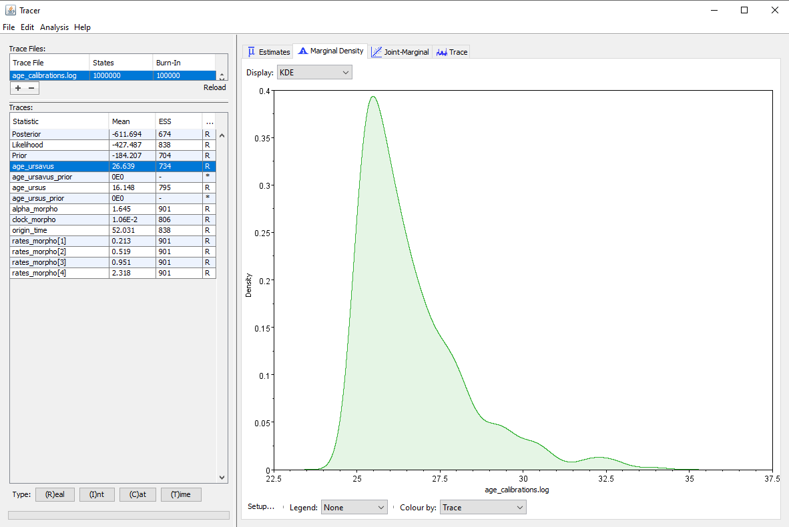
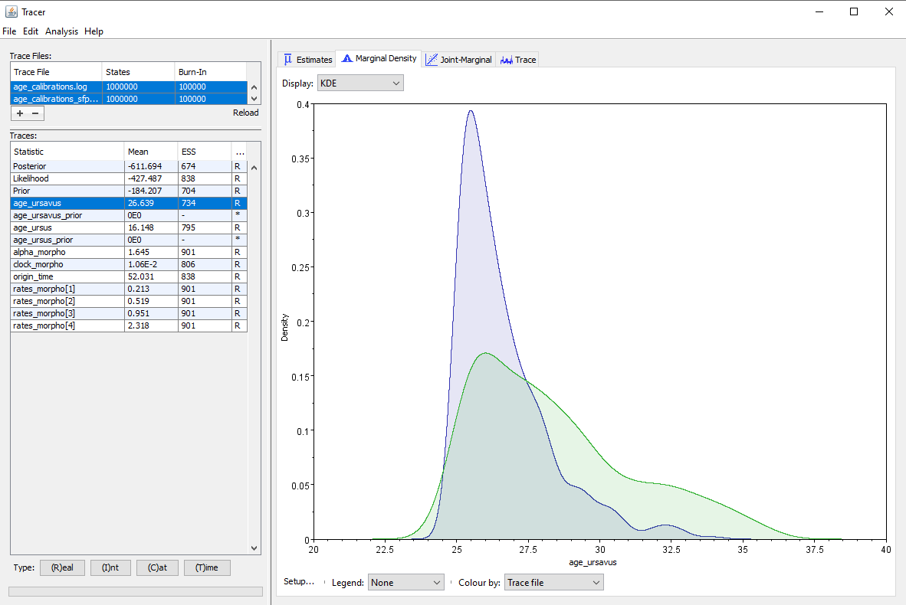
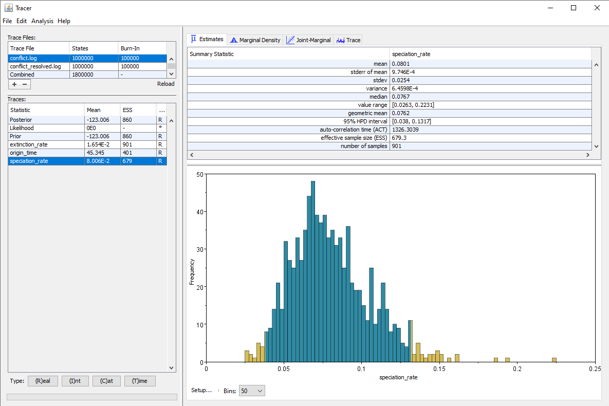
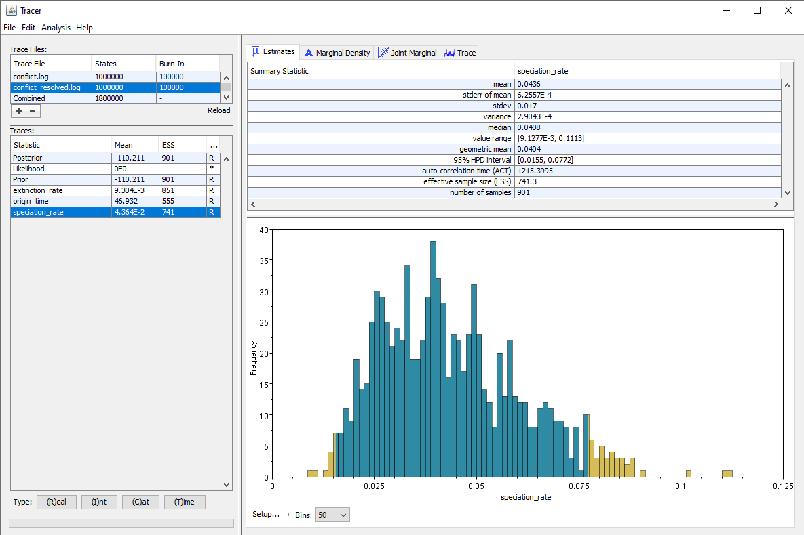





This part of the tutorial deals with the choice of prior distributions for continuous parameters. Note that demographic models (birth-death and coalescent models) are also technically prior distributions for the phylogeny itself, however they will be covered in a separate section.



The range of available distributions for priors is quite large, but we present here the most common examples. When deciding on a prior, the choice of the distribution will change the distribution of the probabilities within the range of plausible values, and determine whether we believe the true parameter value to be towards the lower end, the upper end, or anywhere in the range. The distribution chosen also determines whether the parameter value has a strict bound, i.e. a minimum or maximum that it cannot go beyond. Distributions with a so-called "long tail" allow parameter values to go increasingly high, but with increasingly low probability. The second factor in choosing a prior is the range of plausible values determined by the distribution, which will depend not only on the distribution chosen but also on the parameters chosen for the distribution. For distributions which have no hard bounds, we generally consider that the values between the 2.5% and 97.5% quantiles are "plausible" under the distribution. Any value outside of this range has a very low prior probability.

- **Uniform distribution**: a distribution which assigns an identical probability to all values between a lower and upper bound. This distribution is parametrized by the lower and upper values of the range. Itis appropriate for parameters with a (known) fixed range, but where the distribution of values within a range is not well known, for instance a sampling probability or an age range for a sample.
{{ prior_script | snippet:"block#","1" }}
- **Exponential distribution**: a distribution on positive values which has high probabilities for values close to 0, with a long tail. This distribution is parametrized by the rate $\lambda$ of the distribution, where the mean is $1/\lambda$. It is appropriate for values which are always positive but can be very low, such as the diversification rate.
{{ prior_script | snippet:"block#","2" }}
- **LogNormal distribution**: a distribution on positive values where the majority of the weight is on values within a certain range, defined by the mean and standard deviation parameters. Both values close to 0 and high values have a low probability under this distribution. This distribution also has a long tail, but unlike the exponential distribution, it seeks to impose a minimum on the range of plausible values. It can thus be a better choice for parameters which are unlikely to be very close to 0, such as the clock rate.
{{ prior_script | snippet:"block#","3" }}
- **Gamma distribution**: similar to the lognormal distribution, the majority of the weight is on positive values within a certain range, away from 0 or from high values. It can thus be applied to the same type of parameters. This distribution is parametrized by the shape and the rate. The mean of the distribution is given by $mean = shape / rate$ and the variance by $var = shape / rate^2$.
{{ prior_script | snippet:"block#","4" }}
- **Beta distribution**: this distribution is restricted to values between 0 and 1, but can have a wide range of shapes depending on the parameters set. For instance, a beta distribution can put higher probability on lower values, higher values, or values in the middle of the range. So it is a good choice for parameters which are probabilities and for which we have some knowledge about the distribution, for instance a sampling probability that we know is likely between $0.001$ and $0.01$.
{{ prior_script | snippet:"block#","5" }}

Commonly used distributions in phylogenetics are generally restricted to positive values, as this corresponds to most biological parameters. However, there are also distributions available for parameters which can take negative values, such as the normal or uniform distributions.

Finally, more complex distributions such as mixture distributions are available for parameters with a more complicated behaviour. A common situation is a scenario where a parameter can be either a fixed value (usually 0) or estimated under a distribution. For instance, imagine we are trying to detect whether a mass extinction happened in our particular dataset. We know that a mass extinction happened at a specific time, but we are not sure whether it actually impacted our focal clade. In this case we may set the extinction probability during the time of the supposed mass extinction to be either 0 (corresponding to no mass extinction in this clade) or Uniform[0.7, 0.95] (if a mass extinction did happen).
{{ prior_script | snippet:"block#","6" }}











One challenge is specifying priors is that we usually expect that the prior used by the analysis will be the same as the prior that we have set. This is generally the case, _unless_ the same component or parameter is influenced by several different priors. A common scenario where this can happen is in the case of node ages. Node ages have an implicit prior set on them by the prior used for the phylogeny itself. When using a demographic model such as a coalescent or birth-death process, node ages which are coherent with this model will have a higher probability. Similarly if a prior on branch lengths is used, then this will also impact plausible values for the node ages. But node ages can also have explicit priors set on them, for instance through the use of node calibrations defined directly by the user. Even nodes that are not calibrated will be influenced by the calibrations, since a node has to have a lower age than its ancestors and a higher age than its descendants. Thus the prior on a node age is potentially the result of the interaction of many different components.

This interaction needs to be taken into account in order to correctly interpret the results of the analysis, as we will see in the following example. The full details of the setup can be found in the `age_calibrations.Rev` script, but we will focus on the node calibrations set for this analysis.
{{ calib_script | snippet:"block#","6" }}

We also have a prior set on the origin time of the tree:
{{ calib_script | snippet:"block#","4" }}

When we run the analysis, we obtain the posterior distribution shown in  for the _Ursavus_ clade that we have set. The first impression we might get from this result is that our inference strongly supports younger ages for this clade, because our original prior was a uniform distribution on the full range [25.0 ; 36.0] My, whereas the posterior has much higher densities for values in the first half of the range. However, this is not taking into account the interactions between priors, which may lead to an **effective** prior on the clade age which is not uniform at all.




Posterior distribution of the age of the _Ursavus_ clade, visualized into Tracer.



We can check the effective priors for any inference by running the analysis **under the prior**, i.e. without taking the contributions of the data into account. There are two ways to achieve this:
- we can use the `underPrior` option in the MCMC inference itself. **CAREFUL:** this will remove _all_ clamped nodes, including the node calibrations if they use clamping. Thus this option requires node calibrations to be set using the `setValue` function rather than `clamp`.
{{ prior_script | snippet:"block#","7" }}
- we can simply comment out all the components of the likelihood, which in the case of our analysis is only the `dnPhyloCTMC` component.

Then we can compare the posterior distribution obtained from the complete inference to the effective prior obtained from the inference under the prior, shown in . Here we see that the effective prior for the age of the _Ursavus_ clade is not uniform at all, but in fact also supports heavily the younger ages within the specified range. Indeed, the median of the posterior is $\approx 26.1$My, while the median of the effective prior is $\approx 28.1$My, so they are very close to each other. We can also see that the posterior distribution is different from the effective prior and shows support for a more narrow range of age values, so the data is also contributing to our posterior estimates. However, the support of the data for younger ages is much weaker than our initial impression, because the posterior is largely informed by our choice of priors.




Distributions of the age of the _Ursavus_ clade, visualized into Tracer. We can compare the posterior distribution obtained from a complete inference with data () with the effective prior obtained from a run under the prior ().



Overall, this example illustrates why it is crucial to check the effective priors in case of unexpected interactions. Comparing the complete run and the run under the prior also allows us to evaluate how much support for our estimates is found in the data as opposed to our chosen prior, which will inform our interpretation of the results.





Here we see an example of what can happen when priors are misspecified, i.e. when they conflict with either the data or the other priors. We have set up a toy analysis containing a phylogeny under an FBD prior, and estimating the origin time, speciation and extinction rates. The full details of the setup can be found in the `prior_conflict.Rev` file, but we will focus on the priors used.
The prior for the origin time is:
{{ conflict_script | snippet:"block#","2" }}
The prior for the speciation rate is:
{{ conflict_script | snippet:"block#","3" }}
And finally the prior for the extinction rate is:
{{ conflict_script | snippet:"block#","4" }}

One issue with lognormal distributions is that it can be difficult to see from the parameter values alone what is the range of plausible values covered by the prior. Thankfully, we can easily check the quantiles of the distribution using RevBayes:
{{ prior_script | snippet:"block#","8" }}

We see here that the prior expects the speciation rate to be in the interval of values [4 ; 52.5] events/My. However, our dataset contains only 18 species, we have set our origin time to be in the interval [37 ; 55]My and the mean of our prior on the extinction rate is set to $1/rate = 0.01$ events/My. Considering the other components of our analysis, the expectation on our speciation rate is thus unrealistically high.

This is likely to affect our analysis in two important ways. First, the influence of the prior will orient the estimates of the speciation rate towards values which are higher than the values supported by the data, and this influence will need to be taken into account when interpreting the results. Second, because the prior on speciation rates is in conflict with the data and other components of the analysis, it is likely to make the likelihood surface more complex, and thus slow down the convergence.

A more reasonable prior on speciation rate would expect lower values, for instance we can set:
{{ prior_script | snippet:"block#","9" }}
This distribution defines a range of plausible values in the interval [0.027 ; 0.35] events/My.

The results using our original, very high prior versus the more reasonable alternative are shown in . 


 

Comparison of results obtained using the very high prior (top) or the alternative lower prior (bottom), visualized into Tracer.



We can see that as expected, the estimated speciation rate is almost twice as high when using our higher prior. But we also see that the ESS for several parameters, particularly the origin time and the speciation rate, are higher when using the alternative prior, even though we ran our chain for the exact same number of generations in both cases. Thus convergence is achieved faster when using a prior which does not conflict with the data and/or the other components of the analysis.
