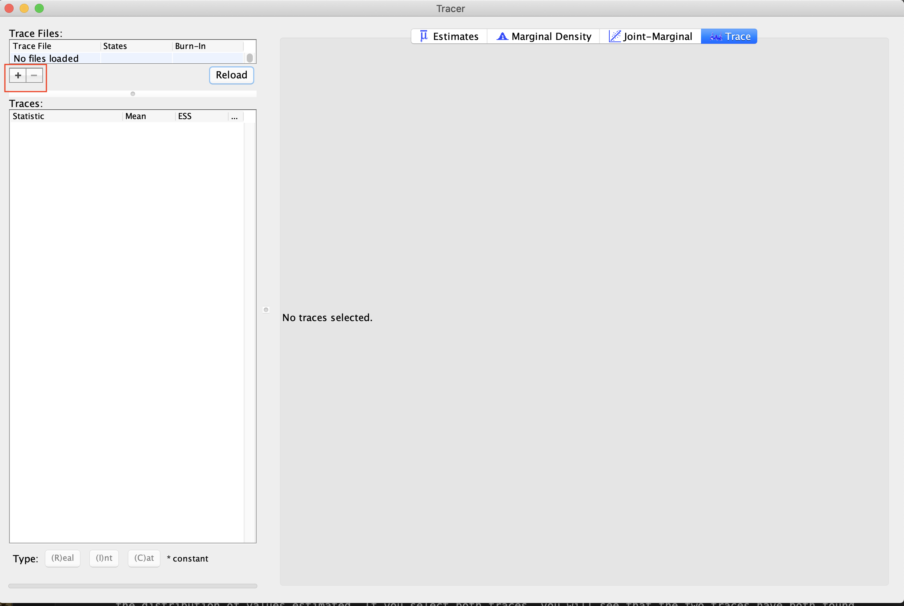
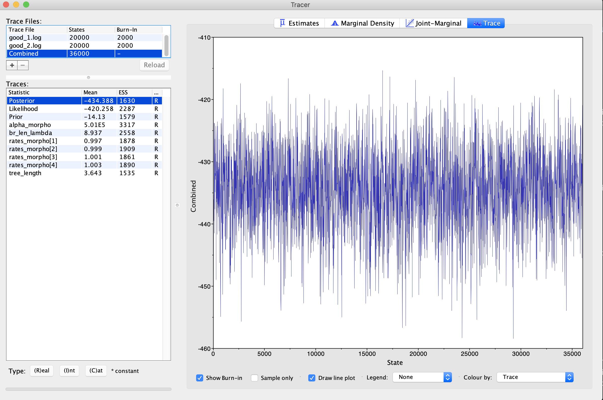
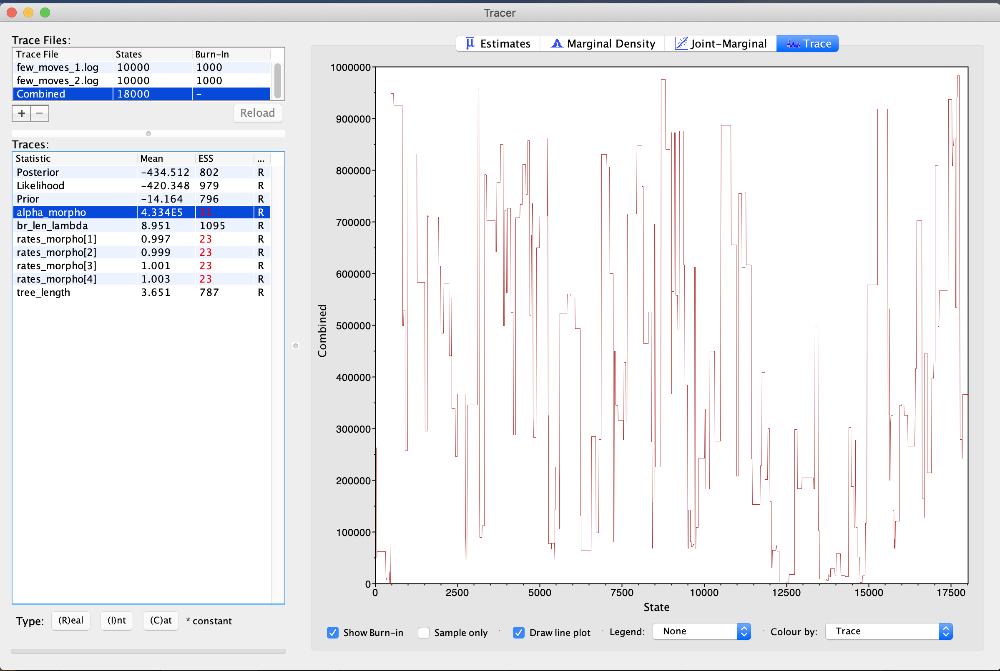

### **IMPORTANT** This tutorial is currently a work in progress, meaning that some sections may be incomplete or lack details. Send feedback by opening an issue on the [Github repository](https://github.com/revbayes/revbayes.github.io/issues). 



Markov Chain Monte Carlo is a common method for approximating the posterior distribution of parameters in a mathematical model. Despite how well-used the method is, many researchers have misunderstandings about how the method works. This leads to difficulties with diagnosing issues with MCMC analyses when they arise. For this lesson, we will not be performing MCMC analyses themselves. However, we will work with MCMC traces, which are logs of the values sampled for each parameter in our phylogenetic model. These are draws from the posterior. We can examine these logs to assess if our analysis has reached convergence, or stationarity. 

This tutorial closely follows the text of [this](https://open-research-europe.ec.europa.eu/browse/articles?all=Practical+guidelines+for+Bayesian+phylogenetic+inf) paper, which describes strategies for troubleshooting MCMC. We assume that you have completed the introductory MCMC tutorials (), and will not be covering the basic mechanics of the MCMC algorithm. This tutorial, instead, will focus on giving examples of issues that may impact the efficiency and convergence of your MCMC simulation, and will give strategies for solving this problems.



Before we can understand if there are problems with our MCMC trace, we need to understand how to examine an MCMC for convergence. In this tutorial, we will mainly focus on fairly simple visual convergence diagnostics. But please note that this tutorial offers some more sophisticated techniques for asessing convergence. For this, we will use the software [Tracer](https://beast.community/tracer). 

Start by opening Tracer. You can load in MCMC traces, such as the two provided with this tutorial by clicking the `+` button (see ). Load in the two traces labeled 'good' provided with this tutorial. These are traces that will demonstrate convergence. We estimated these two traces from this tutorial . When you load these in, you will see both files, as well as a "combined" trace, showing the total sample contained within both. Note that the combined view will only include analyses that share the same parameters. If you are comparing models or different datasets, they may not combine.




The Tracer interface, showing where to click to load in your MCMC trace file. No trace is loaded yet.



Click on the `trace` button. This shows the parameter and its values (Y-Axis) and the number of generations (X-axis). If you look at each of these files, you will see that, for each parameter, the lines seem to jump around a central value. This is because this analysis has converged (). It has found stationarity, or the point at which increased sampling no longer affects the distribution of values estimated. If you select both traces, you will see that the two traces have both found stationarity at similar values. 

On the left hand side of the screen, we see a set of parameters along with their effective sample size (ESS). The ESS is the most commonly used convergence diagnostic in phylogenetics. The ESS is specific to a posterior sample and to a given parameter, and describes the number of uncorrelated (independent) samples that would be needed to approximate the posterior distribution of a parameter with similar precision to that posterior sample. It is usually defined as 
ESS $= N/\tau$, in which $N$ is the number of generations and $\tau$ is the autocorrelation time.
Due to autocorrelation, the ESS is typically smaller than the number of steps in the MCMC chain, because the difference between two successive samples is usually quite small. If we were drawing completely independent samples, the difference between sample $i$ and sample $i+1$ could be quite large (i.e., an independent sample could be drawn from anywhere in parameter space, so a series of such samples may explore the different areas of that space more quickly than when done step by step by an MCMC chain). We can see that each of our ESS values is over 200, which is generally considered good. 




An MCMC trace with adequate MCMC generations. This trace is converged.



For comparison, let's look at some poor traces. First, let's look at the traces labeled `too_few` (). These traces, as the name may imply have simply not bee run long enough. This trace was estimated from the same tutorial scripts and data as the first trace, however, we ran it for 1/10th the number of MCMC generations. Load in both of the traces. You will immediately notice that all the ESSes are in red, indicating this analysis has not made a sufficient number of draws to approximate the posterior distriuction. If you look at the trace, you will see that it is sampling around a central value, but not densely sampling around it. There is no clear directionality to the trace. This indicates that stationarity has been found, but more sampling needs to occur to confirm this. More generations of MCMC analysis is the solution to this problem.




An MCMC trace with too few generations. More generations are needed for this to converge.



In the next trace, we have used the same scripts, but are performing MCMC moves less frequently. Load in the two traces labeled `few_moves`. If you need a reminder on MCMC moves, please see this tutorial. This means that we are sampling fewer new values for important parameters. In this case, we are undersampling the alpha parameter the gamma distribution on Among-Character Rate Variation (ACRV). What you will observe is that in these traces is that the alpha parameter is poorly-sampled. The ESS is very low. ACRV is used to esitmate the `rates_morpho` parameters - these, correspondingly, have low ESS, as well. When we examine the trace, it is blocky-looking (). This is sometimes called a "skyline" or "Manhattan" shape. This is caused by the parameter being unmoved for several generations, as it is being moved too infrequently. The solution here is to increase the frequency of the move. 




An MCMC trace with too few moves. This is sometimes referred to as poor mixing - the move is not performed enough to adequately sample parameters.



The final issue that we are going to diagnose is unreasonable starting values. This issue can be diagnosed by observing that the trace does not stabilize. Load in the files titled `poor_start` (). What you will observe, again, is that the values for the alpha parameter of ACRV has a very low ESS. What is different, however, is that the trace shows a steep climb from the starting value and does not reach stationarity. In this case, one would want to examine their starting values and priors on their parameters.




This parameter is mixing, but has not reached stationarity, as evidenced by its vertical incline.



Now that we have some simple looks at what these issues look like, we will now dive deeper into the causes of these problems and how they can be fixed.












