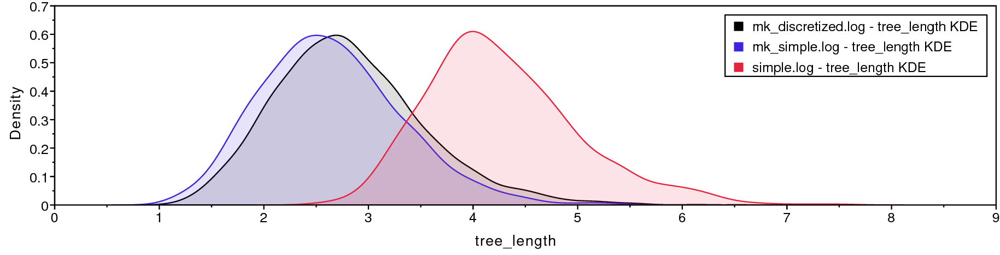



While molecular data have become the default for building phylogenetic
trees for many types of evolutionary analysis, morphological data
remains important, particularly for analyses involving fossils. The use
of morphological data raises special considerations for model-based
methods for phylogenetic inference. Morphological data are typically
collected to maximize the number of parsimony-informative characters -
that is, the characters that provide information in favor of one
topology over another. Morphological characters also do not carry common
meanings from one character in a matrix to the next; character codings
are made arbitrarily. These two factors require extensions to our
existing phylogenetic models. Accounting for the complexity of
morphological characters remains challenging. This tutorial will provide
a discussion of modeling morphological characters, and will demonstrate
how to perform Bayesian phylogenetic analysis with morphology using
RevBayes .





 
 
Graphical model showing the Mk model (left panel). 
Rev code specifying the Mk model is on the right-hand panel.



Molecular data forms the basis of most phylogenetic analyses today.
However, morphological characters remain relevant: Fossils often provide
our only direct observation of extinct biodiversity; DNA degradation can
make it difficult or impossible to obtain sufficient molecular data from
fragile museum specimens. Using morphological data can help researchers
include specimens in their phylogeny that might be left out of a
molecular tree.

To understand how morphological characters are modeled, it is important
to understand how characters are collected. Unlike in molecular data,
for which homology is algorithmically determined, homology in a
character is typically assessed by an expert. Biologists will typically
decide what characters are homologous by looking across specimens at the
same structure in multiple taxa; they may also look at the developmental
origin of structures in making this assessment . Once
homology is determined, characters are broken down into states, or
different forms a single character can take. The state `0` commonly
refers to absence, meaning that character is not present. In some
codings, absence will mean that character has not evolved in that group.
In others, absence means that that character has not evolved in that
group, and/or that that character has been lost in that group
. This type of coding is arbitrary, but both
*non-random* and *meaningful*, and poses challenges for how we model
the data.

Historically, most phylogenetic analyses using morphological characters
have been performed using the maximum parsimony optimality criterion.
Maximum parsimony analysis involves proposing trees from the
morphological data. Each tree is evaluated according to how many changes
it implied in the data, and the tree that requires the fewest changes is
preferred. In this way of estimating a tree, a character that does not
change, or changes only in one taxon, cannot be used to discriminate
between trees (i.e., it does not favor a topology). Therefore, workers
with parsimony typically do not collect characters that are parsimony
uninformative.

In 2001, Paul Lewis  introduced a generalization of the
Jukes-Cantor model of sequence evolution for use with morphological
data. This model, called the Mk (Markov model, assuming each character
is in one of *k* states) model provided a mathematical formulation that
could be used to estimate trees from morphological data in both
likelihood and Bayesian frameworks. While this model is a useful step
forward, as a generalization of the Jukes-Cantor, it still makes fairly
simplistic assumptions. This tutorial will guide you through estimating
a phylogeny with the Mk model, and two useful extensions to the model.




The Mk model is a generalization of the Jukes-Cantor model of nucleotide
sequence evolution, which we discussed in . 
The Q matrix for a two-state Mk model looks like so:

$$Q = \begin{pmatrix} -\mu_0 & \mu_{01} \\
\mu_{10} & -\mu_1  &\\
\end{pmatrix} \mbox{  ,}$$

This matrix can be expanded to accommodate multi-state data, as well:

$$Q = \begin{pmatrix} -\mu_0 & \mu_{01} & \mu_{02} & \mu_{03} \\
\mu_{10} & -\mu_1  & \mu_{12} & \mu_{13} \\
\mu_{20} & \mu_{21} & -\mu_2  & \mu_{23} \\
\mu_{30} & \mu_{31} & \mu_{32} & -\mu_3 
\end{pmatrix} \mbox{  ,}$$

However, the Mk model sets transitions to be equal from any state to any
other state. In that sense, our multistate matrix really looks like
this:

$$Q = \begin{pmatrix} -(k-1)\mu & \mu & \mu & \mu \\
\mu & -(k-1)\mu  & \mu & \mu \\
\mu & \mu & -(k-1)\mu  & \mu \\
\mu & \mu & \mu & -(k-1)\mu \\
\end{pmatrix} \mbox{  ,}$$

Because this is a Jukes-Cantor-like model , state
frequencies do not vary as a model parameter. These assumptions may seem
unrealistic. However, all models are a compromise between reality and
generalizability. Prior work has demonstrated that, in many conditions,
the model does perform adequately . Because morphological
characters do not carry common meaning across sites in a matrix in the
way that nucleotide characters do, making assumptions that fit all
characters is challenging. A visualization of this simple model can be
seen in .

We will first perform a phylogenetic analysis using the Mk model. In
further sections, we will explore how to relax key assumptions of the Mk
model.



When Lewis first introduced the Mk model, he observed that branch
lengths on the trees were greatly inflated. The reason for this is that
when morphological characters are collected, characters that do not
vary, or vary in a non-parsimony-informative way (such as
autapomorphies) are excluded. Excluding these low-rate characters causes
the overall amount of evolution to be over-estimated. This causes an
inflation in the branch lengths .

Therefore, when performing a morphological phylogenetic analysis, it is
important to correct for this bias. There are numerous statistically
valid ways to perform this correction . Original corrections
simulated invariant and non-parsimony informative characters along the
proposed tree. The likelihood of these characters would then be
calculated and used to normalize the total likelihood value. RevBayes
implements a dynamic programming approach that calculates the same
likelihood, but does so faster.




In this example, we will use morphological character data from 18 taxa
of extinct bears . The dataset contains 62 binary
characters, a fairly typical dataset size for morphological characters.




This tutorial follows a specific format for issuing instructions and
information.

>The boxed instructions guide you to complete tasks that are not part of
>the RevBayes syntax, but rather direct you to create directories or
>files or similar.
{:.instruction}

Information describing the commands and instructions will be written in
paragraph-form before or after they are issued.

All command-line text, including all Rev syntax, are given in
`monotype font`. Furthermore, blocks of Rev code that are needed to
build the model, specify the analysis, or execute the run are given in
separate shaded boxes. For example, we will instruct you to create a
constant node called `example` that is equal to `1.0` using the `<-`
operator like this:
```
    example <- 1.0
```
It is important to be aware that some PDF viewers may render some
characters given as differently. Thus, if you copy and paste text from
this PDF, you may introduce some incorrect characters. Because of this,
we recommend that you type the instructions in this tutorial or copy
them from the scripts provided.




>On your own computer, create a directory called **data**.
>In this directory download the data
>files: [`bears.nex`](data/bears.nex).
{:.instruction}




>Create a new directory (in `RB_DiscreteMorphology_Tutorial`) called **scripts**.
>(If you do not have this folder, please refer to the directions in
>section .)
{:.instruction}

When you execute RevBayes in this exercise, you will do so within the
main directory you created (`RB_DiscreteMorphology_Tutorial`), thus,
if you are using a Unix-based operating system, we recommend that you
add the RevBayes binary to your path. Alternatively make sure that you set the 
working directory to, for example, **RB_DiscreteMorphology_Tutorial** if this is 
the directory you stored the scripts and data in.




In this exercise, you will work primarily in your text editor and
create a set of files that will be easily managed and interchanged. 
In this first section, you will write the following file
from scratch and save them in the `scripts` directory:

-   `mcmc_mk.Rev`: the *Rev* file that loads the data, 
specifies the model describing discrete morphological
character change (binary characters), 
and specifies the monitors and MCMC sampler.

All of the files that you will create are also provided in the
RevBayes tutorial here (see the top of this webpage). 
Please refer to these files to verify or troubleshoot your own scripts.

>Open your text editor and create the Rev-script file called **mcmc_Mk.Rev** in the
>`scripts` directory.
>
>Enter the Rev code provided in this section in the new file.
{:.instruction}


In this section you will begin the file and write the Rev commands for
loading in the taxon list and managing the data matrices. Then, starting
in section , you will move on to specifying each of 
the model components. Once the model specifications are
complete, you will complete the script with the instructions given in section
.




RevBayes uses the function `readDiscreteCharacterData()` to load a
data matrix to the workspace from a formatted file. This function can be
used for both molecular sequences and discrete morphological characters.
Import the morphological character matrix and assign it to the variable
`morpho`.
```
    morpho <- readDiscreteCharacterData("data/bears.nex")
```




Before we begin writing the Rev scripts for each of the models, 
we need to instantiate a couple “helper variables” that will
be used by downstream parts of our model specification. 

Create a new constant node called `num_taxa` that is equal to the number
of species in our analysis (18) and a constant node called `num_branches` representing
the number of branches in the tree. We will also create a constant node of
the taxon names. This list will be used to initialize the tree.
```
    taxa <- morpho.names()
    num_taxa <- morpho.size() 
    num_branches <- 2 * num_taxa - 2
```
Next, create two workspace variables called `mvi` and `mni`. These variable are 
iterators that will build a vector containing all of the MCMC moves used
to propose new states for every stochastic node in the model graph. Each
time a new move is added to the vector, `mvi` will be incremented by a
value of `1`.
```
    mvi = 1
    mni = 1
```
One important distinction here is that `mvi` is part of the RevBayes
workspace and not the hierarchical model. Thus, we use the workspace
assignment operator `=` instead of the constant node assignment `<-`.




First, we will create a joint prior on the branch lengths and tree topology. 
This should be familiar from the 
```
    br_len_lambda ~ dnExp(0.2)
    moves[mvi++] = mvScale(br_len_lambda, weight=2)

    phylogeny ~ dnUniformTopologyBranchLength(taxa, branchLengthDistribution=dnExponential(br_len_lambda))
    moves[mvi++] = mvNNI(phylogeny, weight=n_branches/2.0)
    moves[mvi++] = mvSPR(phylogeny, weight=n_branches/10.0)
    moves[mvi++] = mvBranchLengthScale(phylogeny, weight=n_branches)
    
    tree_length := phylogeny.treeLength()
```
Next, we will create a $Q$ matrix. Recall that the Mk model is simply a
generalization of the JC model. Therefore, we will create a 2x2 $Q$ matrix
using `fnJC`, which initializes Q-matrices with equal transition
probabilities between all states.
```
    Q_morpho <- fnJC(2)
```
Now that we have the basics of the model specified, we will add
Gamma-distributed rate variation and specify moves on the parameter to
the Gamma distribution.
```
    alpha_morpho ~ dnUniform( 0, 1E6 )
    rates_morpho := fnDiscretizeGamma( alpha_morpho, alpha_morpho, 4 )

    #Moves on the parameters to the Gamma distribution.
    moves[mvi++] = mvScale(alpha_morpho, lambda=1, weight=2.0)
```

Lastly, we set up the CTMC. This should also be familiar from the . 
We see some familiar pieces: tree, $Q$ matrix and site_rates.
We also have two new keywords: data type and coding. The data type
argument specifies the type of data - in our case, “Standard”, the
specification for morphology. 
```
    phyMorpho ~ dnPhyloCTMC(tree=phylogeny, siteRates=rates_morpho, Q=Q_morpho, type="Standard")
    phyMorpho.clamp(morpho)
```
All of the components of the model are now specified.






We can now create our workspace model variable with our fully specified
model DAG. We will do this with the `model()` function and provide a
single node in the graph (`phylogeny`).
```
    mymodel = model(phylogeny)
```
The object `mymodel` is a wrapper around the entire model graph and
allows us to pass the model to various functions that are specific to
our MCMC analysis.




The next important step for our Rev-script is to specify the
monitors and output file names. For this, we create a vector called
`monitors` that will each sample and record or output our MCMC.

The first monitor we will create will monitor every named random
variable in our model graph. This will include every stochastic and
deterministic node using the `mnModel` monitor. The only parameter that
is not included in the `mnModel` is the tree topology. Therefore, the
parameters in the file written by this monitor are all numerical
parameters written to a tab-separated text file that can be opened by
accessory programs for evaluating such parameters. We will also name the
output file for this monitor and indicate that we wish to sample our
MCMC every 10 cycles.
```
    monitors[mni++] = mnModel(filename="output/mk.log", printgen=10)
```
The `mnFile` monitor writes any parameter we specify to file. Thus, if
we only cared about the branch lengths and nothing else (this is not a
typical or recommended attitude for an analysis this complex) we
wouldn`t use the `mnModel` monitor above and just use the `mnFile`
monitor to write a smaller and simpler output file. Since the tree
topology is not included in the `mnModel` monitor (because it is not
numerical), we will use `mnFile` to write the tree to file by specifying
our `phylogeny` variable in the arguments.
```
    monitors[mni++] = mnFile(filename="output/mk.trees", printgen=10, phylogeny)
```
The third monitor we will add to our analysis will print information to
the screen. Like with `mnFile` we must tell `mnScreen` which parameters
we'd like to see updated on the screen.
```
    monitors[mni++] = mnScreen(printgen=100)
```




Once we have set up our model, moves, and monitors, we can now create
the workspace variable that defines our MCMC run. We do this using the
`mcmc()` function that simply takes the three main analysis components
as arguments.
```
    mymcmc = mcmc(mymodel, monitors, moves, nruns=2, combine="mixed")
```
The MCMC object that we named `mymcmc` has a member method called
`.run()`. This will execute our analysis and we will set the chain
length to `20000` cycles using the `generations` option.
```
    mymcmc.run(generations=20000, tuningInterval=200)
```
Once our Markov chain has terminated, we will want RevBayes to close.
Tell the program to quit using the `q()` function.
```
    q()
```

>You made it! Save all of your files.
{:.instruction}




With all the parameters specified and all analysis components in place,
you are now ready to run your analysis. The Rev scripts you just
created will all be used by RevBayes.

>Begin by running the RevBayes executable. In Unix systems, type the
>following in your terminal (if the RevBayes binary is in your path):
>rb
{:.instruction}

Provided that you started RevBayes from the correct directory
(`RB_DiscreteMorphology_Tutorial`), you can then use the `source()`
function to feed RevBayes your Rev-script file (`mcmc_mk.Rev`).
```
    source("scripts/mcmc_mk.Rev")
```
This will execute the analysis and you should see the following output
(though not the exact same values):
```
   Processing file "scripts/mcmc_mk.Rev"
   Successfully read one character matrix from file 'data/bears.nex'

   Running MCMC simulation
   This simulation runs 2 independent replicates.
   The simulator uses 5 different moves in a random move schedule with 58.4 moves per iteration

Iter        |      Posterior   |     Likelihood   |          Prior   |    elapsed   |        ETA   |
----------------------------------------------------------------------------------------------------
0           |       -680.054   |       -649.452   |       -30.6022   |   00:00:00   |   --:--:--   |
100         |       -419.885   |       -414.047   |       -5.83883   |   00:00:01   |   --:--:--   |
200         |       -427.028   |       -417.426   |       -9.60277   |   00:00:01   |   00:00:49   |
300         |       -421.585   |        -417.96   |        -3.6253   |   00:00:02   |   00:01:04   |
400         |       -431.561   |       -427.124   |       -4.43711   |   00:00:03   |   00:01:12   |
500         |       -423.507   |       -422.002   |       -1.50428   |   00:00:04   |   00:01:16   |
600         |       -418.061   |       -419.644   |        1.58298   |   00:00:05   |   00:01:18   |
700         |       -427.552   |       -423.884   |       -3.66793   |   00:00:05   |   00:01:06   |
800         |        -437.39   |       -424.302   |       -13.0876   |   00:00:06   |   00:01:09   |
900         |       -418.405   |       -413.872   |        -4.5323   |   00:00:07   |   00:01:10   |
1000        |       -425.641   |       -411.291   |       -14.3491   |   00:00:08   |   00:01:12   |

...
```
{:.Rev-output}

When the analysis is complete, RevBayes will quit and you will have a
new directory called `output` that will contain all of the files you
specified with the monitors ().




1. Run the MCMC analysis in RevBayes.
2. Look at the resulting files **mk_run_1.log** and **mk_run_2.log** in Tracer and check for convergence.
3. Look at the majority rule consesus tree stored **mk.majrule.tre** and the MAP tree stored in **mk.map.tre** in FigTree.




As discussed earlier in the section , we also need to
correct for ascertainment bias. 

>Create a copy of your previous `Rev` script, and call it *mcmc_Mkv.Rev*. 
>You will need to modify the `Rev`
>code provided in this section in this file.
{:.instruction}

In `RevBayes` it is actually very simple to add a correction for ascertainment bias. 
You only need to set the option `coding="variable"` in the `dnPhyloCTMC`. Coding specifies 
what type of ascertainment bias is expected. We are using the `variable` correction,
as we have no invariant character in our matrix. If we also lacked
parsimony non-informative characters, we would use the coding `informative`.
```
phyMorpho ~ dnPhyloCTMC(tree=phylogeny, siteRates=rates_morpho, Q=Q_morpho, type="Standard", coding="variable")
```
>Remember to change all filenames for the output, e.g., from `output/mk.log` to `output/mkv.log`.
{:.instruction}

That’s all you need to do! Now run this script in RevBayes.




>Make a copy of the Rev script you made earlier. Call it
>`mcmc_mk_dicretized.Rev`. This new script will
>contain the new model parameters and models.
{:.instruction}



 
 
Graphical model demonstrating the
discretized Beta distribution for allowing variable state frequencies.



The Mk model makes a number of assumptions, but one that may strike you
as unrealistic is the assumption that characters are equally likely to
change from any one state to any other state. That means that a trait is
as likely to be gained as lost. While this may hold true for some
traits, we expect that it may be untrue for many others.

RevBayes has functionality to allow us to relax this assumption. We do
this by specifying a Beta prior on state frequencies. Remember from the
 lesson that stationary frequencies impact how likely we are
to see changes in a character. For example, it may be very likely, in a
character, to change from 0 to 1. But if the frequency of 0 is very low,
we will still seldom see this change.

We can exploit the relationship between state frequencies and observed
changes to allow for variable Q matrices across characters . To
do this, we generate a Beta distribution on state frequencies, and use
the state frequencies from that Beta distribution to generate a series
of Q-matrices to use to evaluate our data .

This type of model is called a **mixture model**. There are assumed to
be subdivisions in the data, which may require different parameters (in
this case, state frequencies). These subdivisions are not defined *a
priori*. This model has previously been shown to be effective for a
range of empirical and simulated datasets .




At each place in which the output files are specified in the MCMC file,
change the output path so you do not overwrite the output from the
previous exercise. For example, you might call your output file
`output/mk_discretized.log` and `output/mk_discretized.trees`. Change
source statement to indicate the new model file.


We will use a discretized Beta distribution to place a prior on state frequencies. 
The Beta distribution has two parameters, $\alpha$ and $\beta$. These two
parameters specify the shape of the distribution. State frequencies will
be evaluated according to this distribution, in the same way that rate
variation is evaluated according to the Gamma distribution. The
discretized distribution is split into multiple classes, each with it's
own set of frequencies for the 0 and 1 characters. The number of classes
can vary; we have chosen 4 for tractability. Note that we need to make sure that this
discretization results into a symmetric model, therefore we will use only one parameter
for the Beta distribution: `beta_scale` so that $\alpha = \beta$.
```
    num_cats = 4
    beta_scale ~ dnLognormal( 0.0, sd=2*0.587405 )
    moves[mvi++] = mvScale(beta_scale, lambda=1, weight=5.0 )
```
Above, we initialized the number of categories, the parameters to the
Beta distribution, and the moves on the parameters to the Beta.

Next, we set the categories to each represent a quadrant of the Beta
distribution specified by the `beta_scale`. 
```
    cats := fnDiscretizeBeta(beta_scale, beta_scale, num_cats)
```
If you were to print the `cats` variable, you would see a list of state
frequencies like so:

Using these state frequencies, we will generate a new vector of Q
matrices. Because we are varying the state frequencies, we must use a Q
matrix generation function that allows for state frequencies to vary as
a parameter. We will, therefore, use the `fnF81` function.
```
    for (i in 1:cats.size())
    {
        Q[i] := fnF81(simplex(abs(1-cats[i]), cats[i]))
    }
```
Additionally, in RevBayes we need to specify the probablities that a site evolves according to one
of the $Q$-matrices. For this model the probabilities must be equal because we need to guarantee that
the model is symmetric. This, we use a `simplex` function to create a vector that sums to 1.0.
```
    matrix_probs <- simplex( rep(1,num_cats) )
```

The only other specification that needs to change in the model specification is
the CTMC:
```
    phyMorpho ~ dnPhyloCTMC(tree=phylogeny, siteRates=rates_morpho, Q=Q, type="Standard", coding="variable", siteMatrices=matrix_probs)
```
You will notice that we have added a command to tell the CTMC that we have
multiple site matrices that will be applied to different characters in
the matrix.




The MCMC chain set-up does not need to change. Run the new MCMC file,
just as you ran the plain Mk file. This estimation will take longer than
the Mk model, due to increased model complexity.







We will use `Tracer`to evaluate the MCMC samples from our
three estimations. Load all three of the MCMC logs into the
`Tracer` window. Highlight all three files in
the upper left-hand viewer () by right- or
command-clicking all three files.



 
 
Highlight all three files for model comparison.



Once all three trace logs are loaded and highlighted, first look at the
estimated likelihoods. You will notice that the Mk model, as
originally proposed by  is improved by allowing any state
frequency heterogeneity. The discretized model and the Dirichlet
model both represent improvements, but are fairly close in likelihood
score to each other (). Likely, we would need to
perform stepping stone model assessment to truly tell if the more
complicated model is statistically justified. 
This analysis is too complicated and time-consuming for this tutorial period, 
but you will find instructions for performing the analysis in
.


 
 
Comparison of likelihood scores for all three models.


 

Click on the `Trace` panel. In the lower left hand corner, you will
notice an option to color each trace by the file it came from. Choose
this option (you may need to expand the window slightly to see it). Next
to this option, you can also see an option to add a legend to your trace
window. The results of this coloring can be seen in
. When the coloring is working, you will see that
the Mk model mixes quite well, but that mixing becomes worse as we relax
the assumption of equal state frequencies. This is because we are
greatly increasing model complexity. Therefore, we would need to run the
MCMC chains longer if we were to use these analyses in a paper.


 
 
The Trace window. The traces are colored by which version of the Mk model 
they correspond to.



We are interested in two aspects of the posterior distribution. First,
all analyses correct for the biased sampling of variable characters
except for the simple analysis. Then, we expect the
tree_length variable to be greater for simple
than for the remaining analyses, because our data are enriched for
variation.  shows that
`tree_length` is approximately 30% greater for
simple than for `mk_simple`, which are
identical except that `mk_simple` corrects for sampling
bias. To compare these densities, click the “Marginal Prob Distribution”
tab in the upper part of the window, highlight all of the loaded Trace
Files, then select `tree_length` from the list of Traces.


 
 
Posterior tree length estimates.



Second, we are interested in characterizing the degree of heterogeneity
estimated by the beta-discretized model. If the data were distributed by
a single morphological rate matrix, then we would expect to see very
little variation among the different values in cats, and
very large values for the shape and scale parameters of the
discrete-beta distribution. For example, if alpha_ofbeta =
beta_ofbeta = 1000, then that would cause all discrete-beta
categories to have values approaching 0.5, which approximates a
symmetric Mk model.


 
 
Posterior discretized state frequencies for the discrete-beta model.




 
 
Posterior alpha and beta parameters for the discrete-beta model.



 shows that the four discrete-beta state
frequencies do not all have the exact same value. In addition,
 shows that the priors on the
discrete-beta distribution are small enough that we expect to see
variance among cat values. If the data contained no
information regarding the distribution of cat values, then
the posterior estimates for alpha_ofbeta and
beta_ofbeta would resemble the prior.




The morphology trees estimated in Section  and
Section  are summarized using a majority rule consensus tree
(MRCT). Clades appearing in $p>0.5$ of posterior samples are resolved in
the MRCT, while poorly support clades with $p \leq 0.5$ are shown as
unresolved polytomies. Poor phylogenetic resolution might be caused by
having too few phylogenetically informative characters, or it might be
due to conflicting signals for certain species relationships. Because
phylogenetic information is generated through model choice, let's
compare our topological estimates across models.


 
 
Majority rule consensus tree for the beta-discretized Mkv analysis.



The MRCTs for the simple model with and without the +v correction are
very similar to that for the discretized-beta model
(). Note that the scale bars for
branch lengths differ greatly, indicating that tree length estimates are
inflated without the +v correction, just as we saw when comparing the
posterior tree length densities. In general, it is important to assess
whether your results are sensitive to model assumptions, such as the
degree of model complexity, and any mechanistic assumptions that
motivate the model's design. In this case, our tree estimate appears to
be robust to model complexity.

