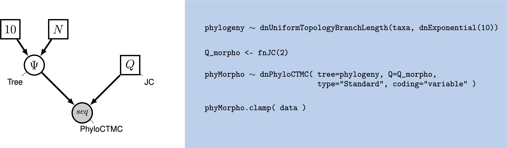
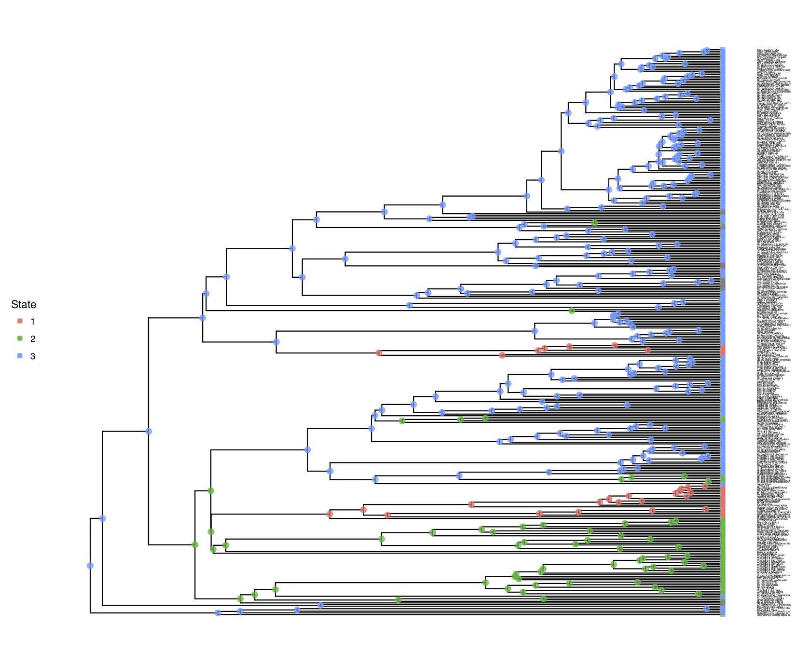
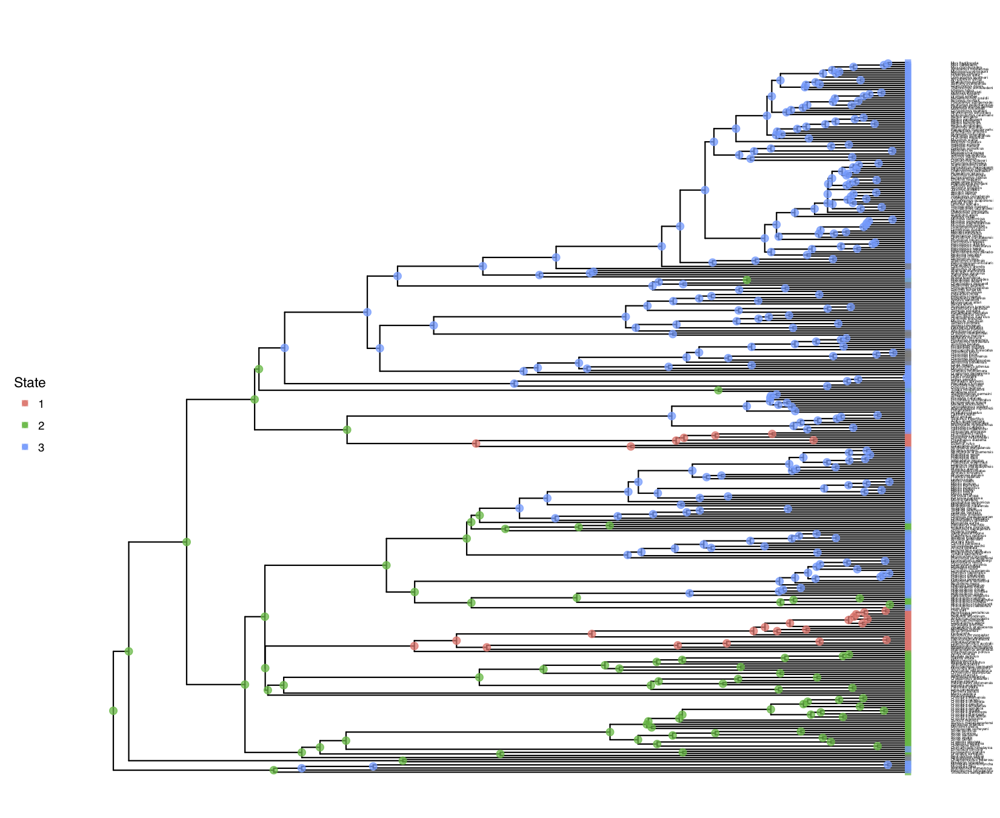



Discrete morphological models are not only useful for tree estimation, 
as was done in Tutorial , but also to ask specific questions about 
the evolution of the morphological character of interest.
Specifically, there are two types of analyses that we might be interest in. 
First, we can test different model of morphological evolution, 
such as reversible and irreversible models, and estimate rates under these models.
Using an irreversible model of evolution, we can test, for example, 
for Dollo's law of a complex character that can be lost but not gained again .

Additionally, we might be interest in ancestral state estimation, 
or mapping transition on the phylogeny.
Commonly the central problem in statistical phylogenetics concerns *marginalizing* over 
all unobserved character histories that evolved along the branches of a given 
phylogenetic tree according to some model, $M$, under some parameters, $\theta$.
This marginalization yields the probability of observing the tip states, $X_\text{tip}$, 
given the model and its parameters, 
$P( X_\text{tip} | \theta, M ) = \sum_{X_\text{internal}} P( X_\text{internal}, X_\text{tip} \mid \theta, M )$.
One might also wish to find the probability distribution of ancestral state 
configurations that are consistent with the tip state distribution, 
$P( X_\text{internal} \mid X_\text{tip}, \theta, M )$, and to sample 
ancestral states from that distribution.
This procedure is known as *ancestral state estimation*.


This tutorial will provide a discussion of modeling morphological characters 
and ancestral state estimation, and will demonstrate how to perform such 
Bayesian phylogenetic analysis using RevBayes . 




The instantaneous rate matrix encodes the transition rates between all pairs of evolutionary states.
It is important to emphasize that all rate matrices are assertions about how morphological evolution operates.
Depending on how one populates the rate matrix elements, different evolutionary hypotheses may be expressed.

When we model the evolution of morphological data, unlike nucleotide data, each change may require a sequence of intermediate changes.
Getting to one state may require going through another.
In short, it is probably not likely that one single model describes all characters well.




The standard Mk model of character evolution, where M denotes it is a Markov model and $K$ denotes the number of states for the character.
The lineage may transition directly from state 1 to state 4 without going through states 2 and 3, which is representative of a character with 
*unordered* states.
In addition, all transition rates are equal as they are in the Jukes-Cantor rate matrix .
Here is an example of a symmetric unordered Mk model for $k=3$.

$$
Q = \begin{pmatrix}
- & r & r \\
r & - & r \\
r & r & - 
\end{pmatrix}
$$


Define the single shared rate parameter
```
mu <- 1.0
```

Define the rates
```
rates := [ [0.0,  mu,  mu],
           [ mu, 0.0,  mu],
           [ mu,  mu, 0.0] ]
```

Create the rate matrix
```
Q := fnFreeK(rates)
Q
```
```
   [ [ -1.0000, 0.5000, 0.5000 ] ,
     0.5000, -1.0000, 0.5000 ] ,
     0.5000, 0.5000, -1.0000 ] ]
```
{:.Rev-output}


Now, let's compute the transition probability matrix for a branch length of 0.1.
```
P <- Q.getTransitionProbabilities(0.1)
P
```
```
[ [ 0.907, 0.046, 0.046 ], 
  [ 0.046, 0.907, 0.046 ], 
  [ 0.046, 0.046, 0.907 ] ]
```
{:.Rev-output}

If we believed that, for example, for a couple of states, some transitions are strongly 
more likely, we could add a multiplier between those two states:
```
rates := [ [  0.0,  mu,   mu],
           [ 2*mu, 0.0, 2*mu],
           [   mu,  mu,   mu] ]
Q := fnFreeK(rates)
Q
```
```
   [ [ -0.8333, 0.4167, 0.4167 ] ,
     0.8333, -1.6667, 0.8333 ] ,
     0.4167, 0.4167, -0.8333 ] ]
```
{:.Rev-output}
```
 P <- Q.getTransitionProbabilities(0.1)
 P
```
```
   [ [ 0.922, 0.038, 0.040 ], 
     [ 0.075, 0.850, 0.075 ], 
     [ 0.040, 0.038, 0.922 ] ]
```
{:.Rev-output}

If we then get our transition probabilities, we see that this changes our probability of observing the not simply our two state transitions that we changed the rate for, but others as well.

This type of approach is common in parsimony, where it is one of several things referred to as weighted parsimony. 
This approach to using different matrices requires you to, *a priori* specify your matrix.
But in reality, there is often fairly little guidance or information by which we decide if a weight applied to a transition is appropriate.
Biologists still use models of this type - the Dollo model, in which a character is assumed not to be able to re-evolve once lost, is an extreme version of penalizing one change.

Because the transition rates between all differing pairs of states are the same, so are the transition probabilities.
Similarly, the probability of remaining in any given state is also equal across states.




Character states that are ordered imply that evolutionary transitions occur in particular sequences.
For example, the number of digits on a foot might vary by gaining and losing single digits, meaning the transition from three to five digits cannot occur without going through the evolutionary state of possessing four digits.
Below, we assume that gain events ( $n \rightarrow n+1$ ) occur at rate $\lambda$ and loss events ($n \rightarrow n-1$) occur at rate $\mu$.
The zeroes indicate that there is no immediate evolutionary path between states $1$ and $4$: states $2$ and $3$ must be used to reach $4$ from $1$.

$$
Q = \begin{pmatrix}
- & \lambda & 0 & 0 \\
\mu & -   & \lambda & 0 \\
0 & \mu & -   & \lambda \\
0 & 0 & \mu & - 
\end{pmatrix}
$$


Create two rate parameters, $\lambda$ for gain and $\mu$ loss events.

```
lambda ~ dnExponential( 1 )
mu ~ dnExponential( 1 )
lambda.setValue( 3 )
mu( 3 )
```

Create a tridiagonal matrix of transition rates, meaning state $i$ may only transition to states $i-1$ and $i+1$

```
rates := [ [  0.0, lambda,    0.0,    0.0],
           [   mu,    0.0, lambda,    0.0],
           [  0.0,     mu,    0.0, lambda],
           [  0.0,    0.0,     mu,    0.0] ]
```

Create the rate matrix

```
Q := fnFreeK(rates)
Q
```
```
[ [ -1.5385, 1.5385, 0.0000, 0.0000 ] ,
     0.5128, -2.0513, 1.5385, 0.0000 ] ,
     0.0000, 0.5128, -2.0513, 1.5385 ] ,
     0.0000, 0.0000, 0.5128, -0.5128 ] ]
```
{:.Rev-output}

Compute the transition probability matrix for a branch length of 0.1.

```
P <- Q.getTransitionProbabilities(rate=0.1)
P
```
```
[ [ 0.861, 0.129, 0.010, 0.001],
  [ 0.043, 0.821, 0.126, 0.010],
  [ 0.001, 0.042, 0.821, 0.136],
  [ 0.000, 0.001, 0.045, 0.954]]
```
{:.Rev-output}

Note that $P[1][2] > P[1][3] > P[1][4]$, primarily because those transitions require a minimum of one, two, and three events, respectively.
In addition, note that assigning asymmetric transition rates causes $P[1][2] > P[2][1]$ because $rates[1][2] > rates[2][1]$.


>In RevBayes we have also the specific rate matrix for this model: `fnOrderedRateMatrix(maxState, lambda, mu)`.
{:.instruction}




Two characters do not necessarily evolve independently of one another.
Take two characters in plants: the presence or absence of toothed leaf margins (character X) is thought to be ecologically correlated with the presence of absence of leaf lobing (character Y).
For a single binary character, there are two states (0 and 1), but there are four states for a pair of non-independent binary characters (00, 10, 01, and 11).
 introduced a general framework for modeling the evolution of joint sets of characters.
These models require that only one evolutionary event can occur in a moment of time, which is enforced with the 0 terms.
In addition, the transition rate that, say, character X goes from 0 to 1 depends on the current value of character Y.



In the first case, all possible transitions might be assigned their own parameter.
Here, we'll assign a simplex over all rates, leaving seven free parameters (plus an eighth parameter that scales the rate matrix).

$$
Q = \begin{pmatrix}
                      - & \mu_{00 \rightarrow 10} & \mu_{00 \rightarrow 01} &                       0 \\
\mu_{10 \rightarrow 00} &                       - &                       0 & \mu_{10 \rightarrow 11} \\
\mu_{01 \rightarrow 00} &                       0 &                       - & \mu_{01 \rightarrow 11} \\
                      0 & \mu_{11 \rightarrow 10} & \mu_{11 \rightarrow 01} &                       - \\
\end{pmatrix}
$$

```
r ~ dnDirichlet( [1,1,1,1,1,1,1,1] )
r.setValue( simplex(1,1,3,3,3,3,1,1) )
```

Create an array of zeroes for the four states (00, 10, 01, 11)

```
for (i in 1:4) {
    for (j in 1:4) {
        rates[i][j] <- 0.0
    }
}
```

Populate the elements of `rates`

```
rates[1][2] := r[1] # 00->10
rates[1][3] := r[2] # 00->01
rates[2][1] := r[3] # 10->00
rates[2][4] := r[4] # 10->11
rates[3][1] := r[5] # 01->00
rates[3][4] := r[6] # 01->11
rates[4][2] := r[7] # 11->10
rates[4][3] := r[8] # 11->01
```

Create the rate matrix

```
Q := fnFreeK(rates)
Q
```
```
[ [ -0.6667, 0.3333, 0.3333, 0.0000 ] ,
     1.0000, -2.0000, 0.0000, 1.0000 ] ,
     1.0000, 0.0000, -2.0000, 1.0000 ] ,
     0.0000, 0.3333, 0.3333, -0.6667 ] ]
```
{:.Rev-output}

Compute the transition probability matrix for a branch length of 0.1.
```
P <- Q.getTransitionProbabilities(rate=0.1)
P
```
```
[ [ 0.938, 0.029, 0.029, 0.003],
  [ 0.088, 0.822, 0.003, 0.088],
  [ 0.088, 0.003, 0.822, 0.088],
  [ 0.003, 0.029, 0.029, 0.938] ]
```
{:.Rev-output}
Note that the probability of remaining in state 10 or state 01 is less than the probability of remaining in state 00 or state 11.
In this toy example, these probabilities reflect that states 10 an 01 are less evolutionarily stable than states 00 and 11.



Alternatively, characters X and Y might share state frequencies, $\pi_j$, and transition rates $\mu_{ij}^{(k)}$, where $i$ is the starting state for the character undergoing change, $j$ is the ending state, and $k$ is the state of the other character.
This results in two stationary frequencies (one free parameter), four transition rates for $0 \rightarrow 1$ and $1 \rightarrow 0$ given that the other character is in state 0 or state 1 (three free parameters), plus one free parameter to scale the rate matrix.

$$
Q = \begin{pmatrix}
- & \mu_{01}^{(0)} \pi_1 \pi_0 & \mu_{01}^{(0)} \pi_0 \pi_1 & 0 \\
\mu_{10}^{(0)} \pi_0 \pi_0 & -   & 0 & \mu_{01}^{(1)} \pi_1 \pi_1 \\
\mu_{10}^{(0)} \pi_0 \pi_0 & 0   & - & \mu_{01}^{(1)} \pi_1 \pi_1 \\
0 & \mu_{10}^{(1)} \pi_1 \pi_0 & \mu_{10}^{(1)} \pi_0 \pi_1 & - \\
\end{pmatrix}
$$

Assign the stationary frequencies of being in state 0 or state 1 shared by both characters X and Y.
```
pi ~ dnDirichlet([1,1])
pi.setValue( simplex(1,3) )
```
Assign the relative transition rates for gain and loss provided that the other character is in state 0 or 1.
```
r ~ dnDirichlet( [1,1,1,1] )
r.setValue( simplex(1,3,3,1) )
```
Create an array of zeroes for the four states (00, 10, 01, 11)

```
for (i in 1:4) {
    for (j in 1:4) {
        rates[i][j] <- 0.0
    }
}
```
Populate the elements of {\tt rates}
```
rates[1][2] := r[1] * pi[2] * pi[1] # 00->10
rates[1][3] := r[1] * pi[1] * pi[2] # 00->01
rates[2][1] := r[3] * pi[1] * pi[1] # 10->00
rates[2][4] := r[2] * pi[2] * pi[2] # 10->11
rates[3][1] := r[2] * pi[1] * pi[1] # 01->00
rates[3][4] := r[3] * pi[2] * pi[2] # 01->11
rates[4][2] := r[4] * pi[2] * pi[1] # 11->10
rates[4][3] := r[4] * pi[1] * pi[2] # 11->01
```
Create the rate matrix
```
Q := fnFreeK(rates)
Q
```
```
[ [ -0.6333, 0.3167, 0.3167, 0.0000 ] ,
     0.4750, -2.3750, 0.0000, 1.9000 ] ,
     0.4750, 0.0000, -2.3750, 1.9000 ] ,
     0.0000, 0.3167, 0.3167, -0.6333 ] ]
```
{:.Rev-output}

Compute the transition probability matrix for a branch length of 0.1.
```
P <- Q.getTransitionProbabilities(0.1)
P
```
```
[ [ 0.940, 0.027, 0.027, 0.005],
  [ 0.041, 0.792, 0.003, 0.164],
  [ 0.041, 0.003, 0.792, 0.164],
  [ 0.001, 0.027, 0.027, 0.944] ]
```
{:.Rev-output}

Note that this model has a tendency towards state 11.
```
P_10 <- Q.getTransitionProbabilities(10.0)
P_10
```
```
[ [ 0.159, 0.105, 0.105, 0.630],
  [ 0.158, 0.105, 0.105, 0.632],
  [ 0.158, 0.105, 0.105, 0.632],
  [ 0.158, 0.105, 0.105, 0.632] ]
```
{:.Rev-output}




Covarion models  capture the possibility that a ``hidden'' (unobserved or unmeasurable) states cause evolutionary processes to vary in tempo and modes.
For example, phylogenetically local clusters of plant lineages appear to transition between herbaceous and woody habits at relatively high rates, so one might want to quantify where these bursts occur .
While similar in structure to the correlated character model of , covarion models do not observe the hidden state that induce the mode-shifts.
Instead, covarion models expand the character's state space by a factor of $K$, and observe the character once for each of the $K$ categories.
For example, take a binary character modeled with $K=2$ hidden state classes.
The model would treat a character that is observed as being in state 0 as possibly being in either of the $K=2$ classes (0,1) and (0,2).
In practice, this is done by setting the likelihood of observing those $0k$ states to equal 1.

The expanded structure of a simple covarion rate matrix with $K=2$ is

$$
Q = \left(
\begin{array}{cc|cc}
- & r_1 q_{01}^{(1)} & s_{12} & 0 \\
r_1 q_{10}^{(1)} & - & 0 & s_{12} \\
\hline
s_{21} & 0 & - & r_2 q_{01}^{(2)} \\
0 & s_{21} & r_2 q_{10}^{(2)} & -  \\

\end{array}
\right)    
$$

This form can be reduced to a simpler block-matrix representation
$$
Q = \left(
\begin{array}{c|c}
r_1 Q^{(1)} & s_{12} I  \\
\hline
s_{21} I & r_2 Q^{(2)} \\
\end{array}
\right)
$$


where $Q^{(i)}$ is the rate matrix for the $i$th class, $r_i \in r$ is the clock rate for the $i$th class, and $S$ is the rate matrix to switch between classes.
```
sr ~ dnDirichlet([1,1])
sr.setValue( simplex(1,2) )
switch_rates := [ [   0.0, sr[1] ],
                  [ sr[2],   0.0 ] ]
Q_switch := fnFreeK(switch_rates)
```

Create an array of zeroes for the four states (00, 10, 01, 11)
```
cr[1] ~ dnExp(1)
cr[2] ~ dnExp(1)
cr[1].setValue(3)
cr[2].setValue(1)
```

Populate the elements of `rates`
```
Q_class[1] := fnJC(2)

bf ~ dnDirichlet( [1,1] )
bf.setValue( simplex(1,3) )
Q_class[2] := fnF81( bf )
```

Create the rate matrix
```
Q := fnCovarionRateMatrix(Q=Q_class, switch_rates=Q_switch, clock_rates=cr)
Q
```
```
[ [ -1.1126, 0.8901, 0.2225, 0.0000 ] ,
     0.8901, -1.1126, 0.0000, 0.2225 ] ,
     0.4451, 0.0000, -1.0385, 0.5934 ] ,
     0.0000, 0.4451, 0.1978, -0.6429 ] ]
```
{:.Rev-output}

Compute the transition probability matrix for a branch length of 0.1.
```
P <- Q.getTransitionProbabilities(0.1)
P <- Q.getTransitionProbabilities(1)
P
```
```
[ [ 0.899, 0.080, 0.020, 0.002],
  [ 0.080, 0.899, 0.001, 0.020],
  [ 0.040, 0.003, 0.902, 0.055],
  [ 0.002, 0.041, 0.018, 0.939] ]
```
{:.Rev-output}

The rows and columns correspond to (in order): state 0 evolving by $r_1 Q^{(1)}$, state 1 evolving by $r_1 Q^{(1)}$, state 1 evolving by $r_2 Q^{(2)}$, and state 2 evolving by $r_2 Q^{(2)}$.
Note that $P[1][2] > P[3][4]$, which is largely due to the fact that $r_1 > r_2$.




In this example we will look at the evolution of morphological character *placenta type* in placental mammals.
We have three different types of placenta: Epitheliochorial(1), Endotheliochorial(2), Hemochorial(3) ( ).
We are interested, in general, in the evolution of placenta type in placental mammals.
Specifically, we want to know what the ancestral state of all placental mammals is.
Furthermore, we want to know if placenta type is evolving under an equal-rates model, an unequal rates model, an irreversible model, or any other type of transition model.


 
 
Visualization of different placenta types. Reproduced from .






We will start this tutorial with the simple Mk model with three states, $k=3$ .
Thus, we will follow the  Tutorial very closely and refer you to that tutorial for more information.

Let us start with defining the rate matrix $Q$ for this 3-state model:
$$
Q = \begin{pmatrix} -\mu_1 & \mu_{12} & \mu_{13} \\
\mu_{21} & -\mu_2  & \mu_{23} \\
\mu_{31} & \mu_{32} & -\mu_3 
\end{pmatrix} \mbox{  .}
$$

Remember, the Mk model sets transitions to be equal from any state to any other state. 
In that sense, our 3-state matrix really looks like this:
$$
Q = \begin{pmatrix} -(k-1)\mu & \mu & \mu \\
\mu & -(k-1)\mu  & \mu \\
\mu & \mu & -(k-1)\mu \\
\end{pmatrix} \mbox{  .}
$$

Because this is a Jukes-Cantor-like model , state frequencies do not vary as a model parameter.
A visualization of this simple model can be seen in .


 
 
Graphical model showing the Mk model (left panel). Rev code specifying the Mk model is on the right-hand panel.



We will first perform a phylogenetic analysis using the Mk model.
In further sections, we will explore how to relax key assumptions of the Mk model.



In this example, we will use the placenta type data applied to a thinned phylogeny of placental mammals. 
We have thinned the phylogeny only so that it will run considerably fast for this tutorial.
Our actual analysis uses the full dataset of $\sim 5000$ taxa.





>Create a directory called `RB_DiscreteMorphology_RateASE_Tutorial` (or any name you like). 
>
>Make sure that you have the data files copied into a subdirectory called `data`: .
{:.instruction}




>Create a new directory (in `RB_DiscreteMorphology_RateASE_Tutorial) called `scripts`. 
>(If you do not have this folder, please refer to the directions in section .)
{:.instruction}

When you execute RevBayes in this exercise, you will do so within the main directory you created (`RB_DiscreteMorphology_RateASE_Tutorial`).




For complex models and analyses, it is best to create Rev script files that will contain all of the model parameters, moves, and functions. 
In this exercise, you will work primarily in your text editor and create a set of files that will be easily managed and interchanged.
In this first section, you will write the following files from scratch and save them in the `scripts` directory:
-   `mcmc_ase_mk.Rev`: the Rev-script file that loads the data, specifies the model describing discrete morphological character change (binary characters), and specifies the monitors and MCMC sampler.

All of the files that you will create are also provided in the this RevBayes tutorial. 
Please refer to these files to verify or troubleshoot your own scripts. 

>Open your text editor and create the master Rev file called `mcmc_ase_Mk.Rev` in the `scripts` directory.
>
>Enter the Rev code provided in this section in the new model file.
{:.instruction}

The file you will begin in this section will be the one you load into RevBayes when you have completed all of the components of the analysis.
In this section you will begin the file and write the Rev commands for loading in the taxon list and managing the data matrices.
Then, starting in section , you will move on to writing module files for each of the model components. 
Once the model files are complete, you will return to editing `mcmc_ase_Mk.Rev` and complete the Rev script with the instructions given in section .



RevBayes uses the function `readDiscreteCharacterData()` to load a data matrix to the workspace from a formatted file. 
This function can be used for both molecular sequences and discrete morphological characters.
Import the morphological character matrix and assign it to the variable `morpho`. 
```
morpho <- readDiscreteCharacterData("data/mammals_thinned_placenta_type.nex")
```



Before we begin writing the Rev scripts for each of the model components, we need to instantiate a couple ``helper variables'' that will be used by downstream parts of our model specification files. 
Create a workspace variable called `mvi`. 
This variable is an iterator that will build a vector containing all of the MCMC moves used to propose new states for every stochastic node in the model graph. 
Each time a new move is added to the vector, `mvi` will be incremented by a value of `1`.
```
mvi = 1
```
One important distinction here is that `mvi` is part of the RevBayes workspace and not the hierarchical model. 
Thus, we use the workspace assignment operator `=` instead of the constant node assignment `<-`. 




First, we read in the tree topology:
```
phylogeny <- readTrees("data/mammals_thinned.tree")[1]
```

Next, we will create a Q matrix. 
Recall that the Mk model is simply a generalization of the JC model.
Therefore, we will create a 3x3 Q matrix using `fnJC`, which initializes $Q$-matrices with equal transition probabilities between all states.
```
Q_morpho <- fnJC(3)
```

Now that we have the basics of the model specified, we will specify the only parameter of the model, $\mu$.
The parameter specifies all the rates of morphological evolution:
```
mu_morpho ~ dnExponential( 1.0 )
```
Since $\mu$ is a rate parameter, we will apply a scaling move to update it.
```
moves[mvi++] = mvScale(mu_morpho,lambda=1, weight=2.0)
```

Lastly, we set up the CTMC. 
This should be familiar from the  tutorial.
We see some familiar pieces: tree and Q matrix.
We also have two new keywords: data type and coding.
The data type argument specifies the type of data - in our case, "Standard", the specification for morphology.
```
phyMorpho ~ dnPhyloCTMC(tree=phylogeny, branchRates=mu_morpho, Q=Q_morpho, type="Standard")
phyMorpho.clamp(morpho)
```

All of the components of the model are now specified.





We can now create our workspace model variable with our fully specified model DAG. 
We will do this with the `model()` function and provide a single node in the graph (`phylogeny`).
```
mymodel = model(phylogeny)
```

The object `mymodel` is a wrapper around the entire model graph and allows us to pass the model to various functions that are specific to our MCMC analysis.




The next important step for our Rev script file is to specify the monitors and output file names.
For this, we create a vector called `monitors` that will each sample and record or output our MCMC. 

First, we will specify a workspace variable to iterate over the `monitors` vector.
```
mni = 1
```

The first monitor we will create will monitor every named random variable in our model graph. 
This will include every stochastic and deterministic node using the `mnModel` monitor.
In this case, it will only be our rate variable $\mu$.
It is still useful to specify the model monitor this way for later extensions of the model.
We will also name the output file for this monitor and indicate that we wish to sample our MCMC every 10 cycles.
```
monitors[mni++] = mnModel(filename="output/mk.log", printgen=10)
```

The second monitor we will add to our analysis will print information to the screen.
Like with `mnFile` we must tell `mnScreen` which parameters we'd like to see updated on the screen. 
```
monitors[mni++] = mnScreen(printgen=100)
```

The third and final monitor might be new to you: the `mnJointConditionalAncestralState` monitor computes and writes the ancestral states to file.
```
monitors[mni++] = mnJointConditionalAncestralState(tree=phylogeny,
                                                   ctmc=phyMorpho,
                                                   filename="output/mk.states.txt",
                                                   type="Standard",
                                                   printgen=1,
                                                   withTips=true,
                                                   withStartStates=false)
```

The core arguments this monitor needs are a tree object (`tree=phylogeny`), 
the phylogenetic model (`ctmc=phyMorpho`), an output filename (`filename="output/mk.states.txt"`),
the data type for the characters (`type="Standard"`), and the sampling frequency (`printgen=10}`.
The final argument, `withTips=true`, indicates that we do wish to record the tip states because we didn't know all tip values and might be interested in the most plausible values.

The monitor will produce a joint sample of ancestral states, where every ancestral state is conditional on the drawn value of its parent node state (except for the root node), 
storing the samples every 10 iterations to the file `"output/mk.states.txt"`.
Viewing the states file, we see
```
Iteration	end_1	end_2	end_3	end_4	end_5	...
0	2	3	3	3	3	...
1	2	3	3	3	3	...
2	2	3	3	3	3	...
3	2	3	3	3	3	...
4	2	3	3	3	3	...
5	2	3	3	3	3	...
6	2	3	3	3	3	...
7	2	3	3	3	3	...
8	2	3	3	3	3	...
9	2	3	3	3	3	...
10	2	3	3	3	3	...
...
```
{:.Rev-output}




Once we have set up our model, moves, and monitors, we can now create the workspace variable that defines our MCMC run. 
We do this using the `mcmc()` function that simply takes the three main analysis components as arguments.
```
mymcmc = mcmc(mymodel, monitors, moves, nruns=2, combine="mixed")
```

The MCMC object that we named `mymcmc` has a member method called `.run()`. 
This will execute our analysis and we will set the chain length to `10000` cycles using the `generations` option.
```
mymcmc.run(generations=10000, tuningInterval=200)
```

Once our Markov chain has terminated, we will process the ancestral state samples.
This function will compute the posterior probabilities of the ancestral states from the samples.
Later we can visuallize our ancestral states.
```
anc_states = readAncestralStateTrace("output/mk.states.txt")
anc_tree = ancestralStateTree(tree=phylogeny, ancestral_state_trace_vector=anc_states, include_start_states=false, file="output/ase_mk.tree", burnin=0.25, summary_statistic="MAP", site=1)
writeNexus( anc_tree, filename="output/ase_mk.tree" )
```


Finally we can close RevBayes. 
Tell the program to quit using the `q()` function.
```
q()
```

>You made it! Save your file.
{:.instruction}




With all the parameters specified and all analysis components in place, you are now ready to run your analysis. 
The Rev script you just created will be used by RevBayes and loaded in the appropriate order.

>Begin by running the RevBayes executable.
{:.instruction}

Provided that you started RevBayes from the correct directory (`RB_DiscreteMorphology_RateASE_Tutorial`), 
you can then use the `source()` function to feed RevBayes your master script file (`mcmc_ase_mk.Rev`).
```
source("scripts/mcmc_ase_mk.Rev")
```
This will execute the analysis and you should see the following output (though not the exact same values):
```
   Processing file "scripts/mcmc_ase_mk.Rev"
   Successfully read one character matrix from file 'data/mammals_thinned_placenta_type.nex'
   Attempting to read the contents of file "mammals_thinned.tree"
   Successfully read file

   Running MCMC simulation
   This simulation runs 2 independent replicates.
   The simulator uses 1 different moves in a random move schedule with 2 moves per iteration

Iter        |      Posterior   |     Likelihood   |          Prior   |    elapsed   |        ETA   |
----------------------------------------------------------------------------------------------------
0           |       -359.492   |       -359.194   |      -0.298007   |   00:00:00   |   --:--:--   |
100         |       -62.0258   |       -62.0245   |     -0.0013356   |   00:00:03   |   --:--:--   |
200         |       -62.3349   |       -62.3336   |    -0.00123787   |   00:00:05   |   00:02:00   |
300         |        -62.005   |       -62.0024   |    -0.00256593   |   00:00:07   |   00:01:49   |
400         |       -61.3682   |       -61.3664   |    -0.00177658   |   00:00:09   |   00:01:43   |
500         |        -61.683   |       -61.6807   |    -0.00235834   |   00:00:12   |   00:01:48   |

...
```
{:.Rev-output}

When the analysis is complete, RevBayes will quit and you will have a new directory called `output` that will contain all of the files you specified with the monitors (Section ).





We will now switch to `R` using the package `RevGadgets`.
Make sure that you have the package installed, using 

```{R}
library(devtools)
install_github("GuangchuangYu/ggtree")
install_github("revbayes/RevGadgets")
```
Now that we have our posterior distribution of ancestral states, we want to visualize those results.
This section will aim to produce a pdf containing figures for the ancestral state estimates.

We have written a little R package called \RevGadgets that can be used to visualize the output of \RevBayes.


>Start R from the same working directory as you started RevBayes.
>This should be the directory where you now have you directory called `output` with the MCMC output files. 
{:.instruction}

First, we need to load the R package RevGadgets
```{R}
library(RevGadgets)
```

Second, we specify the name of the tree file.
```{R}
tree_file = "output/ase_mk.tree"
```

Then, you plot the tree with ancestral states nicely mapped onto it.
You may want to experiment with some of the settings to make the plot look prettier.
For example, if you set `show_posterior_legend=TRUE` and `node_size_range=c(1, 3)`, 
then the size of the circles will represent the posterior probability.
```{R}
g <- plot_ancestral_states(tree_file, summary_statistic="MAP",
                      tip_label_size=1,
                      xlim_visible=NULL,
                      node_label_size=0,
                      show_posterior_legend=FALSE,
                      node_size_range=c(2.5, 2.5),
                      alpha=0.75)
```

Finally, we save the output into a PDF.
```{R}
ggsave("Mammals_ASE_MK.pdf", g, width = 11, height = 9)
```


>You can also find all these commands in the file called **plot_anc_states.R** which you can run as a script in R.
{:.instruction}

 shows the result of this analysis.



 
 
Ancestral state estimation of the placenta type.







>Make a copy of the MCMC and model files you just made. 
>Call them `mcmc_ase_mk.Rev` and `model_ase_FreeK.Rev. 
>These will contain the new model parameters and models.  
{:.instruction}


The Mk model makes a number of assumptions, but one that may strike you as unrealistic 
is the assumption that characters are equally likely to change from any one state to any other state.
That means that a trait is as likely to be gained as lost.
While this may hold true for some traits, we expect that it may be untrue for many others.

RevBayes has functionality to allow us to relax this assumption.




At each place in which the output files are specified in the MCMC file, change the output path so you don't overwrite the output from the previous exercise. 
For example, you might call your output file `output/ase_freeK.log`.
Change source statement to indicate the new model file.



Our goal here is to create a rate matrix with 6 free parameters.
We will assume an exponential prior distribution for each of the rates.
Thus, we start be specifying the rate of this exponential prior distribution.
A good guess might be that 10 events happened along the tree, so the rate should be the tree-length divided by 10.
```
rate_pr := phylogeny.treeLength() / 10
```

Now we can create our six independent rate variables drawn from an identical exponential distribution
```
rate_12 ~ dnExponential(rate_pr)
rate_13 ~ dnExponential(rate_pr)
rate_21 ~ dnExponential(rate_pr)
rate_23 ~ dnExponential(rate_pr)
rate_31 ~ dnExponential(rate_pr)
rate_32 ~ dnExponential(rate_pr)
```
As usual, we will apply a scaling move to each of the rate variables.
```
moves[mvi++] = mvScale( rate_12, weight=2 )
moves[mvi++] = mvScale( rate_13, weight=2 )
moves[mvi++] = mvScale( rate_21, weight=2 )
moves[mvi++] = mvScale( rate_23, weight=2 )
moves[mvi++] = mvScale( rate_31, weight=2 )
moves[mvi++] = mvScale( rate_32, weight=2 )
```
Next, we put all the rates together into our rate matrix.
Don't forget to say that we do not rescale the rate matrix (`rescale=false`).
We would only rescale if we use relative rates.
```
Q_morpho := fnFreeK( [ rate_12, rate_13, rate_21, rate_23, rate_31, rate_32 ], rescale=false )
```

In this model, we also decide to specify an additional parameter for the root state frequencies instead of assuming the root state to be drawn from the stationary distribution. 
We will use a Dirichlet prior distribution for the root state frequencies.
```
rf_prior <- [1,1,1]
rf ~ dnDirichlet( rf_prior )
moves[mvi++] = mvBetaSimplex( rf, weight=2 )
moves[mvi++] = mvDirichletSimplex( rf, weight=2 )
```

We need to modify the `dnPhyloCTMC` to pass in our new root frequencies parameter.
```
phyMorpho ~ dnPhyloCTMC(tree=phylogeny, Q=Q_morpho, rootFrequencies=rf, type="Standard")
```


>Now you are done with your unequal rates model. Give it a run! 
{:.instruction}




In the previous section we assumed that there are 6 different rates, which are all $>0$.
Now, we will apply a reversible-jump MCMC  to test if any of the rates is significantly larger than $0$.


>Make a copy of the Rev script file you just made. 
>Call them `mcmc_ase_freeK_RJ.Rev. 
>This will contain the new model parameters and models. 
{:.instruction}




At each place in which the output files are specified in the MCMC section, change the output path so you don't overwrite the output from the previous exercise. 
For example, you might call your output file `output/freeK_ASE.log`.



The only part in the model section that we are going to modify is the prior distributions and moves on the rate parameters.
We will assume the same rate for the exponential prior distribution as before.
```
rate_pr := phylogeny.treeLength() / 10
```
Next, we specify that we have a 0.5 probability, *a priori*, that a rate is equal to 0.
```
mix_pr <- 0.5
```

Now we can create our reversible-jump distributions, which take in a constant value, 0.0 in this case, and a distribution.
Thus, the value is either drawn to be exactly equal to the constant value (0.0 here), or drawn from the base distribution (the exponential distribution in this case). 
```
rate_12 ~ dnRJMixture(0.0, dnExponential(rate_pr), p=mix_pr)
rate_13 ~ dnRJMixture(0.0, dnExponential(rate_pr), p=mix_pr)
rate_21 ~ dnRJMixture(0.0, dnExponential(rate_pr), p=mix_pr)
rate_23 ~ dnRJMixture(0.0, dnExponential(rate_pr), p=mix_pr)
rate_31 ~ dnRJMixture(0.0, dnExponential(rate_pr), p=mix_pr)
rate_32 ~ dnRJMixture(0.0, dnExponential(rate_pr), p=mix_pr)
```

Since we are interested in the probability that a rate is equal to 0.0, we want to compute this posterior probability directly.
Therefore, we will use the `ifelse` function, which will return 1.0 if the rate is equal to 0.0, and 0.0 otherwise (if the rate is unequal to 0.0).
Hence, the frequency with which we sample a 1.0 gives us the posterior probability that a given rate is equal to 0.0.
```
prob_rate_12 := ifelse( rate_12 == 0, 1.0, 0.0 )
prob_rate_13 := ifelse( rate_13 == 0, 1.0, 0.0 )
prob_rate_21 := ifelse( rate_21 == 0, 1.0, 0.0 )
prob_rate_23 := ifelse( rate_23 == 0, 1.0, 0.0 )
prob_rate_31 := ifelse( rate_31 == 0, 1.0, 0.0 )
prob_rate_32 := ifelse( rate_32 == 0, 1.0, 0.0 )
```

We also need to specify specific moves that ``jump'' in parameter dimension.
We will use the `mvRJSwitch` move that changes the value to be either equal to the constant value 
provided from the `dnRJMixture` or a value drawn from the base distribution (the exponential distribution).
```
moves[mvi++] = mvRJSwitch( rate_12, weight=2 )
moves[mvi++] = mvRJSwitch( rate_13, weight=2 )
moves[mvi++] = mvRJSwitch( rate_21, weight=2 )
moves[mvi++] = mvRJSwitch( rate_23, weight=2 )
moves[mvi++] = mvRJSwitch( rate_31, weight=2 )
moves[mvi++] = mvRJSwitch( rate_32, weight=2 )
```

Additionally, we also need to specify moves that change the rates if they are not equal to 0.0.
As usual, we use the standard scaling moves.
```
moves[mvi++] = mvScale( rate_12, weight=2 )
moves[mvi++] = mvScale( rate_13, weight=2 )
moves[mvi++] = mvScale( rate_21, weight=2 )
moves[mvi++] = mvScale( rate_23, weight=2 )
moves[mvi++] = mvScale( rate_31, weight=2 )
moves[mvi++] = mvScale( rate_32, weight=2 )
```


>This is all that you need to do for this ``fancy'' reversible-jump model. Give it a try! 
{:.instruction}






We have previously seen in  how the ancestral states of the simple model look.
You should repeat plotting the ancestral states now also for the `freeK` and `freeK_RJ` analyses.
My output is shown in 



 
 
Ancestral state estimates of placenta type under the `freeK` model.



You should observe that the estimated root states have changed!


