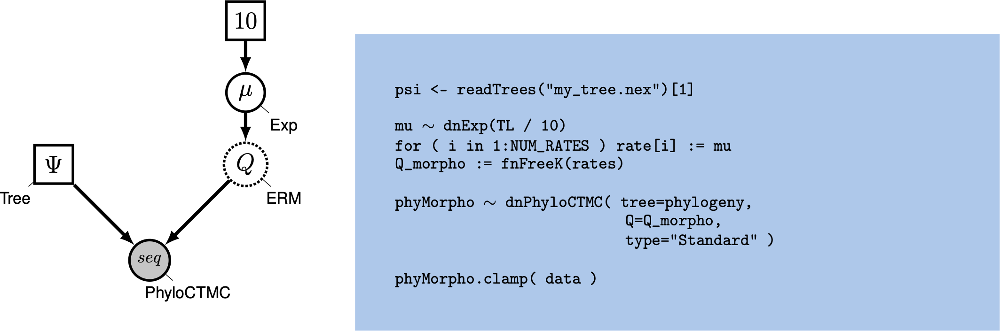






We are interested, in general, in the evolution of morphological characters in primates.
In this example we will look at the evolution of morphological character *solitariness* in primates.
We have two different types of solitariness: no (0) and yes(1).
You can try different morphological characters too.

Specifically, we want to know what the ancestral state of all primates is.
Furthermore, we want to know if solitariness is evolving under an equal-rates model, an unequal rates model, an irreversible model, or any other type of transition model.




We will start this tutorial with the simple equal rates Markov (ERM) model with two states, $k=2$ .
Thus, we will follow the  Tutorial very closely and refer you to that tutorial for more information.

Let us start with defining the rate matrix $Q$ for this 2-state model:
$$
Q = \begin{pmatrix} -\mu_1 & \mu_{12} \\
\mu_{21} & -\mu_2 \\
\end{pmatrix} \mbox{  .}
$$

Remember, the ERM model sets transitions to be equal from any state to any other state.
In that sense, our 2-state matrix really looks like this:
$$
Q = \begin{pmatrix} -(k-1)\mu & \mu \\
\mu & -(k-1)\mu \\
\end{pmatrix} \mbox{  .}
$$

Because this is a Jukes-Cantor-like model , state frequencies do not vary as a model parameter.
A visualization of this simple model can be seen in .




Graphical model showing the ERM model (left panel). Rev code specifying the ERM model is on the right-hand panel.



We will first perform a phylogenetic analysis using the ERM model.
In further sections, we will explore how to relax key assumptions of the ERM model.



In this example, we will use the solitariness data applied to a phylogeny of primates.
Remember, this example provides you with how to perform the analysis and you should try the same analysis with other morphological characters.




>Create a directory called `RB_DiscreteMorphology_RateASE_Tutorial` (or any name you like).
>
>Make sure that you have the data files copied into a subdirectory called `data`: .
{:.instruction}




>Create a new directory (in `RB_DiscreteMorphology_RateASE_Tutorial) called `scripts`.
>(If you do not have this folder, please refer to the directions in section .)
{:.instruction}

When you execute RevBayes in this exercise, you will do so within the main directory you created (`RB_DiscreteMorphology_RateASE_Tutorial`).




For complex models and analyses, it is best to create Rev script files that will contain all of the model parameters, moves, and functions.
In this exercise, you will work primarily in your text editor and create a set of files that will be easily managed and interchanged.
In this first section, you will write the following files from scratch and save them in the `scripts` directory:
-   `mcmc_ase_ERM.Rev`: the Rev-script file that loads the data, specifies the model describing discrete morphological character change (binary characters), and specifies the monitors and MCMC sampler.

All of the files that you will create are also provided in the this RevBayes tutorial.
Please refer to these files to verify or troubleshoot your own scripts.

>Open your text editor and create the master Rev file called `mcmc_ase_ERM.Rev` in the `scripts` directory.
>
>Enter the Rev code provided in this section in the new model file.
{:.instruction}

The file you will begin in this section will be the one you load into RevBayes when you have completed all of the components of the analysis.
In this section you will begin the file and write the Rev commands for loading in the taxon list and managing the data matrices.
Then, starting in section , you will move on to writing module files for each of the model components.
Once the model files are complete, you will return to editing `mcmc_ase_ERM.Rev` and complete the Rev script with the instructions given in section .



RevBayes uses the function `readDiscreteCharacterData()` to load a data matrix to the workspace from a formatted file.
This function can be used for both molecular sequences and discrete morphological characters.
Import the morphological character matrix and assign it to the variable `morpho`.
```
morpho <- readDiscreteCharacterData("data/primates_solitariness.nex")
```



Before we begin writing the Rev scripts for each of the model components, we need to instantiate a couple "helper variables" that will be used by downstream parts of our model specification files.
Create vectors of moves and monitors
```
moves = VectorMoves()
monitors = VectorMonitors()
```




First, we read in the tree topology:
```
phylogeny <- readTrees("data/primates_tree.nex")[1]
```

Next, we will create a Q matrix.
Recall that the ERM model has equal rates to transition between any states.
Therefore, we fist define a global rate variable $\mu$.
We will use an exponential prior with a mean of 10 events along this given phylogeny.
If you have an idea for another reasonable number of events, then feel free to change this prior mean.
Note that if you are uncertain, it is better to specify a slightly too high than too low prior mean.  
```
rate_pr := phylogeny.treeLength() / 10
mu ~ dnExp(rate_pr)
```
Since $\mu$ is a rate parameter, we will apply a scaling move to update it.
```
moves.append( mvScale(mu, lambda=1, weight=2.0) )
```
Next, we specify our vector of rates.
We need to do this because our rate matrix requires a vector of rates.
Since we use the ERM model, all rates in this vector are identical.
We could simply write `rate := [mu,mu]`, however, we want our script to be more flexible if we wanted to analyze multistate characters.
So we use for convenience a loop over the number of rates, which is $K*(K-1)$ rates where $K$ is the number of states.
```
NUM_RATES = NUM_STATES * (NUM_STATES-1)
for ( i in 1:NUM_RATES ) {
    rate[i] := mu
}
```
Now that we have our rates, we can specify the morphological rate matrix.
We will use the `fnFreeK` function for this.
```
Q_morpho := fnFreeK( rate, rescale=false )
```

Lastly, we set up the CTMC.
This should be familiar from the  tutorial.
We see some familiar pieces: tree and Q matrix.
We also have one new keywords: data type.
The data type argument specifies the type of data - in our case, "Standard", the specification for morphology.
```
phyMorpho ~ dnPhyloCTMC(tree=phylogeny, Q=Q_morpho, type="Standard")
phyMorpho.clamp(morpho)
```

All of the components of the model are now specified.





We can now create our workspace model variable with our fully specified model DAG.
We will do this with the `model()` function and provide a single node in the graph (`phylogeny`).
```
mymodel = model(phylogeny)
```

The object `mymodel` is a wrapper around the entire model graph and allows us to pass the model to various functions that are specific to our MCMC analysis.




The next important step for our Rev script file is to specify the monitors and output file names.
The first monitor we will create will monitor every named random variable in our model graph.
This will include every stochastic and deterministic node using the `mnModel` monitor.
In this case, it will only be our rate variable $\mu$.
It is still useful to specify the model monitor this way for later extensions of the model.
We will also name the output file for this monitor and indicate that we wish to sample our MCMC every 10 cycles.
```
monitors.append( mnModel(filename="output/solitariness_ERM.log", printgen=10) )
```

The second monitor we will add to our analysis will print information to the screen.
Like with `mnFile` we must tell `mnScreen` which parameters we'd like to see updated on the screen.
```
monitors.append( mnScreen(printgen=100) )
```

The third and final monitor might be new to you: the `mnJointConditionalAncestralState` monitor computes and writes the ancestral states to file.
```
monitors.append( mnJointConditionalAncestralState(tree=phylogeny,
                                                   ctmc=phyMorpho,
                                                   filename="output/solitariness_ERM.states.txt",
                                                   type="Standard",
                                                   printgen=1,
                                                   withTips=true,
                                                   withStartStates=false) )
```

The core arguments this monitor needs are a tree object (`tree=phylogeny`),
the phylogenetic model (`ctmc=phyMorpho`), an output filename (`filename="output/solitariness_ERM.states.txt"`),
the data type for the characters (`type="Standard"`), and the sampling frequency (`printgen=10}`.
The final argument, `withTips=true`, indicates that we do wish to record the tip states because we didn't know all tip values and might be interested in the most plausible values.

The monitor will produce a joint sample of ancestral states, where every ancestral state is conditional on the drawn value of its parent node state (except for the root node),
storing the samples every 10 iterations to the file `"output/solitariness_ERM.states.txt"`.
Viewing the states file, we see
```
Iteration	end_1	end_2	end_3	end_4	end_5	...
0	0	0	1	0	1	...
1	0	0	1	0	1	...
2	0	0	0	0	1	...
3	0	0	1	0	1	...
4	0	0	1	0	1	...
5	0	0	0	1	1	...
6	0	0	1	0	1	...
7	0	1	1	0	1	...
8	0	0	1	1	1	...
9	0	0	0	0	1	...
10	0	0	1	0	1	...
...
```
{:.Rev-output}




Once we have set up our model, moves, and monitors, we can now create the workspace variable that defines our MCMC run.
We do this using the `mcmc()` function that simply takes the three main analysis components as arguments.
```
mymcmc = mcmc(mymodel, monitors, moves, nruns=2, combine="mixed")
```

The MCMC object that we named `mymcmc` has a member method called `.run()`.
This will execute our analysis and we will set the chain length to `10000` cycles using the `generations` option.
```
mymcmc.run(generations=10000, tuningInterval=200)
```

Once our Markov chain has terminated, we will process the ancestral state samples.
This function will compute the posterior probabilities of the ancestral states from the samples.
Later we can visualize our ancestral states.
```
anc_states = readAncestralStateTrace("output/solitariness_ERM.states.txt")
anc_tree = ancestralStateTree(tree=phylogeny, ancestral_state_trace_vector=anc_states, include_start_states=false, file="output/solitariness_ase_ERM.tree", burnin=0.25, summary_statistic="MAP", site=1)
```


Finally we can close RevBayes.
Tell the program to quit using the `q()` function.
```
q()
```

>You made it! Save your file.
{:.instruction}




With all the parameters specified and all analysis components in place, you are now ready to run your analysis.
The Rev script you just created will be used by RevBayes and loaded in the appropriate order.

>Begin by running the RevBayes executable.
{:.instruction}

Provided that you started RevBayes from the correct directory (`RB_DiscreteMorphology_RateASE_Tutorial`),
you can then use the `source()` function to feed RevBayes your master script file (`mcmc_ase_ERM.Rev`).
```
source("scripts/mcmc_ase_ERM.Rev")
```
This will execute the analysis and you should see the following output (though not the exact same values):
```
   Processing file "scripts/mcmc_ase_ERM.Rev"
   Successfully read one character matrix from file 'data/primates_solitariness.nex'
   Attempting to read the contents of file "primates_tree.nex"
   Successfully read file

   Running MCMC simulation
   This simulation runs 2 independent replicates.
   The simulator uses 1 different moves in a random move schedule with 2 moves per iteration


Iter        |      Posterior   |     Likelihood   |          Prior   |    elapsed   |        ETA   |
----------------------------------------------------------------------------------------------------
0           |       -27.0579   |       -31.6633   |        4.60534   |   00:00:00   |   --:--:--   |
100         |       -27.0182   |       -30.8742   |        3.85594   |   00:00:00   |   --:--:--   |
200         |       -26.3264   |       -30.6164   |        4.29003   |   00:00:01   |   00:02:04   |
300         |       -26.3876   |       -30.5523   |        4.16473   |   00:00:02   |   00:02:44   |
...
```
{:.Rev-output}

When the analysis is complete, RevBayes will quit and you will have a new directory called `output` that will contain all of the files you specified with the monitors (Section ).





We will now switch to `R` using the package `RevGadgets` (see the  Tutorial for an overview, ).
Now that we have our posterior distribution of ancestral states, we want to visualize those results.
This section will aim to produce a pdf containing figures for the ancestral state estimates.

We have written a little R package called \RevGadgets that can be used to visualize the output of \RevBayes.


>Start R from the same working directory as you started RevBayes.
>This should be the directory where you now have you directory called `output` with the MCMC output files.
{:.instruction}

First, we need to load the R package RevGadgets
```{R}
library(RevGadgets)
```

Second, we specify the name of the tree file.
```{R}
tree_file = "output/solitariness_ase_ERM.tree"
```

Then, you plot the tree with ancestral states nicely mapped onto it.
You may want to experiment with some of the settings to make the plot look prettier.
For example, if you set `show_posterior_legend=TRUE` and `node_size_range=c(1, 3)`,
then the size of the circles will represent the posterior probability.
```{R}
# process the ancestral states
ase <- processAncStates(tree_file,
                       # Specify state labels.
                       # These numbers correspond to
                       # your input data file.
                         state_labels = c("0" = "no", "1" = "yes"))

# produce the plot object, showing MAP states at nodes.
# color corresponds to state, size to the state's posterior probability
p <- plotAncStatesMAP(t = ase,
                      tree_layout = "rect",
                      tip_labels_size = 1) +
     # modify legend location using ggplot2
     theme(legend.position = c(0.92,0.81))

```
Finally, we save the output into a PDF.
```{R}
ggsave(paste0("primates_solitariness_ASE_ERM_MAP.pdf"), p, width = 11, height = 9)
```
You can also plot the ancestral states as a pie chart, which nicely shows the uncertainty.
```{R}
p <- plotAncStatesPie(t = ase,
                      tree_layout = "rect",
                      tip_labels_size = 1) +
     # modify legend location using ggplot2
     theme(legend.position = c(0.92,0.81))

ggsave(paste0("primates_solitariness_ASE_ERM_Pie.pdf"), p, width = 11, height = 9)
```


>You can also find all these commands in the file called **plot_anc_states.R** which you can run as a script in R.
{:.instruction}

 shows the result of this analysis.






Ancestral state estimation of solitariness in primates.



You might observe that there is considerable uncertainty in the ancestral state  at the root node.
In the following exercise we'll relax the assumption of equal rates.

>Click below to begin the next exercise!
{:.instruction}

* [The unequal rates model]({{ base.url }}/tutorials/morph_ase/ase_free)
