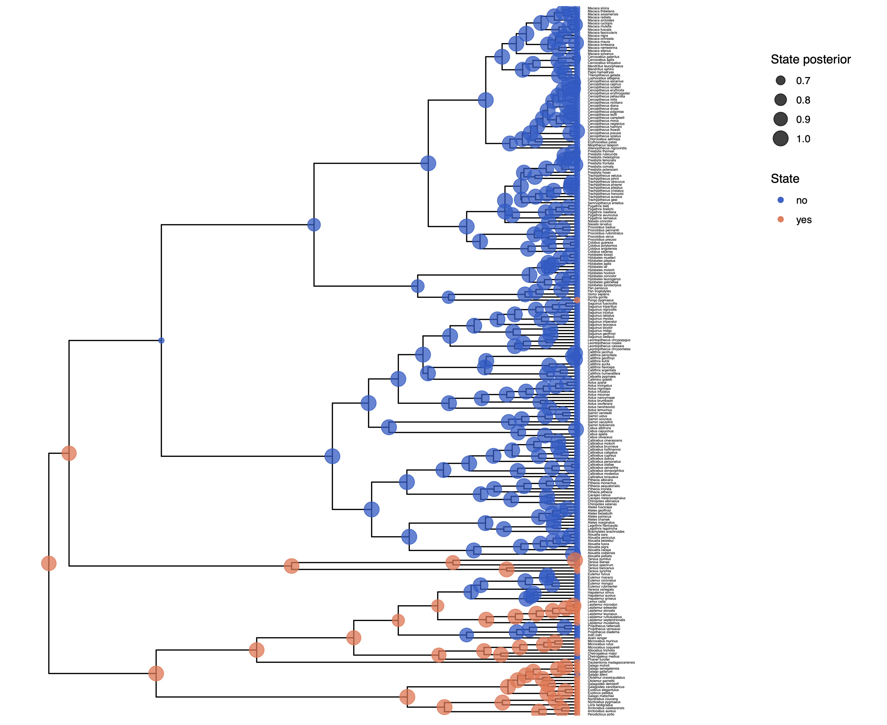
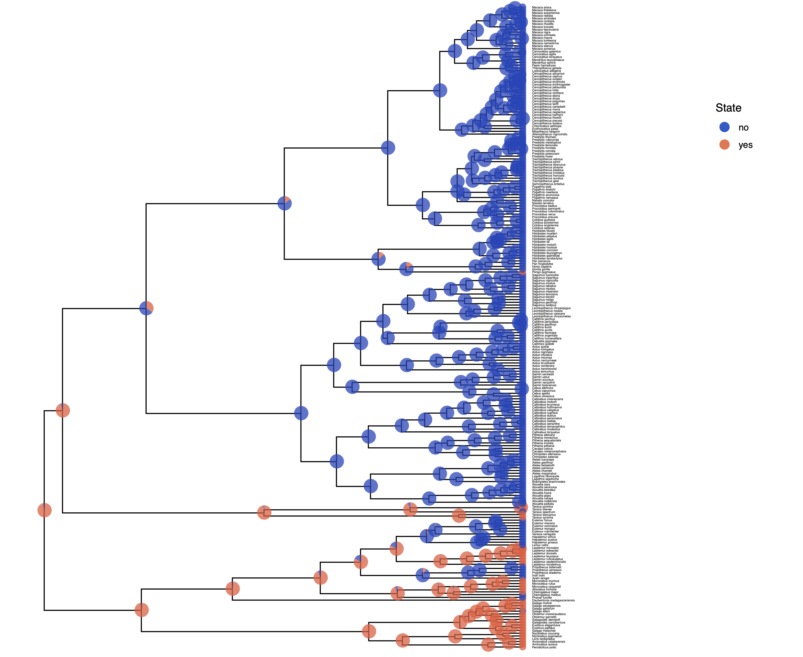



The instantaneous rate matrix encodes the transition rates between all pairs of evolutionary states.
It is important to emphasize that all rate matrices are assertions about how morphological evolution operates.
Depending on how one populates the rate matrix elements, different evolutionary hypotheses may be expressed.

When we model the evolution of morphological data, unlike nucleotide data, each change may require a sequence of intermediate changes.
Getting to one state may require going through another.
In short, it is probably not likely that one single model describes all characters well.

The ERM model makes a number of assumptions, but one that may strike you as unrealistic is the assumption that characters are equally likely to change from any one state to any other state.
That means that a trait is as likely to be gained as lost.
While this may hold true for some traits, we expect that it may be untrue for many others.

RevBayes has functionality to allow us to relax this assumption.
For example, we can define the rates
```
rates := [ [0.0,  mu_1],
           [ mu_2,  0.0] ]
```
and then create the rate matrix
```
Q := fnFreeK(rates)
```
which corresponds to the model

$$
Q = \begin{pmatrix}
 - & \mu_1 \\
\mu_2 & -
\end{pmatrix} \mbox{.}
$$

This is the independent rates model , which we will explore in this tutorial.

>Make a copy of the MCMC and model files you just made.
>Call them `mcmc_ase_ERM.Rev` and `model_ase_FreeK.Rev.
>These will contain the new model parameters and models.
{:.instruction}




At each place in which the output files are specified in the MCMC file, change the output path so you don't overwrite the output from the previous exercise.
For example, you might call your output file `output/solitariness_ase_freeK.log`.
Change source statement to indicate the new model file.



Our goal here is to create a rate matrix with 2 free parameters.
We will assume an exponential prior distribution for each of the rates.
Thus, we start be specifying the rate of this exponential prior distribution.
A good guess might be that 10 events happened along the tree, so the rate should be the tree-length divided by 10.

    rate_pr := phylogeny.treeLength() / 10

Now we can create our two independent rate variables drawn from an identical exponential distribution

    NUM_RATES = NUM_STATES * (NUM_STATES-1)
    for ( i in 1:NUM_RATES ) {
        rate[i] ~ dnExp(rate_pr)
        moves.append( mvScale( rate[i], weight=2 ) )
    }

Next, we put all the rates together into our rate matrix.
Don't forget to say that we do not rescale the rate matrix (`rescale=false`).
We would only rescale if we use relative rates.

    Q_morpho := fnFreeK( rate, rescale=false )


In this model, we also decide to specify an additional parameter for the root state frequencies instead of assuming the root state to be drawn from the stationary distribution.
We will use a Dirichlet prior distribution for the root state frequencies.

    rf_prior <- rep(1,NUM_STATES)
    rf ~ dnDirichlet( rf_prior )
    moves.append( mvBetaSimplex( rf, weight=2 ) )
    moves.append( mvDirichletSimplex( rf, weight=2 ) )

We need to modify the `dnPhyloCTMC` to pass in our new root frequencies parameter.

    phyMorpho ~ dnPhyloCTMC(tree=phylogeny, Q=Q_morpho, rootFrequencies=rf, type="Standard")
    phyMorpho.clamp(morpho)


>Now you are done with your unequal rates model. Give it a run!
{:.instruction}




As before in the  tutorial, we will use `R` and the package `RevGadgets` (see the  Tutorial for an overview, ) to plot the ancestral state estimates.

>Adapt your previous R script plot_anc_states.R
>Start R from the same working directory as you started RevBayes.
>Plot the ancestral state estimates.
{:.instruction}





Ancestral state estimates under the independent rates model. Note that the root state has changed compared to the ERM analysis!



Next, we want to actually see the estimated rates.
We can do this nicely in `RevGadgets` (see the  Tutorial, ):
```{R}
    library(RevGadgets)
    library(ggplot2)

    CHARACTER <- "solitariness"
    NUM_STATES <- 2
    NUM_RATES <- NUM_STATES * (NUM_STATES - 1)

    # specify the input file
    file <- paste0("output/", CHARACTER, "_freeK.log")

    # read the trace and discard burnin
    trace_quant <- readTrace(path = file, burnin = 0.25)

    # produce the plot object, showing the posterior distributions of the rates.
    p <- plotTrace(trace = trace_quant, vars = paste0("rate[", 1:NUM_RATES, "]"))[[1]] +
      # modify legend location using ggplot2
      theme(legend.position = c(0.88, 0.85))

    ggsave(paste0("Primates_", CHARACTER, "_rates_freeK.pdf"), p, width = 5, height = 5)
```




Posterior distribution of rates of morphological evolution.



We also see some clear evidence that the rates of gain and loss are not equal.
This gives as a first indication that the free rates model should be supported over the equal rates model.
We observe  that the rate of gain `rate[1]` is very low compared to the rate of loss `rate[2]`.
>Does this correspond to our observation of changes in ancestral state estimates, i.e., did we see more losses than gains?
{:.instruction}




Let us now actually test if the independent rates model is supported using statistical model testing.
Have a look at the  tutorial for more information.

>Copy and change your two MCMC scripts `mcmc_ase_ERM.Rev` and `mcmc_ase_freeK.Rev`.
{:.instruction}

You need to exchange the MCMC algorithm with the power posterior algorithm .
Remove all lines after `mymodel = model(phylogeny)`.
Then, you need to construct the `powerPosterior`, which works analogous to an MCMC.
In fact, it performs `cats=63` MCMC runs.
We chose `cats=63` as a conservative estimate.
Since this performs 64 MCMC simulations with 1000 iterations each, this can take a little while.
```
    ### Compute power posterior distributions
    pow_p = powerPosterior(mymodel, moves, monitors, "output/"+CHARACTER+"_ERM.out", cats=63, sampleFreq=10)
    pow_p.burnin(generations=2000,tuningInterval=250)
    pow_p.run(generations=1000)
```
The next step is to summarize the power posterior distribution, first using stepping stone sampling,
```
    ### Use stepping-stone sampling to calculate marginal likelihoods
    ss = steppingStoneSampler(file="output/"+CHARACTER+"_ERM.out", powerColumnName="power", likelihoodColumnName="likelihood")
    ss.marginal()
```
and then using path sampling.
```
    ### Use path-sampling to calculate marginal likelihoods
    ps = pathSampler(file="output/"+CHARACTER+"_ERM.out", powerColumnName="power", likelihoodColumnName="likelihood")
    ps.marginal()
```
You should see the following output
```{rb}
> source("scripts/ml_ase_ERM.Rev")
   Processing file "scripts/ml_ase_ERM.Rev"
   Successfully read one character matrix from file 'data/primates_solitariness.nex'
   Attempting to read the contents of file "primates_tree.nex"
   Successfully read file

Running burn-in phase of Power Posterior sampler for 2000 iterations.
The simulator uses 1 different moves in a random move schedule with 2 moves per iteration


Progress:
0---------------25---------------50---------------75--------------100
********************************************************************


Running power posterior analysis ...
Step   1 / 64		****************************************
Step   2 / 64		****************************************
Step   3 / 64		****************************************

...

Step 63 / 64		****************************************
Step 64 / 64		****************************************
   -31.7236
   -31.72593
```
{:.Rev-output}
Note that last two numbers; these are your marginal likelihood estimates.

Now, write another script to compute the power posterior distribution for the independent rates (freeK) model (see the `ml_ase_freeK.Rev` script). Then use stepping stone sampling and/or path sampling to calculate the marginal likelihood.

>Compute the Bayes factor! Which model is supported?
{:.instruction}


>Click below to begin the next exercise!
{:.instruction}

* [Testing for irreversible evolution]({{ base.url }}/tutorials/morph_ase/ase_irreversible)
