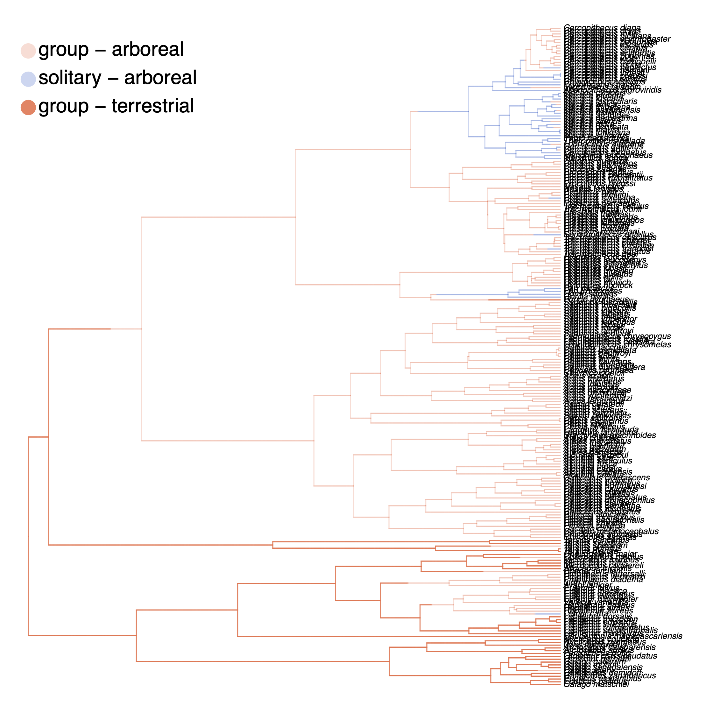
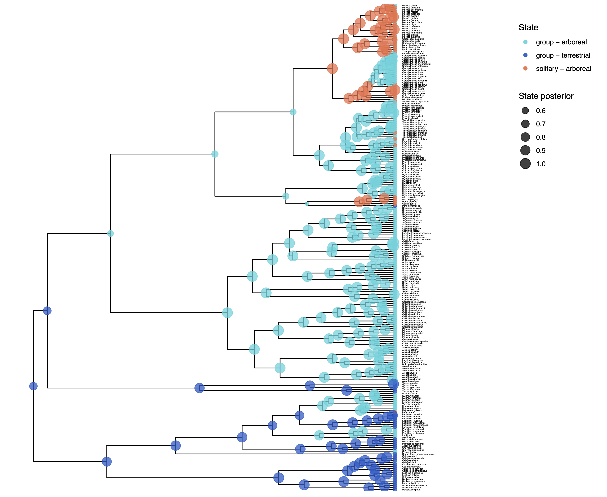
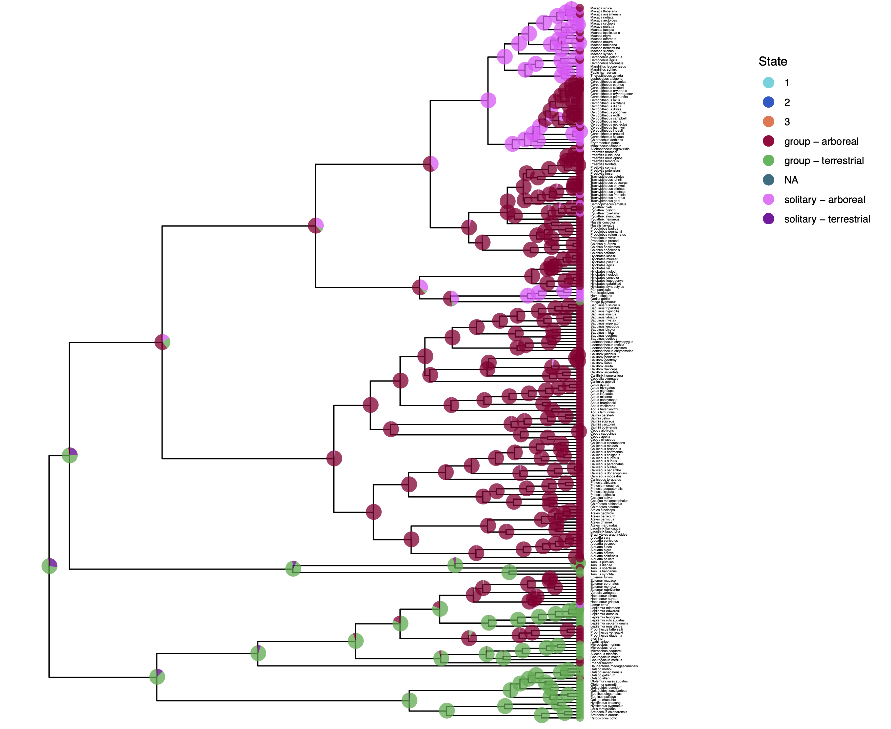
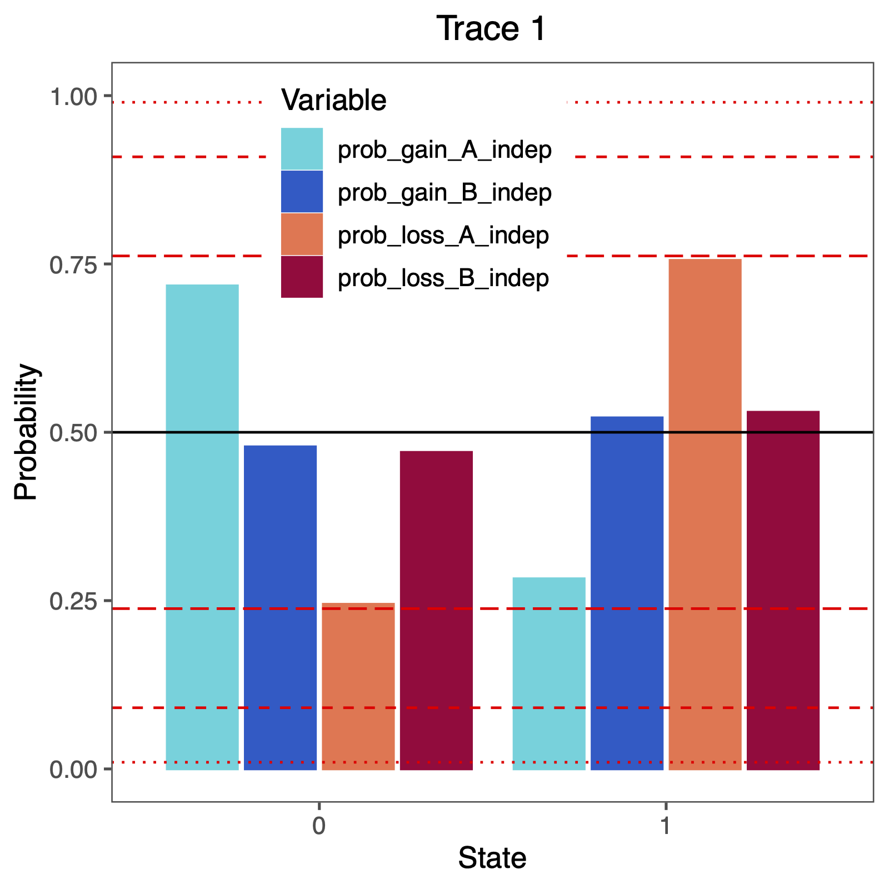



In this tutorial we want to test for correlation between two discrete characters.
In this primates dataset, we have the following discrete morpholigical characters: activity period, habitat, solitariness, terrestrially, number of males per group, mating system and diet (see  for more details).
For example, the habitat and terrestrially characters are very likely to be dependent on another.
But what about the other characters and how do we test for correlation?
It actually turns out to be very similar to our  analysis.




In this exercise, let us assume that we have two binary characters **A** and **B**.
To test for correlation, we need to combine these two characters into a single one.
That means, we will expand the state space to 00, 10, 01 and 11 where the first position corresponds to the state of character **A** and the second position corresponds to character **B**.
If both characters evolve independently and according to rates of gain $\alpha_A$ and $\alpha_B$ and rates of loss $\beta_A$ and $\beta_B$, respectively, then we can write the rate matrix as follows .

$$
Q = \begin{smallmatrix}
 & \begin{smallmatrix}00 & 10 & 01 & 11\end{smallmatrix} \\
\begin{smallmatrix}00\\10\\01\\11\end{smallmatrix} &
   \left(\begin{smallmatrix}- & \alpha_{A} & \alpha_{B} & 0 \\ \beta_{A} & - & 0 & \alpha_{B}\\ \beta_{B} & 0 & - & \alpha_{A} \\ 0 & \beta_{A} & \beta_{B} & -  \end{smallmatrix}\right)\\
\end{smallmatrix}
$$

Now if we assume instead that rates of gain and loss for both characters actually depend on the state of the other character, then we would obtain the full rate matrix of

$$
Q = \begin{smallmatrix}
 & \begin{smallmatrix}00 & 10 & 01 & 11\end{smallmatrix} \\
\begin{smallmatrix}00\\10\\01\\11\end{smallmatrix} &
   \left(\begin{smallmatrix}- & \mu_{1,2} & \mu_{1,3} & 0 \\ \mu_{2,1} & - & 0 & \mu_{2,4}\\ \mu_{3,1} & 0 & - & \mu_{3,4} \\ 0 & \mu_{4,2} & \mu_{4,3} & -  \end{smallmatrix}\right)\\
\end{smallmatrix}
$$

Note that only single transitions, i.e., a transition of one character and not both, are allowed at a time.
That is, we assume that not both characters can be gained or lost at the same infinitesimal small time interval, and instead that one usually precedes the other.

In the first rate matrix, we only had 4 parameters.
Now in the second rate matrix, we have 8 parameters.
If we want to test for correlations, we can simply test if specific parameters are indeed distinguishable .

These parameters are:
* $\mu_{1,2} \neq \mu_{3,4}$: a gain in character A depends on the state of character B
* $\mu_{2,1} \neq \mu_{4,3}$: a loss in character A depends on the state of character B
* $\mu_{1,3} \neq \mu_{2,4}$: a gain in character B depends on the state of character A
* $\mu_{3,1} \neq \mu_{4,2}$: a loss in character B depends on the state of character A

We will perform these tests here using reversible jump Markov chain Monte Carlo.

>Let us start with a fresh Rev script.
>Create an empty text file and call it `mcmc_corr_RJ.Rev.
{:.instruction}



As before, use the function `readDiscreteCharacterData()` to load a data matrix to the workspace from a formatted file.
However, this time we need to load two data matrices, one for each character.

    CHARACTER_A = "solitariness"
    CHARACTER_B = "terrestrially"
    NUM_STATES_A = 2
    NUM_STATES_B = 2

    morpho_A <- readDiscreteCharacterData("data/primates_"+CHARACTER_A+".nex")
    morpho_B <- readDiscreteCharacterData("data/primates_"+CHARACTER_B+".nex")

Next, we need to combine the 2 character into a single one.
In RevBayes, there is a convenient way so you don't have to do it manually.
You can use the function `combineCharacter()` which will combine any two characters.

    morpho = combineCharacter( morpho_A, morpho_B )


Again, to get a better understanding of how this happened just look into the newly created character data matrix (and the original ones if you want too).
```
> morpho
```
```
   NaturalNumbers character matrix with 233 taxa and 1 characters
   ==============================================================
   Origination:
   Number of taxa:                233
   Number of included taxa:       233
   Number of characters:          1
   Number of included characters: 1
   Datatype:                      NaturalNumbers
```
{:.Rev-output}
Notice that the *Datatype* for this character data matrix is *NaturalNumbers*.
In RevBayes, we always default back to *NaturalNumbers* as the data type because we can list arbitrarily many states, but for standard states we wouldn't know how to label them (except going through the alphabet, which is clearly shorter and doesn't have any more meaning than numbers).

Let us now also look at how the states are *combined*.
Again, we look first at the original character data matrix.
```
morpho.show()
```
```
   Allenopithecus_nigroviridis
   1
   Allocebus_trichotis
   2
   Alouatta_belzebul
   0
   Alouatta_caraya
   0
   Alouatta_coibensis
   0
   Alouatta_fusca
   0
   Alouatta_palliata
   0
   Alouatta_pigra
   0
   Alouatta_sara
   (0 2)
   Alouatta_seniculus
   0
   Aotus_azarai
   0
   Aotus_brumbacki
   (0 2)
   Aotus_hershkovitzi
   (0 2)
   ...
```
{:.Rev-output}
We see that *Allenopithecus nigroviridis* has state 1 and *Allocebus trichotis* has state 2.
There are also ambiguous states if one or both character were ambiguous or missing.
It is important to remember how the state space was expanded to set the rates up correctly.




As before, we need to instantiate a couple "helper variables" that will be used by downstream parts of our model specification files.
Create vectors of moves and monitors

    moves    = VectorMoves()
    monitors = VectorMonitors()




As usual for morphological analysis, we assume the phylogeny to be know.
Thus, we read in the tree as a constant variable:

    phylogeny <- readTrees("data/primates_tree.nex")[1]




Now we need to specify the correlated rates model.
Have a look again above at the rate matrix that we want to specify.
In the current example, we assume two binary morphological character.
This gives 4 states in total and therefore a 4x4 rate matrix.

Start with creating a matrix called `rates` where all elements are 0.0.

    for (i in 1:4) {
      for (j in 1:4) {
        rates[i][j] <- 0.0
      }
    }

Next, we specify the global rate prior.
As in all previous discrete morphological evolution excersises, we will use an exponential prior distribution with a mean of 10 events along the given phylogeny.

    rate_pr := phylogeny.treeLength() / 10

We also specify a prior probability of 0.5 that each pair of rates is indeed correlated.

    mix_prob <- 0.5

Then, let us specify the rate of gain for character **A**.
First, we do this for the case when character **B** is in state 0.
We will assume an exponential prior distribution here.

    rate_gain_A_when_B0 ~ dnExponential( rate_pr )

Second, we create the rate for a gain in character **A** when character **B** is in state 1.
This can either be the same rate (i.e., independent of the state of **B**) or its own rate.
Therefore we use the reversible jump mixture distribution.

    rate_gain_A_when_B1 ~ dnReversibleJumpMixture(rate_gain_A_when_B0, dnExponential( rate_pr ), mix_prob)

Now proceed in the same way for the rate of loss in character **A**, the rate of gain in character **B** and the rate of loss in character **B**.

    rate_loss_A_when_B0 ~ dnExponential( rate_pr )
    rate_loss_A_when_B1 ~ dnReversibleJumpMixture(rate_loss_A_when_B0, dnExponential( rate_pr ), mix_prob)

    rate_gain_B_when_A0 ~ dnExponential( rate_pr )
    rate_gain_B_when_A1 ~ dnReversibleJumpMixture(rate_gain_B_when_A0, dnExponential( rate_pr ), mix_prob)

    rate_loss_B_when_A0 ~ dnExponential( rate_pr )
    rate_loss_B_when_A1 ~ dnReversibleJumpMixture(rate_loss_B_when_A0, dnExponential( rate_pr ), mix_prob)

Next, since we use reversible jump MCMC, we also want to compute the probability that any of the pairs of rates is indeed equal.
We use the `ifelse` function to test for equivalence and store the value 1 if the rates are identical (i.e., the charatacer are independent with respect to that rate) or a 0 otherwise.

    prob_gain_A_indep := ifelse( rate_gain_A_when_B0 == rate_gain_A_when_B1, 1.0, 0.0 )
    prob_loss_A_indep := ifelse( rate_loss_A_when_B0 == rate_loss_A_when_B1, 1.0, 0.0 )
    prob_gain_B_indep := ifelse( rate_gain_B_when_A0 == rate_gain_B_when_A1, 1.0, 0.0 )
    prob_loss_B_indep := ifelse( rate_loss_B_when_A0 == rate_loss_B_when_A1, 1.0, 0.0 )

We need to specify moves on all our 8 rate variables.
First, we specify a scaling move on each rate variable separately.

    moves.append( mvScale( rate_gain_A_when_B0, weight=2 ) )
    moves.append( mvScale( rate_gain_A_when_B1, weight=2 ) )
    moves.append( mvScale( rate_loss_A_when_B0, weight=2 ) )
    moves.append( mvScale( rate_loss_A_when_B1, weight=2 ) )
    moves.append( mvScale( rate_gain_B_when_A0, weight=2 ) )
    moves.append( mvScale( rate_gain_B_when_A1, weight=2 ) )
    moves.append( mvScale( rate_loss_B_when_A0, weight=2 ) )
    moves.append( mvScale( rate_loss_B_when_A1, weight=2 ) )

On the 4 reversible jump variable, we also need to specify reversible jump moves to actually perform the reversible jump MCMC algorithm.

    moves.append( mvRJSwitch(rate_gain_A_when_B1, weight=2.0) )
    moves.append( mvRJSwitch(rate_loss_A_when_B1, weight=2.0) )
    moves.append( mvRJSwitch(rate_gain_B_when_A1, weight=2.0) )
    moves.append( mvRJSwitch(rate_loss_B_when_A1, weight=2.0) )

Now that we have our rate parameters, we can fill in our rates matrix.
If you are unsure about the indices, look again at the described rate matrix above.

    rates[1][2] := rate_gain_A_when_B0 # 00->10
    rates[1][3] := rate_gain_B_when_A0 # 00->01
    rates[2][1] := rate_loss_A_when_B0 # 10->00
    rates[2][4] := rate_gain_B_when_A1 # 10->11
    rates[3][1] := rate_loss_B_when_A0 # 01->00
    rates[3][4] := rate_gain_A_when_B1 # 01->11
    rates[4][2] := rate_loss_B_when_A1 # 11->10
    rates[4][3] := rate_loss_A_when_B1 # 11->01

Finally, we can create our transition rate matrix `Q` using the rate matrix function `fnFreeK`.

    Q_morpho := fnFreeK(rates, rescaled=FALSE)


For this model, we also want to specify parameters for the root frequencies $\pi$, and thus also their prior distributions.
We assume a flat Dirichlet distribution, which assigns each combination of root frequencies the exact same prior probability.
Remember that we 2 binary characters and therefore 4 states.
Thus we need a vector of 2*2 filled with ones.

    rf_prior <- rep(1,NUM_STATES_A*NUM_STATES_B)

We use this for our Dirichlet distribution.

    rf ~ dnDirichlet( rf_prior )

We apply two different moves to the root frequencies, a `mvBetaSimplex` that changes a single frequencies and rescales the other frequencies, and a `mvDirichletSimplex` that redraws all root frequencies together.

    moves.append( mvBetaSimplex( rf, weight=2 ) )
    moves.append( mvDirichletSimplex( rf, weight=2 ) )


Lastly, we set up the CTMC.
Not that this time we need to specify the `type=NaturalNumbers`, as we saw this is used in the *combined* data matrix.

    phyMorpho ~ dnPhyloCTMC(tree=phylogeny, Q=Q_morpho, rootFrequencies=rf, type="NaturalNumbers")

We conclude the model specification by attaching the *combined* data matrix to the CTMC object.

    phyMorpho.clamp( morpho )







We can now create our workspace model variable with our fully specified model DAG.
We will do this with the `model()` function and provide a single node in the graph (`phylogeny`).

    mymodel = model(phylogeny)


The object `mymodel` is a wrapper around the entire model graph and allows us to pass the model to various functions that are specific to our MCMC analysis.




As in all our analyses, we will add the same monitors to plot the ancestral states and also the stochastic character maps.
We will specify the same model monitor (`mnModel`), screen monitor (`mnScreen`), ancestral state monitor (`mnJointConditionalAncestralState`) as before () and the stochastic character mapping monitor (`mnStochasticCharacterMap`) ().

    # 1. for the full model #
    monitors.append( mnModel(filename="output/"+CHARACTER_A+"_"+CHARACTER_B+"_corr_RJ.log", printgen=1) )
    # 2. and a few select parameters to be printed to the screen #
    monitors.append( mnScreen(printgen=100) )
    # 3. add an ancestral state monitor
    monitors.append( mnJointConditionalAncestralState(tree=phylogeny,
                                                      ctmc=phyMorpho,
                                                      filename="output/"+CHARACTER_A+"_"+CHARACTER_B+"_corr_RJ.states.txt",
                                                      type="NaturalNumbers",
                                                      printgen=1,
                                                      withTips=true,
                                                      withStartStates=false) )
    # 4. add an stochastic character map monitor
    monitors.append( mnStochasticCharacterMap(ctmc=phyMorpho,
                                              filename="output/"+CHARACTER_A+"_"+CHARACTER_B+"_corr_RJ_stoch_char_map.log",
                                              printgen=1,
                                              include_simmap=true) )





Setup the MCMC analysis as before ().
This will run 2 replicated MCMC runs with 10,000 iterations and auto-tuning the moves every 200 iterations.

    # Initialize the MCMC object #
    mymcmc = mcmc(mymodel, monitors, moves, nruns=2, combine="mixed")

    # Run the MCMC #
    mymcmc.run(generations=5000, tuningInterval=200)




After the MCMC simulation, we can calculate the maximum a posteriori
*marginal*, *joint*, or *conditional* character history.
As before (), we will compute the ancestral state estimates as well as the stochastic character mappings () which generates the **SIMMAP** 
formatted files used for plotting in the **phytools** R package .

    # Read in the tree trace and construct the ancestral states (ASE) #
    anc_states = readAncestralStateTrace("output/"+CHARACTER_A+"_"+CHARACTER_B+"_corr_RJ.states.txt")
    anc_tree = ancestralStateTree(tree=phylogeny,
                                ancestral_state_trace_vector=anc_states,
                                include_start_states=false, file="output/"+CHARACTER_A+"_"+CHARACTER_B+"_ase_corr_RJ.tree",
                                burnin=0.25,
                                summary_statistic="MAP",
                                site=1,
                                nStates=NUM_STATES_A*NUM_STATES_B)

    # read in the sampled character histories
    anc_states_stoch_map = readAncestralStateTrace("output/"+CHARACTER_A+"_"+CHARACTER_B+"_corr_RJ_stoch_char_map.log")


    char_map_tree = characterMapTree(tree=phylogeny,
                 ancestral_state_trace_vector=anc_states_stoch_map,
                 character_file="output/"+CHARACTER_A+"_"+CHARACTER_B+"_corr_RJ_marginal_character.tree",
                 posterior_file="output/"+CHARACTER_A+"_"+CHARACTER_B+"_corr_RJ_marginal_posterior.tree",
                 burnin=0.25,
                 num_time_slices=500)


This is all you need for this analysis.
Don't forget to quit RevBayes at the end of the script.

    # Quit RevBayes #
    q()


>This is all that you need to do for the rate variation analysis with hidden rate categories and stochastic character mapping. Save your script and give it a try!
{:.instruction}






We have previously plotted the ancestral states, both the *maximum a posterior* (MAP) states as well as the posterior probabilities of all states shown as pie chart .
We also showed before how to plot the stochastic character mapping using **phytools**.
My output is shown in .







Stochastic character map (left) and ancestral state estimates (middle and right) of the combined character solitariness and terrestrially under the correlated model of morphological evolution. You might notice that there no joint state solitary and terrestrial, which means that if primates are solitary, then they live in trees.



The more important output analysis here is the probability of the rates being dependent or not.
Therefore, we will plot the probability that two rates were identical.
You can do this nicely in `RevGadgets` 
```{R}
library(RevGadgets)
library(ggplot2)

CHARACTER_A <- "solitariness"
CHARACTER_B <- "terrestrially"

# specify the input file
file <- paste0("output/", CHARACTER_A, "_", CHARACTER_B, "_corr_RJ.log")

# read the trace and discard burnin
trace_qual <- readTrace(path = file, burnin = 0.25)

BF <- c(3.2, 10, 100)
p <- BF / (1 + BF)
# produce the plot object, showing the posterior distributions of the rates.
p <- plotTrace(
  trace = trace_qual,
  vars = c("prob_gain_A_indep", "prob_gain_B_indep", "prob_loss_A_indep", "prob_loss_B_indep")
)[[1]] +
  ylim(0, 1) +
  geom_hline(yintercept = 0.5, linetype = "solid", color = "black") +
  geom_hline(yintercept = p, linetype = c("longdash", "dashed", "dotted"), color = "red") +
  geom_hline(yintercept = 1 - p, linetype = c("longdash", "dashed", "dotted"), color = "red") +
  # modify legend location using ggplot2
  theme(legend.position = c(0.40, 0.825))

ggsave(paste0("Primates_", CHARACTER_A, "_", CHARACTER_B, "_corr_RJ.pdf"), p, width = 5, height = 5)
```




Probability that a rate of gain or loss of a character was independent. If we see a high posterior probability for 1, then that means that the rate of gain or loss for the character is independent of the other character. We also show the prior (black solid line), weak support (BF $<3.2$, long-dashed red line), substantial support ($3.2<$ BF $<10$, dashed red line), and strong support ($10<$ BF $<100$, dotted red line). Even though the support varies, for this specific analysis we don't see any significant support of either correlated or independent rates.




>How can you explain the observed allocation of clades to the slow and fast rate categories?
>Do ancestral state estimates match with the stochastic character maps?
>How certain are we in the ancestral state estimates?
{:.instruction}
