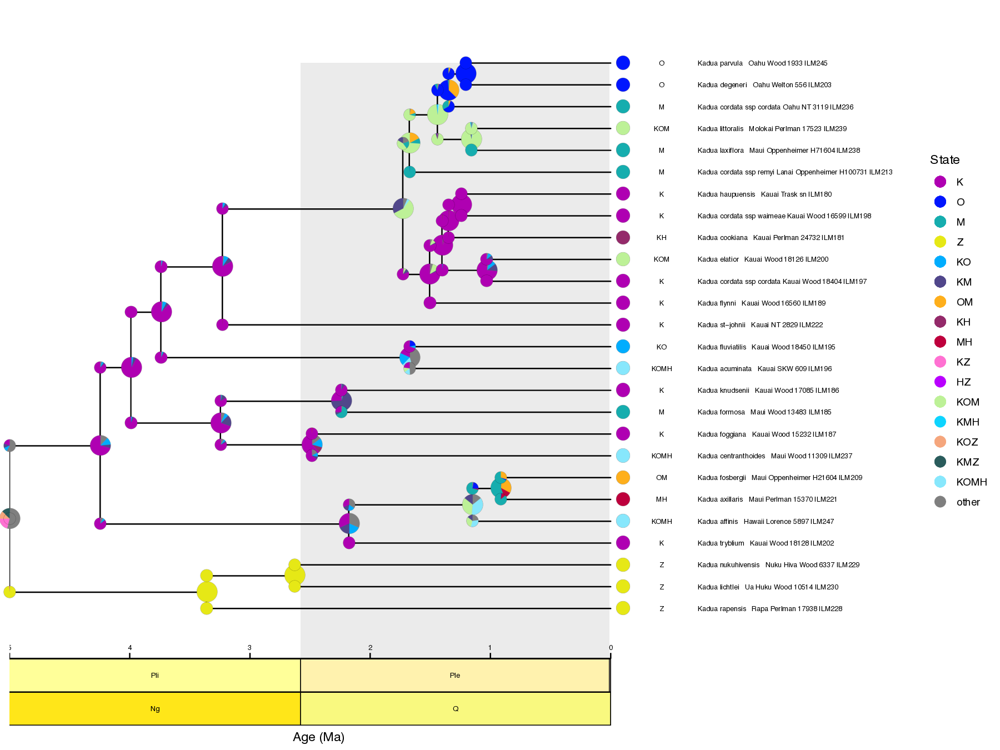



In the previous examples, we used a GeoSSE model  to investigate the evolution of the Hawaiian *Kadua*. The GeoSSE model allows us to estimate rates of within-region speciation, extinction, between-region speciation, and dispersal that differ among regions. Biologically, we expect that these different rates are informed by features of the regions where the species are evolving. For example, we might expect that species disperse at a lower rate between more distant islands, or go extinct at a higher rate on smaller islands.

The FIG model  and the Multiple Feature-Informed GeoSSE (MultiFIG) model  attempt to model this expectation. Rather than giving each region its own evolutionary rate parameters, FIG models use functions to link features of those regions to evolutionary rates. This allows us to test hypotheses about the importance of certain environmental features on evolutionary processes. It also has the benefit of reducing the number of parameters that need to be estimated. The number of parameters in the MultiFIG model is constant with respect to the number of regions, so we can investigate systems with more regions without suffering an explosion in the number of model parameters. In this tutorial, we will model the evolution and biogeography of *Kadua* using seven regions and eight regional features. Later tutorials will explore how to adapt FIG to allow for regional features, and their linked biogeographic rates, to change over time.



Much like the GeoSSE model, MultiFIG uses four core processes: within-region speciation, extinction, between-region speciation, and dispersal. However, instead of assigning each region or region pair its own rate for each process, MultiFIG uses regional feature data and a series of strength parameters and functions to construct rates.




Graphical model of MultiFIG. Square nodes represent constant values (data). Circle nodes with solid lines represent stochastic variables (model parameters, and the phylogeny, which is fixed in this analysis). Circle nodes with dotted lines represent deterministic variables (functions). Large rectangles indicate iterative plates.



The FIG model incorporates geographical features with two value types as model variables: quantitative features and categorical features. Quantitative features have continuous real values while categorical features have discrete values. MultiFIG also separates data by dimensionality type, incorporating one-dimensional within-region data and two-dimensional between-region data. We use four containers to store this data: $w_c$, $w_q$, $b_c$, and $b_q$.

Each regional feature is assigned a "feature effect" parameter that measures the strength and direction of the effect of a particular feature on a particular process. Note that "effect" refers to a mathematical relationship here, but does *not* indicate causality. These strength parameters are referred to as $\sigma$ and $\phi$, representing the effects of categorical and quantitative features respectively. There is one $\sigma$ or $\phi$ parameter per feature per process. For example, $\phi_w^{Altitude}$ would represent the relationship between region altitude and within-region speciation.

For each process, the categorical and quantitative feature effects (with feature data modified by strength parameters) are gathered into $c$ and $q$ vectors, then ultimately combined into an $m$ vector. The $m$ vector represents the total effects of all regional features on a particular process, with entries representing each region (or region pair for between-region processes). The $m$ vector represents relative rates among regions, but to obtain absolute rates, the $m$ vector for each process is multiplied by a process-specific base rate parameter $\rho$. This constructs the $r$ vectors that are analogous to GeoSSE rates: $r_w$ for within-region speciation rates, $r_e$ for extinction rates, and $r_d$ for dispersal rates. Calculating $r_b$ for between-region speciation rates also requires the use of a range split score, as in . 

For example, the absolute rates for within-region speciation at region $i$ equals

$$
r_w(i) = \rho_w \times m_w(i)
$$

where $\rho_w$ is the base rate and $m_w(i)$, the relative rate factor for this process at region $i$. The relative rate factor is defined as

$$
  m_w(i) = \text{exp} \Bigl\{ \underbrace{ \sum_{k} \phi_w^{(k)} q^{(k)}_w(i) }_{\text{quantitative effects}} + \underbrace{\sum_{\ell} \sigma_w^{(\ell)} c^{(\ell)}_w(i)}_{\text{categorical effects}} \Bigr\}
$$

which looks complicated, but can be understood easily in parts. Each quantitative feature from layer $k$ for region $i$ is represented by $q^{(k)}_w(i)$ and multiplied by a corresponding feature effect parameter that links the feature to the within-region speciation rate, called $\phi_w^{(k)}$. A similar structure is used for categorical features, $c^{(\ell)}_w(i)$ and categorical feature effect parameters, $\sigma_w^{(\ell)}$, for each categorical layer $\ell$. (In this example, we assume categorical variables take values 0 or 1 to simplify notation.) Each individual term can be negative, positive, or zero, and so can the sum of all terms. The sum of effects across all layers for region $i$ is then exponentiated, yielding a relative rate factor for each region. For example, if the relative rates for regions $i$ and $j$ have the relationship $m_w(i) > m_w(j)$ then the absolute rates also follow $r_w(i) > r_w(j)$. Other $m$ functions behave in a similar manner.More details on the design of the $m$ functions are provided in .

In this analysis, we are examining eight regional features. The first 4 are quantitative: maximum altitude (m), log maximum altitude (m), distance (km), and log distance (km). We include the log features because they will allow us to better understand the *shape* of the relationship between features and processes. For example, it may be that intermediate values of a particular feature are related to the highest rates of a particular process, so we would expect the feature strenght parameter to be positive and the log-feature strength parameter to be negative. The other 4 features are categorical: age class (old/young), growth class (decay/growth), dispersal class (short/long), and relative age class (older/younger).


<br>


Examples of a between-region quantitative feature (distance) and a categorical feature (relative island age). These features (and others) may shape dispersal and between-region speciation rates.



Because each within-region feature acts on 2 processes and each between-region feature acts on 2 processes, this creates a total of 16 parameters. Adding one $\rho$ parameter for each process results in a total of 20 model parameters to be estimated. We will use a time-calibrated phylogeny and present-day ranges for *Kadua* to estimate these parameters, and use those estimates to determine which regional features are most strongly related to particular processes.




The 8 regional features investigated in this analysis and the 16 associated parameters relating these features to core biogeographic processes.






> ## Important version info!
> **Note:** This tutorial currently requires specific versions of [RevBayes](https://github.com/revbayes/revbayes/commit/55c8174ea696fbd580daad8383d58f7ffd444d43) and [TensorPhylo](https://bitbucket.org/mrmay/tensorphylo/commits/daa0aed2c4acd394e2cb098b1c3706633d5b8301) to run properly (see linked branches and commits).
>
> We recommend that you complete the tutorial using a [PhyloDocker](https://hub.docker.com/r/sswiston/phylo_docker) container, which is pre-configured with the above versions of RevBayes and TensorPhylo. Instructions to install and use PhyloDocker are here: [link](https://revbayes.github.io/tutorials/docker).
{:.info}

Running a MultiFIG analysis in RevBayes requires several important data files, including a file representing the time-calibrated phylogeny and a biogeographic data matrix describing the ranges for each species. `kadua.tre` is a time-calibrated phylogeny of *Kadua*. `kadua_range_n7.nex` assigns ranges to each species for a seven-region system: G (Gardner), N (Necker), K (Kauaii), O (Oahu), M (Maui Nui Complex), H (Hawaii), and Z (mainland). For each species (row) and region (column), the file reports if the species is present (1) or absent (0) in that region. There are also feature files that contain regional feature data, and a `feature_summary.csv` file that describes all the regional feature files (where they are found and what kind of data they contain).

If you prefer to run a single script instead of entering each command manually, the RevBayes script called `multifig.Rev` contains all of the commands that are used in the tutorial. The data and script can be found in the `Data files and scripts` box in the left sidebar of the tutorial page. Somewhere on your computer, you should create a directory (folder) for this tutorial. This is the main directory for the tutorial, and you will run all of your commands from here. Inside the tutorial directory, you should create a `scripts` directory. This is the directory where you will put the `multifig.Rev` script. Then, you should create a `data` directory inside the tutorial directory. Within `data`, create two more directories: `hawaii`, and `kadua`. The data files related to *Kadua* (`kadua.tre` and `kadua_range_n7.nex`) will go in the `kadua` directory. The data related to Hawaii, including the `feature_summary.csv` file, the `feature_description.csv` file, and all feature-related `*_feature*.csv` files will go in the `hawaii` directory. However, you can always modify the filepaths to locate the data wherever you choose to download it.





After starting up RevBayes from within your main tutorial directory, you can load the TensorPhylo plugin. You will need to know where you downloaded the plugin. For example, if you cloned the TensorPhylo directory into your home directory at `~/tensorphylo`, you would use the following command to load the plugin:

```
loadPlugin("TensorPhylo", "~/tensorphylo/build/installer/lib")
```

Note that if you're using the PhyloDocker image, then the Tensorphylo plugin is installed in `/.plugins`, where RevBayes is able to find it without including a filepath:

```
loadPlugin("TensorPhylo")
```

Next, we want to tell RevBayes where to find our data (and where to save our output later). If you have set up your tutorial directory in a different way than suggested, you will need to modify the filepaths.

```
# filesystem
analysis      = "multifig"
dat_fp        = "./data/kadua/"
phy_fn        = dat_fp + "kadua.tre"
bg_fn         = dat_fp + "kadua_range_n7.nex"
geo_fp        = "./data/hawaii/"
feature_fn    = geo_fp + "feature_summary.csv"
out_fn        = "./output/" + analysis
```

Eventually, we will be running an MCMC analysis at the end of the tutorial. This means that any time we create a new model parameter, we will want RevBayes to update that parameter in MCMC, so we need to add a 'move' for it. After we have set up our model, we will add some 'monitors' so RevBayes records the MCMC output in certain locations. Therefore, we will set up containers `moves` and `monitors` at the beginning of the script. We can also choose some MCMC settings for later: the number of computer processors to use, the number of generations we want to run the analysis for, and how often we want RevBayes to record output.

```
# MCMC variables
num_proc  = 6
num_gen   = 5000
print_gen = 20
moves     = VectorMoves()
monitors  = VectorMonitors()
```



Next, we will read in the data. Let's start with the phylogenetic tree.

```
# tree input
phy <- readTrees(phy_fn)[1]
```

In order to set up our analysis, we will want to know some information about this tree: the taxa, the number of taxa, and the number of branches.

```
taxa         = phy.taxa()
num_taxa     = taxa.size()
num_branches = 2 * num_taxa - 2
```

We also want to read in the range data. Much like in the GeoSSE example, this range data is in a binary format, with rows representing each species and columns representing regions. A `1` is used to indicate that a species is present in a particular region, and a `0` indicates that it is not present in that region.

```
dat_01 = readDiscreteCharacterData(bg_fn)
```

We want to get some information about this range data: how many regions there are, and how many ranges can be constructed from these regions. But before we can calculate the number of ranges, we have to decide what our maximum range size will be -- that is, the maximum number of regions a species is allowed to exist in at the same time. In this example, we will set the maximum range size to 4. This has the potential to speed up the analysis dramatically in systems with many regions because it decreases the total state space (the number of ranges in the model).

```
num_regions    = dat_01.nchar()
max_range_size = 4
num_ranges     = 0
for (k in 1:max_range_size) {
    num_ranges += choose(num_regions, k)
}
```

We want to format the range data to be used in a GeoSSE-type analysis. This will take the binary range data and output integer states. We can look at what binary ranges correspond to which integer states by printing out the state descriptions. Actually, we can save this information to a file for easy access later!

```
dat_nn         = formatDiscreteCharacterData(dat_01, format="GeoSSE", numStates=num_ranges)
desc           = dat_nn.getStateDescriptions()

write("index,range\n", filename=label_fn)
for (i in 1:desc.size()) {
    write((i-1) + "," + desc[i] + "\n", filename=label_fn, append=true)
}
```

We also want to get our feature data. Using the RevBayes function `readRegionalFeatures`, we can look at the `feature_summary.csv` file and automatically look for feature data. The `feature_summary.csv` file is specially formated to be read by RevBayes, consisting of 5 columns. The first column is `time_index`. More advanced analyses, like TimeFIG, may involve time-heterogenous region features, in which case we would need to index our feature data by time slices. However, in this analysis, we are only using present-day data, so all of our features will have a `time_index` of 1. The second column is `feature_index`. Each feature type (within-region categorical, within-region quantitative, between-region categorical, and between-region quantitative) has a container that can contain several features, so we want to index the features within those containers. For example, in this analysis, each container has two features, indexed 1 and 2. Keep in mind that Feature 1 in one container does not have to be related to Feature 1 in another container. It's important to keep track of these indices so you know which output corresponds to which feature. For this analysis, we've listed the features in order on the feature table. The third column is `feature_relationship`. This column is for indicating whether the feature is a within-region feature or a between-region feature, with options 'within' or 'between'. The fourth column is `feature_type`, for indicating whether the feature is quantitative of categorical. Finally, the fifth column is `feature_path`, which gives a filepath for the actual file containing the data for that feature.

```
geo_features <- readRegionalFeatures(feature_fn, delimiter=",", nonexistent_region_token="nan")
```

Next, we transform the feature data into feature layers, a RevBayes object that we will use later for informing our biogeographic rates. First, we normalize the features (important for scaling reasons). Then we pull each feature type out of our `geo_features` object using `.get()`. The `1` in this function is for time slice 1, because we are only using one time slice in this analysis (features do not change over time). Finally, we create the layers.

```
# normalize/re-center values, then provide methods to get feature-sets
# for CW/QW/CB/QB associated with D/E/W/B
geo_features.normalize("within")
geo_features.normalize("between")

# get feature-sets for each measurement-type, process-type, and timeslice
feature_CW <- geo_features.get("within","categorical",1)
feature_QW <- geo_features.get("within","quantitative",1)
feature_CB <- geo_features.get("between","categorical",1)
feature_QB <- geo_features.get("between","quantitative",1)

for (i in 1:feature_CW.size()) {layer_CW[i] <- feature_CW[i].get()}
for (i in 1:feature_QW.size()) {layer_QW[i] <- feature_QW[i].get()}
for (i in 1:feature_CB.size()) {layer_CB[i] <- feature_CB[i].get()}
for (i in 1:feature_QB.size()) {layer_QB[i] <- feature_QB[i].get()}
```



In the MultiFIG model, there are four processes: within-region speciation, extinction, between-region speciation, and dispersal. Rates per region or region pair are calculated using feature data, feature effect parameters, and base rate parameters. First, we will set priors for the feature effect parameters. Then we will use the RevBayes function `fnFeatureInformedRates` to combine the feature data and feature effect parameters to create $m$ vectors/matrices, representing relative rates of a particular process per region or region pair. Finally, we will multiply the $m$ for each process by base rate parameters to get model rates $r_w$, $r_e$, $r_b$, and $r_d$.

Let's start by creating distributions that we will use for all $\phi$ and $\sigma$ parameters. We will use **reversible jump** distributions here. These distributions are used for MCMC analyses that use reversible jump moves. In a reversible jump MCMC move, we can draw proposals from a traditional distribution (like the uniform distributions used here), but we can also propose that a certain parameter is equal to a particular fixed value (in this case, `rj_null_value=0`). Setting a feature effect to 0 essentially lets our MCMC turn certain feature effects 'off' entirely. This allows us to do model selection based on the results of the MCMC analysis -- it will actually tell us which combination of features is the best model! We also have to assign an `rj_prob` to the reversible jump distribution, which is the prior probability of RJMCMC using the fixed value instead of the continuous distribution.

The continuous distributions we will use in this analysis are various uniform distributions with different bounds. If we have strong reasoning about how a particular feature might affect a process, we can apply an informed prior to that feature effect parameter. For example, if we believe that distance should always have a negative effect on dispersal, we can apply the `rj_base_neg_dist` to the parameter that associates distance with dispersal, telling the analysis that the parameter should either be 'off' or some negative value.

```
# set up priors for feature effects
rj_null_value <- 0.0          # fixed "off-value" for RJMCMC
rj_prob       <- 0.5          # prob. of RJMCMC taking "off-value"

# prior of "on-value" for RJMCMC
bound <- 2
rj_base_sym_dist = dnUniform(-bound, bound)
rj_base_neg_dist = dnUniform(-bound, 0)     # negative only (e.g. distance on dispersal)
rj_base_pos_dist = dnUniform(0, bound)      # positive only (e.g. distance on betw.-reg. speciation)

rj_sym_dist = dnRJMixture(rj_null_value, rj_base_sym_dist, p=rj_prob)
rj_neg_dist = dnRJMixture(rj_null_value, rj_base_neg_dist, p=rj_prob)
rj_pos_dist = dnRJMixture(rj_null_value, rj_base_pos_dist, p=rj_prob)
```

We will start by assigning symmetric distributions to all of the parameters, and then change a selection of parameters for which we have strong reasoning.

```
# categorical feature effects
for (i in 1:feature_CW.size()) sigma_w[i] ~ rj_sym_dist
for (i in 1:feature_CW.size()) sigma_e[i] ~ rj_sym_dist
for (i in 1:feature_CB.size()) sigma_d[i] ~ rj_sym_dist
for (i in 1:feature_CB.size()) sigma_b[i] ~ rj_sym_dist

# quantitative feature effects
for (i in 1:feature_QW.size()) phi_w[i] ~ rj_sym_dist
for (i in 1:feature_QW.size()) phi_e[i] ~ rj_sym_dist
for (i in 1:feature_QB.size()) phi_d[i] ~ rj_sym_dist
for (i in 1:feature_QB.size()) phi_b[i] ~ rj_sym_dist

# force signed relationships between region features and rates
# (overrides existing distribution assignments)
phi_b[1]   ~ rj_pos_dist   # Distance (km) results in faster speciation
phi_b[2]   ~ rj_pos_dist   # Log-distance (km) results in faster speciation
sigma_b[1] ~ rj_pos_dist   # LDD (1) results in faster speciation
sigma_w[1] ~ rj_pos_dist   # High Islands (1) drives faster speciation 
phi_d[1]   ~ rj_neg_dist   # Distance (km) results in slower dispersal
phi_d[2]   ~ rj_neg_dist   # Log-distance (km) results in slower dispersal
sigma_d[1] ~ rj_neg_dist   # LDD (1) results in slower dispersal
sigma_e[1] ~ rj_neg_dist   # High Islands (1) drives slower extinction
```

Now we can create the relative rates of each process. These $m$ containers hold the per-region or per-region-pair relative rates. We will turn these into actual rates (incorporating a base rate parameter) later. Each of these relative rate containers also has a `null_rate` argument, which tells RevBayes what to do with missing regions. This is not important for an analysis that only uses present-day information (like this one), but in time-heterogeneous analyses, it is possible that some regions did not exist during some times. For instance, the Hawaiian archipelago formed over time, and not all islands always existed.

```
m_w := fnFeatureInformedRates(layer_CW, layer_QW, sigma_w, phi_w, null_rate=0)
m_e := fnFeatureInformedRates(layer_CW, layer_QW, sigma_e, phi_e, null_rate=1e3)
m_d := fnFeatureInformedRates(layer_CB, layer_QB, sigma_d, phi_d, null_rate=0)
m_b := fnFeatureInformedRates(layer_CB, layer_QB, sigma_b, phi_b, null_rate=1)
```

Because we are going to do an MCMC analysis later in the tutorial, we want MCMC to update all of the $\sigma$ and $\phi$ parameters. Each move is assigned a 'weight' that tells RevBayes how often to do this move. We will assign a different list of moves depending on if we are using reversible jump (adding `mvRJSwitch` moves) or ignoring features (adding no moves on feature effects and fixing their values to 0). We may also want to initialize the MCMC to reasonable values for these feature effect parameters. We will set the values of our distributions to be (temporarily) equal to those initial values to start the MCMC.

First, we will address the categorical feature effects for each process (w, e, d, and b). These are our $\sigma$ parameters. The logic is the same for each process. First, we find the container of features which impact that process (within-region features for within-region speciation and extinction, between-region features for between-region speciation and dispersal). Then we loop over the different features inside that container. For each feature, we initialize the value of the parameter, and add appropriate moves for the MCMC. We also include a `use_` line that allows us to turn off certain features if we want to perform analyses without them.

```
# initialize categorical feature effects, create moves, add monitor variables
for (i in 1:feature_CW.size()) {
    sigma_w[i].setValue(0)
    moves.append( mvScale(sigma_w[i], weight=2) )
    moves.append( mvSlide(sigma_w[i], weight=2) )
    moves.append( mvRJSwitch(sigma_w[i], weight=3) )
    use_sigma_w[i] := ifelse(sigma_w[i] == 0.0, 0, 1)
}
for (i in 1:feature_CW.size()) {
    sigma_e[i].setValue(0)
    moves.append( mvScale(sigma_e[i], weight=2) )
    moves.append( mvSlide(sigma_e[i], weight=2) )
    moves.append( mvRJSwitch(sigma_e[i], weight=3) )
    use_sigma_e[i] := ifelse(sigma_e[i] == 0.0, 0, 1)
}
for (i in 1:feature_CB.size()) {
    sigma_d[i].setValue(0)
    moves.append( mvScale(sigma_d[i], weight=2) )
    moves.append( mvSlide(sigma_d[i], weight=2) )
    moves.append( mvRJSwitch(sigma_d[i], weight=3) )
    use_sigma_d[i] := ifelse(sigma_d[i] == 0.0, 0, 1)
}
for (i in 1:feature_CB.size()) {
    sigma_b[i].setValue(0)
    moves.append( mvScale(sigma_b[i], weight=2) )
    moves.append( mvSlide(sigma_b[i], weight=2) )
    moves.append( mvRJSwitch(sigma_b[i], weight=3) )
    use_sigma_b[i] := ifelse(sigma_b[i] == 0.0, 0, 1)
}
```

Similarly, we will address the quantitative features for each process. These are our `\phi` parameters.

```
# initialize quantitative feature effects, create moves, add monitor variables
for (i in 1:feature_QW.size()) {
    phi_w[i].setValue(0)
    moves.append( mvScale(phi_w[i], weight=2) )
    moves.append( mvSlide(phi_w[i], weight=2) )
    moves.append( mvRJSwitch(phi_w[i], weight=3) )
    use_phi_w[i] := ifelse(phi_w[i] == 0.0, 0, 1)
}
for (i in 1:feature_QW.size()) {
    phi_e[i].setValue(0)
    moves.append( mvScale(phi_e[i], weight=2) )
    moves.append( mvSlide(phi_e[i], weight=2) )
    moves.append( mvRJSwitch(phi_e[i], weight=3) )
    use_phi_e[i] := ifelse(phi_e[i] == 0.0, 0, 1)
}
for (i in 1:feature_QB.size()) {
    phi_d[i].setValue(0)
    moves.append( mvScale(phi_d[i], weight=2) )
    moves.append( mvSlide(phi_d[i], weight=2) )
    moves.append( mvRJSwitch(phi_d[i], weight=3) )
    use_phi_d[i] := ifelse(phi_d[i] == 0.0, 0, 1)
}
for (i in 1:feature_QB.size()) {
    phi_b[i].setValue(0)
    moves.append( mvScale(phi_b[i], weight=2) )
    moves.append( mvSlide(phi_b[i], weight=2) )
    moves.append( mvRJSwitch(phi_b[i], weight=3) )
    use_phi_b[i] := ifelse(phi_b[i] == 0.0, 0, 1)
}
```

Now we will set up our rates for the four core processes, and put together our tree object. First, we will assign distributions to our base process rates, $\rho$. These rates are shared amongst all regions, and are combined with relative rates $m$ to get true process rates in each region or pair, $r$. We will use exponential distributions with rate 30 for each base rate parameter. Once again, we will initialize these values so MCMC will start in a reasonable place, and append the appropriate moves. We can also calculate the total speciation rate from the base rates of each type of speciation event.

```
# base rate parameters
rho_d ~ dnExp(40)
rho_e ~ dnExp(40)
rho_w ~ dnExp(40)
rho_b ~ dnExp(40)

rho_d.setValue(0.1)
rho_e.setValue(0.1)
rho_w.setValue(0.1)
rho_b.setValue(0.1)

moves.append( mvScale(rho_d, weight=5) )
moves.append( mvScale(rho_e, weight=5) )
moves.append( mvScale(rho_w, weight=5) )
moves.append( mvScale(rho_b, weight=5) )

# summarize base rates
speciation_rates := [ rho_w, rho_b ]
total_speciation := sum( speciation_rates )
```

Next, we will construct the total rates for each process. We will set up dispersal rates first. Because relative dispersal rates are stored in a two-dimensional matrix, we will loop over the rows in that matrix and multiply each row by the base rate.

```
for (i in 1:num_regions) {r_d[i] := rho_d * m_d[i]}
```

Extinction rates are set up similarly. In the MultiFIG model, lineage-level extincion events occur when a species becomes extirpated from its last region, rendering it globally extinct. Therefore, extinction occurs only through extirpation, and we will use extirpation rates to create our anagenetic rate matrix.

```
# extirpation rate (region loss)
r_e := rho_e * m_e[1]
```

From these rates, we can use a RevBayes function to construct the anagenetic rate matrix, which gives rates of anagenetic processes. The setting `maxRangeSize` may be used to reduce the number of range patterns in the model by not allowing very widespread ranges (with more regions than the maximum range size). This is particularly useful when the number of regions is large. In this analysis, we restrict the maximum range size to 4 (we did this earlier in the tutorial).

```
# dispersal-extirpation rate matrix
# - states are discrete ranges
# - elements are rates of range expansion/contraction
Q_bg := fnBiogeographyRateMatrix(dispersalRates=r_d,
                                 extirpationRates=r_e,
                                 maxRangeSize=max_range_size)
```

We also construct a cladogenetic event matrix, describing the absolute rates of different cladogenetic events. From this matrix, we can obtain the total speciation rates per state, as well as a cladogenetic probability matrix.

```
# speciation rate matrix
clado_map := fnBiogeographyCladoEventsBD(speciation_rates=speciation_rates,
                                         within_region_features=m_w[1],
                                         between_region_features=m_b,
                                         max_range_size=max_range_size,
                                         normalize_split_score=false)

# speciation rates for each range
lambda := clado_map.getSpeciationRateSumPerState()

# probabilities of speciation outcomes for each range
omega := clado_map.getCladogeneticProbabilityMatrix()
```

Because we want to monitor the absolute rates of different speciation types, we will construct $r$ rates just like we did for dispersal and extinction.

```
# monitor variables for absolute speciation rates
r_w := rho_w * m_w[1]

# NOTE: this rate only represents species with range size 2
#       i.e., the inverse sum of inverse edge weights
#       (relative rates in m_b[i][j]) is equal to the edge weight
#       of a 2-region range
for (i in 1:num_regions) {
    r_b[i] := rho_b * m_b[i]
}
```

We may also want to monitor the absolute extinction rates. Because only lineages with a range of size 1 can go extinct, we will assign larger ranges an absolute extinction rate of 0.

```
# extinction rates (lineage death)
for (i in 1:num_ranges) {
    if (i <= num_regions) {
        # species with range-size 1 can go extinct
        mu[i] := r_e[i]
    } else {
        # widespread species cannot
        mu[i] <- abs(0)
    }
}
```

Next, we need to assign a probability distribution to range of the most recent common ancestor of all species, prior to the first speciation event. This will be a distribution (simplex) of possible range states that the ancestor might have had. In this analysis, we assume all ranges were equally probable for the ancestor.

```
# base frequencies
pi_bg_base <- rep(1, num_ranges)
pi_bg <- simplex(pi_bg_base)
```

We also need to set up the tip sampling probabilities based on state. In this analysis, the Hawaiian (ingroup) *Kadua* have been thoroughly sampled. However, we have only included 3 mainland (outgroup) samples, so we have to account for the low sampling here. Also, we will assign `rho_times` the value of 0, because we only sampled at the present (age =

```
n_total           <- 29 + 2 + 1
n_total_ingroup   <- 22 + 2
n_total_outgroup  <- n_total - n_total_ingroup
n_sample_ingroup  <- 24
n_sample_outgroup <- 3
rho_ingroup       <- Probability(n_sample_ingroup/n_total_ingroup) 
rho_outgroup      <- Probability(n_sample_outgroup/n_total_outgroup)
rho_poorly_sampled_ranges <- [ 7 ]
for (i in 1:num_ranges) {
    rho_sample[1][i] <- rho_ingroup
}
for (i in rho_poorly_sampled_ranges) {
    rho_sample[1][i] <- rho_outgroup
}
rho_times <- [ 0.0 ]
```

Before getting to the tree object, we want to make the root age of the tree object equal to the height of the input phylogeny. When we run future analyses that do not use a fixed tree, we can actually estimate this instead.

```
# fixed root age
root_age <- phy.rootAge()
```

With all of the rates constructed, we can create a stochastic variable drawn from this MultiFIG model with state-dependent birth, death, and speciation processes. This establishes how the various processes interact to generate a tree with a topology, divergence times, and terminal taxon states (ranges).

```
# use Time/Multi FIG setup
timetree ~ dnGLHBDSP( rootAge      = root_age,
                      lambda       = lambda,
                      mu           = mu,
                      eta          = Q_bg,
                      omega        = omega,
                      rhoTimes     = rho_times,
                      pi           = pi_bg,
                      rho          = rho_sample,
                      condition    = "time",
                      taxa         = taxa,
                      nStates      = num_ranges,
                      nProc        = num_proc)
```

Then we can clamp the variable with the fixed tree and present-day range states, allowing us to infer model parameters based on our observed data.

```
timetree.clamp(phy)
timetree.clampCharData(bg_dat)
```



For this analysis, we will perform an MCMC of 10000 generations. This may seem like a low number of generations (compared to other programs), but this is because RevBayes performs multiple moves per iteration under the `random` move scheduler (a setting from the start of the tutorial). You can alter this MCMC by changing the number of iterations, the move schedule, or how frequently the MCMC prints output. You can even add a period of burnin that tunes hyperparameters for moves. We have already created all of our moves for this MCMC, so we can move on to monitors!

Monitors are instructions for RevBayes to record MCMC output. Since we want RevBayes to record every iteration, we have set the `printgen` argument to 1 (one of those settings from the beginning of the tutorial). We want it to print some output to the screen so we can see how it is running (`mnScreen`). We also want it to save model parameters to a file (`mnModel` and both `mnFile`). Finally, if we want to use the output for ancestral state reconstruction, we want to save states (`mnJointConditionalAncestralStates`) and stochastic mappings (`mnStochasticCharacterMap`). All of the output files will be saved in the `output` directory so that it can be accessed later.

```
# screen monitor, so you don't get bored
monitors.append( mnScreen(rho_d, rho_e, rho_w, rho_b, printgen=print_gen) )

# file monitor for all simple model variables
monitors.append( mnModel(printgen=print_gen, file=out_fn+".model.txt") )

# file monitor for tree
monitors.append( mnFile(timetree, printgen=print_gen, file=out_fn + ".tre") )

# monitor ancestral ranges at internal nodes
monitors.append( mnJointConditionalAncestralState(
    tree=timetree, glhbdsp=timetree, printgen=print_gen,
    filename=out_fn+".states.txt",
    withTips=true, withStartStates=true, type="NaturalNumbers") )

# file monitor for biogeographic rates
bg_mon_fn = out_fn + ".bg.txt"
monitors.append( mnFile( filename = bg_mon_fn, printgen=print_gen,
                         rho_e, rho_w, rho_d, rho_b,
                         r_e, r_w,
                         r_d[1], r_d[2], r_d[3], r_d[4],
                         r_d[5], r_d[6], r_d[7],
                         r_b[1], r_b[2], r_b[3], r_b[4],
                         r_b[5], r_b[6], r_b[7],
                         m_e[1], m_w[1],
                         m_d[1], m_d[2], m_d[3], m_d[4],
                         m_d[5], m_d[6], m_d[7],
                         m_b[1], m_b[2], m_b[3], m_b[4],
                         m_b[5], m_b[6], m_b[7] ) )

# monitor stochastic mappings along branches of tree
# NOTE: can cause performance issues, comment out if necessary
monitors.append( mnStochasticCharacterMap(
    glhbdsp=timetree, printgen=print_gen*10,
    filename=out_fn+".stoch.txt",
    use_simmap_default=false) )
```

Then we can start up the MCMC. It doesn't matter which model parameter you use to initialize the model, so we will use the timetree. RevBayes will find all the other parameters that are connected to the timetree and include them in the model as well. Then we create an MCMC object with the moves, monitors, and model. Finally, we can run that MCMC!

```
# create model object
mymodel = model(timetree)

# create MCMC object
mymcmc = mcmc(mymodel, moves, monitors)

# run MCMC
mymcmc.run(num_gen)
```

After the MCMC analysis has concluded, we can summarize the ancestral states we obtained, creating an ancestral state tree. This tree will be written to the file `ase.tre `. It may take a little while.

```
f_burn = 0.2
x_stoch = readAncestralStateTrace(file="output/" + analysis + ".stoch.txt")
x_states = readAncestralStateTrace(file="output/" + analysis + ".states.txt")
summarizeCharacterMaps(x_stoch,timetree,file="output/" + analysis + ".events.txt",burnin=f_burn)
state_tree = ancestralStateTree(
    tree=timetree,
    ancestral_state_trace_vector=x_states,
    include_start_states=true,
    file="output/" + analysis + ".ase.tre",
    summary_statistic="MAP",
    reconstruction="marginal",
    burnin=f_burn,
    nStates=num_ranges,
    site=1)
writeNexus(state_tree,filename="output/" + analysis + ".ase.tre")
```



One interesting thing we can do with the output of the MultiFIG analysis is plot ancestral states. This can be done using RevGadgets, an R packages that processes RevBayes output. You can use R to generate a tree with ancestral states by executing the following code in R. Before plotting the ancestral state tree, we create a vectors `colors`, which is necessary in this case because RevGadgets does not automatically generate color schemes with more than 12 colors, and there are more than 12 states on the reconstructed tree. If you use your own data, you may need more colors or fewer colors (the `colors` vector is allowed to have more colors than states).

NOTE: Your output may look slightly different than the output shown below. If you want to exactly replicate the results of the tutorial, you must set a seed at the beginning of the `kadua_geosse.Rev` script by adding the RevBayes command `seed(1)`.

```
colors <- c("#FD3216", "#00FE35", "#6A76FC", "#FED4C4", "#FE00CE", "#0DF9FF", "#F6F926", "#FF9616", "#479B55", "#EEA6FB", "#DC587D", "#D626FF", "#6E899C", "#00B5F7", "#B68E00", "#C9FBE5", "#FF0092", "#22FFA7", "#E3EE9E", "#86CE00", "#BC7196", "#7E7DCD", "#FC6955", "#E48F72")

library(RevGadgets)
library(ggplot2)
tree_file = "./output/ase.tre"
output_file = "../output/states.png"
states <- processAncStates(tree_file, state_labels=labels)
plotAncStatesMAP(t=states,
                 tree_layout="circular",
                 node_size=1.5,
                 node_color_as="state",
                 node_color=colors,
                 node_size_as=NULL) +
                 ggplot2::theme(legend.position="bottom",
                                legend.title=element_blank())
ggsave(output_file, width = 9, height = 9)
```

Here, we show an ancestral tree built using RevGadgets, with a few other stylistic changes.




Ancestral state reconstruction of *Kadua*.



You can also examine the output files, like `model.log`, to assess the relationships between regional features and biogeographic processes, or to compare relative rates of different event types. This can also be done using RevGadgets. For example, to show the posterior plot for a single parameter ($\phi_d^{Distance}$) type the following.


```
trace <- readTrace(path=log_file)
plotTrace(trace, vars=c("phi_d[1]"))
ggsave(posterior_file, width = 9, height = 9)
```

Here is a figure with more information, also created using RevGadgets.




Posterior estimates for parameters related to the dispersal process.




From top to bottom, the first figure shows the base dispersal rate, $\rho_d$, that would apply if all regions were completely identical. The second figure shows quantitative feature effect parameters, $\phi^{(k)}_d$, wherein the parameter for Distance is negative, meaning dispersal rates *decrease* with distance. The third figure shows that models using distance as an explanatory factor to shape dispersal rates have higher reversible jump probabilities, whereas including or excluding log-distance has no major impact on model fit. The fourth figure shows categorical feature effect parameters, $\sigma^{(k)}_d$, for which dispersal into younger regions tend to have higher dispersal rates (positive) and dispersal into or out of the Hawaiian islands is penalized (negative). In the last figure, models with or without these categorical features tend to have similar fit, though models that favor dispersal into younger islands are roughly three times as probable as those that do not.




Mean posterior estimates for dispersal rates, $r_d(i,j)$.



A plot of regional dispersal rates shows how geographic distance and youngwards dispersal shape variation in $r_d(i,j)$.
