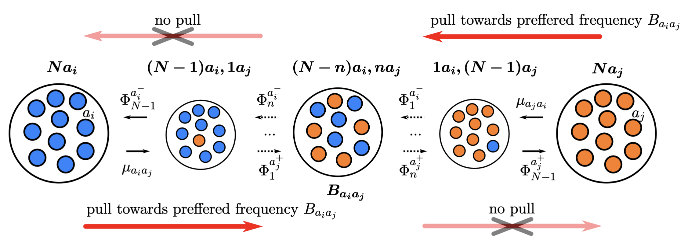
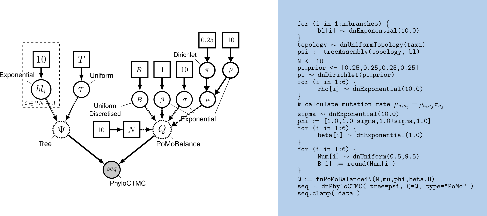
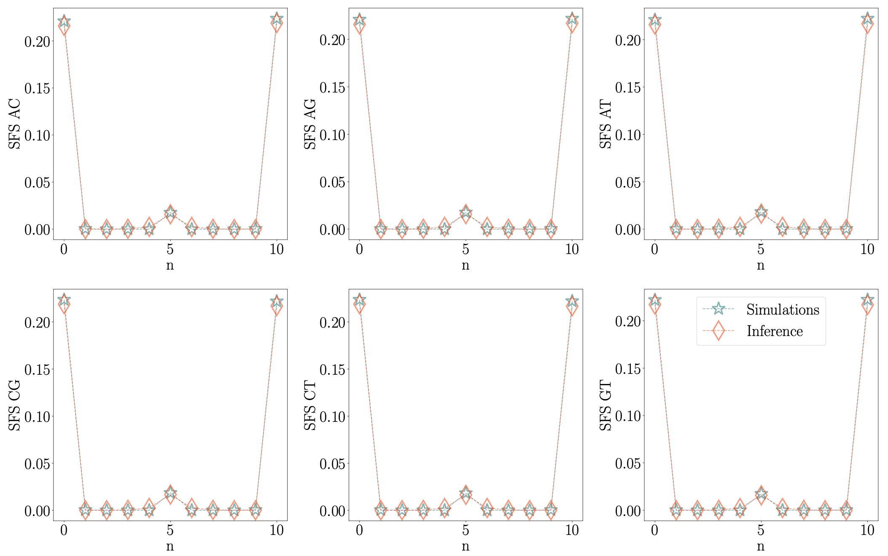
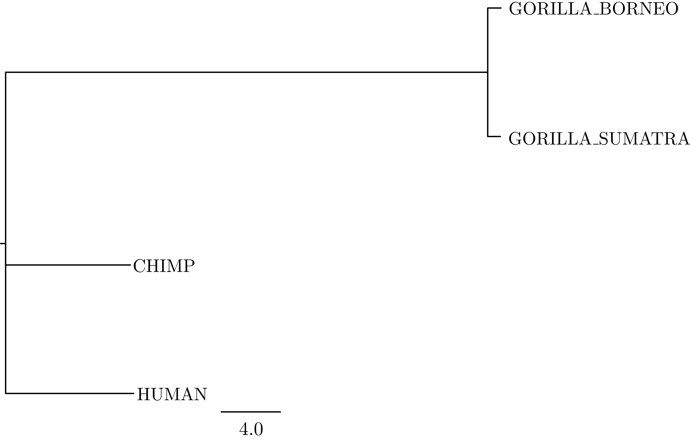

This tutorial is based on  [Polymorphism-aware phylogenetic models](/tutorials/pomos/) so we recommend you to go through it first.



<span style="color:red">**NB! Please note that the current version of the code has been tested in the development version of [RevBayes](https://github.com/revbayes/revbayes) built from the `dev_PoMo_bs_master` branch. PoMoBalance will be added to the main functionality in the next release.**</span>

The polymorphism-aware phylogenetic models with balancing selection (PoMoBalance) is a natural extension of [polymorphism-aware phylogenetic models](/tutorials/pomos/)  including all previous capabilities as well as detection of preferred allele frequencies and strength of balancing selection as shown in .




PoMoBalance model is depicted as a Markov-chain model with boundary mutations and allelic selection ($a_i$ and $a_j$ represents alleles A, C, G and T; $a_ia_j$ represents combinations of alles without repetition).  The boundary (monomorphic) states $Na_i$ and $Na_j$ are shown as larger circles with N individuals carrying allele $a_i$ (blue circles) on the left-hand side and $a_j$ (orange circles) on the right-hand side. All the middle (polymorphic) states $(N-n)a_i$, $na_j$ are shown with smaller circles, each one sequentially carrying one less individual with a prevailing allele. In addition to the selection term, transition rates reflect balancing selection pull towards the state with preferred allele frequency $B_{a_ia_j}$ (dark red arrows) and no such pull (light red crossed arrows) if the transition happens against the preferred state.



In  the transition rates from the monomorphic states are defined with mutation rates $\mu_{a_ia_j}$ and $\mu_{a_ja_i}$, while the transition rates from the polymorphic states are defined with 
$$\Phi_n^{a^{\mp}_{i,j}}= \frac{n(N-n)}{N}(1+\sigma_{a_{i,j}})\beta_{a_ia_j}^{\frac{1}{2} [ |n-B_{a_ia_j}|-|n\mp 1-B_{a_ia_j}| +1 ]}, \label{equation1}\tag{1}$$
where $1+\sigma_{a_{i,j}}$ represents fitness of corresponding alleles, $B_{a_ia_j}$ is a preferred frequency and $\beta_{a_ia_j}$ is a strength of balancing selection.

PoMoBalance in addition to standard [PoMos](/tutorials/pomos/) allows one to
* disentangle genetic drift, mutational biases, directional selection and balancing selection;
* detect preferred frequencies of polymorphisms corresponding to balancing selection;
* quantify the strength of balancing selection.

 There are few functions implemented in RevBayes shown in .



Specific functions for PoMoBalance are available in RevBayes. 


|**Function**|**Description**|**Parameters**|
|:---:|:---:|:---:|
| fnPoMoBalanceKN | Describes the evolution of a population with $K$ alleles and $N$ individuals subjected to mutational bias, selection and balancing selection | $K$, $N$, $\mu$, $\phi$, $\beta$, $B$ |
| fnReversiblePoMoBalanceKN | Particular case of PoMoBalanceKN when mutations are considered reversible and the preferred frequency is in the middle $B=\frac{N}{2}$. | $K$, $N$, $\pi$, $\rho$, $\phi$, $\beta$ |
| fnPoMoBalance4N | Particular case of  fnPoMoBalanceKN where $K=4$.| $N$, $\mu$, $\phi$, $\beta$, $B$ |
| fnReversiblePoMoBalance4N | Particular case of  fnReversiblePoMoBalanceKN where $K=4$. | $N$, $\pi$, $\rho$, $\phi$, $\beta$ |



The DAG model representation of PoMoBalance is shown in .




Graphical model representation of PoMoBalance. The model is non-reversible due to the presence of balancing selection rather than asymmetry in mutation rates, thus, we consider $\mu_{a_ia_j}=\rho_{a_ia_j}\pi_{a_j}$ still leaving room for the model to accept non-symmetric mutation rates. In contrast to [PoMos](/tutorials/pomos/), we set up the node for GC-bias rate $\sigma$ rather than for the fitness that is easily obtained from it through expression $\phi$=[1, 1+$\sigma$, 1+$\sigma$, 1]. There are also two additional nodes for balancing selection $\beta$ and $B$.






Similarly to [PoMos](/tutorials/pomos/), we are using count files in the same format. File `great_apes_BS_10000.cf` contains an example of heterozygote advantage simulation with the preferred frequency in the middle in $4$ great ape populations performed with the evolutionary simulation framework  [SLiM](https://messerlab.org/slim/) . We generated $10000$ sites, however, normally balancing selection happens in small regions containing only a few genes or around a thousand nucleotides. Thus, to improve the accuracy of the method we recommend increasing the virtual population size. In the current example, we use $N = 10$ and it can be further increased taking into account the interplay between the number of sites and the computational cost.  

First, we convert the allelic counts into PoMo states. Open the terminal and copy the data and script into the corresponding subfolders **data** and **scripts** of your working directory, for example, call it, **PoMoBalance**. Inside **PoMoBalance** create **output** folder to store the results. 

PoMo state-space includes fixed and polymorphic states. However, sampled fixed sites might not be necessarily fixed in the original population. We might just have been unlucky and only sampled individuals with the same allele from a locus that is polymorphic. It is typically the case that the real genetic diversity is undersampled in population genetic studies. The fewer the number of sampled individuals or the rarer are the alleles in the original population (i.e., singletons, doubletons), the more likely are we to observe fake fixed sites in the sequence alignment. The sampled-weighted method helps us to correct for such bias by attributing to each of the allelic counts an appropriate PoMo state (0-based coding). For a population size of 3 virtual individuals, we expect 16 states (coded 0-15), while for a population of 2 virtual individuals, we expected 10 states (coded 0-9).

The script ```weighted_sampled_method.cpp``` is implemented in **C++**, and we will run it using the **Rcpp** package in **R**.  Open the ```counts_to_pomo_states_converter.R``` file and make the appropriate changes to obtain your PoMo alignments suited for PoMoBalance. 

```r
name <- "great_apes_BS_10000"                       # name of the count file
count_file <- paste0("../data/", name, ".cf")       # path to the count file
n_alleles  <- 4                                     # the four nucleotide bases A, C, G and T
N          <- 10                                    # virtual population size

alignment <- counts_to_pomo_states_converter(count_file,n_alleles,N) # Create the alignment

writeLines(alignment,paste0("../data/", name, ".txt"))               # writeg the PoMo alignment
```

We place the produced alignments inside the **data** folder. The output files follow the ```NaturalNumbers``` character type of RevBayes and can easily read by it.

Open the ```great_apes_pomobalance.Rev``` file using an appropriate text editor so you can follow what each command is doing. Then run **RevBayes**:

```
./rb great_apes_pomobalance.Rev
```

Note, you  may use ```./rb``` or the parallel version ```./rb-mpi``` to speed up the calculations.

Further, let's do through the commands in the script in more detail. We define the virtual population size and load the counts file similarly to [PoMos](/tutorials/pomos/).

```
N <- 10
data <- readPoMoCountFile(countFile="data/great_apes_BS_10000.cf", virtualPopulationSize=N, format="PoMo")
```

Information about the alignment can be obtained by typing ```data```. 

```
>data
   PoMo character matrix with 4 taxa and 10000 characters
   ======================================================
   Origination:                   
   Number of taxa:                4
   Number of included taxa:       4
   Number of characters:          10000
   Number of included characters: 10000
   Datatype:                      PoMo
```
{:.Rev-output}

Next, we will specify the number of taxa, taxa names, and the number of branches. 

```
n_taxa     <- data.ntaxa()
n_branches <- 2*n_taxa-3
taxa       <- data.taxa()
```

Also variable to store moves and monitors for our analysis. You can add multiple kinds of moves into this variable and better explore the parameter space with MCMC, to avoid local minima and correlation between the moves. Monitors are for tracking MCMC analysis.

```
moves    = VectorMoves()  
monitors = VectorMonitors()
```



Two main components are required for unrooted tree estimation with balancing selection:
* the PoMo model, which in our case PoMoBalance;
* the tree topology and branch lengths.

Following [PoMos](/tutorials/pomos/), PoMoBalance is also defined with instantaneous-rate matrix, ```Q``` with population size ```N```, allele frequencies ```pi```, exchangeabilities ```rho``` (in the non-reversible case combined into mutations ```mu```), and allele fitnesses ```phi```. Frequencies must sum up to unity, thus, ```pi``` is initialised with Dirichlet distribution and the move is ```mvBetaSimplex```


```
# allele frequencies
pi_prior <- [0.25,0.25,0.25,0.25]
pi ~ dnDirichlet(pi_prior)
moves.append( mvBetaSimplex(pi, weight=2) )
```


The ```rho``` and ```phi``` parameters must be positive real numbers and a natural choice for their prior distributions is the exponential distribution and the standard moves ```mvScale```. Let's add an adaptive variance multivariate-normal proposal move that uses MCMC samples to fit covariance matrix to parameters called ```mvAVMVN``` to ```sigma``` to avoid correlation between GC-bias and balancing selection coefficients 
```
# exchangeabilities
for (i in 1:6){
  rho[i] ~ dnExponential(10.0)
  moves.append(mvScale( rho[i], weight=2 ))
}

mu := [pi[2]*rho[1], pi[1]*rho[1], pi[3]*rho[2], pi[1]*rho[2], pi[4]*rho[3], pi[1]*rho[3], pi[3]*rho[4], pi[2]*rho[4], pi[4]*rho[5], pi[2]*rho[5], pi[4]*rho[6], pi[3]*rho[6]]

# fitness coefficients
sigma ~ dnExponential(1.0)
moves.append(mvScale( sigma, weight=2 ))
moves.append(mvAVMVN(sigma) )

phi := [1.0,1.0+sigma,1.0+sigma,1.0]

```

The strength of balancing selection ```beta``` is also exponential and for the same reason as ```rho``` combines two kinds of moves. The preferred frequency ```B``` must be a discrete positive value between 0 and ```N```, thus, we set up variable ```Num``` with a uniform prior and two kinds of standard moves```mvSlide``` and ```mvScale``` with high weights to enhance exploration of parameter space. We round ```Num``` on each iteration to obtain discrete ```B```

```

# Strengths of the balancing selection

for (i in 1:6){

  beta[i] ~ dnExponential(1.0)

  moves.append( mvScale( beta[i], weight=30 ) )
  
  # Add this move to avoid a correlation between sigma and beta
  moves.append(mvAVMVN(beta[i]) )
  
}

# The preferred frequencies of balancing selection

for (i in 1:6){

  Num[i] ~ dnUniform(0.5,9.5)

  moves.append( mvSlide( Num[i], weight=10 ) )
  moves.append( mvScale( Num[i], weight=10 ) )

  B[i] := round(Num[i])

}

```

We will set up the virtual PoMoBalance using the function ```fnPoMoBalance4N```. You can check the input parameters of any PoMo function by typing its name right after the question mark: ```?fnPoMoBalance4N```.

```
# rate matrix
Q := fnPoMoBalance4N(N,pi,rho,phi,beta,B)
```

Note, we could also use function ```fnReversiblePoMoBalance4N``` since the preferred frequency in our example is in the middle. However, we use more general function ```fnPoMoBalance4N``` to test the estimation of preferred frequency ```B```. 

The estimation of tree moves is also identical to [PoMos](/tutorials/pomos/) including the nearest-neighbour interchange move ```mvNNI```.

```
# topology
topology ~ dnUniformTopology(taxa)
moves.append( mvNNI(topology, weight=2*n_taxa) )
```

Nest, we define  ```2*n_taxa−3```  with standard moves.

```
# branch lengths
for (i in 1:n_branches) {
   branch_lengths[i] ~ dnExponential(10.0)
   moves.append( mvScale(branch_lengths[i]) )
}
```

Finally, we combine the tree topology and branch lengths in ```treeAssembly``` in deterministic node ```psi```

```
psi := treeAssembly(topology, branch_lengths)
```

Let's combine ```Q``` and ```psi``` into a distribution called the phylogenetic continuous-time Markov chain ```dnPhyloCTMC``` 
```
sequences ~ dnPhyloCTMC(psi,Q=Q,type="PoMo")
```

and clamp it to data

```
sequences.clamp(data)
```

Finally, we create the ```model``` function using any node.

```
pomo_model = model(pi)
```



Let's set up monitors to track MCMC analysis
```
monitors.append( mnModel(filename="output/great_apes_pomobalance.log", printgen=10) )

monitors.append( mnFile(filename="output/great_apes_pomobalance.trees", printgen=10, psi) )

monitors.append( mnScreen(printgen=10) )
```
Run burn-in tuning the weights of the parameters

```
pbalance_mcmc.burnin(generations=2000,tuningInterval=200)
```

Finally, set up ```mcmc``` moves with four independent MCMC runs to ensure proper convergence and mixing.

```
pomo_mcmc = mcmc(pomo_model, monitors, moves, nruns=4, combine="mixed")
```

and run

```
pomo_mcmc.run( generations=10000 )
```

Use software [**Tracer**](https://github.com/beast-dev/tracer/releases/tag/v1.7.2) or the R package [**Convenient**](https://revbayes.github.io/tutorials/convergence/) to assess trajectories and convergence. Look at ```output/great_apes_pomobalance.log``` in **Tracer**. There you see the posterior distributions of the parameters and correlations between parameters.

Another way to assess the accuracy of parameter estimation is to look at the site frequency spectra (SFS) as shown in 




SFS of the data simulated with SLiM compared to the SFS inferred by RevBayes with PoMoBalance on the virtual population size $N=10$.



To obtain the tree we need to look at the tree trace file

```
trace = readTreeTrace("output/great_apes_pomobalance.trees", treetype="non-clock", burnin= 0.2)
```

The ```mapTree``` function will summarise the tree samples and write the maximum a posteriori (MAP) tree to the specified file. The MAP tree can be found in the **output** folder named `great_apes_pomobalance_MAP.tree` as in .

```
mapTree(trace, file="output/great_apes_pomobalance_MAP.tree" )
```




The unrooted tree of great ape species.



Please note that if PoMoBalance struggles to estimate balancing selection and species trees simultaneously, it is possible to estimate the tree with [PoMos](/tutorials/pomos/) first and then run PoMoBalance with the fixed tree or the tree topology.



1. With  as your guide, draw the probabilistic graphical model of the reversible PoMoBalance model.

2. Run an MCMC analysis to estimate the posterior distribution under the reversible PoMoBalance model. Which one estimates the strengths of balancing selection better?

3. Compare the MAP trees estimated under the reversible and nonreversible PoMoBalance model. Are they equal, and if not, how much do they differ?
