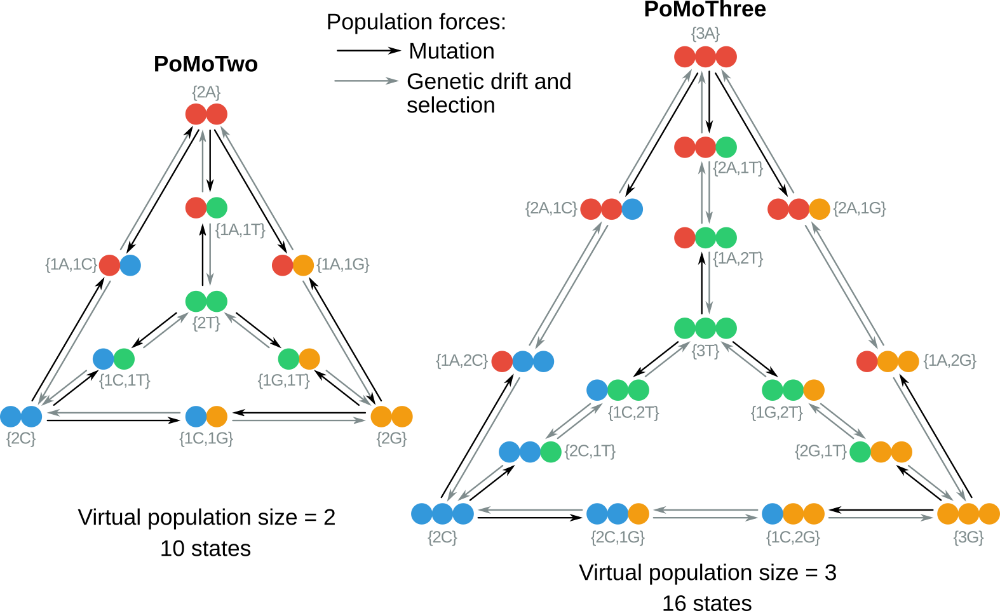
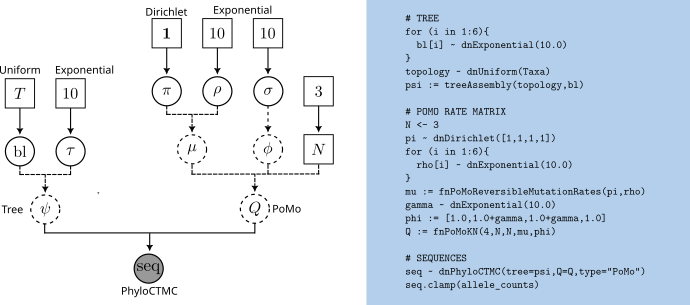
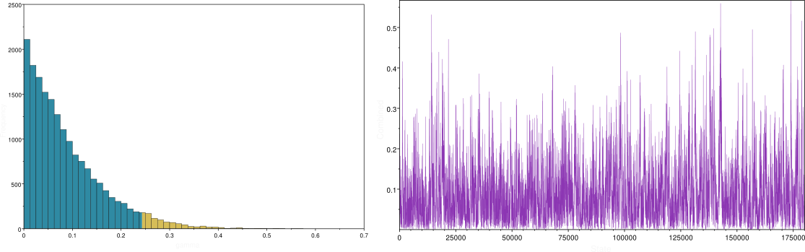

This tutorial comes with a recorded video walkthrough. The video corresponding to each section of the exercise is linked next to the section title. The full playlist is available here: [{: height="36" width="36"}](https://www.youtube.com/playlist?list=PLztACvN0g42ue0Y1cbcyTq3r6cMaTYpvg)



The polymorphism-aware phylogenetic models (PoMos) are alternative approaches to species tree estimation  that add a new layer of complexity to the standard substitution models by accounting for population-level forces to describe the process of sequence evolution . PoMos model the evolution of a population of individuals in which changes in allele content (e.g., due to mutations) and frequency (e.g., due to genetic drift or selection) are both possible ().





PoMoTwo and Three state-spaces. The tetrahedron represents the PoMos state-space for the four-allelic case (A, C, G and T). The fixed sites $$\{Na_i\}$$ are represented in the vertices of the tetrahedron, while the polymorphic states $$\{na_i,(N −n)a_j\}$$ are represented in its edges. The black and gray arrows distinguish mutations from frequency shifts (i.e., due to genetic drift and selection).



PoMos stand out from the standard phylogenetic substitution models and other species tree methods because they:
* permit to disentangle the contribution of evolutionary forces to the evolutionary process (e.g., genetic drift, mutational biases, and selection);
* consider polymorphisms, thus permitting inferences with data from multiple individuals and populations;
* naturally account for incomplete lineage sorting (i.e., the persistence of ancestral polymorphisms during speciation events), a known process of phylogenetic discord;
* directly estimate the species tree and is computationally efficient by circumventing the many constraints between the species tree and the genealogical histories.

Overall, PoMos constitute a full-likelihood yet computationally efficient approach to species tree inference. PoMos are designed to cope with recent radiations, including incomplete lineage sorting, and long divergence times.



PoMos model the evolution of a population of $N$ individuals and $K$ alleles in which changes in allele content and frequency occur. These are mediated by population forces such as mutation, genetic drift, and selection. The PoMo state-space includes fixed (or boundary) states $$\{Na_i\}$$, in which all $N$ individuals have the same allele $$i \in \{0,1,...,K-1\}$$, and polymorphic states $$\{na_i,(N-n)a_j\}$$, in which two alleles $a_i$ and $a_j$ are present in the population with absolute frequencies $n$ and $N-n$.

* Mutations occur with rate $\mu_{a_ia_j}$. Mutations govern the allele content and only occur in the fixed states:
$$q_{\{Na_i\} \rightarrow \{(N-1)a_i,1a_j\}}=\mu_{a_ia_j} \label{equation1}\tag{1}$$
Often, a reversible mutational model is considered. In this case, we break the mutations into a base composition $\pi$ and exchangeability parameter $\rho$ (i.e., $\mu_{a_ia_j}=\rho_{a_ia_j}\pi_{a_j}$) just like the GTR. However, in PoMos, these do not represent substitutions but mutations. Such an assumption can still model mutational biases quite well and simplifies obtaining formal quantities with PoMos. Another assumption of PoMos is that mutations can only occur in fixed states. This corresponds to the assumption that mutation rates are low, which is verified for the majority of multicellular eukaryotes.
* Genetic drift is modeled according to the Moran model, in which one individual is chosen to die and one individual is chosen to reproduce at each time step. Selection acts to (dis)favor alleles by differentiated fitnesses: $\phi_{a_i}$. Together, genetic drift and selection govern the allele frequency changes:
$$q_{\{na_i,(N-n)a_j\} \rightarrow \{(n+1)a_i,(N-n-1)a_j\}}=\frac{n(N-n)}{N}\phi_{a_i} \label{equation2}\tag{2}$$

Like the standard substitution models, PoMos are continuous-time Markov models and are fully characterized by their rate matrices. The rates in \ref{equation1} and \ref{equation2} define the PoMos rate matrices. RevBayes includes a plethora of PoMo rate matrices that permit modeling population dynamics with any number of alleles, reversible mutations (i.e., $\mu_{a_ia_j}=\rho_{a_ia_j}\pi_{a_j}$) and selection. These are described in .



Specific functions for PoMos are available in RevBayes. For an overview of the specificities and possible applications of these models, please consult . 


|**Function**|**Description**|**Parameters**|
|:---:|:---:|:---:|
| fnPoMoKN | Describes the evolution of a population with $K$ alleles and $N$ individuals subjected to mutational bias and selection | $K$, $N$, $\mu$, $\phi$  |
| fnReversiblePoMoKN | Particular case of PoMoKN when mutations are considered reversible. | $K$, $N$, $\pi$, $\rho$, $\phi$  |
| fnPoMo4N | Describes the evolution of a population with 4 alleles (typically the A, C, G, and T nucleotides) and $N$ individuals subjected to mutational bias and selection | $N$, $\mu$, $\phi$  |
| fnReversiblePoMo4N | Particular case of PoMo4N when mutations are considered reversible. | $N$, $\pi$, $\rho$, $\phi$  |
| fnPoMo2N | Describes the evolution of a population with 2 alleles and $N$ individuals subjected to mutational bias and selection | $N$, $\mu$, $\phi$  |
| fnReversiblePoMo2N | Particular case of PoMo2N when mutations are considered reversible. | $N$, $\pi$, $\rho$, $\phi$  |
| fnReversiblePoMoTwo4N | Describes the evolution of a virtual population with 4 alleles of 2 individuals (hence PoMoTwo) subjected to mutational bias | $N$, $\pi$, $\rho$  |
| fnReversiblePoMoThree4N | Describes the evolution of a virtual population with 4 alleles of 3 individuals (hence PoMoThree) subjected to mutational bias and selection | $N$, $\pi$, $\rho$, $\phi$  |



This tutorial demonstrates how to set up and perform analyses using polymorphism-aware phylogenetic models. You will perform phylogeny inference using the virtual PoMos Two and Three. These models allow for very efficient species tree inferences under neutrality (PoMoTwo) and selection (PoMoThree) because they operate on a smaller state space . You will perform a Markov chain Monte Carlo (MCMC) analysis to estimate phylogeny and other model parameters. The graphical model representation under PoMoThree is depicted in figure .




Graphical model representation of PoMos. The graphical model shows the dependencies among parameters . Here, the rate matrix $Q$ is a deterministic variable because it depends on the mutation rates and fitness coefficients. The same applies to the phylogenetic tree $\Psi$, which depends on the topology and branch lengths.






PoMos perform inferences based on allele frequency data. Count files are the files where we store such data. They contain two header lines. The first line indicates the number of taxa and the number of sites (or loci) in the sequence alignment. You might have noticed that NPOP stands for the number of populations, but this is not necessarily the case. PoMos can be employed to infer the evolutionary history of different species or even other systematic units that one might be interested in studying (e.g., subspecies, communities, etc.).

A second line states the genomic position of every locus (chromosome and location) and the taxon names. The first two columns are not used for inference, which means that if you are working with taxa for which such information is not available, you can input these columns with dummy values (e.g., NA or ?). All the other lines in the count file include allelic counts separated by commas. White spaces separate all the elements in the count file. Let us have a look at some lines of the great ape count file we will analyze in this tutorial:

```
COUNTSFILE NPOP 3 NSITES 5
CHROM POS       Gorilla_beringei_graueri Gorilla_gorilla_dielhi Gorilla_gorilla_gorilla
chr1  41275799  6,0,0,0                  2,0,0,0                54,0,0,0 
chr2  120104878 6,0,0,0                  2,0,0,0                54,0,0,0 
chr11 61364549  0,6,0,0                  0,2,0,0                0,54,0,0 
chr17 44837427  6,0,0,0                  2,0,0,0                54,0,0,0 
chr19 7495905   4,0,2,0                  2,0,0,0                10,0,44,0 
```

The four allelic counts in this count file represent the allelic counts of the A, C, G, and T, respectively. Thus, we know that the ```Gorilla_gorilla_gorilla``` has an AG polymorphism at position 7 495 905 of chromosome 19. The allele order in the allelic counts can be any. However, you have to keep in mind that the vector of mutation rates, exchangeabilities, base frequencies, and fitness coefficients all follow the order of the allele counts in the count file:
* the base frequencies and the fitness vectors are in the same order as in the counts: i.e., $$\{a_0,a_1,...,a_{K-1}\}$$;
* the vector mutation rates (this vector is used in the non-reversible models) are $$\{a_0a_1, a_1a_0, a_0a_2, a_2a_0,...\}$$;
* the vector of exchangeabilities follows a similar pattern as for the mutation rates, but without the reversed mutation: i.e., $$\{a_0a_1, a_0a_2, ...\}$$.




The first step in this tutorial is to convert the allelic counts into PoMo states. Open the terminal and place it in your working directory, let us call it **PoMos**, but you can use a name of your preference. Inside **PoMos** create the usual **data** and **output** folders. Before starting to actually load the data, run **RevBayes** by typing ```./rb``` (or ```./rb-mpi```) in the console. Open the ```great_apes_pomothree.Rev``` file using an appropriate text editor so you can follow what each command is doing. Once you know what this ```.Rev``` script is doing in detail, you can automatically run it as follows:

```
./rb great_apes_pomothree.Rev

```

We mentioned previously that the PoMo state space includes fixed and polymorphic states. However, allele counts are samples of (usually) a few individuals from the population. For example, sampled fixed sites might not necessarily be fixed in the original population. We might just have been unlucky and only sampled individuals with the same allele from a locus that is polymorphic. It is typically the case that real genetic diversity is undersampled in population genetic studies. The fewer the number of sampled individuals or the rarer the alleles in the original population (i.e., singletons or doubletons), the more likely we are to observe fake fixed sites in the sequence alignment. There are methods that help us correct for such bias by attributing to each of the allelic counts an appropriate PoMo state. One such method is the weighted-method , which weights each PoMo state based on binomial sampling. This is automatically done in RevBayes when we use  the function ```readPoMoCountFile```. We just need to define the location of the counts file, the virtual population size, which, as we will be using the virtual PoMo three for inferences, we set to ```3```, and the data type format, which is PoMo.

```
N <- 3
data <- readPoMoCountFile(countFile="data/great_apes_1000.cf", virtualPopulationSize=N, format="PoMo")
```

Information about the alignment can be obtained by typing ```data```. 

```
>data
   PoMo character matrix with 12 taxa and 1000 characters
   ======================================================
   Origination:                   
   Number of taxa:                12
   Number of included taxa:       12
   Number of characters:          1000
   Number of included characters: 1000
   Datatype:                      PoMo
```
{:.Rev-output}

If, instead of a count file, you have a list of sequences per individual (either in a fasta or nexus file), RevBayes can still convert it to PoMo data format. To do that, you will need to read the sequences, provide a file with the taxon names, and then perform the conversion to the PoMo state space with ```pomoStateConver```. To identify individual sequences as belonging to the same taxon, just use the same name. These are the commands you will need:

```
data_char = readDiscreteCharacterData("data/individual_sequences.nex")
taxa = readTaxonData("data/taxon_names.txt")
data = pomoStateConvert(aln=data_char, k=4, virtualNe=N, taxa)
```

Next, we will specify some useful variables. These include the number of taxa, taxa names, and the number of branches. We will need that information for setting up our model in subsequent steps.

```
n_taxa     <- data.ntaxa()
n_branches <- 2*n_taxa-3
taxa       <- data.taxa()
```

Additionally, we set up a variable that holds all the moves and monitors them for our analysis. Recall that moves are algorithms used to propose new parameter values during the MCMC simulation. Monitors print the values of model parameters to the screen and/or log files during the MCMC analysis.

```
moves    = VectorMoves()  
monitors = VectorMonitors()
```



Estimating an unrooted tree under the virtual PoMos requires specifying two main components:
* the PoMo model, which in our case is PoMoTwo or PoMoThree;
* the tree topology and branch lengths.

A given PoMo model is defined by its corresponding instantaneous-rate matrix, ```Q```. PoMoTwo and PoMoThree have three free parameters in common: the population size ```N```, the allele frequencies ```pi```, and the exchangeabilities ```rho```. PoMoThree additionally includes the allele fitnesses ```phi```, as it accounts for selection. We will set up the virtual PoMoTwo and Three using the function ```fnReversiblePoMo4N```. You can check the input parameters of any PoMo function by typing its name right after the question mark: ```?fnReversiblePoMo4N```.

As expected, this function has as input parameters the population size ```N```, base frequencies, exchangeabilities ```rho``` and fitnesses ```phi```. We will first set out the PoMoThree, which we can do by setting $N$ to 3. Similarly, if you wanted to set out the neutral PoMo (i.e., PoMoTwo), you could set ```N``` to 2 instead. Thus, ```N``` is a fixed node, as we had previously defined. 

Since ```pi```, ```rho```, and ```gamma``` are stochastic variables, we must specify a move to propose updates to them. A good move on variables drawn from a Dirichlet distribution (i.e., ```pi```) is the ```mvBetaSimplex```. This move randomly takes an element from the allele frequencies vector ```pi```, proposes a new value drawn from a beta distribution, and then rescales all values to sum to 1. The weight option inside the moves specifies how often the move will be applied, either on average per iteration or relative to all other moves.


```
# allele frequencies
pi_prior <- [1,1,1,1]
pi ~ dnDirichlet(pi_prior)
moves.append( mvBetaSimplex(pi, weight=2) )
```

The ```rho``` and ```phi``` parameters must be a positive real number and a natural choice for their prior distributions is the exponential distribution. Again, we need to specify a move for these stochastic variables, and a simple scaling move ```mvScale``` typically works. In this tutorial, we want our model to capture the effect of GC-bias gene conversion. For that, we define ```gamma```, which will represent the GC-bias rate. The allele fitnesses ```phi``` of G and C will thus be represented by ```gamma```, while those of A and T by 1.0. Note that ```phi``` is a deterministic node that depends on the GC-bias rate ```gamma```.
```
# exchangeabilities
for (i in 1:6){
  rho[i] ~ dnExponential(10.0)
  moves.append(mvScale( rho[i], weight=2 ))
}

# fitness coefficients
gamma ~ dnExponential(1.0)
moves.append(mvScale( gamma, weight=2 ))
phi := [1.0,1.0+gamma,1.0+gamma,1.0]
```

The function ```fnReversiblePoMo4N``` will create an instantaneous-rate matrix.

```
# rate matrix
Q := fnReversiblePoMo4N(N,pi,rho,phi)
```

An important note: We could similarly have used the functions ```fnReversiblePoMoTwo4N``` and ```fnReversiblePoMoThree4N```, to set the rate matrices. These are particularly useful when one has information about mutation or the GC-bias gene conversion rate (for some model organisms, this information might be available) and wants to include it via informative priors. In such a case, the population size is not a fixed node, and it can be jointly estimated. In this tutorial, we are assuming that no prior information is available for the mutation or GC-bias rates. Note that selection is not identifiable with two virtual individuals, so the vector of fitness coefficients cannot be inputted for the ```fnReversiblePoMoTwo4N```: it is by default equal to the unitary vector (i.e., the neutral scenario). To check the input parameters of PoMoTwo, you can type ```?fnReversiblePoMoTwo4N``` ; you will see that the fitness coefficient ```phi``` is missing. As a consequence, if we want to employ the PoMoTwo model with the general ```fnReversiblePoMoTwo4N```, we have to set the fitness coefficients to 1.0.

The tree topology and branch lengths are stochastic nodes in our phylogenetic model. We will assume that all possible labeled, unrooted tree topologies have equal probability. In the case of an unrooted tree topology, we use the nearest-neighbor interchange move ```mvNNI``` (a subtree-prune and regrafting move ```mvSPR``` could also be used).

```
# topology
topology ~ dnUniformTopology(taxa)
moves.append( mvNNI(topology, weight=2*n_taxa) )
```

Next, we have to create a stochastic node representing the length of each of the ```2*n_taxa−3``` branches in our tree. We can do this using a for loop. In this loop, we can create each of the branch-length nodes and assign each move.

```
# branch lengths
for (i in 1:n_branches) {
   branch_lengths[i] ~ dnExponential(10.0)
   moves.append( mvScale(branch_lengths[i]) )
}
```

Finally, we combine the tree topology and branch lengths. We do this using the ```treeAssembly``` function, which applies the value of the ith member of the ```branch_lengths``` vector to the branch leading to the ith node in the topology. Thus, the psi variable is a deterministic node:

```
psi := treeAssembly(topology, branch_lengths)
```

We have fully specified all of the parameters of our phylogenetic model:
* the tree with branch lengths of ```psi```;
* the PoMo instantaneous-rate matrix ```Q```;
* the type of character data: i.e., ```PoMo```.

Collectively, these parameters comprise a distribution called the phylogenetic continuous-time Markov chain, and we use the ```dnPhyloCTMC``` function to create this node. This distribution requires several input arguments:
```
sequences ~ dnPhyloCTMC(psi,Q=Q,type="PoMo")
```

Once the ```PhyloCTMC``` model has been created, we can attach our sequence data to the tip nodes in the tree. Although we assume that our sequence data are random variables, they are realizations of our phylogenetic model. For inference purposes, we assume that the sequence data are *clamped* to their observed values.

```
sequences.clamp(data)
```

When this function is called, **RevBayes** sets each of the stochastic nodes representing the tree's tips to the corresponding nucleotide sequence in the alignment. This essentially tells the program that we have observed sequence data at the tree tips.

Finally, we wrap the entire model in a single object. To do this, we only need to give the ```model``` function a single node.

```
pomo_model = model(pi)
```



For our MCMC analysis, we need to set up a vector of monitors to record the states of our Markov chain. First, we will initialize the model monitor using the ```mnModel``` function. This creates a new monitor variable that will output the states for all model parameters when passed into an MCMC function. We will sample every 10th generation, and the resulting file can be found in the **output** folder.

```
monitors.append( mnModel(filename="output/great_apes_pomothree.log", printgen=10) )
```

The ```mnFile``` monitor will record the states for only the parameters passed in as arguments. We use this monitor to specify the output for our sampled trees and branch lengths. Again, we sample every 10th generation.

```
monitors.append( mnFile(filename="output/great_apes_pomothree.trees", printgen=10, psi) )
```

Finally, create a screen monitor that will report the states of specified variables to the screen with ```mnScreen```. This monitor mostly helps us follow the progress of the MCMC run.

```
monitors.append( mnScreen(printgen=10) )
```

With a fully specified model, a set of monitors, and a set of moves, we can now set up the MCMC algorithm that will sample parameter values in proportion to their posterior probability. The ```mcmc``` function will create our MCMC object. Furthermore, we will perform two independent MCMC runs to ensure proper convergence and mixing.

```
pomo_mcmc = mcmc(pomo_model, monitors, moves, nruns=2, combine="mixed")
```

Now, we can start the MCMC.

```
pomo_mcmc.run( generations=10000 )
```

When the analysis is complete, you will have the monitored files in your output directory. Software like [**Tracer**](https://github.com/beast-dev/tracer/releases/tag/v1.7.2) or the R package [**Convenient**](https://revbayes.github.io/tutorials/convergence/) allow evaluating convergence and mixing. Look at the file called ```output/great_apes_pomothree.log``` in **Tracer**. There you see the posterior distribution of the continuous parameters. Let us look at the posterior distribution of the GC-bias rate $\gamma$. Is there any evidence of GC-bias in these great apes sequences?




**Left**: Trace of the GC-bias rate ($\gamma$) samples for one MCMC run. You will also see that the effective sample size is comparably large, i.e., much larger than 200. **Right**: Posterior distribution of the great apes GC-bias rate ($\gamma$) under a PoMoThree model.



Apart from the continuous parameters, we need to summarize the trees sampled from the posterior distribution. RevBayes can summarize the sampled trees by reading in the tree trace file:

```
trace = readTreeTrace("output/great_apes_pomothree.trees", treetype="non-clock", burnin= 0.2)
```

The ```mapTree``` function will summarize the tree samples and write the maximum a posteriori (MAP) tree to the specified file. The MAP tree can be found in the **output** folder.

```
mapTree(trace, file="output/great_apes_pomothree_MAP.tree" )
```




Maximum a posteriori estimate of the great ape phylogeny under the PoMoThree model. The numbers at the nodes show the posterior probabilities for the clades. We have rooted the tree at the Oran-Utans clade.



Look at the file called ```output/great_apes_pomothree_MAP.tree``` and open it in FigTree. The maximum a posteriori estimate of the great ape phylogeny under the PoMoThree model should look like that of .



1. What is the GC-bias rate (this is the selection coefficient) for the great ape populations? Rescale to its real value by assuming that the great apes have an effective population size of about 10 000 individuals. You should use the relation $(1+\gamma')^{M-1}=(1+\gamma)^{N-1}$ to rescale $\gamma$.  $M$ and $N$ are the virtual and effective population sizes, and $\gamma'$ and $\gamma$ are the GC-bias rates on the virtual and effective populations.

2. With  as your guide, draw the probabilistic graphical model of the PoMoTwo model.

3. What changes have to be made to the ```great_apes_pomothree.Rev``` to make inferences under the PoMoTwo model?

4. Run an MCMC analysis to estimate the posterior distribution under the PoMoTwo model. Are the resulting estimates of the mutation rates (base frequencies and exchangeabilities) equal? If not, how much do they differ?

5. Compare the MAP trees estimated under PoMoTwo and PoMoThree. Are they equal, and if not, how much do they differ?
