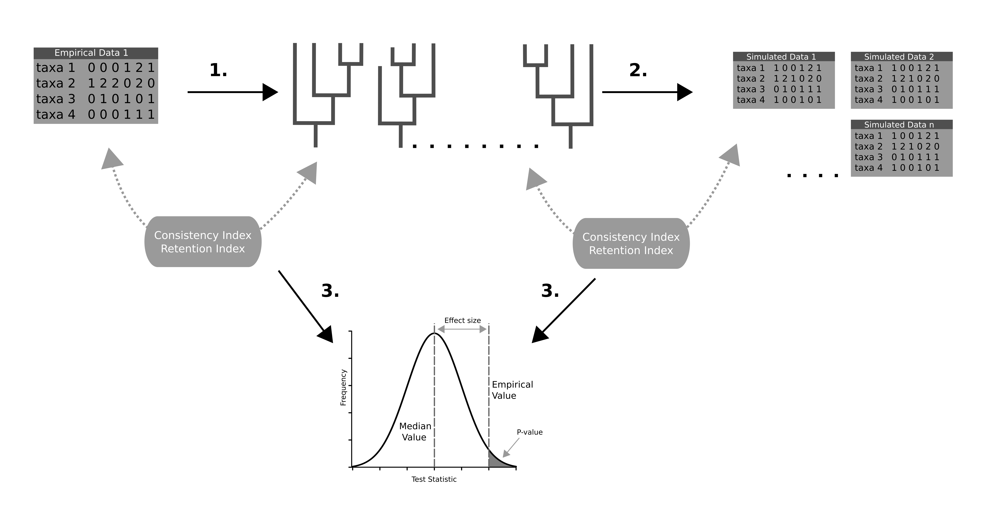


This tutorial presents a general approach for using posterior predictive
simulations (PPS) to determine the adequacy of morphological substitution models following 
. PPS
assess the reliability of an evolutionary model for a given data set through the use
of simulations and a number of test statistics. In this way, it is possible to determine
whether a model is adequately capturing the evolutionary dynamics of the data set or
not. 




Understanding morphological evolution is a difficult task. Within palaeobiology 
there are a small number of relatively  simple evolutionary models to describe 
this complex process. Assessing the fit of these models to individual data sets is 
therefore crucial in order to have confidence in the inference results. Posterior 
prediction is a Bayesian approach to assess the fit of a model to a given data set
. PPS works by simulating data sets
based on parameters sampled from the posterior distribution
() . If the simulated data is found to be similar to the
empirical data, according to the chosen test statistics, you can have
confidence that the model is capturing the properties of the empirical data 
and can be used for an analysis. In this way, PPS provides the absolute fit of an
evolutionary model to a given data set. 

In this tutorial, we will walk through how to use PPS to detemine the fit of a model
to a data set of Hyaenodontidae taken from 
We will test two models in this tutorial. Each test is completely seperate from
the other as we are determining the absolute fit of the model to the data set. 


 
 
A schematic presentation of posterior predictive simulation for morphological 
substitution models. Step 1 involves a carrying out an inference under the model of
interest. Step 2 a number of data sets are then simulated using parameters taken from
the posterior distribution estimated in step 1. Step 3 uses tests statistics to assess
how similar the simulated data sets are to the empirical. The test statistics employed
here are consistency index and retention index. *P-values* or effect sizes can be used
to determine whether a model is adequate or not for a given data set.





The models used here are described in more detail in the tutorial  . For a better understanding of the assumptions of these models, consult
the previous tutorial. We provide scripts for two subsitution models here:

-   Mk substitution model 

-   MkVP+G substitution model 




  | Model & Extensions| Assumptions |
  |------------|-----:|
  | Mk |  all transition rates are equal  |  
    |------------|-----:|
  | G|  allows for variation in substitution rates among sites  | 
    |------------|-----:|
  | V |  accounts for ascertainment bias  | 
    |------------|-----:|
  | P |  partitions the data based on the number of character states  | 

  
  The assumptions of the morphological models used in this tutorial.
  




Here we will highlight the main parts of the analysis. The morpholgoical data used here is of a family of extinct birds from the Miocene . The data set contains 12 taxa, 
51 characters with a maximum 4 character states. To quickly run the entire PPS pipeline you can run 
the **pps_analysis_Mk.Rev** script. To run this type the following command into `RevBayes`


```
source("scripts/pps_analysis_Mk.Rev")
```

The test statistics and *P-values* can then be calculated by running the `Test-stats.r` scripts in r studio. 



The initial step in PPS involves generating a posterior distribution from which we
will later sample parameter values from, in order to simulated new data sets. 
Here we will specify our dataset, evolutionary model, and run a normal MCMC analysis.
This code is in the **pps_analysis_Mk.Rev** script.


First, let’s set up some workspace variables we’ll need, and define which substitution
model we will use for the analysis, either Mk or MkVP+G.

```
analysis_name = "pps_morpho_example"
model_name = "Mk"
model_file_name = "scripts/" +model_name+"_Model.Rev"
```

Next specify and read in the data file. 

```
inFile = "data/Agnolin_2007a_paleobiodb.nex"
morpho <- readDiscreteCharacterData(inFile)
```

~~~
   Successfully read one character matrix from file data/Agnolin_2007a_paleobiodb.nex"
~~~
{:.Rev-output}

Specify the maximum number of states in the morphological alignment. For morphological data
sets this value will change depending on the data set. We need this to construct a 
Q-matrix of the correct size. 

```
num_states ="4"
```

Create vectors to store your moves and monitors for the analysis. 

```
moves    = VectorMoves()
monitors = VectorMonitors()
```

For the rest of the tutorial you can choose to either use the `source()` function to run the scripts **or** 
copy and paste the each line into revbayes as they are explained.



Here we will specify both the tree model and the substitution model. 
Typing the following command into `RevBayes` will run the model script.

```
source( model_file_name )
```
~~~
    Processing file "scripts/Mk_Model.Rev"
    Processing of file "scripts/Mk_Model.Rev" completed 
~~~
{:.Rev-output}
Opening the model file, we can see how we have set it up.

First we define some helper variables

```
taxa <- morpho.names()
num_taxa <- taxa.size()
num_branches <- 2 * num_taxa - 3
```

The next part of the file specifies the tree model.
We put a prior on the branch lengths using an exponential distribution with a rate 0.2.


```
br_len_lambda ~ dnExp(0.2)
moves.append(mvScale(br_len_lambda, weight=2))
```

We then set a uniform tree prior for the tree topology. This prior assumes that no tree is 
more likely *a priori* than any other. 

```
phylogeny ~ dnUniformTopologyBranchLength(taxa, branchLengthDistribution=dnExponential(br_len_lambda))
moves.append(mvNNI(phylogeny, weight=num_branches/2.0))
moves.append(mvSPR(phylogeny, weight=num_branches/10.0))
moves.append(mvBranchLengthScale(phylogeny, weight=num_branches))
tree_length := phylogeny.treeLength()
```

In this script we are specifying an Mk model, where *k* is the maximum number of
observed states. As the Mk model is a generalization of the JC model this is done using the 
`fnJC()` function. This creates a Q-matrix of size `num_states`. The resulting Q-matrix 
will have equal transition probabilities between all states.

```
Q := fnJC(int(num_states)) 
```
We then create a `PhyloCTMC` object. This joins all the model parameters we created to model
the morphological data. The is then clamped to the morphological evolution model.

```
seq ~ dnPhyloCTMC(tree=phylogeny, Q=Q, type="Standard")
seq.clamp(morpho)
```

Finally, we can create a workspace model variable using the `model()` function. We provide 
the model function a single node here using (`phylogeny`).

```
mymodel = model(phylogeny)
```



To run the analysis, we need to set up the MCMC. As with the previous scripts you can run this by typing the following command in `RevBayes`

```
source("scripts/pps_MCMC.Rev")
```
In this script, we are specifying the number of iterations, the monitors and the burn.
For this analysis we add a different file than the normal set up, the `.var` file. This file 
will be used in the next step to simulate the new data sets.

```
monitors.append( mnModel(filename="output_" + model_name + "/" + analysis_name + "_posterior.log",printgen=10, separator = TAB)) 
monitors.append( mnFile(filename="output_" + model_name + "/" + analysis_name + "_posterior.trees",printgen=10, separator = TAB, phylogeny) )
monitors.append( mnScreen(printgen=1000, tree_length) )
monitors.append( mnStochasticVariable(filename="output_" + model_name + "/" + analysis_name + "_posterior.var",printgen=10) )
```

Now that we have our model, moves, and monitors set up we can define our MCMC. This is done 
using the `mcmc()` function. `nruns` specifiies that there are two independent mcmc runs during the analysis.


```
mymcmc = mcmc(mymodel, monitors, moves, nruns=2, combine="mixed")
mymcmc.burnin(generations=200,tuningInterval=200)
```
~~~
Running burn-in phase of Monte Carlo sampler for 200 iterations.
   This simulation runs 2 independent replicates.
   The simulator uses 4 different moves in a random move schedule with 30.7 moves per iteration
   

Progress:
0---------------25---------------50---------------75--------------100
********************************************************************
~~~
{:.Rev-output}

To start the MCMC then run the following command

```
mymcmc.run(generations=10000,tuningInterval=200)
```

~~~
Running MCMC simulation
   This simulation runs 2 independent replicates.
   The simulator uses 4 different moves in a random move schedule with 30.7 moves per iteration
   

Iter        |      Posterior   |     Likelihood   |          Prior   |    tree_length   |    elapsed   |        ETA   |
-----------------------------------------------------------------------------------------------------------------------
0           |       -996.887   |        -1026.4   |        29.5141   |       5.267817   |   00:00:00   |   --:--:--   |
1000        |       -991.783   |       -1020.93   |        29.1461   |       5.635822   |   00:00:05   |   --:--:--   |
2000        |        -993.55   |       -1023.25   |        29.7004   |       5.081564   |   00:00:11   |   00:00:44   |
3000        |       -984.413   |       -1014.64   |        30.2221   |       4.559854   |   00:00:16   |   00:00:37   |
4000        |       -986.254   |       -1016.16   |        29.9079   |       4.874004   |   00:00:22   |   00:00:33   |
~~~
{:.Rev-output}


Once the analysis is finished you can generate a most credible clade summary tree using the `mccTree()` function.
```
trace = readTreeTrace("output_" + model_name + "/" + analysis_name + "_posterior.trees")
mccTree(trace, file="output_" + model_name + "/MCC.tre")
```



As output from the analysis, you should have folder named *output_Mk* in your current directory. This file contains the 
log files and trees from both runs and a combination of both. You should use programs like Tracer to check for 
convergence at this stage.

Before moving on to the next section it is important to clear the `RevBayes` environment of all the variables created 
during the previous step. This can be done using the following `clear()` function.

```
clear()
```




In this section we will simulate new data sets based on the parameters sampled in the `.var`file in part one of this 
tutorial. 

We first have to load the data and set up the model as we did in the previous step. As we went through this above you 
can simply copy and paste this into the terminal.

```
inFile = "data/Agnolin_2007a_paleobiodb.nex"
analysis_name = "pps_morpho_example"
morpho <- readDiscreteCharacterData(inFile)
model_name = "Mk"
num_states ="4"
source( model_file_name )
```

The script **pps_Simulation.Rev** contains the code to simulate new data.

First we read in the trace file created during the previous MCMC.

```
trace = readStochasticVariableTrace("output_" + model_name + "/" + analysis_name + "_posterior.var", delimiter=TAB)
```

Now we use the `posdteriorPredictiveSimulation()` function to set up the simulations. We provide the function with the
 model, output directory, and the trace file.

```
pps = posteriorPredictiveSimulation(mymodel, directory="output_" + model_name + "/" + analysis_name + "_post_sims", trace)
```

To start the simulation we use the `pps.run()` function. Here we can specify how many data sets we want to simulate by 
setting the thinning. The `.var` file contains a number of phylogenetic trees. If thinning is set to the default (0) the 
pps.run() function will simulate data for each tree. Setting thinning to 2 will simulate along every second tree and so 
on. In this way setting thinning = 2 simulates data for half of the trees in the .var file. Simulating 500 data 
sets has been found to be sufficient for these types of analysis. If you increase the number of iterations in the MCMC 
you may want to increase the thinning value here. Here we set thinning to 4.

```
pps.run(thinning=4)
```

Once you run this command a file should be created in the *output_Mk* directory called *pps_morpho_example_post_sims*.
This is where all of the data simulated in revbayes will be stored. This simulation step should only take a few minutes.



To determine if a model is adequate or not we need to compare the empirical data with the newly simulated data sets. If 
the simulated data sets are not significantly different from the empirical, we can conclude that the model is adequate 
for the data set. Here we use two test statistics, **Consistency Index** and **Retention Index**.
Consistency Index is a measure of homoplasy in the data and retention index measures the degree to which potential 
synapomorphy is exhibited on the tree. These test statistics are calculated in `R` using the **Test-stats.r** script. 

This script calculates posterior *P-values* and effect sizes to determine the adequacy of the model. Here we calculate 4
p-values, lower 1-tailed, Upper 1-tailed, 2-tailed, and the mid-point p-value. Values of less than 0.025 or greater the 
0.975 indicate significance. The effect sizes can also be used to determine the adequacy of a model, though the p-values 
are considered more conservative. For the effect sizes, if the maximum and minimum value range through zero a model can 
be considered adequate. 




 
 
Histrograms show the distribution of values calculated for each test statistic from the simulated data sets. The green 
line shows the empirical value while the blue shows the median simulated value. The box plots show the effect sizes 
calculated for the test statistics. The median value should be closer to zero, models are considered adequate if the 
min and max values are range through zero. 



The Mk model would not be considered adequate for this data set. While it does well according to the retention index, 
the consistency index determined the simulated data to be significantly different to the empirical.



- Now that you know the Mk model is not appropriate for the data set try the MkVP+G model. This model is more complex than the Mk as it relaxes some of the assumption. Is this model adequate for the data set? Use the following command to rerun the 
entire analysis using the other model.

```
source("scripts/pps_analysis_MkVP+G")
```

- Try testing the models with the other data set in this tutorial. This morpholgoical data used here is of Proviverrine hyaenodontids (an extinct family of  hypercarnivorous mammals) from . The data set contains 15 taxa, 65 characters with a maximum of 5 character states. Are is the same model adequate for this data? Remember to change the file names and the number of states to match the new dataset!
