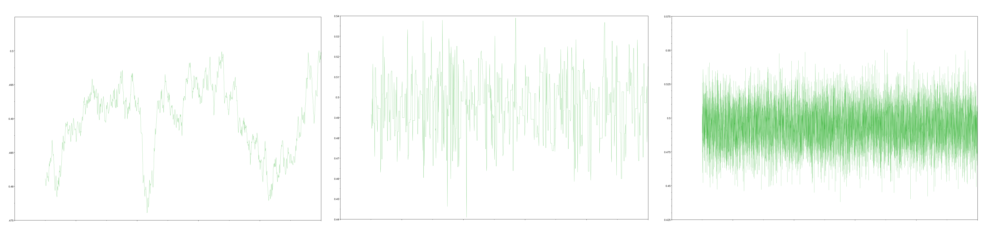
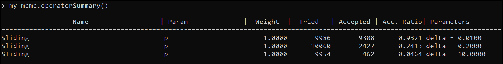
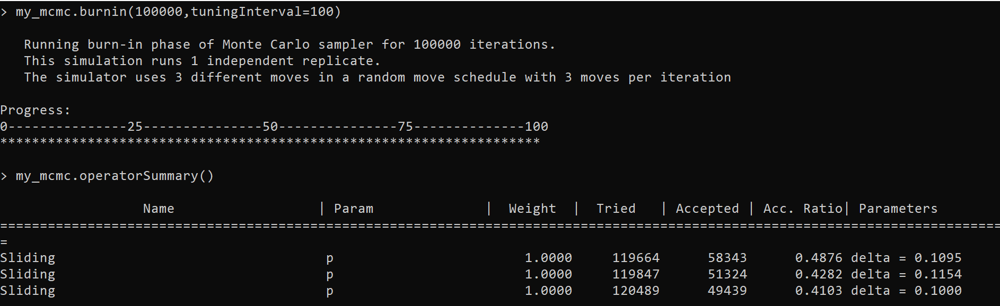



Mention introductory tutorials: X,Y, and Z. Links to tutorials, resources, google help group, etc.
How to navigate the website for specific things: documentation, a tutorial on X, bug reporting.



Given infinite time, any MCMC proposal scheme will converge on the posterior distribution. However, since time is finite, we need to carefully consider the moves we chose on parameters to efficiently approximate the sampling distribution. In this section we will discuss how to identify inefficient moves and poor mixing as well as the components of a move scheme that can be modulated to increase MCMC effectiveness. 



In this section we will discuss the things you will want to consider when choosing moves for your MCMC and how we can optimize those moves to efficiently sample the posterior.

 

For most types of parameters there are a plethora moves implemented in RevBayes. When choosing moves it is important to consider the size and scale of the move relative to the parameter space that they operate upon. For example, let us consider the binomial coin-flipping scenario posed in  tutorial where we are trying to estimate the probability of a coin landing on heads, $p$. In this case we know that the parameter $p$ is bounded between 0 and 1 so we would want to consider moves that efficiently move around this space. The move `mvScale` is a valid option for our parameter $p$ but it won't move around the space very effectively as this move multiplies the current value by some scalar which can often propose values on a different order of magnitude. Alternatively, we could chose `mvSlide` to propose new values within some window from the current value; this move is more better for proposing values between 0 and 1. Since moves often act in drastically different ways and on various scales, it can be useful to use multiple different types of moves on the same parameter to search space efficiently.



Although we have chosen an appropriate type of move we still need to consider the size of the move itself. In the case of `mvSlide` the function for the move has the parameter `delta` which is used to specify the size of the window around the current value $p$. In other words, the move proposes a new value $p'$ by choosing a value at random on the interval $(p-\delta,p+\delta)$. Large values of `delta` will result in proposals that often fall outside of the interval $(0,1)$ while too small of a `delta` will cause the MCMC to explore the parameter space slowly and inefficiently. Most moves on continous variables have parameters that control the relative size of the move, in the case of `mvSlide`, the `lambda` parameter controls the size of the sclar. 

We can qualitatively assess the adequacy of size parameters of moves by using `TRACER` to view the trace. In  we can see an example of a well-mixing MCMC, the catapillar-like appearance is a qualitative sign that the parameter is efficiently moving around the parameter space. If the move is too large the trace will look blocky, almost like a city skyline. Large moves often cause proposals to be rejected which is why we see the trace having the same value for many generations. Conversely, if we set too small of a move then we will accept most moves and the trace will appear to slowly meander about parameter values. 




Mixing of the `mvSlide` move on  sampling the probability of flipping heads $p$. The left image depicts the trace when moves are too small. The image in the center depicts moves that are too big. The image on the left depicts moves that are just right.



We can directly see how often proposals on specific moves are accepted or rejected by using the `operatorSummary()` method on an `mcmc` object (see ). 




Output of the `operatorSummary` method of an `mcmc` object after performing an analysis. On the leftmost column we can see each move and the node that it operates on. We can also see the weight of each move, how often it was proposed, and how often it was accepted. On the far right we can see the tuning argument for each move if it has one, in the case of `mvSlide` this is `delta`



We can see that almost every proposal was accepted for the move with the smallest window size while the largest move rejected most proposals. In general we want a move that isn't too small such that it moves slowly but isn't so large that it rejects most proposals, this is known as the Goldilock's Principle.  found an optimal acceptance ratio of 0.234 for a multivariate target distributions with i.i.d. components. Being able to break the posterior into i.i.d. components is unrealistic for phylogenetic analyses, numerical studies have shown acceptance rates to be robust to this assumption and rates between 0.1 and 0.6 are still reasonably efficient .


here is some more filler text.

Here is some filler text. 




Luckily, for moves with an adjustable size, we don't need trial and error adjusting of that size argument to achieve a certain acceptance rate. We can tune our moves to achieve a certain acceptance ratio. When creating a move that has an adjustable size, we can set the `tune` arguemnt to `TRUE`, this will adjust the size of the move so the acceptance rate approaches the value given in `tuneTarget`. Before running our mcmc analysis, we can tune our parameters by using the `tuningInterval` argument in  either the `burnin` or `run` methods on an `mcmc` object (see ). This means that every `tuninginterval` MCMC generations, it will try to adjust the size of the move to reach the desired tuning interval.




Output of `operatorSummary` after tuning the moves for 100,000 generations. The moves in this image started with the same size values as .  We can notice that the value `delta` has is different from when it started and the acceptance rate for each move approaches 0.44 which is the default tuning target

{% endfigure %



After we've chosen the moves we want, we need to specify how often those moves get called and how they are scheduled. First, for any function that creates a move, there is an argument called `weight`. Although the specific details vary between which move scheduler is used, the weights correspond to how often the move gets used. 

Given finite resources, we may want to upweight or downweight certain nodes to focus our resources. Analyses may contain nuisance parameters, or parameters we aren't particularly interested in estimating; we could downweight these to spend more time ensuring our parameters of interest are well sampled. Additionally, we may want to upweight parameters that are compplex or difficult to sample, this is often down for moves regarding the tree topology. We know that the number tree topologies grow for a given number of taxa, specifically for $n$ taxa there are $(2n-3)!!$ different rooted topologies (**NOTE:** we are using the [double factorial function](https://en.wikipedia.org/wiki/Phylogenetic_tree), not the factorial function used twice). Since the space of tree topologies grows dramatically with the number of taxa, we may want to upweight moves on the tree topology accordingly. In practice we usually set the weight for topology moves to be the number of tips on the tree, though even this is a conservative scaling for the weight relative to the size of tree topology space

We can set up a move schedule that determines the order of moves with the `moveschedule` argument of the `mcmc` function. There are 3 different options for `moveschedule`:

- **sequential**: Each MCMC cycle moves get performed in the order that they are entered into the move vector. We perform each move a number of times that corresponds to the weight of that move. For example, if we specify a weight of 4.35 on a move then that move will be performed 4 times garuanteed and then there is 0.35 probability of the move being performed a 5th time. After that, the scheduler moves on to the next move in the moves vector 
- **single**: This scheduler only considers one move each MCMC cycle. A move gets picked at random based on the weights. Moves with higher weights relative to the other moves in the move vector will be picked more often.
- **random**: This scheduler is similar to the single move scheduler except that multiple moves get picked at random each cycle. The number of moves each cycle is the sum of the wieghts for all the moves in the move vector. 











