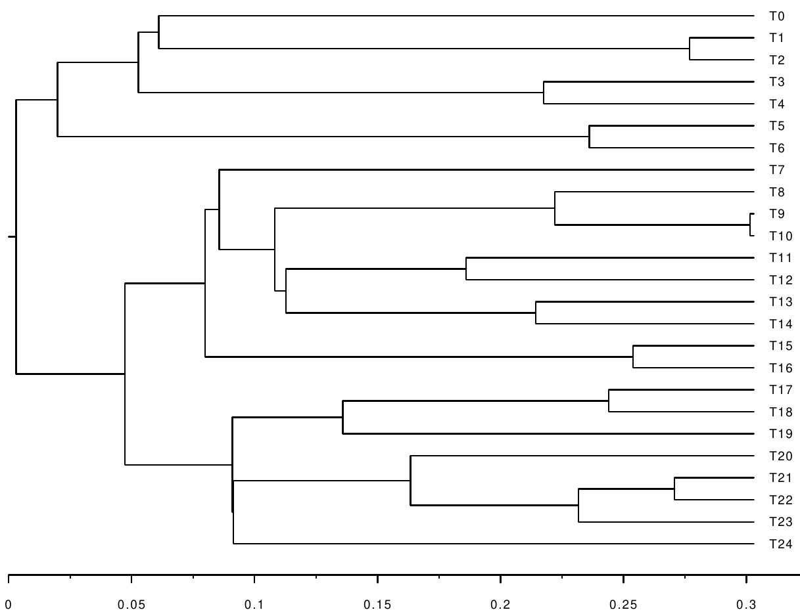
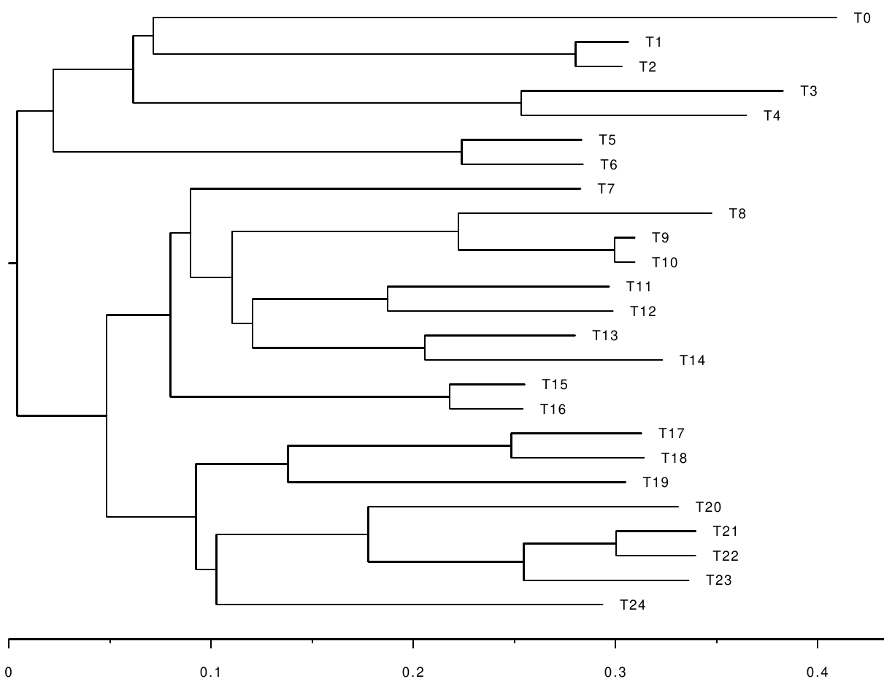
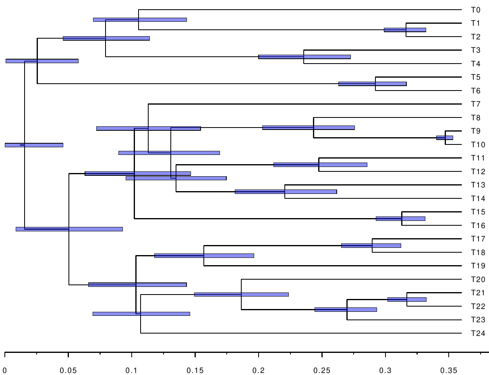
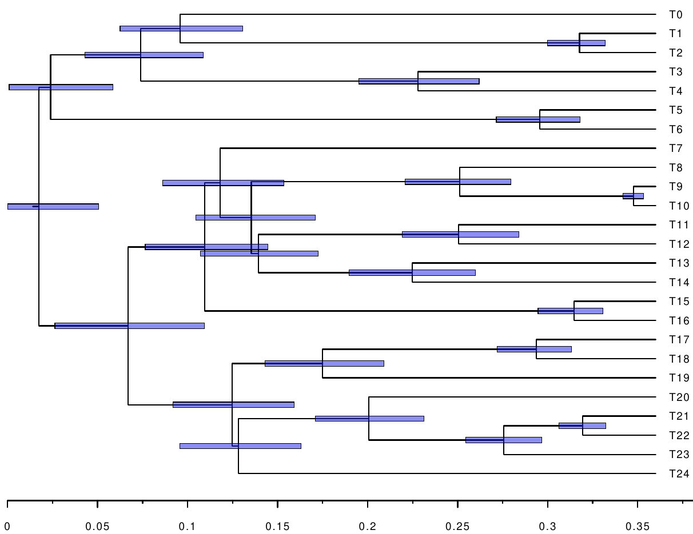

TODO Bastien
--
{:.section}

Check citation (I believe the order of authors has changed).

Check RevBayes version. Merge changes into master, and don't use development branch?

Are you satisfied with the structure?

Let me know, if you think that something is not clear!

Introduction
--
{:.section}

In phylogenetics, the term __dating__ denotes the inference of node ages of
phylogenies. For example, dating a species tree involves inference of the times
when the species split. Dating phylogenies is central to understanding the
evolution of life on Earth. However, evolutionary sequences evolve with
different rates, an observation that has been termed __relaxed molecular
clock__. In general, it is difficult to map a phylogeny obtained from a multiple
sequence alignment, and with branch lengths measured in average number of
substitutions per site, to a phylogeny with branch lengths measured in actual
units of time. For this reason, the molecular clocks are calibrated with
information gained from __fossils__, which can be accurately dated.
Incorporating fossil information enables __calibration__ of node ages of a
phylogeny.

In this tutorial, we explore another possibility to improve on the accuracy of
dating a phylogeny. Namely, horizontal gene transfers and ancient evolutionary
relationships such as symbioses are informative about the order of nodes of a
phylogeny of interest. That is, __horizontal gene transfers__ define __relative
node constraints__. Relative node constraints can be particularly helpful when
the geological record is sparse, for example, for microorganisms, which
represent the vast majority of extant and extinct biodiversity. Combination of
node calibrations with relative node constraints can significantly improve both
accuracy and resolution of molecular clock estimates .

Definitions
-------------
{:.section}

__Alignment__: Multiple sequence alignment.

__timetree__: Phylogeny with branch lengths measured in units of time. If
the leaves have been sampled at the same time, for example, at the present, a
time-tree is ultrametric.

__Branch-length tree__: Phylogeny with branch lengths measured in expected numbers of
substitutions. Usually, branch-length trees are obtained from a phylogenetic
analysis of an alignment.

__Calibration__: Absolute node calibration; an estimate of the age of a node of a timetree. This is usually associated with a prior describing the uncertainty associated to this node age.

__Constraint__: Relative node order constraint, which specifies the relative order in time of two nodes of a tree (e.g. node A is older than node B).

Getting Started
------------------
{:.section}

This tutorial was tested against the development branch,
available at [commit 06c1cac](https://github.com/revbayes/revbayes/commit/06c1cac4b9e62185cd8db45f638f152e30045ab8).
Similar to other RevBayes tutorials, we suggest using the following
directory structure:
```
.
├── data
├── scripts
└── output
```

The following data files are available:
```
data/
├── alignment.fasta    -- Alignment file simulated with the Jukes-Cantor (JC) model.
├── constraints.txt    -- File containing constraints.
├── substitution.tree  -- Tree with branch length in expected number of substitutions used to simulate the alignment.
└── time.tree          -- Original timetree to be recovered.
```

The following RevBayes script files are available:
```
scripts/
├── 1_mcmc_jc.rev                   -- Infer branch-length trees using the JC model.
├── 2_summarize_branch_lengths.rev  -- Extract posterior means and variances of branch lengths.
└── 3_mcmc_dating.rev               -- Date with calibrations and constraints.
```

Simulated data will be used, so that the inferred timetrees can be tested
for accuracy against the correct timetree stored in the file
`time.tree`. Inference will be done twice: (1) using calibrations only, and (2)
using calibrations and constraints. We will not perform inference of the topology of the tree, only of the age of its nodes. We will therefore work with the correct, fixed tree
topology obtained from the file `substitution.tree`. On empirical data, one could use the
maximum-likelihood (ML) or the maximum a posteriori (MAP) topology obtained from a phylogenetic reconstruction based on the alignment as in e.g. tutorial [Phylogenetic inference of nucleotide data using RevBayes](../ctmc/).


Statement of the problem
--
{:.section}

We are interested in inferring the following timetree using calibrations
and constraints:


  


*Timetree with 25 leaves (T0 to T24) to be inferred. The tree
was simulated using a birth process (Yule process) with a birth rate of 1.0 per
unit of time. The tree was conditioned on having height 0.3, and 25 leaves.*




However, the only information we get is an alignment simulated along the
following branch-length tree:


  


*Branch-length tree obtained from the timetree by multiplying the branch
lengths with randomly chosen rates. The rates are sampled from
two log-normal distributions introducing frequent minor, and sparse major rate
modifications, respectively. The alignment used for inference was simulated
along this tree using the JC model.*




For reasons of computational efficiency, the inference of the timetree is
done in three steps. First, the posterior distributions of the branch lengths of
the branch-length tree are inferred using the JC model (`1_mcmc_jc.rev`).
Second, the inferred posterior distributions of the branch lengths are
summarized into the posterior means and variances of the branch lengths
(`2_summarize_branch_lengths.rev`). Third, calibrations and constraints are used
to improve the accuracy of dating the phylogeny (`3_mcmc_dating.rev`). The
posterior means and variances of the branch lengths obtained in the second step
are used to approximate the phylogenetic likelihood using normal distributions.

Step 1: Inference of the posterior distributions of the branch lengths
--
{:.section}


Please execute the following command to perform Bayesian inference of the
posterior distributions of branch-length trees using a Jukes-Cantor substitution
model on a single alignment with a fixed tree topology. The Markov chain Monte
Carlo (MCMC) algorithm runs for 30000 iterations. It uses the alignment
`data/alignment.fasta`, and the branch-length tree `data/substitution.tree`.
The output is a file `output/alignment.fasta.trees` containing the 30000 branch-length trees
from the MCMC chain.

```bash
 rb ./scripts/1_mcmc_jc.rev
```

For more detailed explanations of the script file, please consult the
[continuous time Markov chain tutorial](../ctmc/).

Step 2: Summarizing the branch length distributions by their means and variances
--
{:.section}

In this step, we compute the means and variances of the posterior distributions of branch lengths
using the 30000 trees obtained in the previous step. Please have a look at the
script file `scripts/2_summarize_branch_lengths.rev`.

First, we specify the name of the file containing the trees, and the amount of
thinning we apply:

```
# File including trees obtained in step 1.
tree_file="alignment.fasta.trees"
# Only use every nth tree to calculate the posterior means and variances.
thinning = 5
```

Then, the trees are loaded and thinned:

```
tre = readBranchLengthTrees(outdir+file_trees_only)

print("Number of trees before thinning: ")
print(tre.size())

# Perform thinning.
index = 1
for (i in 1:tre.size()) {
  if (i % thinning == 0) {
    trees[index] = tre[i]
    index = index + 1
  }
}
```

The posterior means and squared means (which will be used to calculate
variances) are then computed:

```
print("Compute the posterior means and squared means of the branch lengths.")
num_branches = trees[1].nnodes()-1
bl_means <- rep(0.0,num_branches)
bl_squaredmeans <- rep(0.0,num_branches)

# Extract the posterior branch lengths. The index `i` is traversing the trees,
# the index `j` is traversing the branches.
for (i in 1:(trees.size())) {
  for (j in 1:num_branches ) {
    bl_means[j] <- bl_means[j] + trees[i].branchLength(j)
    bl_squaredmeans[j] <- bl_squaredmeans[j] + trees[i].branchLength(j)^2
    }
}

# Compute the posterior means and squared means.
for (j in 1:num_branches ) {
  bl_means[j] <- bl_means[j] / (trees.size())
  bl_squaredmeans[j] <- bl_squaredmeans[j] / (trees.size())
}
```

Finally, the posterior means and variances are stored in two trees having the
same topology as the one used for inference. In this way we ensure that the
posterior means and variances for the specific branches are tracked in a correct
way.

The posterior variances are calculated using the standard formula $$Var(X) =
E(X^2) - E(X)^2.$$

```
################################################################################
# Save the posterior means in a separate tree.

print("Compute the tree with posterior means as branch lengths.")
meanTree = readBranchLengthTrees(outdir+file_trees_only)[1]

print("Original mean tree before changing branch lengths")
print(meanTree)

for (j in 1:num_branches ) {
  meanTree.setBranchLength(j, bl_means[j])
}

print("Tree with posterior means as branch lengths.")
print(meanTree)

writeNexus(outdir+tree_file+"_meanBL.nex", meanTree)
print("The tree with posterior mean branch lengths has been saved.")

################################################################################
# Save the posterior variances in a separate tree.

print ("Compute tree with posterior variances as branch lengths.")
varTree = readBranchLengthTrees(outdir+file_trees_only)[1]

print("Original variance tree before changing branch lengths")
print(varTree)

# Here, the posterior variances are calculated using the well known formula
# Var(x) =E[X^2] - E[X]^2.
for (j in 1:num_branches ) {
  varTree.setBranchLength(j, abs ( bl_squaredmeans[j] - bl_means[j]^2) )
}

print("Tree with posterior variances as branch lengths.")
print(varTree)

writeNexus(outdir+tree_file+"_varBL.nex", varTree)
print("The tree with posterior variance branch lengths has been saved.")
```

To run the script, please execute
```bash
 rb ./scripts/2_summarize_branch_lengths.rev
```

The approximation of the phylogenetic likelihood using posterior means and
variances is optional but recommended for reasons of computational efficiency.
It is not necessary to use this approximation when dealing with relative time
constraints, but the benefit here is clear: the first script computes
branch-length tree distributions by repeatedly running the pruning algorithm,
which is costly.
Once this has been done, several different dating models can be run efficiently
without having to go through the pruning algorithm anymore.
In our case, we have 2 models: the model with relative constraints, and the one
without.


Step 3: Dating using calibrations and constraints
--
{:.section}

Finally, we date the phylogeny using a relaxed clock model. Please have a look
at the script `3_mcmc_dating.rev`. Important parts will be explained in the
following.

After defining file names and options with respect to the MCMC sampler, the root
age is calibrated using an interval around the true root age:

```
root_age <- tree.rootAge()
root_age_delta <- root_age / 5
root_age_min <- root_age - root_age_delta
root_age_max <- root_age + root_age_delta
root_time_real ~ dnUniform(root_age_min, root_age_max)
root_time_real.setValue(tree.rootAge())
root_time := abs( root_time_real )
```

The correct root age is obtained from the variable `tree` which was initialized
to store the correct timetree. By doing this, we are benefiting from the fact
that we know the true timetree.
When analyzing an empirical data set for which the timetree is not known, one
needs to find other ways to come up
with a reasonable prior distribution for the root age. We set a
uniform prior on the age of the root.

If specified, we also load the constraints from the given file `contraints.txt`:
```
if (constrain) {
  out_bn = out_bn + "_cons"
  constraints <- readRelativeNodeAgeConstraints(file=constraints_file)
}
```

The file `constraints.txt` stores the constraints obtained from 3 hypothetical
gene transfer events.
```
-- Contents of file `data/constraints.txt`
T0	T1	T14	T15
T7	T8	T19	T20
T3	T4	T8	T9
```

The first line `T0\tT1\tT14\tT15` tells RevBayes that the most recent common
ancestor (MRCA) of `T0` and `T1` has to be older than the MRCA of `T14` and
`T15`, and so on for the following lines. You can look for the respective nodes
on the timetree given above, and check that the constraints are actually valid.
In fact, the constraints may be helpful in that they resolve the order of
nodes having similar ages.

Next, we use a birth process with an unknown birth rate as a prior for the
timetree `psi`, and define some proposals for the MCMC sampler. The
proposals change the root age, scale the branches of `psi`, and slide the nodes.

```
################################################################################
# Tree model.

birth_rate ~ dnExp(1)
moves.append(mvScale(birth_rate, lambda=1.0, tune=true, weight=3.0))

if (!constrain) psi ~ dnBDP(lambda=birth_rate, mu=0.0, rho=1.0, rootAge=root_time, samplingStrategy="uniform", condition="survival", taxa=taxa)
if (constrain) psi ~  dnConstrainedNodeOrder(dnBDP(lambda=birth_rate, mu=0.0, rho=1.0, rootAge=root_time, samplingStrategy="uniform", condition="survival", taxa=taxa), constraints)

psi.setValue(tree)
if (debug == true) {
  print("The original time tree:")
  print(tree)
  print("The tree used in the Markov chain:")
  print(psi)
}

moves.append(mvScale(root_time_real, weight=1.0, lambda=0.1))
moves.append(mvSubtreeScale(psi, weight=1.0*n_branches))
moves.append(mvNodeTimeSlideUniform(psi, weight=1.0*n_branches))
moves.append(mvLayeredScaleProposal(tree=psi, lambda=0.1, tune=true, weight=1.0*n_branches))
```

Now, two calibrations are added. The MRCAs of `T1` and `T2`, as well as `T14`
and `T15` are fixed to be within intervals centered around their true ages
(initially, `psi` stores the true tree). The distribution
`dnSoftBoundUniformNormal` is uniform between the specified boundaries and
decreases normally out of the boundaries with the given standard deviation
(`sd`).

```
################################################################################
# Node calibrations provide information about the ages of the MRCA.

# The MRCAs of the following clades are calibrated.
clade_0 = clade("T1","T2")
clade_1 = clade("T14","T15")

# Clade 0.
tmrca_clade_0 := tmrca(psi, clade_0)
age_clade_0_mean <- tmrca(psi, clade_0)
age_clade_0_delta <- age_clade_0_mean / 5
age_clade_0_prior ~ dnSoftBoundUniformNormal(min=age_clade_0_mean-age_clade_0_delta, max=age_clade_0_mean+age_clade_0_delta, sd=2.5, p=0.95)
age_clade_0_prior.clamp(age_clade_0_mean)

# Clade 1.
tmrca_clade_1 := tmrca(psi, clade_1)
age_clade_1_mean <- tmrca(psi, clade_1)
age_clade_1_delta <- age_clade_1_mean / 5
age_clade_1_prior ~ dnSoftBoundUniformNormal(min=age_clade_1_mean-age_clade_1_delta, max=age_clade_1_mean+age_clade_1_delta, sd=2.5, p=0.95)
age_clade_1_prior.clamp(age_clade_1_mean)
```

Finally, we read in the posterior means and variances of the branch lengths
prepared in the previous steps.

```
mean_tree <- readTrees(mean_tree_file)[1]
var_tree <- readTrees(var_tree_file)[1]
```

We re-root the timetrees and ensure that they are bifurcating. These steps are
necessary to get the correct mapping between branches, and their posterior means
and variances. Internally, it is ensured that the indices are shared correctly.

```
# Reroot and make bifurcating.
rootId <- tree.getRootIndex()
outgroup <- tree.getDescendantTaxa(rootId)
mean_tree.reroot(clade=clade(outgroup), make_bifurcating=TRUE)
var_tree.reroot(clade=clade(outgroup), make_bifurcating=TRUE)

# Renumber nodes.
mean_tree.renumberNodes(tree)
var_tree.renumberNodes(tree)
```

Further, this step harbors a complication. During the first step, the reversible
JC model was used to estimate the posterior means and variances of the branch
lengths. Hence, the estimated branch-length tree is unrooted. Now, we estimate a
rooted time tree. It follows that the two branches leading to the root of the
timetree correspond to a single branch of the unrooted tree from the first step.
We have to take this into account when approximating the phylogenetic likelihood.

```
# Get indices of left child and right child of root.
i_left <- tree.child(tree.nnodes(),1)
i_right <- tree.child(tree.nnodes(),2)

# Get posterior means and variances of all branches except the branches leading
# to the root.
for(i in 1:n_branches) {
  if(i != i_left && i != i_right) {
    posterior_mean_bl[i] <- mean_tree.branchLength(i)
    posterior_var_bl[i] := var_tree.branchLength(i)
    if (posterior_var_bl[i]<var_min) posterior_var_bl[i]:=var_min
  }
}

# Get the index of the root in the time tree.
if (i_left<i_right)  i_root <- i_left
if (i_left>=i_right) i_root <- i_right

# Get the mean and variance of the branch containing the root.
posterior_mean_bl_root <- mean_tree.branchLength(i_root)
posterior_var_bl_root <- var_tree.branchLength(i_root)
if (posterior_var_bl_root<var_min) posterior_var_bl_root:=var_min
```

Please also note that we set a minimum variance. In some extreme cases, the
posterior distribution of a branch length may be so condensed, that the variance is
too low to be used for calculating the approximate phylogenetic likelihood.

In the next step, we define the relaxed molecular clock model. Several of them
are available in RevBayes. Here, we decided to use an uncorrelated model. We
separate between a global rate (`global_rate_mean`) and the relative branch-wise
rates (`rel_branch_rates`). We use an uncorrelated gamma model
(UGAM). In the UGAM model, the relative branch rates are distributed according
to a gamma distribution. We use a hyper parameter `sigma` on the shape and scale
parameters of the gamma distribution:

```
mean_tree_root_age := mean_tree.rootAge()
global_rate_mean ~ dnExp(1)
global_rate_mean.setValue(mean_tree_root_age/tree.rootAge());
sigma ~ dnExp(10.0)

first_gamma_param := 1/sigma
second_gamma_param := 1/sigma

moves.append(mvScaleBactrian(global_rate_mean, lambda=0.5, weight=10.0))
moves.append(mvScaleBactrian(sigma, lambda=0.5, weight=10.0))

# Use a Gamma distribution on rates.
for (i in n_branches:1) {
  times[i]=psi.branchLength(i)
  rel_branch_rates[i] ~ dnGamma(first_gamma_param, second_gamma_param)
  # Exclude the branches leading to the root (see above).
  if(i != i_left && i != i_right) {
    rel_branch_rates[i].setValue(posterior_mean_bl[i]/times[i]/global_rate_mean)
  } else {
    # And set them to half of the branch length in the unrooted tree.
    rel_branch_rates[i].setValue(posterior_mean_bl_root/2/times[i]/global_rate_mean)
  }
  moves.append(mvScale(rel_branch_rates[i], lambda=0.5, weight=1.0,tune=true))
}

for (i in n_branches:1) {
  branch_rates[i] := global_rate_mean * rel_branch_rates[i]
}
```

Finally, we calculate the approximate phylogenetic likelihood. In detail, for
each branch, the length measured in substitutions is the product of the length
measured in time, and the evolutionary rate at that branch:

```
mean_bl[i] := times[i]*branch_rates[i]
```

The branch lengths are then distributed according to normal distributions with
the posterior means and variances obtained in the previous steps:

```
bls[i] ~ dnNormal(mean_bl[i] ,sqrt(posterior_var_bl[i]))
```

Again, the two branches leading to the root are handled in a special way. In
total, the approximate phylogenetic likelihood is calculated like so:

```
times[i_left] := psi.branchLength(i_left)
times[i_right] := psi.branchLength(i_right)

for(i in 1:n_branches) {
  if(i != i_left && i != i_right) {
    times[i] := psi.branchLength(i)
    mean_bl[i] := times[i]*branch_rates[i]
    bls[i] ~ dnNormal(mean_bl[i] ,sqrt(posterior_var_bl[i]))
    bls[i].clamp(posterior_mean_bl[i])
  }
}

# See above.
mean_bl_root := times[i_left]*branch_rates[i_left] + times[i_right]*branch_rates[i_right]
bls[i_root] ~ dnNormal(mean_bl_root, sqrt(posterior_var_bl_root))
bls[i_root].clamp(posterior_mean_bl_root)
```


The last part of the script defines the monitors, executes the MCMC chain, and
saves the results. To perform the dating analysis, please execute twice (once
with `constrain = true`, and once with `constrain = false`):

```
rb ./scripts/3_mcmc_dating.rev
```

The MAP trees for the analysis with calibrations only, and with calibrations and
constraints are stored in the files `output/alignment.fasta.approx.dating.tree`,
and `output/alignment.fasta.approx.dating_cons.tree`, respectively.

Analysis of results
--
{:.section}

The following figures show the inferred timetrees.


  
 *Inferred timetree using calibrations only.* 



  
 *Inferred timetree using calibrations and constraints.* 


We see that the constraints help improve the accuracy, as well as reduce the
confidence intervals of the node ages. The branch score distances between the
original timetree, and the inferred timetrees are:

```
Calibrations only:
Branch score distance is 0.1592917560202034
Calibrations and constraints:
Branch score distance is 0.14207812275294182
```

That is, using constraints helped improve the branch score distance by 11
percent.

Concluding remarks
--
{:.section}

When analyzing real data a more appropriate substitution model should be used.
Also, when the tree topology is unknown, it has to be inferred. This has to be done
beforehand. Finally, calibrations and constraints have to be obtained manually
either based on the literature or based on original research.

The simulations were done using a custom simulator called `ELynx`. If you are
interested, please have a look at the [source code of
ELynx](https://github.com/dschrempf/elynx) and the [simulation scripts for this
tutorial](https://github.com/revbayes/revbayes.github.io/tree/source/tutorials/relative_time_constraints/internal/simulate).
