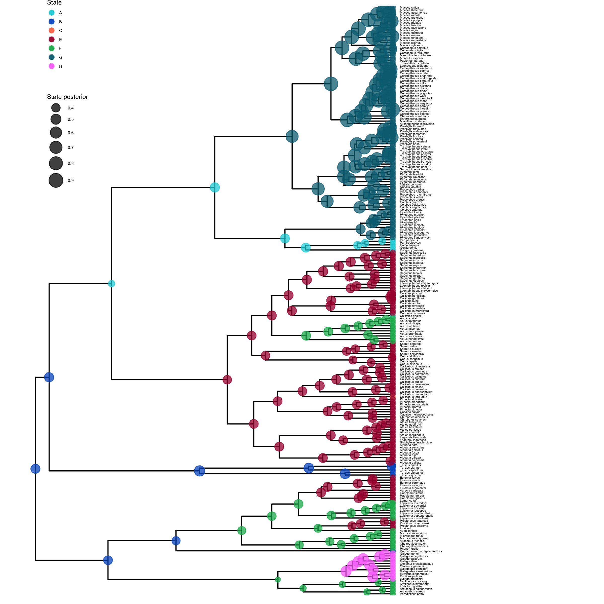
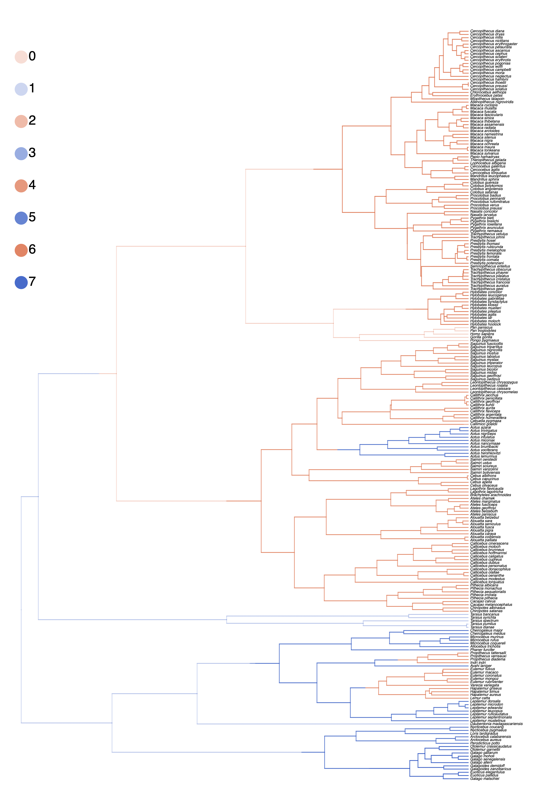
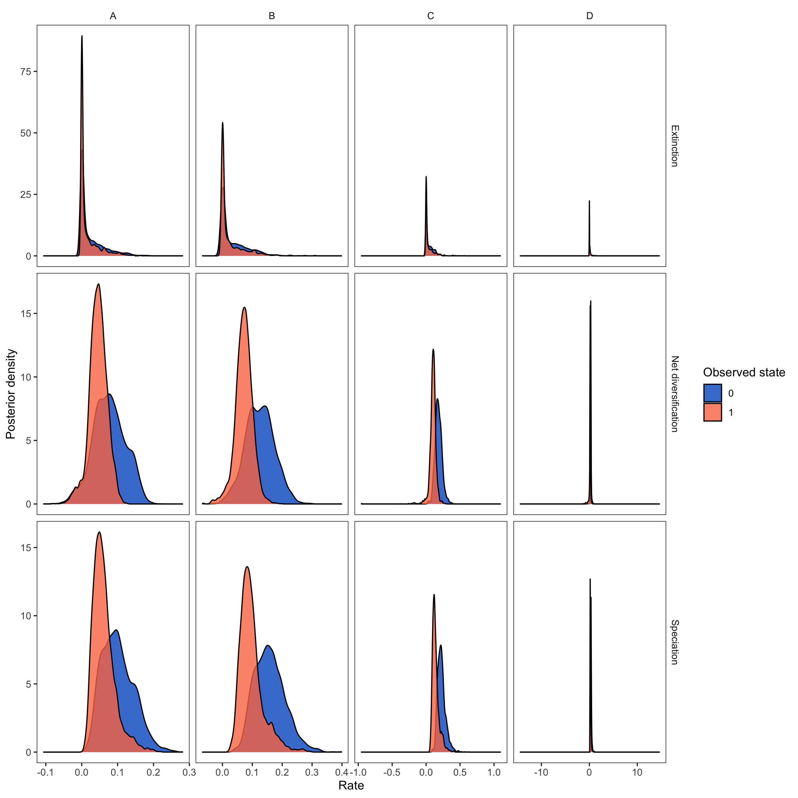



BiSSE and MuSSE are powerful approaches for testing the association of a character with diversification
rate heterogeneity. However, BiSSE has been shown to be prone to falsely identifying a positive association
when diversification rate shifts are correlated with a character not included in the model
.

The HiSSE (Hidden State-Dependent Speciation and Extinction) model reduces the possibility of falsely
associating a character with diversification rate heterogeneity .
It does this by incorporating a second, _unobserved_ character.
The changes in the unobserved character’s state represent background diversification rate changes
that are not correlated with the observed character.
See  for a schematic overview of the HiSSE model, and Table 2 for an explanation of the HiSSE model parameters.

We will keep this tutorial brief and assume that you have worked through the .





A schematic overview of the HiSSE model. Each lineage has an observed binary state associated to it:
state 0 (blue) or state 1 (red). Furthermore, there is a second, unobserved (hidden), binary character with states A
or B. The HiSSE model describes jointly the evolution of both of these two characters; a lineage must be in one of
four different states: 0A, 0B, 1A, or 1B. We estimate separate speciation and extinction rates for each of these four
states. Note that just like BiSSE can easily be extended to MuSSE, RevBayes allows you to extend HiSSE models
beyond binary observed and unobserved characters.





First, we create some global variables to set-up our analysis.
Using this variable we can easily change our script to use a different character with a different number
of states. We will also use this variable in our second example on hidden-state speciation and extinction
model.

```
NUM_TOTAL_SPECIES     = 367
NUM_STATES            = 2
NUM_HIDDEN            = 4
NUM_RATES             = NUM_STATES * NUM_HIDDEN
H                     = 0.587405
DATASET               = "activity_period"
```



Begin by reading in the observed tree and the character data.
We have both stored in separate nexus files.
```
observed_phylogeny <- readTrees("data/primates_tree.nex")[1]
data <- readCharacterData("data/primates_activity_period.nex")
```
It will be convenient to get some helper variables with information from the tree:
```
taxa <- observed_phylogeny.taxa()
tree_length <- observed_phylogeny.treeLength()
```
For the HiSSE model, we need to expand our characters to the new state space.
This means, that originally we had the states `0` and `1`.
Now, we want to have the states `0A`, `0B`, `0C`, `0D` and `1A`, `1B`, `1C`, `1D`.
A character that was originally in state `0` will now be ambiguous for all states `0A`, `0B`, `0C` and `0D`.
Instead of coding this up manually, RevBayes provides a simple function for you.
```
data_exp <- data.expandCharacters( NUM_HIDDEN )
```
Finally, we initialize a variable for our vector of moves and monitors.
```
moves    = VectorMoves()
monitors = VectorMonitors()
```




#### **Priors on the Rates**

We start by specifying prior distributions on the diversification rates.
Here, we will assume an identical prior distribution on each of the
speciation and extinction rates. Furthermore, we will use a log-uniform
distribution as the prior distribution on each speciation and
extinction rate (i.e., a uniform distribution on the log of the rates).

$$
\lambda_{ij} = \lambda_{\text{observed},i} * \lambda_{\text{hidden},j}
$$
For example, we have $\lambda_{0A} = \lambda_{\text{observed},0} * \lambda_{\text{hidden},A}$

Let's code this up in RevBayes.
First, we create the vector of hidden speciation rates.
Following the idea of discretizing a continuous distribution of diversification rates
(see ), we will specify `NUM_HIDDEN` speciation rates
as the quantiles of a lognormal distribution.
We need the average rate of the hidden speciation rates to be fixed, because otherwise the model is not identifiable.
Therefore, we fix the median of the lognormal distribution to 1.0:
```
ln_speciation_hidden_mean <- ln(1.0)
```
Next, we draw the standard deviation of the hidden speciation rates from an exponential distribution with mean `H`
(so that we expect the 95% interval of the hidden speciation rate to span 1 order of magnitude).
```
speciation_hidden_sd ~ dnExponential( 1.0 / H )
moves.append( mvScale(speciation_hidden_sd, lambda=1, tune=true, weight=2.0) )
```
With the mean and the standard deviation we can specify the distribution on the hidden speciation rates.
We create a deterministic variable for the hidden speciation rate categories using
a discretized lognormal distribution (the N-quantiles of it).
```
speciation_hidden_unormalized := fnDiscretizeDistribution( dnLognormal(ln_speciation_hidden_mean, speciation_hidden_sd), NUM_HIDDEN )
```
However, we normalize the hidden speciation rates by dividing the rates with the main
(so the mean of the normalized rates equals to 1.0):
```
speciation_hidden := speciation_hidden_unormalized / mean(speciation_hidden_unormalized)
```

Next, we repeat this same procedure for the hidden extinction rates.
```
ln_extinction_hidden_mean <- ln(1.0)

extinction_hidden_sd ~ dnExponential( 1.0 / H )
moves.append( mvScale(extinction_hidden_sd, lambda=1, tune=true, weight=2.0) )

extinction_hidden_unormalized := fnDiscretizeDistribution( dnLognormal(ln_extinction_hidden_mean, extinction_hidden_sd), NUM_HIDDEN )
extinction_hidden := extinction_hidden_unormalized / mean(extinction_hidden_unormalized)
```

For the observed speciation and extinction rates, we will apply a different approach.
We will draw the speciation and extinction rates for the observed characters from identical distribution,
so that *a priori* we expect with probability 0.5 that $\lambda_{\text{observed},0} > \lambda_{\text{observed},1}$,
and with probability 0.5 we expect $\lambda_{\text{observed},1} > \lambda_{\text{observed},0}$.
For the lack of prior knowledge, we specify a log-uniform prior distribution on the speciation and extinction rates
for the observed characters.
Note that we also initialize the starting states to make the analysis run more efficiently.
```
for (i in 1:NUM_STATES) {

    ### Create a loguniform distributed variable for the speciation rate
    speciation_observed[i] ~ dnLoguniform( 1E-6, 1E2)
    speciation_observed[i].setValue( (NUM_TOTAL_SPECIES-2) / tree_length )
    moves.append( mvScale(speciation_observed[i],lambda=1.0,tune=true,weight=3.0) )

    ### Create a loguniform distributed variable for the speciation rate
    extinction_observed[i] ~ dnLoguniform( 1E-6, 1E2)
    extinction_observed[i].setValue( speciation_observed[i] / 10.0 )
    moves.append( mvScale(extinction_observed[i],lambda=1.0,tune=true,weight=3.0) )

}
```
We have now specified the diversification rate variables for the observed and hidden states.
That means, we can now put these two put together.
```
for (j in 1:NUM_HIDDEN) {
    for (i in 1:NUM_STATES) {
        index = i+(j*NUM_STATES)-NUM_STATES
        speciation[index] := speciation_observed[i] * speciation_hidden[j]
        extinction[index] := extinction_observed[i] * extinction_hidden[j]
    }
}
```

Now we can specify our character-specific speciation and extinction rate
parameters. Because we will use the same prior for each rate, it's easy
to specify them all in a `for`-loop. We will use a log-uniform distribution as a prior
on the speciation and extinction rates. The loop also allows us to apply moves to each
of the rates we are estimating and create a vector of deterministic nodes
representing the rate of diversification ($\lambda - \mu$) associated with each
character state.

The stochastic nodes representing the vector of speciation rates and vector of
extinction rates have been instantiated. The software assumes that the rate in position `[1]` of each
vector corresponds to the rate associated with diurnal `0` lineages and the rate
at position `[2]` of each vector is the rate associated with nocturnal `1` lineages.


Next we specify the transition rates between the states `0` and `1`:
$q_{01}$ and $q_{10}$. As a prior, we choose that each transition rate
is drawn from an exponential distribution with a mean of 10 character
state transitions over the entire tree. This is reasonable because we
use this kind of model for traits that transition not-infrequently, and
it leaves a fair bit of uncertainty.
We will actually use a `for`-loop to instantiate the transition rates
so that our script also works for non-binary characters.
```
rate_pr := observed_phylogeny.treeLength() / 10
for ( i in 1:(NUM_STATES*(NUM_STATES-1)) ) {
    transition_rates[i] ~ dnExp(rate_pr)
    moves.append( mvScale(transition_rates[i],lambda=0.50,tune=true,weight=3.0) )
}
```
Note that the loop fills the non-diagonal entries of the rate matrix
by row: if, for example, `NUM_STATES` was equal to 3 rather than 2, then:

- `transition_rates[1]` would correspond to $q_{01}$;
- `transition_rates[2]` would correspond to $q_{02}$;
- `transition_rates[3]` would correspond to $q_{10}$;
- `transition_rates[4]` would correspond to $q_{12}$;
- `transition_rates[5]` would correspond to $q_{20}$;
- `transition_rates[6]` would correspond to $q_{21}$.

Similarly to the rate of change between the observed states, we also add a rate of change between the unobserved states, the hidden rate.
Thus, we will also assume the same exponential prior distribution.
```
hidden_rate ~ dnExponential(rate_pr)
moves.append( mvScale(hidden_rate,lambda=0.5,tune=true,weight=5) )
```
Furthermore, since there is no additional information, we assume that the rate of change between all hidden rates is identical.
```
for (i in 1:(NUM_HIDDEN * (NUM_HIDDEN - 1))) {
    R[i] := hidden_rate
}
```
Finally, we can build our rate matrix.
We do this using the specific `fnHiddenStateRateMatrix` function.
```
rate_matrix := fnHiddenStateRateMatrix(transition_rates, R, rescaled=false)
```

Note that we do not "rescale" the rate matrix. Rate matrices for
molecular evolution are rescaled to have an average rate of 1.0, but for
this model we want estimates of the transition rates with the same time
scale as the diversification rates.

#### **Prior on the Root State**

Create a variable for the root state frequencies. We are using a flat [Dirichlet distribution](https://en.wikipedia.org/wiki/Dirichlet_distribution) as the prior on
each state. There has been some discussion about this in .
You could also fix the prior probabilities for the root states to be equal
(generally not recommended), or use empirical state frequencies.
```
rate_category_prior ~ dnDirichlet( rep(1,NUM_RATES) )
```
Note that we use the `rep()` function which generates a vector of length `NUM_STATES`
with each position in the vector set to `1`. Using this function and the `NUM_STATES`
variable allows us to easily use this Rev script as a template for a different analysis
using a character with more than two states.

We will use a special move for objects that are drawn from a Dirichlet distribution:
```
moves.append( mvBetaSimplex(rate_category_prior,tune=true,weight=2) )
moves.append( mvDirichletSimplex(rate_category_prior,tune=true,weight=2) )
```

#### **The Probability of Sampling an Extant Species**

All birth-death processes are conditioned on the probability a taxon is sampled in the present.
We can get an approximation for this parameter by calculating the _proportion_ of sampled
species in our analysis.

We know that we have sampled 233 out of 367 living described primate species. To
account for this we can set the sampling probability as a constant node
with a value of 233/367.
```
rho <- observed_phylogeny.ntips()/367
```

#### **Root Age**

The birth-death process also depends on time to the most-recent-common ancestor--*i.e.*,
the root. In this
exercise we use a fixed tree and thus we know the age of the tree.
```
root <- observed_phylogeny.rootAge()
```

#### **The Time Tree**

Now we have all of the parameters we need to specify the full character
state-dependent birth-death model. We initialize the stochastic node
representing the time tree and we create this node using the `dnCDBDP()` function.
```
timetree ~ dnCDBDP( rootAge           = root,
                    speciationRates   = speciation,
                    extinctionRates   = extinction,
                    Q                 = rate_matrix,
                    delta             = 1.0,
                    pi                = rate_category_prior,
                    rho               = rho,
                    condition         = "survival" )
```
Now, we will fix the HiSSE time-tree to the observed values from our data files. We use
the standard `.clamp()` method to give the observed tree and branch times:
```
timetree.clamp( observed_phylogeny )
timetree.clampCharData( data_exp )
```
And then we use the `.clampCharData()` to set the observed states at the tips of the tree:
```
timetree.clampCharData( data )
```
Finally, we create a workspace object of our whole model. The `model()`
function traverses all of the connections and finds all of the nodes we
specified.
```
mymodel = model(timetree)
```





#### **Specifying Monitors**

For our MCMC analysis, we set up a vector of *monitors* to record the
states of our Markov chain. The first monitor will model all numerical
variables; we are particularly interested in the rates of speciation,
extinction, and transition.
```
monitors.append( mnModel(filename="output/primates_HiSSE_activity_period.log", printgen=1) )
```
Optionally, we can sample ancestral states during the MCMC analysis.
We need to add an additional monitor to record the state of each internal node in the tree.
The file produced by this monitor can be summarized so that we can visualize the estimates of ancestral states.
```
monitors.append( mnJointConditionalAncestralState(tree=timetree,
                     cdbdp=timetree,  
                     type="Standard",
                     printgen=1,
                     withTips=true,
                     withStartStates=false,
                     filename="output/primates_HiSSE_activity_period_anc_states.log") )
```
Similarly, you may want to add a stochastic character map.
```
monitors.append( mnStochasticCharacterMap(cdbdp=timetree,
                       filename="output/primates_HiSSE_activity_period_stoch_map.log",
                       printgen=1) )
```
Then, we add a screen monitor showing some updates during the MCMC
run.
```
monitors.append( mnScreen(printgen=10, speciation, extinction) )
```


#### **Initializing and Running the MCMC Simulation**

With a fully specified model, a set of monitors, and a set of moves, we
can now set up the MCMC algorithm that will sample parameter values in
proportion to their posterior probability. The `mcmc()` function will
create our MCMC object:
```
mymcmc = mcmc(mymodel, monitors, moves, nruns=2, combine="mixed")
```
Now, run the MCMC:
```
mymcmc.run(generations=5000, tuningInterval=200)
```

## **Summarize Sampled Ancestral States**

If we sampled ancestral states during the MCMC analysis, we can use the `RevGadgets`  R package
to plot the ancestral state reconstruction.
First, though, we must summarize the sampled values in RevBayes.

To do this, we first have to read in the ancestral state log file. This uses a specific function called `readAncestralStateTrace()`.
```
anc_states = readAncestralStateTrace("output/primates_HiSSE_activity_period_anc_states.log")
```
Now, we can write an annotated tree to a file. This function will write a tree with each
node labeled with the maximum a posteriori (MAP) state and the posterior probabilities for each
state.
```
anc_tree = ancestralStateTree(tree=T,
                  ancestral_state_trace_vector=anc_states,
                  include_start_states=false,
                  file="output/primates_HiSSE_anc_states_results.tree",
                  burnin=0,
                  summary_statistic="MAP",
                  site=1)
```
Similarly, we compute the maximum a posteriori (MAP) stochastic character map.
```
anc_state_trace = readAncestralStateTrace("output/primates_HiSSE_activity_period_stoch_map.log")
characterMapTree(observed_phylogeny,
                 anc_state_trace,
                 character_file="output/primates_HiSSE_activity_period_stoch_map_character.tree",
                 posterior_file="output/primates_HiSSE_activity_period_stoch_map_posterior.tree",
                 burnin=0.1,
                 reconstruction="marginal")
```




To visualize the posterior probabilities of ancestral states, we will use the `RevGadgets`  R package.


>Open R.
{:.instruction}


`RevGadgets` requires the `ggtree` package .
First, install the `ggtree` and `RevGadgets` packages:

<pre>
install.packages("devtools")
library(devtools)
install_github("GuangchuangYu/ggtree")
install_github("revbayes/RevGadgets")
</pre>

Run this code (or use the script `plot_anc_states_HiSSE.R`):

```{R}
library(ggplot2)
library(RevGadgets)

# read in and process the ancestral states
HiSSE_file <- paste0("output/primates_HiSSE_activity_period_anc_states_results.tree")
p_anc <- processAncStates(HiSSE_file)

# plot the ancestral states
plot <- plotAncStatesMAP(p_anc,
        tree_layout = "rect",
        tip_labels_size = 1) +
        # modify legend location using ggplot2
        theme(legend.position = c(0.1,0.85),
              legend.key.size = unit(0.3, 'cm'), #change legend key size
              legend.title = element_text(size=6), #change legend title font size
              legend.text = element_text(size=4))

ggsave(paste0("HiSSE_anc_states_activity_period.png"),plot, width=8, height=8)
```





A visualization of the ancestral states estimated under the HiSSE model. We used the script `plot_anc_states_HiSSE.R`.




Next, we also want to plot the stochastic character map.
Use the script `plot_simmap_HiSSE.R`.




A visualization of the stochastic character map estimated under the HiSSE model. We used the script `plot_simmap_HiSSE.R`.






Our MCMC analysis generated a tab-delimited file called `primates_HiSSE_activity_period.log` that contains
the samples of all the numerical parameters in our model.
Again, we will use the `RevGadgets`  R package, which allow you to generate plots and
visually explore the posterior distributions of sampled parameters.

>Open R.
{:.instruction}

Run this code:
```{R}
library(RevGadgets)
library(ggplot2)

# read in and process the log file
HiSSE_file <- paste0("output/primates_HiSSE_activity_period.log")
pdata <- processSSE(HiSSE_file)

# plot the rates
plot <- plotMuSSE(pdata) +
        theme(legend.position = c(0.875,0.915),
              legend.key.size = unit(0.4, 'cm'), #change legend key size
              legend.title = element_text(size=8), #change legend title font size
              legend.text = element_text(size=6))

ggsave(paste0("HiSSE_div_rates_activity_period.png"),plot, width=5, height=5)
```




Visualizing posterior samples of the speciation rates associated with daily activity time with the `RevGadgets`  R package. We used the script `plot_div_rates_HiSSE.R`.


