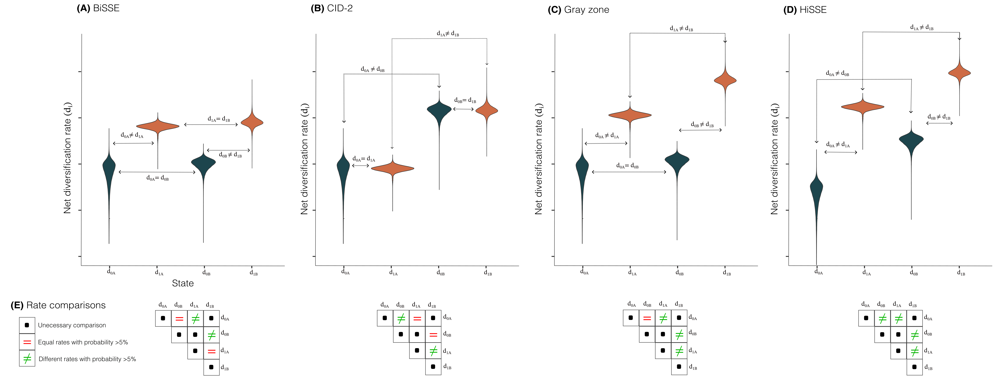
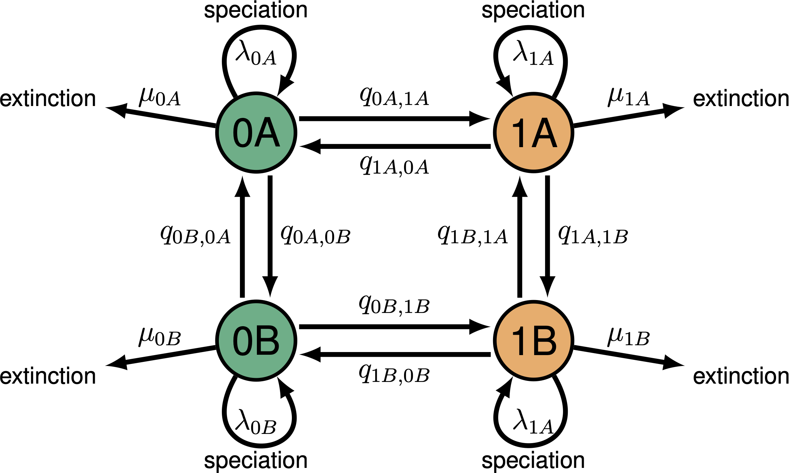
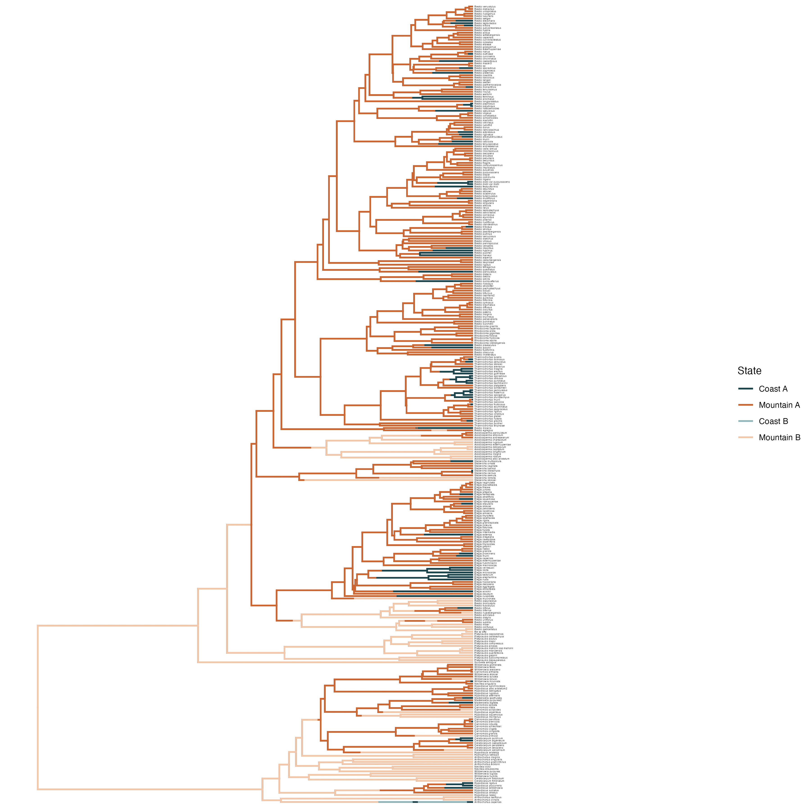
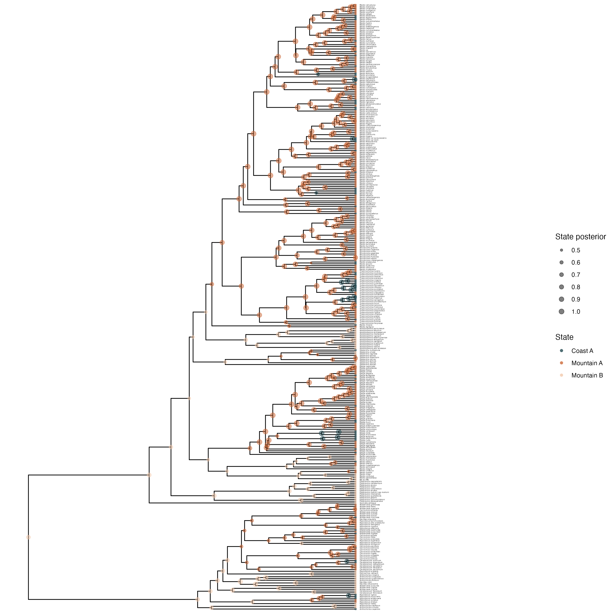
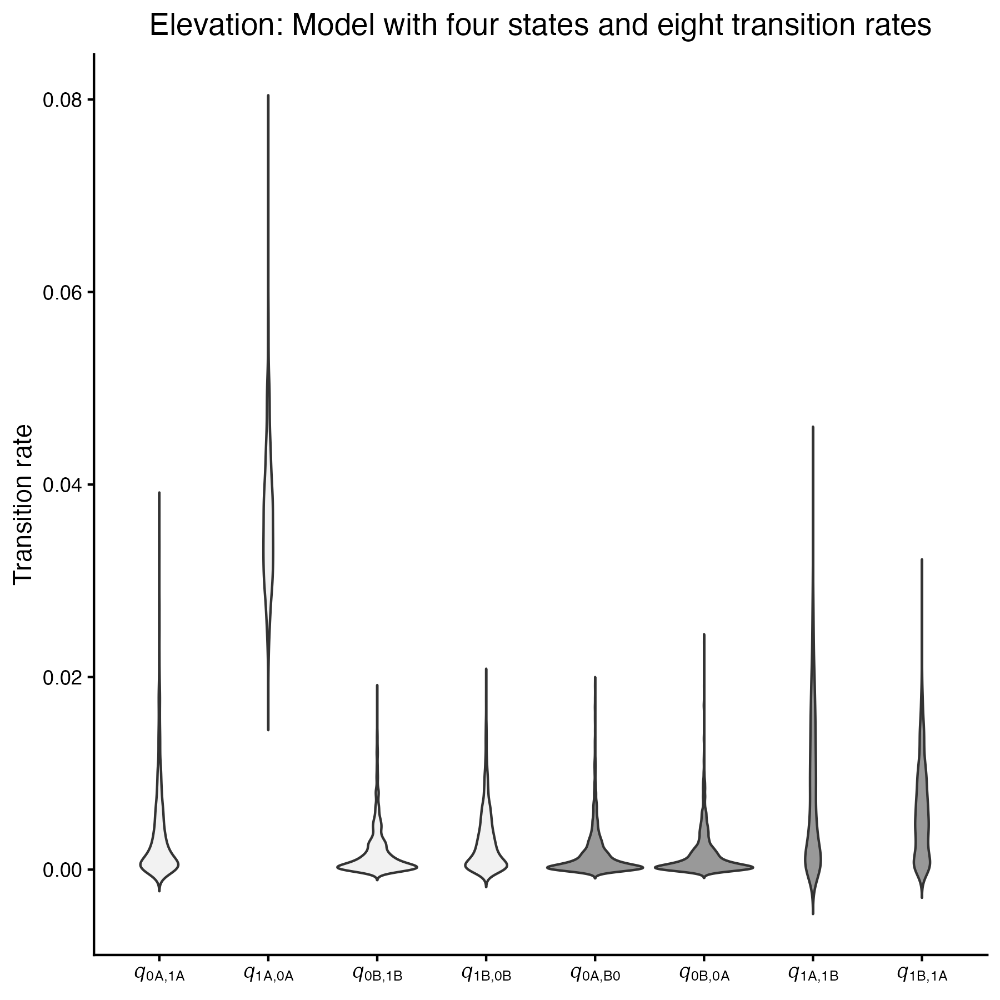
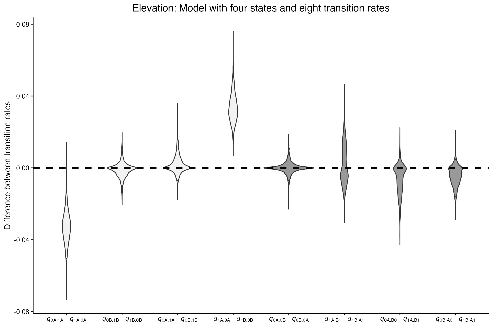
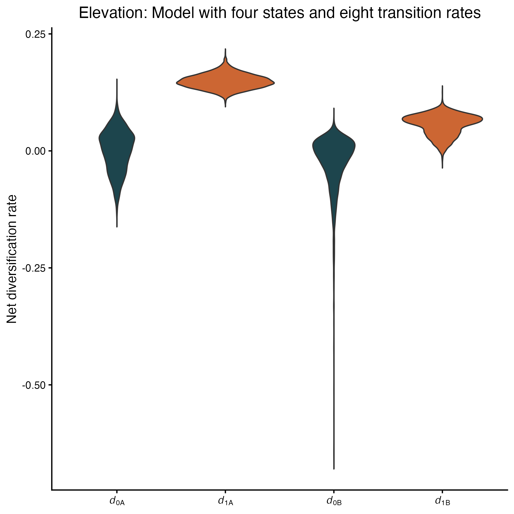
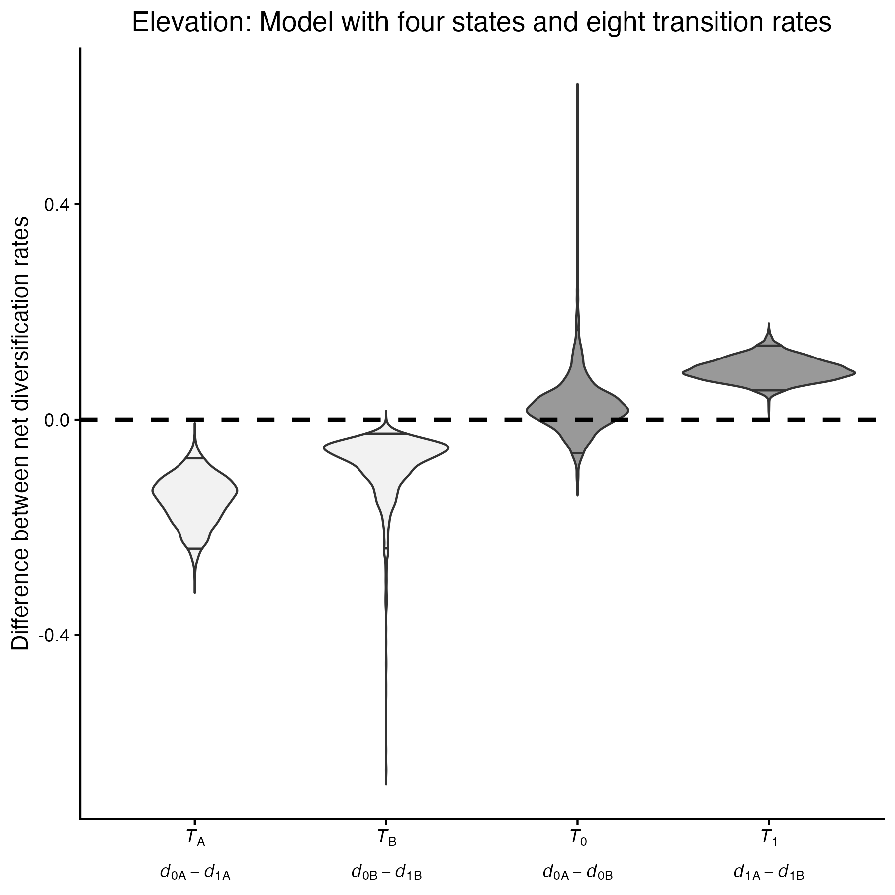
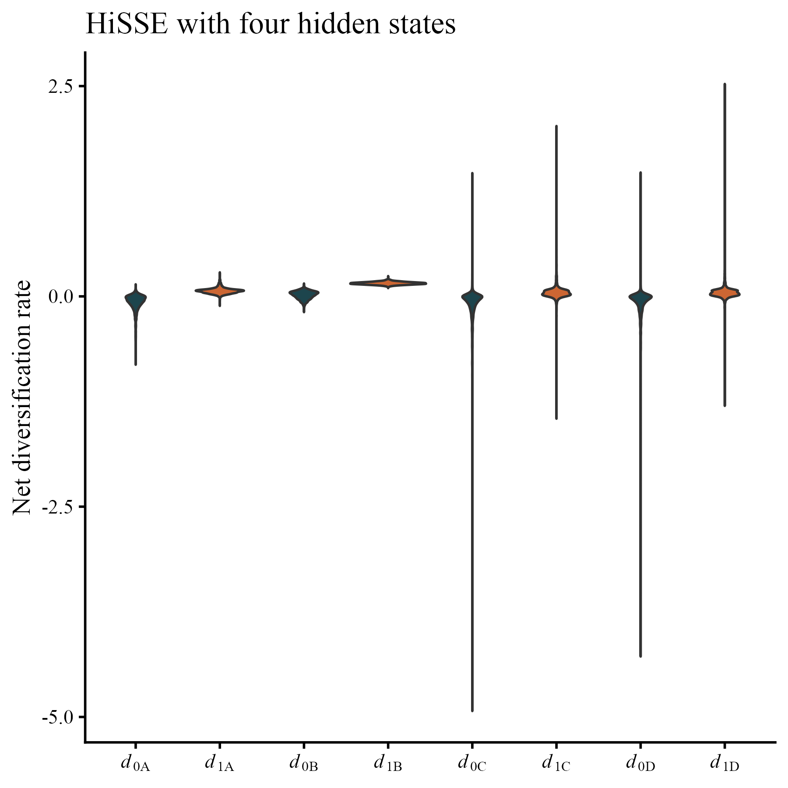
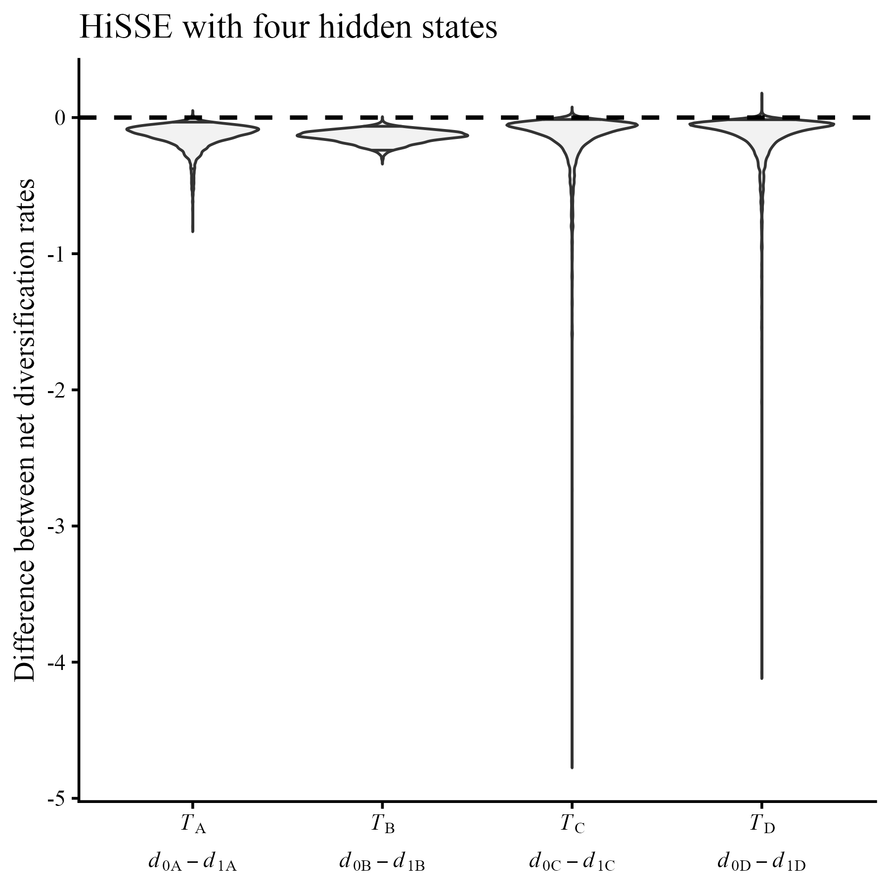



 introduced an extension of the Binary State-Dependent Speciation and Extinction (BiSSE) model that incorporates unobserved (hidden) traits. This development provided a more appropriate null model, reducing the high Type I error rate previously identified for BiSSE by . The Character-Independent Diversification (CID) model and the Hidden State-Dependent Speciation and Extinction (HiSSE) model incorporate a hidden trait with the same number of states and freely varying diversification rates as in BiSSE or MuSSE (Multi-State-Dependent Speciation and Extinction). Because these models have the same number of parameters as BiSSE/MuSSE, they allow fair model comparisons and enable the detection of diversification-rate variation arising from unmeasured factors.

As illustrated in Figure 1, when diversification rates do not differ among the observed states (0 and 1), the resulting model is a CID model, indicating that diversification-rate variation across the phylogeny is better explained by unmeasured factors rather than by the observed trait. In contrast, when diversification rates differ between observed states, the resulting model may correspond to a HiSSE or a BiSSE model, depending on whether the hidden states (A and B) differ or are equal, respectively. In both cases, variation in diversification rates across the phylogeny is associated with the observed trait, although it may also be influenced by unobserved factors when a HiSSE model is supported. Additionally, some cases exhibit mixed patterns in which diversification rates differ for certain states but not for others, either within some or all hidden states. For example,  investigated diversification in sedges of the genus Carex and found that some speciation rates were correlated with single-chromosome changes, whereas others were unrelated to aneuploidy. Such intermediate cases are expected to become increasingly common and have recently been described as “gray zone” models.




When we fit a full HiSSE model we can identify four different state-dependent diversification models using the posterior net diversification rates. (A) A BiSSE is identified if d<sub>0</sub> ≠ d<sub>1</sub> for A and B but d<sub>A</sub> = d<sub>B</sub> for 0 and 1. (B) A CID-2 occurs if d<sub>0</sub> = d<sub>1</sub> for A and B but d<sub>A</sub> ≠ d<sub>B</sub> for 0 and 1. (C) A grey zone model is a model that has some net diversifications equal and some different. (D) The resulting model of diversification is HiSSE if the four posterior distributions for net diversifications are different. (E) Matrices with valid rate comparisons, indicating what rates are equal or different, to determine what is the best model of state-dependent diversification.



In this tutorial, we describe how to specify an SSE model that includes two hidden states and freely estimates all transition and diversification rates. Within a Bayesian framework, this approach allows the identification of CID, HiSSE, BiSSE, or “gray zone” models. Moreover, the framework can be readily expanded to incorporate additional observed and hidden states, depending on the specific research questions.



For this tutorial, we use data generated from the analysis of  on the evolution of restio plants in the subfamily Restionoideae, which inhabit the diverse Cape Floristic Region of South Africa across a range of habitats, including montane environments and coastal plains.

We included two data files that contain the phylogeny and the observed trait data:

- [MCC_AFRICANRESTIOS.tre](data/MCC_AFRICANRESTIOS.tre): This dated phylogeny, originally presented in , was inferred from plastid regions and includes 337 restio species, representing 98% of known restio diversity.
- [Elevation_322spp.tsv](data/Elevation_322spp.tsv): This file contains elevation data for 322 of the species present in the phylogeny, as defined in . For species present in the tree but lacking elevation data, the character state was coded as "?", which can be accommodated by RevBayes.

>Create a new directory on your computer named  `hisse_tutorial`. 
>
>Inside this directory, add a subfolder called `data` to store the provided files. Also within `hisse_tutorial`, create a `scripts` folder to save the analysis script, or alternatively run RevBayes interactively by launching RevBayes and entering the code below.
{:.instruction}



Following the hypothesis of , we aim to test whether species inhabiting older (montane) habitats exhibit higher net diversification rates than those occupying younger (lowland) habitats in the Cape Floristic Region. To this end, we define a HiSSE model that allows all transition rates to be freely estimated. In this analysis, the coded character, as presented in the [Elevation_322spp.tsv](data/Elevation_322spp.tsv) file, assigns species inhabiting coastal plains to state 0 and species inhabiting montane areas to state 1.

Accordingly, the specified model includes a total of four speciation rates (*λ*), four extinction rates (*μ*), and eight anagenetic transition rates (*q*). Transition rate notation indicates the ancestral and descendant states, separated by a comma.




Graphic representation of the specified HiSSE model. In this model, an observed binary state is defined as 0 or 1 and unobserved states are defined as A (green) orr B (yellow). Lineages can be at states 0A, 0B, 1A, or 1B, each of them characterized by a distinct speciation and extinction rate. In this case, every transition between states is freelly estimated.





We start by setting the number of observed and hidden states, as well as an extra helper variable that indicates the total number of states.


NUM_STATES <- 2
NUM_HIDDEN <- 2
NUM_RATES = NUM_STATES * NUM_HIDDEN


In this analysis, we assume a fixed tree topology that corresponds to our dated phylogeny. Likewise, we read the data file that includes the observed state information for each species.


observed_phylogeny <- readTrees("data/MCC_AFRICANRESTIOS.tre")[1]

data <- readCharacterDataDelimited("data/Elevation_322spp.tsv",
                                   stateLabels=2,
                                   type="NaturalNumbers",
                                   delimiter="\t",
                                   header=FALSE)


We need to expand the data to include the hidden states, and therefore use the `expandCharacters` function with the appropriate number of hidden states.


data_exp <- data.expandCharacters(NUM_HIDDEN)


Finally, we add a variable to store the moves and monitors that will be used in this model.


moves = VectorMoves()
monitors = VectorMonitors()





#### **Transition rates**

We begin by setting the transition rates of the model. These parameters will be estimated from a gamma distribution. Consequently, we first set up the priors using a loose shape parameter value of 0.5 and a rate parameter equal to the total phylogeny length in millions of years divided by the expected number of changes per lineage.


shape_pr <- 0.5
rate_pr := observed_phylogeny.treeLength()/10


Next, we specify the transition rates between observed and hidden states, as previously illustrated in Figure 2:


#Transitions between observed states
q_0A1A ~ dnGamma(shape=shape_pr, rate=rate_pr)
q_1A0A ~ dnGamma(shape=shape_pr, rate=rate_pr)
q_0B1B ~ dnGamma(shape=shape_pr, rate=rate_pr)
q_1B0B ~ dnGamma(shape=shape_pr, rate=rate_pr)
#Transitions between hidden states
q_0A0B ~ dnGamma(shape=shape_pr, rate=rate_pr)
q_0B0A ~ dnGamma(shape=shape_pr, rate=rate_pr)
q_1A1B ~ dnGamma(shape=shape_pr, rate=rate_pr)
q_1B1A ~ dnGamma(shape=shape_pr, rate=rate_pr)


We then add moves to the vectors previously created. In this case, we use the `mvSlice` move, which proposes a new value for a parameter by sampling from the region of the likelihood distribution defined by its current value.


moves.append(mvSlice(q_0A1A, window = 0.1, weight=2, search_method = "stepping_out"))
moves.append(mvSlice(q_1A0A, window = 0.1, weight=2, search_method = "stepping_out"))
moves.append(mvSlice(q_0B1B, window = 0.1, weight=2, search_method = "stepping_out"))
moves.append(mvSlice(q_1B0B, window = 0.1, weight=2, search_method = "stepping_out"))

moves.append(mvSlice(q_0A0B, window = 0.1, weight=2, search_method = "stepping_out"))
moves.append(mvSlice(q_0B0A, window = 0.1, weight=2, search_method = "stepping_out"))
moves.append(mvSlice(q_1A1B, window = 0.1, weight=2, search_method = "stepping_out"))
moves.append(mvSlice(q_1B1A, window = 0.1, weight=2, search_method = "stepping_out"))


A key difference between the approach presented here and the one in [the HiSSE tutorial]({{ base.url }}/tutorials/sse/hisse) is that we explicitly define every rate in the transition Q matrix. This allows us to incorporate asymmetric transition rates between both observed and hidden states.

To construct the Q matrix, we first initialize a matrix with zeros and then replace the appropriate elements with the corresponding transition rates:


for (i in 1:NUM_RATES) {
    for (j in 1:NUM_RATES) {
        q[i][j] := 0.0
    }
}

q[1][2] := q_0A1A
q[2][1] := q_1A0A
q[1][3] := q_0A0B
q[3][1] := q_0B0A
q[2][4] := q_1A1B
q[4][2] := q_1B1A
q[3][4] := q_0B1B
q[4][3] := q_1B0B


To generate the final rate matrix, we use the `fnFreeK` function instead of `fnHiddenStateRateMatrix`, since the latter does not allow all asymmetric transition rates.


rate_matrix := fnFreeK(q, rescaled=false, matrixExponentialMethod="scalingAndSquaring")


#### **Diversification rates**

We now specify speciation and extinction rates for each state. These parameters are sampled from log-normal distributions; we first define auxiliary parameters drawn from normal distributions and then exponentiate them to ensure positive values. We start by defining the following priors:


total_taxa <- observed_phylogeny.ntips()
half_sd <- 0.5
rate_mean <- ln(ln(total_taxa/2.0) / observed_phylogeny.rootAge())
rate_sd <- 2 * half_sd


The mean of these distributions follows the statistic 
$$\frac{\log(N/2)}{T}$$ 
that represents the method of moments rate estimate from a birth–death model, which gives the expected number of lineages *N* after a time *T* when starting from a crown group . Here, the total number of surviving lineages (*N*)is stored in `total_taxa`, and the total time (*T*) is given by `observed_phylogeny.rootAge()`. The prior for standard deviation is set to represent uncertainty. 

Using a `for` loop, we first define speciation and extinction rates for the observed states and assign two types of moves to each parameter (`mvSlide` and `mvSlice`). The `mvSlide` move proposes a new value by sampling from a uniform distribution and adding it to the current value.


for (i in 1:NUM_STATES) {

    speciation_alpha[i] ~ dnNormal(mean=rate_mean,sd=rate_sd)
    moves.append(mvSlide(speciation_alpha[i],delta=0.20,tune=true,weight=2.0))
    moves.append(mvSlice(speciation_alpha[i],window = 0.1, weight=2, search_method = "stepping_out"))

    extinction_alpha[i] ~ dnNormal(mean=rate_mean,sd=rate_sd)
    moves.append(mvSlide(extinction_alpha[i],delta=0.20,tune=true,weight=2.0))
    moves.append(mvSlice(extinction_alpha[i],window = 0.1, weight=2, search_method = "stepping_out"))

}


To incorporate the additional variation represented by the hidden states, we define another set of normally distributed variables for the speciation and extinction rates. We also assign the same two types of moves to these parameters.


for (i in 1:(NUM_HIDDEN-1)) {

    speciation_beta[i] ~ dnNormal(0.0,1.0)
    moves.append(mvSlice(speciation_beta[i],window = 0.1, weight=2, search_method = "stepping_out"))
    moves.append(mvSlide(speciation_beta[i],delta=0.20,tune=true,weight=2.0))

    extinction_beta[i] ~ dnNormal(0.0,1.0)
    moves.append(mvSlice(extinction_beta[i],window = 0.1, weight=2, search_method = "stepping_out"))
    moves.append(mvSlide(extinction_beta[i],delta=0.20,tune=true,weight=2.0))

}


Finally, we define the speciation and extinction rates using a `for` loop. The first set of rates, corresponding to 0A and 1A states, are simply the exponentiated values of `speciation_alpha` and `extinction_alpha`. For the states 0B and 1B, their diversification parameters include the additional variation from `speciation_beta` and `extinction_beta`.


for (j in 1:NUM_HIDDEN) {
    for (i in 1:NUM_STATES) {
        if ( j == 1) {
            speciation[i] := exp( speciation_alpha[i] )
            extinction[i] := exp( extinction_alpha[i] )
        } else {
            index = i+(j*NUM_STATES)-NUM_STATES
            speciation[index] := exp( speciation_alpha[i] + speciation_beta[j-1] )
            extinction[index] := exp( extinction_alpha[i] + extinction_beta[j-1] )
        }
    }
}
 

We conclude by defining a net diversification variable, calculated as the difference between speciation and extinction rates for each state. Likewise, turnover rates, defined as the ratio of extinction to speciation, could also be used.


net_diversification := speciation - extinction


#### **Root State**
To estimate the root state frequencies, we define a constant vector containing the prior probabilities of each rate category at the root. This variable accounts for the total number of states and is sampled from a Dirichlet distribution, which constrains the elements of the vector to sum to 1. Furthermore, we assign two types of moves to this parameter: `mvDirichletSimplex` and `mvElementSwapSimplex`. The former, which is specifically designed for Dirichlet distributed parameters, proposes random changes to the values of the vector while maintaining the simplex constraint. The latter swaps the values of two elements within the vector, improving mixing across states.


root_frequencies ~ dnDirichlet(rep(1,NUM_RATES))
moves.append(mvDirichletSimplex(root_frequencies,tune=true,weight=2))
moves.append(mvElementSwapSimplex(root_frequencies, weight=2))


As an additional useful variable, we define a parameter that stores the age of the tree root:


root_age <- observed_phylogeny.rootAge()


#### **Extant sampling**
To specify the probability of sampling species at the present, we create a constant node than indicates the proportion of clade species that are sampled in our phylogeny. We indicate the total number of species in the clase to 350 to match the 98% sampling that was indicated by .


total_clade <- 350
extant_sampling <- total_taxa/total_clade


#### **The time tree**
We specified a variable for the time tree drawn from a birth–death process using the `dnCDBDP` function, incorporating all previously defined parameters.


hisse ~ dnCDBDP(rootAge         = root_age,
                speciationRates = speciation,
                extinctionRates = extinction,
                Q               = rate_matrix,
                pi              = root_frequencies,
                rho             = extant_sampling)


Finally, we proceed to attach the fixed topology and the observed character states using the `clamp` and `clampCharData` functions.


hisse.clamp(observed_phylogeny)
hisse.clampCharData(data_exp) 




#### **The model object**

We define a workspace object for our model using the `model` function. Because all components of the model are interconnected, we can initialize the model using any node within it; here, we use the `rate_matrix` node.


mymodel = model(rate_matrix)


#### **Monitors**

By setting up the monitors, we will output parameter values to both file and screen. First, we save all parameter estimates to a log file using the `mnModel` function. Furthermore, because we are interested in reconstructing the evolution of the elevation trait across the phylogeny, we specify both ancestral state and stochastic character mapping monitors using the `mnJointConditionalAncestralState` and `mnStochasticCharacterMap` functions. These outputs will subsequently be used to identify which lineages correspond to each hidden state and to infer elevation shifts throughout the evolutionary history of restios. Finally, the `mnScreen` function allows us to monitor the progress of the analysis for the specified parameters.


monitors.append(mnModel(filename="output/hisse_8_transitions.log", printgen=10))
monitors.append(mnJointConditionalAncestralState(tree=hisse, cdbdp=hisse, type="NaturalNumbers", printgen=500, withTips=true, withStartStates=false, filename="output/asr_hisse_8_transitions.log"))
monitors.append(mnStochasticCharacterMap(cdbdp=hisse,printgen=500,filename="output/stochmap_hisse_8_transitions.log", include_simmap=true))
monitors.append(mnScreen(printgen=10, speciation, extinction, net_diversification))


#### **Creating and Running the MCMC**

We create the MCMC workspace using the `mcmc` function, specifying the previously defined model object, along with the vectors of monitors and moves, and the number of chains to be run. We set the number of runs to two in order to assess convergence of the parameter estimates.


mymcmc = mcmc(mymodel, monitors, moves, nruns=2, moveschedule="random")


We define the number of generations for our analysis using a stopping rule that specifies a minimum effective sample size (ESS) of 250 for each parameter, which is implemented with the `srMinESS` function. In addition, we create a checkpoint file to allow the analysis to be resumed in case it is interrupted for any reason.


if ( fileExists("output/hisse_8_transitions.state") ) {
    mymcmc.initializeFromCheckpoint("output/hisse_8_transitions.state")
}

stopping_rules[1] = srMinESS(250, file = "output/hisse_8_transitions.log", freq = 10000)

mymcmc.run(rules = stopping_rules, checkpointInterval = 1000, checkpointFile = "output/hisse_8_transitions.state")




Alternatively, we recommend using the TensorPhylo plugin . It provides an alternative, general SSE likelihood function that offers faster likelihood calculations. TensorPhylo can be installed by following these instructions: [Installing TensorPhylo using the installer script](https://bitbucket.org/mrmay/tensorphylo/src/a1314e61f180bd46a4de529bc6d26c434d1d442a/doc/Install.md).

To use TensorPhylo, we need to make a few minor modifications to the previously presented script. First, we load the TensorPhylo plugin and specify its installation path using the `loadPlugin` function:

loadPlugin("TensorPhylo", "/path/to/tensorphylo/build/installer/lib")

Next, we create a node that specifies the taxa present in the phylogeny:


taxa <- observed_phylogeny.taxa()


Finally, we replace `dnCDBDP` with `dnGLHBDSP`. In addition, we include the taxa node and specify NUM_RATES in the arguments of the function.


hisse ~ dnGLHBDSP(rootAge = root_age,
                  lambda  = speciation,
                  mu      = extinction,
                  eta     = rate_matrix,
                  pi      = root_frequencies,
                  rho     = extant_sampling,
                  taxa    = taxa,
                  nProc   = 4,
                  nStates = NUM_RATES)








#### **Summarize Sampled Ancestral States**

To summarize the sampled ancestral states, to be susequently plotted using the `RevGadgets`  R package, we can use the `readAncestralStateTrace` and `ancestralStateTree` functions in RevBayes. The latter will produce an annotated phylogeny by summarizing at each node the maximum a posteriori (MAP) state.


anc_states = readAncestralStateTrace("output/asr_hisse_8_transitions_run_1.log")

anc_tree = ancestralStateTree(tree=observed_phylogeny,ancestral_state_trace_vector=anc_states, include_start_states=false, file="output/asr_summary_hisse_8_transitions_run_1.tree", burnin=0.1, summary_statistic="MAP", site = 1)


Likewise, we may follow the same process for the stochastic map reconstruction, this time using the `characterMapTree` function:


anc_state_trace = readAncestralStateTrace("output/stochmap_hisse_8_transitions_run_1.log")

characterMapTree(observed_phylogeny, anc_state_trace, character_file="output/stochmap_hisse_8_transitions_run_1.tree", posterior_file="output/posterior_stochmap_hisse_8_transitions_run_1.tree", burnin=0.1, reconstruction="marginal")


#### **Visualize Sampled Ancestral States**

To generate the following plots, we use the RevGadgets R package , specifically the development functions for visualizing stochastic character maps. To install this development version of the package, we use the `install_github` function:
```{R}
devtools::install_github("revbayes/RevGadgets@development")
```
After loading the RevGadgets library, we begin by specifying the path to the phylogeny in Nexus format, which is then read into R using the readTrees function and stored in the tree object:

```{R}
library(RevGadgets)

file <- "data/MCC_AFRICANRESTIOS.nex"
tree <- readTrees(paths = "data/MCC_AFRICANRESTIOS.nex")

mapsfile <- "output/stochmap_hisse_8_transitions_run_1.log" 
```
Next, we process the sampled stochastic maps using the `processStochMaps` function and visualize the summary stochastic map based on maximum a posteriori (MAP) estimates. In addition, we define a vector of colors for graphical purposes:
```{R}
stoch_map_df <- processStochMaps(tree,
                                 mapsfile, 
                                 state_labels=c("0" = "Coast A", "1" = "Mountain A",
                                                "2" = "Coast B", "3" = "Mountain B"), 
                                 burnin = 0.1)

colors <- c("Coast A" = "#1d454d",
            "Mountain A" = "#cc6633",
            "Coast B" = "#8FB5BA",
            "Mountain B" = "#F2C7AA")

plotStochMaps(tree= tree,
              maps=stoch_map_df,
              colors = colors,
              color_by="MAP",
              tree_layout = "rectangular",
              tip_labels_size=1,
              linewidth = 0.8)
```



A visualization of the stochastic character map estimated under the HiSSE model. 


Likewise, we can visualize the ancestral state reconstruction by loading the previously generated output files. First, we use the `processAncStates` function to specify the path to the ancestral state reconstruction summary. We then use `plotAncStatesMAP` to generate the final plot, aided by a predefined color vector.
```{R}
anc_states <- processAncStates(path = "output/asr_summary_hisse_8_transitions_run_1.tree",
                               state_labels=c("0"="Coast A",
                                              "1"="Mountain A",
                                              "2"="Coast B",
                                              "3"="Mountain B"))

colors <- setNames(c("#1d454d", "#cc6633","#8FB5BA","#F2C7AA"),
                   c("Coast A", "Mountain A", "Coast B", "Mountain B"))

plotAncStatesMAP(t = anc_states,
                 tree_layout="rectangular",
                 state_transparency = 0.5,
                 node_size = c(1, 2),
                 tip_labels_size = 1,
                 tip_labels_offset = 0.5,
                 node_color = colors)
```



A visualization of the ancestral state reconstruction estimated under the HiSSE model.





In this section, we describe how to test for differences in transition and diversification rates by constructing test statistics from posterior samples. These test statistics are defined as the differences between the posterior distributions of two transition or diversification rates. This approach, which is possible within a Bayesian framework, provides an alternative to traditional model-selection procedures used in likelihood-based analyses, where inference depends on the specific set of models that are compared.



The specified model allows for asymmetric transition rates. These asymmetries can be evaluated by computing the difference between the posterior distributions of pairs of transition rates:

$$
T_q =q_{i,j} - q_{j,i}
$$

We use R to assess differences in transition rates by first loading the required packages, `ggplot2` and `dplyr`. We then use the output of the RevBayes `mnModel` monitor, which contains posterior samples of the estimated parameters, and discard the first 10% of samples as burn-in. Note that the appropriate burn-in fraction may vary across analyses, depending on convergence of the Markov chain.

```{R}
library(ggplot2)
library(dplyr)

hisse_run_1<- read.table("output/hisse_8_transitions_run_1.log", header=TRUE)
hisse_run_1<- hisse_run_1[-seq(1,200,1),]
```
Subsequently, we create a data frame containing the estimated transition rates and visualize them using `ggplot2`. As shown in Figure 5, the rate $q_{1A,0A}$ is higher than the others, suggesting asymmetry between the observed states within hidden state A. This distinction is important, as it indicates that transitions between coastal and montane ecosystems do not necessarily occur at the same evolutionary rate.
```{R}
#Transition rates

transition_rates_hisse_run_1 <- 
  data.frame(
  dens=c(hisse_run_1$q_0A1A,hisse_run_1$q_1A0A, hisse_run_1$q_0B1B,hisse_run_1$q_1B0B, 
         hisse_run_1$q_0A0B,hisse_run_1$q_0B0A, hisse_run_1$q_1A1B,hisse_run_1$q_1B1A),
  rate=rep(c("q_0A1A","q_1A0A","q_0B1B","q_1B0B","q_0A0B","q_0B0A","q_1A1B","q_1B1A"),each=length(hisse_run_1$q_0A1A)))

transition_rates_hisse_run_1$rate <- 
  factor(transition_rates_hisse_run_1$rate,
         levels = c("q_0A1A","q_1A0A","q_0B1B","q_1B0B","q_0A0B","q_0B0A","q_1A1B","q_1B1A"))

transition_rates_hisse_run_1_plot <- 
  ggplot(transition_rates_hisse_run_1,aes(x=rate,y=dens, fill=rate))+
  geom_violin(trim=FALSE)+
  scale_fill_manual(values = c("q_0A1A" = "gray95", "q_1A0A" = "gray95", "q_0B1B" = "gray95", "q_1B0B" = "gray95",
                               "q_0A0B" = "gray60", "q_0B0A" = "gray60", "q_1A1B" = "gray60", "q_1B1A" = "gray60")) +
  labs(title="Elevation: Model with four states and eight transition rates", x = NULL, y = "Transition rate")+
  theme_classic() +
  theme(legend.position = "none",  plot.title = element_text(hjust = 0.5)) +
  scale_x_discrete(labels = c("q_0A1A" = expression(italic(q)["0A,1A"]), "q_1A0A" = expression(italic(q)["1A,0A"]),
                              "q_0B1B" = expression(italic(q)["0B,1B"]), "q_1B0B" = expression(italic(q)["1B,0B"]),
                              "q_0A0B" = expression(italic(q)["0A,B0"]), "q_0B0A" = expression(italic(q)["0B,0A"]),
                              "q_1A1B" = expression(italic(q)["1A,1B"]), "q_1B1A" = expression(italic(q)["1B,1A"])))

transition_rates_hisse_run_1_plot
```



Posterior distributions of the transition rates estimated under a full HiSSE model.


Furthermore, to formally test whether the rate $q_{1A,0A}$ differs from the others, we compare differences between the posterior distributions of transition rates. To do so, we first construct a new data frame that captures these posterior differences and then visualize them. Transition rates are considered significantly different when the 95% credible interval of the corresponding posterior difference does not include zero.
```{R}
#Are transitions different?

test_transition_rates_hisse_run_1 <-
  data.frame(dens=c(hisse_run_1$q_0A1A - hisse_run_1$q_1A0A, hisse_run_1$q_0B1B - hisse_run_1$q_1B0B,
                    hisse_run_1$q_0A1A - hisse_run_1$q_0B1B, hisse_run_1$q_1A0A - hisse_run_1$q_1B0B,
                    hisse_run_1$q_0A0B - hisse_run_1$q_0B0A, hisse_run_1$q_1A1B - hisse_run_1$q_1B1A,
                    hisse_run_1$q_0A0B - hisse_run_1$q_1A1B, hisse_run_1$q_0B0A - hisse_run_1$q_1B1A),
  difference=rep(c("q_0A1A - q_1A0A", "q_0B1B - q_1B0B", 
                   "q_0A1A - q_0B1B", "q_1A0A - q_1B0B",
                   "q_0A0B - q_0B0A", "q_1A1B - q_1B1A",
                   "q_0A0B - q_1A1B", "q_0B0A - q_1B1A"),
                   each=length(hisse_run_1$q_0A1A)))

test_transition_rates_hisse_run_1$difference <- 
  factor(test_transition_rates_hisse_run_1$difference,
         levels = c("q_0A1A - q_1A0A", "q_0B1B - q_1B0B",
                    "q_0A1A - q_0B1B", "q_1A0A - q_1B0B",
                    "q_0A0B - q_0B0A", "q_1A1B - q_1B1A",
                    "q_0A0B - q_1A1B", "q_0B0A - q_1B1A"))

test_transition_rates_hisse_run_1_plot <- 
    ggplot(test_transition_rates_hisse_run_1, aes(x = difference, y = dens, fill = difference)) +
    geom_violin(trim=FALSE, quantiles = c(0.025, 0.975), quantile.linetype = 1) +
    scale_fill_manual(values = c("q_0A1A - q_1A0A" = "gray95",
                                 "q_0B1B - q_1B0B" = "gray95",
                                 "q_0A1A - q_0B1B" = "gray95",
                                 "q_1A0A - q_1B0B" = "gray95",
                                 "q_0A0B - q_0B0A" = "gray60",
                                 "q_1A1B - q_1B1A" = "gray60",
                                 "q_0A0B - q_1A1B" = "gray60",
                                 "q_0B0A - q_1B1A" = "gray60")) +
    labs(title = "Elevation: Model with four states and eight transition rates", y = "Difference between transition rates", x = NULL) +
    geom_hline(yintercept = 0, linetype = "dashed", lwd = 1) +
    theme_classic() +
    theme(legend.position = "none",  plot.title = element_text(hjust = 0.5)) +
    scale_x_discrete(labels = c("q_0A1A - q_1A0A" = expression(italic(q)["0A,1A"] - italic(q)["1A,0A"]),
                                "q_0B1B - q_1B0B" = expression(italic(q)["0B,1B"] - italic(q)["1B,0B"]),
                                "q_0A1A - q_0B1B" = expression(italic(q)["0A,1A"] - italic(q)["0B,1B"]),
                                "q_1A0A - q_1B0B" = expression(italic(q)["1A,0A"] - italic(q)["1B,0B"]),
                                "q_0A0B - q_0B0A" = expression(italic(q)["0A,0B"] - italic(q)["0B,0A"]),
                                "q_1A1B - q_1B1A" = expression(italic(q)["1A,B1"] - italic(q)["1B,A1"]),
                                "q_0A0B - q_1A1B" = expression(italic(q)["0A,B0"] - italic(q)["1A,B1"]),
                                "q_0B0A - q_1B1A" = expression(italic(q)["0B,A0"] - italic(q)["1B,A1"])))

test_transition_rates_hisse_run_1_plot
```



Test for transition rates estimated under a full HiSSE model.


We therefore confirm that there is asymmetry in the transition rates of our model, with $q_{1A,0A}$ differing from both $q_{0A,1A}$ and $q_{1B,0B}$. Likewise, we can numerically define the 95% credible intervals for the differences between transition rates:
```{R}
quantile <- test_transition_rates_hisse_run_1 %>%
  group_by(difference)%>%reframe(res=quantile(dens,probs=c(0.025,0.975)))

quantile

## A tibble: 16 × 2
#   difference           res
#   <fct>              <dbl>
# 1 q_0A1A - q_1A0A -0.0503 
# 2 q_0A1A - q_1A0A -0.0138 
# 3 q_0B1B - q_1B0B -0.00967
# 4 q_0B1B - q_1B0B  0.00715
# 5 q_0A1A - q_0B1B -0.00709
# 6 q_0A1A - q_0B1B  0.0161 
# 7 q_1A0A - q_1B0B  0.0194 
# 8 q_1A0A - q_1B0B  0.0503 
# 9 q_0A0B - q_0B0A -0.00697
#10 q_0A0B - q_0B0A  0.00745
#11 q_1A1B - q_1B1A -0.0145 
#12 q_1A1B - q_1B1A  0.0235 
#13 q_0A0B - q_1A1B -0.0240 
#14 q_0A0B - q_1A1B  0.00577
#15 q_0B0A - q_1B1A -0.0161 
#16 q_0B0A - q_1B1A  0.00459
```



The main advantage of incorporating hidden states into SSE models is that they provide a more appropriate null hypothesis, represented by a CID-2 model, in which diversification rates are allowed to vary independently of the observed states. This framework substantially reduces Type I error by accounting for diversification-rate heterogeneity unrelated to the focal trait:

$$
H_0:
\begin{cases}
d_{0A} = d_{1A} \;\text{   and   }\; d_{0B} = d_{1B} \\
d_{0A} \neq d_{0B} \;\text{   and   }\; d_{1A} \neq d_{1B}
\end{cases}
$$

To test for differences in diversification rates within a Bayesian framework, we propose test statistics derived from posterior samples obtained by fitting a fully parameterized HiSSE model. Differences in net diversification rates between observed states are defined as:

$$
T_A = d_{0A} - d_{1A} \text{   and   }\ T_B = d_{0B} - d_{1B}
$$

Similarly, differences in net diversification rates between hidden states are defined as:

$$
T_0 = d_{0A} - d_{0B} \text{   and   }\ T_1 = d_{1A} - d_{1B}
$$

Therefore, the null hypothesis $H_0$ can be evaluated using these statistics. A CID-2 model is supported when the 95% credible intervals for $T_A$ and $T_B$ include zero, whereas those for $T_0$ and $T_1$ exclude zero. As illustrated in Figure 1, fitting a HiSSE model within a Bayesian framework can yield multiple outcomes depending on the inferred relationships between observed and hidden states. To estimate these statistics, we first load and visualize the net diversification rate estimates in R.

```{R}
#Net diversification

net_diversification_hisse_run_1<- 
  data.frame(dens=c(hisse_run_1$net_diversification.1., hisse_run_1$net_diversification.2.,
                    hisse_run_1$net_diversification.3., hisse_run_1$net_diversification.4.),
             rate=rep(c("net_div_0A","net_div_1A","net_div_0B","net_div_1B"),
             each=length(hisse_run_1$net_diversification.1.)))

net_diversification_hisse_run_1$rate <- factor(net_diversification_hisse_run_1$rate,
                                        levels = c("net_div_0A","net_div_1A","net_div_0B","net_div_1B"))

net_diversification_hisse_run_1_plot <- 
  ggplot(net_diversification_hisse_run_1,aes(x=rate,y=dens, fill=rate))+
  geom_violin(trim=FALSE)+
  scale_fill_manual(values = c("net_div_0A" = "#1d454d", "net_div_1A" = "#cc6633", "net_div_0B" = "#1d454d", "net_div_1B" = "#cc6633")) +
  labs(title = "Elevation: Model with four states and eight transition rates", y = "Net diversification rate", x = NULL) +
  theme_classic() +
  theme(legend.position = "none",  plot.title = element_text(hjust = 0.5)) +
  scale_x_discrete(labels = c("net_div_0A" = expression(italic(d)["0A"]), "net_div_1A" = expression(italic(d)["1A"]),
                              "net_div_0B" = expression(italic(d)["0B"]), "net_div_1B" = expression(italic(d)["1B"])))

net_diversification_hisse_run_1_plot
```



Posterior distributions of the net diversification rates estimated under a full HiSSE model.



As shown in Figure 7, net diversification rates for states 1A and 1B are higher than those for states 0A and 0B. Examination of the test statistics indicates that the 95% credible intervals for $T_A$, $T_B$, and $T_1$ do not include zero, whereas the credible interval for $T_0$ does include zero. This pattern does not fully correspond to either a HiSSE or a CID-2 model.
```{R}
#Is net diversification different?

test_net_diversification_hisse_run_1 <-
  data.frame(dens=c(hisse_run_1$net_diversification.1. - hisse_run_1$net_diversification.2.,
                    hisse_run_1$net_diversification.3. - hisse_run_1$net_diversification.4.,
                    hisse_run_1$net_diversification.1. - hisse_run_1$net_diversification.3.,
                    hisse_run_1$net_diversification.2. - hisse_run_1$net_diversification.4.),
                    difference=rep(c("T_A","T_B","T_0","T_1"),
                    each=length(hisse_run_1$net_diversification.1.)))

test_net_diversification_hisse_run_1$difference <- factor(test_net_diversification_hisse_run_1$difference,
         levels = c("T_A","T_B","T_0","T_1"))

test_net_diversification_hisse_run_1_plot <- 
    ggplot(test_net_diversification_hisse_run_1, aes(x = difference, y = dens, fill = difference)) +
    geom_violin(trim=FALSE, draw_quantiles = c(0.025, 0.975))+
    scale_fill_manual(values = c("T_A" = "gray95", "T_B" = "gray95", "T_0" = "gray60", "T_1" = "gray60")) +
    labs(title = "Elevation: Model with four states and eight transition rates", y = "Difference between net diversification rates", x = NULL) +
    geom_hline(yintercept = 0, linetype = "dashed", lwd = 1) +
    theme_classic() +
    theme(legend.position = "none",  plot.title = element_text(hjust = 0.5)) +
    scale_x_discrete(labels = c(
  "T_A" = expression(atop(italic(T)[A], italic(d)["0A"] - italic(d)["1A"])),
  "T_B" = expression(atop(italic(T)[B], italic(d)["0B"] - italic(d)["1B"])),
  "T_0" = expression(atop(italic(T)[0], italic(d)["0A"] - italic(d)["0B"])),
  "T_1" = expression(atop(italic(T)[1], italic(d)["1A"] - italic(d)["1B"]))
))

test_net_diversification_hisse_run_1_plot
```



Test for net diversification rates estimated under a full HiSSE model.



To corroborate the visual interpretation of Figure 7, we additionally quantify the 95% credible intervals for $T_A$, $T_B$, $T_0$, and $T_1$.

```{R}
quantile <- test_net_diversification_hisse_run_1 %>%
  group_by(difference)%>%reframe(res=quantile(dens,probs=c(0.025,0.975)))

quantile

## A tibble: 8 × 2
#  difference     res
#  <fct>        <dbl>
#1 T_A        -0.246 
#2 T_A        -0.0739
#3 T_B        -0.234 
#4 T_B        -0.0285
#5 T_0        -0.0602
#6 T_0         0.172 
#7 T_1         0.0567
#8 T_1         0.138 
```
Overall, fitting a single, fully parameterized HiSSE model with all transition and net diversification rates estimated freely is sufficient within a Bayesian framework to evaluate multiple hypotheses of anagenetic evolution and state-dependent diversification. In this example, we identify asymmetry in transition rates, with transitions from montane to coastal habitats occurring more frequently in lineages associated with hidden state A, and support the hypothesis of , as montane ecosystems exhibit higher net diversification rates than coastal habitats.

Furtheremore, we identified that the inferred model does not fully correspond to a HiSSE model (Figure 1), because $d_{0A}$ and $d_{0B}$ are not different. The ability to identify such gray zone models highlights an important advantage of applying a Bayesian framework, as these types of parameter specifications are rarely explored under frequentist approaches.



As a final step, we fit a HiSSE model with four hidden states (A, B, C, and D) to evaluate whether a CID-4 model better explains the diversification process. Implementing this model requires only two modifications to the RevBayes script. First, the NUM_HIDDEN variable must be set to four:


NUM_HIDDEN <- 4


Second, the Q matrix must be adjusted. Because we use the `fnFreeK` function to account for asymmetry in transition rates, this modification must be implemented manually.

We begin by specifying each possible transition along with its corresponding move proposal:


q_0A1A ~ dnGamma(shape=shape_pr, rate=rate_pr) # Coast to Montane A
q_1A0A ~ dnGamma(shape=shape_pr, rate=rate_pr) # Montane to Coast A
q_0B1B ~ dnGamma(shape=shape_pr, rate=rate_pr) # Coast to Montane B
q_1B0B ~ dnGamma(shape=shape_pr, rate=rate_pr) # Montane to Coast B
q_0C1C ~ dnGamma(shape=shape_pr, rate=rate_pr) # Coast to Montane C
q_1C0C ~ dnGamma(shape=shape_pr, rate=rate_pr) # Montane to Coast C
q_0D1D ~ dnGamma(shape=shape_pr, rate=rate_pr) # Coast to Montane D
q_1D0D ~ dnGamma(shape=shape_pr, rate=rate_pr) # Montane to Coast D

q_0A0B ~ dnGamma(shape=shape_pr, rate=rate_pr) # Between hidden states
q_0B0A ~ dnGamma(shape=shape_pr, rate=rate_pr) # Between hidden states
q_0A0C ~ dnGamma(shape=shape_pr, rate=rate_pr) # Between hidden states
q_0C0A ~ dnGamma(shape=shape_pr, rate=rate_pr) # Between hidden states
q_0A0D ~ dnGamma(shape=shape_pr, rate=rate_pr) # Between hidden states
q_0D0A ~ dnGamma(shape=shape_pr, rate=rate_pr) # Between hidden states

q_0B0C ~ dnGamma(shape=shape_pr, rate=rate_pr) # Between hidden states
q_0C0B ~ dnGamma(shape=shape_pr, rate=rate_pr) # Between hidden states
q_0B0D ~ dnGamma(shape=shape_pr, rate=rate_pr) # Between hidden states
q_0D0B ~ dnGamma(shape=shape_pr, rate=rate_pr) # Between hidden states
q_0C0D ~ dnGamma(shape=shape_pr, rate=rate_pr) # Between hidden states
q_0D0C ~ dnGamma(shape=shape_pr, rate=rate_pr) # Between hidden states

q_1A1B ~ dnGamma(shape=shape_pr, rate=rate_pr) # Between hidden states
q_1B1A ~ dnGamma(shape=shape_pr, rate=rate_pr) # Between hidden states
q_1A1C ~ dnGamma(shape=shape_pr, rate=rate_pr) # Between hidden states
q_1C1A ~ dnGamma(shape=shape_pr, rate=rate_pr) # Between hidden states
q_1A1D ~ dnGamma(shape=shape_pr, rate=rate_pr) # Between hidden states
q_1D1A ~ dnGamma(shape=shape_pr, rate=rate_pr) # Between hidden states

q_1B1C ~ dnGamma(shape=shape_pr, rate=rate_pr) # Between hidden states
q_1C1B ~ dnGamma(shape=shape_pr, rate=rate_pr) # Between hidden states
q_1B1D ~ dnGamma(shape=shape_pr, rate=rate_pr) # Between hidden states
q_1D1B ~ dnGamma(shape=shape_pr, rate=rate_pr) # Between hidden states
q_1C1D ~ dnGamma(shape=shape_pr, rate=rate_pr) # Between hidden states
q_1D1C ~ dnGamma(shape=shape_pr, rate=rate_pr) # Between hidden states

### Moves transitions between observed states
moves.append(mvSlice(q_0A1A, window = 0.1, weight=2, search_method = "stepping_out"))
moves.append(mvSlice(q_1A0A, window = 0.1, weight=2, search_method = "stepping_out"))
moves.append(mvSlice(q_0B1B, window = 0.1, weight=2, search_method = "stepping_out"))
moves.append(mvSlice(q_1B0B, window = 0.1, weight=2, search_method = "stepping_out"))
moves.append(mvSlice(q_0C1C, window = 0.1, weight=2, search_method = "stepping_out"))
moves.append(mvSlice(q_1C0C, window = 0.1, weight=2, search_method = "stepping_out"))
moves.append(mvSlice(q_0D1D, window = 0.1, weight=2, search_method = "stepping_out"))
moves.append(mvSlice(q_1D0D, window = 0.1, weight=2, search_method = "stepping_out"))

### Moves transitions between hidden states
moves.append(mvSlice(q_0A0B, window = 0.1, weight=2, search_method = "stepping_out"))
moves.append(mvSlice(q_0B0A, window = 0.1, weight=2, search_method = "stepping_out"))
moves.append(mvSlice(q_0A0C, window = 0.1, weight=2, search_method = "stepping_out"))
moves.append(mvSlice(q_0C0A, window = 0.1, weight=2, search_method = "stepping_out"))
moves.append(mvSlice(q_0A0D, window = 0.1, weight=2, search_method = "stepping_out"))
moves.append(mvSlice(q_0D0A, window = 0.1, weight=2, search_method = "stepping_out"))

moves.append(mvSlice(q_0B0C, window = 0.1, weight=2, search_method = "stepping_out"))
moves.append(mvSlice(q_0C0B, window = 0.1, weight=2, search_method = "stepping_out"))
moves.append(mvSlice(q_0B0D, window = 0.1, weight=2, search_method = "stepping_out"))
moves.append(mvSlice(q_0D0B, window = 0.1, weight=2, search_method = "stepping_out"))
moves.append(mvSlice(q_0C0D, window = 0.1, weight=2, search_method = "stepping_out"))
moves.append(mvSlice(q_0D0C, window = 0.1, weight=2, search_method = "stepping_out"))

moves.append(mvSlice(q_1A1B, window = 0.1, weight=2, search_method = "stepping_out"))
moves.append(mvSlice(q_1B1A, window = 0.1, weight=2, search_method = "stepping_out"))
moves.append(mvSlice(q_1A1C, window = 0.1, weight=2, search_method = "stepping_out"))
moves.append(mvSlice(q_1C1A, window = 0.1, weight=2, search_method = "stepping_out"))
moves.append(mvSlice(q_1A1D, window = 0.1, weight=2, search_method = "stepping_out"))
moves.append(mvSlice(q_1D1A, window = 0.1, weight=2, search_method = "stepping_out"))

moves.append(mvSlice(q_1B1C, window = 0.1, weight=2, search_method = "stepping_out"))
moves.append(mvSlice(q_1C1B, window = 0.1, weight=2, search_method = "stepping_out"))
moves.append(mvSlice(q_1B1D, window = 0.1, weight=2, search_method = "stepping_out"))
moves.append(mvSlice(q_1D1B, window = 0.1, weight=2, search_method = "stepping_out"))
moves.append(mvSlice(q_1C1D, window = 0.1, weight=2, search_method = "stepping_out"))
moves.append(mvSlice(q_1D1C, window = 0.1, weight=2, search_method = "stepping_out"))


Then, we create a Q matrix initialized with zeros and assign the specified transition rates:


for (i in 1:NUM_RATES) {
for (j in 1:NUM_RATES) {
q[i][j] := 0.0
}
}

## Indices for states: 1=0A, 2=1A, 3=0B,4=1B, 5=0C, 6=1C, 7=0D, 8=1D

q[1][2] := q_0A1A
q[2][1] := q_1A0A
q[3][4] := q_0B1B
q[4][3] := q_1B0B
q[5][6] := q_0C1C
q[6][5] := q_1C0C
q[7][8] := q_0D1D
q[8][7] := q_1D0D

q[1][3] := q_0A0B
q[3][1] := q_0B0A
q[1][5] := q_0A0C
q[5][1] := q_0C0A
q[1][7] := q_0A0D
q[7][1] := q_0D0A
q[2][4] := q_1A1B
q[4][2] := q_1B1A
q[2][6] := q_1A1C
q[6][2] := q_1C1A
q[2][8] := q_1A1D
q[8][2] := q_1D1A
q[3][5] := q_0B0C
q[5][3] := q_0C0B
q[3][7] := q_0B0D
q[7][3] := q_0D0B
q[4][6] := q_1B1C
q[6][4] := q_1C1B
q[4][8] := q_1B1D
q[8][4] := q_1D1B
q[5][7] := q_0C0D
q[7][5] := q_0D0C
q[6][8] := q_1C1D
q[8][6] := q_1D1C


Next, we construct the Q matrix using the `fnFreeK` function and then define the diversification rates, root state frequencies, extant sampling fractions, and the overall model specification under a birth–death framework, as previously described.

After completing the analyses, we extend the R code presented in the [Net diversification rates](#subsec_netdiv) subsection to define and evaluate the test statistics $T_A$, $T_B$, $T_C$, and $T_D$, which allows us to formally test the CID-4 model:




Posterior distributions of the net diversification rates estimated under a full HiSSE model with four hidden states.



As shown in Figures 8 and 9, we detect differences in net diversification rates between the observed states (0 and 1) across all hidden states (A, B, C, and D).




Test for net diversification rates estimated under a full HiSSE model with four hidden states.



Therefore, we conclude that the previous differences in net diversification rates that were identified with the simpler model are supported.
