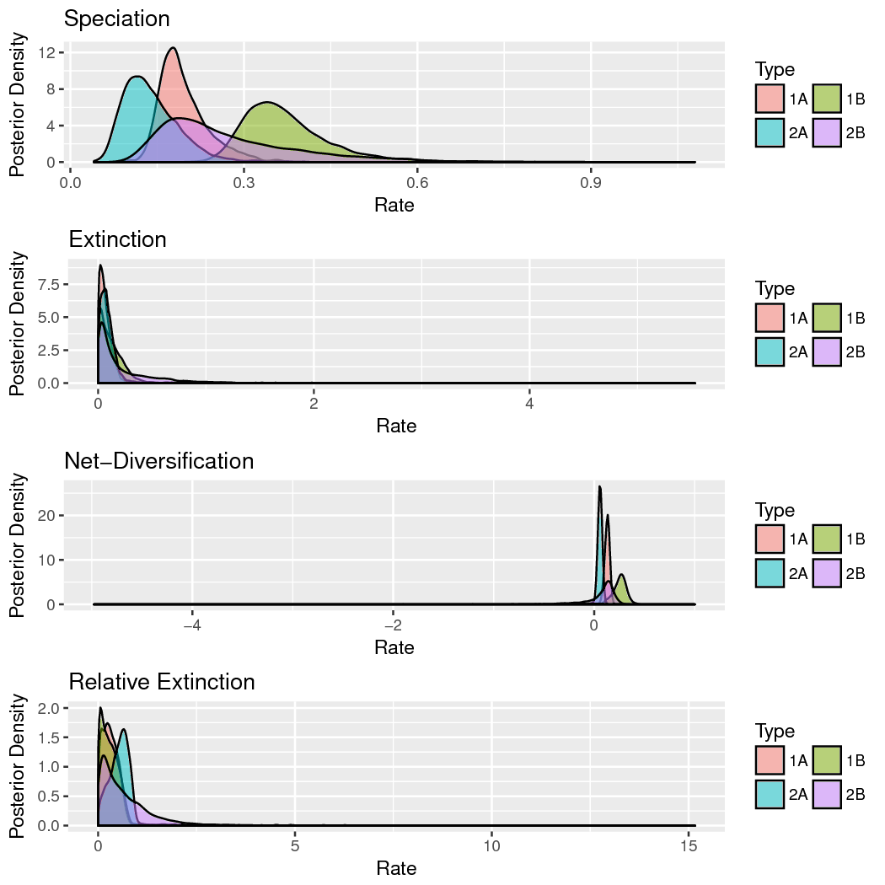

Estimating Character State-Dependent Speciation & Extinction Rates {#estimating-character-state-dependent-speciation-extinction-rates .unnumbered}
==================================================================

Introduction {#introduction .unnumbered}
------------

This tutorial describes how to specify character state-dependent
branching process models in ‘RevBayes‘. Frequently referred to as
state-dependent speciation and extinction (SSE) models, these models are
a birth-death process where the diversification rates are dependent on
the state of an evolving character. The original model of this type
considered a binary character (a trait with two discrete state values;
called BiSSE, @Maddison2007). Several variants have also been developed
for other types of traits
{% cite FitzJohn2010} {% cite Goldberg2011} {% cite Goldberg2012} {% cite MagnusonFord2012} {% cite FitzJohn2012} {% cite Beaulieu2016} .

We will outline the theory behind this method, and then you will fit it
to data using Markov chain Monte Carlo (MCMC). ‘RevBayes‘ is a powerful
tool for SSE analyses. After working through this tutorial you should be
able to set up custom SSE models and use them to infer
character-dependent diversification rates and ancestral states. We also
provide examples of how to plot the results using the ‘Rev‘Gadgets R
package.

Contents {#contents .unnumbered}
--------

The State-Dependent Speciation and Extinction tutorial contains several
sections:

-   Section [sec:diversification_rate_overview]: Introduction to
    diversification rate estimation

-   Section [sec:models]: Theory behind diversification rate models

-   Section [sec:BiSSE_Theory]: Theory behind SSE models

-   Section [sec:CDBDP]: Running a BiSSE/MuSSE analysis in ‘RevBayes‘

-   Section [sec:HiSSE_Theory]: Running a HiSSE analysis in
    ‘RevBayes‘

-   Section [sec:ClaSSE]: Running a ClaSSE analysis in ‘RevBayes‘

Requirements {#requirements .unnumbered}
------------

We assume that you have read and hopefully completed the following
tutorials:

-   [Getting
    started](https://github.com/revbayes/revbayes_tutorial/raw/master/tutorial_TeX/RB_Getting_Started/RB_Getting_Started.pdf)

-   [Very Basic Introduction to
    ‘Rev‘](https://github.com/revbayes/revbayes_tutorial/raw/master/tutorial_TeX/RB_Intro_Tutorial/RB_Intro_Tutorial.pdf)

-   [General Introduction to the ‘Rev‘
    syntax](https://github.com/revbayes/revbayes_tutorial/raw/master/tutorial_TeX/RB_Rev_Tutorial/RB_Rev_Tutorial.pdf)

-   [General Introduction to MCMC using an archery
    example](https://github.com/revbayes/revbayes_tutorial/raw/master/tutorial_TeX/RB_MCMC_Archery_Tutorial/RB_MCMC_Archery_Tutorial.pdf)

-   [General Introduction to MCMC using a coin-flipping
    example](https://github.com/revbayes/revbayes_tutorial/raw/master/tutorial_TeX/RB_MCMC_Binomial_Tutorial/RB_MCMC_Binomial_Tutorial.pdf)

-   [Basic Diversification Rate
    Estimation](https://github.com/revbayes/revbayes_tutorial/raw/master/tutorial_TeX/RB_DiversificationRate_Tutorial/RB_DiversificationRate_Tutorial.pdf)

Note that the [‘Rev‘ basics
tutorial](https://github.com/revbayes/revbayes_tutorial/raw/master/tutorial_TeX/RB_Intro_Tutorial/RB_Intro_Tutorial.pdf)
introduces the basic syntax of ‘Rev‘ but does not cover any phylogenetic
models. We tried to keep this tutorial very basic and introduce all the
language concepts and theory on the way. You may only need the [‘Rev‘
syntax
tutorial](https://github.com/revbayes/revbayes_tutorial/raw/master/tutorial_TeX/RB_Rev_Tutorial/RB_Rev_Tutorial.pdf)
for a more in-depth discussion of concepts in ‘Rev‘.

Data and files {#sec:data_files .unnumbered}
==============

We provide the data files which we will use in this tutorial. You may
want to use your own data instead. In the ‘data‘ folder, you will find
the following files:

-   [primates_tree.nex](https://github.com/revbayes/revbayes_tutorial/raw/master/RB_DiversificationRate_CharacterDependent_Tutorial/data/primates_tree.nex):
    Dated primate phylogeny including 233 out of 367 species. (This tree
    is from @MagnusonFord2012, who took it from @Vos2006 and then
    randomly resolved the polytomies using the method of @Kuhn2011.)

-   [primates_morph.nex](https://github.com/revbayes/revbayes_tutorial/raw/master/RB_DiversificationRate_CharacterDependent_Tutorial/data/primates_morph.nex):
    A set of several discrete-valued characters. The characters are
    described in the file
    [primates_morph_description.txt](https://github.com/revbayes/revbayes_tutorial/raw/master/RB_DiversificationRate_CharacterDependent_Tutorial/data/primates_morph_description.txt).

-   [primates_biogeo.tre](https://github.com/revbayes/revbayes_tutorial/raw/master/RB_DiversificationRate_CharacterDependent_Tutorial/data/primates_biogeo.tre):
    A dated phylogeny of the 23 primate species.

-   [primates_biogeo.tsv](https://github.com/revbayes/revbayes_tutorial/raw/master/RB_DiversificationRate_CharacterDependent_Tutorial/data/primates_biogeo.tsv):
    Biogeographic range data for 23 primate species.

Open the tree files ‘primates_tree.nex‘ and
‘primates_biogeo.tre‘ in FigTree.

Open the character data files ‘primates_morph.nex‘ and
‘primates_biogeo.tsv‘ in a text editor.

Overview: Diversification Rate Estimation {#sec:diversification_rate_overview}
=========================================

Models of speciation and extinction are fundamental to any phylogenetic
analysis of macroevolutionary processes
(*e.g.,*divergence time estimation,
diversification rate estimation, continuous and discrete trait
evolution, and historical biogeography). First, a prior model describing
the distribution of speciation events over time is critical to
estimating phylogenies with branch lengths proportional to time. Second,
stochastic branching models allow for inference of speciation and
extinction rates. These inferences allow us to investigate key questions
in evolutionary biology.

Diversification-rate parameters may be included as nuisance parameters
of other phylogenetic models—*i.e.,*where
these diversification-rate parameters are not of direct interest. For
example, many methods for estimating species divergence times—such as
`BEAST`,
`MrBayes`, and
`RevBayes`—implement ‘relaxed-clock models’
that include a constant-rate birth-death branching process as a prior
model on the distribution of tree topologies and node ages. Although the
parameters of these ‘tree priors’ are not typically of direct interest,
they are nevertheless estimated as part of the joint posterior
probability distribution of the relaxed-clock model, and so can be
estimated simply by querying the corresponding marginal posterior
probability densities. In fact, this may provide more robust estimates
of the diversification-rate parameters, as they accommodate uncertainty
in the other phylogenetic-model parameters (including the tree topology,
divergence-time estimates, and the other relaxed-clock model
parameters). More recent work,
*e.g.,*@Heath2014, uses macroevolutionary
models (the fossilized birth-death process) to calibrate phylogenies and
thus to infer dated trees.

In these tutorials we focus on the different types of macroevolutionary
models to study diversification processes and thus the
diversification-rate parameters themselves. Nevertheless, these
macroevolutionary models should be used for other evolutionary
questions, when an appropriate prior distribution on the tree and
divergence times is needed.

Types of Hypotheses for Estimating Diversification Rates
--------------------------------------------------------

Many evolutionary phenomena entail differential rates of diversification
(speciation – extinction); *e.g.,*adaptive
radiation, diversity-dependent diversification, key innovations, and
mass extinction. The specific study questions regarding lineage
diversification may be classified within three fundamental categories of
inference problems. Admittedly, this classification scheme is somewhat
arbitrary, but it is nevertheless useful, as it allows users to navigate
the ever-increasing number of available phylogenetic methods. Below, we
describe each of the fundamental questions regarding diversification
rates.

#### (1) Diversification-rate through time estimation

*What is the (constant) rate of diversification in my study group?* The
most basic models estimate parameters of the stochastic-branching
process (*i.e.,*rates of speciation and
extinction, or composite parameters such as net-diversification and
relative-extinction rates) under the assumption that rates have remained
constant across lineages and through time;
*i.e.,*under a constant-rate birth-death
stochastic-branching process model . Extensions to the
(basic) constant-rate models include diversification-rate variation
through time {% cite Stadler2011} . First, we might ask whether
there is evidence of an episodic, tree-wide increase in diversification
rates (associated with a sudden increase in speciation rate and/or
decrease in extinction rate), as might occur during an episode of
adaptive radiation. A second question asks whether there is evidence of
a continuous/gradual decrease in diversification rates through time
(associated with decreasing speciation rates and/or increasing
extinction rates), as might occur because of diversity-dependent
diversification (*i.e.,*where competitive
ecological interactions among the species of a growing tree decrease the
opportunities for speciation and/or increase the probability of
extinction, *e.g.,*@Hoehna2014a). Third, we
can ask whether changes in diversification rates are correlated with
environmental factors, such as environmental CO~2~ or temperature
. A final question in this category asks whether our
study tree was impacted by a mass-extinction event (where a large
fraction of the standing species diversity is suddenly lost,
*e.g.,*@May2016). The common theme of these
studies is that the diversification process is tree-wide, that is, all
lineages of the study group have the exact same rates at a given time.

#### (2) Diversification-rate variation across branches estimation

*Is there evidence that diversification rates have varied significantly
across the branches of my study group?* Models have been developed to
detect departures from rate constancy across lineages; these tests are
analogous to methods that test for departures from a molecular
clock—*i.e.,*to assess whether substitution
rates vary significantly across lineages {% cite Alfaro2009} .
These models are important for assessing whether a given tree violates
the assumptions of rate homogeneity among lineages. Furthermore, these
models are important to answer questions such as: *What are the
branch-specific diversification rates?*; and *Have there been
significant diversification-rate shifts along branches in my study
group, and if so, how many shifts, what magnitude of rate-shifts and
along which branches?*

#### (3) Character-dependent diversification-rate estimation

*Are diversification rates correlated with some variable in my study
group?* Character-dependent diversification-rate models aim to identify
overall correlations between diversification rates and organismal
features (binary and multi-state discrete morphological traits,
continuous morphological traits, geographic range, etc.). For example,
one can hypothesize that a binary character, say if an organism is
herbivorous/carnivorous or self-compatible/self-incompatible, impact the
diversification rates. Then, if the organism is in state 0
(*e.g.,*is herbivorous) it has a lower (or
higher) diversification rate than if the organism is in state 1
(*e.g.,*carnivorous) .

Diversification Rate Models {#sec:models}
===========================

We begin this section with a general introduction to the stochastic
birth-death branching process that underlies inference of
diversification rates in `RevBayes`. This primer will
provide some details on the relevant theory of stochastic-branching
process models. We appreciate that some readers may want to skip this
somewhat technical primer; however, we believe that a better
understanding of the relevant theory provides a foundation for
performing better inferences. We then discuss a variety of specific
birth-death models, but emphasize that these examples represent only a
tiny fraction of the possible diversification-rate models that can be
specified in `RevBayes`.

The birth-death branching process
---------------------------------

Our approach is based on the *reconstructed evolutionary process*
described by @Nee1994b; a birth-death process in which only sampled,
extant lineages are observed. Let $N(t)$ denote the number of species at
time $t$. Assume the process starts at time $t_1$ (the ‘crown’ age of
the most recent common ancestor of the study group, $t_\text{MRCA}$)
when there are two species. Thus, the process is initiated with two
species, $N(t_1) = 2$. We condition the process on sampling at least one
descendant from each of these initial two lineages; otherwise $t_1$
would not correspond to the $t_\text{MRCA}$ of our study group. Each
lineage evolves independently of all other lineages, giving rise to
exactly one new lineage with rate $b(t)$ and losing one existing lineage
with rate $d(t)$ (Figure [fig:BirthDeathShift] and
Figure [fig:BDP]). Note that although each lineage evolves
independently, all lineages share both a common (tree-wide) speciation
rate $b(t)$ and a common extinction rate $d(t)$
{% cite Nee1994b } {% cite Hoehna2015a }. Additionally, at certain times,
$t_{\mathbb{M}}$, a mass-extinction event occurs and each species
existing at that time has the same probability, $\rho$, of survival.
Finally, all extinct lineages are pruned and only the reconstructed tree
remains (Figure [fig:BirthDeathShift]).

![ **Examples of trees produced under a birth-death
process.** The process is initiated at the first speciation event
(the ‘crown-age’ of the MRCA) when there are two initial lineages. At
each speciation event the ancestral lineage is replaced by two
descendant lineages. At an extinction event one lineage simply
terminates. (A) A complete tree including extinct lineages. (B) The
reconstructed tree of tree from A with extinct lineages pruned away. (C)
A *uniform* subsample of the tree from B, where each species was sampled
with equal probability, $\rho$. (D) A *diversified* subsample of the
tree from B, where the species were selected so as to maximize
diversity.](\ResourcePath figures/birth-death-sketch.pdf)

To condition the probability of observing the branching times on the
survival of both lineages that descend from the root, we divide by
$P(N(T) > 0 | N(0) = 1)^2$. Then, the probability density of the
branching times, $\mathbb{T}$, becomes $$\begin{aligned}
P(\mathbb{T}) = \fra\frac{{}{b}ace{P(N(T) = 1 \mid N(0) = 1)^2}^{\text{both initial lineages have one descendant}}}{ \underbrace{P(N(T) > 0 \mid N(0) = 1)^2}_{\text{both initial lineages survive}} } \times \prod_{i=2}^{n-1\frac{ }{b}ace{i \times b(t_i)}^{\text{speciation rate}} \time\frac{ }{b}ace{P(N(T) = 1 \mid N(t_i) = 1)}^\text{lineage has one descendant},\end{aligned}$$
and the probability density of the reconstructed tree (topology and
branching times) is then $$\begin{aligned}
P(\Psi) = \; & \frac{2^{n-1}}{n!(n-1)!} \times \left( \frac{P(N(T) = 1 \mid N(0) = 1)}{P(N(T) > 0 \mid N(0) = 1)} \right)^2 \nonumber\\
		  \; & \times \prod_{i=2}^{n-1} i \times b(t_i) \times P(N(T) = 1 \mid N(t_i) = 1)
	\label{eq:tree_probability}\end{aligned}$$

We can expand Equation ([eq:tree_probability]) by substituting
$P(N(T) > 0 \mid N(t) =1)^2 \exp(r(t,T))$ for
$P(N(T) = 1 \mid N(t) = 1)$, where $r(u,v) = \int^v_u d(t)-b(t)dt$; the
above equation becomes $$\begin{aligned}
P(\Psi) = \; & \frac{2^{n-1}}{n!(n-1)!} \times \left( \frac{P(N(T) > 0 \mid N(0) =1 )^2 \exp(r(0,T))}{P(N(T) > 0 \mid N(0) = 1)} \right)^2 \nonumber\\
		  \; & \times \prod_{i=2}^{n-1} i \times b(t_i) \times P(N(T) > 0 \mid N(t_i) = 1)^2 \exp(r(t_i,T)) \nonumber\\
		= \; & \frac{2^{n-1}}{n!} \times \Big(P(N(T) > 0 \mid N(0) =1 ) \exp(r(0,T))\Big)^2 \nonumber\\
		  \; & \times \prod_{i=2}^{n-1} b(t_i) \times P(N(T) > 0 \mid N(t_i) = 1)^2 \exp(r(t_i,T)).
		\label{eq:tree_probability_substitution}\end{aligned}$$ For a detailed
description of this substitution, see @Hoehna2015a. Additional
information regarding the underlying birth-death process can be found in
@Thompson1975 [Equation 3.4.6] and @Nee1994b for constant rates and
@Hoehna2013 {% cite Hoehna2014a}  for arbitrary rate functions.

To compute the equation above we need to know the rate function,
$r(t,s) = \int_t^s d(x)-b(x) dx$, and the probability of survival,
$P(N(T)\!>\!0|N(t)\!=\!1)$. @Yule1925 and later @Kendall1948 derived the
probability that a process survives ($N(T) > 0$) and the probability of
obtaining exactly $n$ species at time $T$ ($N(T) = n$) when the process
started at time $t$ with one species. Kendall’s results were summarized
in Equation (3) and Equation (24) in @Nee1994b $$\begin{aligned}
P(N(T)\!>\!0|N(t)\!=\!1) & = & \left(1+\int\limits_t^{T} \bigg(\mu(s) \exp(r(t,s))\bigg) ds\right)^{-1} \label{eq:survival} \\ \nonumber \\
P(N(T)\!=\!n|N(t)\!=\!1) & = & (1-P(N(T)\!>\!0|N(t)\!=\!1)\exp(r(t,T)))^{n-1} \nonumber\\
& & \times P(N(T)\!>\!0|N(t)\!=\!1)^2 \exp(r(t,T)) \label{eq:N} $$ An
overview for different diversification models is given in @Hoehna2015a.

***Sidebar: Phylogenetic trees as observations***

The branching processes used here describe probability distributions on
phylogenetic trees. This probability distribution can be used to infer
diversification rates given an “observed” phylogenetic tree. In reality
we never observe a phylogenetic tree itself. Instead, phylogenetic trees
themselves are estimated from actual observations, such as DNA
sequences. These phylogenetic tree estimates, especially the divergence
times, can have considerable uncertainty associated with them. Thus, the
correct approach for estimating diversification rates is to include the
uncertainty in the phylogeny by, for example, jointly estimating the
phylogeny and diversification rates. For the simplicity of the following
tutorials, we take a shortcut and assume that we know the phylogeny
without error. For publication quality analysis you should always
estimate the diversification rates jointly with the phylogeny and
divergence times.

Theory behind state-dependent diversification models {#sec:BiSSE_Theory}
====================================================

The Binary State Speciation and Extinction model (BiSSE} {% cite Maddison2007)
was introduced because of two problems identified by @Maddison2006b.
First, inferences about character state transitions based on simple
transition models [like @Pagel1999] can be thrown off if the character
affects rates of speciation or extinction. Second, inferences about
whether a character affects lineage diversification based on sister
clade comparisons  can be thrown off if the transition
rates are asymmetric. BiSSE and related models are now mostly used to
assess if the states of a character are associated with different rates
of speciation or extinction.

‘RevBayes‘ implements the extension of BiSSE to any number of discrete
states (i.e., the MuSSE model in `diversitree`;
@FitzJohn2012). We will first describe the general theory about the
model; you may skip over this section if you are not interested in the
math behind the model. Then we will show how to run an analysis in
‘RevBayes‘.

 
> Estimated ancestral states for the
activity period of primates.

General approach
----------------

The `BiSSE`model assumes two discrete states
(*i.e.,*a binary character), and that the
state of each extant species is known
(*i.e.,*the discrete-valued character is
observed). The general approach adopted by `BiSSE`and
related models is to derive a set of ordinary differential equations
(ODEs) that describe how the probability of observing a descendant clade
changes along a branch in the observed phylogeny. Each equation in this
set describes how the probability of observing a clade changes through
time if it is in a particular state over that time period; collectively,
these equations are called $\frac{ \mathrm{d}D_{N,i}(t)}{\mathrm{d}t}$,
where $i$ is the state of a lineage at time $t$ and $N$ is the clade
descended from that lineage.

Computing the likelihood proceeds by establishing an initial value
problem. We initialize the procedure by observing the character states
of some lineages, generally the tip states. Then starting from those
probabilities (*e.g.,*species X has state 0
with probability 1 at the present), we describe how those probabilities
change over time (described by the ODEs), working our way back until we
have computed the probabilities of observing that collection of lineages
at some earlier time (*e.g.,*the root).

As we integrate from the tips to the root, we need to deal with branches
coming together at nodes. Assuming that the parent and daughter lineages
have the same state, we multiply together the probabilities that the
daughters are state $i$ and the instantaneous speciation rate
$\lambda_i$ to get the initial value for the ancestral branch subtending
that node.

Proceeding in this way down the tree results in a set of $k$
probabilities at the root; these $k$ probabilities represent the
probability of observing the phylogeny conditional on the root being in
each of the states (*i.e.,*the $i^\text{th}$
conditional probability is the probability of observing the tree given
that the root is in state $i$). The overall likelihood of the tree is a
weighted average of the $k$ probabilities at the root, where the
weighting scheme represents the assumed probability that the root was in
each of the $k$ states.

As with all birth-death process models, special care must be taken to
account for the possibility of extinction. Specifically, the above ODEs
must accommodate lineages that may arise along each branch in the tree
that subsequently go extinct before the present (and so are unobserved).
This requires a second set of $k$ ODEs,
$\frac{ \mathrm{d}E_{i}(t)}{\mathrm{d}t}$, which define how the
probability of eventual extinction from state $i$ changes over time.
These ODEs must be solved to compute the differential equations
$\frac{ \mathrm{d}D_{N,i}(t)}{\mathrm{d}t}$. We will derive both sets of
equations in the following sections.

Derivation for the binary state birth-death process
---------------------------------------------------

The derivation here follows the original description in @Maddison2007.
Consider a (time-independent) birth-death process with two possible
states (a binary character), with diversification rates
$\{\lambda_0, \mu_0\}$ and $\{\lambda_1, \mu_1\}$.

### Clade probabilities, $D_{N, i}$

We define $D_{N,0}(t)$ as the probability of observing lineage $N$
descending from a particular branch at time $t$, given that the lineage
at that time is in state 0. To compute the probability of observing the
lineage at some earlier time point, $D_{N,0}(t + \Delta t)$, we
enumerate all possible events that could occur within the interval
$\Delta t$. Assuming that $\Delta t$ is small—so that the probability of
more than one event occurring in the interval is negligible—there are
four possible scenarios within the time interval
(Fig. [fig:BiSSE_Events_D]):

1.  nothing happens;

2.  a transition occurs, so the state changes $0 \rightarrow 1$;

3.  a speciation event occurs, and the right descendant subsequently
    goes extinct before the present, or;

4.  a speciation event occurs and the left descendant subsequently goes
    extinct before the present.

We are describing events within a branch of the tree (not at a node), so
for (3) and (4), we require that one of the descendant lineages go
extinct before the present because we do not observe a node in the tree
between $t$ and $t + \Delta t$.

 
> Estimated ancestral states
for the activity period of primates.

We can thus compute $D_{N,0}(t + \Delta t)$ as: $$\begin{aligned}
	D_{N,0}(t + \Delta t) = & \;(1 - \mu_0 \Delta t) \times & \text{in all cases, no extinction of the observed lineage} \\
                         & \;[  (1 - q_{01} \Delta t)(1 - \lambda_0 \Delta t) D_{N,0}(t) & \text{case (1) nothing happens} \\
                         & \; + (q_{01} \Delta t) (1 - \lambda_0 \Delta t) D_{N,1}(t) & \text{case (2) state change but no speciation} \\
                         & \; + (1 - q_{01} \Delta t) (\lambda_0 \Delta t) E_0(t) D_{N,0}(t) & \text{case (3) no state change, speciation, extinction} \\
                         & \; + (1 - q_{01} \Delta t) (\lambda_0 \Delta t) E_0(t) D_{N,0}(t)] & \text{case (4) no state change, speciation, extinction}\end{aligned}$$
A matching equation can be written down for $D_{N,1}(t+\Delta t)$.

To convert these difference equations into differential equations, we
take the limit $\Delta t \rightarrow 0$. With the notation that $i$ can
be either state 0 or state 1, and $j$ is the other state, this yields:
$$\frac{\mathrm{d}D_{N,i}(t)}{\mathrm{d}t} = - \left(\lambda_i + \mu_i + q_{ij} \right) D_{N,i}(t) + q_{ij} D_{N,j}(t) + 2 \lambda_i E_i(t) D_{N,i}(t)
    \label{eq:BiSSE_D}$$

### Extinction probabilities, $E_i$

To solve the above equations for $D_{N, i}$, we see that we need the
extinction probabilities. Define $E_0(t)$ as the probability that a
lineage in state 0 at time $t$ goes extinct before the present. To
determine the extinction probability at an earlier point,
$E_0(t+\Delta t)$, we can again enumerate all the possible events in the
interval $\Delta t$ (Fig. [fig:BiSSE_Events_E]):

1.  the lineage goes extinct within the interval;

2.  the lineage neither goes extinct nor speciates, resulting in a
    single lineage that must eventually go extinct before the present;

3.  the lineage neither goes extinct nor speciates, but there is a state
    change, resulting in a single lineage that must go extinct before
    the present, or;

4.  the lineage speciates in the interval, resulting in *two* lineages
    that must eventually go extinct before the present.

$$\begin{aligned}
    E_0(t + \Delta t) = &\; \mu_0\Delta t + 
	                 & \text{case (1) extinction in the interval} \\
				     & (1 - \mu_0\Delta t) \times & \text{no extinction in the interval and \dots} \\
				     & \;[(1-q_{01}\Delta t)(1-\lambda_0 \Delta t) E_0(t) & \text{case (2) nothing happens, but subsequent extinction} \\
                     & \;+ (q_{01}\Delta t) (1-\lambda_0 \Delta t) E_1(t) & \text{case (3) state change and subsequent extinction} \\
                     & \;+ (1 - q_{01} \Delta t) (\lambda_0 \Delta t) E_0(t)^2] & \text{case (4) speciation and subsequent extinctions}\end{aligned}$$

Again, a matching equation for $E_1(t+\Delta t)$ can be written down.

 
> Estimated ancestral states
for the activity period of primates.

To convert these difference equations into differential equations, we
again take the limit $\Delta t \rightarrow 0$:
$$\frac{\mathrm{d}E_i(t)}{\mathrm{d}t} = \mu_i - \left(\lambda_i + \mu_i + q_{ij} \right)E_i(t) + q_{ij} E_j(t) + \lambda_i E_i(t)^2
    \label{eq:BiSSE_E}$$

### Initial values: tips and sampling

The equations above describe how to get the answer at time
$t + \Delta t$ assuming we already have the answer at time $t$. How do
we start this process? The answer is with our character state
observations, which are generally the tip state values. If species $s$
has state $i$, then $D_{s,i}(0) = 1$ (probability is 1 at time 0 [the
present] because we observed it for sure) and $E_i(0) = 0$ (probability
0 of being extinct at the present). For all states other than $i$,
$D_{s,j}(0) = 0$ and $E_j(0) = 1$.

We can adjust these initial conditions to allow for incomplete sampling.
If a proportion $\rho$ of species are included on the tree, we would
instead set $D_{s,i}(0) = \rho$ (probability of having state $s$ *and*
of being on the tree) and $E_i(0) = 1-\rho$ (probability of absent, due
to sampling rather than extinction). This simple form of incomplete
sampling assumes that any species is equally likely to be on the tree
.

### At nodes

Equations ([eq:BiSSE_D]) and ([eq:BiSSE_E]) are the BiSSE ODEs,
describing probabilities along the branches of a phylogeny. We also need
to specify what happens with the clade probabilities (the $D$s) at the
nodes of the tree. BiSSE assumes the ancestor (called $A$) and
descendants (called $N$ and $M$) have the same state
(*i.e.,*there is no cladogenetic character
change). The initial value for the ancestral branch going into a node
(at time $t_A$) is then the product of the final values for each of the
daughter branches coming out of that node, times the instantaneous
speciation rate (to account for the observed speciation event):
$$D_{A, i}(t_A) = D_{N, i}(t_A) D_{M, i}(t_A) \lambda_i
    \label{eq:BiSSE_node}$$

### At the root

After we integrate Equations ([eq:BiSSE_D]) and ([eq:BiSSE_E])
from the tips to the root, dealing with nodes along the way via
Equation ([eq:BiSSE_node]), we arrive at the root with the $D$ values
(called $D_{R, i}$), one for each state. These need to be combined
somehow to get the overall likelihood of the data:

$$\text{Likelihood(tree, tip states | model)} = \sum_i D_{R, i} \, p_{R, i}$$

What probability weighting, $p_{R, i}$ should be used for the possible
root states? Sometimes a fixed approach is used, assuming that the prior
root state probabilities are either all equal, or are the same as the
observed tip state frequencies, or are the equilibrium state frequencies
under the model parameters. These assumptions do not have a real basis,
however (unless there is some external data that supports them), and
they can cause trouble . An alternative is to use the
BiSSE probabilities themselves to determine the root state weightings,
essentially adjusting the weightings to be most consistent with the data
and BiSSE parameters . Perhaps better is to treat the
weightings as unknown parameters to be estimated. These estimates are
usually quite uncertain, but in a Bayesian framework, one can treat the
$p_{R, i}$ as nuisance parameters and integrate over them.

  Parameter     Interpretation                            
  ------------- ----------------------------------------- --
  $\Psi$        Phylogenetic tree with divergence times   
  $T$           Root age                                  
  $q_{01}$      Rate of transitions from 0 to 1           
  $q_{10}$      Rate of transitions from 1 to 0           
  $\lambda_0$   Speciation rate for state 0               
  $\mu_0$       Extinction rate for state 0               
  $\lambda_1$   Speciation rate for state 1               
  $\mu_1$       Extinction rate for state 1               

  : **`BiSSE`model parameters and their
  interpretation**

Equations for the multi-state birth-death process
-------------------------------------------------

The entire derivation above can easily be expanded to accommodate an
arbitrary number of states . The only extra piece is
summing over all the possible state transitions. The resulting
differential equations within the branches are: $$\begin{aligned}
    \frac{\mathrm{d}D_{N,i}(t)}{\mathrm{d}t} &= - \left(\lambda_i + \mu_i + \sum\limits_{j \neq i}^k q_{ij} \right)D_{N,i}(t) + \sum\limits_{j \neq i}^k q_{ij} D_{N,j}(t) + 2\lambda_iE_i(t)D_{N,i}(t) \\
    \frac{\mathrm{d}E_i(t)}{\mathrm{d}t} &= \mu_i - \left(\lambda_i + \mu_i + \sum\limits_{j \neq i}^k q_{ij} \right)E_i(t) + \sum\limits_{j \neq i}^k q_{ij} E_j(t) + \lambda_i E_i(t)^2\end{aligned}$$

Using state-dependent diversification models with ‘RevBayes‘: the BiSSE model {#sec:CDBDP}
=============================================================================

Now let’s start to analyze an example in ‘RevBayes‘ using the BiSSE
model. In ‘RevBayes‘, it’s called “CDBDP,” meaning Character Dependent
Birth Death Process.

Read in the data
----------------

Begin by reading in the observed tree and the character state data. We
have both stored in separate nexus files.

    observed_phylogeny <- readTrees("data/primates_tree.nex")[1]
    data <- readCharacterData("data/primates_activity_period.nex")

Note, the character-dependent birth-death process currently uses always
the first character/site in the alignment file. We have therefore split
the character dataset into several small files that include only one
character each.

It will be convenient to pull out the list of tip names from the tree:

    taxa <- observed_phylogeny.taxa()

Our vectors of moves and monitors will be defined later, but here we
initialize iterator variables for them:

    mvi = 0
    mni = 0

Finally, we create a helper variable that specifies the number of states
that the observed character has:

    NUM_STATES = 2

Using this variable we can easily change our script to use a different
character with a different number of states, essentially changing out
model from BiSSE to MuSSE. (This will also be handy in our later example
with the hidden-state speciation and extinction model.)

Specify the model
-----------------

The basic idea behind the model in this example is that speciation and
extinction rates are dependent on a binary character, and the character
transitions between its two possible states .

### Priors on the rates

We start by specifying prior distributions on the diversification rates.
We will assume here an identical prior distribution on each of the
speciation and extinction rates. Furthermore, we will use a normal
distribution as the prior distribution on the log of each speciation and
extinction rate. Hence, we will use a mean of
$\ln(\frac{\text{\#Taxa}}{2}) / \text{tree-age}$ which is the expected
net diversification rate.

    rate_mean <- ln( ln(367.0/2.0) / observed_phylogeny.rootAge() )
    rate_sd <- 2.0

Now we can specify our character-specific speciation and extinction rate
parameters. Because we will use the same prior for each rate, it’s easy
to specify them all in a ‘for‘-loop. We set up moves at the same time; a
sliding move is good for a log-transformed variable.

    for (i in 1:NUM_STATES) {
        
         ### Create a lognormal distributed variable for the diversification rate
        log_speciation[i] ~ dnNormal(mean=rate_mean,sd=rate_sd) 
        speciation[i] := exp( log_speciation[i] )
        moves[++mvi] = mvSlide(log_speciation[i],delta=0.20,tune=true,weight=3.0)

        ### Create a lognormal distributed variable for the turnover rate
        log_extinction[i] ~ dnNormal(mean=rate_mean,sd=rate_sd) 
        extinction[i] := exp( log_extinction[i] )
        moves[++mvi] = mvSlide(log_extinction[i],delta=0.20,tune=true,weight=3.0)

    }

Next we specify the transition rates between the states 0 and 1,
$q_{01}$ and $q_{10}$. As a prior, we choose that each transition rate
is drawn from an exponential distribution with a mean of 10 character
state transitions over the entire tree. This is reasonable because we
use this kind of model for traits that transition not-infrequently, and
it leaves a fair bit of uncertainty. (You may want to compare the
posterior to the prior and/or check the resulting posterior estimates
for different choices of the prior.)

    rate_pr := observed_phylogeny.treeLength() / 10
    rate_12 ~ dnExponential(rate_pr)
    rate_21 ~ dnExponential(rate_pr)

For both transition rate variables we specify a scaling move.

    moves[++mvi] = mvScale( rate_12, weight=2 )
    moves[++mvi] = mvScale( rate_21, weight=2 )

Finally, we put the rates into a matrix, because this is what’s needed
by the function for the state-dependent birth-death process.

    rate_matrix := fnFreeBinary( [rate_12, rate_21 ], rescaled=false)

Note that we do not “rescale” the rate matrix. Rate matrices for
molecular evolution are rescaled to have an average rate of 1.0, but for
this model we want estimates of the transition rates with the same time
scale as the diversification rates.

### Prior on the root state

Create a variable with the prior probabilities of each rate category at
the root. We are using a flat Dirichlet distribution as the prior on
each state. In this case we are actually estimating the prior
frequencies of the root states. There has been some discussion about
this in . You could also fix the prior probabilities for
the root states to be equal (generally not recommended), or use
empirical state frequencies.

    rate_category_prior ~ dnDirichlet( rep(1,NUM_STATES) )
    moves[++mvi] = mvDirichletSimplex(rate_category_prior,tune=true,weight=2)

### Incomplete taxon sampling

We know that we have sampled 233 out of 367 living primate species. To
account for this we can set the sampling parameter as a constant node
with a value of 233/367.

    rho <- observed_phylogeny.ntips()/367

### Root age

The birth-death process requires a parameter for the root age. In this
exercise we use a fixed tree and thus we know the age of the tree.

    root <- observed_phylogeny.rootAge()

### The time tree

Now we have all of the parameters we need to specify the full character
state-dependent birth-death model. We initialize the stochastic node
representing the time tree.

    timetree ~ dnCDBDP( rootAge           = root,
                        speciationRates   = speciation,
                        extinctionRates   = extinction, 
                        Q                 = rate_matrix,
                        pi                = rate_category_prior,
                        delta             = 1.0,
                        rho               = rho,
                        condition         = "survival" )

And then we attach data to it.

    timetree.clamp( observed_phylogeny )
    timetree.clampCharData( data )

Finally, we create a workspace object of our whole model. The ‘model()‘
function traverses all of the connections and finds all of the nodes we
specified.

    mymodel = model(rate_matrix)

Running an MCMC analysis
------------------------

### Specifying monitors

For our MCMC analysis, we set up a vector of *monitors* to record the
states of our Markov chain. The first monitor will model all numerical
variables; we are particularly interesed in the rates of speciation,
extinction, and transition.

    monitors[++mni] = mnModel(filename="output/primates_BiSSE.log", printgen=1)

The second monitor is a new type of monitor: an joint-ancestral-states
monitor. This monitor takes a draw from the joint posterior distribution
of the ancestral states. Thus, with this output file we will be able to
make a nice plot with ancestral states.

    monitors[++mni] = mnJointConditionalAncestralState(tree=timetree, cdbdp=timetree, type="Standard", printgen=1, withTips=true, withStartStates=false, filename="output/anc_states_primates_BiSSE.log")

(Note that this is a bit different than the marginal ancestral state
reconstructions commonly produced by, e.g., Mesquite or various R
packages. These joint draws are a self-consistent set of states across
all nodes. @Pagel1999 discusses the differences.)

Finally, we add a screen monitor showing some updates during the MCMC
run.

    monitors[++mni] = mnScreen(printgen=10, rate_12, rate_21, speciation, extinction)

### Initializing and running the MCMC simulation

With a fully specified model, a set of monitors, and a set of moves, we
can now set up the MCMC algorithm that will sample parameter values in
proportion to their posterior probability. The ‘mcmc()‘ function will
create our MCMC object:

    mymcmc = mcmc(mymodel, monitors, moves)

First, we will run a pre-burnin to tune the moves and to obtain starting
values from the posterior distribution.

    mymcmc.burnin(generations=5000,tuningInterval=200)

Now, run the MCMC:

    mymcmc.run(generations=20000)

### Summarizing ancestral states

After our MCMC run has finished, we read-in again our samples from the
joint-ancestral-state posterior distribution.

    anc_states = readAncestralStateTrace("output/anc_states_primates_BiSSE.log")

Then we can use this trace and our fixed tree to compute the posterior
probabilities of the ancestral states and prepare the output for
plotting. We will use the function called ‘ancestralStateTree‘ which
stores the tree with ancestral states automatically in a file.

    anc_tree = ancestralStateTree(tree=observed_phylogeny, ancestral_state_trace_vector=anc_states, include_start_states=false, file="output/anc_states_primates_BiSSE_results.tree", burnin=0, summary_statistic="MAP", site=0)

### Plotting ancestral states

Let us first plot the ancestral states mapped on the phylogeny. We will
use `R`and the package ‘Rev‘Gadgets. Execute the following
code in `R`.

 
> Estimated
ancestral states for the activity period of primates.

The resulting plot is shown in Figure [fig:anc_states_BiSSE]. We see
both the maximum *a posteriori* (MAP) estimate for each node as well as
the posterior probability of the states represented by the size of the
dots.

### Plotting diversification rates

Now let us plot the diversification rate estimates. Again, we are going
to use `R`for our plotting. Specifically, we will use the
package `ggplot2` but you can also use any other package that you
prefer. We are only taking advantage of reading in the tab-delimited
file as a table and plot the different diversification rate parameters.
Note that we also rely on another provided `R`script for
plotting multiple plots in one file.

 
>
Estimated diversification rate for activity period (state 1 = Diurnal
and state 2 = Nocturnal). We see that there is a noticeable difference
in the estimated speciation rates but only little difference in the
estimated extinction rates.

Exercise
--------

1.  Run an MCMC simulation to estimate the posterior distribution of the
    speciation rate and extinction rate.

2.  Visualize the state-specific diversification rates using
    `R`.

3.  Do you see evidence for rate differences between the two states?

4.  Repeat this analysis for a different binary character.

Accommodating uncorrelated diversification rate changes: the HiSSE model {#sec:HiSSE_Theory}
========================================================================

BiSSE and MuSSE are powerful approaches for testing the association of a
character with diversification rate heterogeneity. However, BiSSE has
been shown to be prone to falsely identifying a positive association
when diversification rate shifts are correlated with a character *not*
included in the model {% cite Maddison2015} . One approach to
reduce the possibility of falsely associating a character with
diversification rate heterogeneity is to incorporate a second,
unobserved character into the model [i.e. a Hidden State-Dependent
Speciation and Extinction (HiSSE) model} {% cite Beaulieu2016]. The changes in
the unobserved character’s state represent background diversification
rate changes that are not correlated with the oberved character. See
Figure [fig:HiSSE_Schematic] for a schematic overview of the HiSSE
model, and Table [tab:Hparam] for an explanation of the HiSSE model
parameters. Now let’s set up and run a HiSSE analysis in ‘RevBayes‘.

 
> A schematic overview of the
`HiSSE`model. Each lineage has an observed binary state
associated to it: state 0 (blue) or state 1 (red). Furthermore, there is
a second, unobserved (hidden), binary character with states A or B.The
HiSSE model describes jointly the evolution of both of these two
characters; a lineage must be in one of four different states: 0A, 0B,
1A, or 1B. We estimate separate speciation and extinction rates for each
of these four states. Note that just like BiSSE can easily be extended
to MuSSE, ‘RevBayes‘ allows you to extend HiSSE models beyond binary
observed and unobserved characters.

  Parameter        Interpretation                                       
  ---------------- ---------------------------------------------------- --
  $\Psi$           Phylogenetic tree with divergence times.             
  $T$              The root age.                                        
  $q_{01}$         The rate of shifts between observed states 0 to 1.   
  $q_{10}$         The rate of shifts between observed states 1 to 0.   
  $q_{AB}$         The rate of shifts between hidden states A to B.     
  $q_{BA}$         The rate of shifts between hidden states B to A.     
  $\lambda_{0A}$   Speciation rate for state 0A.                        
  $\mu_{0A}$       Extinction rate for state 0A.                        
  $\lambda_{1A}$   Speciation rate for state 1A.                        
  $\mu_{1A}$       Extinction rate for state 1A.                        
  $\lambda_{0B}$   Speciation rate for state 0B.                        
  $\mu_{0B}$       Extinction rate for state 0B.                        
  $\lambda_{1B}$   Speciation rate for state 1B.                        
  $\mu_{1B}$       Extinction rate for state 1B.                        

  : **`HiSSE`model parameters and their
  interpretation**

Setting up the analysis
-----------------------

### Reading in the data

Begin by reading in the observed tree and the character data. We have
both stored in separate nexus files.

    observed_phylogeny <- readTrees("data/primates_tree.nex")[1]
    data <- readCharacterData("data/primates_activity_period.nex")

Note, the character-dependent birth-death process currently uses always
the first character/site in the alignment file. We have therefore split
the character dataset into several small files that include only one
character each.

From the tree, we can get some helpful variables:

    taxa <- observed_phylogeny.taxa()

Additionally, we can initialize an iterator variable for our vector of
moves and monitors:

    mvi = 0
    mni = 0

Finally, we create a helper variable that specifies the number of states
that the character has.

    NUM_STATES = 2
    NUM_HIDDEN = 2
    NUM_RATES = NUM_STATES * NUM_HIDDEN

Using this variable we can easily change our script to use a different
character with a different number of states. We will also use this
variable in our second example on hidden-state speciation and extinction
model.

### Priors on rates

We start by specifying prior distributions on the diversification rates.
We will assume here an identical prior distribution on the speciation
and extinction rate. Furthermore, we will use a normal distribution as
the prior distribution on the log of the speciation and extinction rate.
Hence, we will use a mean of
$\frac{\ln(\frac{\text{\#Taxa}}{2})}{\text{tree-age}}$ which is the
expected net-diversification rate.

    rate_mean <- ln( ln(367.0/2.0) / observed_phylogeny.rootAge() )
    rate_sd <- 2.0

Now we can specify our character-specific specification and extinction
rate parameters. As we just said before, we are going to use normal
distributions for the prior on the log-speciation and log-extinction
rate. Here we will use a ‘for‘-loop to specify speciation and extinction
parameters for each character, *e.g.,*two in a
binary state case.

    for (i in 1:NUM_STATES) {
        
         ### Create a lognormal distributed variable for the diversification rate
        log_speciation[i] ~ dnNormal(mean=rate_mean,sd=rate_sd) 
        speciation[i] := exp( log_speciation[i] )
        moves[++mvi] = mvSlide(log_speciation[i],delta=0.20,tune=true,weight=3.0)

        ### Create a lognormal distributed variable for the turnover rate
        log_extinction[i] ~ dnNormal(mean=rate_mean,sd=rate_sd) 
        extinction[i] := exp( log_extinction[i] )
        moves[++mvi] = mvSlide(log_extinction[i],delta=0.20,tune=true,weight=3.0)

    }

Now we need to create the variable for the hidden states.

    for (i in 1:(NUM_HIDDEN-1)) {
        
        ### Create an exponential distributed variable for the diversification rate
        speciation_beta[i] ~ dnExp(1.0) 
        moves[++mvi] = mvScale(speciation_beta[i],lambda=0.20,tune=true,weight=2.0)        

        ### Create an normal distributed variable for the turnover rate
        extinction_beta[i] ~ dnNormal(0.0,1.0)
        moves[++mvi] = mvSlide(extinction_beta[i],delta=0.20,tune=true,weight=2.0)
        
    }

Finally, we match the rates to all possible —hidden and observed—
states.

    for (j in 1:NUM_HIDDEN) {
        for (i in 1:NUM_STATES) {
            if ( j == 1) {
                speciation[i] := exp( speciation_alpha[i] )
                extinction[i] := exp( extinction_alpha[i] )
            } else {
                index = i+(j*NUM_STATES)-NUM_STATES
                speciation[index] := speciation[index-NUM_STATES] * exp( speciation_beta[j-1] )
                extinction[index] := exp( extinction_alpha[i] + extinction_beta[j-1] )
            }
        }
    }

As before, we specify a rate prior.

    rate_pr := observed_phylogeny.treeLength() / 10
    rate_12 ~ dnExponential(rate_pr)
    rate_21 ~ dnExponential(rate_pr)

For both rate variable we specify a scaling move.

    moves[++mvi] = mvScale( rate_12, weight=2 )
    moves[++mvi] = mvScale( rate_21, weight=2 )

Finally, we build a rate matrix for the relative-rate of change between
categories. This is because we need a rate matrix in our state-dependent
birth-death process.

    Q := [ rate_12, rate_21 ]

Set up the transition rate matrix for hidden states. We assume the
transitions among the hidden states are all equal and drawn from an
exponential distribution.

    hidden_rate ~ dnExponential(rate_pr)
    moves[++mvi] = mvScale(hidden_rate,lambda=0.2,tune=true,weight=5)

    for (i in 1:(NUM_HIDDEN * (NUM_HIDDEN - 1))) {
        R[i] := hidden_rate
    }

Create the rate matrix for the combined observed and hidden states

    rate_matrix := fnHiddenStateRateMatrix(Q, R, rescaled=false)

A specific note here is that we do not rescale the rate matrix. This is
very important because otherwise rate matrices, as used for molecular
evolution, are always rescaled to have an average rate of 1.0. If such a
rescaled rate matrix was used, then you need to provide an overall rate
scalar $\delta$.

### Prior on the root state

Create a variable with the prior probabilities of each rate category at
the root. We are using a flat Dirichlet distribution as the prior on
each state. In this case we are actually estimating the prior
frequencies of the root states.

    rate_category_prior ~ dnDirichlet( rep(1,NUM_STATES) )
    moves[++mvi] = mvDirichletSimplex(rate_category_prior,tune=true,weight=2)

### Incomplete Taxon Sampling

We know that we have sampled 233 out of 367 living primate species. To
account for this we can set the sampling parameter as a constant node
with a value of 233/367

    rho <- observed_phylogeny.ntips()/367

### Root age

The birth-death process requires a parameter for the root age. In this
exercise we use a fix tree and thus we know the age of the tree. Hence,
we can get the value for the root from the @MagnusonFord2012 tree.

    root <- observed_phylogeny.rootAge()

### The time tree

Now we have all of the parameters we need to specify the full
state-dependent birth-death model. We initialize the stochastic node
representing the time tree.

    timetree ~ dnCDBDP( rootAge           = root,
                        speciationRates   = speciation,
                        extinctionRates   = extinction, 
                        Q                 = rate_matrix,
                        pi                = rate_category_prior,
                        delta             = 1.0,
                        rho               = rho,
                        condition         = "survival" )

And then we attach data to it.

    timetree.clamp( observed_phylogeny )
    timetree.clampCharData( data )

Finally, we create a workspace object of our whole model using the
‘model()‘ function.

    mymodel = model(rate_matrix)

The ‘model()‘ function traversed all of the connections and found all of
the nodes we specified.

Running an MCMC analysis
------------------------

### Specifying Monitors

For our MCMC analysis, we set up a vector of *monitors* to record the
states of our Markov chain. For more details

    monitors[++mni] = mnModel(filename="output/primates_HiSSE.log", printgen=1)
    monitors[++mni] = mnJointConditionalAncestralState(tree=timetree, cdbdp=timetree, type="NaturalNumbers", printgen=1, withTips=true, withStartStates=false, filename="output/anc_states_primates_HiSSE.log")
    monitors[++mni] = mnScreen(printgen=100, Q, R)

### Initializing and Running the MCMC Simulation

With a fully specified model, a set of monitors, and a set of moves, we
can now set up the MCMC algorithm that will sample parameter values in
proportion to their posterior probability. The ‘mcmc()‘ function will
create our MCMC object:

    mymcmc = mcmc(mymodel, monitors, moves)

First, we will run a pre-burnin to tune the moves and to obtain starting
values from the posterior distribution.

    mymcmc.burnin(generations=5000,tuningInterval=200)

Now, run the MCMC:

    mymcmc.run(generations=20000)

### Summarizing ancestral states

After the MCMC run we summarize and estimate the joint-ancestral-state
estimates.

    anc_states = readAncestralStateTrace("output/anc_states_primates_HiSSE.log")
    anc_tree = ancestralStateTree(tree=observed_phylogeny, ancestral_state_trace_vector=anc_states, include_start_states=false, file="output/anc_states_primates_HiSSE_results.tree", burnin=0, summary_statistic="MAP", site=0)

### Plotting diversification rates

Again, we plot the diversification rate as before.

 
> Estimated
diversification rate for activity period (state 1 = Diurnal and state 2
= Nocturnal).

Exercise
--------

1.  Run an MCMC simulation to estimate the posterior distribution of the
    speciation rate and extinction rate.

2.  Visualize the state-specific diversification rates using
    `R`.

3.  Do you see evidence for rate differences between the two states?

4.  Do you see differences to the previous
    `BiSSE`estimates?

5.  Repeat this analysis for a different binary character.

Accommodating both cladogenetic and anagenetic changes: the ClaSSE model {#sec:ClaSSE}
========================================================================

In the previous examples we have modeled all character state transitions
as anagenetic changes. Anagenetic changes occur along the branches of a
phylogeny, within a lineage. Cladogenetic changes, on the other hand,
occur at speciation events. They represent changes in a character state
that may be associated with speciation events due to increased
reproductive isolation, for example colonizing a new geographic area or
a shift in chromosome number. Note that it can be quite tricky to
determine if a character state shift is a cause or a consequence of
speciation, but we can at least test if state changes tend to occur in
the same time window as speciation events.

A major challenge for all phylogenetic models of cladogenetic character
change is accounting for unobserved speciation events due to lineages
going extinct and not leaving any extant descendants , or
due to incomplete sampling of lineages in the present. Teasing apart the
phylogenetic signal for cladogenetic and anagenetic processes given
unobserved speciation events is a major difficulty. Commonly used
biographic models like the dispersal-extinction-cladogenesis [DEC;
@Ree2008] simply ignore unobserved speciation events and so result in
biased estimates of cladogenetic versus anagenetic change.

This bias can be avoided by using the Cladogenetic State change
Speciation and Extinction (ClaSSE) model , which accounts
for unobserved speciation events by jointly modeling both character
evolution and the phylogenetic birth-death process. ClaSSE models extend
other SSE models by incorporating both cladogenetic and anagenetic
character evolution. This approach has been used to model biogeographic
range evolution  and chromosome number evolution
.

Here we will use ‘RevBayes‘ to examine biogeographic range evolution in
the primates. We will model biogeographic range evolution similar to a
DEC model, however we will use ClaSSE to account for speciation events
unobserved due to extinction or incomplete sampling.

Setting up the analysis
-----------------------

### Reading in the data

Begin by reading in the observed tree.

    observed_phylogeny <- readTrees("data/primates_biogeo.tre")[1]

Get the taxa in the tree. We’ll need this later on.

    taxa = observed_phylogeny.taxa()

Now let’s read in the biogeographic range data. The areas are
represented as the following character states:

-   0 = 00 = the null state with no range

-   1 = 01 = New World only

-   2 = 10 = Old World only

-   3 = 11 = both New and Old World

For consistency, we have chosen to use the same representation of
biogeographic ranges used in the ‘RevBayes‘ biogeography/DEC tutorial.
Each range is represented as both a natural number (0, 1, 2, 3) and a
corresponding bitset (00, 01, 10, 11). The null state (state 0) is used
in DEC models to represent a lineage that has no biogeographic range and
is therefore extinct. Our model will include this null state as well,
however, we will explicitly model extinction as part of the birth-death
process so our character will never enter state 0.

    data_biogeo = readCharacterDataDelimited("data/primates_biogeo.tsv", stateLabels="0123", type="NaturalNumbers", delimiter="\t", headers=TRUE)

Also we need to set the move and monitor indices.

    mvi = 0
    mni = 0

### Set up the extinction rates

We are going to draw both anagenetic transition rates and
diversification rates from a lognormal distribution. The mean of the
prior distribution will be
$\ln(\frac{\text{\#Taxa}}{2}) / \text{tree-age}$ which is the expected
net diversification rate, and the SD will be 1.0 so the 95% prior
interval ranges well over 2 orders of magnitude.

    num_species <- 424 # approximate total number of primate species
    rate_mean <- ln( ln(num_species/2.0) / observed_phylogeny.rootAge() )
    rate_sd <- 1.0

The extinction rates will be stored in a vector where each element
represents the extinction rate for the corresponding character state. We
have chosen to allow a lineage to go extinct in both the New and Old
World at the same time (like a global extinction event). As an
alternative, you could restrict the model so that a lineage can only go
extinct if it’s range is limited to one area.

    extinction_rates[1] <- 0.0 # the null state (state 0)
    extinction_rates[2] ~ dnLognormal(rate_mean, rate_sd) # extinction when the lineage is in New World (state 1)
    extinction_rates[3] ~ dnLognormal(rate_mean, rate_sd) # extinction when the lineage is in Old World (state 2)
    extinction_rates[4] ~ dnLognormal(rate_mean, rate_sd) # extinction when in both (state 3)

Note ‘Rev‘ vectors are indexed starting with 1, yet our character states
start at 0. So `extinction_rate[1]` will represent the extinction rate
for character state 0.

Add MCMC moves for each extinction rate.

    moves[++mvi] = mvSlide( extinction_rates[2], weight=4 )
    moves[++mvi] = mvSlide( extinction_rates[3], weight=4 )
    moves[++mvi] = mvSlide( extinction_rates[4], weight=4 )

Let’s also create a deterministic variable to monitor the overall
extinction rate.

    total_extinction := sum(extinction_rates)

### Set up the anagenetic transition rate matrix

First, let’s create the rates of anagenetic dispersal:

    anagenetic_dispersal_13 ~ dnLognormal(rate_mean, rate_sd) # disperse from New to Old World 01 -> 11
    anagenetic_dispersal_23 ~ dnLognormal(rate_mean, rate_sd) # disperse from Old to New World 10 -> 11

Now add MCMC moves for each anagenetic dispersal rate.

    moves[++mvi] = mvSlide( anagenetic_dispersal_13, weight=4 )
    moves[++mvi] = mvSlide( anagenetic_dispersal_23, weight=4 )

The anagenetic transitions will be stored in a 4 by 4 instantaneous rate
matrix. We will construct this by first creating a vector of vectors.
Let’s begin by initalizing all rates to 0.0:

    for (i in 1:4) {
        for (j in 1:4) {
            r[i][j] <- 0.0
        }
    }

Now we can populate non-zero rates into the anagenetic transition rate
matrix:

    r[2][4] := anagenetic_dispersal_13
    r[3][4] := anagenetic_dispersal_23
    r[4][2] := extinction_rates[3]
    r[4][3] := extinction_rates[2]

Note that we have modeled the rate of 11 $\rightarrow$ 01 (3
$\rightarrow$ 1) as being the rate of going extinct in area 2, and the
rate of 11 $\rightarrow$ 10 (3 $\rightarrow$ 2) as being the rate of
going extinct in area 1.

Now we pass our vector of vectors into the ‘fnFreeK‘ function to create
the instaneous rate matrix.

    ana_rate_matrix := fnFreeK(r, rescaled=false)

### Set up the cladogenetic speciation rate matrix

Here we need to define each cladogenetic event type in the form
`[ancestor_state, daughter1_state, daughter2_state]` and assign each
cladogenetic event type a corresponding speciation rate.

The first type of cladogenetic event we’ll specify is widespread
sympatry. Widespread sympatric cladogenesis is where the biogeographic
range does not change; that is the daughter lineages inherit the same
range as the ancestor. In this example we are not going to allow the
speciation events like 11 $\rightarrow$ 11, 11, as it seems biologically
implausible. However if you wanted you could add this to your model.

Define the speciation rate for widespread sympatric cladogenesis events:

    speciation_wide_sympatry ~ dnLognormal(rate_mean, rate_sd)
    moves[++mvi] = mvSlide( speciation_wide_sympatry, weight=4 )

Define the widespread sympatric cladogenetic events:

    clado_events[1] = [1, 1, 1] # 01 -> 01, 01
    clado_events[2] = [2, 2, 2] # 10 -> 10, 10

and assign each the same speciation rate:

    speciation_rates[1] := speciation_wide_sympatry/2
    speciation_rates[2] := speciation_wide_sympatry/2

Subset sympatry is where one daughter lineage inherits the full
ancestral range but the other lineage inherits only a single region.

    speciation_sub_sympatry ~ dnLognormal(rate_mean, rate_sd)
    moves[++mvi] = mvSlide( speciation_sub_sympatry, weight=4 )

Define the subset sympatry events and assign each a speciation rate:

    clado_events[3] = [3, 3, 1] # 11 -> 11, 01 
    clado_events[4] = [3, 1, 3] # 11 -> 01, 11
    clado_events[5] = [3, 3, 2] # 11 -> 11, 10
    clado_events[6] = [3, 2, 3] # 11 -> 10, 11
    speciation_rates[3] := speciation_sub_sympatry/4
    speciation_rates[4] := speciation_sub_sympatry/4
    speciation_rates[5] := speciation_sub_sympatry/4
    speciation_rates[6] := speciation_sub_sympatry/4

Allopatric cladogenesis is when the two daughter lineages split the
ancestral range:

    speciation_allopatry ~ dnLognormal(rate_mean, rate_sd)
    moves[++mvi] = mvSlide( speciation_allopatry, weight=4 )

Define the allopatric events:

    clado_events[7] = [3, 1, 2] # 11 -> 01, 10
    clado_events[8] = [3, 2, 1] # 11 -> 10, 01
    speciation_rates[7] := speciation_allopatry/2
    speciation_rates[8] := speciation_allopatry/2

Now let’s create a deterministic variable to monitor the overall
speciation rate:

    total_speciation := sum(speciation_rates)

Finally, we construct the cladogenetic speciation rate matrix from the
cladogenetic event types and the speciation rates.

    clado_matrix := fnCladogeneticSpeciationRateMatrix(clado_events, speciation_rates, 4)

Let’s view the cladogenetic matrix to see if we have set it up
correctly:

    clado_matrix

### Set up the cladogenetic character state-dependent birth-death process

For simplicity we will fix the root frequencies to be equal except for
the null state which has probability of 0.

    root_frequencies <- simplex([0, 1, 1, 1])

`rho` is the probability of sampling species at the present:

    rho <- observed_phylogeny.ntips()/num_species

Now we construct a stochastic variable drawn from the cladogenetic
character state-dependent birth-death process.

    classe ~ dnCDBDP( rootAge         = observed_phylogeny.rootAge(),
                      cladoEventMap   = clado_matrix,
                      extinctionRates = extinction_rates,
                      Q               = ana_rate_matrix,
                      delta           = 1.0,
                      pi              = root_frequencies,
                      rho             = rho,
                      condition       = "time" )

Clamp the model with the observed data.

    classe.clamp( observed_phylogeny )
    classe.clampCharData( data_biogeo )

### Finalize the model

Just like before, we must create a workspace model object.

    mymodel = model(classe)

Set up and run the MCMC
-----------------------

First, set up the monitors that will output parameter values to file and
screen.

    monitors[++mni] = mnModel(filename="output/primates_ClaSSE.log", printgen=1)
    monitors[++mni] = mnJointConditionalAncestralState(tree=observed_phylogeny, cdbdp=classe, type="NaturalNumbers", printgen=1, withTips=true, withStartStates=true, filename="output/anc_states_primates_ClaSSE.log")
    monitors[++mni] = mnScreen(printgen=1, speciation_wide_sympatry, speciation_sub_sympatry, speciation_allopatry, extinction_rates)

Now define our workspace MCMC object.

    mymcmc = mcmc(mymodel, monitors, moves)

We will perform a pre-burnin to tune the proposals and then run the
MCMC. Note that for a real analysis you would want to run the MCMC for
many more iterations.

    mymcmc.burnin(generations=200,tuningInterval=5)
    mymcmc.run(generations=1000)

Summarize ancestral states
--------------------------

When the analysis has completed you now summarize the ancestral states.
The ancestral states are estimated both for the “beginning” and “end”
state of each branch, so that the cladogenetic changes that occurred at
speciation events are distinguished from the changes that occurred
anagenetically along branches. Make sure the `include_start_states`
argument is set to `true`.

    anc_states = readAncestralStateTrace("output/anc_states_primates_ClaSSE.log")
    anc_tree = ancestralStateTree(tree=observed_phylogeny, ancestral_state_trace_vector=anc_states, include_start_states=true, file="output/anc_states_primates_ClaSSE_results.tree", burnin=0, summary_statistic="MAP", site=0)

### Plotting ancestral states

Like before, we’ll plot the ancestral states using the ‘Rev‘Gadgets
`R`package. Execute the script\
`plot_anc_states_ClaSSE.R` in `R`. The results can be seen
in Figure [fig:results_ClaSSE]. The maximum *a posteriori* (MAP)
estimate for each node is shown as well as the posterior probability of
the states represented by the size of the dots.

 
> Maximum a
posteriori estimate of biogeographic range evolution of the primates.
The most recent common ancestor of the primates is inferred to be in the
Old World (green). According to this reconstruction, approximately 70
Mya one lineage dispersed to be in both New and Old World (blue). This
widespread lineage underwent allopatric cladogenesis, resulting in one
daughter lineage in the Old World and one in the New World (green).

Exercise
--------

1.  Using either R or Tracer, visualize the posterior estimates for
    different types of cladogenetic events. What kind of speciation
    events are most common?

2.  As we have specified the model, we did not allow cladogenetic long
    distance (jump) dispersal, for example 01 $\rightarrow$ 01, 10.
    Modify this script to include cladogenetic long distance dispersal
    and calculate Bayes factors to see which model fits the data better.
    How does this affect the ancestral state estimate?

Version dated:
