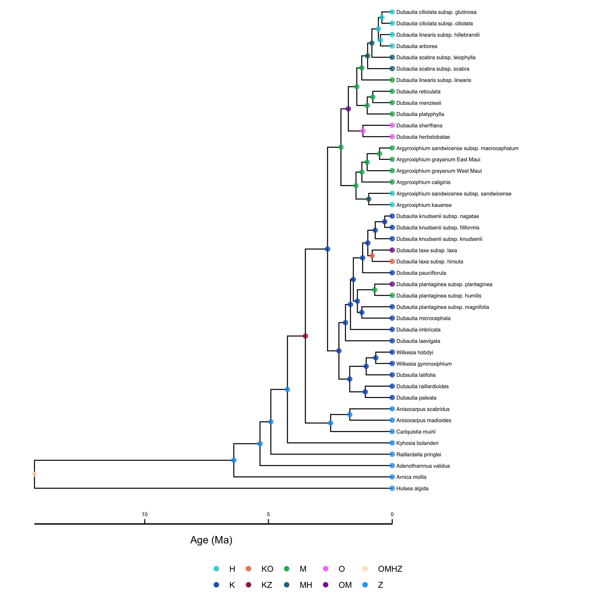



In the previous example, we saw how the MultiFIG model  allows us to test hypotheses about the relationships between certain environmental features and evolutionary processes using feature effect rates, as well as infer biogeographic event parameters and ancestral areas using GeoSSE. We used MultiFIG to investigate the evolution of the South American lizard genus *Liolaemus* based on species ranges, present-day regional features, and a time-calibrated phylogeny. However, we know that regional features change over time, and this may impact our ancestral state reconstructions and estimates of feature/process relationships. For example, consider an island system where regions form and subside. Knowing whether regions exist during a particular time period should impact which states are possible during this time period (ranges including absent regions should be disallowed). This should have an effect on our ancestral state reconstructions. As another example, consider a region that was very small for most of its history, with high extinction rates because of its small size (a negative area/extinction relationship). If the region recently became large, and we don't include any information about the region's history, we might infer the opposite relationship between size and extinction! The TimeFIG model (CITATION TBD) addresses the time-heterogeneity of regional features using "time slices" (discrete time periods), allowing regional features to have different values during each time slice, while assuming the relationships between features and processes remain constant.

In this tutorial, we will model the evolution and biogeography of Hawaiian Silverswords using six regions, four regional features, and five time slices. We will also jointly estimate divergence times (using molecular data), which will allow information about the geological history of the Hawaiian archipelago to inform the dates of cladogenetic events.



Island archipelagos are ideal microcosms for studying biogeographic patterns of dispersal, speciation, and extinction. Among islands, the Hawaiian archipelago holds particular value for biogeographers in part because of its unique paleogeography.  Each  island in the Hawaiian "chain" is produced through volcanic eruption from a hotspot in the mid pacific and then moves northwest along a tectonic assembly line during which  subsidence and erosion case gradual decay. Thus, the hawaiian chain acts as a geological time-capsule, with hundreds of progressively older, more eroded islands stretching northwest towards the arctic. The vast majority of Hawaiian biodiversity is concentrated within four larger, younger high island systems of varying age, Kauai (~ 6.15 MYA), Oahu (~ 4.135 MYA), Maui Nui(~ 2.55 MYA), and Hawaii(~ 1.20 MYA). 
The age and origin of the many independent radiation of plants, animals, and fungi that have occurred in hawaii has been a perennial topic of evolutionary studies. One hypothesis that has been difficult to test concerns the age of onset of endemic hawaiian evolutionary radiations. The extreme isolation of the Hawaiian islands makes colonization from distant sources highly improbably, but various biogeographers have hypothesized that the now eroded northwest islands could have provided a landing pad for such lineages that is much older, making dispersal more likely, followed by dispersal to and subsequent radiation in the modern high islands.
The Hawaiian archipelago is a system in which phylogenetic models of historical biogeography will produce much more accurate reconstructions if they incorporate change over time in paleogeography than if change in island feature is ignored. In this tutorial, we apply a TimeFIG model to an endemic hawaiian plant lineage, the silversword alliance (~34 spp.) to infer paleogeographically-informed parameter estimates for biogeographic event rates, effect rates of regional features, and ancestral areas. We also relax the assumption that our input phylogeny is a fully time-calibrated phylogeny, and use "a relaxed rock" approach to update divergence time estimates among silversword taxa. This last bit allows us to test the hypothesis that silverswords colonized older northwest islands before dispersing into, and radiating in the modern high island chain. 




The 4 regional features investigated in this analysis and the 8 associated parameters relating these features to core biogeographic processes.






The analysis utilizes 5 different time slices, numbered starting from the present. These time slices are delimited by 4 historical time points: T1, T2, T3, and T4. Distributions may be assigned to these time points to account for uncertainty.





> ## Important version info!!
> This tutorial is the one of a series of lessons explaining how to build increasingly powerful but computationally demanding GeoSSE-type models for biogeographic analyses. Inference under these models is powered by the Tensorphylo plugin for RevBayes, located here: [bitbucket.org/mrmay/tensorphylo/src/master](https://bitbucket.org/mrmay/tensorphylo/src/master/) .
> This tutorial, and following tutorials for GeoSSE-type models, will also require a development version of RevBayes built from the `hawaii_fix` branch (this message will be removed when the branch is merged).
> As an alternative to building the development version of RevBayes and installing Tensorphylo, you can instead use the RevBayes Docker image, which comes pre-configured with Tensorphylo enabled. The RevBayes Docker tutorial is located here: [revbayes.github.io/tutorials/docker](https://revbayes.github.io/tutorials/docker.html).
{:.info}

Running a TimeFIG analysis in RevBayes requires several important data files, including a file representing a phylogeny and a biogeographic data matrix describing the ranges for each species. `silversword.mcc.tre` is a phylogeny of the Hawaiian Silverswords. It is a dated tree (and we will use it to initialize our MCMC), but we will estimate new divergence times in this analysis using the molecular data in `silversword.mol.nex`. `silversword.range.nex` assigns ranges to each species for a six-region system: Kauai, Oahu, Maui Nui, Hawaii, and an outgroup region. For each species (row) and region (column), the file reports if the species is present (1) or absent (0) in that region. There are also feature files that contain regional feature data, a `feature_summary.csv` file that describes all the regional feature files (where they are found and what kind of data they contain), and an `age_summary.csv` file that gives prior distributions for the times that delimit our discrete time slices.

If you prefer to run a single script instead of entering each command manually, the RevBayes script called `timefig.Rev` contains all of the commands that are used in the tutorial. There is also an R script for plotting the analysis results. The data and script can be found in the `Data files and scripts` box in the left sidebar of the tutorial page. Somewhere on your computer, you should create a directory (folder) for this tutorial. Inside the tutorial directory, you should create a `scripts` directory. This is the directory where you will run RevBayes commands, or where you will put the `timefig.Rev` and `timefig.R` scripts. Then, you should create a `data` directory inside the tutorial directory. The scripts/commands for the tutorial expect that the primary data files (`silversword.mcc.tre`, `silversword.mol.nex`, `silversword.ranges.nex`, `feature_summary.csv`, and `age_summary.csv`) will be in this directory, while the feature files (the data, not the summary file) will be in a subdirectory called `features`. However, you can always modify the filepaths to locate the data wherever you choose to download it.





After starting up RevBayes from within your local `scripts` directory, you can load the TensorPhylo plugin. You will need to know where you downloaded the plugin. For example, if you cloned the TensorPhylo directory into your home directory at `~/tensorphylo`, you would use the following command to load the plugin:

```
loadPlugin("TensorPhylo", "~/tensorphylo/build/installer/lib")
```

Note that if you're using the RevBayes Docker image, then the Tensorphylo plugin is installed in the `/` (root) directory:

```
loadPlugin("TensorPhylo", "/tensorphylo/build/installer/lib")
```

It is also a good idea to set a seed. If you want to exactly replicate the results of the tutorial, you should use the seed `1`.

```
seed(1)
```

We also want to tell RevBayes where to find our data (and where to save our output later). If you have set up your tutorial directory in a different way than suggested, you will need to modify the filepaths.

```
fp         = "../"
dat_fp     = fp + "data/"
out_fp     = fp + "output/"
mol_fn     = dat_fp + "silversword.mol.nex"
bg_fn      = dat_fp + "silversword.range.nex"
phy_fn     = dat_fp + "silversword.mcc.tre"
feature_fn = dat_fp + "feature_summary.csv"
age_fn     = dat_fp + "age_summary.csv"
```



Now, we will start reading in data and constructing the TimeFIG model. Let's start by loading the phylogenetic tree.

```
phy <- readTrees(phy_fn)[1]
```

In order to set up our analysis, we will want to know some information about this tree: the root age, the taxa, the number of taxa, and the number of branches.

```
tree_height  <- phy.rootAge()
taxa         = phy.taxa()
num_taxa     = taxa.size()
num_branches = 2 * num_taxa - 2
```

Next, we will read in the molecular data, and calculate the number of sites. For this analysis, we are only using a single locus, but it can be performed with multiple loci.

```
dat_mol   = readDiscreteCharacterData(mol_fn)
num_sites = dat_mol.nchar()
```

We also want to read in the biogeographic data. First, we'll read the age file that tells us how many time slices to include (5) and what times delimit those slices (1.20 MYA, 2.55 MYA, 4.135 MYA, and 6.15 MYA). Note that for $n$ times, there will be $n+1$ time slices. The `age_summary.csv` file also includes information that would help establish a uniform prior on each of these times (`start_age` and `end_age`), but we will be using the `mean_age` without setting a prior (no uncertainty).

```
times_dat   = readDataDelimitedFile(age_fn, delimiter=",", header=true)
num_times   = times_dat.size() + 1
for (i in 1:(num_times-1)) times[i] <- times_dat[i][2]
```

Next, we will read in the region data.

```
bg_01 = readDiscreteCharacterData(bg_fn)
```

We want to get some information about this range data: how many regions there are, how many ranges can be constructed from these regions, and how many region pairs there are.

```
num_regions = bg_01.nchar()
num_ranges  = abs(2^num_regions - 1)
num_pairs   = num_regions^2 - num_regions
```

We want to format the range data to be used in a GeoSSE-type analysis. This will take the binary range data and output integer states.

```
bg_dat = formatDiscreteCharacterData(bg_01, format="GeoSSE", numStates=num_ranges)
```

We also want to get our feature data. Using the RevBayes function `readRegionalFeatures`, we can look at the `feature_summary.csv` file and automatically look for feature data. The `feature_summary.csv` file is specially formated to be read by RevBayes, consisting of 5 columns. The first column is `time_index`, telling us which time slice the feature data corresponds to. Time slices are numbered from the present starting with 1. The second column is `feature_index`. Each feature type (within-region categorical, within-region quantitative, between-region categorical, and between-region quantitative) has a container that can contain several features, so we want to index the features within those containers. In this analysis, we will only have one feature of each type, so the index will always be 1. The third column is `feature_relationship`. This column is for indicating whether the feature is a within-region feature or a between-region feature, with options 'within' or 'between'. The fourth column is `feature_type`, for indicating whether the feature is quantitative of categorical. Finally, the fifth column is `feature_path`, which gives a filepath for the actual file containing the data for that feature.

```
geo_features <- readRegionalFeatures(feature_fn, delimiter=",",nonexistent_region_token="nan")
```

Next, we transform the feature data into feature layers, a RevBayes object that we will use later for informing our biogeographic rates. First, we normalize the features (important for scaling reasons). Then, for each time slice `[i]`, we pull each feature type out of our `geo_features` object and create the layers.

```
geo_features.normalize("within")
geo_features.normalize("between")
for (i in 1:num_times) {
    feature_CW[i] <- geo_features.get("within","categorical",i)
    feature_QW[i] <- geo_features.get("within","quantitative",i)
    feature_CB[i] <- geo_features.get("between","categorical",i)
    feature_QB[i] <- geo_features.get("between","quantitative",i)
    for (j in 1:feature_CW[i].size()) {layer_CW[i][j] <- feature_CW[i][j].get()}
    for (j in 1:feature_QW[i].size()) {layer_QW[i][j] <- feature_QW[i][j].get()}
    for (j in 1:feature_CB[i].size()) {layer_CB[i][j] <- feature_CB[i][j].get()}
    for (j in 1:feature_QB[i].size()) {layer_QB[i][j] <- feature_QB[i][j].get()}}
```



In the TimeFIG model, there are four processes: within-region speciation, extinction, between-region speciation, and dispersal. Rates per region or region pair for each time slice are calculated using feature data, feature effect parameters, and base rate parameters. We will set the prior on base rate parameters to the exponential distribution `dnExp(1)`. We will set the prior on feature effect parameters to the normal distribution `dnNormal(0,1)`. Then we will use the RevBayes function `fnFeatureInformedRates` to combine the feature data and feature effect parameters to create $m$ vectors/matrices for each time slice, representing relative rates per region or region pair. Finally, we will multiply $m$ by the base rate parameter to get model rates $r_w$, $r_e$, $r_b$, and $r_d$ for each time slice.

Let's start by creating distributions that we will use for all $\rho$, $\phi$, and $\sigma$ parameters.

```
sigma_dist  = dnNormal(0,1)
phi_dist    = dnNormal(0,1)
rho_dist    = dnExp(1)
```

Now we will set up our rates for the four core processes. We will set up within-region speciation rates first. We won't worry about multiplying $m_w$ by the base rate yet, because the `fnBiogeographyCladoEventsBD` function will do this later. Note that while `m_w` has different values for each time slice, the `rho_w`, `sigma_w`, and `phi_w` parameters associated with each feature are the same for all time slices; only the feature data changes.

```
rho_w ~ rho_dist
for (i in 1:feature_CW[1].size()) sigma_w[i] ~ sigma_dist
for (i in 1:feature_QW[1].size()) phi_w[i] ~ phi_dist
for (i in 1:num_times) m_w[i] := fnFeatureInformedRates(layer_CW[i], layer_QW[i], sigma_w, phi_w, null_rate=0)
```

Extinction rates are set up similarly, and we will incorporate $\rho$ this time. From these extinction rates (which are actually single-region extinction rates), we will set up global extinction rates for each possible range in the state space. In the TimeFIG model, lineage-level extincion events occur when a species goes globally extinct (i.e. it loses the last region from its range). Therefore, we will assign all multi-region ranges an extinction rate of 0, and we will assign all single-region ranges an extinction rate equal to the local extirpation rate. Note, ranges are numbered such that indices `1`, `2`, through `num_regions` correspond to ranges that respectively contain only region 1, region 2, up through the last region in the system. Similar to within-region speciation rates, we will construct a different `m_e` and `r_e` vector for each time slice, but the `rho_e`, `simga_e`, and `phi_e` parameters are shared among time slices.

```
rho_e ~ rho_dist
for (i in 1:feature_CW[1].size()) sigma_e[i] ~ sigma_dist
for (i in 1:feature_QW[1].size()) phi_e[i] ~ phi_dist
for (i in 1:num_times) m_e[i] := fnFeatureInformedRates(layer_CW[i], layer_QW[i], sigma_e, phi_e, null_rate=1e3)
for (i in 1:num_times) r_e[i] := rho_e * m_e[i][1]
for (i in 1:num_times) {
    for (j in 1:num_ranges) {
        mu[i][j] <- abs(0)
        if (j <= num_regions) mu[i][j] := r_e[i][j]}}
```

Between-region speciation rates are set up similarly. Again, we do not need to incorporate $\rho$ yet. We also don't have to worry about incorporating range split score; RevBayes will do this automatically when we create the cladogenetic probability matrix.

```
rho_b ~ rho_dist
for (i in 1:feature_CB[1].size()) sigma_b[i] ~ sigma_dist
for (i in 1:feature_QB[1].size()) phi_b[i] ~ phi_dist
for (i in 1:num_times) m_b[i] := fnFeatureInformedRates(layer_CB[i], layer_QB[i], sigma_b, phi_b, null_rate=1)
```

Finally, for dispersal rates, we will set up dispersal rates.

```
rho_d ~ rho_dist
for (i in 1:feature_CB[1].size()) sigma_d[i] ~ sigma_dist
for (i in 1:feature_QB[1].size()) phi_d[i] ~ phi_dist
for (i in 1:num_times) m_d[i] := fnFeatureInformedRates(layer_CB[i], layer_QB[i], sigma_d, phi_d, null_rate=0)
for (i in 1:num_times) {
    for (j in 1:num_regions) {r_d[i][j] := rho_d * m_d[i][j]}}
```

From these rates, we can use RevBayes functions to construct the rate matrices used by the analysis. Importantly, these rate matrices are different for each time slice, and this is how RevBayes knows to use different rates during different discrete periods of time. First are the anagenetic rate matrices, which give rates of anagenetic processes. We are not restricting the number of regions that a species can live in at any given time, so we set the `maxRangeSize` equal to the number of regions. Settings `maxRangeSize` may be used to reduce the number of range patterns in the model, particularly when `num_regions` is large.

```
for (i in 1:num_times) {
    Q_bg[i] := fnBiogeographyRateMatrix(
        dispersalRates=r_d[i],
        extirpationRates=r_e[i],
        maxRangeSize=num_regions)}
```

We also construct cladogenetic event matrices, describing the absolute rates of different cladogenetic events. We are not restricting the sizes of 'split' subranges following between-region speciation, so we set the `max_subrange_split_size` equal to the number of regions. From these matrices, we can obtain the total speciation rates per state during each time slice, as well as a cladogenetic probability matrices for each time slice.

```
for (i in 1:num_times) {
    clado_map[i] := fnBiogeographyCladoEventsBD(
        speciation_rates=[ rho_w, rho_b ],
        within_region_features=m_w[i][1],
        between_region_features=m_b[i],
        max_range_size=num_regions,
        max_subrange_split_size=num_regions)
    lambda[i] := clado_map[i].getSpeciationRateSumPerState()
    omega[i]  := clado_map[i].getCladogeneticProbabilityMatrix()}
```

Lastly, we need to assign a probability distribution to range of the most recent common ancestor of all species, prior to the first speciation event. In this analysis, we will assume all ranges were equally likely for that ancestor.

```
pi_bg_prior <- rep(1,num_ranges)
pi_bg       <- simplex(pi_bg_prior)
```

With all of the rates constructed, we can create a stochastic variable drawn from this TimeFIG model with state-dependent birth, death, and speciation processes. This establishes how the various processes interact to generate a tree with a topology, divergence times, and terminal taxon states (ranges). Then we can clamp the variable with the present-day range states, allowing us to infer model parameters based on our observed data. Since we plan to jointly estimate divergence times, we will set a prior on the root age of the tree. The tree that we are using to initialize the analysis (and fix the topology) already has suggested dates, so we will assign a uniform prior centered on the suggested root age.

```
root_age ~ dnUniform(tree_height-10, tree_height+10)
timetree ~ dnGLHBDSP(
    rootAge     = tree_height,
    lambda      = lambda,
    mu          = mu,
    eta         = Q_bg,
    omega       = omega,
    lambdaTimes = times,
    muTimes     = times,
    etaTimes    = times,
    omegaTimes  = times,
    pi          = pi_bg,
    rho         = 1,
    condition   = "time",
    taxa        = taxa,
    nStates     = num_ranges,
    nProc       = 4)
timetree.clampCharData(bg_dat)
```

We also want to set up a molecular model that describes how the molecular sequences evolve over our timetree. This will allow for divergence time estimation. There are many possible models of molecular evolution that you could define here (see [this tutorial](https://revbayes.github.io/tutorials/ctmc/) for some options), but we will use HKY+Gamma.

```
mu_mol_base ~ dnExp(10)
mu_mol_branch_rel ~ dnDirichlet(rep(2, num_branches))
mu_mol := mu_mol_base * mu_mol_branch_rel
kappa ~ dnGamma(2,2)
pi_mol ~ dnDirichlet( [1,1,1,1] )
Q_mol := fnHKY(kappa=kappa, baseFrequencies=pi_mol)
alpha ~ dnExp(0.1)
site_rates := fnDiscretizeGamma(shape=alpha, rate=alpha, numCats=4, median=true)
```

We can put these molecular model parameters together into one object using the RevBayes function `dnPhyloCTMC()`, which will associate this molecular model with our timetree.

```
x_mol ~ dnPhyloCTMC(
    Q=Q_mol,
    tree=timetree,
    branchRates=mu_mol,
    siteRates=site_rates,
    rootFrequencies=pi_mol,
    nSites=num_sites,
    type="DNA" )
```



To aid the initial likelihood computation, we will initialize some parameters before starting MCMC. This will not fix the parameter values, but will give the MCMC chain a "reasonable" place to start.

```
rho_w.setValue(0.1)
rho_e.setValue(0.1)
rho_b.setValue(0.1)
rho_d.setValue(0.1)
for (i in 1:sigma_w.size()) sigma_w[i].setValue(0.01)
for (i in 1:sigma_e.size()) sigma_e[i].setValue(0.01)
for (i in 1:sigma_b.size()) sigma_b[i].setValue(0.01)
for (i in 1:sigma_d.size()) sigma_d[i].setValue(0.01)
for (i in 1:phi_w.size()) phi_w[i].setValue(0.01)
for (i in 1:phi_e.size()) phi_e[i].setValue(0.01)
for (i in 1:phi_b.size()) phi_b[i].setValue(0.01)
for (i in 1:phi_d.size()) phi_d[i].setValue(0.01)
timetree.setValue(phy)
root_age.setValue(tree_height)
```

For this analysis, we will perform an MCMC of 1000 generations, with 100 generations of hyperparameter-tuning burnin. Despite being relatively short compared to a full analysis, **THIS WILL STILL TAKE A LONG TIME.** An analysis of this length may not achieve convergence, so these settings should only be used for testing purposes. You can alter this MCMC by changing the number of iterations, the length of the burnin period, or the move schedule. We will also set up the MCMC to record every 10 iterations.

```
n_gen    = 1000
n_burn   = n_gen/10
printgen = 10
```

We want MCMC to update our molecular branch rates and parameters. We will add simple scaling moves to many of the values, but we will use special moves for our simplexes. Some of these moves are given a higher `weight`, which indicates that they will be performed several times per iteration.

```
mvi = 1
mv[mvi++] = mvScale(mu_mol_base, weight=5)
mv[mvi++] = mvSimplex(mu_mol_branch_rel, numCats=1, alpha=3, kappa=1, weight=num_branches)
mv[mvi++] = mvSimplex(mu_mol_branch_rel, numCats=5, alpha=3, kappa=1, weight=num_branches)
mv[mvi++] = mvScale(kappa)
mv[mvi++] = mvScale(alpha)
mv[mvi++] = mvSimplex(pi_mol, alpha=3)
```

We also want MCMC to update all of the base rate $\rho$ parameters, as well as the $\sigma$ and $\phi$ parameters. We will use a scaling move for the base rates, since they should always have positive values. We will use a sliding move for the feature effect parameters, since they can have positive or negative values.

```
mv[mvi++] = mvScale(rho_w)
mv[mvi++] = mvScale(rho_e)
mv[mvi++] = mvScale(rho_b)
mv[mvi++] = mvScale(rho_d)
for (i in 1:sigma_d.size()) {mv[mvi++] = mvSlide(sigma_d[i])}
for (i in 1:sigma_b.size()) {mv[mvi++] = mvSlide(sigma_b[i])}
for (i in 1:sigma_e.size()) {mv[mvi++] = mvSlide(sigma_e[i])}
for (i in 1:sigma_w.size()) {mv[mvi++] = mvSlide(sigma_w[i])}
for (i in 1:phi_d.size()) {mv[mvi++] = mvSlide(phi_d[i])}
for (i in 1:phi_b.size()) {mv[mvi++] = mvSlide(phi_b[i])}
for (i in 1:phi_e.size()) {mv[mvi++] = mvSlide(phi_e[i])}
for (i in 1:phi_w.size()) {mv[mvi++] = mvSlide(phi_w[i])}
```

Finally, we will add a couple of tree moves to update the root age and node ages.

```
mv[mvi++] = mvScale(root_age, weight=5)
mv[mvi++] = mvNodeTimeSlideUniform(timetree, weight=5)
```

We also want MCMC to keep track of certain things while it runs. We want it to print some output to the screen so we can see how it is running (`mnScreen`). We also want it to save model parameters to a file (`mnModel`). Finally, if we want to use the output for ancestral state reconstruction, we want to save states and stochastic character mappings (`mnJointConditionalAncestralStates` and `mnStochasticCharacterMap`). All of the output files will be saved in the `output` directory so that it can be accessed later.

```
mni = 1
mn[mni++] = mnScreen(printgen=1)
mn[mni++] = mnModel(printgen=printgen, filename=out_fp+"model.log")
mn[mni++] = mnJointConditionalAncestralState(glhbdsp=timetree, tree=timetree, printgen=printgen, filename=out_fp+"states.log", withTips=true, withStartStates=true, type="NaturalNumbers")
mn[mni++] = mnStochasticCharacterMap(glhbdsp=timetree, printgen=printgen, filename=out_fp+"stoch.log")
mn[mni++] = mnFile(timetree, printgen=printgen, filename=out_fp+"trace.tre")
```

Then we can start up the MCMC. It doesn't matter which model parameter you use to initialize the model, so we will use m_w. RevBayes will find all the other parameters that are connected to m_w and include them in the model as well. Then we create an MCMC object with the moves, monitors, and model, add burnin, and run the MCMC.

```
mdl = model(m_w)
ch = mcmc(mv, mn, mdl)
ch.burnin(n_burn, tuningInterval=10)
ch.run(n_gen)
```

After the MCMC analysis has concluded, we can create a maximum clade credibility (MCC) tree based on our posterior set of trees (the tree trace). We can then summarize the ancestral states we obtained and map them onto the MCC tree, creating an ancestral state tree. This tree will be written to the file `ase.tre `. It may take a little while. We can also summarize our stochastic mapping, creating the `events.log` file.

```
tree_trace = readTreeTrace(file=out_fp+"trace.tre", treetype="clock", burnin=0.1)
mcc_tree = mccTree(tree_trace, file=out_fp+"mcc.tre")
state_trace = readAncestralStateTrace(file=out_fp+"states.log")
state_tree_trace = readAncestralStateTreeTrace(file=out_fp+"trace.tre", treetype="clock")

state_tree = ancestralStateTree(tree=mcc_tree,
                                tree_trace=state_tree_trace,
                                ancestral_state_trace_vector=state_trace,
                                include_start_states=true,
                                file=out_fp+"ase.tre",
                                summary_statistic="MAP",
                                burnin=0.1)

stoch = readAncestralStateTrace(file=out_fp+"stoch.log")
summarizeCharacterMaps(stoch,mcc_tree,file=out_fp+"events.tsv",burnin=0.1)
```



One interesting thing we can do with the output of the TimeFIG analysis is plot the time-calibrated tree with ancestral states. This can be done using RevGadgets, an R packages that processes RevBayes output. You can use R to generate a tree with ancestral states by running the `timefig.R` script, or by executing the following code in R. Before plotting the ancestral state tree, we create two vectors. The vector `labels` is useful because it maps actual region labels onto state numbers, so the legend can be easily interpreted. If you used your own data, you would have to provide your own state labels.

```
library(RevGadgets)
library(ggplot2)

tree_file = "../output/ase.tre"
states_file = "../figures/states.png"

labels <- c("0" = "R","1" = "K","2" = "O","3" = "M","4" = "H","5" = "Z","6" = "RK","7" = "RO","8" = "KO","9" = "RM","10" = "KM","11" = "OM","12" = "RH","13" = "KH","14" = "OH","15" = "MH","16" = "RZ","17" = "KZ","18" = "OZ","19" = "MZ","20" = "HZ","21" = "RKO","22" = "RKM","23" = "ROM","24" = "KOM","25" = "RKH","26" = "ROH","27" = "KOH","28" = "RMH","29" = "KMH","30" = "OMH","31" = "RKZ","32" = "ROZ","33" = "KOZ","34" = "RMZ","35" = "KMZ","36" = "OMZ","37" = "RHZ","38" = "KHZ","39" = "OHZ","40" = "MHZ","41" = "RKOM","42" = "RKOH","43" = "RKMH","44" = "ROMH","45" = "KOMH","46" = "RKOZ","47" = "RKMZ","48" = "ROMZ","49" = "KOMZ","50" = "RKHZ","51" = "ROHZ","52" = "KOHZ","53" = "RMHZ","54" = "KMHZ","55" = "OMHZ","56" = "RKOMH","57" = "RKOMZ","58" = "RKOHZ","59" = "RKMHZ","60" = "ROMHZ","61" = "KOMHZ","62" = "RKOMHZ")

states <- processAncStates(tree_file, state_labels=labels)
plotAncStatesMAP(t=states,
                 timeline=T,
                 geo=F,
                 time_bars=F,
                 node_size=2,
                 node_color_as="state",
                 node_size_as=NULL,
                 tip_labels_offset=0.1) +
                 ggplot2::theme(legend.position="bottom",
                                legend.title=element_blank())
ggsave(output_file, width = 9, height = 9)
```




Ancestral state reconstruction of Hawaiian Silverswords. Nodes are colored based on the range with the highest probability. Range labels represents sets of regions (R = northwest islands, K = Kauai, O = Oahu, M = Maui Nui, H = Hawaii, Z = outgroup region).



As we can see from the figure above, we do not find evidence that the silverswords dipsersed first to now eroded northwest island before colonizing and radiating in Kauai. 

