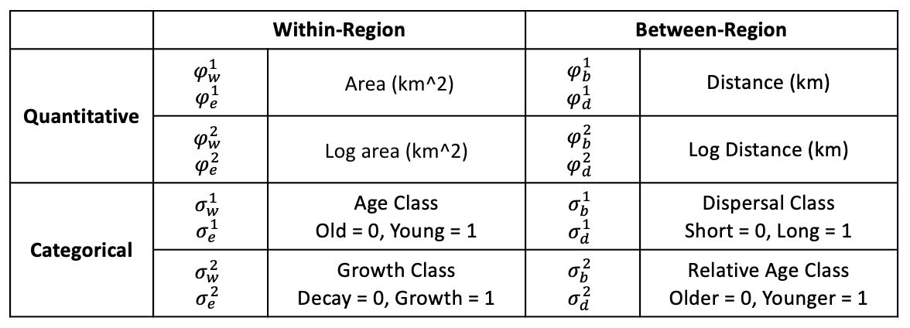
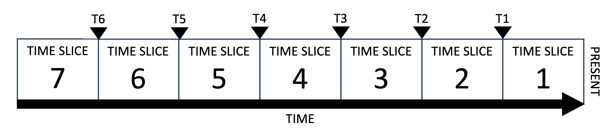
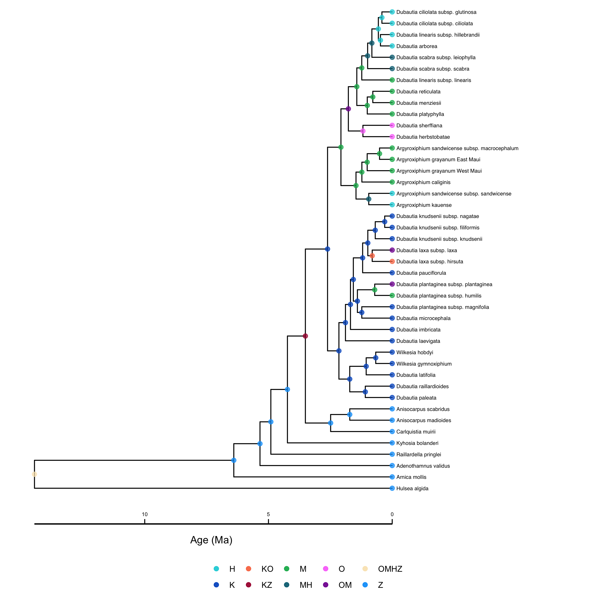





In the previous tutorial, we saw how the MultiFIG model  allows us to test hypotheses about the relationships between certain environmental features and evolutionary processes using feature effect rates, as well as infer biogeographic event parameters and ancestral areas. We used MultiFIG to investigate the Hawaiian radiation of the plant genus *Kadua* based on species ranges, present-day features of islands, and a time-calibrated phylogeny.

However, we know that regional features change over time, and this may impact our ancestral state reconstructions and estimates of feature/process relationships. The TimeFIG model addresses the time-heterogeneity of regional features using "time slices" (discrete time periods), allowing regional features to have different values during each time slice, while assuming the relationships between features and processes remain constant.

In this tutorial, we will model the evolution and biogeography of *Kadua* using seven regions, eight regional features, and seven time slices.



The Hawaiian archipelago is a system in which phylogenetic models of historical biogeography will produce much more accurate reconstructions if they incorporate change over time in paleogeography than if change in island feature is ignored. In this tutorial, we apply a TimeFIG model to the Hawaiian radiation of *Kadua* (26 spp. including mainland outgoups) to infer paleogeographically-informed parameter estimates for biogeographic event rates, effect rates of regional features, and ancestral areas.




We will use the same features for the TimeFIG analysis that we used in the MultiFIG analysis. For reference, here are the 8 regional features and the 16 associated parameters relating these features to core biogeographic processes.






The analysis utilizes 7 different time slices, numbered starting from the present. These time slices are delimited by 6 historical time points: T1, T2, T3, etc. Distributions may be assigned to these time points to account for uncertainty.





> ## Important version info!
> **Note:** This tutorial currently requires specific versions of [RevBayes](https://github.com/revbayes/revbayes/commit/55c8174ea696fbd580daad8383d58f7ffd444d43) and [TensorPhylo](https://bitbucket.org/mrmay/tensorphylo/commits/daa0aed2c4acd394e2cb098b1c3706633d5b8301) to run properly (see linked branches and commits).
>
> We recommend that you complete the tutorial using a [PhyloDocker](https://hub.docker.com/r/sswiston/phylo_docker) container, which is pre-configured with the above versions of RevBayes and TensorPhylo. Instructions to install and use PhyloDocker are here: [link](https://revbayes.github.io/tutorials/docker.html).
{:.info}

Running a TimeFIG analysis in RevBayes requires several important data files, including a file representing the time-calibrated phylogeny and a biogeographic data matrix describing the ranges for each species. `kadua.tre` is a time-calibrated phylogeny of *Kadua*. `kadua_range_n7.nex` assigns ranges to each species for a seven-region system: G (Gardner), N (Necker), K (Kauaii), O (Oahu), M (Maui Nui Complex), H (Hawaii), and Z (mainland). For each species (row) and region (column), the file reports if the species is present (1) or absent (0) in that region. There are also feature files that contain regional feature data, a `feature_summary.csv` file that describes all the regional feature files (where they are found and what kind of data they contain), and an `age_summary.csv` file that tells us what ages delimit the time slices for our analysis.

If you prefer to run a single script instead of entering each command manually, the RevBayes script called `timefig.Rev` contains all of the commands that are used in the tutorial. The data and script can be found in the `Data files and scripts` box in the left sidebar of the tutorial page. Note that for this tutorial, the data files are not individually visible (there are a LOT of them). Instead, a `timefig_simple_project.zip` file is provided. Downloading and unzipping this file will give you a directory containing all of the scripts and data files for the tutorial, set up the way the tutorial expects. This main directory is where you will run RevBayes commands.

Inside the tutorial directory, there will be a `scripts` directory. This is the directory where the `timefig.Rev` script lives. There is also a `data` directory inside the tutorial directory. Within `data`, there will be two more directories: `hawaii`, and `kadua`. The data files related to *Kadua* (`kadua.tre` and `kadua_range_n7.nex`) are in the `kadua` directory. The data related to Hawaii, including the `feature_summary.csv` file, the `age_summary.csv` file, the `feature_description.csv` file, and all feature-related `*_feature*.csv` files are in the `hawaii` directory. However, you can always modify the filepaths to locate the data wherever you choose to download it.





After starting up RevBayes from within your main tutorial directory, you can load the TensorPhylo plugin. You will need to know where you downloaded the plugin. For example, if you cloned the TensorPhylo directory into your home directory at `~/tensorphylo`, you would use the following command to load the plugin:

```
loadPlugin("TensorPhylo", "~/tensorphylo/build/installer/lib")
```

Note that if you're using the PhyloDocker image, then the Tensorphylo plugin is installed in `/.plugins`, where RevBayes is able to find it without including a filepath:

```
loadPlugin("TensorPhylo")
```

Next, we want to tell RevBayes where to find our data (and where to save our output later). If you have set up your tutorial directory in a different way than suggested, you will need to modify the filepaths.

```
# filesystem
analysis      = "simple_timeFIG"
dat_fp        = "./data/kadua/"
phy_fn        = dat_fp + "kadua.tre"
bg_fn         = dat_fp + "kadua_range_n7.nex"
geo_fp        = "./data/hawaii/"
feature_fn    = geo_fp + "feature_summary.csv"
times_fn      = geo_fp + "age_summary.csv"
out_fn        = "./output/" + analysis
```

Similar to the MultiFIG analysis, we will set up containers `moves` and `monitors` at the beginning of the script, and choose some MCMC settings for later: the number of computer processors to use, the number of generations we want to run the analysis for, and how often we want RevBayes to record output.

```
# MCMC variables
num_proc  = 6
num_gen   = 10000
print_gen = 1
moves     = VectorMoves()
monitors  = VectorMonitors()
```



Now, we will start reading in data and constructing the TimeFIG model. Let's start by loading the phylogenetic tree.

```
phy <- readTrees(phy_fn)[1]
```

In order to set up our analysis, we will want to know some information about this tree: the taxa, the number of taxa, and the number of branches.

```
taxa         = phy.taxa()
num_taxa     = taxa.size()
num_branches = 2 * num_taxa - 2
```

We also want to read in the range data. This is the same data from the MultiFIG example.

```
dat_01 = readDiscreteCharacterData(bg_fn)
```

Once again, we want to get some information about this range data: how many regions there are, and how many ranges can be constructed from these regions. We will still set our maximum range size to 4.

```
num_regions    = dat_01.nchar()
max_range_size = 4
num_ranges     = 0
for (k in 1:max_range_size) {
    num_ranges += choose(num_regions, k)
}
```

Again, we want to format the range data to be used in a GeoSSE-type analysis. This will take the binary range data and output integer states.

```
dat_nn         = formatDiscreteCharacterData(dat_01, format="GeoSSE", numStates=num_ranges)
desc           = dat_nn.getStateDescriptions()

write("index,range\n", filename=label_fn)
for (i in 1:desc.size()) {
    write((i-1) + "," + desc[i] + "\n", filename=label_fn, append=true)
}
```

We also want to read in the biogeographic data. First, we'll read the age file that tells us how many time slices to include and what times delimit those slices. Note that for $n$ times, there will be $n+1$ time slices. The `age_summary.csv` file also includes information that would help establish a uniform prior on each of these times (`start_age` and `end_age`), but we will be using the `mean_age` without setting a prior (no uncertainty).

```
times_table = readDataDelimitedFile(times_fn, delimiter=",", header=true)
num_times <- times_table.size() + 1
for (i in 1:(num_times-1)) { times[i] <- times_table[i][2] }
```

We also want to get our feature data. Using the RevBayes function `readRegionalFeatures`, we can look at the `feature_summary.csv` file and automatically look for feature data. The `feature_summary.csv` file is specially formated to be read by RevBayes, consisting of 5 columns. The first column is `time_index`, telling us which time slice the feature data corresponds to. Time slices are numbered from the present starting with 1. The second column is `feature_index`. Each feature type (within-region categorical, within-region quantitative, between-region categorical, and between-region quantitative) has a container that can contain several features, so we want to index the features within those containers. In this analysis, we will only have one feature of each type, so the index will always be 1. The third column is `feature_relationship`. This column is for indicating whether the feature is a within-region feature or a between-region feature, with options 'within' or 'between'. The fourth column is `feature_type`, for indicating whether the feature is quantitative of categorical. Finally, the fifth column is `feature_path`, which gives a filepath for the actual file containing the data for that feature.

```
geo_features <- readRegionalFeatures(feature_fn, delimiter=",", nonexistent_region_token="nan")
```

Next, we transform the feature data into feature layers, a RevBayes object that we will use later for informing our biogeographic rates. First, we normalize the features (important for scaling reasons). Then, for each time slice `[i]`, we pull each feature type out of our `geo_features` object and create the layers.

```
geo_features.normalize("within")
geo_features.normalize("between")

# get feature-sets for each measurement-type, process-type, and timeslice
for (i in 1:num_times) {
	feature_CW[i] <- geo_features.get("within","categorical",i)
	feature_QW[i] <- geo_features.get("within","quantitative",i)
	feature_CB[i] <- geo_features.get("between","categorical",i)
	feature_QB[i] <- geo_features.get("between","quantitative",i)

    for (j in 1:feature_CW[i].size()) {
        layer_CW[i][j] <- feature_CW[i][j].get()
    }
    for (j in 1:feature_QW[i].size()) {
        layer_QW[i][j] <- feature_QW[i][j].get()
    }
    for (j in 1:feature_CB[i].size()) {
        layer_CB[i][j] <- feature_CB[i][j].get()
    }
    for (j in 1:feature_QB[i].size()) {
        layer_QB[i][j] <- feature_QB[i][j].get()
    }
}
```



In the TimeFIG model, we use the same four processes as earlier models: within-region speciation, extinction, between-region speciation, and dispersal. Rates per region or region pair are calculated the same way as in the MultiFIG model using feature data, feature effect parameters, and base rate parameters. However, unlike the MultiFIG model, our feature values change from epoch to epoch! Therefore, while we will use the same set of base rates and feature effect parameters for each time slice, our relative rates will end up being different between time slices.

First, we will set priors for the feature effect parameters. Then we will use the RevBayes function `fnFeatureInformedRates` to combine the feature data and feature effect parameters for each time slice to create $m$ vectors/matrices that are specific to the time slices, representing relative rates of a particular process per region or region pair during that time slice. Finally, we will multiply the $m$ for each process in each time slice by base rate parameters to get model rates $r_w$, $r_e$, $r_b$, and $r_d$ for each time slice.

Let's start by creating distributions that we will use for all $\phi$ and $\sigma$ parameters. We will use **reversible jump** distributions again. We also have to assign an `rj_prob` to the reversible jump distribution, which is the prior probability of RJMCMC using the fixed value 0 instead of the continuous distribution.

We will use the same bounds on our continuous distributions that we did for the MultiFIG model.

```
# set up priors for feature effects
rj_null_value <- 0.0          # fixed "off-value" for RJMCMC
rj_prob       <- 0.5          # prob. of RJMCMC taking "off-value"

# prior of "on-value" for RJMCMC
bound <- 2
rj_base_sym_dist = dnUniform(-bound, bound)
rj_base_neg_dist = dnUniform(-bound, 0)     # negative only (e.g. distance on dispersal)
rj_base_pos_dist = dnUniform(0, bound)      # positive only (e.g. distance on betw.-reg. speciation)
rj_sym_dist = dnRJMixture(rj_null_value, rj_base_sym_dist, p=rj_prob)
rj_neg_dist = dnRJMixture(rj_null_value, rj_base_neg_dist, p=rj_prob)
rj_pos_dist = dnRJMixture(rj_null_value, rj_base_pos_dist, p=rj_prob)

# categorical feature effects
for (i in 1:feature_CW[1].size()) sigma_w[i] ~ rj_sym_dist
for (i in 1:feature_CW[1].size()) sigma_e[i] ~ rj_sym_dist
for (i in 1:feature_CB[1].size()) sigma_d[i] ~ rj_sym_dist
for (i in 1:feature_CB[1].size()) sigma_b[i] ~ rj_sym_dist

# quantitative feature effects
for (i in 1:feature_QW[1].size()) phi_w[i] ~ rj_sym_dist
for (i in 1:feature_QW[1].size()) phi_e[i] ~ rj_sym_dist
for (i in 1:feature_QB[1].size()) phi_d[i] ~ rj_sym_dist
for (i in 1:feature_QB[1].size()) phi_b[i] ~ rj_sym_dist

# force signed relationships between region features and rates
# (overrides existing distribution assignments)
phi_b[1]   ~ rj_pos_dist   # Distance (km) results in faster speciation
phi_b[2]   ~ rj_pos_dist   # Log-distance (km) results in faster speciation
sigma_b[1] ~ rj_pos_dist   # LDD (1) results in faster speciation
sigma_w[1] ~ rj_pos_dist   # High Islands (1) drives faster speciation 
phi_d[1]   ~ rj_neg_dist   # Distance (km) results in slower dispersal
phi_d[2]   ~ rj_neg_dist   # Log-distance (km) results in slower dispersal
sigma_d[1] ~ rj_neg_dist   # LDD (1) results in slower dispersal
sigma_e[1] ~ rj_neg_dist   # High Islands (1) drives slower extinction
```

Now we can create the relative rates of each process. These $m$ containers hold the per-region or per-region-pair relative rates for each time slice. We will turn these into actual rates (incorporating a base rate parameter) later. Each of these relative rate containers also has a `null_rate` argument, which tells RevBayes what to do with missing regions. This is important because some regions did not exist during some times!

```
# regional rate factors
for (t in 1:num_times) {
    # NOTE: do not index [1] in RHS of assignment to drop "dummy" dimension for m_W and m_E!
	m_w[t] := fnFeatureInformedRates(layer_CW[t], layer_QW[t], sigma_w, phi_w, null_rate=0)
	m_e[t] := fnFeatureInformedRates(layer_CW[t], layer_QW[t], sigma_e, phi_e, null_rate=1e3)
	m_d[t] := fnFeatureInformedRates(layer_CB[t], layer_QB[t], sigma_d, phi_d, null_rate=0)
	m_b[t] := fnFeatureInformedRates(layer_CB[t], layer_QB[t], sigma_b, phi_b, null_rate=1)
}
```

Because we are going to do an MCMC analysis later in the tutorial, we want MCMC to update all of the $\sigma$ and $\phi$ parameters. Once again, we will add MCMC moves on these parameters. We may also want to initialize the MCMC to reasonable values for these feature effect parameters. We will set the values of our distributions to be (temporarily) equal to those initial values to start the MCMC.

First, we will address the categorical feature effects for each process (w, e, d, and b). These are our $\sigma$ parameters. The logic is the same for each process. First, we find the container of features which impact that process (within-region features for within-region speciation and extinction, between-region features for between-region speciation and dispersal). Then we loop over the different features inside that container. For each feature, we initialize the value of the parameter, and add appropriate moves for the MCMC. We also include a `use_` line that allows us to turn off certain features if we want to perform analyses without them. Note that we do not loop over the time slices here, because the feature effects are shared across times!

```
# initialize categorical feature effects, create moves, add monitor variables
for (i in 1:feature_CW[1].size()) {
    sigma_w[i].setValue(0)
    moves.append( mvScale(sigma_w[i], weight=2) )
    moves.append( mvSlide(sigma_w[i], weight=2) )
    moves.append( mvRJSwitch(sigma_w[i], weight=3) )
    use_sigma_w[i] := ifelse(sigma_w[i] == 0.0, 0, 1)
}
for (i in 1:feature_CW[1].size()) {
    sigma_e[i].setValue(0)
    moves.append( mvScale(sigma_e[i], weight=2) )
    moves.append( mvSlide(sigma_e[i], weight=2) )
    moves.append( mvRJSwitch(sigma_e[i], weight=3) )
    use_sigma_e[i] := ifelse(sigma_e[i] == 0.0, 0, 1)
}
for (i in 1:feature_CB[1].size()) {
    sigma_d[i].setValue(0)
    moves.append( mvScale(sigma_d[i], weight=2) )
    moves.append( mvSlide(sigma_d[i], weight=2) )
    moves.append( mvRJSwitch(sigma_d[i], weight=3) )
    use_sigma_d[i] := ifelse(sigma_d[i] == 0.0, 0, 1)
}
for (i in 1:feature_CB[1].size()) {
    sigma_b[i].setValue(0)
    moves.append( mvScale(sigma_b[i], weight=2) )
    moves.append( mvSlide(sigma_b[i], weight=2) )
    moves.append( mvRJSwitch(sigma_b[i], weight=3) )
    use_sigma_b[i] := ifelse(sigma_b[i] == 0.0, 0, 1)
}
```

Similarly, we will address the quantitative features for each process. These are our `\phi` parameters.

```
# initialize quantitative feature effects, create moves, add monitor variables
for (i in 1:feature_QW[1].size()) {
    phi_w[i].setValue(0)
    moves.append( mvScale(phi_w[i], weight=2) )
    moves.append( mvSlide(phi_w[i], weight=2) )
    moves.append( mvRJSwitch(phi_w[i], weight=3) )
    use_phi_w[i] := ifelse(phi_w[i] == 0.0, 0, 1)
}
for (i in 1:feature_QW[1].size()) {
    phi_e[i].setValue(0)
    moves.append( mvScale(phi_e[i], weight=2) )
    moves.append( mvSlide(phi_e[i], weight=2) )
    moves.append( mvRJSwitch(phi_e[i], weight=3) )
    use_phi_e[i] := ifelse(phi_e[i] == 0.0, 0, 1)
}
for (i in 1:feature_QB[1].size()) {
    phi_d[i].setValue(0)
    moves.append( mvScale(phi_d[i], weight=2) )
    moves.append( mvSlide(phi_d[i], weight=2) )
    moves.append( mvRJSwitch(phi_d[i], weight=3) )
    use_phi_d[i] := ifelse(phi_d[i] == 0.0, 0, 1)
}
for (i in 1:feature_QB[1].size()) {
    phi_b[i].setValue(0)
    moves.append( mvScale(phi_b[i], weight=2) )
    moves.append( mvSlide(phi_b[i], weight=2) )
    moves.append( mvRJSwitch(phi_b[i], weight=3) )
    use_phi_b[i] := ifelse(phi_b[i] == 0.0, 0, 1)
}
```

Now we will set up our rates for the four core processes, and put together our tree object. First, we will assign distributions to our base process rates, $\rho$. These rates are shared amongst all regions and all time slices, and are combined with relative rates $m$ to get true process rates in each region or pair for each time slice, $r$. We will use exponential distributions with rate 30 for each base rate parameter. Once again, we will initialize these values so MCMC will start in a reasonable place, and append the appropriate moves. We can also calculate the total speciation rate from the base rates of each type of speciation event.

```
# base rate parameters
rho_d ~ dnExp(40)
rho_e ~ dnExp(40)
rho_w ~ dnExp(40)
rho_b ~ dnExp(40)

rho_d.setValue(0.1)
rho_e.setValue(0.1)
rho_w.setValue(0.1)
rho_b.setValue(0.1)

moves.append( mvScale(rho_d, weight=5) )
moves.append( mvScale(rho_e, weight=5) )
moves.append( mvScale(rho_w, weight=5) )
moves.append( mvScale(rho_b, weight=5) )

# summarize base rates
speciation_rates := [ rho_w, rho_b ]
total_speciation := sum( speciation_rates )
```

Next, we will construct the total rates for each anagenetic process. Note how we loop over each time slice here; this is because total model rates, and the rate matrices obtained from them, are different during each time slice. Otherwise, this part is identical to the MultiFIG model.

```
for (k in 1:num_times) {
    
    # dispersal rate (region gain)
    for (i in 1:num_regions) {
        r_d[k][i] := rho_d * m_d[k][i]
    }

    # extirpation rate (region loss)
    r_e[k] := rho_e * m_e[k][1]

    # dispersal-extirpation rate matrix
    # - states are discrete ranges
    # - elements are rates of range expansion/contraction
    Q_bg[k] := fnBiogeographyRateMatrix(dispersalRates=r_d[k],
                                  extirpationRates=r_e[k],
                                  maxRangeSize=max_range_size)
}
```

We also construct a cladogenetic event matrix, describing the absolute rates of different cladogenetic events. From this matrix, we can obtain the total speciation rates per state, as well as a cladogenetic probability matrix. Once again, we loop over each time slice, because the total model rates and rate matrices obtained from them are different during each time slice. Otherwise, this part is identical to the MultiFIG model.

```
# speciation rate matrix
for (k in 1:num_times) {
    clado_map[k] := fnBiogeographyCladoEventsBD(speciation_rates=speciation_rates,
                                             within_region_features=m_w[k][1],
                                             between_region_features=m_b[k],
                                             max_range_size=max_range_size,
                                             normalize_split_score=false)
    # clado_map

    # speciation rates for each range
    lambda[k] := clado_map[k].getSpeciationRateSumPerState()

    # probabilities of speciation outcomes for each range
    omega[k] := clado_map[k].getCladogeneticProbabilityMatrix()

    # monitor variables for absolute speciation rates
    r_w[k] := rho_w * m_w[k][1]

    # NOTE: this rate only represents species with range size 2
    #       i.e., the inverse sum of inverse edge weights
    #       (relative rates in m_b[i][j]) is equal to the edge weight
    #       of a 2-region range
    for (i in 1:num_regions) {
        r_b[k][i] := rho_b * m_b[k][i]
    }
}
```

We may also want to monitor the absolute extinction rates. Because only lineages with a range of size 1 can go extinct, we will assign larger ranges an absolute extinction rate of 0. Again, we loop over the time slices.

```
for (k in 1:num_times) {
    # extinction rates (lineage death)
    for (i in 1:num_ranges) {
        if (i <= num_regions) {
            # species with range-size 1 can go extinct
            mu[k][i] := r_e[k][i]
        } else {
            # widespread species cannot
            mu[k][i] <- abs(0)
        }
    }
}
```

Next, we need to assign a probability distribution to range of the most recent common ancestor of all species, prior to the first speciation event. This will be a distribution (simplex) of possible range states that the ancestor might have had. Because some of the ranges are not possible (not all regions exist) when the lineage begins, we will assume that the ancestor started in the mainland.

```
# base frequencies
pi_bg_base <- rep(0, num_ranges)

# assume that the integer equal to "num_regions" is the
# range-integer for a species that occurs only in the
# mainland region, for base-indexing of 1 (Rev script).
# For example, region 7 is the non-Hawaiian region,
# set the range-integer for the range {7} to 1.
pi_allowed_ranges <- [ num_regions ]
for (i in 1:pi_allowed_ranges.size()) {
    j = pi_allowed_ranges[i]
    pi_bg_base[j] <- 1
}
pi_bg <- simplex(pi_bg_base)
```

We also need to set up the tip sampling probabilities based on state. In this analysis, the Hawaiian (ingroup) *Kadua* have been thoroughly sampled. However, we have only included 3 mainland (outgroup) samples, so we have to account for the low sampling here. Also, we will assign `rho_times` the value of 0, because we only sampled at the present (age =0)

```
n_total           <- 29 + 2 + 1
n_total_ingroup   <- 22 + 2
n_total_outgroup  <- n_total - n_total_ingroup
n_sample_ingroup  <- 24
n_sample_outgroup <- 3
rho_ingroup       <- Probability(n_sample_ingroup/n_total_ingroup) 
rho_outgroup      <- Probability(n_sample_outgroup/n_total_outgroup)
rho_poorly_sampled_ranges <- [ 7 ]
for (i in 1:num_ranges) {
    rho_sample[1][i] <- rho_ingroup
}
for (i in rho_poorly_sampled_ranges) {
    rho_sample[1][i] <- rho_outgroup
}
rho_times <- [ 0.0 ]
```

Before getting to the tree object, we want to make the root age of the tree object equal to the height of the input phylogeny. When we run future analyses that do not use a fixed tree, we can actually estimate this instead.

```
# fixed root age
root_age <- phy.rootAge()
```

With all of the rates constructed, we can create a stochastic variable drawn from this MultiFIG model with state-dependent birth, death, and speciation processes. This establishes how the various processes interact to generate a tree with a topology, divergence times, and terminal taxon states (ranges). Note how this model differs from the MultiFIG model. Here, we provide containers with different time slices inside of them (like lambda, mu, eta, omega). Therefore, we also have to tell the model what times delimit those slices using specific arguments (lambdaTimes, muTimes, etaTimes, omegaTimes). Fortunately, we already constructed a vector of times for this purpose earlier in the tutorial.

```
# use Time/Multi FIG setup
timetree ~ dnGLHBDSP( rootAge      = root_age,
                      lambda       = lambda,
                      mu           = mu,
                      eta          = Q_bg,
                      omega        = omega,
                      lambdaTimes  = times,
                      muTimes      = times,
                      etaTimes     = times,
                      omegaTimes   = times,
                      rhoTimes     = rho_times,
                      pi           = pi_bg,
                      rho          = rho_sample,
                      condition    = "time",
                      taxa         = taxa,
                      nStates      = num_ranges,
                      absTol       = 1e-7,
                      relTol       = 1e-7,
                      maxDenseSteps = 5000,
                      nProc        = num_proc)
```

Then we can clamp the variable with the fixed tree and present-day range states, allowing us to infer model parameters based on our observed data.

```
timetree.clamp(phy)
timetree.clampCharData(bg_dat)
```



For this analysis, we will perform an MCMC of 10000 generations. This may seem like a low number of generations (compared to other programs), but this is because RevBayes performs multiple moves per iteration under the `random` move scheduler (a setting from the start of the tutorial). You can alter this MCMC by changing the number of iterations, the move schedule, or how frequently the MCMC prints output. You can even add a period of burnin that tunes hyperparameters for moves. We have already created all of our moves for this MCMC, so we can move on to monitors. Note that there are separate file monitors for each time slice, which will make the output much easier to read.

```
# screen monitor, so you don't get bored
monitors.append( mnScreen(rho_d, rho_e, rho_w, rho_b, printgen=print_gen) )

# file monitor for all simple model variables
monitors.append( mnModel(printgen=print_gen, file=out_fn+".model.txt") )

# file monitor for tree
monitors.append( mnFile(timetree, printgen=print_gen, file=out_fn + ".tre") )

# monitor ancestral ranges at internal nodes
monitors.append( mnJointConditionalAncestralState(
    tree=timetree, glhbdsp=timetree, printgen=print_gen,
    filename=out_fn+".states.txt",
    withTips=true, withStartStates=true, type="NaturalNumbers") )

# file monitor for biogeographic rates
for (k in 1:num_times) {
    bg_mon_fn = out_fn + ".time" + k + ".bg.txt"
    monitors.append( mnFile( filename = bg_mon_fn, printgen=print_gen,
                             rho_e, rho_w, rho_d, rho_b,
                             r_e[k], r_w[k],
                             r_d[k][1], r_d[k][2], r_d[k][3], r_d[k][4],
                             r_d[k][5], r_d[k][6], r_d[k][7],
                             r_b[k][1], r_b[k][2], r_b[k][3], r_b[k][4],
                             r_b[k][5], r_b[k][6], r_b[k][7],
                             m_e[k][1], m_w[k][1],
                             m_d[k][1], m_d[k][2], m_d[k][3], m_d[k][4],
                             m_d[k][5], m_d[k][6], m_d[k][7],
                             m_b[k][1], m_b[k][2], m_b[k][3], m_b[k][4],
                             m_b[k][5], m_b[k][6], m_b[k][7] ) )
}

# monitor stochastic mappings along branches of tree
# NOTE: uncomment if needed, but can cause performance issues
monitors.append( mnStochasticCharacterMap(
    glhbdsp=timetree, printgen=print_gen*10,
    filename=out_fn+".stoch.txt",
    use_simmap_default=false) )
```

Then we can start up the MCMC. It doesn't matter which model parameter you use to initialize the model, so we will use the timetree. RevBayes will find all the other parameters that are connected to the timetree and include them in the model as well. Then we create an MCMC object with the moves, monitors, and model. Finally, we can run that MCMC!

```
# create model object
mymodel = model(timetree)

# create MCMC object
mymcmc = mcmc(mymodel, moves, monitors)

# run MCMC
mymcmc.run(num_gen)
```

After the MCMC analysis has concluded, we can summarize the ancestral states we obtained, creating an ancestral state tree. This tree will be written to the file `ase.tre `. It may take a little while.

```
f_burn = 0.2
x_stoch = readAncestralStateTrace(file="output/" + analysis + ".stoch.txt")
x_states = readAncestralStateTrace(file="output/" + analysis + ".states.txt")
summarizeCharacterMaps(x_stoch,timetree,file="output/" + analysis + ".events.txt",burnin=f_burn)
state_tree = ancestralStateTree(
    tree=timetree,
    ancestral_state_trace_vector=x_states,
    include_start_states=true,
    file="output/" + analysis + ".ase.tre",
    summary_statistic="MAP",
    reconstruction="marginal",
    burnin=f_burn,
    nStates=num_ranges,
    site=1)
writeNexus(state_tree,filename="output/" + analysis + ".ase.tre")
```



One interesting thing we can do with the output of the TimeFIG analysis is plot the time-calibrated tree with ancestral states. This can be done using RevGadgets, an R packages that processes RevBayes output. You can use R to generate a tree with ancestral states by running the `timefig.R` script, or by executing the following code in R. Before plotting the ancestral state tree, we create two vectors. The vector `labels` is useful because it maps actual region labels onto state numbers, so the legend can be easily interpreted. If you used your own data, you would have to provide your own state labels.

```
library(RevGadgets)
library(ggplot2)

tree_file = "../output/ase.tre"
states_file = "../figures/states.png"

labels <- c("0" = "R","1" = "K","2" = "O","3" = "M","4" = "H","5" = "Z","6" = "RK","7" = "RO","8" = "KO","9" = "RM","10" = "KM","11" = "OM","12" = "RH","13" = "KH","14" = "OH","15" = "MH","16" = "RZ","17" = "KZ","18" = "OZ","19" = "MZ","20" = "HZ","21" = "RKO","22" = "RKM","23" = "ROM","24" = "KOM","25" = "RKH","26" = "ROH","27" = "KOH","28" = "RMH","29" = "KMH","30" = "OMH","31" = "RKZ","32" = "ROZ","33" = "KOZ","34" = "RMZ","35" = "KMZ","36" = "OMZ","37" = "RHZ","38" = "KHZ","39" = "OHZ","40" = "MHZ","41" = "RKOM","42" = "RKOH","43" = "RKMH","44" = "ROMH","45" = "KOMH","46" = "RKOZ","47" = "RKMZ","48" = "ROMZ","49" = "KOMZ","50" = "RKHZ","51" = "ROHZ","52" = "KOHZ","53" = "RMHZ","54" = "KMHZ","55" = "OMHZ","56" = "RKOMH","57" = "RKOMZ","58" = "RKOHZ","59" = "RKMHZ","60" = "ROMHZ","61" = "KOMHZ","62" = "RKOMHZ")

states <- processAncStates(tree_file, state_labels=labels)
plotAncStatesMAP(t=states,
                 timeline=T,
                 geo=F,
                 time_bars=F,
                 node_size=2,
                 node_color_as="state",
                 node_size_as=NULL,
                 tip_labels_offset=0.1) +
                 ggplot2::theme(legend.position="bottom",
                                legend.title=element_blank())
ggsave(output_file, width = 9, height = 9)
```




Ancestral state reconstruction of Hawaiian Silverswords. Nodes are colored based on the range with the highest probability. Range labels represents sets of regions (R = northwest islands, K = Kauai, O = Oahu, M = Maui Nui, H = Hawaii, Z = outgroup region).



As we can see from the figure above, we do not find evidence that the silverswords dipsersed first to now eroded northwest island before colonizing and radiating in Kauai.
