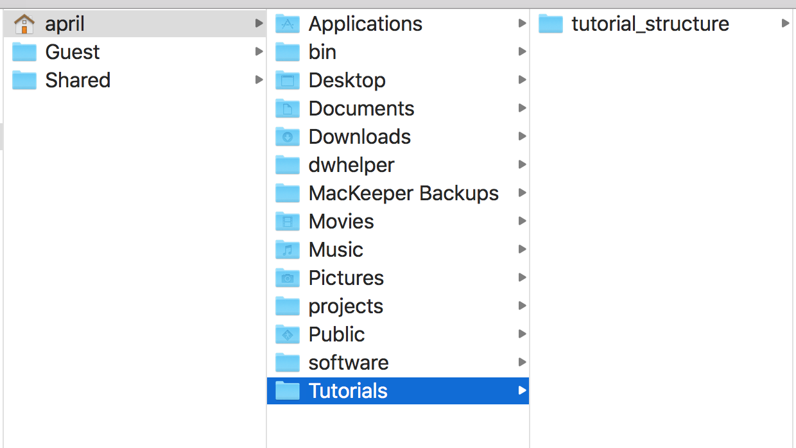
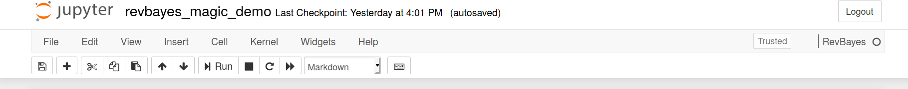



This tutorial covers how to set up files and directories to work effectively in RevBayes .
This workshop assumes no familiarity with the command line, or programming in general.
The themes of good directory structuring shown in this tutorial will be used in many other RevBayes tutorials.  






Many of the RevBayes tutorials will as you to download data and/or scripts.
Let us begin by downloading the data and scripts associated with this tutorial.
For each tutorial that you do, you should create a _directory_, sometimes called a folder, somewhere logical on your computer.
Since we are doing the `tutorial_structure` tutorial, please title your directory `tutorial_structure`.
In this new directory, create two more directories, one called _data_ and one called _scripts_.

You will note a box called `Data files and scripts` in the upper left-hand corner of this webpage.
Please download the files listed in this directory.
Drag and drop `example_file.nex` into your `data` directory.
Then, move `test.Rev` into your `scripts` directory.
Having a directory of data that contains all your data for a project, and a directory of scripts is a good practice.
This allows you to stay organized and avoid misplacing crucial scripts in your data analysis pipeline.



Most scientific programming languages and software does not deal well with spaces in file names.
If you will be doing much scientific computing, it will be best to get in the habit of not using spaces in file and folder names.





In this section of the tutorial, we will focus on running RevBayes from your computer's graphical interface.
First, note down the location of your tutorial directory.
For example, mine is in my computer's user home, in a directory called `Tutorials`.
A graphic of this is shown in Fig. 1.


Computers do not understand the visual information of the directory structure.
Instead, we will translate this information into text.




This is an example of the Macintosh File Viewer. In this instance, I have a directoy, `Tutorials` with a subdirectory for this specific tutorial.






The home directory on a computer on a Mac is labeled with a `~/`.
Each contained directory is separated by a `/` character.
The above directory structure would be written out like so:

```
~/tutorials/tutorial_structure/
```
{:.bash}

Note down where you have your tutorial stored.

Next, we will launch RevBayes.
Do this by double-clicking on `rb`.
We will now set your working directory.
This ensures that RevBayes is aware of where in your computer your code and data are stored.
By default, RevBayes assumes you are in your user home on your computer.
Therefore, we can leave off the `~/`, as RevBayes will assume its presence.
In RevBayes, use the `setwd()` command in conjunction with your path to your tutorial to set your working directory.
For example, my command will look like so:

```
setwd("Tutorials/tutorial_structure/")
```
{:.bash}

Finally, test your working directory like so:

```
 source("scripts/test.Rev")
```

If everything has suceeded, you will see the following output:


```
   Processing file "scripts/test.Rev"
   Hi there! Welcome to RevBayes! I am now going to read in some test data.
   Successfully read one character matrix from file 'data/primates_and_galeopterus_cytb.nex'
   Congratulations, you set up your scripts and code directories correctly.
```
{:.Rev-output}


If you were not able to successfully execute the script, the most common culprit is that RevBayes is not executing from where you think. Try running getwd() and making sure that your starting working directory is what you think it is.




The home directory on a computer on a Windows is labeled as `c:`.
Each contained directory is separated by a `\\` character.
The above directory structure would be written out like so:

```
"c:\\april\\tutorials\\tutorial_structure"
```
{:.bash}

Note down where you have your tutorial stored.

Next, we will launch RevBayes.
Do this by double-clicking on `rb`.
We will now set your working directory.
This ensures that RevBayes is aware of where in your computer your code and data are stored.
In RevBayes, use the `setwd()` command in conjunction with your path to your tutorial to set your working directory.
For example, my command will look like so:

```
setwd("c:\\april\\tutorials\\tutorial_structure")
```

Finally, test your working directory like so:

```
 source("scripts/test.Rev")
```

If everything has suceeded, you will see the following output:


```
   Processing file "scripts/test.Rev"
   Hi there! Welcome to RevBayes! I am now going to read in some test data.
   Successfully read one character matrix from file 'data/primates_and_galeopterus_cytb.nex'
   Congratulations, you set up your scripts and code directories correctly.
```
{:.Rev-output}



Linux users must access RevBayes via the command line interface.




Many RevBayes users may want to use RevBayes from the `command-line interface`.
This technology allows users to interact directly with the computer's file system.
It is the predominant way many remote servers and supercomputers are used.


Linux and Macintosh users have a command line interface by default on their machines. Windows users will have to install one. A common command line interface is [Git For Windows](https://gitforwindows.org/).





Many of the RevBayes tutorials will as you to download data and/or scripts.
Let us begin by downloading the data and scripts associated with this tutorial.
For each tutorial that you do, you should create a _directory_, sometimes called a folder, somewhere logical on your computer.
Since we are doing the `tutorial_structure` tutorial, please title your directory `tutorial_structure`.
In this new directory, create two more directories, one called _data_ and one called _scripts_.


Most scientific programming languages and software does not deal well with spaces in file names.
If you will be doing much scientific computing, it will be best to get in the habit of not using spaces in file and folder names.


You will note a box called `Data files and scripts` in the upper left-hand corner of this webapge.
Please download the files listed in this directory.
Drag and drop `primates_and_galeopterus_cytb.nex` into your `data` directory.
Then, move `test.Rev` into your `scripts` directory.

Having a directory of data that contains all your data for a project, and a directory of scripts is a good practice.
This allows you to stay organized and avoid misplacing crucial scripts in your data analysis pipeline.



In this section of the tutorial, we will focus on running RevBayes from your computer's graphical interface.
First, note down the location of your tutorial directory.
For example, mine is in my laptop's shared drive, in a directory called `tutorials`.
This can be seen in 

Computers do not understand the visual information of the directory structure.
Instead, we will translate this information into text.




This is an example of the Macintosh File Viewer. In this instance, I have a directoy, `tutorials` with a subdirectory for this specific tutorial.






The home directory on a computer on in a terminal is labeled with a `~/`.
Each contained directory is separated by a `/` character.
The above directory structure would be written out like so:

```
~/Tutorials/tutorial_structure/
```
{:.bash}

Open your terminal application. Change directories into the tutorial directory with  the terminal's `cd` command. For example, my command will be:

```
cd ~/Tutorials/tutorial_structure/
```


Next, we will launch RevBayes. First, note where RevBayes is stored on your computer.

For example, my copy of RevBayes is stored a software directory in my user home.
Therefore, to launch my RevBayes, I will type:
```
~/software/rb
```

Finally, test your working directory like so:

```
 source("scripts/test.Rev")
```

If everything has suceeded, you will see the following output:


```
   Processing file "scripts/test.Rev"
   Hi there! Welcome to RevBayes! I am now going to read in some test data.
   Successfully read one character matrix from file 'data/primates_and_galeopterus_cytb.nex'
   Congratulations, you set up your scripts and code directories correctly.
```
{:.Rev-output}



The `System Path` tells your computer default locations to look for pieces of software.
If a piece of software is added to the path, it can be found and launched from anywhere on the computer.
This is beyond the scope of this tutorial, but information is readily available on doing this from other sources. If RevBayes is in your path, it can be executed by simply typing `rb` on Windows or `./rb` on Mac or Linux.





We will first launch RevBayes.
Open your terminal application.
See the aside `Command Line on Windows` for more information on this point.
Note where RevBayes is stored on your computer.

For example, my copy of RevBayes is stored a software directory in my user home.
Therefore, to launch my RevBayes, I will type:
```
~/software/rb
```

Next, we will set our working directory.
Windows will not pick up file paths from the environment in the same way Mac and Linux will.
Therefore, we will need to write out our directories, separated by `\\` characters.
My tutorial directory, as shown in Figure 1, will be written out as:

```
setwd("c:\\april\\tutorials\\tutorial_structure")
```


Finally, test your working directory like so:

```
 source("scripts/test.Rev")
```

If everything has succeeded, you will see the following output:


```
   Processing file "scripts/test.Rev"
   Hi there! Welcome to RevBayes! I am now going to read in some test data.
   Successfully read one character matrix from file 'data/primates_and_galeopterus_cytb.nex'
   Congratulations, you set up your scripts and code directories correctly.
```
{:.Rev-output}




R is a fairly common computing language in biology.
RevBayes users may want to use RevBayes through RStudio , a popular graphical interface for R.
In this section of the tutorial, we will focus on running RevBayes from RStudio. Once you've followed the RStudio instructions on the [installs page](https://revbayes.github.io/gui-setup), you can run use Rev language as you would in a standard RMarkown document.



Revticulate can be installed in two ways.
Both will assume a working installation of R and (optionally) RStudio.
The first is via CRAN, using the default `install.packages` function in R:


```{r}
install.packages("Revticulate")
```

The second is via the remotes package, a lightweight package enabling installation from GitHub repositories.


```{r}
remotes::install_github("revbayes/Revticulate")
```

 The GitHub repository for Revticulate contains cutting-edge features and may contain bugfixes, but the CRAN is known to be stable for everyday use.

 To begin using your Revticulate package in R, in an RMarkdown chunk, type:

 ```{r}
 library(Revticulate)
 knitRev()
 ```

When you execute this chunk, Revticulate will run a package check.
This check searches for and .Renviron file that contains a RevBayes path. If the package doesn’t find this file, or finds it without the path, the package prompts the user to use `usethis::edit_r_environ()`. This opens the .Renviron file, and the user will enter `rb={absolute path to revbayes}`. This can be edited at any time if there are multiple installs on the system, or if you recompile RevBayes and want to use a new version.

First, we will test that RevBayes is accessible to us. RevBayes can be used in a KnitR chunk by changing the header to `rb` instead of `r`. If you are unsure how to edit a chunk to have the proper type, the test.Rmd file in this tutorial provides examples. In the below chunk, we create an object called example and use the assignment operator to give it the value 1. Then we print it. This will fail if RevBayes cannot be found. If this is the case, check that the path in your Renviron goes to RevBayes, and restart.

````
```{rb}
variable <- "Hi there! Welcome to RevBayes! I am now going to read in some test data."
variable
```
````
Next, we will attempt to read in some data. Use the `setwd()` command to ensure that you are in the directory for this tutorial.

````
```{rb}
molecular_data <- readDiscreteCharacterData("data/example_file.nex")
molecular_data
```
````
If you get an error such as `rb not found`, make sure you executed this block:

````
```{r}
library(Revticulate)
knitRev()
```
````




Jupyter  is a popular interface for programming in python, though it implements numerous other languages. Once you have completed the instructions on the [installs page](https://revbayes.github.io/gui-setup), you will be able to choose RevBayes as a possible language. An example of this is below.




This is a Jupyter notebook with the language set to Rev.




Once the language is set to Rev, all cells in the notebook will execute using RevBayes. Example notebooks can be found in the [notebooks](https://github.com/revbayes/RevNotebooks) repository.
